# Лекційна записка 1: Вступ до статистики

## Зміст

1. [Вступ до статистики](#1-вступ-до-статистики)
2. [Типи даних та робота з ними в Python](#2-типи-даних-та-робота-з-ними-в-python)
3. [Поняття генеральної сукупності та вибірки](#3-поняття-генеральної-сукупності-та-вибірки)
4. [Варіаційний ряд](#4-варіаційний-ряд)
5. [Дискретні та інтервальні розподіли](#5-дискретні-та-інтервальні-розподіли)
6. [Емпірична функція розподілу](#6-емпірична-функція-розподілу)
7. [Основи роботи з даними в Python: NumPy](#7-основи-роботи-з-даними-в-python-numpy)
8. [Основи роботи з даними в Python: Pandas](#8-основи-роботи-з-даними-в-python-pandas)
9. [Корисні посилання](#9-корисні-посилання)

---

## 1. Вступ до статистики

Статистика — це фундаментальна математична дисципліна, яка вивчає методи збору, обробки, аналізу та інтерпретації даних. У сучасному світі, де обсяги інформації зростають експоненціально, статистичні методи є основою для прийняття обґрунтованих наукових, інженерних та бізнес-рішень.

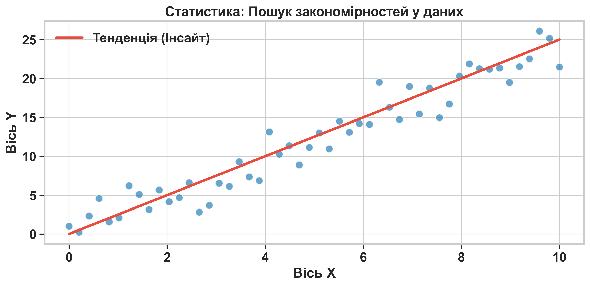

Основна мета статистичної обробки даних полягає у виявленні закономірностей у масивах спостережень, які на перший погляд здаються хаотичними. Завдяки статистиці ми можемо оцінювати параметри систем, перевіряти гіпотези та здійснювати прогнозування.

Традиційно статистику поділяють на два великі розділи: описову (дескриптивну) та інференційну (аналітичну). Описова статистика займається стисненням та візуалізацією даних, тоді як інференційна — перенесенням висновків з частини даних на всю досліджувану систему.

Для роботи зі статистикою в сучасному середовищі найчастіше використовується мова програмування Python. Вона має багату екосистему бібліотек, спеціально розроблених для числових обчислень та аналізу даних.

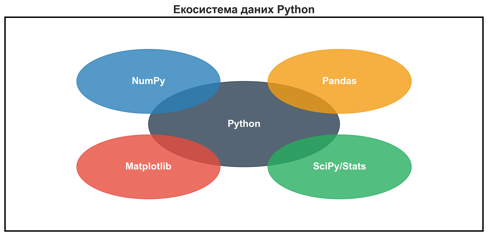

Перед початком роботи необхідно імпортувати базові бібліотеки. Ми використаємо стандартний набір інструментів аналітика даних.

```python
# Блок 1: Імпорт базових бібліотек
import numpy as np
import pandas as pd
import math
```

```python
# Блок 2: Перевірка версій бібліотек (рекомендована практика)
print(f"NumPy version: {np.__version__}")
print(f"Pandas version: {pd.__version__}")
```

У статистиці часто доводиться працювати з константами та базовими математичними функціями. Модуль `math` надає доступ до основних математичних операцій.

```python
# Блок 3: Використання констант
pi_value = math.pi
e_value = math.e
print(f"Pi: {pi_value:.4f}, Euler's number: {e_value:.4f}")
```

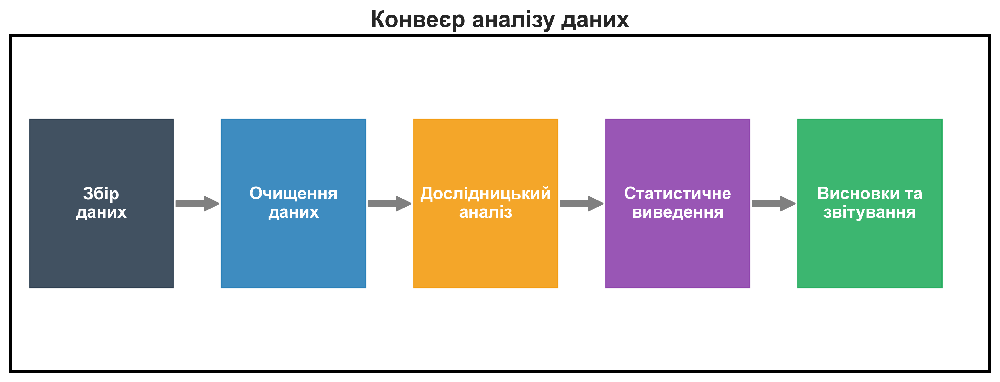

Для демонстрації базових статистичних обчислень створимо простий масив числових даних, який імітуватиме результати спостережень.

```python
# Блок 4: Створення базового списку спостережень
observations =[12.5, 14.1, 10.8, 15.2, 13.7]
print("Спостереження:", observations)
```

Загальна кількість спостережень у масиві є першим кроком до розуміння обсягу даних, з якими працює дослідник.

```python
# Блок 5: Обчислення кількості елементів
n_obs = len(observations)
print("Кількість спостережень (n):", n_obs)
```

Найпростішою описовою статистикою є сума всіх значень, яка згодом використовується для розрахунку середнього арифметичного.

```python
# Блок 6: Розрахунок суми
total_sum = sum(observations)
print("Сума значень:", total_sum)
```

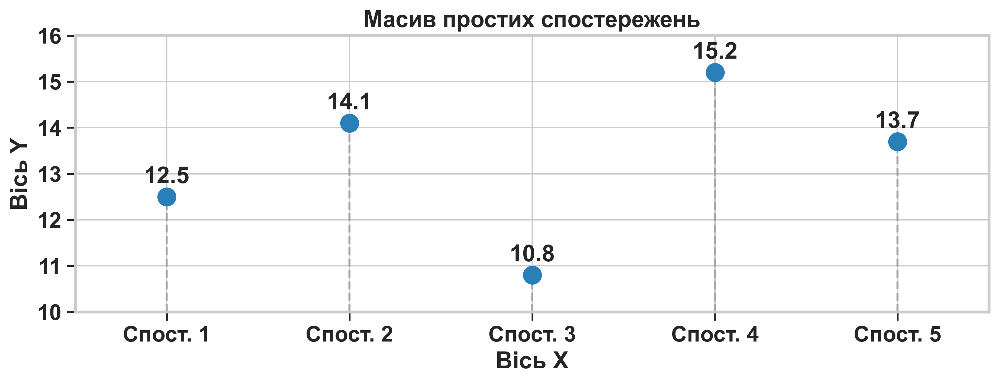

## 2. Типи даних та робота з ними в Python

Дані, які підлягають статистичній обробці, класифікуються за кількома критеріями. Фундаментальним є поділ даних на кількісні (числові) та якісні (категоріальні). Правильна ідентифікація типу даних визначає коректність вибору статистичних методів.

Кількісні дані відображають вимірювання або підрахунок. Вони, у свою чергу, поділяються на неперервні (можуть набувати будь-якого значення в певному діапазоні, наприклад, вага, час) та дискретні (приймають лише ізольовані значення, зазвичай цілі числа, наприклад, кількість студентів у групі).

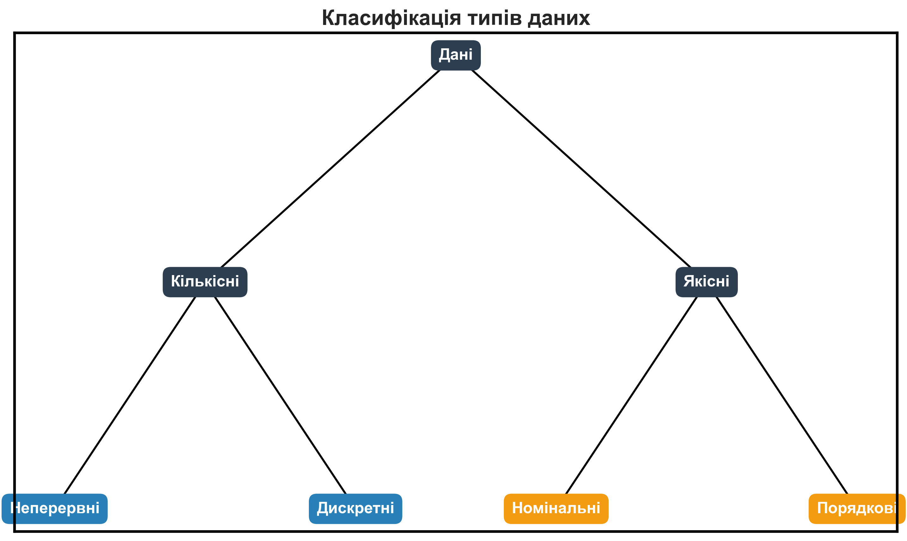

Якісні дані описують властивості або категорії. Їх поділяють на номінальні (категорії без природного порядку, наприклад, колір очей) та порядкові (категорії, які можна впорядкувати, наприклад, рівень освіти: бакалавр, магістр, доктор філософії).

У мові програмування Python існують вбудовані типи даних, які відповідають базовим статистичним типам. Для кількісних неперервних даних використовується `float`, для дискретних — `int`, а для якісних — `str` або спеціальні категоріальні типи в бібліотеці Pandas.

| Статистичний тип | Підтип | Тип в Python (базовий) | Приклад |
|---|---|---|---|
| Кількісні | Неперервні | `float` | 3.14, 2.718 |
| Кількісні | Дискретні | `int` | 5, 100 |
| Якісні | Номінальні | `str` | "Червоний", "Україна" |
| Якісні | Порядкові | `str` / `Categorical` | "Низький", "Середній" |

Розглянемо створення змінних різних типів у Python та ідентифікацію їхнього типу за допомогою вбудованої функції `type()`.

```python
# Блок 7: Дискретні кількісні дані (int)
discrete_var = 42
print(f"Значення: {discrete_var}, Тип: {type(discrete_var)}")
```

```python
# Блок 8: Неперервні кількісні дані (float)
continuous_var = 3.14159
print(f"Значення: {continuous_var}, Тип: {type(continuous_var)}")
```

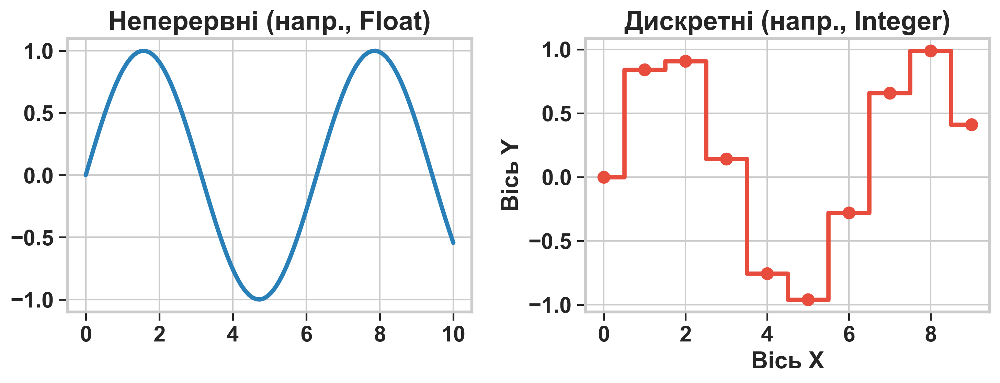

Для роботи з якісними даними ми найчастіше оперуємо рядками. У статистиці такі дані часто кодуються числами для зручності обробки алгоритмами.

```python
# Блок 9: Номінальні якісні дані (str)
nominal_var = "Київ"
print(f"Значення: {nominal_var}, Тип: {type(nominal_var)}")
```

```python
# Блок 10: Зберігання змішаних типів у списку
mixed_data =[10, 15.5, "Високий", "Низький", 8]
print("Список зі змішаними даними:", mixed_data)
```

Бібліотека Pandas надає потужний інструмент для роботи з якісними порядковими даними — тип `Categorical`. Він дозволяє економити пам'ять та вбудовувати логіку порівняння.

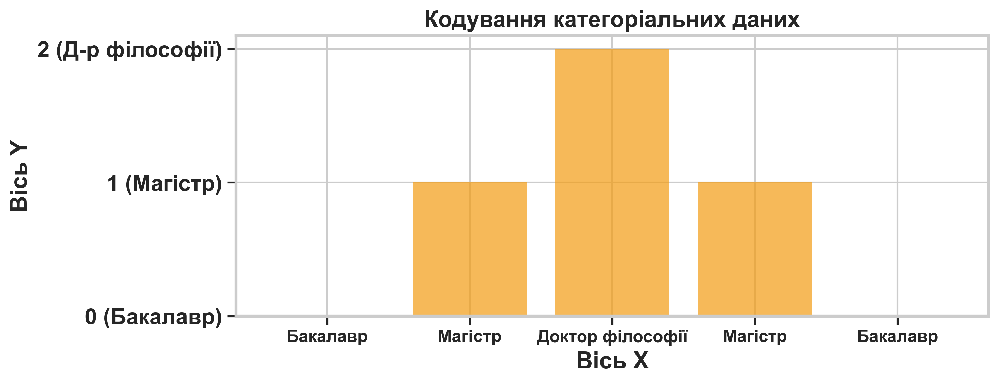

```python
# Блок 11: Створення категоріальних даних у Pandas
education_levels = pd.Series(["Бакалавр", "Магістр", "Школяр", "Магістр"])
cat_education = education_levels.astype("category")
print(cat_education)
```

Коли ми перетворюємо дані на категоріальні, ми можемо переглянути унікальні категорії, які існують у нашому наборі даних.

```python
# Блок 12: Отримання унікальних категорій
print("Унікальні категорії:", cat_education.cat.categories.tolist())
```

Крім того, порядковим даним можна задати суворий порядок сортування, що корисно для подальшого аналізу.

```python
# Блок 13: Завдання логічного порядку категоріям
ordered_cats = pd.Categorical(["Бакалавр", "Магістр", "Школяр", "Магістр"], 
                              categories=["Школяр", "Бакалавр", "Магістр"], 
                              ordered=True)
print("Впорядковані категорії:", ordered_cats)
```

```python
# Блок 14: Перевірка впорядкованості
print("Чи є дані впорядкованими?", ordered_cats.ordered)
```

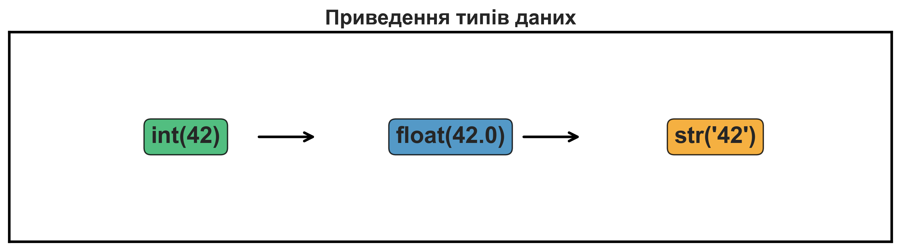

## 3. Поняття генеральної сукупності та вибірки

Генеральна сукупність (population) — це повна множина всіх об'єктів або спостережень, які є предметом статистичного дослідження. Параметри генеральної сукупності зазвичай позначаються грецькими літерами: $\mu$ для середнього, $\sigma^2$ для дисперсії.

На практиці дослідити всю генеральну сукупність майже ніколи неможливо через фінансові, часові або фізичні обмеження. Тому дослідники витягують із неї підмножину, яка називається вибіркою (sample).

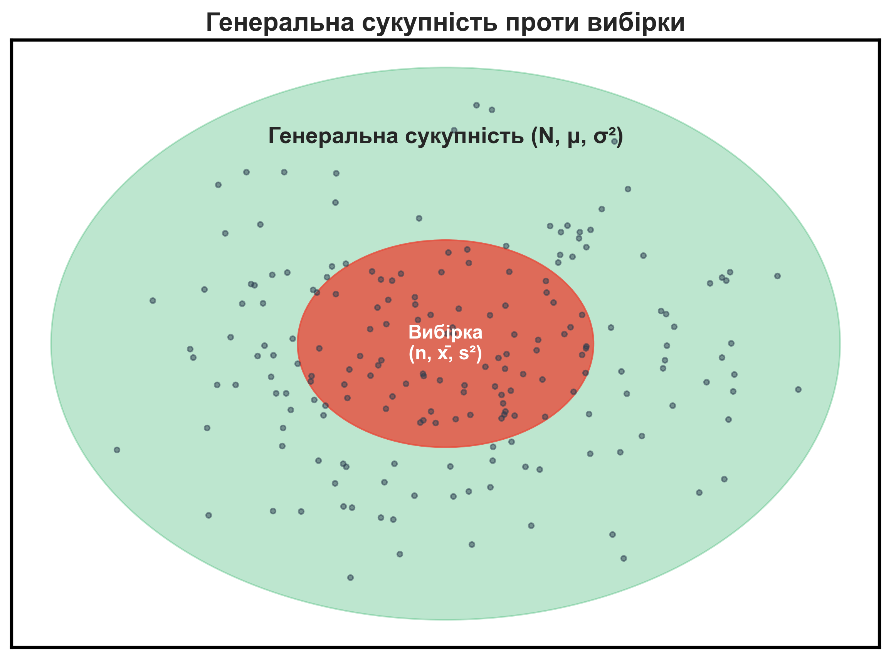

Характеристики вибірки позначаються латинськими літерами (наприклад, $\bar{x}$ для вибіркового середнього, $s^2$ для вибіркової дисперсії). Вибіркове середнє розраховується за формулою:
$$ \bar{x} = \frac{1}{n} \sum_{i=1}^{n} x_i $$
де $n$ — обсяг вибірки.

Ключовою вимогою до вибірки є її репрезентативність — здатність адекватно відображати властивості генеральної сукупності. Репрезентативність досягається переважно за рахунок випадкового відбору (рандомізації), де кожен елемент сукупності має однакову ймовірність потрапити до вибірки.

| Характеристика | Генеральна сукупність | Вибірка |
|---|---|---|
| Визначення | Всі можливі елементи | Підмножина елементів |
| Обсяг | $N$ (часто $\infty$) | $n$ (завжди скінченний) |
| Середнє | $\mu$ | $\bar{x}$ |
| Дисперсія | $\sigma^2$ | $s^2$ |

Застосуємо Python для моделювання генеральної сукупності. Згенеруємо великий масив даних, що імітує популяцію.

```python
# Блок 15: Створення генеральної сукупності (Population)
np.random.seed(42) # Фіксуємо seed для відтворюваності
population = np.random.normal(loc=50.0, scale=10.0, size=100000)
print(f"Розмір генеральної сукупності: {len(population)}")
```

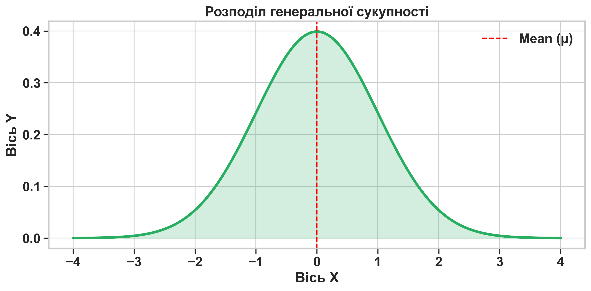

Тепер обчислимо справжнє середнє значення нашої змодельованої генеральної сукупності (істинний параметр $\mu$).

```python
# Блок 16: Справжнє середнє генеральної сукупності (mu)
mu_true = np.mean(population)
print(f"Справжнє середнє (mu): {mu_true:.4f}")
```

Із цієї сукупності вилучимо просту випадкову вибірку обсягом 100 елементів за допомогою функції `np.random.choice`.

```python
# Блок 17: Простий випадковий відбір (Simple Random Sampling)
sample = np.random.choice(population, size=100, replace=False)
print(f"Розмір вибірки: {len(sample)}")
```

Обчислимо вибіркове середнє ($\bar{x}$) та порівняємо його з істинним параметром. Вони будуть близькими, але не ідентичними через похибку репрезентативності.

```python
# Блок 18: Вибіркове середнє (x_bar)
x_bar = np.mean(sample)
print(f"Вибіркове середнє (x_bar): {x_bar:.4f}")
print(f"Похибка: {abs(mu_true - x_bar):.4f}")
```

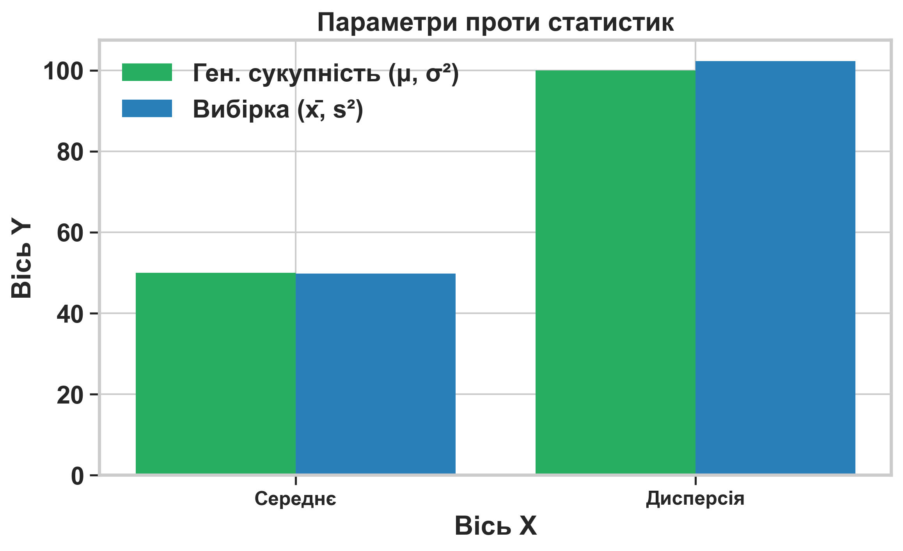

Також можна змоделювати систематичний відбір, коли елементи обираються з певним кроком $k$. Це ще один метод формування вибірки.

```python
# Блок 19: Систематичний відбір
k_step = len(population) // 100
systematic_sample = population[::k_step][:100]
print("Вибіркове середнє (систематична):", np.mean(systematic_sample).round(4))
```

Для обчислення незміщеної вибіркової дисперсії $s^2$ у математичній статистиці суму квадратів відхилень ділять на $n-1$, а не на $n$.

```python
# Блок 20: Вибіркова дисперсія (з поправкою Бесселя)
sample_var = np.var(sample, ddof=1)
print(f"Вибіркова незміщена дисперсія (s^2): {sample_var:.4f}")
```

```python
# Блок 21: Дисперсія генеральної сукупності (без поправки)
pop_var = np.var(population, ddof=0)
print(f"Дисперсія генеральної сукупності (sigma^2): {pop_var:.4f}")
```

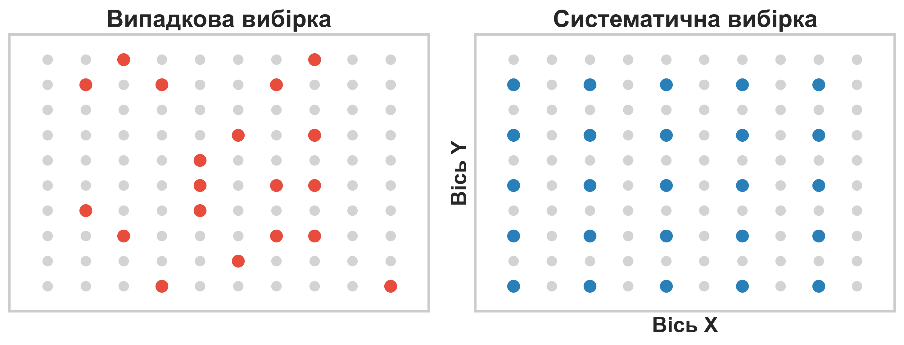

## 4. Варіаційний ряд

Першим кроком впорядкування та первинної обробки отриманої вибірки є побудова варіаційного ряду. Варіаційний ряд — це послідовність значень вибірки, розташованих у порядку незростання або неспадання.

Якщо маємо вихідну вибірку $x_1, x_2, \dots, x_n$, то після сортування за зростанням отримуємо порядкові статистики, які позначаються як:
$$ x_{(1)} \le x_{(2)} \le \dots \le x_{(n)} $$
де $x_{(1)}$ — мінімальне значення вибірки, а $x_{(n)}$ — максимальне.

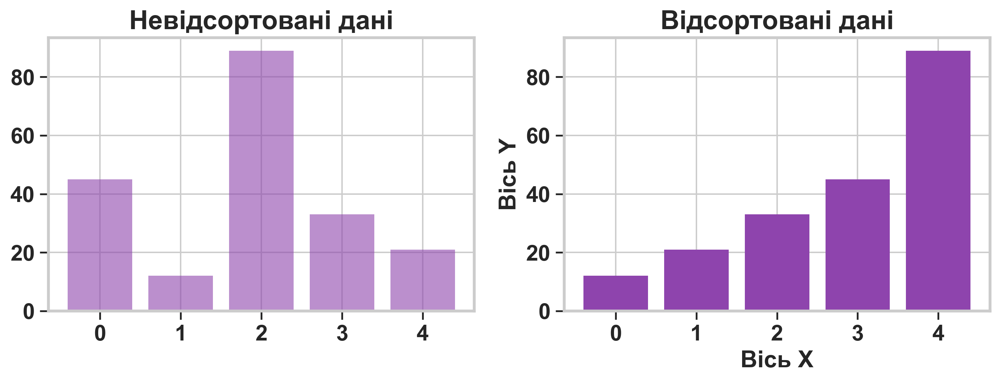

Варіаційний ряд є основою для знаходження структурних середніх: медіани (значення, що ділить варіаційний ряд навпіл) та квантилів (значень, що ділять ряд у певній пропорції). Також він дозволяє легко визначити розмах вибірки $R = x_{(n)} - x_{(1)}$.

У випадку великого обсягу вибірки будують згрупований (інтервальний) варіаційний ряд. Для цього весь діапазон значень розбивають на певну кількість часткових інтервалів і підраховують частоту потрапляння спостережень у кожен інтервал.

Продемонструємо створення варіаційного ряду на невеликому зразку випадкових чисел.

```python
# Блок 22: Створення невеликої несортованої вибірки
raw_data = np.array([45, 12, 89, 33, 21, 56, 12, 78])
print("Вихідні дані:", raw_data)
```

Вбудована функція `np.sort` дозволяє миттєво згенерувати варіаційний ряд за неспаданням.

```python
# Блок 23: Побудова варіаційного ряду
variation_series = np.sort(raw_data)
print("Варіаційний ряд:", variation_series)
```

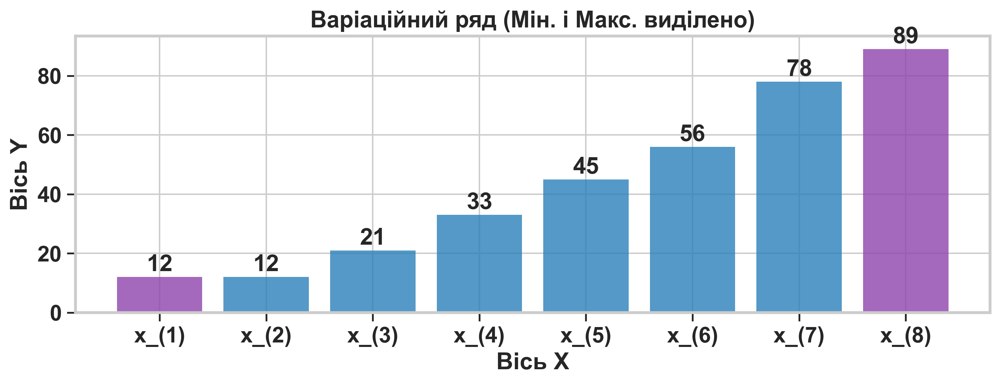

Отримавши варіаційний ряд, ми можемо виділити екстремальні значення — першу та останню порядкові статистики.

```python
# Блок 24: Екстремальні значення (мінімум та максимум)
x_min = variation_series[0]
x_max = variation_series[-1]
print(f"x_(1) = {x_min}, x_(n) = {x_max}")
```

Розмах вибірки є найпростішою мірою розсіяння даних, яка розраховується як різниця між максимумом і мінімумом.

```python
# Блок 25: Розрахунок розмаху вибірки (Range)
sample_range = x_max - x_min
print(f"Розмах вибірки (R): {sample_range}")
```

Медіана знаходиться посередині варіаційного ряду. У Python її зручно рахувати спеціальною функцією.

```python
# Блок 26: Обчислення медіани
median_val = np.median(variation_series)
print(f"Медіана (Me): {median_val}")
```

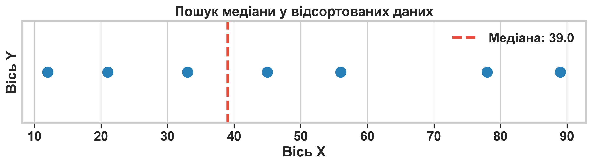

Для побудови інтервального варіаційного ряду скористаємося функцією `np.histogram`, яка розбиває дані на інтервали (біни) та рахує частоти.

```python
# Блок 27: Побудова інтервального варіаційного ряду
frequencies, bin_edges = np.histogram(raw_data, bins=3)
print("Межі інтервалів:", bin_edges)
```

```python
# Блок 28: Частоти для кожного інтервалу
print("Частоти по інтервалах:", frequencies)
```

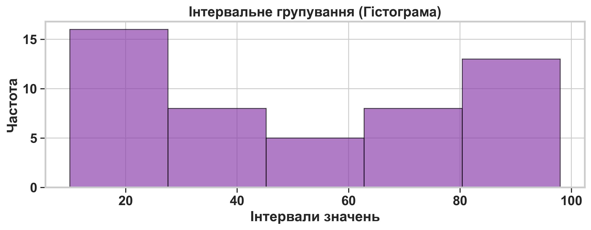

## 5. Дискретні та інтервальні розподіли

Поняття статистичного розподілу є центральним у теорії ймовірностей та статистиці. Розподіл показує, які значення може приймати випадкова величина та з якими ймовірностями (або частотами у випадку емпіричних даних).

Для дискретних випадкових величин розподіл задається функцією маси ймовірності (Probability Mass Function, PMF): $P(X = x_i) = p_i$. Сума всіх ймовірностей $p_i$ обов'язково дорівнює одиниці. Характерними прикладами є біноміальний розподіл та розподіл Пуассона.

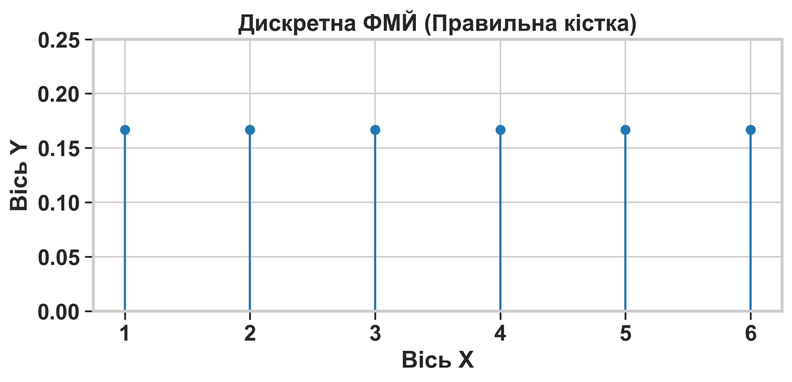

Для неперервних величин імовірність прийняти конкретне значення дорівнює нулю. Тому використовують функцію щільності ймовірності (Probability Density Function, PDF), позначається $f(x)$. Вона має задовольняти умовам:

1. $f(x) \ge 0$ для всіх $x$;
2. $\int_{-\infty}^{\infty} f(x) dx = 1$.
Імовірність того, що величина потрапить в інтервал $[a, b]$, обчислюється як інтеграл від щільності на цьому інтервалі. Найвідомішим неперервним розподілом є нормальний (гауссівський).

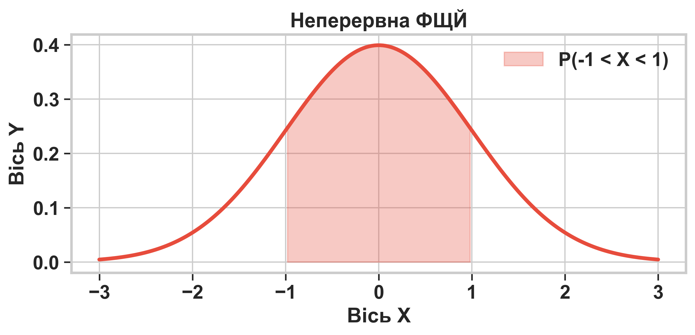

На практиці, коли ми маємо вибірку, ми не знаємо істинного теоретичного розподілу. Замість нього будують емпіричні (інтервальні) розподіли у вигляді гістограм. Гістограма графічно відображає інтервальний варіаційний ряд, де площа стовпчиків пропорційна частоті потрапляння спостережень у відповідний інтервал.

Для роботи з теоретичними розподілами в Python широко застосовується модуль `numpy.random`. Згенеруємо дані з біноміального розподілу (дискретний випадок).

```python
# Блок 29: Генерація з біноміального розподілу (n=10, p=0.5)
binomial_data = np.random.binomial(n=10, p=0.5, size=1000)
print("Перші 10 значень біноміальної вибірки:", binomial_data[:10])
```

Для аналізу дискретного розподілу підрахуємо унікальні значення та їхні частоти у згенерованій вибірці.

```python
# Блок 30: Підрахунок частот для дискретних даних
unique_vals, counts = np.unique(binomial_data, return_counts=True)
print("Значення:", unique_vals)
```

```python
# Блок 31: Відносні частоти (емпіричні ймовірності)
relative_freqs = counts / len(binomial_data)
print("Відносні частоти:", relative_freqs.round(3))
```

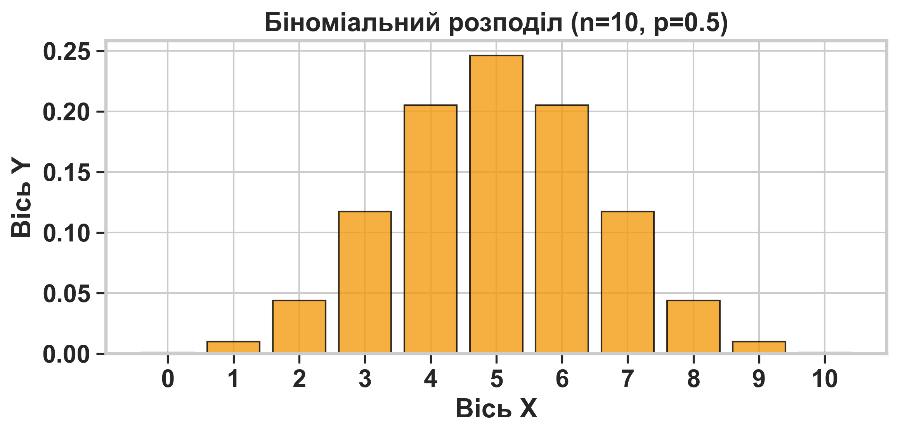

Тепер згенеруємо дані з неперервного рівномірного розподілу на відрізку $[0, 10]$.

```python
# Блок 32: Генерація рівномірного неперервного розподілу
uniform_data = np.random.uniform(low=0.0, high=10.0, size=1000)
print("Мінімум:", uniform_data.min().round(2), "Максимум:", uniform_data.max().round(2))
```

Для неперервних даних ми формуємо інтервальний розподіл за допомогою гістограми. Розділимо діапазон на 10 рівних інтервалів.

```python
# Блок 33: Створення інтервального розподілу (Гістограма)
hist_counts, hist_bins = np.histogram(uniform_data, bins=10)
print("Частоти гістограми:", hist_counts)
```

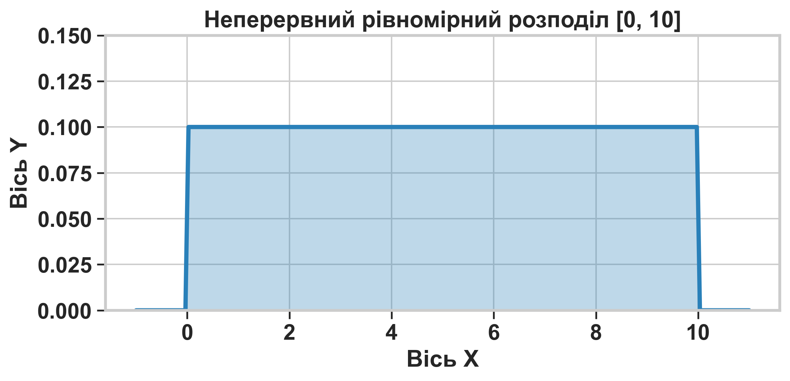

Нормальний розподіл є фундаментальним завдяки центральній граничній теоремі. Згенеруємо стандартизовану нормальну вибірку.

```python
# Блок 34: Стандартний нормальний розподіл (mu=0, sigma=1)
normal_data = np.random.standard_normal(size=5000)
print("Середнє:", np.mean(normal_data).round(4))
```

Якщо ми перетворимо частоти гістограми нормального розподілу на щільності (встановивши `density=True`), площа всіх стовпчиків дорівнюватиме 1.

```python
# Блок 35: Емпірична щільність
densities, edges = np.histogram(normal_data, bins=20, density=True)
print("Перші 5 значень щільності:", densities[:5].round(4))
```

```python
# Блок 36: Перевірка умови нормування (сума площ стовпчиків)
bin_widths = np.diff(edges)
total_area = np.sum(densities * bin_widths)
print(f"Загальна площа гістограми щільності: {total_area:.2f}")
```

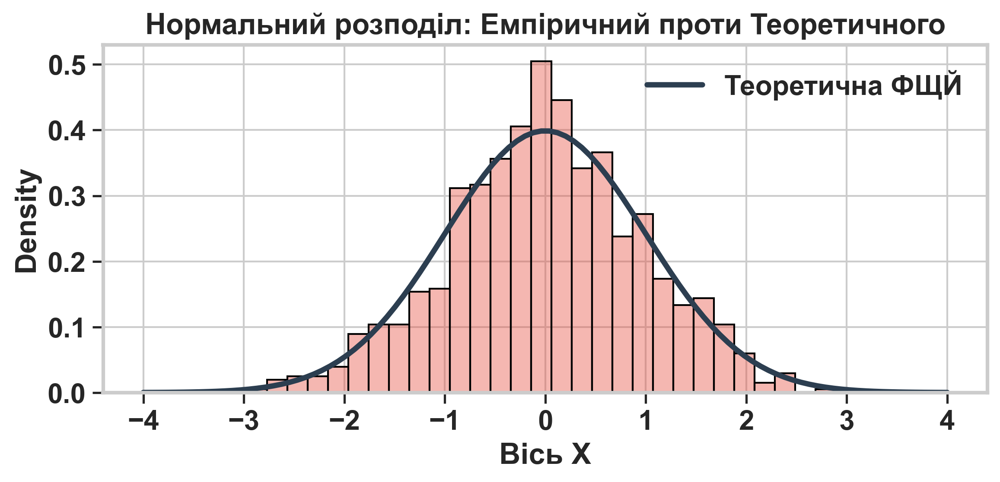

## 6. Емпірична функція розподілу

Теоретична кумулятивна функція розподілу (Cumulative Distribution Function, CDF) позначається як $F(x)$ і визначає ймовірність того, що випадкова величина $X$ набуде значення, меншого або рівного $x$:
$$ F(x) = P(X \le x) $$

Оскільки для вибірки істинна $F(x)$ невідома, будується її статистичний аналог — емпірична функція розподілу (Empirical Cumulative Distribution Function, ECDF). Вона розраховується як частка елементів вибірки, що не перевищують заданого значення $x$.

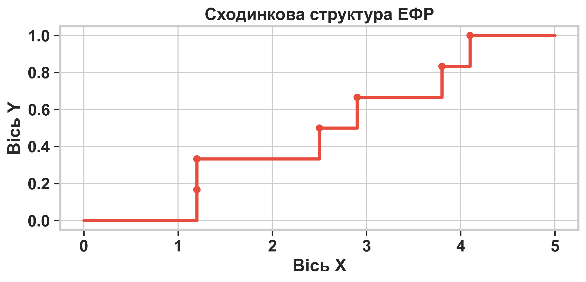

Математично ECDF $\hat{F}_n(x)$ для вибірки обсягом $n$ визначається формулою:
$$ \hat{F}_n(x) = \frac{1}{n} \sum_{i=1}^{n} I(X_i \le x) $$
де $I(X_i \le x)$ — індикаторна функція, яка дорівнює 1, якщо умова виконується, і 0 в іншому разі.

Згідно з фундаментальною теоремою Глівенка-Кантеллі, при $n \to \infty$ емпірична функція розподілу $\hat{F}_n(x)$ рівномірно сходиться до теоретичної $F(x)$. Графік ECDF має вигляд східчастої функції, яка зростає від 0 до 1, роблячи "стрибок" величиною $1/n$ у кожному унікальному значенні вибірки.

Реалізуємо обчислення ECDF на Python з нуля, крок за кроком. Для цього спершу потрібно впорядкувати дані.

```python
# Блок 37: Підготовка даних для ECDF
sample_for_ecdf = np.array([2.5, 1.2, 3.8, 1.2, 4.1, 2.9])
sorted_sample = np.sort(sample_for_ecdf)
print("Відсортована вибірка:", sorted_sample)
```

Значення по осі ординат (y) для ECDF — це рівномірно розподілені точки від $1/n$ до $1$.

```python
# Блок 38: Обчислення кумулятивних частот (вісь Y)
n_ecdf = len(sorted_sample)
y_ecdf = np.arange(1, n_ecdf + 1) / n_ecdf
print("Значення ECDF (кумулятивні ймовірності):", y_ecdf.round(3))
```

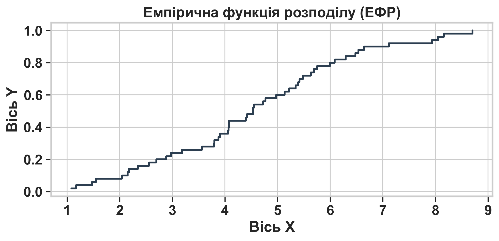

Для оцінки ECDF у будь-якій довільній точці $x$ необхідно підрахувати, скільки елементів вибірки менші або дорівнюють цьому $x$.

```python
# Блок 39: Функція для розрахунку ECDF в точці x
def evaluate_ecdf(x, data):
    return np.sum(data <= x) / len(data)

# Тестуємо функцію
test_x = 3.0
print(f"F^({test_x}) = {evaluate_ecdf(test_x, sample_for_ecdf):.3f}")
```

Перевіримо крайні точки емпіричної функції: для значень, менших за мінімум вибірки, ECDF дорівнює 0, а для значень, більших за максимум — 1.

```python
# Блок 40: ECDF для екстремальних точок
print(f"F^(0.0) = {evaluate_ecdf(0.0, sample_for_ecdf)}")
print(f"F^(5.0) = {evaluate_ecdf(5.0, sample_for_ecdf)}")
```

Використовуючи векторизацію в NumPy, ми можемо ефективно застосувати цю логіку до масиву точок (наприклад, для подальшої побудови графіка).

```python
# Блок 41: Векторизоване обчислення ECDF
x_grid = np.array([1.0, 2.0, 3.0, 4.0, 5.0])
ecdf_values = np.array([evaluate_ecdf(xi, sample_for_ecdf) for xi in x_grid])
print("ECDF на сітці x:", ecdf_values)
```

```python
# Блок 42: Порівняння ECDF з процентилями
percentile_50 = np.percentile(sample_for_ecdf, 50)
print(f"Медіана (50-й процентиль): {percentile_50}")
print(f"Значення ECDF у медіані: {evaluate_ecdf(percentile_50, sample_for_ecdf)}")
```

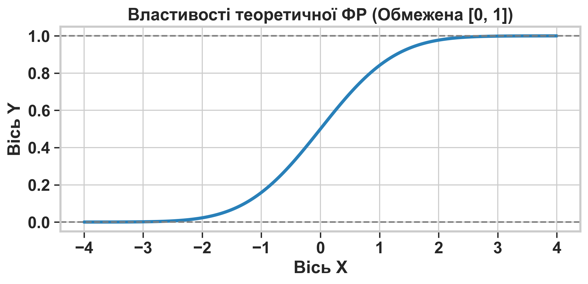

## 7. Основи роботи з даними в Python: NumPy

Бібліотека NumPy (Numerical Python) є стандартом де-факто для числових обчислень у Python. Її центральним об'єктом є $N$-вимірний масив `ndarray`. На відміну від стандартних списків Python, масиви NumPy є гомогенними (містять елементи одного типу) та зберігаються у безперервних блоках пам'яті.

Ця архітектура забезпечує надзвичайно високу швидкість обчислень. NumPy реалізує концепцію векторизації: математичні операції над масивами виконуються відразу для всіх елементів на рівні оптимізованого коду мови C, уникаючи повільних циклів Python.

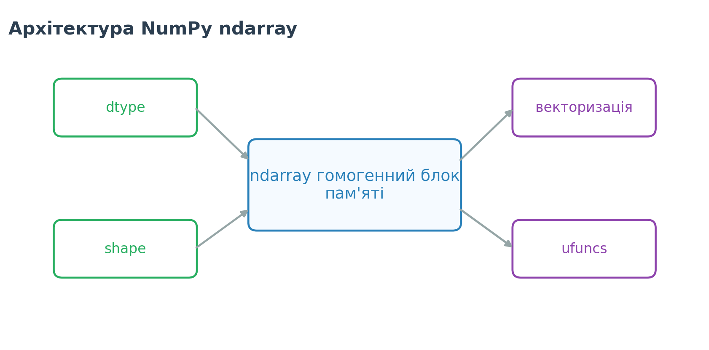

Крім векторизації, важливою особливістю є броадкастинг (broadcasting) — механізм, який дозволяє виконувати арифметичні дії над масивами різної форми за певними правилами розширення розмірностей. Універсальні функції (ufuncs) у NumPy застосовують математичні функції (наприклад, $\sin, \cos, \exp$) по-елементно.

Створимо одновимірний масив (вектор) та двовимірний масив (матрицю), щоб ознайомитися з їхніми атрибутами.

```python
# Блок 43: Створення масивів NumPy
vector = np.array([1, 2, 3, 4, 5])
matrix = np.array([[1, 2, 3],[4, 5, 6]])
print("Вектор:\n", vector)
```

Атрибути масиву `shape` та `dtype` дозволяють інспектувати форму (розмірності) та тип даних елементів.

```python
# Блок 44: Інспектування властивостей масиву
print("Форма матриці:", matrix.shape)
print("Тип даних вектора:", vector.dtype)
```

Часто виникає необхідність змінити форму масиву без зміни самих даних. Для цього використовується метод `reshape`.

```python
# Блок 45: Решейпінг (зміна форми)
reshaped_matrix = vector.reshape(5, 1)
print("Вектор-стовпець:\n", reshaped_matrix)
```

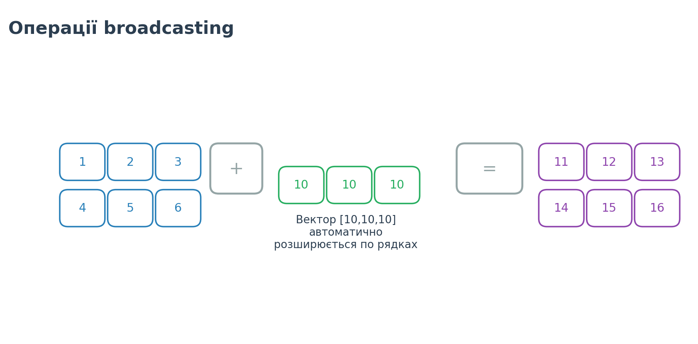

Продемонструємо векторизовані операції: додавання константи до масиву відбувається миттєво для кожного елемента завдяки механізму броадкастингу.

```python
# Блок 46: Векторизоване додавання (Broadcasting)
vector_plus_ten = vector + 10
print("Вектор + 10:", vector_plus_ten)
```

Універсальні функції (`ufuncs`) так само працюють швидко і по-елементно. Застосуємо функцію квадратного кореня до всіх елементів.

```python
# Блок 47: Універсальні функції (ufuncs)
sqrt_vector = np.sqrt(vector)
print("Квадратний корінь:\n", sqrt_vector.round(3))
```

NumPy має вбудовані статистичні методи, які можна застосовувати як до всього масиву, так і вздовж конкретної осі (axis).

```python
# Блок 48: Агрегація вздовж осей
col_means = np.mean(matrix, axis=0)
row_sums = np.sum(matrix, axis=1)
print("Середні по стовпцях:", col_means)
```

```python
# Блок 49: Стандартне відхилення (std)
std_dev = np.std(vector, ddof=1) # ddof=1 для вибірки
print(f"Вибіркове стандартне відхилення: {std_dev:.3f}")
```

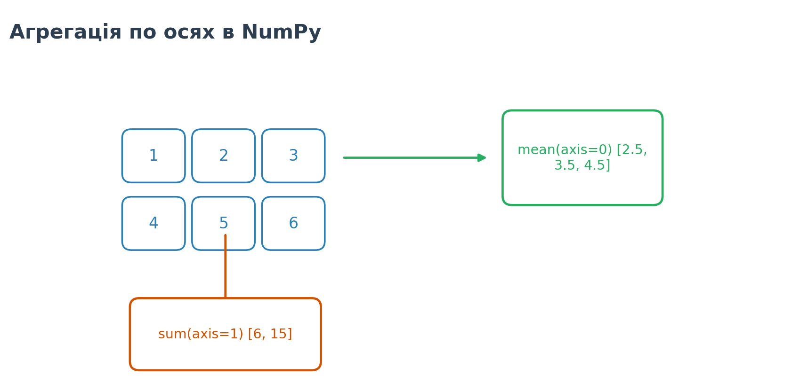

## 8. Основи роботи з даними в Python: Pandas

Якщо NumPy фокусується на низькорівневих числових обчисленнях та однотипних масивах, то Pandas — це високорівнева бібліотека для маніпуляції табличними даними (аналог таблиць Excel або SQL баз даних). Вона побудована поверх NumPy.

Основними структурами даних у Pandas є `Series` (одновимірний індексований масив) та `DataFrame` (двовимірна таблиця, де кожен стовпець може мати власний тип даних: числа, рядки, дати тощо). Важливою відмінністю від NumPy є наявність явного індексу — міток для рядків та стовпців.

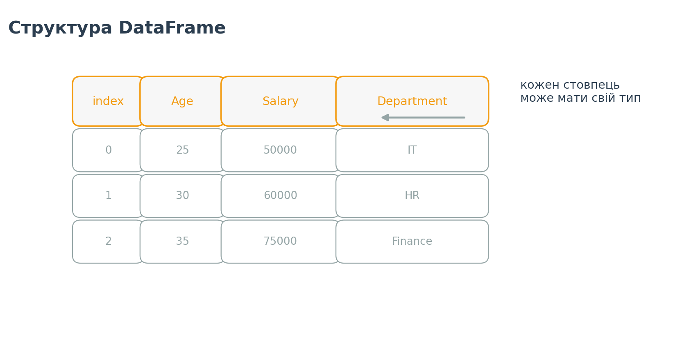

Pandas надає потужний інструментарій для очищення даних, обробки пропущених значень (`NaN`), фільтрації, групування (groupby) та злиття таблиць. Для статистиків особливо корисними є вбудовані методи швидкого обчислення дескриптивних статистик.

Спершу розглянемо базову структуру `Series`. Це своєрідний гібрид масиву NumPy та словника Python.

```python
# Блок 50: Створення Pandas Series з індексом
sales = pd.Series([150, 200, 300, 180], 
                  index=["Січень", "Лютий", "Березень", "Квітень"])
print("Продажі:\n", sales)
```

Індекс дозволяє звертатися до елементів за їхніми зрозумілими мітками, а не лише за числовими позиціями.

```python
# Блок 51: Доступ до елемента за індексом
march_sales = sales["Березень"]
print(f"Продажі у березні: {march_sales}")
```

DataFrame — це колекція об'єктів Series, що мають спільний індекс. Створимо таблицю даних зі словника.

```python
# Блок 52: Створення DataFrame зі словника
data_dict = {
    'Age': [25, 30, 35, 40, np.nan],
    'Salary':[50000, 60000, 75000, 90000, 65000],
    'Department':['IT', 'HR', 'IT', 'Finance', 'HR']
}
df = pd.DataFrame(data_dict)
print("Перші рядки DataFrame:\n", df.head(3))
```

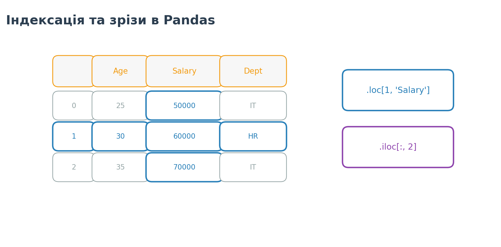

Функція `describe()` миттєво розраховує повний набір описових статистик (кількість, середнє, стандартне відхилення, квантилі) для всіх числових стовпців.

```python
# Блок 53: Отримання описових статистик
print("Описові статистики:\n", df.describe())
```

Часто виникає потреба отримати інформацію про типи даних та наявність пропусків. Метод `info()` надає технічне зведення про таблицю.

```python
# Блок 54: Інформація про структуру таблиці
print("Інформація про DataFrame:")
df.info()
```

Робота з пропущеними значеннями — рутинна задача аналітика. Ми можемо заповнити порожній вік (NaN) середнім або медіанним значенням стовпця.

```python
# Блок 55: Заповнення пропущених значень (Imputation)
median_age = df['Age'].median()
df['Age'] = df['Age'].fillna(median_age)
print("Вік після обробки пропусків:\n", df['Age'].values)
```

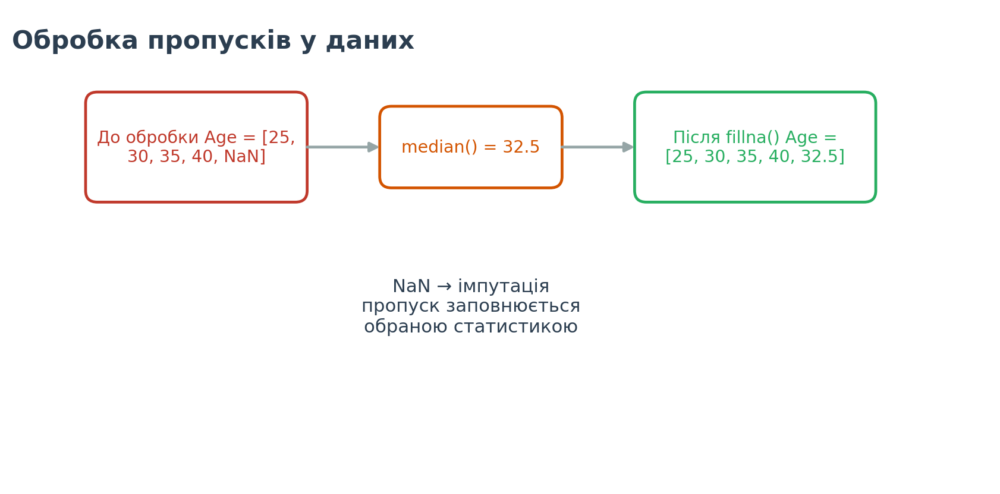

Логічна фільтрація дозволяє швидко відбирати рядки, що задовольняють певним статистичним умовам. Наприклад, оберемо співробітників відділу IT.

```python
# Блок 56: Логічне фільтрування даних
it_employees = df[df['Department'] == 'IT']
print("Співробітники IT відділу:\n", it_employees)
```

Групування даних за категоріями з наступною агрегацією (split-apply-combine) — це потужний спосіб аналізу якісних та кількісних даних разом.

```python
# Блок 57: Групування (groupby) та агрегація
dept_stats = df.groupby('Department')['Salary'].mean()
print("Середня зарплата по відділах:\n", dept_stats)
```

Нарешті, Pandas підтримує зручне індексування за допомогою атрибутів `.loc` (за міткою) та `.iloc` (за позицією), що нагадує двовимірні масиви NumPy, але з прив'язкою до колонок.

```python
# Блок 58: Доступ через .loc та .iloc
specific_cell = df.loc[2, 'Salary']
print(f"Зарплата співробітника з індексом 2: {specific_cell}")
```

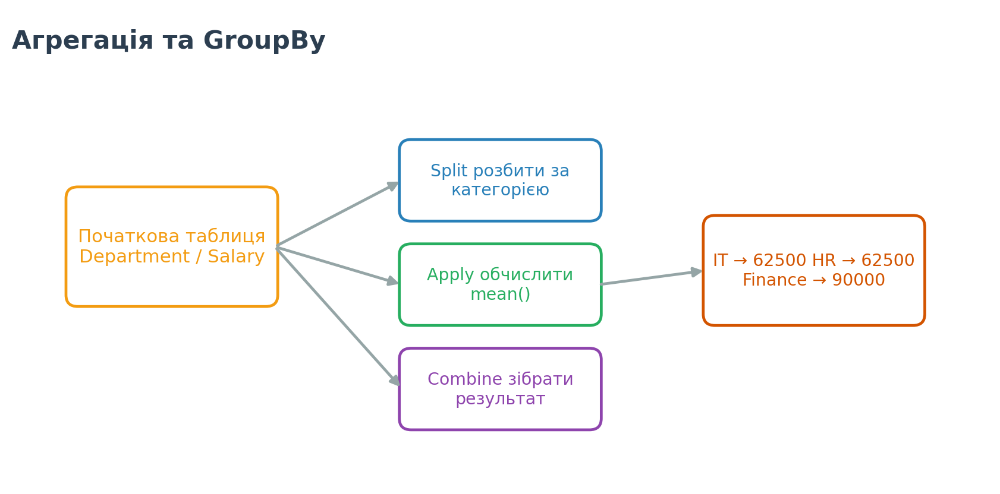

## 9. Корисні посилання

Для глибшого вивчення теми "Вступ до статистики" та інструментарію Python, рекомендуємо звернутися до наступних ресурсів:

1. [Офіційна документація NumPy](https://numpy.org/doc/stable/)
2. [Офіційна документація Pandas](https://pandas.pydata.org/docs/)
3. [SciPy Stats - Статистичний модуль в Python](https://docs.scipy.org/doc/scipy/reference/stats.html)
4.[Підручник з математичної статистики (OpenIntro Statistics)](https://www.openintro.org/book/os/)
4. [Курс "Python Data Science Handbook" (Jake VanderPlas)](https://jakevdp.github.io/PythonDataScienceHandbook/)

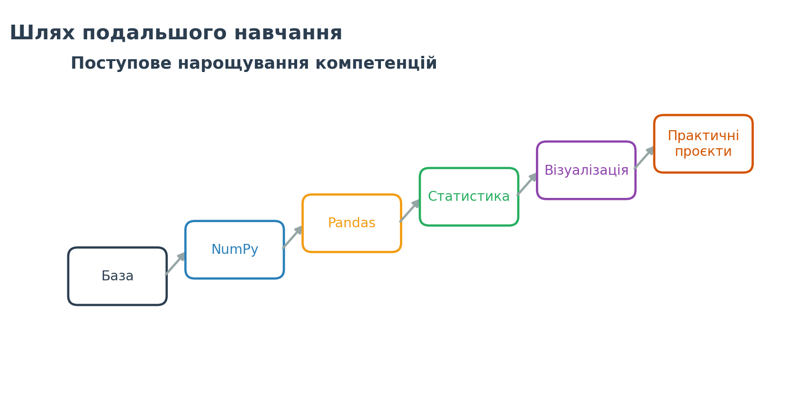
