# Лекційна записка 2. Описова статистика та візуалізація даних

## Зміст

1. [Роль описової статистики в аналізі даних](#1-роль-описової-статистики-в-аналізі-даних)
2. [Підготовка даних і базові структури Python](#2-підготовка-даних-і-базові-структури-python)
3. [Міри центральної тенденції](#3-міри-центральної-тенденції)
4. [Міри розсіювання](#4-міри-розсіювання)
5. [Варіаційний ряд і частотні таблиці](#5-варіаційний-ряд-і-частотні-таблиці)
6. [Гістограми та полігони частот](#6-гістограми-та-полігони-частот)
7. [Візуалізація в Matplotlib](#7-візуалізація-в-matplotlib)
8. [Візуалізація в Seaborn](#8-візуалізація-в-seaborn)
9. [Узагальнюючий приклад аналізу та корисні посилання](#9-узагальнюючий-приклад-аналізу-та-корисні-посилання)

---

## 1. Роль описової статистики в аналізі даних

Описова статистика є базовим рівнем кількісного аналізу даних. Її завдання полягає не у формулюванні причинно-наслідкових висновків, а у стислому, формально коректному та інтерпретованому поданні масиву спостережень. Саме на цьому етапі дослідник переходить від неструктурованого набору чисел до системи показників, що відображають центр, розсіювання, частоти та візуальні закономірності.

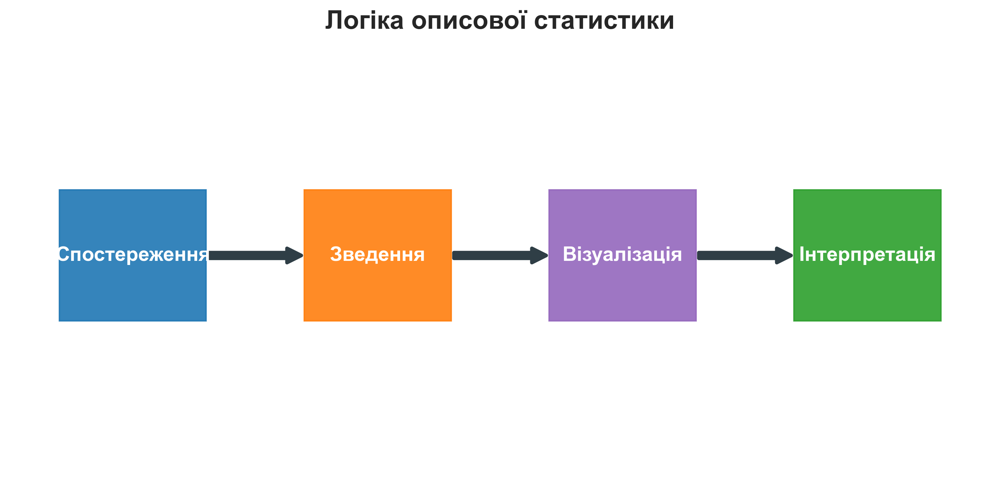

Практична цінність описової статистики полягає в тому, що вона дозволяє швидко оцінити характер даних до побудови складніших моделей. Якщо вибірка містить пропуски, екстремальні значення або змішані типи ознак, ці обставини треба виявити ще до переходу до статистичного виведення чи машинного навчання. Отже, описовий етап є одночасно діагностичним і підготовчим.

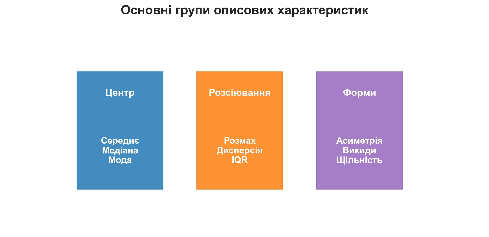

Для навчальних прикладів у цій лекції використовуватиметься єдиний синтетичний набір даних, що містить підсумковий бал `exam_score`, години підготовки `study_hours`, відвідуваність `attendance`, кількість спроб `attempts` і навчальну групу `group`. Така структура дає змогу одночасно демонструвати числові характеристики вибірки, групування, таблиці частот, гістограми та графіки розподілу.

| Завдання описової статистики | Типовий результат | Приклад запитання |
|---|---|---|
| Оцінка центру | середнє, медіана, мода | Який типовий бал у групі? |
| Оцінка розсіювання | розмах, дисперсія, IQR | Наскільки неоднорідні результати? |
| Частотне подання | таблиця частот, відносні частоти | Які значення трапляються найчастіше? |
| Візуалізація | гістограма, boxplot, violinplot | Яка форма розподілу даних? |

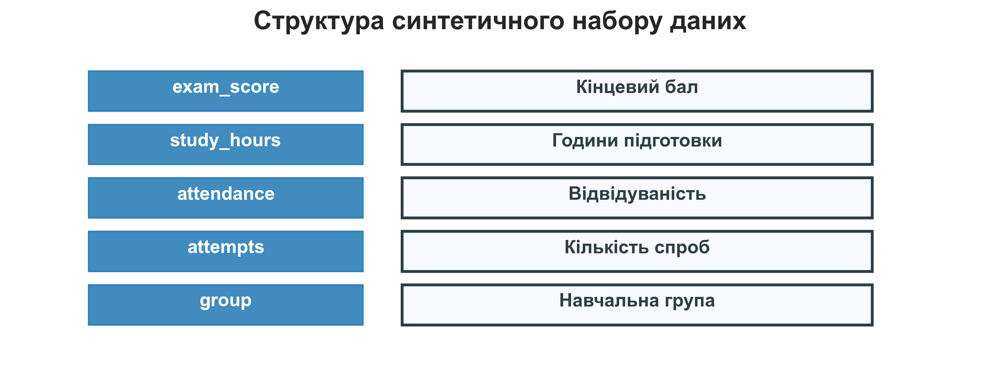

Перед безпосередніми розрахунками доречно сформувати базове програмне середовище. У межах курсу використовуються `NumPy` для масивів і векторизованих обчислень, `Pandas` для табличних структур, `Matplotlib` для низькорівневого контролю над графіками та `Seaborn` для статистично орієнтованої візуалізації.

```python
# Блок 1: Імпорт основних бібліотек
import numpy as np
import pandas as pd
import matplotlib.pyplot as plt
import seaborn as sns
```

Починати варто з малого набору значень, на якому легко відстежити кожен крок вручну. Саме невелика впорядкована або невпорядкована вибірка найкраще демонструє, чому середнє, медіана та мода можуть збігатися або розходитися, а також як зміна одного спостереження впливає на підсумкову характеристику.

```python
# Блок 2: Невелика навчальна вибірка для ручних розрахунків
scores_small = [56, 60, 60, 62, 65, 68, 70, 72, 72, 90]
print(scores_small)
```

Навіть для такої малої вибірки варто перевірити її обсяг, мінімум, максимум і перші значення. Це дисциплінує дослідника і допомагає уникнути інтерпретаційних помилок, коли візуально сприйнята картина не збігається з реальними даними.

```python
# Блок 3: Первинний огляд простої вибірки
print("Кількість елементів:", len(scores_small))
print("Мінімум:", min(scores_small))
print("Максимум:", max(scores_small))
print("Перші три значення:", scores_small[:3])
```

Основні приклади лекції будуть прив'язані до єдиного відтворюваного набору даних. Фіксація генератора випадкових чисел через `np.random.seed(42)` є принциповою вимогою, оскільки навчальні результати мають бути повторюваними в будь-якому середовищі виконання.

```python
# Блок 4: Генерація відтворюваного синтетичного набору даних
np.random.seed(42)
n = 120
study_hours = np.clip(np.random.normal(14, 4, n), 2, 28)
attendance = np.clip(np.random.normal(0.84, 0.08, n), 0.55, 1.0)
attempts = np.random.poisson(2, n) + 1
group = np.random.choice(["Група A", "Група B", "Група C"], size=n, p=[0.35, 0.35, 0.30])
group_effect = pd.Series(group).map({"Група A": 4, "Група B": 0, "Група C": -3}).to_numpy()
exam_score = np.clip(
    35 + 1.8 * study_hours + 18 * attendance - 2.0 * attempts + group_effect + np.random.normal(0, 5, n),
    0,
    100,
)
```

Після генерації масивів їх треба звести до табличної структури. Саме `DataFrame` є зручною формою для подальшого групування, розрахунку дескриптивних статистик і побудови графіків, оскільки дозволяє працювати з рядками й стовпцями предметно, а не лише позиційно.

```python
# Блок 5: Формування DataFrame і короткий перегляд
df = pd.DataFrame(
    {
        "exam_score": np.round(exam_score, 1),
        "study_hours": np.round(study_hours, 1),
        "attendance": np.round(attendance, 2),
        "attempts": attempts,
        "group": group,
    }
)
print(df.head())
```

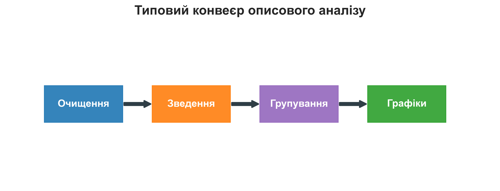

## 2. Підготовка даних і базові структури Python

На етапі підготовки даних особливу роль відіграє вибір структури зберігання. Один і той самий набір спостережень можна подати як список Python, масив `ndarray`, об'єкт `Series` або `DataFrame`, але аналітичні можливості цих структур суттєво відрізняються. Тому правильний вибір форми подання даних безпосередньо впливає на швидкість подальших обчислень і прозорість коду.

| Структура | Призначення | Перевага | Обмеження |
|---|---|---|---|
| `list` | базове зберігання | простота | слабка підтримка векторизації |
| `ndarray` | числові обчислення | висока швидкість | один тип даних |
| `Series` | одна ознака з індексом | зручні статистичні методи | одномірність |
| `DataFrame` | таблиця спостережень | групування, фільтрація, агрегація | більша структурна складність |

Навчальна вибірка, яка спочатку була списком, легко перетворюється на масив `NumPy`. Це дозволяє застосовувати сортування, векторні операції, агрегування і логічні маски без циклів, що є стандартом для сучасного аналізу даних у Python.

```python
# Блок 6: Перетворення списку на масив NumPy
scores_array = np.array(scores_small, dtype=float)
print(scores_array)
print(type(scores_array))
```

Після перетворення варто відразу перевірити форму масиву, його тип даних і впорядковану версію. Такі прості перевірки дозволяють переконатися, що дані не були випадково зчитані як текстові рядки або як масив зі змішаними типами.

```python
# Блок 7: Інспектування масиву та сортування
sorted_scores = np.sort(scores_array)
print("Форма масиву:", scores_array.shape)
print("Тип даних:", scores_array.dtype)
print("Відсортований ряд:", sorted_scores)
```

Об'єкт `Series` у `Pandas` містить не лише значення, а й явний індекс. Це корисно тоді, коли необхідно зберегти смислові мітки спостережень, наприклад номери тестів або ідентифікатори студентів. У статистичному контексті індекс полегшує локалізацію екстремальних значень і пропусків.

```python
# Блок 8: Побудова Series з осмисленим індексом
scores_series = pd.Series(scores_small, index=[f"obs_{i}" for i in range(1, 11)], name="exam_score")
print(scores_series)
```

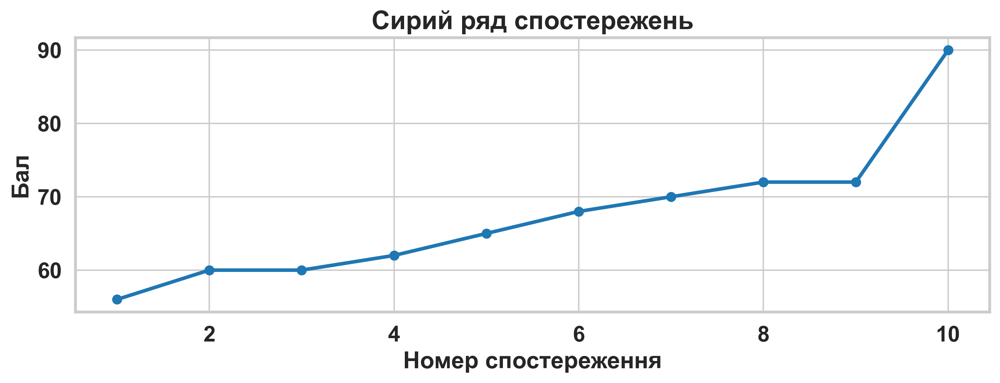

Таблична структура `DataFrame` є центральною для більшості практичних задач курсу. Саме в ній природно поєднуються числові та категоріальні ознаки, а також зберігається кожне окреме спостереження як рядок. Для описової статистики це зручно ще й тому, що методи `describe`, `value_counts`, `groupby` і `agg` працюють без додаткового перетворення.

```python
# Блок 9: Створення похідних стовпців у DataFrame
df["score_per_hour"] = (df["exam_score"] / df["study_hours"]).round(2)
df["attendance_pct"] = (df["attendance"] * 100).round(1)
print(df[["exam_score", "study_hours", "score_per_hour", "attendance_pct"]].head())
```

Структурний огляд таблиці є обов'язковим кроком перед будь-якими статистичними розрахунками. Дослідник має знати кількість рядків і стовпців, типи ознак, наявність числових і категоріальних полів, а також можливі структурні аномалії.

```python
# Блок 10: Форма таблиці та типи даних
print("Розмірність таблиці:", df.shape)
print(df.dtypes)
```

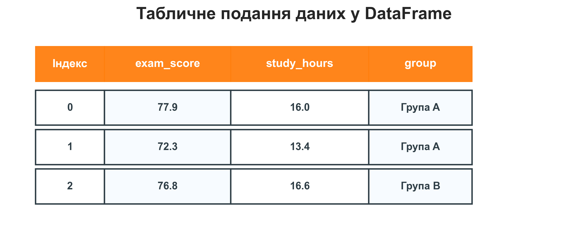

Пропуски становлять окрему проблему, оскільки вони впливають на середні, дисперсії, таблиці частот і графіки. У реальних даних пропущені значення можуть означати помилку введення, відсутність спостереження або відмову респондента від відповіді, і тому спосіб їхньої обробки має бути обґрунтованим.

```python
# Блок 11: Імітація пропусків і перевірка їх кількості
df_missing = df.copy()
df_missing.loc[[3, 17, 41], "attendance"] = np.nan
df_missing.loc[[7, 28], "study_hours"] = np.nan
print(df_missing.isna().sum())
```

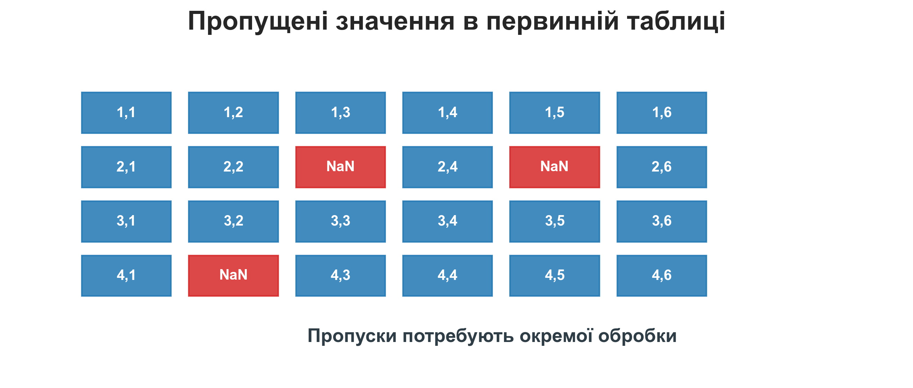

Після первинного очищення доцільно перевірити, як числові ознаки взаємодіють одна з одною хоча б на елементарному рівні. Навіть проста діаграма розсіювання між годинами підготовки та підсумковим балом уже дає першу інтуїцію щодо напряму зв'язку і потенційної різниці між групами.

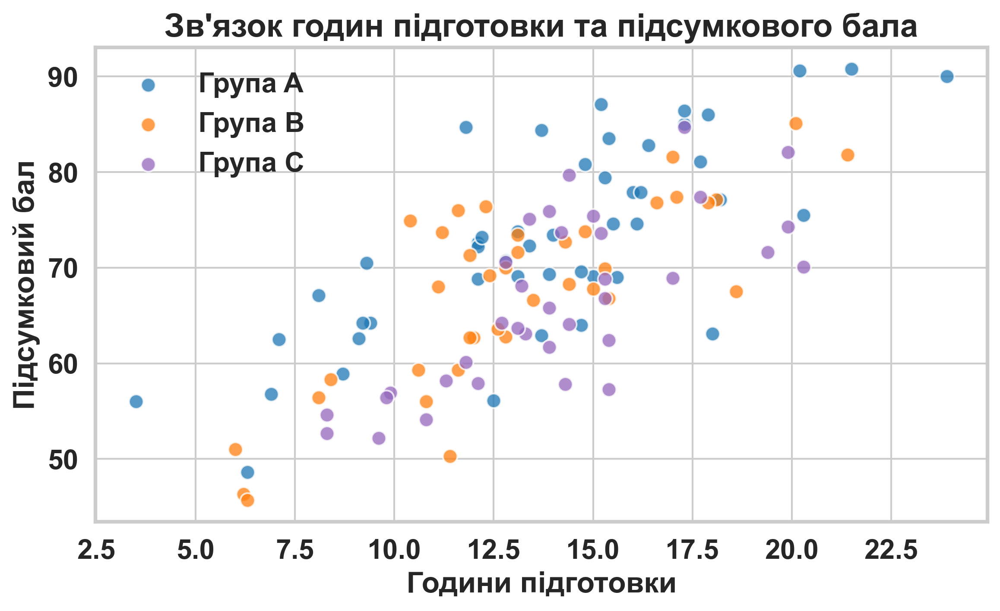

## 3. Міри центральної тенденції

Міри центральної тенденції стискають вибірку до одного репрезентативного значення. Така редукція завжди є наближенням, однак саме вона дозволяє формулювати стислий висновок про типовий рівень показника. Коректний вибір міри центру залежить від шкали вимірювання, наявності викидів і форми розподілу.

Найпоширенішою характеристикою центру є середнє арифметичне. Для вибірки \(x_1, x_2, \dots, x_n\) воно визначається формулою

$$
\bar{x} = \frac{1}{n} \sum_{i=1}^{n} x_i.
$$

Середнє враховує кожне значення вибірки, тому є інформативним, але чутливим до аномально великих або малих спостережень. У навчальній практиці доцільно спочатку обчислювати середнє вручну, щоби не втрачати зв'язок між формулою і її програмною реалізацією.

```python
# Блок 12: Ручне обчислення середнього арифметичного
mean_manual = sum(scores_small) / len(scores_small)
print("Середнє арифметичне:", mean_manual)
```

Для великих масивів значно ефективніше застосовувати готові векторизовані функції. У `NumPy` і `Pandas` це дає не лише коротший запис, а й надійнішу роботу з великим обсягом спостережень та пропусків.

```python
# Блок 13: Середній підсумковий бал у синтетичній вибірці
mean_exam_score = df["exam_score"].mean()
print(f"Середній бал: {mean_exam_score:.2f}")
```

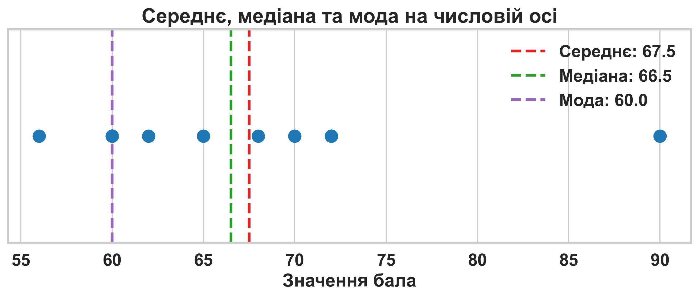

Медіана є центральним елементом впорядкованої вибірки. Для непарного обсягу \(n = 2k + 1\) вона дорівнює

$$
Me = x_{(k+1)},
$$

де \(x_{(k+1)}\) — центральний елемент варіаційного ряду.

Для парного обсягу \(n = 2k\) медіана обчислюється як середнє двох центральних елементів:

$$
Me = \frac{x_{(k)} + x_{(k+1)}}{2}.
$$

Медіана стійкіша до викидів, ніж середнє. Саме тому її часто використовують для асиметричних розподілів, економічних показників, доходів і часових витрат.

```python
# Блок 14: Медіана для вибірки непарного обсягу
odd_sample = [54, 58, 60, 61, 65, 68, 72]
print("Медіана непарної вибірки:", np.median(odd_sample))
```

```python
# Блок 15: Медіана для вибірки парного обсягу
even_sample = [54, 58, 60, 61, 65, 68, 72, 88]
print("Медіана парної вибірки:", np.median(even_sample))
```

Мода є найчастішим значенням у вибірці. Для дискретного розподілу її можна подати через оператор максимуму частоти:

$$
Mo = \arg \max_x n_x,
$$

де \(n_x\) — абсолютна частота появи значення \(x\).

На відміну від середнього й медіани, мода особливо корисна для дискретних і категоріальних даних. Саме вона відповідає на питання, яке значення або категорія трапляється найчастіше.

```python
# Блок 16: Мода для дискретної ознаки attempts
mode_attempts = df["attempts"].mode()
print("Мода для attempts:", mode_attempts.tolist())
```

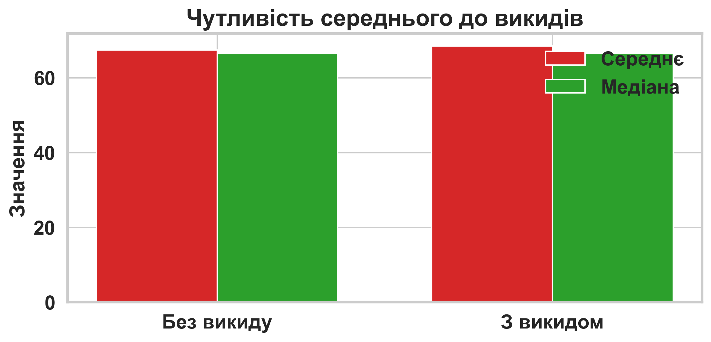

Однією з ключових відмінностей середнього та медіани є їхня поведінка за наявності викиду. Якщо до майже симетричної вибірки додати одне екстремальне значення, середнє зміниться значно сильніше, ніж медіана. Це треба враховувати під час аналізу результатів вимірювань, заробітних плат, часу виконання або фінансових операцій.

```python
# Блок 17: Порівняння середнього та медіани до і після появи викиду
scores_with_outlier = [56, 60, 60, 62, 65, 68, 70, 72, 72, 100]
print("Середнє без викиду:", np.mean(scores_small))
print("Медіана без викиду:", np.median(scores_small))
print("Середнє з викидом:", np.mean(scores_with_outlier))
print("Медіана з викидом:", np.median(scores_with_outlier))
```

Для порівняння навчальних груп доцільно обчислювати центральні тенденції окремо для кожної категорії. Це дозволяє перейти від загального опису вибірки до умовного профілю кожної підгрупи і уникнути втрати інформації через змішування неоднорідних сукупностей.

| Міра | Перевага | Обмеження | Доцільне застосування |
|---|---|---|---|
| Середнє | використовує всі значення | чутливе до викидів | приблизно симетричні дані |
| Медіана | стійка до викидів | ігнорує величину відхилень | асиметричні розподіли |
| Мода | працює для дискретних і категоріальних ознак | може бути неєдиною | частотний аналіз |

```python
# Блок 18: Центральні тенденції за групами
group_centers = df.groupby("group")["exam_score"].agg(["mean", "median"])
print(group_centers.round(2))
```

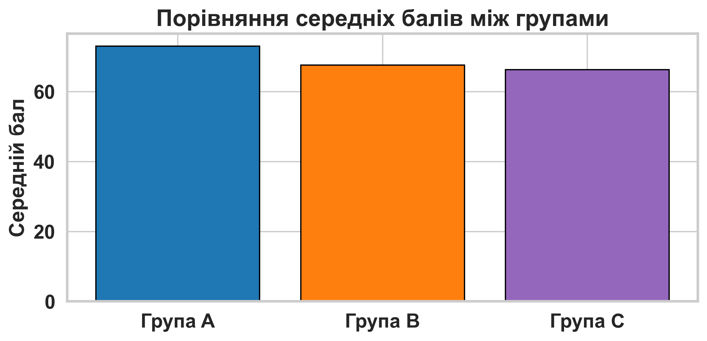

Для підсумкового опису зручно звести всі три міри центру в одну структуру. Це дозволяє оцінити, наскільки розподіл є симетричним: якщо середнє, медіана і мода близькі, то центр розподілу є відносно стабільним; якщо вони помітно розходяться, це може вказувати на асиметрію або домішку викидів.

```python
# Блок 19: Узагальнююча таблиця мір центральної тенденції
center_summary = {
    "mean_exam_score": round(df["exam_score"].mean(), 2),
    "median_exam_score": round(df["exam_score"].median(), 2),
    "mode_attempts": df["attempts"].mode().tolist(),
}
print(center_summary)
```

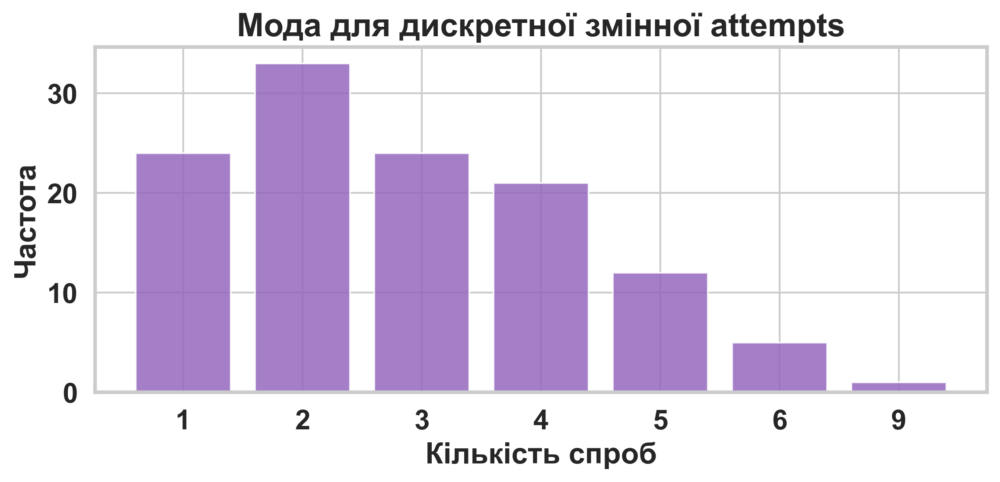

## 4. Міри розсіювання

Якщо міри центральної тенденції описують типовий рівень показника, то міри розсіювання характеризують неоднорідність даних. Без оцінки розсіювання саме середнє значення може бути оманливим, адже дві вибірки з однаковим середнім можуть мати принципово різну структуру.

Найпростішою мірою розсіювання є розмах. Він визначається як різниця між найбільшим і найменшим значенням:

$$
R = x_{\max} - x_{\min}.
$$

Розмах швидко обчислюється і добре ілюструє загальну ширину вибірки, але повністю залежить лише від двох крайніх спостережень. Через це він нестійкий до випадкових викидів і не відображає внутрішньої структури розподілу.

```python
# Блок 20: Розрахунок розмаху
score_range = df["exam_score"].max() - df["exam_score"].min()
print(f"Розмах вибірки: {score_range:.2f}")
```

Суттєво глибшою характеристикою є дисперсія, яка враховує відхилення всіх спостережень від середнього. Для вибірки її зазвичай обчислюють із поправкою Бесселя:

$$
s^2 = \frac{1}{n - 1} \sum_{i=1}^{n} (x_i - \bar{x})^2.
$$

Ручне обчислення дисперсії корисне тим, що демонструє сенс квадрата відхилення: великі відхилення отримують більшу вагу, а сума квадратів завжди є невід'ємною.

```python
# Блок 21: Ручне обчислення вибіркової дисперсії
mean_small = np.mean(scores_small)
squared_deviations = [(x - mean_small) ** 2 for x in scores_small]
variance_manual = sum(squared_deviations) / (len(scores_small) - 1)
print("Вибіркова дисперсія:", variance_manual)
```

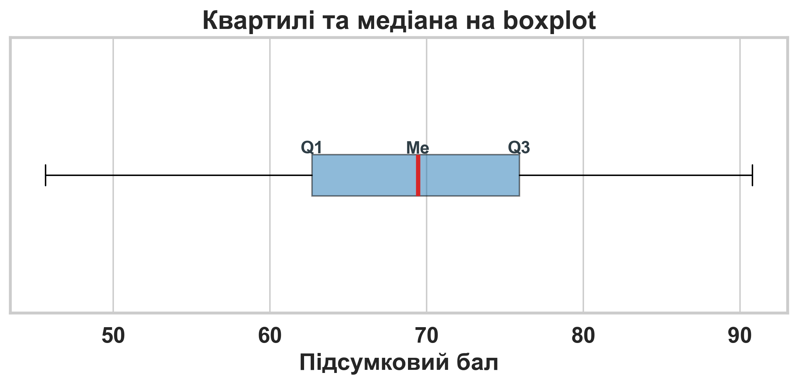

Геометрично дисперсію зручно уявляти як середній квадрат відхилення точок від центра. Саме тому вона чутлива до віддалених спостережень: чим далі значення розташоване від середнього, тим сильніше воно збільшує дисперсію.

```python
# Блок 22: Дисперсія та стандартне відхилення через NumPy
variance_np = np.var(df["exam_score"], ddof=1)
std_np = np.std(df["exam_score"], ddof=1)
print(f"Дисперсія: {variance_np:.2f}")
print(f"Стандартне відхилення: {std_np:.2f}")
```

Стандартне відхилення є квадратним коренем із дисперсії:

$$
s = \sqrt{s^2}.
$$

На відміну від дисперсії, воно вимірюється в тих самих одиницях, що й початкова ознака, тому простіше інтерпретується на практиці. Для балів, цін, часу чи довжин саме стандартне відхилення часто є основною мірою типового відхилення від середнього.

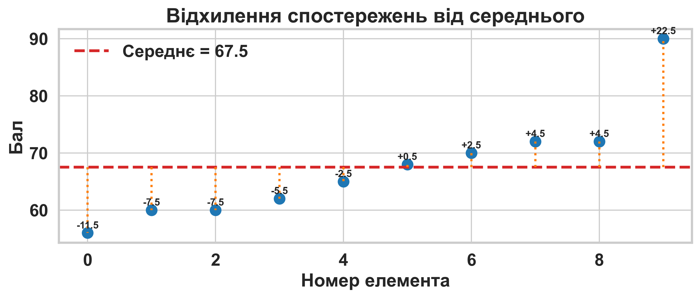

Квартилі поділяють впорядковану вибірку на чотири рівні частини. На їхній основі визначають міжквартильний розмах

$$
IQR = Q_3 - Q_1,
$$

який є стійкою мірою розсіювання для центральних 50% спостережень.

```python
# Блок 23: Квартилі та міжквартильний розмах
q1, q2, q3 = df["exam_score"].quantile([0.25, 0.50, 0.75])
iqr = q3 - q1
print(f"Q1 = {q1:.2f}, Me = {q2:.2f}, Q3 = {q3:.2f}, IQR = {iqr:.2f}")
```

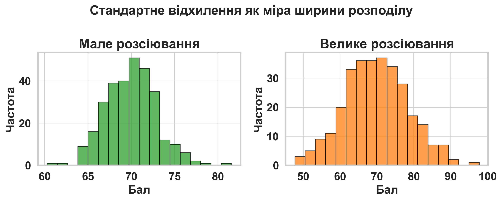

У практичному аналізі IQR часто використовують для виявлення потенційних викидів. Спостереження, що лежать нижче межі \(Q_1 - 1.5 \cdot IQR\) або вище \(Q_3 + 1.5 \cdot IQR\), позначають як підозрілі і перевіряють окремо.

```python
# Блок 24: Виявлення потенційних викидів за правилом 1.5 IQR
lower_bound = q1 - 1.5 * iqr
upper_bound = q3 + 1.5 * iqr
outliers = df[(df["exam_score"] < lower_bound) | (df["exam_score"] > upper_bound)]
print(outliers[["exam_score", "study_hours", "group"]].head())
```

Для порівняння підгруп корисно зводити розмах, стандартне відхилення й IQR в одну таблицю. Така таблиця одразу показує, чи одна група не лише має вищий центр розподілу, а й є стабільнішою за іншими.

| Міра | Формула | Стійкість до викидів | Інтерпретація |
|---|---|---|---|
| Розмах | \(x_{\max} - x_{\min}\) | низька | повна ширина вибірки |
| Дисперсія | \(s^2\) | низька | середній квадрат відхилень |
| Стандартне відхилення | \(s\) | низька | типова абсолютна варіація |
| IQR | \(Q_3 - Q_1\) | висока | ширина центральної половини даних |

```python
# Блок 25: Міри розсіювання за групами
dispersion_by_group = df.groupby("group")["exam_score"].agg(
    score_range=lambda x: x.max() - x.min(),
    std=lambda x: x.std(ddof=1),
    iqr=lambda x: x.quantile(0.75) - x.quantile(0.25),
)
print(dispersion_by_group.round(2))
```

Коли потрібно порівнювати варіативність ознак із різними шкалами або різними середніми, інколи використовують коефіцієнт варіації. Хоч він і не належить до базового мінімуму лекції, але дає корисну відносну оцінку розсіювання.

```python
# Блок 26: Коефіцієнт варіації для exam_score
coef_variation = df["exam_score"].std(ddof=1) / df["exam_score"].mean()
print(f"Коефіцієнт варіації: {coef_variation:.3f}")
```

Нарешті, стандартне відхилення часто використовують для стандартизації даних, коли потрібно перевести значення до зіставної шкали. Таке перетворення не замінює описову статистику, але спирається на неї і доповнює її під час подальшого аналізу.

```python
# Блок 27: Стандартизація перших п'яти результатів
z_scores = (df["exam_score"] - df["exam_score"].mean()) / df["exam_score"].std(ddof=1)
print(z_scores.head())
```

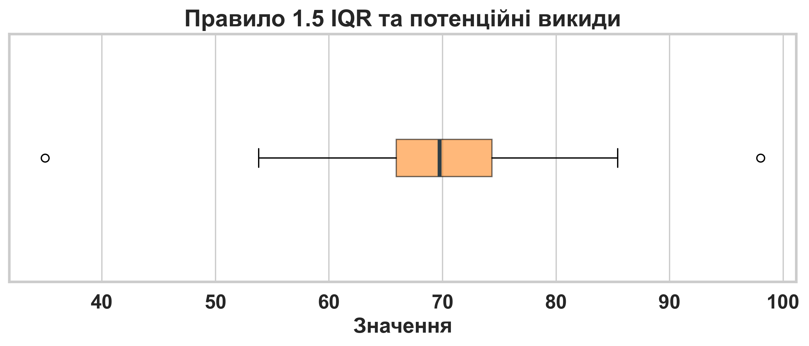

## 5. Варіаційний ряд і частотні таблиці

Варіаційний ряд — це впорядкована за неспаданням послідовність значень вибірки. Він є відправною точкою для побудови медіани, квартилів, частотних таблиць і багатьох графічних подань. Без сортування даних неможливо коректно перейти від сирих спостережень до структурованого опису розподілу.

```python
# Блок 28: Побудова варіаційного ряду
variation_series = np.sort(df["exam_score"].values)
print(variation_series[:15])
print("...")
print(variation_series[-15:])
```

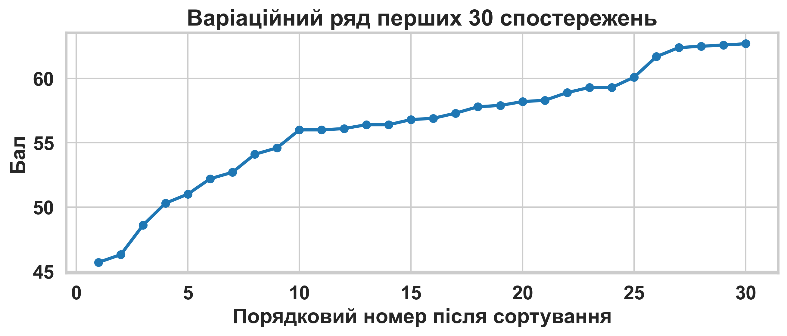

Для дискретних ознак базовим інструментом є таблиця абсолютних частот. Вона показує, скільки разів кожне значення трапляється у вибірці, і тим самим дає точну основу для визначення моди та побудови стовпчикових діаграм.

```python
# Блок 29: Абсолютні частоти для attempts
attempt_freq = df["attempts"].value_counts().sort_index()
print(attempt_freq)
```

Відносна частота показує частку появи конкретного значення у вибірці:

$$
p_i = \frac{n_i}{n},
$$

де \(n_i\) — абсолютна частота \(i\)-го значення, а \(n\) — обсяг вибірки.

```python
# Блок 30: Відносні частоти для attempts
attempt_rel_freq = (attempt_freq / len(df)).round(3)
print(attempt_rel_freq)
```

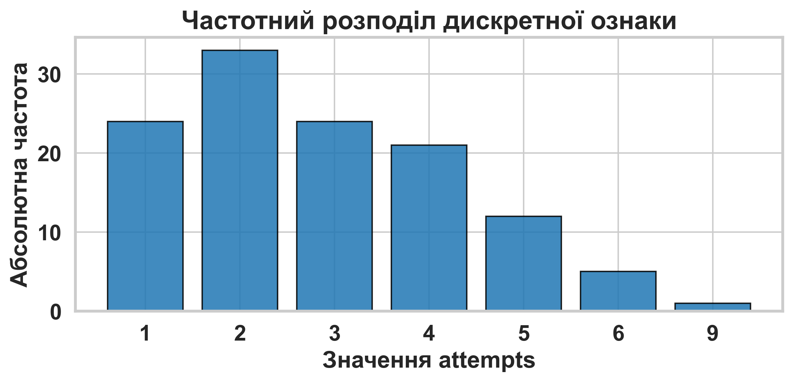

Накопичені частоти дають відповідь на інше питання: яка частка спостережень не перевищує певного значення. Саме ця логіка лежить в основі кумулятивних таблиць і функцій розподілу.

```python
# Блок 31: Накопичені абсолютні та відносні частоти
attempt_cum_abs = attempt_freq.cumsum()
attempt_cum_rel = (attempt_rel_freq.cumsum()).round(3)
print("Накопичені абсолютні частоти:\n", attempt_cum_abs)
print("Накопичені відносні частоти:\n", attempt_cum_rel)
```

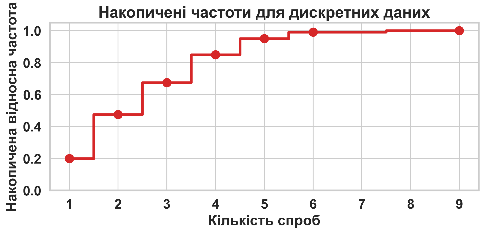

Для неперервних або майже неперервних даних окремі значення часто повторюються рідко, тому доцільно переходити до інтервального групування. У цьому разі значення об'єднують у проміжки, а частоту рахують уже не для точок, а для інтервалів.

```python
# Блок 32: Інтервальне групування підсумкового бала
score_bins = [40, 55, 65, 75, 85, 100]
score_intervals = pd.cut(df["exam_score"], bins=score_bins, right=False)
interval_freq = score_intervals.value_counts().sort_index()
print(interval_freq)
```

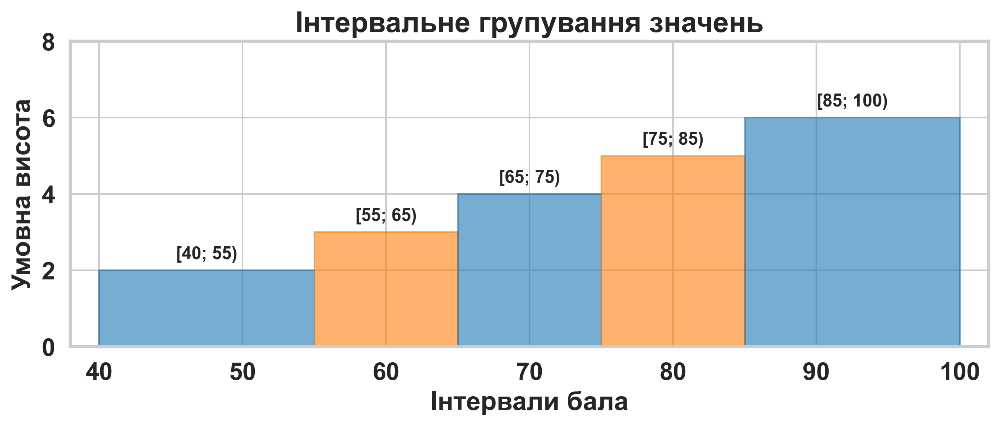

Частотні таблиці доцільно будувати не лише для однієї ознаки, а й у розрізі категорій. Таблиця спряженості дозволяє побачити, чи відрізняється структура спроб або балів між навчальними групами. Це особливо корисно на етапі попереднього аналізу, коли дослідник ще не переходить до формальних тестів.

| Інтервал бала | Абсолютна частота | Відносна частота |
|---|---:|---:|
| \([40; 55)\) | 7 | 0.058 |
| \([55; 65)\) | 26 | 0.217 |
| \([65; 75)\) | 49 | 0.408 |
| \([75; 85)\) | 30 | 0.250 |
| \([85; 100)\) | 8 | 0.067 |

```python
# Блок 33: Таблиця спряженості group x attempts
crosstab_attempts = pd.crosstab(df["group"], df["attempts"])
print(crosstab_attempts)
```

Навчальна практика показує, що навіть проста частотна таблиця потребує охайного оформлення. Якщо не впорядкувати інтервали, не округлити частки і не підписати одиниці вимірювання, то інтерпретація таблиці ускладнюється більше, ніж самі розрахунки.

```python
# Блок 34: Підсумкова інтервальна таблиця у зручному вигляді
interval_table = pd.DataFrame(
    {
        "interval": interval_freq.index.astype(str),
        "abs_freq": interval_freq.values,
        "rel_freq": (interval_freq.values / len(df)).round(3),
    }
)
print(interval_table)
```

## 6. Гістограми та полігони частот

Гістограма є стандартним графічним поданням інтервального розподілу. Вона дає змогу оцінити форму розподілу, симетрію, наявність кількох мод, концентрацію значень і приблизну густину спостережень у різних частинах шкали.

```python
# Блок 35: Побудова гістограми абсолютних частот
plt.figure(figsize=(8, 4))
plt.hist(df["exam_score"], bins=12, color="#1f77b4", edgecolor="black", alpha=0.75)
plt.title("Гістограма абсолютних частот")
plt.xlabel("Підсумковий бал")
plt.ylabel("Частота")
plt.show()
```

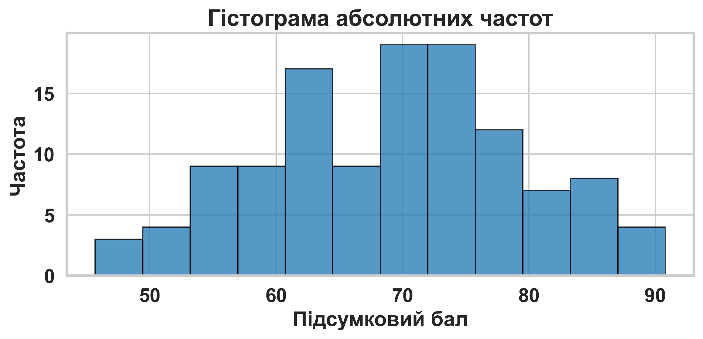

Якщо замість абсолютних частот потрібна щільність розподілу, стовпчики гістограми треба нормувати так, щоб сумарна площа дорівнювала одиниці. У такому разі висота стовпчика вже не є простою частотою, а інтерпретується як оцінка густини розподілу на відповідному інтервалі.

Для гістограми щільності виконується умова

$$
\sum_{j=1}^{m} h_j \cdot \Delta_j = 1,
$$

де \(h_j\) — висота \(j\)-го стовпчика, а \(\Delta_j\) — ширина відповідного інтервалу.

```python
# Блок 36: Гістограма щільності і перевірка площі
density_counts, density_edges = np.histogram(df["exam_score"], bins=12, density=True)
bin_widths = np.diff(density_edges)
total_area = np.sum(density_counts * bin_widths)
print("Сума площ гістограми щільності:", round(total_area, 5))
```

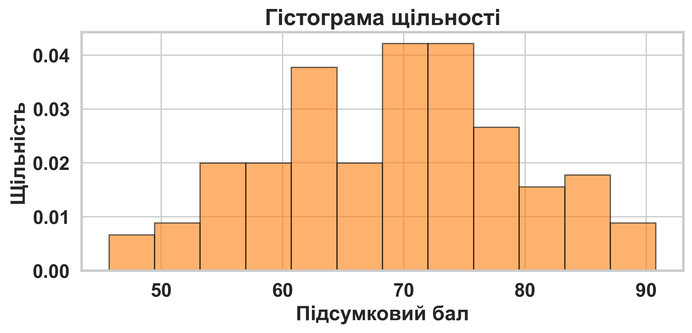

Полігон частот будується через сполучення середин інтервалів відрізками. Він менш наочний для непідготовленого читача, ніж гістограма, але дає змогу легше порівнювати кілька розподілів на одній координатній площині.

```python
# Блок 37: Дані для полігона частот
hist_counts, hist_edges = np.histogram(df["exam_score"], bins=10)
hist_mids = (hist_edges[:-1] + hist_edges[1:]) / 2
polygon_df = pd.DataFrame({"mid": hist_mids, "count": hist_counts})
print(polygon_df)
```

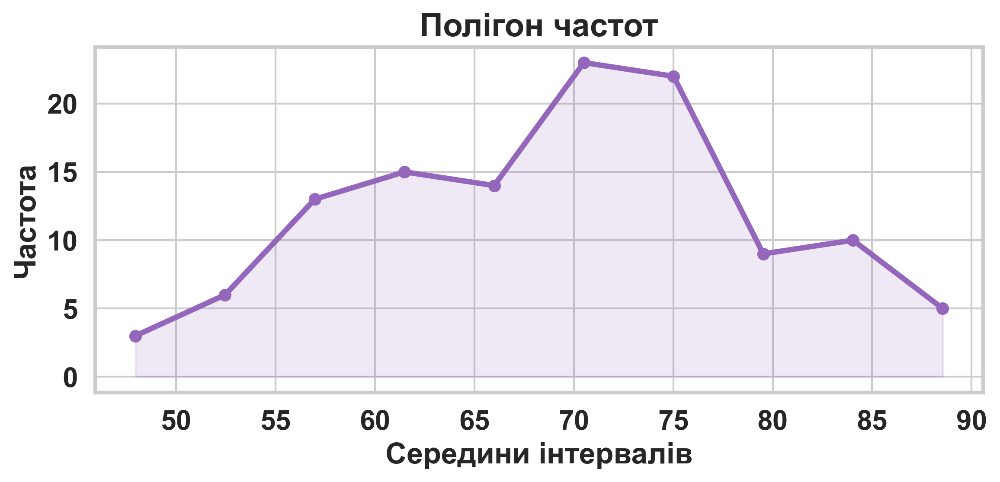

Окремої уваги потребує вибір кількості інтервалів. Надто мала кількість бінів приховує структуру розподілу, а надто велика створює шум і породжує псевдозакономірності. Тому кількість інтервалів не слід задавати механічно; її треба співвідносити з обсягом вибірки та аналітичною метою графіка.

| Підхід | Формула або принцип | Коли доречний |
|---|---|---|
| Фіксоване число бінів | наприклад, 10 або 12 | швидкий огляд |
| Правило Стерджеса | \(m = 1 + \log_2 n\) | помірні обсяги вибірки |
| Корінь із \(n\) | \(m \approx \sqrt{n}\) | грубе практичне правило |
| Предметний вибір | за змістом шкали | коли інтервали мають інтерпретацію |

```python
# Блок 38: Оцінка кількості бінів за правилом Стерджеса і кореня з n
n_obs = len(df)
bins_sturges = int(np.ceil(1 + np.log2(n_obs)))
bins_sqrt = int(np.ceil(np.sqrt(n_obs)))
print("Кількість бінів за Стерджесом:", bins_sturges)
print("Кількість бінів за правилом sqrt(n):", bins_sqrt)
```

Графічне порівняння двох варіантів розбиття часто переконливіше за числове правило. Дослідник повинен бачити, як одна й та сама вибірка змінює контур розподілу, коли змінюється кількість інтервалів.

```python
# Блок 39: Порівняння лічильників для двох варіантів розбиття
counts_6, edges_6 = np.histogram(df["exam_score"], bins=6)
counts_18, edges_18 = np.histogram(df["exam_score"], bins=18)
print("Частоти для 6 інтервалів:", counts_6)
print("Частоти для 18 інтервалів:", counts_18)
```

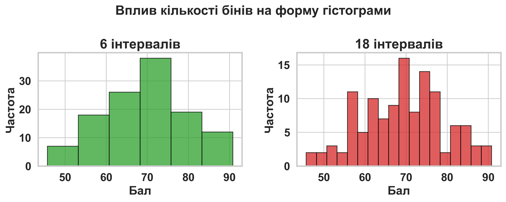

Практика також показує, що на гістограму корисно накладати вертикальні лінії середнього й медіани. Такий прийом полегшує інтерпретацію асиметрії розподілу: якщо середнє помітно зміщене відносно медіани, це є ознакою впливу хвоста або викидів.

```python
# Блок 40: Координати середнього та медіани для накладання на гістограму
mean_score = df["exam_score"].mean()
median_score = df["exam_score"].median()
print(f"Середнє: {mean_score:.2f}")
print(f"Медіана: {median_score:.2f}")
```

Ще одна типова задача — порівняння розподілів між групами. Якщо розподіли накладаються на одну вісь без попереднього нормування або чіткої легенди, інтерпретація погіршується. Тому групові гістограми потребують продуманого кольорового кодування і стабільних інтервалів.

```python
# Блок 41: Підготовка підвибірок для групових гістограм
group_a_scores = df.loc[df["group"] == "Група A", "exam_score"]
group_b_scores = df.loc[df["group"] == "Група B", "exam_score"]
group_c_scores = df.loc[df["group"] == "Група C", "exam_score"]
print(len(group_a_scores), len(group_b_scores), len(group_c_scores))
```

## 7. Візуалізація в Matplotlib

`Matplotlib` є базовою бібліотекою візуалізації в Python. Її головна перевага полягає у високому ступені контролю над кожним елементом рисунка: фігурою, осями, кольорами, підписами, легендами, анотаціями, сіткою та способом збереження. Саме тому ця бібліотека є стандартним інструментом для побудови академічних і технічних графіків.

```python
# Блок 42: Створення базової фігури й осей
fig, ax = plt.subplots(figsize=(8, 4))
ax.plot([1, 2, 3, 4, 5], [58, 61, 66, 70, 74], marker="o", linewidth=2.5, color="#1f77b4")
ax.set_title("Динаміка результатів")
ax.set_xlabel("Номер тесту")
ax.set_ylabel("Бал")
plt.show()
```

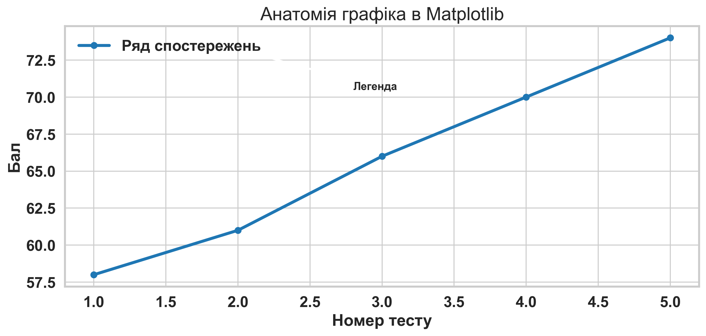

Будь-який графік у `Matplotlib` складається з кількох сутностей: об'єкта фігури (`Figure`), одного або кількох полотен осей (`Axes`), геометричних примітивів, підписів та допоміжних елементів. Розуміння цієї ієрархії дозволяє не просто «намалювати графік», а свідомо керувати його структурою.

```python
# Блок 43: Кастомізація підписів, сітки та легенди
fig, ax = plt.subplots(figsize=(8, 4))
ax.plot(df["study_hours"].head(20).values, label="study_hours", color="#ff7f0e", linewidth=2.5)
ax.grid(True, linestyle="--", alpha=0.5)
ax.legend()
ax.set_title("Налаштування стилю в Matplotlib")
ax.set_xlabel("Номер спостереження")
ax.set_ylabel("Години")
plt.show()
```

Для безперервних пар ознак зручно використовувати діаграму розсіювання. Вона дозволяє одночасно оцінити напрям зв'язку, концентрацію точок, наявність кластерів і поодиноких аномалій. Якщо ще й закодувати кольором третю ознаку, графік стає багатовимірним, але залишається читабельним.

```python
# Блок 44: Діаграма розсіювання з кодуванням кольором
fig, ax = plt.subplots(figsize=(8, 5))
scatter = ax.scatter(
    df["study_hours"],
    df["exam_score"],
    c=df["attendance"],
    cmap="viridis",
    s=70,
    edgecolor="white",
)
ax.set_title("Зв'язок між study_hours та exam_score")
ax.set_xlabel("Години підготовки")
ax.set_ylabel("Підсумковий бал")
plt.colorbar(scatter, ax=ax, label="attendance")
plt.show()
```

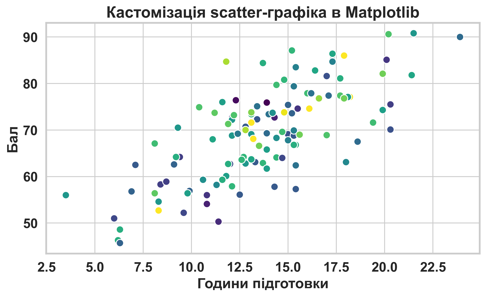

Складніші звіти зазвичай вимагають не одного графіка, а системи пов'язаних підграфіків. Саме тут перевага `Matplotlib` стає особливо очевидною, оскільки дослідник може компонувати полотно з довільною кількістю осей та узгоджувати їхню стилістику.

```python
# Блок 45: Композиція підграфіків через subplot
fig, axes = plt.subplots(1, 2, figsize=(10, 4))
axes[0].bar(df["group"].value_counts().index, df["group"].value_counts().values, color="#1f77b4")
axes[0].set_title("Розмір груп")
axes[1].plot(np.sort(df["exam_score"].values), color="#d62728", linewidth=2.5)
axes[1].set_title("Відсортовані бали")
for ax in axes:
    ax.set_xlabel("Категорія")
    ax.set_ylabel("Значення")
plt.tight_layout()
plt.show()
```

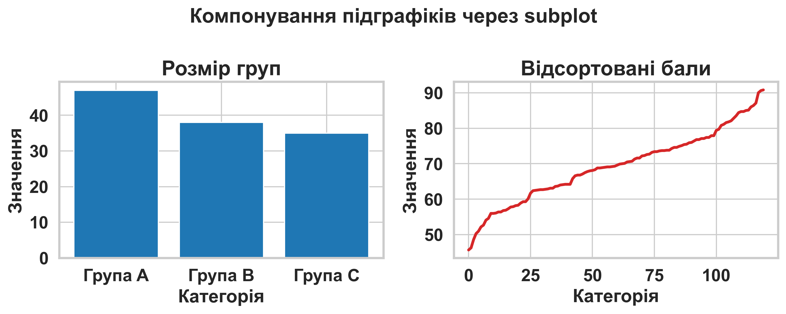

Науково-публіцистичний стиль подання вимагає, щоб графік не лише відображав дані, а й пояснював їх. Саме тому анотації, підписи значень і візуальне виділення ключових точок нерідко є не прикрасою, а необхідною частиною аргументації.

```python
# Блок 46: Стовпчиковий графік із похибками та підписами
group_stats = df.groupby("group")["exam_score"].agg(["mean", "std"]).loc[["Група A", "Група B", "Група C"]]
fig, ax = plt.subplots(figsize=(8, 4))
bars = ax.bar(group_stats.index, group_stats["mean"], yerr=group_stats["std"], capsize=8, color=["#1f77b4", "#ff7f0e", "#9467bd"])
for bar, value in zip(bars, group_stats["mean"]):
    ax.text(bar.get_x() + bar.get_width() / 2, value + 1.2, f"{value:.1f}", ha="center")
ax.set_title("Середній бал і стандартне відхилення за групами")
ax.set_ylabel("exam_score")
plt.show()
```

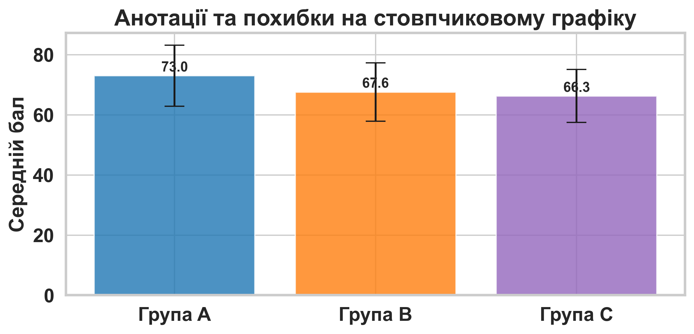

Завершальним технічним кроком є коректне збереження графіка. Якщо цього не зробити з потрібною роздільною здатністю, рисунок може втратити читабельність у навчальному посібнику, презентації чи публікації.

```python
# Блок 47: Збереження фігури у високій якості
fig, ax = plt.subplots(figsize=(8, 4))
ax.hist(df["exam_score"], bins=12, color="#1f77b4", edgecolor="black")
ax.set_title("Збереження графіка")
ax.set_xlabel("exam_score")
ax.set_ylabel("Частота")
fig.savefig("exam_score_hist.png", dpi=300, bbox_inches="tight")
plt.close(fig)
```

## 8. Візуалізація в Seaborn

Бібліотека `Seaborn` побудована поверх `Matplotlib`, але орієнтована саме на статистичне подання даних. Її перевага полягає в тому, що багато типових графіків мають змістовні параметри за замовчуванням: естетично узгоджені палітри, коректні підписи, зручна інтеграція з `DataFrame` та орієнтація на категоріальні й числові ознаки одночасно.

```python
# Блок 48: Гістограма з ядровою оцінкою щільності через Seaborn
plt.figure(figsize=(8, 4))
sns.histplot(data=df, x="exam_score", kde=True, bins=14, color="#1f77b4")
plt.title("Seaborn histplot із KDE-кривою")
plt.xlabel("Підсумковий бал")
plt.ylabel("Частота")
plt.show()
```

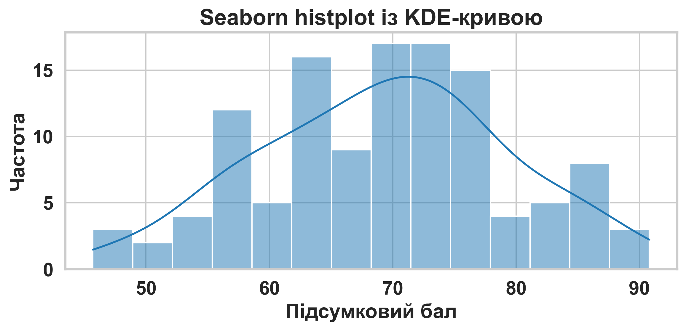

`Boxplot` у `Seaborn` є зручним інструментом для порівняння групових розподілів. Він стисло поєднує квартилі, медіану, вуса та потенційні викиди, тому добре підходить для аналітичних звітів, де треба швидко порівняти кілька категорій.

```python
# Блок 49: Boxplot підсумкових балів за групами
plt.figure(figsize=(8, 4))
sns.boxplot(
    data=df,
    x="group",
    y="exam_score",
    hue="group",
    palette=["#1f77b4", "#ff7f0e", "#9467bd"],
    legend=False,
)
plt.title("Порівняння балів між групами")
plt.xlabel("Група")
plt.ylabel("exam_score")
plt.show()
```

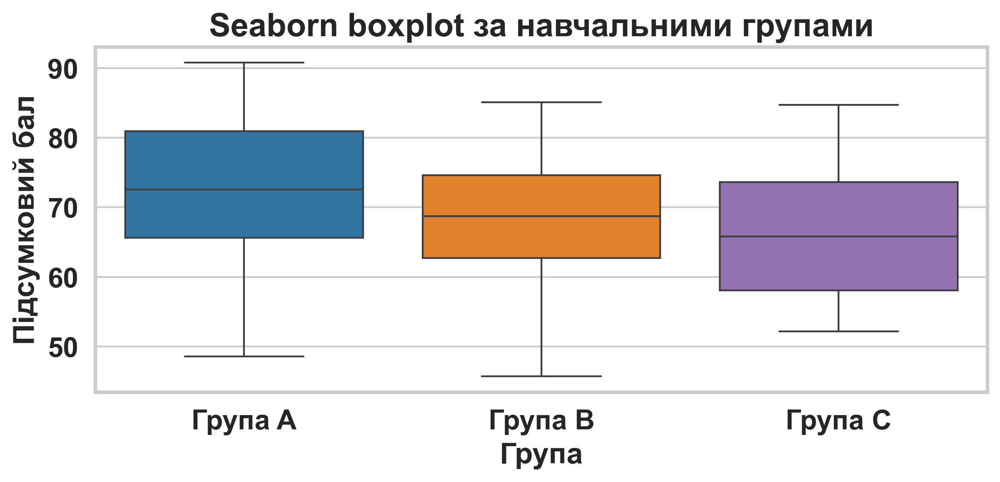

`Violinplot` доповнює `boxplot`, оскільки показує не лише квартильну структуру, а й приблизну форму щільності розподілу. Якщо дві групи мають схожі медіани, але різну форму розподілу, саме `violinplot` дає досліднику потрібну контекстуальну інформацію.

```python
# Блок 50: Violinplot для годин підготовки
plt.figure(figsize=(8, 4))
sns.violinplot(
    data=df,
    x="group",
    y="study_hours",
    hue="group",
    palette=["#1f77b4", "#ff7f0e", "#9467bd"],
    legend=False,
    inner="quartile",
)
sns.stripplot(data=df, x="group", y="study_hours", color="black", size=3, alpha=0.35)
plt.title("Розподіл study_hours у розрізі груп")
plt.xlabel("Група")
plt.ylabel("study_hours")
plt.show()
```

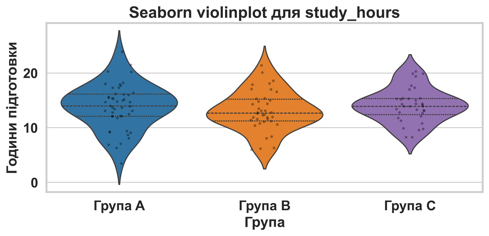

Для двох кількісних ознак з одночасним урахуванням категорії зручно застосовувати `scatterplot` з параметрами `hue` та `style`. Такий графік дає змогу побачити і загальний тренд, і групову структуру, не переходячи до окремих діаграм для кожної категорії.

```python
# Блок 51: Scatterplot із групуванням за кольором і стилем
plt.figure(figsize=(8, 5))
sns.scatterplot(
    data=df,
    x="study_hours",
    y="exam_score",
    hue="group",
    style="group",
    s=90,
)
plt.title("Зв'язок між підготовкою та результатом")
plt.xlabel("study_hours")
plt.ylabel("exam_score")
plt.show()
```

Ще один корисний інструмент — `pairplot`, який дозволяє побачити матрицю попарних зв'язків між кількома числовими ознаками. Він особливо корисний на етапі попереднього огляду, коли треба швидко визначити, які комбінації ознак заслуговують на глибший аналіз.

```python
# Блок 52: Pairplot для числових ознак
pair_df = df[["exam_score", "study_hours", "attendance", "attempts"]]
g = sns.pairplot(pair_df, corner=True, diag_kind="hist")
g.fig.suptitle("Матриця попарних зв'язків", y=1.02)
plt.show()
```

Для зведеного подання кореляцій між кількома змінними доцільно використовувати теплову карту. Вона компактно демонструє знак і силу лінійного зв'язку, а отже, допомагає виявити як очікувані, так і неочевидні залежності між ознаками.

| Завдання | Matplotlib | Seaborn |
|---|---|---|
| Точний контроль композиції | дуже високий | середній |
| Швидке статистичне оформлення | помірне | високе |
| Робота безпосередньо з `DataFrame` | опосередкована | природна |
| Типові графіки для EDA | потребують більше коду | задаються коротко |

```python
# Блок 53: Кореляційна теплова карта
plt.figure(figsize=(7, 5))
corr = df[["exam_score", "study_hours", "attendance", "attempts"]].corr()
sns.heatmap(corr, annot=True, cmap="Blues", fmt=".2f", linewidths=1.0)
plt.title("Кореляційна матриця числових ознак")
plt.show()
```

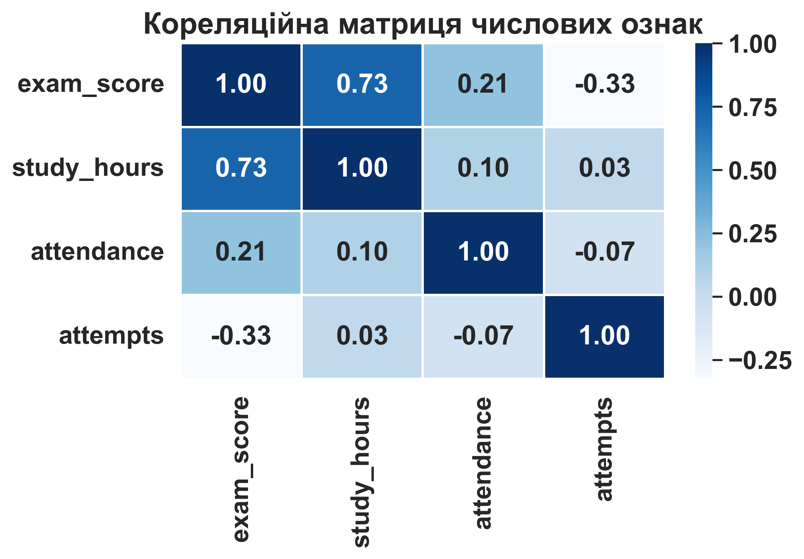

## 9. Узагальнюючий приклад аналізу та корисні посилання

На практиці описова статистика не розпадається на ізольовані кроки. Дослідник одночасно очищує таблицю, рахує центральні характеристики, оцінює розсіювання, будує частотні таблиці та підбирає графіки, які найточніше передають структуру вибірки. Саме тому завершальний приклад має об'єднати всі розглянуті інструменти в одну послідовність дій.

```python
# Блок 54: Інтегрований груповий підсумок
summary_by_group = df.groupby("group").agg(
    mean_score=("exam_score", "mean"),
    median_score=("exam_score", "median"),
    std_score=("exam_score", lambda x: x.std(ddof=1)),
    mean_hours=("study_hours", "mean"),
    mean_attendance=("attendance", "mean"),
    mode_attempts=("attempts", lambda x: x.mode().iloc[0]),
)
print(summary_by_group.round(2))
```

Інтерпретація такого зведення має бути обережною. Якщо одна група має вище середнє, але й більше стандартне відхилення, це означає не просто «кращий результат», а іншу структуру вибірки: вищий центр може поєднуватися з більшою неоднорідністю, що по-різному впливає на управлінські або педагогічні висновки.

```python
# Блок 55: Вибір рекомендованих графіків для короткого звіту
recommended_charts = {
    "розподіл exam_score": "histplot або histogram",
    "порівняння груп": "boxplot",
    "форма розподілу study_hours": "violinplot",
    "зв'язок study_hours і exam_score": "scatterplot",
    "зв'язки між числовими ознаками": "heatmap або pairplot",
}
print(recommended_charts)
```

Окрему увагу слід приділяти оформленню висновку. Коректний підсумок не повинен обмежуватися переліком чисел; він має стисло пояснювати, які саме характеристики описують вибірку, чому обрано певні графіки і які обмеження має інтерпретація без статистичного виведення.

| Функція або метод | Призначення | Приклад |
|---|---|---|
| `np.mean` | середнє арифметичне | `np.mean(scores_array)` |
| `np.median` | медіана | `np.median(scores_array)` |
| `value_counts` | таблиця частот | `df["attempts"].value_counts()` |
| `groupby().agg()` | групові статистики | `df.groupby("group").agg(...)` |
| `plt.hist` | гістограма | `plt.hist(df["exam_score"])` |
| `sns.boxplot` | порівняння груп | `sns.boxplot(df, x="group", y="exam_score")` |
| `sns.heatmap` | кореляційна матриця | `sns.heatmap(corr, annot=True)` |

```python
# Блок 56: Формування компактного текстового звіту
report = {
    "mean_exam_score": round(df["exam_score"].mean(), 2),
    "median_exam_score": round(df["exam_score"].median(), 2),
    "std_exam_score": round(df["exam_score"].std(ddof=1), 2),
    "top_group_by_mean": summary_by_group["mean_score"].idxmax(),
}
for key, value in report.items():
    print(f"{key}: {value}")
```

У підсумку описова статистика та візуалізація даних формують єдиний методичний блок. Числові характеристики дозволяють стисло описати центр і варіативність, частотні таблиці впорядковують масив спостережень, а графіки переводять суху числову інформацію у форму, придатну для виявлення закономірностей і фахової комунікації результатів.

### Корисні посилання

1. [NumPy: Statistics routines](https://numpy.org/doc/stable/reference/routines.statistics.html)
2. [Pandas: Descriptive statistics](https://pandas.pydata.org/docs/user_guide/basics.html#descriptive-statistics)
3. [Matplotlib: Plot types](https://matplotlib.org/stable/plot_types/index.html)
4. [Seaborn: Statistical data visualization](https://seaborn.pydata.org/)
5. [OpenIntro Statistics](https://www.openintro.org/book/os/)
6. [Python Data Science Handbook](https://jakevdp.github.io/PythonDataScienceHandbook/)
