# Лекційна записка 3. Основні ймовірнісні розподіли та статистичне оцінювання

## Зміст

1. [Роль ймовірнісних моделей у статистичному оцінюванні](#1-роль-ймовірнісних-моделей-у-статистичному-оцінюванні)
2. [Підготовка вибірки та базових обчислень у Python](#2-підготовка-вибірки-та-базових-обчислень-у-python)
3. [Нормальний розподіл і нормальна апроксимація](#3-нормальний-розподіл-і-нормальна-апроксимація)
4. [Розподіл Стьюдента для малих вибірок](#4-розподіл-стьюдента-для-малих-вибірок)
5. [Хі-квадрат та F-розподіли у задачах оцінювання](#5-хі-квадрат-та-f-розподіли-у-задачах-оцінювання)
6. [Точкові оцінки та їх властивості](#6-точкові-оцінки-та-їх-властивості)
7. [Інтервальні оцінки та довірчі інтервали](#7-інтервальні-оцінки-та-довірчі-інтервали)
8. [Інтегрований приклад для виробничих партій](#8-інтегрований-приклад-для-виробничих-партій)
9. [Підсумки, шпаргалка та корисні посилання](#9-підсумки-шпаргалка-та-корисні-посилання)

---

## 1. Роль ймовірнісних моделей у статистичному оцінюванні

Ймовірнісна модель задає формальний міст між конкретною вибіркою та невідомим параметром генеральної сукупності. Без такого мосту статистичне оцінювання зводиться лише до обчислення чисел, які не мають контрольованої похибки й не допускають інтерпретації в термінах ризику, надійності та повторюваності.

Саме тому розподіли ймовірностей вивчають не ізольовано, а в прямому зв'язку з оцінюванням параметрів. Нормальний, t-, χ²- та F-розподіли утворюють ядро класичної математичної статистики, оскільки забезпечують апарат для оцінювання середнього, дисперсії, відношення дисперсій та пов'язаних з ними довірчих інтервалів.

У практиці статистичної обробки даних дослідник працює не з абстрактною густиною, а з реальною вибіркою. Проте кожен висновок про вибіркове середнє, вибіркову дисперсію або довірчі межі має сенс лише тоді, коли відомо, який розподіл лежить в основі моделі або яку апроксимацію дозволено вважати припустимою.


Розподіли, що розглядаються в цій лекції, не є рівноправними за змістом. Нормальний розподіл описує базову форму симетричної неперервної варіації; t-розподіл виникає тоді, коли стандартне відхилення генеральної сукупності невідоме й оцінюється за малою вибіркою; χ²-розподіл пов'язаний із сумою квадратів нормальних величин і використовується для інтервалів дисперсії; F-розподіл описує відношення двох незалежних нормованих χ²-величин.

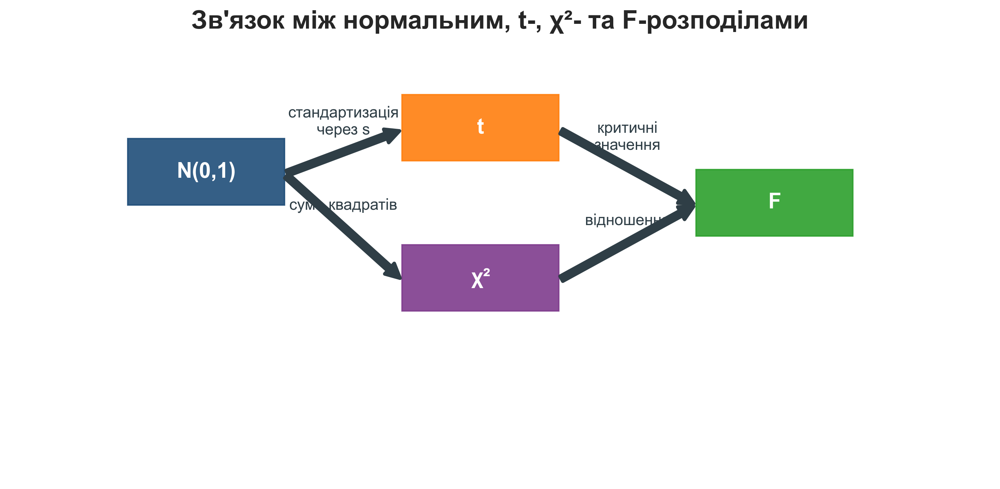

Для навчальних прикладів доцільно працювати з однією відтворюваною синтетичною вибіркою. У цій лекції використовуватиметься набір вимірювань діаметра деталей, твердості, номера виробничої партії та виробничої лінії. Такий набір є достатньо простим для ручних розрахунків і водночас дає змогу показати оцінювання середніх, дисперсій та порівняння варіативності.

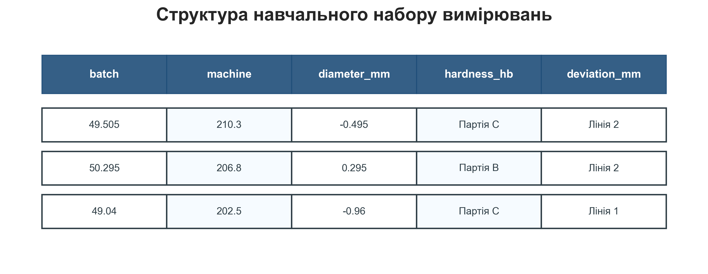

У класичній статистиці один і той самий параметр може мати декілька природних оцінок. Наприклад, центр вибірки можна подавати середнім або медіаною, а дисперсію можна оцінювати зміщеною та незміщеною формулами. Саме тому лекція приділяє окрему увагу властивостям оцінок, а не лише техніці підстановки чисел у формулу.

| Розподіл | Основний параметр або статистика | Типова задача | Ключова роль у лекції |
|---|---|---|---|
| Нормальний | $\mu$, $\sigma$ | моделювання симетричних неперервних даних | базова модель та z-стандартизація |
| Стьюдента | $t$-статистика | оцінювання середнього при невідомій $\sigma$ | інтервали та критичні значення для малих вибірок |
| Хі-квадрат | сума квадратів | оцінювання дисперсії | інтервали для $\sigma^2$ |
| F-розподіл | відношення дисперсій | аналіз співвідношення варіативностей | порівняння двох дисперсій |

На рівні математичного апарату статистичне оцінювання починається з випадкової вибірки $X_1, X_2, \dots, X_n$, яка вважається незалежною та однаково розподіленою. Оцінка параметра є функцією цієї вибірки, тобто випадковою величиною до моменту спостереження конкретних даних.

$$
\hat{\theta} = g(X_1, X_2, \dots, X_n).
$$

Це означає, що будь-яка оцінка має власний вибірковий розподіл. Саме через цей розподіл визначаються зміщеність, дисперсія, середньоквадратична помилка та ідея довірчого інтервалу.

```python
# Імпорт бібліотек для обчислень і графіків
import numpy as np
import pandas as pd
import matplotlib.pyplot as plt
import seaborn as sns
from scipy import stats
```

```python
# Фіксація генератора випадкових чисел для відтворюваності
rng = np.random.default_rng(42)
TRUE_MU = 50.0
TRUE_SIGMA = 0.55
```

```python
# Невелика навчальна вибірка для ручних розрахунків
sample_small = np.array([49.78, 50.11, 49.95, 50.24, 49.87, 50.06, 50.18, 49.92, 50.03, 49.99])
print(sample_small)
```

```python
# Базові характеристики малої вибірки
print("Кількість спостережень:", len(sample_small))
print("Мінімум:", sample_small.min())
print("Максимум:", sample_small.max())
print("Середнє:", sample_small.mean())
```

Термінологічно важливо розрізняти параметр і статистику. Параметр $\mu$ або $\sigma^2$ належить генеральній сукупності й у задачі оцінювання вважається невідомим, тоді як $\bar{x}$ та $s^2$ є функціями вибірки, обчислюваними безпосередньо з даних.

Професійний статистичний аналіз починається з правильної постановки питання. Якщо потрібно оцінити типовий рівень ознаки, центральним стає середнє або медіана; якщо треба охарактеризувати коливання, центральними стають дисперсія й стандартне відхилення; якщо необхідно описати надійність оцінки, потрібен довірчий інтервал.

```python
# Побудова основного синтетичного набору даних
n = 180
batch = rng.choice(["Партія A", "Партія B", "Партія C"], size=n, p=[0.34, 0.33, 0.33])
machine = rng.choice(["Лінія 1", "Лінія 2"], size=n, p=[0.55, 0.45])
batch_effect = pd.Series(batch).map({"Партія A": 0.18, "Партія B": 0.0, "Партія C": -0.14}).to_numpy()
machine_effect = pd.Series(machine).map({"Лінія 1": 0.05, "Лінія 2": -0.03}).to_numpy()
diameter_mm = 50 + batch_effect + machine_effect + rng.normal(0, 0.55, n)
hardness_hb = 205 + 4.0 * (diameter_mm - 50) + rng.normal(0, 5.0, n)
```

```python
# Формування DataFrame зі спостереженнями
df = pd.DataFrame(
    {
        "diameter_mm": np.round(diameter_mm, 3),
        "hardness_hb": np.round(hardness_hb, 1),
        "deviation_mm": np.round(diameter_mm - 50, 3),
        "batch": batch,
        "machine": machine,
    }
)
print(df.head())
```

```python
# Первинний структурний огляд таблиці
print(df.shape)
print(df.dtypes)
```

```python
# Частоти за партіями та лініями
print(df["batch"].value_counts())
print(df["machine"].value_counts())
```

---

## 2. Підготовка вибірки та базових обчислень у Python

Перш ніж переходити до окремих розподілів, необхідно чітко сформулювати, які статистики будуть використовуватися як будівельні блоки. Для цієї лекції такими блоками є вибіркове середнє, вибіркова дисперсія, стандартне відхилення, стандартна похибка, z- та t-статистики.

Вибіркове середнє є природною оцінкою параметра $\mu$ при моделюванні неперервних вимірювань. Воно враховує всі спостереження та має добрі асимптотичні властивості, проте чутливе до викидів і змін форми розподілу.

$$
\bar{x} = \frac{1}{n}\sum_{i=1}^{n} x_i.
$$

Вибіркова дисперсія характеризує розсіювання значень навколо центру. Для оцінювання дисперсії генеральної сукупності при нормальній моделі переважно використовують незміщену формулу з дільником $n - 1$.

$$
s^2 = \frac{1}{n - 1}\sum_{i=1}^{n} (x_i - \bar{x})^2.
$$

На практиці початковий етап роботи в Python має бути максимально прозорим. Коректно сформований `DataFrame` дає змогу працювати з вибірками як із табличними об'єктами, обчислювати групові статистики та далі безпосередньо будувати рисунки.

Нижче наведено короткий довідковий блок, який фіксує зміст основних змінних навчальної таблиці. Він потрібний не лише для зручності, а й для уникнення плутанини між власне виміряною ознакою та похідними характеристиками.

| Змінна | Тип | Зміст | Роль в оцінюванні |
|---|---|---|---|
| `diameter_mm` | числова | діаметр деталі | оцінювання $\mu$ та $\sigma^2$ |
| `hardness_hb` | числова | твердість матеріалу | допоміжний контроль зв'язку ознак |
| `deviation_mm` | числова | відхилення від номіналу 50 мм | центр і мінливість |
| `batch` | категоріальна | номер партії | групові порівняння |
| `machine` | категоріальна | виробнича лінія | порівняння дисперсій |

```python
# Ручний розрахунок вибіркового середнього
x_bar_manual = sample_small.sum() / len(sample_small)
print(round(x_bar_manual, 4))
```

```python
# Ручний розрахунок незміщеної вибіркової дисперсії
sq_dev = (sample_small - sample_small.mean()) ** 2
s2_manual = sq_dev.sum() / (len(sample_small) - 1)
print(round(s2_manual, 6))
```

```python
# Обчислення тих самих статистик через NumPy
print("mean =", np.mean(sample_small))
print("var_unbiased =", np.var(sample_small, ddof=1))
print("std_unbiased =", np.std(sample_small, ddof=1))
```

Від окремих ручних розрахунків доцільно перейти до функціоналізації. Коли обчислення оформлено як функцію, легше контролювати повторюваність, перевіряти крайові випадки й використовувати один і той самий фрагмент коду для різних вибірок.

```python
# Функція для короткого статистичного зведення
def summarize_sample(x):
    x = np.asarray(x, dtype=float)
    return {
        "n": len(x),
        "mean": x.mean(),
        "variance": x.var(ddof=1),
        "std": x.std(ddof=1),
        "min": x.min(),
        "max": x.max(),
    }


print(summarize_sample(sample_small))
```

```python
# Зведення для основної ознаки в повній таблиці
summary_diameter = summarize_sample(df["diameter_mm"])
print(summary_diameter)
```

У задачах оцінювання важливо працювати не лише з усією таблицею, а й з підвибірками. Саме підвибірки за партіями або виробничими лініями дозволяють побачити, як змінюється центр та розсіювання залежно від умов збору даних.

```python
# Підвибірки за партіями
sample_a = df.loc[df["batch"] == "Партія A", "diameter_mm"].to_numpy()
sample_b = df.loc[df["batch"] == "Партія B", "diameter_mm"].to_numpy()
sample_c = df.loc[df["batch"] == "Партія C", "diameter_mm"].to_numpy()
print(len(sample_a), len(sample_b), len(sample_c))
```

```python
# Групові середні та дисперсії
print(df.groupby("batch")["diameter_mm"].agg(["mean", "var", "std", "count"]).round(4))
```

На цьому етапі варто зафіксувати ще одну принципову обставину. Вибіркова статистика є випадковою величиною до того моменту, доки вибірка не зафіксована. Отже, мова йде не лише про обчислення одного числа, а про поведінку цього числа в гіпотетично повторюваних вибірках.

---

## 3. Нормальний розподіл і нормальна апроксимація

Нормальний розподіл посідає центральне місце в теорії статистичного оцінювання. Його роль пояснюється двома причинами: по-перше, багато природних та технологічних вимірювань наближено мають симетричну дзвоноподібну форму; по-друге, середні арифметичні завдяки центральній граничній теоремі тяжіють до нормальності навіть тоді, коли початковий розподіл не є нормальним.

Густина нормального розподілу з параметрами $\mu$ і $\sigma$ має вигляд

$$
f(x) = \frac{1}{\sigma \sqrt{2\pi}} \exp\left(-\frac{(x - \mu)^2}{2\sigma^2}\right).
$$

Параметр $\mu$ визначає положення центра кривої, тоді як $\sigma$ відповідає за її ширину. Тому в прикладному аналізі роздільно розглядають зміщення центра та зміну розсіювання.

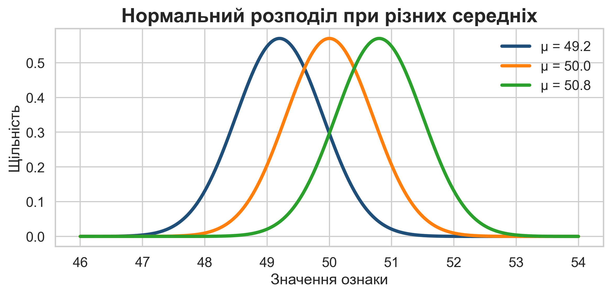

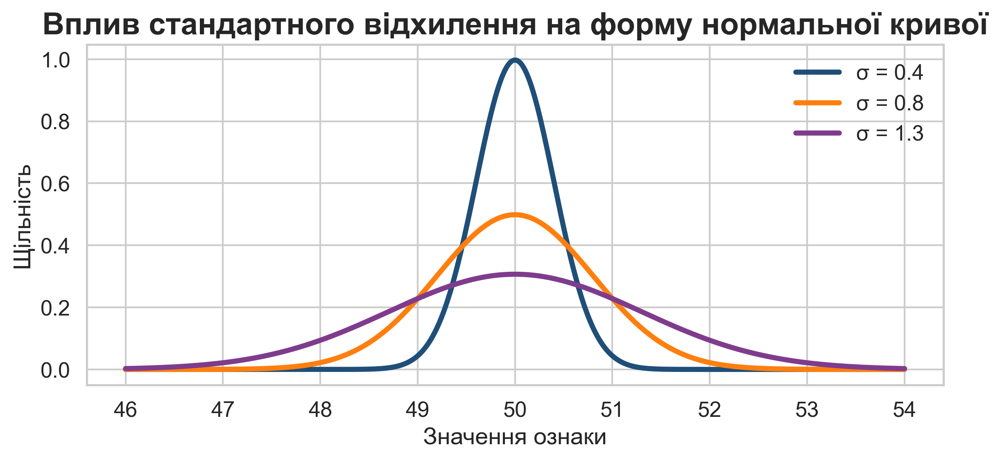

Найбільш уживаною операцією є стандартизація. Вона переводить довільну нормальну величину в стандартну, для якої вже відомі таблиці квантилів і центральні площі.

$$
Z = \frac{X - \mu}{\sigma}, \qquad Z \sim N(0,1).
$$

Стандартизована шкала лежить в основі z-інтервалів, нормальних апроксимацій і візуальної перевірки розташування спостережень відносно центра. Саме через неї формулюється правило 68-95-99.7.

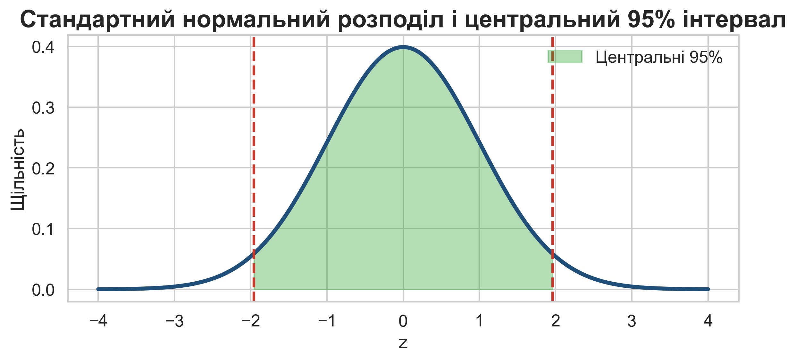

| Інтервал навколо $\mu$ | Теоретична ймовірність | Практичний зміст |
|---|---|---|
| $\mu \pm 1\sigma$ | приблизно 0.6827 | типова зона маси розподілу |
| $\mu \pm 2\sigma$ | приблизно 0.9545 | майже всі типові значення |
| $\mu \pm 3\sigma$ | приблизно 0.9973 | область майже повного покриття |

```python
# Теоретична густина нормального розподілу
x = np.linspace(46, 54, 400)
pdf_norm = stats.norm.pdf(x, loc=50, scale=0.7)
print(pdf_norm[:5])
```

```python
# Ймовірність потрапляння в симетричний інтервал
p_95 = stats.norm.cdf(1.96) - stats.norm.cdf(-1.96)
print(round(p_95, 6))
```

```python
# z-оцінки для малої вибірки
z_scores = (sample_small - sample_small.mean()) / sample_small.std(ddof=1)
print(np.round(z_scores, 3))
```

У прикладній роботі нормальний розподіл рідко спостерігається буквально. Замість цього перевіряють, чи є реальна емпірична вибірка достатньо близькою до нормальної моделі для цілей оцінювання. Найпростішими інструментами такого огляду є гістограма з накладеною щільністю та QQ-діаграма.

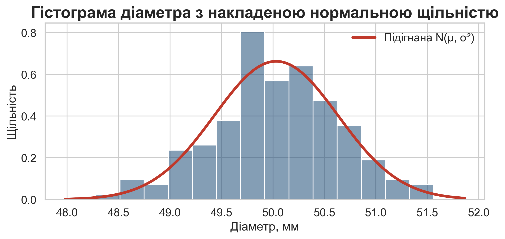

```python
# Оцінка параметрів нормальної моделі за даними
mu_hat = df["diameter_mm"].mean()
sigma_hat = df["diameter_mm"].std(ddof=1)
print(round(mu_hat, 4), round(sigma_hat, 4))
```

```python
# Побудова координат підігнаної щільності
x_grid = np.linspace(df["diameter_mm"].min() - 0.3, df["diameter_mm"].max() + 0.3, 300)
fitted_density = stats.norm.pdf(x_grid, loc=mu_hat, scale=sigma_hat)
print(fitted_density[:3])
```

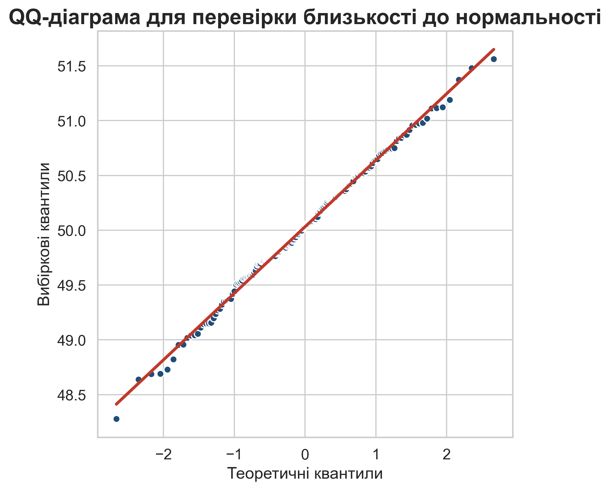

```python
# Теоретичні та вибіркові квантили через probplot
qq_result = stats.probplot(df["diameter_mm"], dist="norm")
print(type(qq_result), len(qq_result))
```

Навіть якщо початкові спостереження є неідеально нормальними, середні арифметичні мають тенденцію до нормалізації при збільшенні обсягу вибірки. Саме це пояснює, чому нормальна апроксимація настільки важлива в оцінюванні параметрів.

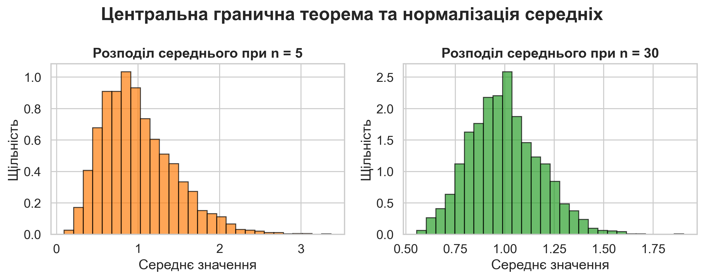

```python
# Ілюстрація центральної граничної теореми
means_n5 = [rng.exponential(scale=1.0, size=5).mean() for _ in range(2000)]
means_n30 = [rng.exponential(scale=1.0, size=30).mean() for _ in range(2000)]
print(np.mean(means_n5), np.mean(means_n30))
```

Нормальний розподіл тому і є центральним, що він одночасно виступає моделлю самих даних та асимптотичною моделлю для багатьох статистик. Але коли стандартне відхилення невідоме, а вибірка мала, на перший план виходить вже не нормальний, а t-розподіл.

---

## 4. Розподіл Стьюдента для малих вибірок

Розподіл Стьюдента з'являється тоді, коли невідоме стандартне відхилення генеральної сукупності замінюють його вибірковою оцінкою. Через додаткову невизначеність хвости розподілу стають важчими, ніж у стандартної нормалі.

Якщо $X_1, \dots, X_n$ утворюють нормальну вибірку, то статистика

$$
T = \frac{\bar{X} - \mu}{S / \sqrt{n}}
$$

має t-розподіл з $\nu = n - 1$ ступенями свободи. Це твердження лежить в основі класичного інтервалу для середнього при невідомій дисперсії.

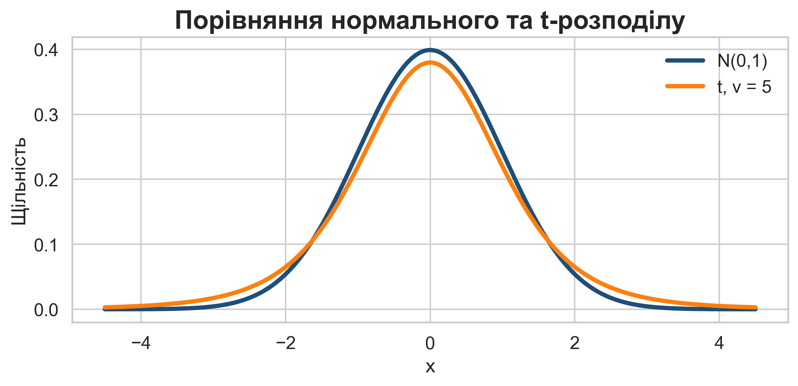

Коли кількість ступенів свободи збільшується, t-розподіл наближається до стандартного нормального. Тому для великих вибірок різниця між z- та t-підходами зменшується, але для малих вибірок ігнорувати її не можна.

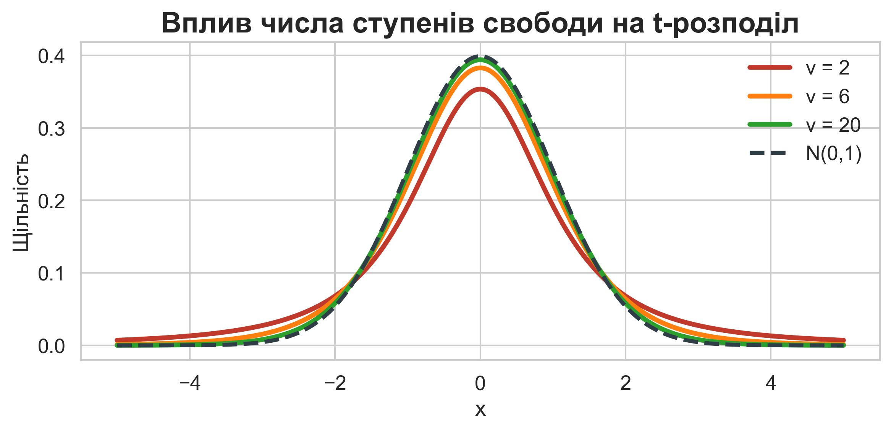

```python
# Значення густини t-розподілу
x = np.linspace(-4, 4, 300)
t_pdf = stats.t.pdf(x, df=5)
print(t_pdf[:5])
```

```python
# Порівняння критичних значень z і t
z_crit = stats.norm.ppf(0.975)
t_crit_9 = stats.t.ppf(0.975, df=9)
t_crit_29 = stats.t.ppf(0.975, df=29)
print(round(z_crit, 4), round(t_crit_9, 4), round(t_crit_29, 4))
```

```python
# t-статистика для перевірки гіпотетичного середнього
t_stat = (sample_small.mean() - TRUE_MU) / (sample_small.std(ddof=1) / np.sqrt(len(sample_small)))
print(round(t_stat, 4))
```

На практиці t-розподіл найчастіше використовується не для самої перевірки, а для побудови інтервалу навколо середнього. Формула інтервалу містить вибіркове стандартне відхилення та квантиль t-розподілу.

$$
\bar{x} \pm t_{1-\alpha/2,\, n-1}\frac{s}{\sqrt{n}}.
$$

```python
# 95% довірчий інтервал для середнього через t-розподіл
n_small = len(sample_small)
se_small = sample_small.std(ddof=1) / np.sqrt(n_small)
t_crit = stats.t.ppf(0.975, df=n_small - 1)
ci_t = (sample_small.mean() - t_crit * se_small, sample_small.mean() + t_crit * se_small)
print(tuple(round(v, 4) for v in ci_t))
```

```python
# Довірчий інтервал для середнього по партії A
se_a = sample_a.std(ddof=1) / np.sqrt(len(sample_a))
t_crit_a = stats.t.ppf(0.975, df=len(sample_a) - 1)
ci_a = (sample_a.mean() - t_crit_a * se_a, sample_a.mean() + t_crit_a * se_a)
print(tuple(round(v, 4) for v in ci_a))
```

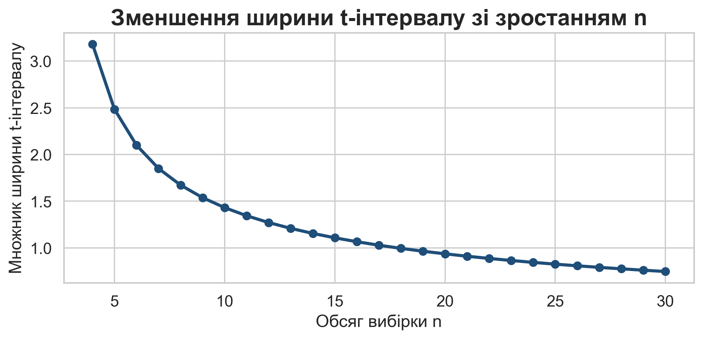

```python
# Нормований множник ширини t-інтервалу для різних n
n_values = np.arange(4, 11)
width_factors = [2 * stats.t.ppf(0.975, df=n - 1) / np.sqrt(n) for n in n_values]
print(np.round(width_factors, 4))
```

| Ознака | z-підхід | t-підхід |
|---|---|---|
| Відомість $\sigma$ | вважається відомою | невідома, замінюється на $s$ |
| Малий обсяг вибірки | небезпечний без додаткових припущень | стандартна робоча схема |
| Форма хвостів | тонші хвости | важчі хвости |
| Квантиль для 95% | приблизно 1.96 | залежить від $n - 1$ |

Усі формули з t-розподілом нагадують нормальні, але вони суворіші до малої вибірки. Саме тут з'являється ідея ступенів свободи як міри кількості незалежної інформації, що залишається після оцінювання середнього.

---

## 5. Хі-квадрат та F-розподіли у задачах оцінювання

Хі-квадрат розподіл тісно пов'язаний із нормальними випадковими величинами. Якщо $Z_1, \dots, Z_\nu$ є незалежними стандартними нормальними величинами, то сума їх квадратів має χ²-розподіл з $\nu$ ступенями свободи.

$$
\chi^2 = \sum_{i=1}^{\nu} Z_i^2.
$$

Для статистичного оцінювання цей факт важливий тому, що при нормальній вибірці величина

$$
\frac{(n-1)S^2}{\sigma^2}
$$

має χ²-розподіл з $n - 1$ ступенями свободи. Отже, саме χ²-розподіл дозволяє будувати довірчі інтервали для дисперсії генеральної сукупності.

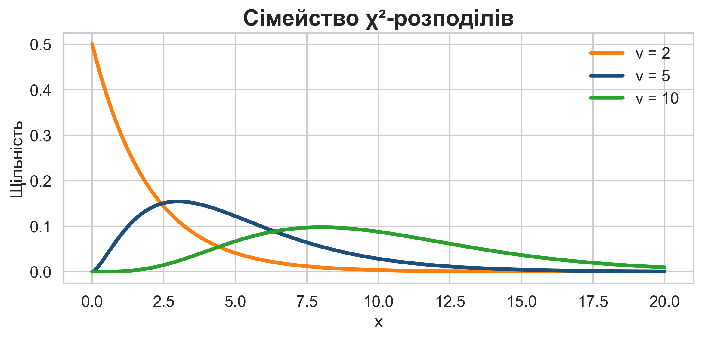

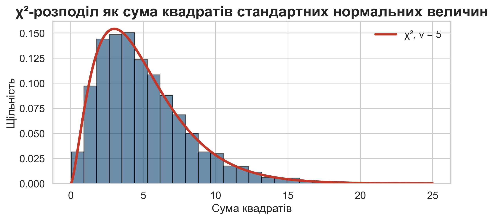

```python
# Теоретичні значення густини χ²-розподілу
x = np.linspace(0.01, 20, 300)
chi_pdf = stats.chi2.pdf(x, df=5)
print(chi_pdf[:5])
```

```python
# Симуляція суми квадратів стандартних нормальних величин
z = rng.normal(size=(4000, 5))
chi_sum = np.sum(z ** 2, axis=1)
print(round(chi_sum.mean(), 4), round(chi_sum.var(), 4))
```

```python
# Незміщена оцінка дисперсії для малої вибірки
s2_small = np.var(sample_small, ddof=1)
print(round(s2_small, 6))
```

Довірчий інтервал для дисперсії при рівні довіри $1 - \alpha$ записується як

$$
\left(
\frac{(n-1)s^2}{\chi^2_{1-\alpha/2,\, n-1}},
\frac{(n-1)s^2}{\chi^2_{\alpha/2,\, n-1}}
\right).
$$

```python
# 95% довірчий інтервал для дисперсії малої вибірки
dfree = len(sample_small) - 1
chi2_left = stats.chi2.ppf(0.975, df=dfree)
chi2_right = stats.chi2.ppf(0.025, df=dfree)
ci_var = (dfree * s2_small / chi2_left, dfree * s2_small / chi2_right)
print(tuple(round(v, 6) for v in ci_var))
```

```python
# Довірчий інтервал для стандартного відхилення
ci_sigma = tuple(np.sqrt(v) for v in ci_var)
print(tuple(round(v, 6) for v in ci_sigma))
```

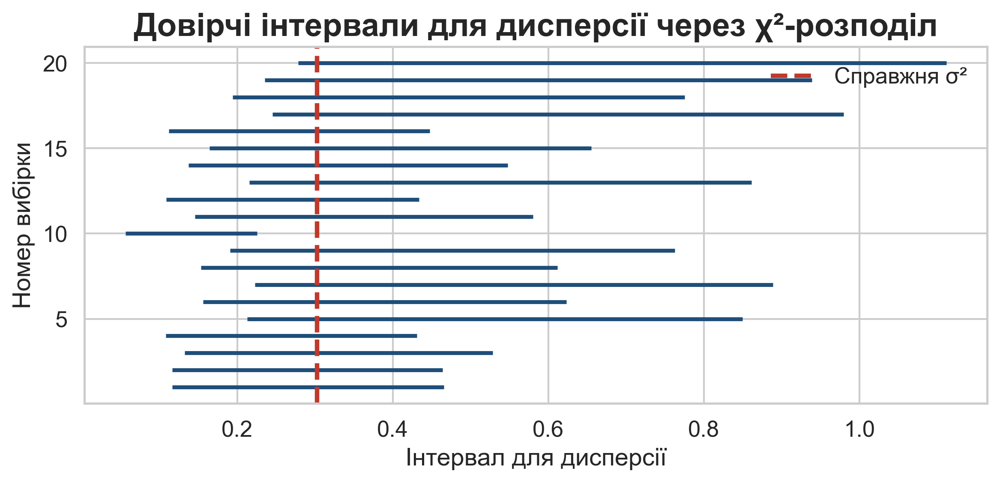

F-розподіл, своєю чергою, виникає як відношення двох незалежних нормованих χ²-величин. Це робить його природною моделлю для відношення двох вибіркових дисперсій.

$$
F = \frac{(\chi^2_{\nu_1} / \nu_1)}{(\chi^2_{\nu_2} / \nu_2)}.
$$

```python
# Теоретичні значення густини F-розподілу
x_f = np.linspace(0.01, 4.5, 300)
f_pdf = stats.f.pdf(x_f, dfn=6, dfd=12)
print(f_pdf[:5])
```

```python
# Симуляція F-розподілу через генератор SciPy
f_values = stats.f.rvs(dfn=6, dfd=12, size=5000, random_state=rng)
print(round(f_values.mean(), 4))
```

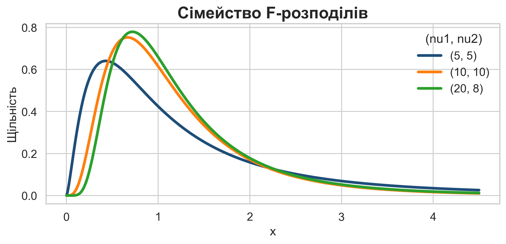

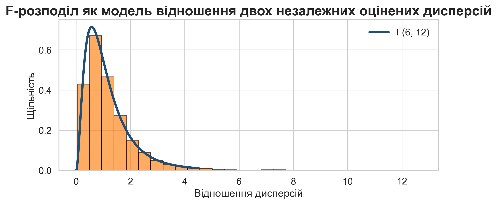

```python
# Відношення дисперсій між двома партіями
var_a = np.var(sample_a, ddof=1)
var_b = np.var(sample_b, ddof=1)
f_ratio_ab = var_a / var_b
print(round(f_ratio_ab, 4))
```

```python
# Критичні точки F-розподілу для рівня 0.95
f_crit_upper = stats.f.ppf(0.975, dfn=len(sample_a) - 1, dfd=len(sample_b) - 1)
f_crit_lower = stats.f.ppf(0.025, dfn=len(sample_a) - 1, dfd=len(sample_b) - 1)
print(round(f_crit_lower, 4), round(f_crit_upper, 4))
```

| Розподіл | Що моделює | Типовий параметр | Практичний результат |
|---|---|---|---|
| χ² | суму квадратів або нормовану дисперсію | $\sigma^2$ | інтервал для дисперсії |
| F | відношення двох нормованих дисперсій | $\sigma_1^2 / \sigma_2^2$ | аналіз співвідношення варіативностей |

Хі-квадрат та F-розподіли мають виразну правосторонню асиметрію. Саме тому їх інтервали та критичні області не можна інтерпретувати симетрично за аналогією до нормального або t-розподілу.

---

## 6. Точкові оцінки та їх властивості

Точкова оцінка подає невідомий параметр одним числом. Такий формат є зручним, але небезпечним, якщо дослідник забуває, що за кожним одним числом стоїть вибірковий розподіл і певна невизначеність.

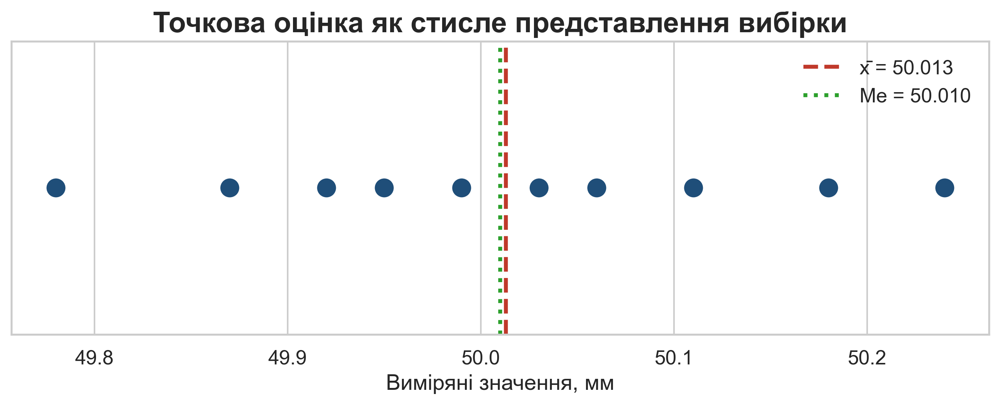

Для параметра $\mu$ типовою оцінкою є $\bar{X}$, для дисперсії $\sigma^2$ - статистика $S^2$, а для стандартного відхилення $\sigma$ - величина $S$. У практиці оцінювання ці статистики є початковою точкою, з якої далі будуються інтервальні оцінки та проводяться порівняння.

```python
# Точкові оцінки середнього, дисперсії та стандартного відхилення
mu_hat_full = df["diameter_mm"].mean()
var_hat_full = df["diameter_mm"].var(ddof=1)
std_hat_full = df["diameter_mm"].std(ddof=1)
print(round(mu_hat_full, 4), round(var_hat_full, 6), round(std_hat_full, 4))
```

```python
# Точкова оцінка для кожної партії
point_estimates = df.groupby("batch")["diameter_mm"].agg(["mean", "var", "std"]).round(4)
print(point_estimates)
```

Однією з базових властивостей є незміщеність. Оцінка $\hat{\theta}$ називається незміщеною для параметра $\theta$, якщо її математичне сподівання дорівнює істинному значенню параметра.

$$
E(\hat{\theta}) = \theta.
$$

Якщо ж

$$
\operatorname{Bias}(\hat{\theta}) = E(\hat{\theta}) - \theta \neq 0,
$$

то оцінка є зміщеною. Зміщення саме по собі не завжди робить оцінку непридатною, але його необхідно контролювати і враховувати разом з дисперсією.

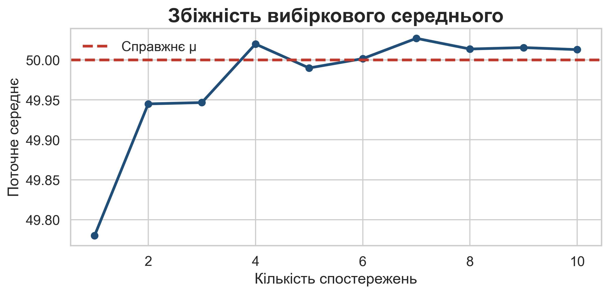

```python
# Кумулятивне середнє як наочна ілюстрація збіжності
cumulative_mean = np.cumsum(sample_small) / np.arange(1, len(sample_small) + 1)
print(np.round(cumulative_mean, 4))
```

```python
# Емпіричне зміщення штучно зсуненої оцінки
estimates_shifted = np.array([rng.normal(TRUE_MU, TRUE_SIGMA, size=12).mean() + 0.18 for _ in range(3000)])
bias_shifted = estimates_shifted.mean() - TRUE_MU
print(round(bias_shifted, 4))
```

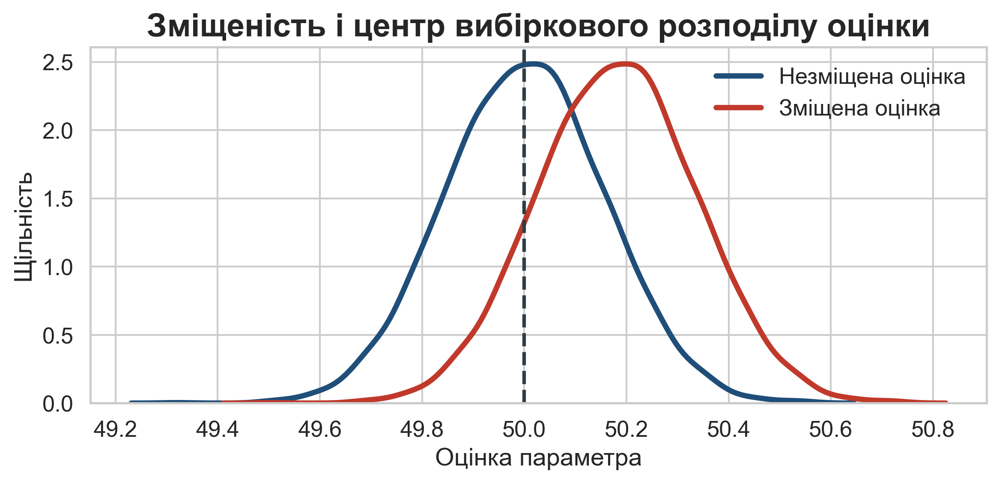

Ще однією важливою характеристикою є дисперсія оцінки. Дві оцінки можуть бути однаково незміщеними, але одна з них коливатиметься значно слабше у повторних вибірках. Саме тому в теорії оцінювання розглядають не лише центр, а й ширину вибіркового розподілу.

Середньоквадратична помилка поєднує зміщення і варіативність в одному числі:

$$
\operatorname{MSE}(\hat{\theta}) = \operatorname{Var}(\hat{\theta}) + \operatorname{Bias}^2(\hat{\theta}).
$$

```python
# Порівняння зміщеної та незміщеної оцінок дисперсії
var_biased = np.var(sample_small, ddof=0)
var_unbiased = np.var(sample_small, ddof=1)
print(round(var_biased, 6), round(var_unbiased, 6))
```

```python
# Симуляція середніх значень двох оцінок дисперсії
biased_vals = []
unbiased_vals = []
for _ in range(2500):
    sample = rng.normal(TRUE_MU, TRUE_SIGMA, size=10)
    biased_vals.append(np.var(sample, ddof=0))
    unbiased_vals.append(np.var(sample, ddof=1))
print(round(np.mean(biased_vals), 6), round(np.mean(unbiased_vals), 6))
```

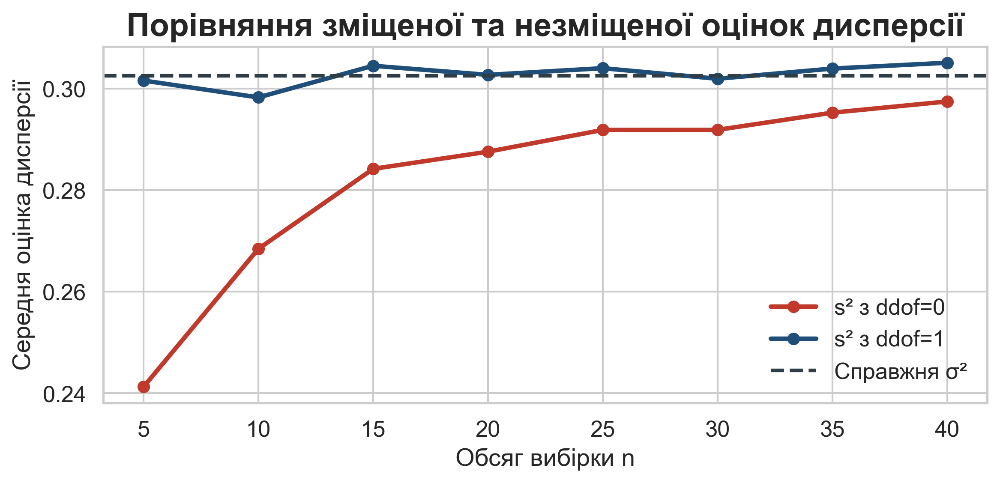

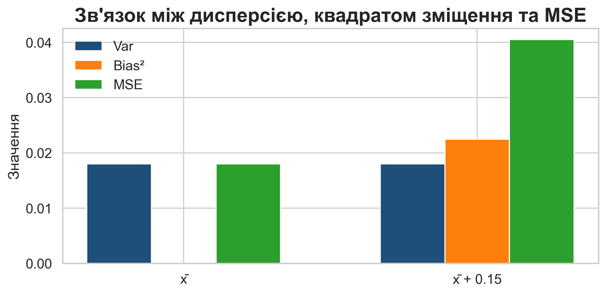

```python
# Розклад MSE для двох оцінок
variance_xbar = np.var([rng.normal(TRUE_MU, TRUE_SIGMA, size=12).mean() for _ in range(3000)])
bias_sq_xbar = (np.mean([rng.normal(TRUE_MU, TRUE_SIGMA, size=12).mean() for _ in range(3000)]) - TRUE_MU) ** 2
print(round(variance_xbar + bias_sq_xbar, 6))
```

Оцінка називається спроможною, якщо зі зростанням обсягу вибірки вона збігається до істинного параметра. Для вибіркового середнього ця властивість реалізується за дуже загальних умов, що робить його центральним інструментом статистичного оцінювання.

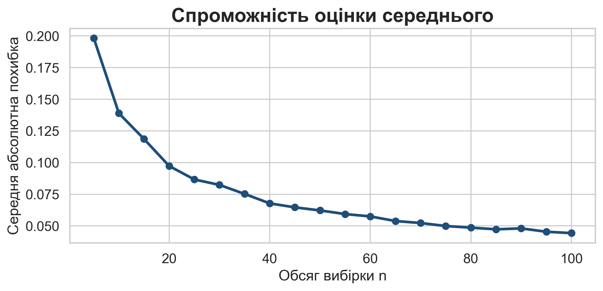

```python
# Середня абсолютна похибка оцінки середнього для різних n
errors = []
for n_local in range(5, 55, 5):
    estimates = [rng.normal(TRUE_MU, TRUE_SIGMA, size=n_local).mean() for _ in range(2000)]
    errors.append(np.mean(np.abs(np.array(estimates) - TRUE_MU)))
print(np.round(errors, 4))
```

Ефективність пов'язана з порівнянням дисперсій оцінок, які мають однакову ціль. Для нормальної моделі середнє зазвичай є ефективнішим за медіану, тоді як для розподілів із важкими хвостами ситуація може змінюватися.

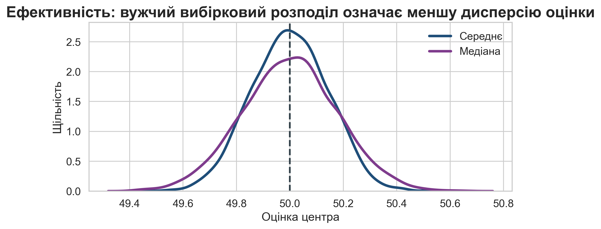

```python
# Порівняння ефективності середнього та медіани
means = [rng.normal(TRUE_MU, TRUE_SIGMA, size=15).mean() for _ in range(3000)]
medians = [np.median(rng.normal(TRUE_MU, TRUE_SIGMA, size=15)) for _ in range(3000)]
print(round(np.var(means), 6), round(np.var(medians), 6))
```

| Властивість | Формальне формулювання | Практичне значення |
|---|---|---|
| Незміщеність | $E(\hat{\theta}) = \theta$ | середнє положення оцінки правильне |
| Спроможність | $\hat{\theta} \to \theta$ при $n \to \infty$ | великі вибірки стабілізують оцінку |
| Ефективність | менша дисперсія серед конкурентів | оцінка менш мінлива |
| Мала MSE | мала $\operatorname{Var} + \operatorname{Bias}^2$ | сумарна похибка мінімізується |

```python
# Узагальнююча функція для властивостей оцінки
def mse(estimates, true_value):
    estimates = np.asarray(estimates, dtype=float)
    return np.mean((estimates - true_value) ** 2)


print(round(mse(means, TRUE_MU), 6))
```

---

## 7. Інтервальні оцінки та довірчі інтервали

Точкова оцінка стисло подає параметр, але не повідомляє про ступінь невизначеності. Інтервальна оцінка виправляє цей недолік, оскільки задає діапазон правдоподібних значень параметра з контрольованим рівнем довіри.

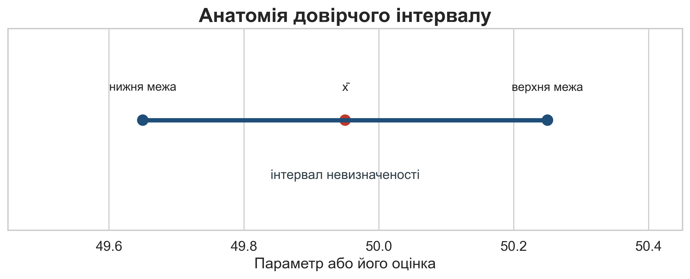

Для середнього при відомій дисперсії використовують z-інтервал

$$
\bar{x} \pm z_{1-\alpha/2}\frac{\sigma}{\sqrt{n}},
$$

а при невідомій дисперсії - t-інтервал

$$
\bar{x} \pm t_{1-\alpha/2,\, n-1}\frac{s}{\sqrt{n}}.
$$

Ширина інтервалу залежить від трьох факторів: довірчого рівня, мінливості даних та обсягу вибірки. Саме тому збільшення $n$ систематично звужує інтервал, а підвищення рівня довіри, навпаки, розширює його.

```python
# Функція z-інтервалу для середнього при відомій sigma
def z_interval_mean(sample, sigma, alpha=0.05):
    sample = np.asarray(sample, dtype=float)
    mean = sample.mean()
    margin = stats.norm.ppf(1 - alpha / 2) * sigma / np.sqrt(len(sample))
    return mean - margin, mean + margin


print(tuple(round(v, 4) for v in z_interval_mean(sample_small, sigma=TRUE_SIGMA)))
```

```python
# Функція t-інтервалу для середнього при невідомій sigma
def t_interval_mean(sample, alpha=0.05):
    sample = np.asarray(sample, dtype=float)
    mean = sample.mean()
    se = sample.std(ddof=1) / np.sqrt(len(sample))
    margin = stats.t.ppf(1 - alpha / 2, df=len(sample) - 1) * se
    return mean - margin, mean + margin


print(tuple(round(v, 4) for v in t_interval_mean(sample_small)))
```

Під час інтерпретації довірчого інтервалу не слід казати, що сам параметр випадково перебуває всередині або поза межами інтервалу. Коректне формулювання таке: процедура побудови інтервалу в довгому ряді повторень покриває істинний параметр із наперед заданою частотою.

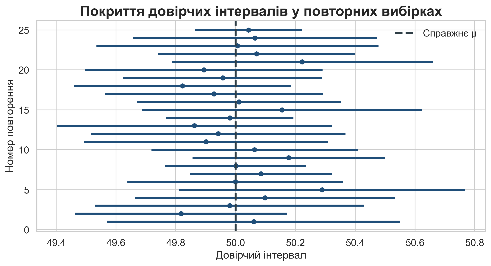

```python
# Перевірка покриття 95% t-інтервалу у симуляції
covered = 0
reps = 1000
for _ in range(reps):
    sample = rng.normal(TRUE_MU, TRUE_SIGMA, size=12)
    left, right = t_interval_mean(sample, alpha=0.05)
    if left <= TRUE_MU <= right:
        covered += 1
print(round(covered / reps, 4))
```

```python
# Ширина інтервалу для малої вибірки
left, right = t_interval_mean(sample_small)
print(round(right - left, 4))
```

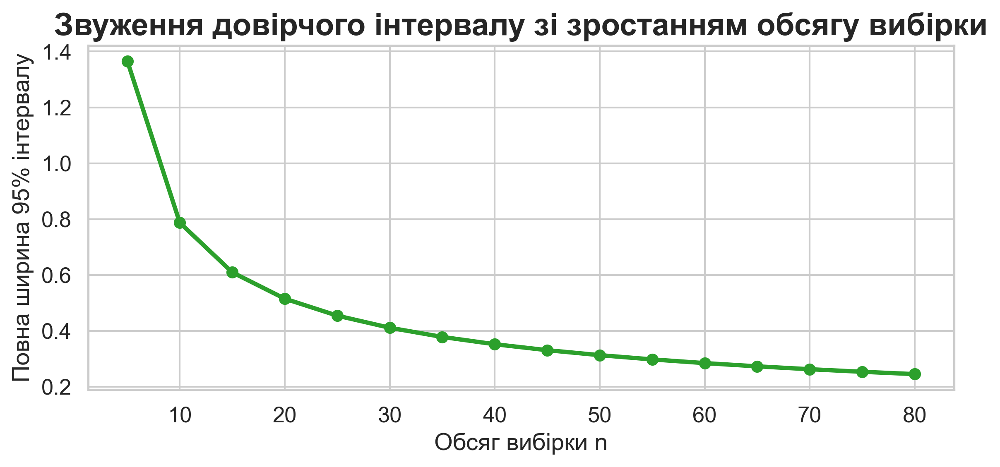

```python
# Ширина t-інтервалу як функція n
interval_widths = []
for n_local in range(5, 31):
    sample = rng.normal(TRUE_MU, TRUE_SIGMA, size=n_local)
    left, right = t_interval_mean(sample)
    interval_widths.append(right - left)
print(np.round(interval_widths[:6], 4))
```

Нерідко початківці помилково застосовують z-інтервал там, де стандартне відхилення генеральної сукупності фактично невідоме. Для великих вибірок така помилка може бути невеликою, але для малих вибірок вона систематично робить інтервал надто вузьким.

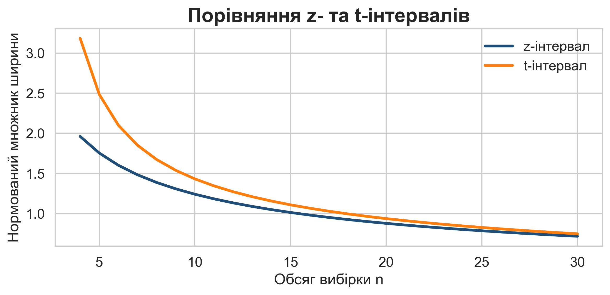

```python
# Безпосереднє порівняння z- та t-інтервалів
ci_z = z_interval_mean(sample_small, sigma=sample_small.std(ddof=1))
ci_t = t_interval_mean(sample_small)
print(tuple(round(v, 4) for v in ci_z))
print(tuple(round(v, 4) for v in ci_t))
```

```python
# Довірчі інтервали середніх по всіх партіях
intervals_by_batch = {}
for name, group in df.groupby("batch"):
    intervals_by_batch[name] = t_interval_mean(group["diameter_mm"].to_numpy())
print({k: tuple(round(v, 4) for v in val) for k, val in intervals_by_batch.items()})
```

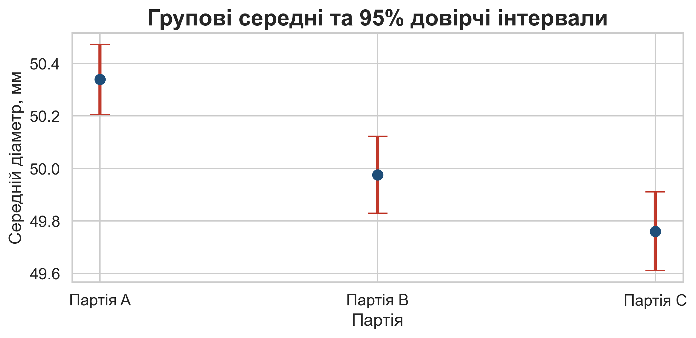

Для дисперсії та стандартного відхилення потрібно пам'ятати про окрему формулу через χ²-розподіл. Для відношення дисперсій застосовуються вирази на основі F-розподілу. Отже, вибір формули залежить не від смаку дослідника, а від того, який параметр оцінюється.

| Що оцінюється | Умови | Формула або розподіл |
|---|---|---|
| Середнє $\mu$ | $\sigma$ відома | z-інтервал |
| Середнє $\mu$ | $\sigma$ невідома | t-інтервал |
| Дисперсія $\sigma^2$ | нормальна модель | χ²-інтервал |
| Відношення $\sigma_1^2/\sigma_2^2$ | дві незалежні нормальні вибірки | F-апарат |

```python
# Довірчий інтервал для дисперсії партії A
s2_a = sample_a.var(ddof=1)
df_a = len(sample_a) - 1
var_interval_a = (
    df_a * s2_a / stats.chi2.ppf(0.975, df=df_a),
    df_a * s2_a / stats.chi2.ppf(0.025, df=df_a),
)
print(tuple(round(v, 6) for v in var_interval_a))
```

---

## 8. Інтегрований приклад для виробничих партій

Окремі формули та локальні приклади мають сенс лише тоді, коли вони складаються в єдину процедуру аналізу. У цьому розділі вся логіка поєднується: від первинного зведення вибірки до оцінювання групових середніх, дисперсій та інтервалів.

На рівні виробничої практики запитання можна сформулювати так: чи відрізняються партії за середнім діаметром, наскільки стабільні виробничі лінії й чи є спостережувані розбіжності достатньо великими, щоб заслуговувати на окрему увагу технолога. Це типова задача статистичної обробки, де числові оцінки мають бути доповнені інтервальною інтерпретацією.

```python
# Інтегроване групове зведення для діаметра
group_summary = df.groupby("batch").agg(
    mean_diameter=("diameter_mm", "mean"),
    median_diameter=("diameter_mm", "median"),
    var_diameter=("diameter_mm", "var"),
    std_diameter=("diameter_mm", "std"),
    count=("diameter_mm", "count"),
)
print(group_summary.round(4))
```

Початковий висновок повинен спиратися не лише на середні, а й на варіативність. Партія з більшим середнім і водночас ширшим інтервалом може бути менш передбачуваною, ніж партія з трохи нижчим середнім, але вузькою невизначеністю.

```python
# Додавання довірчих меж до групового зведення
def add_t_interval(row):
    sub = df.loc[df["batch"] == row.name, "diameter_mm"].to_numpy()
    left, right = t_interval_mean(sub)
    return pd.Series({"ci_left": left, "ci_right": right})


group_summary = group_summary.join(group_summary.apply(add_t_interval, axis=1))
print(group_summary.round(4))
```

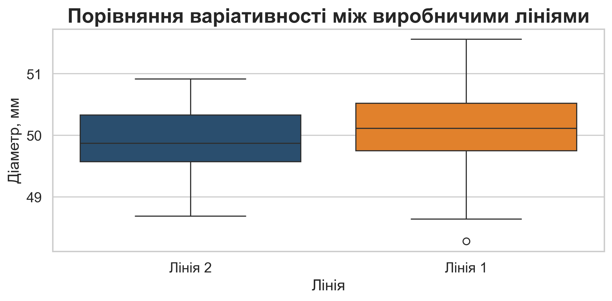

```python
# Порівняння дисперсій між виробничими лініями
line1 = df.loc[df["machine"] == "Лінія 1", "diameter_mm"].to_numpy()
line2 = df.loc[df["machine"] == "Лінія 2", "diameter_mm"].to_numpy()
f_ratio_lines = np.var(line1, ddof=1) / np.var(line2, ddof=1)
print(round(f_ratio_lines, 4))
```

```python
# Критичні межі F-розподілу для двох ліній
f_lower = stats.f.ppf(0.025, dfn=len(line1) - 1, dfd=len(line2) - 1)
f_upper = stats.f.ppf(0.975, dfn=len(line1) - 1, dfd=len(line2) - 1)
print(round(f_lower, 4), round(f_upper, 4))
```

Важливо пам'ятати, що навіть добре сформульований інтервал не відповідає на всі змістові запитання автоматично. Інтервал описує невизначеність навколо параметра, але не пояснює причин відмінностей між партіями. Для причинної інтерпретації потрібні предметні знання, дизайн експерименту або додаткове моделювання.

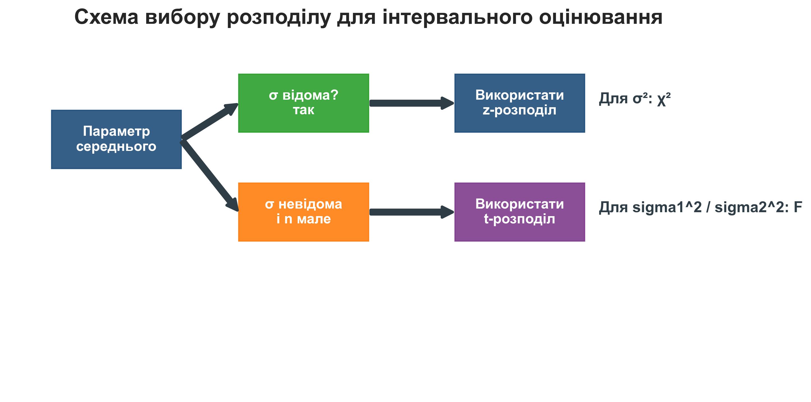

```python
# Логіка вибору розподілу для інтервалу
def choose_interval_model(parameter, sigma_known=False):
    if parameter == "mean" and sigma_known:
        return "z"
    if parameter == "mean" and not sigma_known:
        return "t"
    if parameter == "variance":
        return "chi2"
    if parameter == "variance_ratio":
        return "f"
    return "unknown"


print(choose_interval_model("mean", sigma_known=False))
print(choose_interval_model("variance"))
```

```python
# Короткий діагностичний звіт за партіями
report = {
    "best_mean_batch": group_summary["mean_diameter"].idxmax(),
    "most_stable_batch": group_summary["std_diameter"].idxmin(),
    "overall_mean": round(df["diameter_mm"].mean(), 4),
    "overall_std": round(df["diameter_mm"].std(ddof=1), 4),
}
print(report)
```

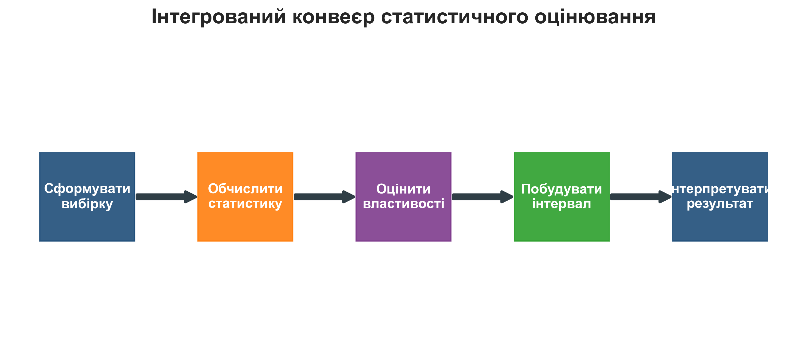

```python
# Перевірка нормальності в кожній партії через тест Шапіро
for name, group in df.groupby("batch"):
    statistic, pvalue = stats.shapiro(group["diameter_mm"].sample(40, random_state=1))
    print(name, round(statistic, 4), round(pvalue, 4))
```

Інтегрований приклад демонструє, що статистичне оцінювання є не набором розрізнених команд, а послідовністю логічно пов'язаних рішень. Спершу дослідник обирає параметр, далі - відповідну статистику, потім перевіряє припущення моделі та лише після цього інтерпретує довірчі межі.

```python
# Порівняння емпіричних інтервалів та нормативного номіналу
nominal = 50.0
for name, row in group_summary.iterrows():
    inside = row["ci_left"] <= nominal <= row["ci_right"]
    print(name, inside)
```

---

## 9. Підсумки, шпаргалка та корисні посилання

Розглянуті в лекції розподіли утворюють єдину систему. Нормальний розподіл задає базову модель для неперервних вимірювань і нормалізованих статистик; t-розподіл бере на себе роль коректора невідомої дисперсії в малих вибірках; χ²-розподіл забезпечує роботу з дисперсією; F-розподіл формалізує відношення двох дисперсій.

Точкові оцінки зручні, але не самодостатні. Лише разом із властивостями оцінок і довірчими інтервалами вони дають повноцінну картину невизначеності та якості висновку. Саме тому професійний статистичний звіт не обмежується одним середнім або однією дисперсією.

Студент, який опановує статистичне оцінювання, повинен навчитися ставити не лише питання "яке число отримано?", а й питання "наскільки воно мінливе?", "чи має оцінка зміщення?", "якою є ширина інтервалу?" та "які припущення стоять за цією формулою?". Такий стиль мислення принципово відрізняє статистичний аналіз від механічного підрахунку.

Для практичної роботи корисно мати коротку шпаргалку з ключових формул:

$$
\bar{x} = \frac{1}{n}\sum_{i=1}^{n}x_i, \qquad
s^2 = \frac{1}{n-1}\sum_{i=1}^{n}(x_i - \bar{x})^2,
$$

$$
\bar{x} \pm t_{1-\alpha/2,\, n-1}\frac{s}{\sqrt{n}}, \qquad
\left(
\frac{(n-1)s^2}{\chi^2_{1-\alpha/2}},
\frac{(n-1)s^2}{\chi^2_{\alpha/2}}
\right).
$$

```python
# Bootstrap-розподіл середнього
bootstrap_means = []
values = df["diameter_mm"].to_numpy()
for _ in range(3000):
    resample = rng.choice(values, size=len(values), replace=True)
    bootstrap_means.append(resample.mean())
print(round(np.mean(bootstrap_means), 4), round(np.std(bootstrap_means, ddof=1), 4))
```

Bootstrap не замінює класичні аналітичні формули, але дає корисну емпіричну інтуїцію щодо вибіркового розподілу оцінки. У сучасній практиці його часто використовують як допоміжний інструмент, особливо коли форма розподілу або аналітична похибка не є очевидними.

```python
# Bootstrap-процентильний інтервал для середнього
bootstrap_interval = np.quantile(bootstrap_means, [0.025, 0.975])
print(tuple(round(v, 4) for v in bootstrap_interval))
```

```python
# Узагальнююча функція оцінювання середнього і його інтервалу
def estimate_mean_with_interval(sample, alpha=0.05):
    sample = np.asarray(sample, dtype=float)
    mean = sample.mean()
    left, right = t_interval_mean(sample, alpha=alpha)
    return {"mean": mean, "ci_left": left, "ci_right": right}


print({k: round(v, 4) for k, v in estimate_mean_with_interval(sample_a).items()})
```

```python
# Формування компактного фінального звіту
final_report = {
    "overall_mean": round(df["diameter_mm"].mean(), 4),
    "overall_variance": round(df["diameter_mm"].var(ddof=1), 6),
    "batch_A_interval": tuple(round(v, 4) for v in t_interval_mean(sample_a)),
    "line_variance_ratio": round(f_ratio_lines, 4),
}
print(final_report)
```

```python
# Автоматична перевірка ключових умов прикладу
assert df["diameter_mm"].notna().all()
assert len(df) == 180
assert {"Партія A", "Партія B", "Партія C"} == set(df["batch"].unique())
print("Базові перевірки пройдено.")
```

```python
# Невелика шпаргалка з ключових функцій
cheat_sheet = {
    "mean": "np.mean(x) або Series.mean()",
    "variance": "np.var(x, ddof=1) або Series.var()",
    "t critical": "stats.t.ppf(1 - alpha/2, df=n-1)",
    "chi-square critical": "stats.chi2.ppf(q, df=n-1)",
    "f critical": "stats.f.ppf(q, dfn, dfd)",
}
print(cheat_sheet)
```

| Функція або метод | Призначення | Приклад |
|---|---|---|
| `stats.norm.pdf` | густина нормального розподілу | `stats.norm.pdf(x, loc=mu, scale=sigma)` |
| `stats.t.ppf` | квантиль t-розподілу | `stats.t.ppf(0.975, df=n-1)` |
| `stats.chi2.ppf` | квантиль χ²-розподілу | `stats.chi2.ppf(0.975, df=n-1)` |
| `stats.f.pdf` | густина F-розподілу | `stats.f.pdf(x, dfn=6, dfd=12)` |
| `Series.mean` | вибіркове середнє | `df["diameter_mm"].mean()` |
| `Series.var` | вибіркова дисперсія | `df["diameter_mm"].var(ddof=1)` |
| `groupby().agg()` | групове зведення | `df.groupby("batch").agg(...)` |

У підсумку сформуємо загальне правило. Якщо потрібно оцінити центр і доступна неперервна вибірка, слід починати з вибіркового середнього та його інтервалу; якщо об'єктом аналізу є варіативність, треба переходити до χ²- та F-апарату; якщо обсяг даних невеликий, t-розподіл стає основним інструментом для роботи з середнім.

### Корисні посилання

1. [SciPy Statistics API](https://docs.scipy.org/doc/scipy/reference/stats.html)
2. [NumPy: statistics routines](https://numpy.org/doc/stable/reference/routines.statistics.html)
3. [Pandas: descriptive statistics](https://pandas.pydata.org/docs/user_guide/basics.html#descriptive-statistics)
4. [Matplotlib gallery](https://matplotlib.org/stable/gallery/index.html)
5. [Seaborn statistical data visualization](https://seaborn.pydata.org/)
6. [OpenIntro Statistics](https://www.openintro.org/book/os/)
7. [NIST/SEMATECH e-Handbook of Statistical Methods](https://www.itl.nist.gov/div898/handbook/)
8. [Penn State STAT 414 Notes](https://online.stat.psu.edu/stat414/)
