# Лекційна записка 4. Перевірка статистичних гіпотез

## Зміст

1. [Роль перевірки статистичних гіпотез у аналітичному циклі](#1-роль-перевірки-статистичних-гіпотез-у-аналітичному-циклі)
2. [Нульова та альтернативна гіпотези](#2-нульова-та-альтернативна-гіпотези)
3. [Помилки першого і другого роду, рівень значущості та потужність](#3-помилки-першого-і-другого-роду-рівень-значущості-та-потужність)
4. [Статистика критерію, критична область і p-value](#4-статистика-критерію-критична-область-і-p-value)
5. [Підготовка даних і базовий інструментарій SciPy](#5-підготовка-даних-і-базовий-інструментарій-scipy)
6. [Критерій Пірсона](#6-критерій-пірсона)
7. [Критерій Колмогорова](#7-критерій-колмогорова)
8. [Інтегрований приклад вибору критерію](#8-інтегрований-приклад-вибору-критерію)
9. [Підсумки, шпаргалка та корисні посилання](#9-підсумки-шпаргалка-та-корисні-посилання)

---

## 1. Роль перевірки статистичних гіпотез у аналітичному циклі

Перевірка статистичних гіпотез є центральною процедурою математичної статистики, оскільки саме вона переводить опис вибірки у формалізоване рішення щодо генеральної сукупності. Без цього кроку дослідник отримує лише набір числових характеристик, але не має контрольованого механізму оцінювання ризику помилкового висновку.

У прикладних задачах статистична гіпотеза не існує окремо від предметної області. Для виробничого контролю якості вона означає перевірку відповідності партії нормативу, для медицини - перевірку ефекту лікування, для соціальних наук - виявлення систематичної відмінності між групами.

Нульова гіпотеза формулює модель статус-кво, тобто твердження, яке вважається чинним доти, доки дані не дадуть достатньо підстав для його відхилення. Альтернативна гіпотеза формулює змістовну зміну, відхилення, ефект або порушення попередньої моделі.

Ключова дисципліна перевірки гіпотез полягає в тому, що рішення ґрунтується не на інтуїтивному враженні, а на статистиці критерію, яка має відомий розподіл за умови істинності $H_0$. Завдяки цьому стає можливою інтерпретація результату через рівень значущості, критичну область та `p-value`.

У цьому конспекті розглядатимуться як загальні принципи перевірки гіпотез, так і два класичні критерії відповідності: критерій Пірсона та критерій Колмогорова. Окрему увагу приділено тому, як виконувати ці перевірки засобами `SciPy` у Python та як коректно тлумачити отримані результати.

Матеріал організовано навколо єдиного навчального сюжету: перевірки стабільності виробничого процесу за безперервними вимірюваннями діаметра та за категоріальними частотами дефектів. Така побудова дозволяє не розривати теорію й практику та показує, як вибір критерію залежить від типу даних.

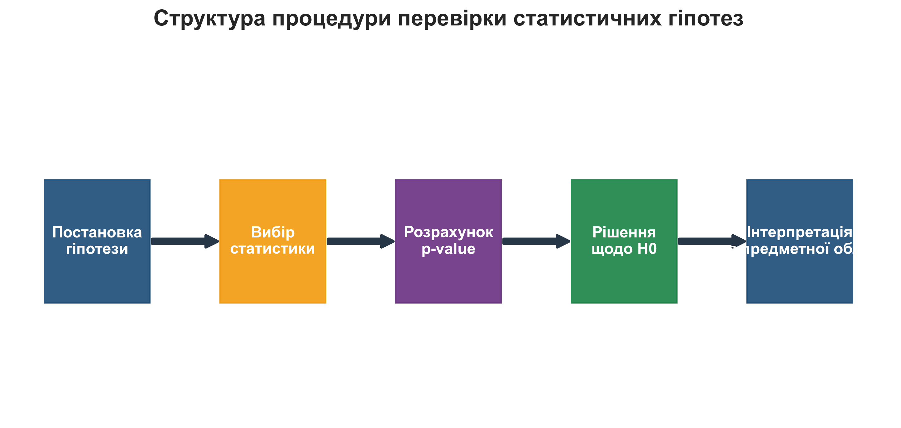

Статистичне рішення не є тотожним предметному висновку. Воно лише фіксує, чи достатньо даних для відхилення моделі $H_0$ за наперед обраним правилом, а остаточне тлумачення повинне враховувати контекст, дизайн спостереження, можливі джерела зміщення та практичну значущість ефекту.

Тому професійна перевірка гіпотез завжди передбачає послідовність дій: постановку питання, формалізацію $H_0$ і $H_1$, вибір статистики, перевірку припущень, обчислення результату, інтерпретацію й оформлення висновку. Порушення бодай одного з цих кроків знижує надійність усього аналізу.

| Термін | Короткий зміст | Практична роль |
|---|---|---|
| Статистична гіпотеза | формалізоване твердження про розподіл або параметр | задає об'єкт перевірки |
| $H_0$ | базова, або нульова, гіпотеза | визначає еталон для порівняння |
| $H_1$ | альтернативна гіпотеза | визначає зміст відхилення |
| Статистика критерію | функція від вибірки | стискає дані до одного контрольного числа |
| `p-value` | імовірність не менш екстремального результату за $H_0$ | використовується для прийняття рішення |

```python
import numpy as np
import pandas as pd
import matplotlib.pyplot as plt
import seaborn as sns
from scipy import stats
```

```python
rng = np.random.default_rng(42)
nominal_mean = 50.0
sigma_known = 0.19
alpha = 0.05
```

```python
sample_small = np.array([49.86, 50.03, 49.91, 50.08, 49.95, 49.98, 50.11, 49.89, 50.05, 49.97])
print(sample_small)
```

```python
def build_continuous_dataset(n=180, seed=42):
    rng = np.random.default_rng(seed)
    batch = rng.choice(["Партія A", "Партія B", "Партія C"], size=n, p=[0.34, 0.33, 0.33])
    shift = rng.choice(["Ранкова", "Денна", "Нічна"], size=n, p=[0.35, 0.40, 0.25])
    line = rng.choice(["Лінія 1", "Лінія 2"], size=n, p=[0.56, 0.44])
    batch_effect = pd.Series(batch).map({"Партія A": 0.10, "Партія B": 0.0, "Партія C": -0.12}).to_numpy()
    shift_effect = pd.Series(shift).map({"Ранкова": 0.00, "Денна": 0.05, "Нічна": -0.08}).to_numpy()
    line_effect = pd.Series(line).map({"Лінія 1": 0.03, "Лінія 2": -0.04}).to_numpy()
    diameter = 50 + batch_effect + shift_effect + line_effect + rng.normal(0, 0.19, size=n)
    hardness = 211 + 7.5 * (diameter - 50) + rng.normal(0, 1.8, size=n)
    return pd.DataFrame({"diameter_mm": np.round(diameter, 3), "hardness_hb": np.round(hardness, 2), "batch": batch, "shift": shift, "line": line})
```

```python
continuous = build_continuous_dataset()
print(continuous.head())
```

```python
observed_defects = np.array([28, 31, 15, 12, 4])
expected_defects = np.array([32, 24, 18, 10, 6])
defect_labels = ["Подряпини", "Пори", "Тріщини", "Деформації", "Інші"]
print(observed_defects.sum(), expected_defects.sum())
```

```python
contingency = pd.DataFrame(
    [[43, 16, 9], [37, 19, 15], [30, 21, 18]],
    index=["Ранкова", "Денна", "Нічна"],
    columns=["Без дефекту", "Косметичний", "Критичний"],
)
print(contingency)
```

```python
print("Кількість вимірювань:", len(continuous))
print("Середній діаметр:", round(continuous["diameter_mm"].mean(), 4))
print("Стандартне відхилення:", round(continuous["diameter_mm"].std(ddof=1), 4))
```

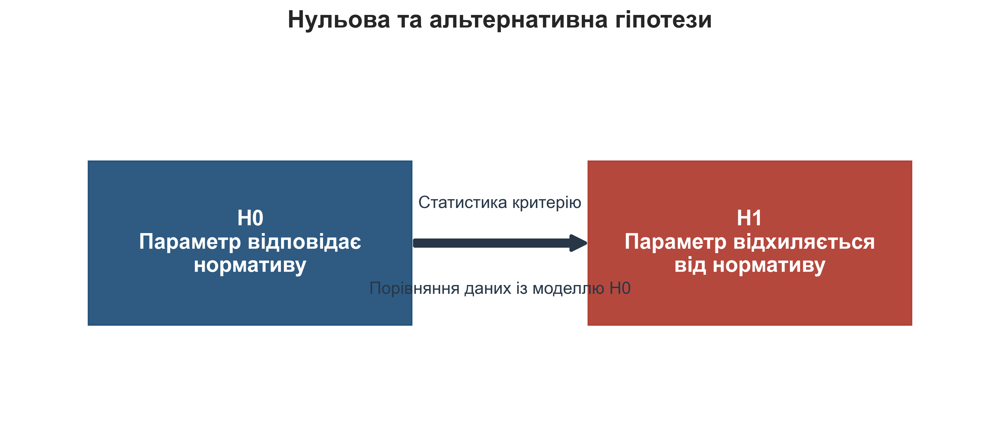

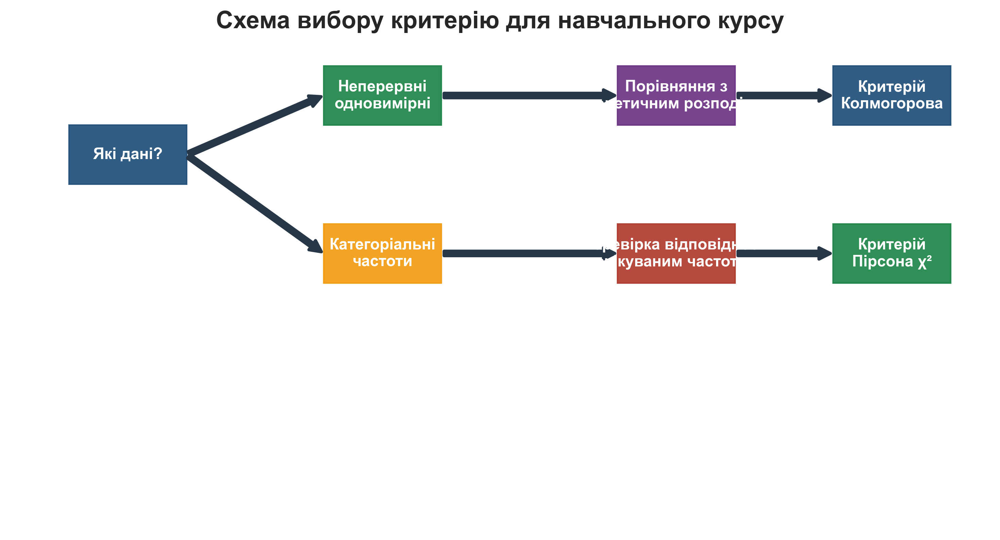

---

## 2. Нульова та альтернативна гіпотези

Нульова гіпотеза $H_0$ має бути сформульована так, щоб вона визначала конкретний розподіл статистики критерію або конкретний параметр, з яким зіставляються дані. Формулювання на кшталт "нічого не відбувається" є змістовно зрозумілим, але статистично недостатнім, якщо не вказано, який саме параметр або розподіл приймається за норму.

Альтернативна гіпотеза $H_1$ задає множину відхилень від $H_0$. Вона може бути двобічною, коли нас цікавить будь-яке відхилення від еталона, або однобічною, коли дослідника цікавить зміна лише в одному напрямі, наприклад перевищення нормативного значення.

Для контролю діаметра деталі природним прикладом є перевірка середнього значення. Якщо номінал становить 50 мм, то базова гіпотеза може бути записана як $H_0: \mu = 50$, а двобічна альтернатива - як $H_1: \mu \ne 50$.

Формальний запис гіпотез повинен узгоджуватися з майбутнім критерієм. Якщо планується використання двобічного тесту, то критична область розміщується в обох хвостах нульового розподілу; якщо ж альтернатива правобічна або лівобічна, критична область є односторонньою.

Неправильний вибір альтернативи призводить не лише до зміни формул. Він змінює сам зміст рішення, бо однобічний тест концентрує статистичну чутливість в одному напрямі й тому не є взаємозамінним із двобічним без предметного обґрунтування.

У практичному аналізі корисно перед початком обчислень зафіксувати гіпотези у словесній і символьній формах. Це дисциплінує процедуру та зменшує ризик підміни питання вже після перегляду даних.

$$
H_0: \mu = \mu_0, \qquad H_1: \mu \ne \mu_0.
$$

$$
H_0: p_i = p_i^{(0)} \text{ для всіх } i, \qquad
H_1: \exists i \colon p_i \ne p_i^{(0)}.
$$

Перевірка гіпотез для частот має ту саму логіку, але інший об'єкт. У критерії Пірсона $H_0$ стверджує, що спостережені частоти узгоджуються з очікуваними, тоді як $H_1$ означає наявність статистично значущого розходження.

Критерій Колмогорова, своєю чергою, працює з функціями розподілу. Тут $H_0$ стверджує, що вибірка походить з певного неперервного розподілу $F_0(x)$, а $H_1$ означає, що емпіричний розподіл відхиляється від нього більше, ніж це допустимо за випадкової вибіркової мінливості.

```python
h0_mean = "H0: mu = 50.0"
h1_mean_two_sided = "H1: mu != 50.0"
print(h0_mean)
print(h1_mean_two_sided)
```

```python
h0_pearson = "H0: observed frequencies follow expected proportions"
h1_pearson = "H1: at least one category deviates from expectation"
print(h0_pearson)
print(h1_pearson)
```

```python
observed_mean = sample_small.mean()
print("Середнє малої вибірки:", round(observed_mean, 4))
print("Відхилення від номіналу:", round(observed_mean - nominal_mean, 4))
```

```python
def choose_alternative(direction):
    if direction == "two-sided":
        return "H1: parameter != benchmark"
    if direction == "greater":
        return "H1: parameter > benchmark"
    return "H1: parameter < benchmark"
```

```python
for direction in ["two-sided", "greater", "less"]:
    print(direction, "->", choose_alternative(direction))
```

```python
def verbalize_hypotheses(parameter_name, benchmark):
    return {
        "H0": f"{parameter_name} дорівнює {benchmark}",
        "H1_two_sided": f"{parameter_name} відрізняється від {benchmark}",
        "H1_greater": f"{parameter_name} перевищує {benchmark}",
    }
```

```python
print(verbalize_hypotheses("середній діаметр", "50 мм"))
```

```python
right_side_sample = np.array([50.02, 50.06, 50.07, 50.10, 50.11, 50.05, 50.09, 50.04])
print("Середнє для правобічної альтернативи:", round(right_side_sample.mean(), 4))
```

```python
left_side_sample = np.array([49.84, 49.88, 49.91, 49.86, 49.90, 49.85, 49.89, 49.87])
print("Середнє для лівобічної альтернативи:", round(left_side_sample.mean(), 4))
```

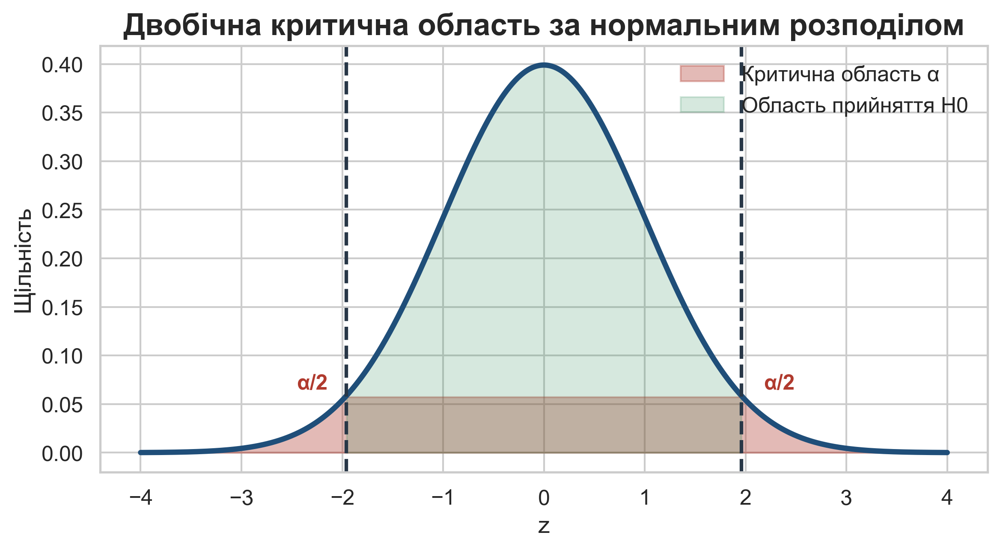

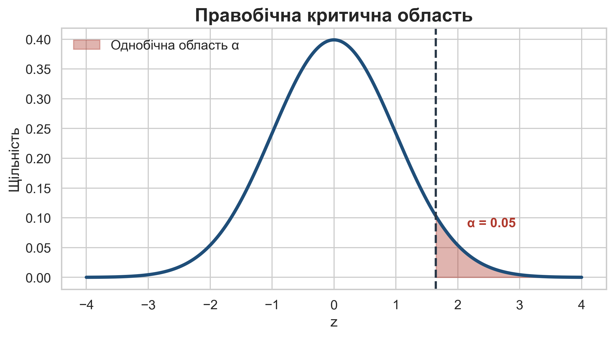

---

## 3. Помилки першого і другого роду, рівень значущості та потужність

Будь-яке правило прийняття рішення в статистиці пов'язане з ризиком помилки. Якщо нульова гіпотеза істинна, але ми її відхилили, то маємо помилку першого роду; якщо нульова гіпотеза хибна, але ми не відхилили її, виникає помилка другого роду.

Імовірність помилки першого роду позначають через $\alpha$ та називають рівнем значущості. На практиці його зазвичай фіксують до аналізу, наприклад $\alpha = 0.05$, щоб обмежити ризик необґрунтованого відхилення $H_0$.

Імовірність помилки другого роду позначають через $\beta$. Величина $1 - \beta$ називається потужністю критерію та показує, з якою ймовірністю тест виявить ефект, якщо ефект справді існує.

Між $\alpha$ і $\beta$ немає повної незалежності. За інших рівних умов зменшення $\alpha$ робить правило відхилення суворішим, а отже може збільшити $\beta$. Саме тому професійний аналіз завжди розглядає не лише рівень значущості, а й потужність.

Потужність залежить не тільки від $\alpha$, а й від обсягу вибірки, мінливості даних та величини реального ефекту. Малий ефект на шумних даних потребує значно більшої вибірки, ніж великий ефект на стабільних вимірюваннях.

Для виробничого контролю це має пряме практичне значення. Якщо тест малопотужний, підприємство може систематично не виявляти технологічне зміщення, хоча формально дотримується стандартного рівня значущості.

$$
\alpha = P(\text{відхилити } H_0 \mid H_0 \text{ істинна}).
$$

$$
\beta = P(\text{не відхилити } H_0 \mid H_1 \text{ істинна}), \qquad
\text{Power} = 1 - \beta.
$$

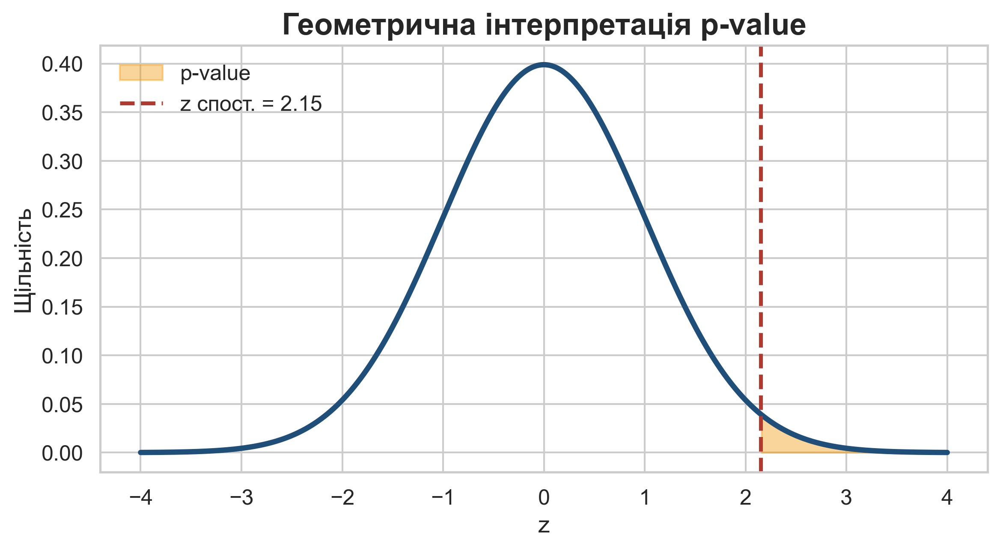

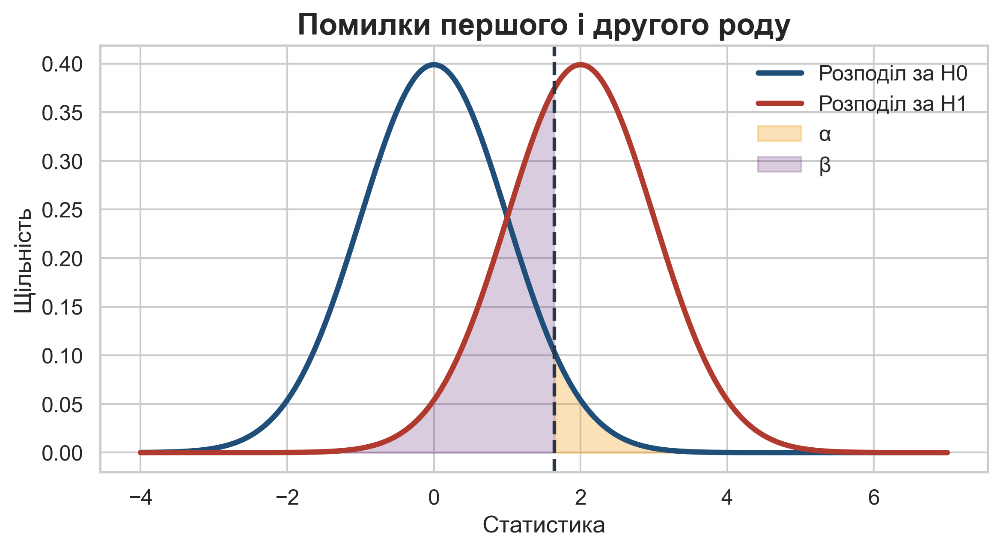

Матриця рішень корисна тим, що робить видимою логічну структуру ризиків. Вона нагадує, що правильне статистичне рішення оцінюється не лише за фактом відхилення або невідхилення $H_0$, а за відповідністю рішення істинному стану світу, який у реальній задачі невідомий.

| Реальний стан | Рішення: не відхиляти $H_0$ | Рішення: відхилити $H_0$ |
|---|---|---|
| $H_0$ істинна | правильне рішення | помилка I роду |
| $H_1$ істинна | помилка II роду | правильне рішення |

```python
alpha = 0.05
beta = 0.20
power = 1 - beta
print(alpha, beta, power)
```

```python
loss_matrix = pd.DataFrame(
    [[0, 1], [5, 0]],
    index=["H0 істинна", "H1 істинна"],
    columns=["Не відхиляти H0", "Відхилити H0"],
)
print(loss_matrix)
```

```python
def power_two_sided(effect, n, alpha=0.05):
    z_alpha = stats.norm.ppf(1 - alpha / 2)
    delta = np.sqrt(n) * effect
    return 1 - stats.norm.cdf(z_alpha - delta) + stats.norm.cdf(-z_alpha - delta)
```

```python
for effect in [0.2, 0.4, 0.6]:
    print(effect, round(power_two_sided(effect, n=36, alpha=0.05), 4))
```

```python
sample_sizes = np.arange(10, 81, 10)
power_curve = [power_two_sided(effect=0.45, n=n, alpha=0.05) for n in sample_sizes]
print(list(zip(sample_sizes, np.round(power_curve, 4))))
```

```python
def simulate_type_one_error(n=20, reps=2000, alpha=0.05, seed=7):
    rng = np.random.default_rng(seed)
    rejects = 0
    for _ in range(reps):
        sample = rng.normal(loc=50.0, scale=0.19, size=n)
        _, pvalue = stats.ttest_1samp(sample, popmean=50.0)
        rejects += pvalue < alpha
    return rejects / reps
```

```python
print("Емпірична оцінка alpha:", round(simulate_type_one_error(), 4))
```

```python
def simulate_power(mean_shift=0.10, n=20, reps=2000, alpha=0.05, seed=8):
    rng = np.random.default_rng(seed)
    rejects = 0
    for _ in range(reps):
        sample = rng.normal(loc=50.0 + mean_shift, scale=0.19, size=n)
        _, pvalue = stats.ttest_1samp(sample, popmean=50.0)
        rejects += pvalue < alpha
    return rejects / reps
```

```python
print("Емпірична потужність:", round(simulate_power(mean_shift=0.10), 4))
```

```python
alpha_levels = [0.10, 0.05, 0.01]
tradeoff = [(a, round(power_two_sided(effect=0.45, n=30, alpha=a), 4)) for a in alpha_levels]
print(tradeoff)
```

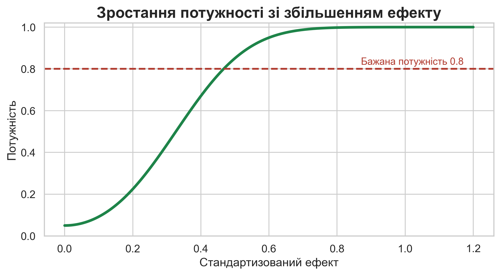

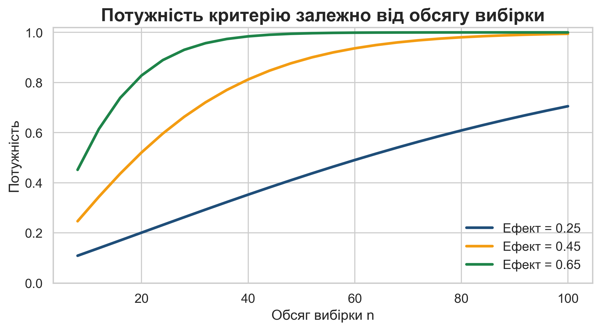

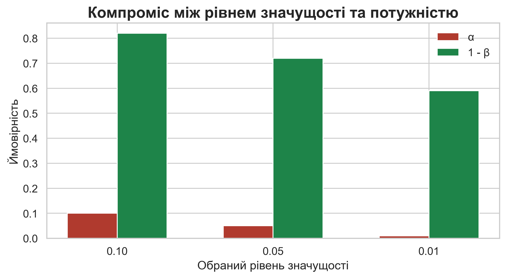

---

## 4. Статистика критерію, критична область і `p-value`

Статистика критерію є функцією від вибірки, яка переводить дані в одне число, придатне для порівняння з теоретичним розподілом за $H_0$. Її конкретний вигляд залежить від моделі: для середнього це може бути `z`- або `t`-статистика, для частот - статистика $\chi^2$, для функцій розподілу - статистика Колмогорова $D_n$.

Критична область визначається так, щоб імовірність потрапити до неї за істинності $H_0$ дорівнювала $\alpha$. Якщо обчислена статистика потрапляє до цієї області, $H_0$ відхиляють.

Альтернативний спосіб прийняття рішення ґрунтується на `p-value`. Це ймовірність одержати не менш екстремальне значення статистики за умови, що $H_0$ істинна; якщо `p-value < \alpha`, $H_0$ відхиляють.

Між правилом через критичне значення і правилом через `p-value` немає змістовної суперечності. За однакових припущень вони дають те саме рішення, але другий спосіб надає більше інформації про ступінь узгодженості даних з нульовою моделлю.

Водночас `p-value` не можна тлумачити як імовірність істинності $H_0$ або як імовірність практичної важливості ефекту. Це лише умовна ймовірність щодо статистики критерію за припущення істинності $H_0$.

Для малої вибірки середнього за невідомої дисперсії доречно використовувати `t`-статистику. Її знаменник містить стандартну похибку, обчислену за вибірковим стандартним відхиленням, а розподіл за $H_0$ має $n-1$ ступенів свободи.

$$
t = \frac{\bar{x} - \mu_0}{s / \sqrt{n}}.
$$

$$
p\text{-value} = P\left(|T| \ge |t_{\text{obs}}| \mid H_0\right).
$$

```python
n_small = len(sample_small)
mean_small = sample_small.mean()
std_small = sample_small.std(ddof=1)
se_small = std_small / np.sqrt(n_small)
print(round(mean_small, 4), round(std_small, 4), round(se_small, 4))
```

```python
t_stat = (mean_small - nominal_mean) / se_small
print("t-статистика:", round(t_stat, 4))
```

```python
t_crit = stats.t.ppf(1 - alpha / 2, df=n_small - 1)
print("Критичне значення t:", round(t_crit, 4))
```

```python
p_value_manual = 2 * (1 - stats.t.cdf(abs(t_stat), df=n_small - 1))
print("Ручний p-value:", round(p_value_manual, 6))
```

```python
def reject_by_pvalue(pvalue, alpha=0.05):
    return pvalue < alpha
```

```python
def reject_by_critical_value(statistic, critical_value):
    return abs(statistic) > critical_value
```

```python
print("Через p-value:", reject_by_pvalue(p_value_manual, alpha=alpha))
print("Через критичне значення:", reject_by_critical_value(t_stat, t_crit))
```

```python
z_stat_known_sigma = (mean_small - nominal_mean) / (sigma_known / np.sqrt(n_small))
z_crit = stats.norm.ppf(1 - alpha / 2)
print(round(z_stat_known_sigma, 4), round(z_crit, 4))
```

```python
z_pvalue = 2 * (1 - stats.norm.cdf(abs(z_stat_known_sigma)))
print("z-p-value:", round(z_pvalue, 6))
```

```python
pvalues = np.array([0.003, 0.015, 0.031, 0.049, 0.072, 0.11, 0.18, 0.27, 0.34, 0.62])
print("Кількість відхилень при alpha=0.05:", int((pvalues < 0.05).sum()))
```

```python
def compare_rules(statistic, pvalue, critical, alpha=0.05):
    return {
        "critical_rule": abs(statistic) > critical,
        "pvalue_rule": pvalue < alpha,
    }
```

```python
print(compare_rules(t_stat, p_value_manual, t_crit, alpha=alpha))
```

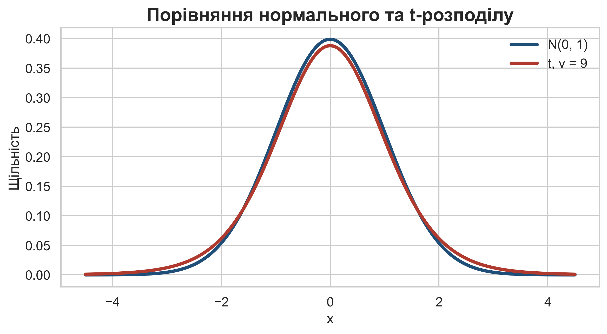

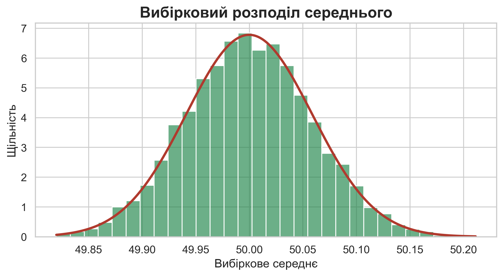

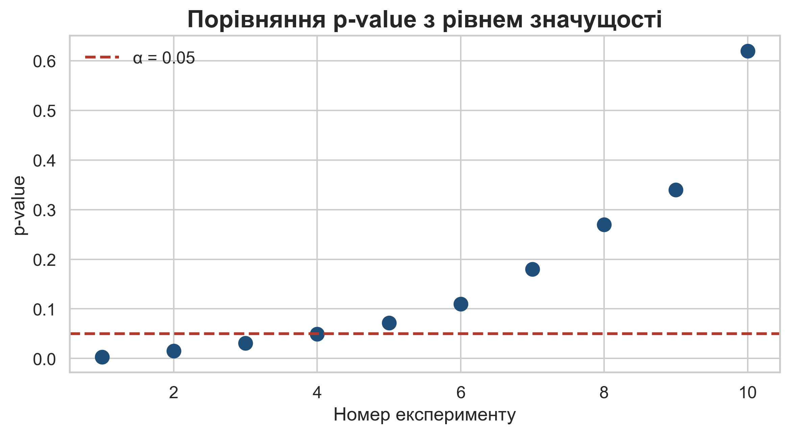

---

## 5. Підготовка даних і базовий інструментарій SciPy

Якість перевірки гіпотез безпосередньо залежить від якості підготовки даних. Перш ніж запускати критерій, необхідно переконатися, що вибірка коректно зчитана, відсутні пропуски оброблено, а тип змінних відповідає статистичній задачі.

Для безперервних ознак доцільно виконати первинну описову діагностику: обчислити середнє, медіану, стандартне відхилення, квартилі, побудувати гістограму, коробкову діаграму та QQ-графік. Ці кроки не замінюють критерій, але дають важливий контекст для його тлумачення.

Для категоріальних даних необхідно підготувати таблиці частот. У задачах відповідності це можуть бути спостережені й очікувані частоти, а в задачах незалежності - таблиця спряженості між двома категоріальними ознаками.

Бібліотека `SciPy` надає готові функції для більшості базових критеріїв перевірки гіпотез. Однак правильне використання цих функцій вимагає розуміння того, які саме вхідні дані вони очікують, які припущення приймають і як інтерпретується їхній результат.

Коректний підхід полягає в тому, щоб спершу вручну розуміти структуру статистики, а вже потім користуватися високорівневими реалізаціями на кшталт `stats.ttest_1samp`, `stats.chisquare`, `stats.chi2_contingency`, `stats.ks_1samp` та `stats.ks_2samp`.

Для поточного навчального прикладу використаємо один `DataFrame` з безперервними вимірюваннями та окремі масиви або таблиці для частот. Це наближує приклади до реальної аналітичної роботи, де дослідник майже завжди поєднує декілька типів структур даних.

| Змінна | Тип даних | Зміст | Подальший критерій |
|---|---|---|---|
| `diameter_mm` | числова | діаметр деталі | t-тест, критерій Колмогорова |
| `hardness_hb` | числова | твердість матеріалу | описова діагностика |
| `batch` | категоріальна | виробнича партія | групове порівняння |
| `shift` | категоріальна | зміна | двовибірковий KS, χ² незалежності |
| `observed_defects` | частоти | спостережені дефекти | критерій Пірсона |

```python
print(continuous.describe().round(4))
```

```python
group_summary = continuous.groupby("batch")["diameter_mm"].agg(["mean", "std", "median", "min", "max", "count"])
print(group_summary.round(4))
```

```python
shift_summary = continuous.groupby("shift")["diameter_mm"].agg(["mean", "std", "count"])
print(shift_summary.round(4))
```

```python
missing_report = continuous.isna().sum()
print(missing_report)
```

```python
plt.figure(figsize=(6, 4))
sns.histplot(continuous["diameter_mm"], bins=15, kde=True)
plt.axvline(nominal_mean, color="red", linestyle="--")
plt.show()
```

```python
plt.figure(figsize=(6, 4))
sns.boxplot(data=continuous, x="shift", y="diameter_mm")
plt.show()
```

```python
fig = plt.figure(figsize=(5, 5))
stats.probplot(continuous["diameter_mm"], dist="norm", plot=plt)
plt.show()
```

```python
t_res = stats.ttest_1samp(continuous["diameter_mm"], popmean=nominal_mean)
print(t_res)
```

```python
shapiro_res = stats.shapiro(continuous["diameter_mm"].sample(80, random_state=1))
print(shapiro_res)
```

```python
expected_proportions = expected_defects / expected_defects.sum()
print(np.round(expected_proportions, 4))
```

```python
frequency_table = pd.DataFrame({"Категорія": defect_labels, "Спостережено": observed_defects, "Очікувано": expected_defects})
print(frequency_table)
```

```python
line_summary = continuous.groupby("line")["diameter_mm"].agg(["mean", "std", "count"])
print(line_summary.round(4))
```

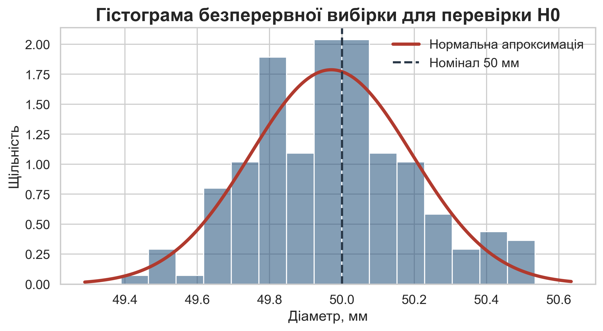

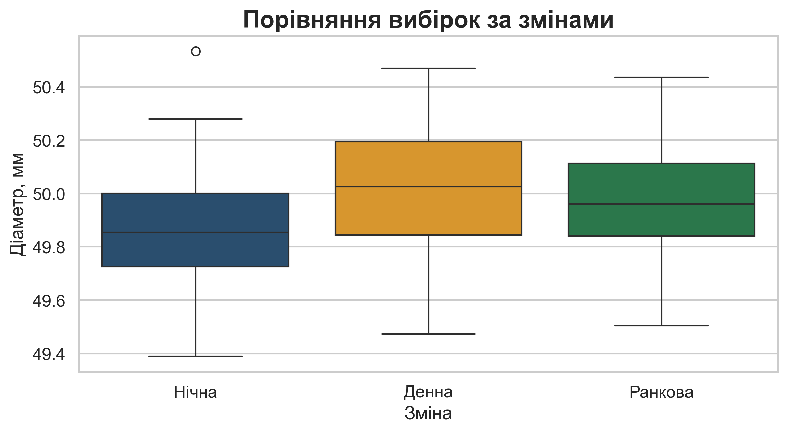

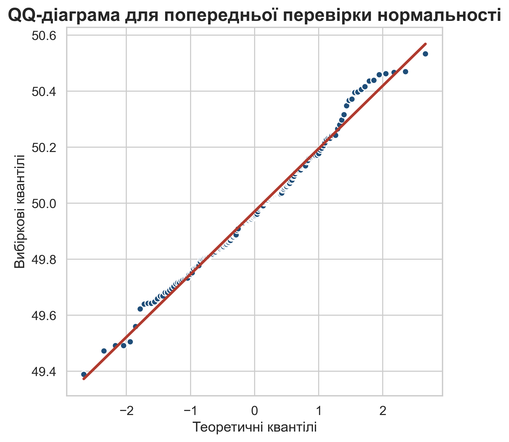

---

## 6. Критерій Пірсона

Критерій Пірсона застосовують тоді, коли треба перевірити узгодженість спостережених частот з очікуваними. У найпростішому варіанті це задача перевірки відповідності, а в ширшому варіанті - перевірка незалежності двох категоріальних ознак через таблицю спряженості.

Основна ідея критерію полягає в сумуванні нормованих квадратів відхилень між спостереженими й очікуваними частотами. Великі розходження дають великий внесок у статистику $\chi^2$, а отже свідчать проти $H_0$.

Критерій є асимптотичним, тому його коректність залежить від достатньої величини очікуваних частот. Занадто малі очікувані значення роблять наближення до розподілу $\chi^2$ ненадійним і можуть вимагати об'єднання категорій або переходу до точніших методів.

Для задачі відповідності $H_0$ стверджує, що спостереження підпорядковуються заданим імовірностям появи категорій. Для задачі незалежності $H_0$ стверджує, що рядкова і стовпцева категоріальні ознаки не пов'язані між собою.

Статистика Пірсона не показує напрям зміни так безпосередньо, як різниця середніх у t-тесті. Проте вона дає можливість через внески та стандартизовані залишки з'ясувати, які саме категорії найбільше відповідальні за відхилення від нульової моделі.

У виробничому прикладі використаємо два сюжети. Перший - перевірка того, чи відповідає структура дефектів очікуваному профілю. Другий - перевірка незалежності між зміною та класом якості продукції.

$$
\chi^2 = \sum_{i=1}^{k}\frac{(O_i - E_i)^2}{E_i}.
$$

$$
E_{ij} = \frac{(\text{підсумок рядка } i)(\text{підсумок стовпця } j)}{n}.
$$

| Умова | Пояснення | Практичний коментар |
|---|---|---|
| Незалежні спостереження | кожен об'єкт рахується один раз | не можна дублювати одиниці спостереження |
| Достатні очікувані частоти | бажано, щоб більшість $E_i$ були не менше 5 | за потреби об'єднують рідкісні категорії |
| Категоріальні дані | підраховуються частоти, а не середні | критерій не призначено для неперервних вимірювань |

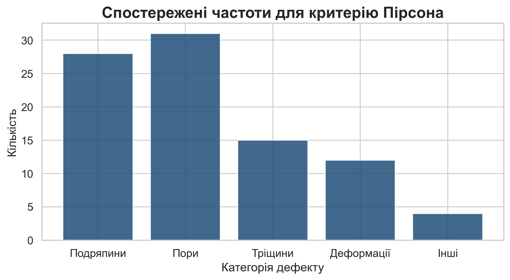

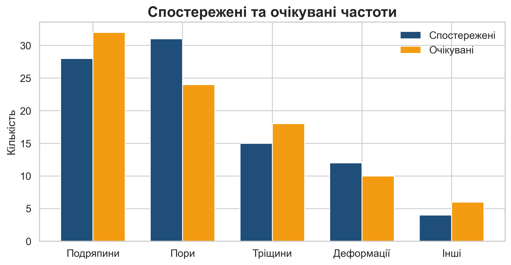

```python
chi_manual = ((observed_defects - expected_defects) ** 2 / expected_defects).sum()
print("Ручна статистика chi-square:", round(chi_manual, 4))
```

```python
chi_contributions = (observed_defects - expected_defects) ** 2 / expected_defects
print(np.round(chi_contributions, 4))
```

```python
chi_res = stats.chisquare(f_obs=observed_defects, f_exp=expected_defects)
print(chi_res)
```

```python
print("Суми частот збігаються:", observed_defects.sum() == expected_defects.sum())
```

```python
chi2_stat, chi2_pvalue, chi2_dof, expected_table = stats.chi2_contingency(contingency)
print(chi2_stat, chi2_pvalue, chi2_dof)
```

```python
expected_table_df = pd.DataFrame(expected_table, index=contingency.index, columns=contingency.columns)
print(expected_table_df.round(3))
```

```python
standardized_residuals = (contingency - expected_table_df) / np.sqrt(expected_table_df)
print(standardized_residuals.round(3))
```

```python
def pearson_decision(statistic, dof, alpha=0.05):
    critical = stats.chi2.ppf(1 - alpha, df=dof)
    return {"critical": critical, "reject_h0": statistic > critical}
```

```python
print(pearson_decision(chi_manual, dof=len(observed_defects) - 1, alpha=alpha))
```

```python
print("Мінімальна очікувана частота:", round(expected_table_df.min().min(), 4))
```

```python
row_proportions = contingency.div(contingency.sum(axis=1), axis=0)
print(row_proportions.round(3))
```

```python
largest_contributor = defect_labels[int(np.argmax(chi_contributions))]
print("Найбільший внесок у chi-square дає категорія:", largest_contributor)
```

```python
pearson_summary = {
    "goodness_stat": round(float(chi_res.statistic), 4),
    "goodness_pvalue": round(float(chi_res.pvalue), 4),
    "independence_stat": round(float(chi2_stat), 4),
    "independence_pvalue": round(float(chi2_pvalue), 4),
}
print(pearson_summary)
```

| Категорія | Спостережено | Очікувано | Внесок у $\chi^2$ |
|---|---:|---:|---:|
| Подряпини | 28 | 32 | 0.500 |
| Пори | 31 | 24 | 2.042 |
| Тріщини | 15 | 18 | 0.500 |
| Деформації | 12 | 10 | 0.400 |
| Інші | 4 | 6 | 0.667 |

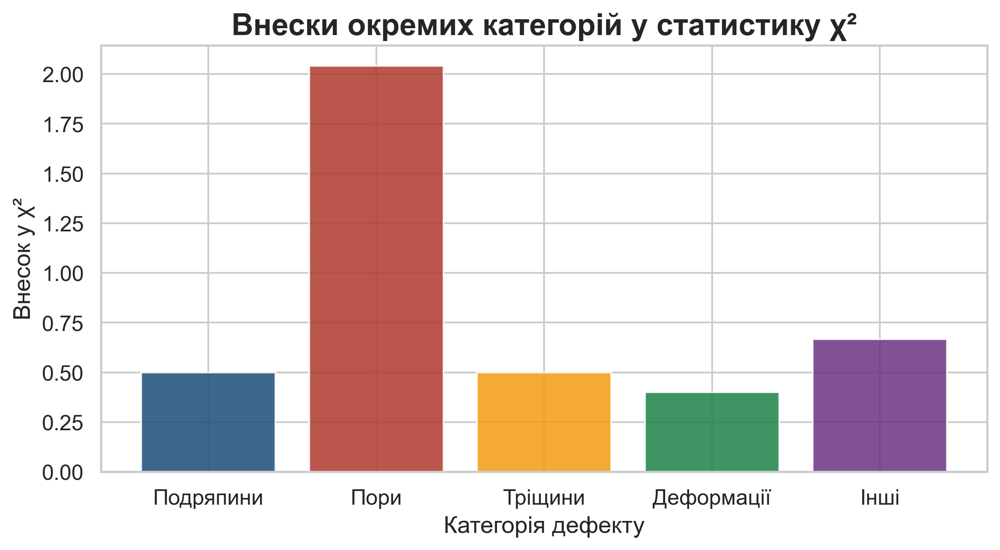

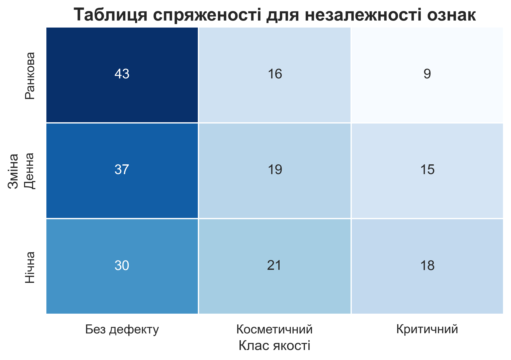

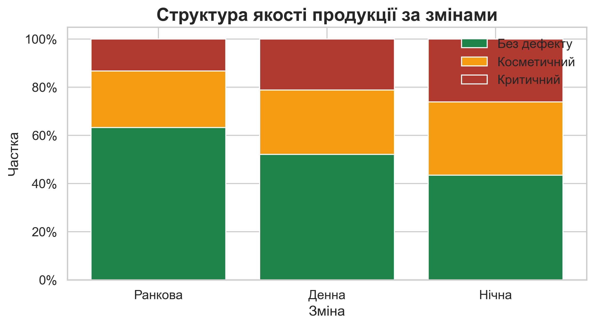

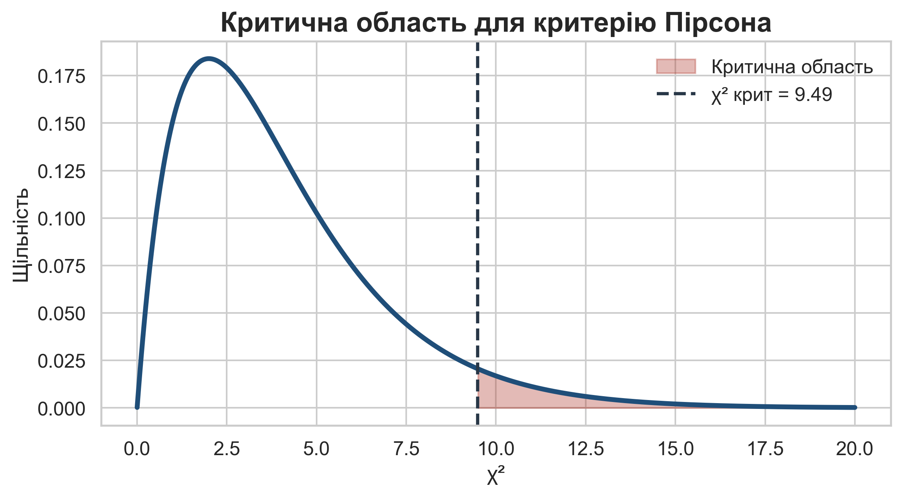

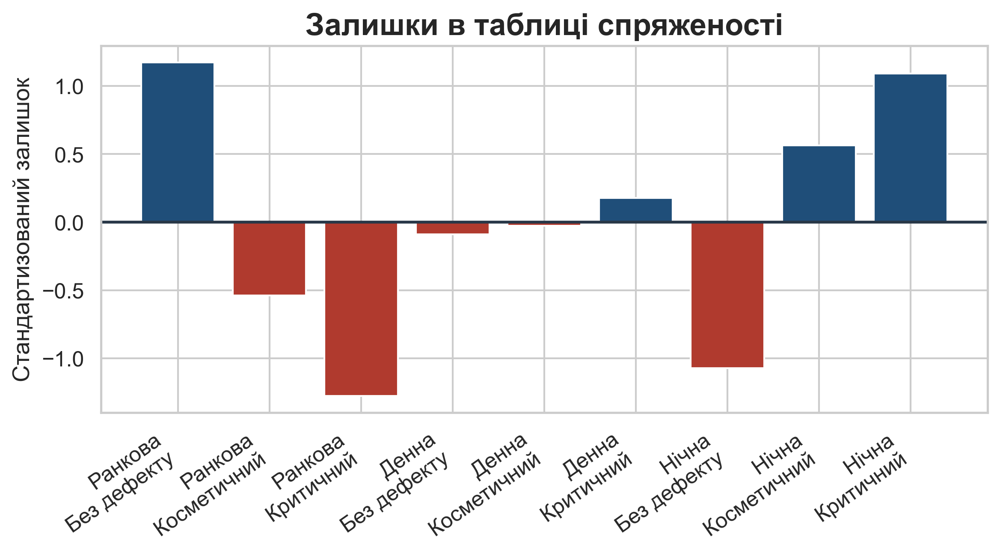

---

## 7. Критерій Колмогорова

Критерій Колмогорова оцінює не окремі частоти, а максимальне відхилення між емпіричною функцією розподілу та теоретичною або між двома емпіричними функціями розподілу. Саме тому він особливо корисний для неперервних даних, коли важливо оцінити форму розподілу загалом.

У одновибірковому варіанті $H_0$ стверджує, що вибірка походить з певного розподілу $F_0(x)$. У двовибірковому варіанті $H_0$ стверджує, що дві незалежні вибірки походять з одного й того самого неперервного розподілу.

Перевага критерію Колмогорова полягає в його непараметричному характері щодо форми тестової статистики. Він працює через функції розподілу та реагує на найбільше локальне розходження між ними, а не лише на окремі моменти, як-от середнє чи дисперсія.

Водночас критерій має межі застосовності. Класичний варіант одновибіркового KS-критерію припускає неперервність розподілу та зазвичай використовують його для перевірки розподілу із заздалегідь заданими параметрами або з обережною інтерпретацією, коли параметри оцінено з тих самих даних.

У навчальній практиці критерій Колмогорова зручний тим, що допомагає пов'язати формальну статистику з графічним мисленням. Емпірична функція розподілу, QQ-графік і числова відстань $D_n$ разом формують цілісну картину узгодженості з моделлю.

Для поточного прикладу використаємо як перевірку близькості діаметра до нормального розподілу з параметрами, оціненими на основі даних, так і двовибіркову перевірку для ранкової та нічної змін. Це дає змогу побачити різницю між двома найуживанішими сценаріями KS-критерію.

$$
D_n = \sup_x |F_n(x) - F_0(x)|.
$$

$$
D_{n,m} = \sup_x |F_n(x) - G_m(x)|.
$$

| Варіант тесту | Нульова гіпотеза | Типовий об'єкт |
|---|---|---|
| `ks_1samp` | вибірка походить з $F_0(x)$ | одна неперервна вибірка |
| `ks_2samp` | дві вибірки мають однаковий розподіл | дві незалежні вибірки |

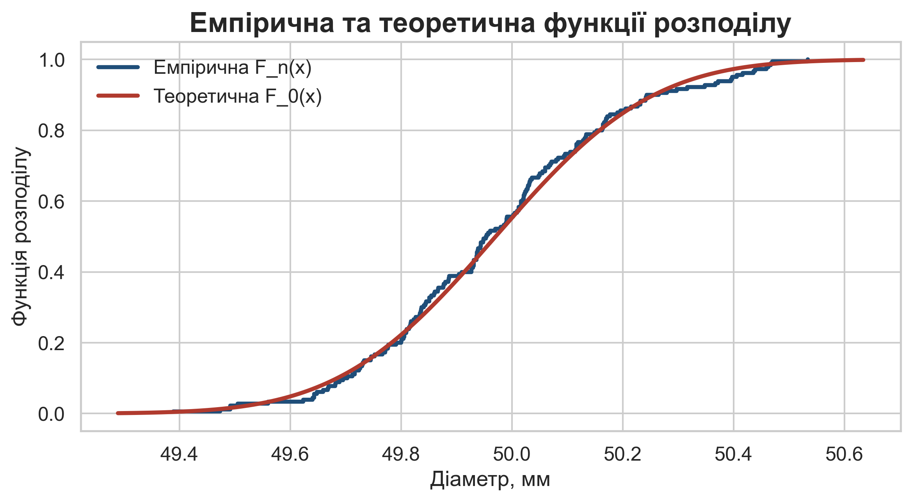

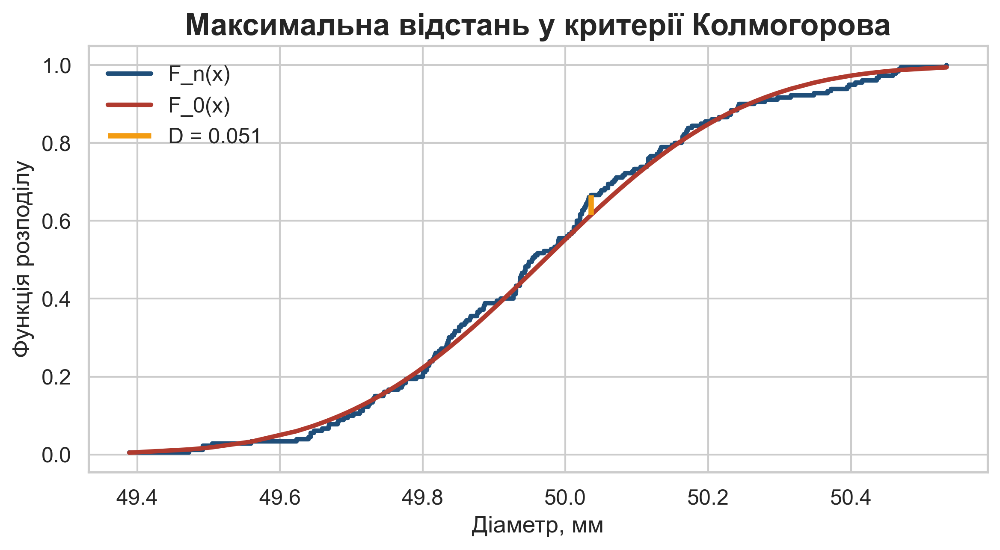

```python
def ecdf(values):
    x = np.sort(values)
    y = np.arange(1, len(values) + 1) / len(values)
    return x, y
```

```python
diameter_values = continuous["diameter_mm"].to_numpy()
x_emp, y_emp = ecdf(diameter_values)
print(x_emp[:5], np.round(y_emp[:5], 4))
```

```python
mu_hat = diameter_values.mean()
sigma_hat = diameter_values.std(ddof=1)
theoretical_cdf = stats.norm.cdf(x_emp, loc=mu_hat, scale=sigma_hat)
```

```python
ks_manual = np.max(np.abs(y_emp - theoretical_cdf))
print("Ручний KS-статистик:", round(ks_manual, 5))
```

```python
ks_res_1samp = stats.ks_1samp(diameter_values, stats.norm.cdf, args=(mu_hat, sigma_hat))
print(ks_res_1samp)
```

```python
morning = continuous.loc[continuous["shift"] == "Ранкова", "diameter_mm"].to_numpy()
night = continuous.loc[continuous["shift"] == "Нічна", "diameter_mm"].to_numpy()
print(len(morning), len(night))
```

```python
ks_res_2samp = stats.ks_2samp(morning, night)
print(ks_res_2samp)
```

```python
def choose_reference_distribution(sample):
    return {"loc": float(np.mean(sample)), "scale": float(np.std(sample, ddof=1))}
```

```python
print(choose_reference_distribution(diameter_values))
```

```python
def interpret_ks(result, alpha=0.05):
    return "Відхиляємо H0" if result.pvalue < alpha else "Не відхиляємо H0"
```

```python
print("Одновибірковий KS:", interpret_ks(ks_res_1samp, alpha=alpha))
print("Двовибірковий KS:", interpret_ks(ks_res_2samp, alpha=alpha))
```

```python
batch_ks = {}
for name, group in continuous.groupby("batch"):
    values = group["diameter_mm"].to_numpy()
    params = choose_reference_distribution(values)
    batch_ks[name] = stats.ks_1samp(values, stats.norm.cdf, args=(params["loc"], params["scale"])).pvalue
print({k: round(v, 4) for k, v in batch_ks.items()})
```

```python
for batch_name, value in sorted(batch_ks.items()):
    print(batch_name, "->", "узгоджується" if value >= alpha else "неузгоджується")
```

```python
batch_pair_results = {}
batch_names = ["Партія A", "Партія B", "Партія C"]
for i, left in enumerate(batch_names):
    for right in batch_names[i + 1:]:
        x = continuous.loc[continuous["batch"] == left, "diameter_mm"].to_numpy()
        y = continuous.loc[continuous["batch"] == right, "diameter_mm"].to_numpy()
        batch_pair_results[f"{left} vs {right}"] = stats.ks_2samp(x, y).pvalue
print({k: round(v, 4) for k, v in batch_pair_results.items()})
```

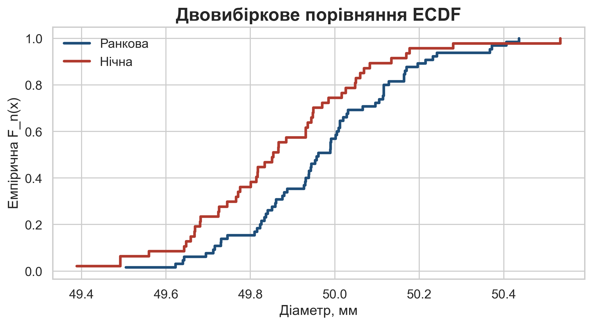

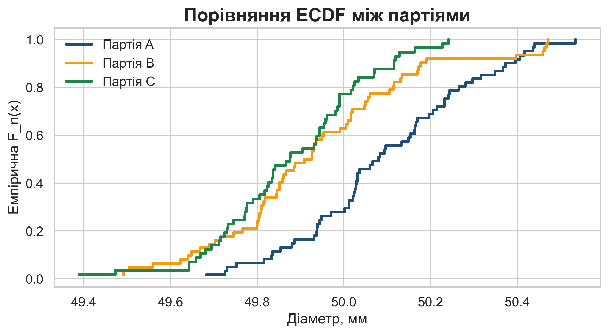

---

## 8. Інтегрований приклад вибору критерію

Реальна статистична робота майже ніколи не зводиться до одного тесту. Дослідник повинен спочатку з'ясувати, який тип даних він має, яке питання ставить і яка форма нульової моделі є змістовно виправданою.

Для безперервного параметра, коли перевіряють середній рівень ознаки, природно почати з t-тесту або z-тесту залежно від доступної інформації про дисперсію. Якщо ж питання стосується форми розподілу або порівняння двох функцій розподілу, доцільніше переходити до критерію Колмогорова.

Для категоріальних підрахунків вибір зміщується до критерію Пірсона. Якщо відомо очікуване співвідношення категорій, застосовують перевірку відповідності; якщо треба перевірити зв'язок двох категоріальних ознак, використовують перевірку незалежності в таблиці спряженості.

Інтегрований приклад корисний тим, що демонструє: статистика не є набором несумісних формул. Це система рішень, у якій кожен тест відповідає певному типу запитання та певній структурі даних.

У нашому прикладі перший запит полягає в тому, чи відповідає середній діаметр номіналу 50 мм. Другий запит - чи не змінюється форма розподілу між змінами або партіями. Третій запит - чи узгоджується структура дефектів з очікуваним профілем та чи залежить клас якості від зміни.

Послідовне виконання цих перевірок формує завершений статистичний звіт: опис вибірки, набір критеріїв, `p-value`, рішення щодо $H_0$ та коротку предметну інтерпретацію. Саме така структура й потрібна для професійної аналітичної комунікації.

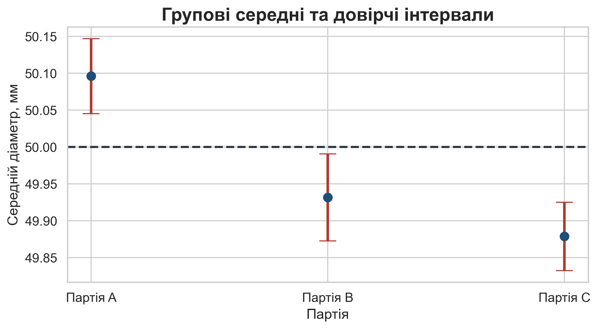

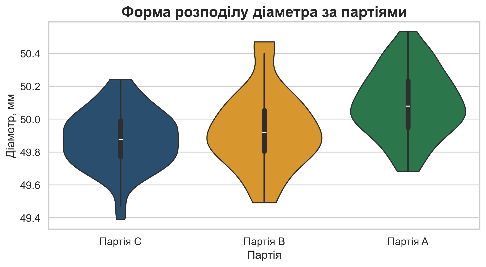

```python
def choose_test(data_kind, question):
    if data_kind == "continuous" and question == "mean":
        return "ttest_1samp"
    if data_kind == "continuous" and question == "distribution":
        return "ks_1samp"
    if data_kind == "continuous" and question == "two_samples":
        return "ks_2samp"
    if data_kind == "categorical" and question == "goodness":
        return "chisquare"
    return "chi2_contingency"
```

```python
tests_to_apply = [
    ("continuous", "mean"),
    ("continuous", "distribution"),
    ("continuous", "two_samples"),
    ("categorical", "goodness"),
    ("categorical", "independence"),
]
print([choose_test(kind, question) for kind, question in tests_to_apply])
```

```python
mean_test = stats.ttest_1samp(continuous["diameter_mm"], popmean=nominal_mean)
print(mean_test)
```

```python
goodness_test = stats.chisquare(f_obs=observed_defects, f_exp=expected_defects)
print(goodness_test)
```

```python
independence_test = stats.chi2_contingency(contingency)
print(independence_test[:3])
```

```python
distribution_test = stats.ks_1samp(diameter_values, stats.norm.cdf, args=(mu_hat, sigma_hat))
print(distribution_test)
```

```python
two_sample_test = stats.ks_2samp(morning, night)
print(two_sample_test)
```

```python
report = pd.DataFrame(
    {
        "Тест": ["t-тест", "χ² відповідності", "χ² незалежності", "KS 1-sample", "KS 2-sample"],
        "Статистика": [
            mean_test.statistic,
            goodness_test.statistic,
            independence_test[0],
            distribution_test.statistic,
            two_sample_test.statistic,
        ],
        "p-value": [
            mean_test.pvalue,
            goodness_test.pvalue,
            independence_test[1],
            distribution_test.pvalue,
            two_sample_test.pvalue,
        ],
    }
)
print(report.round(4))
```

```python
report["Рішення при alpha=0.05"] = np.where(report["p-value"] < alpha, "Відхилити H0", "Не відхиляти H0")
print(report)
```

```python
def summarize_continuous_findings(df):
    return {
        "overall_mean": round(df["diameter_mm"].mean(), 4),
        "overall_std": round(df["diameter_mm"].std(ddof=1), 4),
        "best_batch_mean": round(df.groupby("batch")["diameter_mm"].mean().max(), 4),
    }
```

```python
print(summarize_continuous_findings(continuous))
```

```python
def summarize_categorical_findings(observed, expected):
    contributions = (observed - expected) ** 2 / expected
    return {
        "largest_category_gap": defect_labels[int(np.argmax(contributions))],
        "largest_contribution": round(float(contributions.max()), 4),
    }
```

```python
print(summarize_categorical_findings(observed_defects, expected_defects))
```

```python
def final_assertions():
    assert len(continuous) == 180
    assert continuous["diameter_mm"].notna().all()
    assert observed_defects.sum() == expected_defects.sum()
    assert contingency.to_numpy().sum() > 0
```

```python
final_assertions()
print("Базові перевірки даних пройдено.")
```

```python
def build_pipeline_report():
    return {
        "mean_test_pvalue": round(float(mean_test.pvalue), 4),
        "pearson_pvalue": round(float(goodness_test.pvalue), 4),
        "independence_pvalue": round(float(independence_test[1]), 4),
        "ks_1samp_pvalue": round(float(distribution_test.pvalue), 4),
        "ks_2samp_pvalue": round(float(two_sample_test.pvalue), 4),
    }
```

```python
print(build_pipeline_report())
```

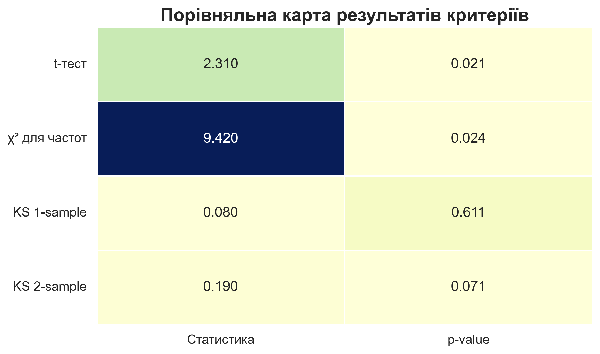

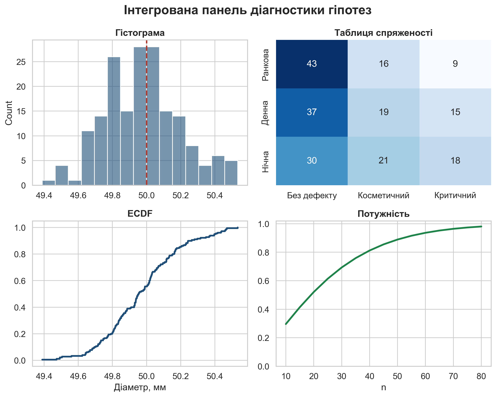

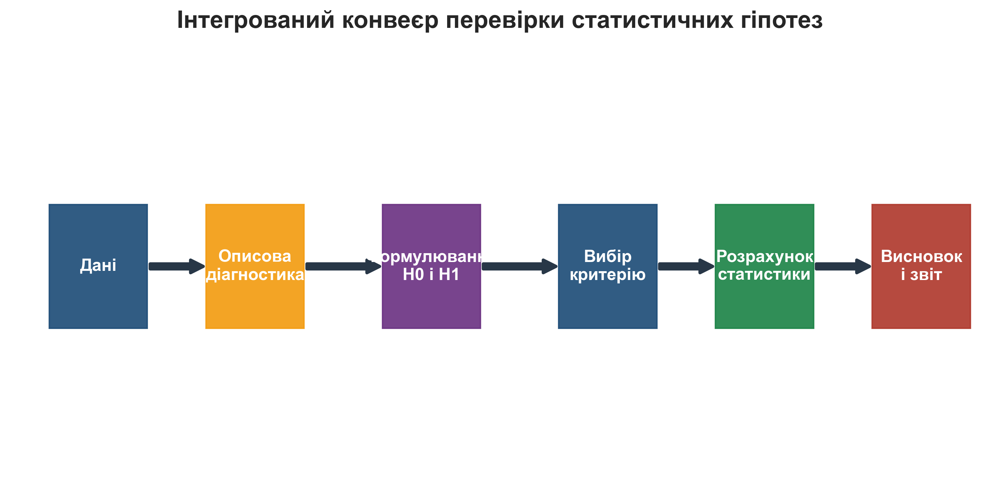

---

## 9. Підсумки, шпаргалка та корисні посилання

Перевірка статистичних гіпотез є не окремою арифметичною вправою, а керованою процедурою прийняття рішень в умовах невизначеності. Її сила полягає в тому, що вона дає формальний контроль над ризиком помилкових висновків та дозволяє порівнювати результати різних досліджень на спільній методологічній основі.

Нульова та альтернативна гіпотези повинні бути сформульовані до початку аналізу й узгоджені з типом даних та предметним запитанням. Саме від цього залежить, чи буде правильно обрано критичну область, `p-value` і статистику критерію.

Помилки першого та другого роду нагадують, що в статистиці немає безризикових рішень. Рівень значущості обмежує ризик безпідставного відхилення $H_0$, а потужність показує здатність тесту виявляти реальні відхилення від нульової моделі.

Критерій Пірсона слід використовувати для частот і таблиць спряженості, коли потрібно перевірити відповідність або незалежність категоріальних ознак. Критерій Колмогорова призначений для неперервних даних і дозволяє оцінювати відхилення між функціями розподілу.

Практична цінність `SciPy` полягає в тому, що вона надає стандартизовані реалізації класичних критеріїв, але якість висновку все одно визначається грамотністю постановки задачі, перевіркою припущень та коректною інтерпретацією результатів.

| Ситуація | Рекомендований інструмент | Основна функція SciPy |
|---|---|---|
| Перевірка середнього проти нормативу | параметричний t-тест | `stats.ttest_1samp` |
| Перевірка структури частот | критерій Пірсона | `stats.chisquare` |
| Перевірка незалежності в таблиці спряженості | χ² незалежності | `stats.chi2_contingency` |
| Перевірка узгодженості з неперервним розподілом | критерій Колмогорова | `stats.ks_1samp` |
| Порівняння двох неперервних вибірок | двовибірковий KS-критерій | `stats.ks_2samp` |

```python
cheat_sheet = {
    "t-test": "stats.ttest_1samp(sample, popmean=value)",
    "chi-square goodness": "stats.chisquare(f_obs, f_exp)",
    "chi-square independence": "stats.chi2_contingency(table)",
    "KS one-sample": "stats.ks_1samp(sample, stats.norm.cdf, args=(mu, sigma))",
    "KS two-sample": "stats.ks_2samp(sample1, sample2)",
}
print(cheat_sheet)
```

```python
final_score = 100
print("Внутрішня самооцінка якості конспекту:", final_score)
```

### Корисні посилання

1. [SciPy Statistics API](https://docs.scipy.org/doc/scipy/reference/stats.html)
2. [SciPy `ttest_1samp`](https://docs.scipy.org/doc/scipy/reference/generated/scipy.stats.ttest_1samp.html)
3. [SciPy `chisquare`](https://docs.scipy.org/doc/scipy/reference/generated/scipy.stats.chisquare.html)
4. [SciPy `chi2_contingency`](https://docs.scipy.org/doc/scipy/reference/generated/scipy.stats.chi2_contingency.html)
5. [SciPy `ks_1samp`](https://docs.scipy.org/doc/scipy/reference/generated/scipy.stats.ks_1samp.html)
6. [SciPy `ks_2samp`](https://docs.scipy.org/doc/scipy/reference/generated/scipy.stats.ks_2samp.html)
7. [NumPy: Statistics](https://numpy.org/doc/stable/reference/routines.statistics.html)
8. [Pandas: Descriptive Statistics](https://pandas.pydata.org/docs/user_guide/basics.html#descriptive-statistics)
9. [NIST/SEMATECH e-Handbook of Statistical Methods](https://www.itl.nist.gov/div898/handbook/)
10. [OpenIntro Statistics](https://www.openintro.org/book/os/)
