# Лекційна записка 5. Кореляційний аналіз та парна лінійна регресія

## Зміст

1. [Роль кореляційно-регресійного аналізу в обробці даних](#sec-1)
2. [Коваріація та напрям спільної зміни](#sec-2)
3. [Коефіцієнт кореляції Пірсона](#sec-3)
4. [Графічна діагностика зв’язку](#sec-4)
5. [Припущення, обмеження та вплив викидів](#sec-5)
6. [Метод найменших квадратів](#sec-6)
7. [Побудова простої лінійної регресійної моделі](#sec-7)
8. [Інтерпретація коефіцієнтів, `R^2`, залишків і прогнозу](#sec-8)
9. [Підсумки, шпаргалка та корисні посилання](#sec-9)

---

<a id="sec-1"></a>

## 1. Роль кореляційно-регресійного аналізу в обробці даних

Кореляційний аналіз і парна лінійна регресія належать до базових інструментів статистичного дослідження зв’язку між двома кількісними ознаками. У типовій прикладній задачі спочатку з’ясовують, чи змінюються ознаки узгоджено, а потім формалізують цю залежність у вигляді рівняння, придатного для пояснення та прогнозу.

У курсі «Статистична обробка даних» ці методи займають центральне місце, оскільки вони поєднують описову статистику, геометричну інтерпретацію даних і висновковий аналіз. Саме тут студент переходить від простого опису розподілів до моделювання причинно-інтерпретаційної структури вибірки.

Для навчальної цілі доцільно працювати з єдиним наскрізним прикладом. У цій лекції розглядатиметься виробнича вибірка, де `diameter_mm` описує фактичний діаметр деталі, а `hardness_hb` — твердість матеріалу за Брінеллем. Така постановка дає природну пару «пояснювальна змінна — залежна змінна».

Кореляція відповідає на питання про силу та напрям лінійного зв’язку. Регресія відповідає на ширше питання: як змінюється середнє значення залежної ознаки при зміні пояснювальної змінної на одну одиницю. Звідси випливає методологічна відмінність між описом зв’язку та побудовою моделі.

У практиці аналітики ці інструменти не можна змішувати механічно. Високе значення коефіцієнта кореляції ще не означає коректної прогнозної моделі, а приваблива лінія регресії не гарантує виконання припущень МНК. Тому коректний аналіз завжди включає і візуальну діагностику, і числові оцінки, і перевірку залишків.

Окремої уваги потребує термінологічна дисципліна. Кореляція Пірсона є безрозмірною характеристикою, коваріація залежить від масштабу вимірювання, а парна лінійна регресія описує функціональну форму середнього відгуку. Ці поняття пов’язані, але не тотожні.

У цій лекції послідовність викладу вибудувана від інтуїції до формальної моделі. Спочатку буде розглянуто коваріацію, далі — нормований коефіцієнт кореляції Пірсона, після цього — метод найменших квадратів, оцінка параметрів моделі, інтерпретація коефіцієнтів і прогнозування.

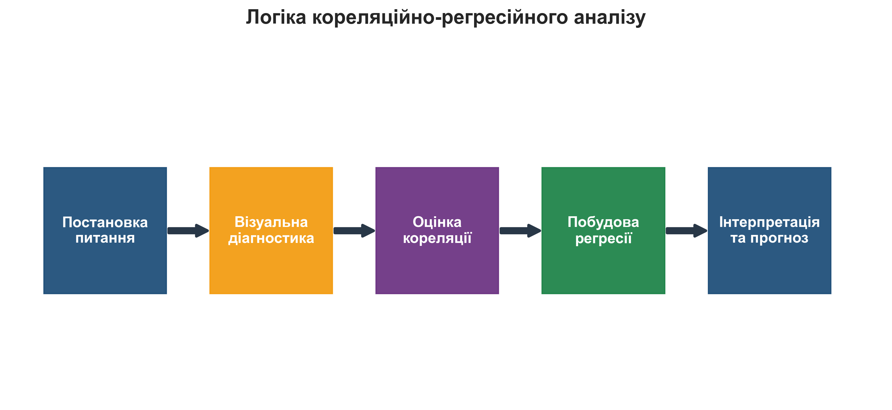

```python
from pathlib import Path
import sys
```

```python
import numpy as np
import pandas as pd
import seaborn as sns
import matplotlib.pyplot as plt
from scipy import stats
import statsmodels.api as sm
```

```python
plt.style.use("seaborn-v0_8-whitegrid")
sns.set_theme(context="notebook", style="whitegrid", font_scale=1.05)
```

```python
RNG = np.random.default_rng(42)
```

```python
def build_dataset(n=200, seed=42):
    rng = np.random.default_rng(seed)
    batch = rng.choice(["Партія A", "Партія B", "Партія C"], size=n, p=[0.34, 0.33, 0.33])
    shift = rng.choice(["Ранкова", "Денна", "Нічна"], size=n, p=[0.36, 0.39, 0.25])
    line = rng.choice(["Лінія 1", "Лінія 2"], size=n, p=[0.58, 0.42])
    batch_effect = pd.Series(batch).map({"Партія A": 0.10, "Партія B": 0.00, "Партія C": -0.12}).to_numpy()
    shift_effect = pd.Series(shift).map({"Ранкова": 0.00, "Денна": 0.05, "Нічна": -0.08}).to_numpy()
    line_effect = pd.Series(line).map({"Лінія 1": 0.03, "Лінія 2": -0.04}).to_numpy()
    diameter = 50 + batch_effect + shift_effect + line_effect + rng.normal(0, 0.19, size=n)
    hardness = 211 + 7.4 * (diameter - 50) + rng.normal(0, 1.85, size=n)
    roughness = 1.55 - 0.28 * (diameter - 50) + rng.normal(0, 0.07, size=n)
    temperature = 191 + 11.5 * (diameter - 50) + rng.normal(0, 1.25, size=n)
    pressure = 4.6 + 0.75 * (diameter - 50) + rng.normal(0, 0.12, size=n)
    return pd.DataFrame(
        {
            "diameter_mm": np.round(diameter, 3),
            "hardness_hb": np.round(hardness, 2),
            "roughness_ra": np.round(roughness, 3),
            "temperature_c": np.round(temperature, 2),
            "pressure_bar": np.round(pressure, 3),
            "batch": batch,
            "shift": shift,
            "line": line,
        }
    )
```

```python
data = build_dataset()
print(data.head())
```

```python
print(data.shape)
print(data[["diameter_mm", "hardness_hb"]].describe().round(3))
```

Побудований датасет не є випадковим набором колонок. Він сконструйований так, щоб одна пара змінних створювала стійкий, але не ідеальний лінійний зв’язок. Така структура є дидактично корисною: вона дозволяє побачити кореляцію, оцінити лінійну регресію і водночас виявити роль шуму.

Наведені нижче позначення будуть використовуватися в усіх наступних розділах. Вони задають стандартну нотацію для вибіркового аналізу двох кількісних ознак.

| Позначення | Зміст | Коментар |
| --- | --- | --- |
| $x_i$ | значення пояснювальної змінної | у лекції це `diameter_mm` |
| $y_i$ | значення залежної змінної | у лекції це `hardness_hb` |
| $\bar{x}$, $\bar{y}$ | вибіркові середні | центр хмари спостережень |
| $s_{xy}$ | вибіркова коваріація | залежить від масштабу |
| $r$ | коефіцієнт кореляції Пірсона | лежить в інтервалі $[-1, 1]$ |
| $\hat{y}_i$ | передбачене значення | точка на лінії регресії |
| $e_i$ | залишок | різниця між спостереженням і моделлю |

```python
x = data["diameter_mm"].to_numpy()
y = data["hardness_hb"].to_numpy()
```

```python
print("n =", len(data))
print("x̄ =", round(x.mean(), 3))
print("ȳ =", round(y.mean(), 3))
```

---

<a id="sec-2"></a>

## 2. Коваріація та напрям спільної зміни

Коваріація є першою формальною характеристикою спільної зміни двох ознак. Якщо відхилення $x_i - \bar{x}$ і $y_i - \bar{y}$ зазвичай мають однаковий знак, коваріація буде додатною. Якщо один показник зростає тоді, коли інший систематично зменшується, коваріація буде від’ємною.

Вибіркова коваріація визначається формулою

$$
s_{xy} = \frac{1}{n-1}\sum_{i=1}^{n}(x_i-\bar{x})(y_i-\bar{y}).
$$

Ця формула має безпосередню геометричну інтерпретацію. Кожне спостереження порівнюється з центром хмари даних, а добуток центрованих відхилень фіксує, чи потрапляє точка до «узгоджених» квадрантів, де обидві ознаки одночасно більші або менші за свої середні.

Важливо розуміти, що сама по собі коваріація не є нормованою величиною. Якщо змінити одиницю вимірювання хоча б однієї змінної, її числове значення одразу зміниться. Саме тому коваріація корисна як проміжне поняття, але не як універсальна міра сили зв’язку.

У виробничих даних коваріація особливо наочна. Якщо деталі з більшим діаметром зазвичай демонструють більшу твердість, додатні добутки центрованих відхилень переважають, і сумарна коваріація стає додатною. Якщо ж зв’язок невиразний, додатні та від’ємні внески взаємно компенсуються.

Коваріація є також ключовою для виведення формули нахилу регресійної прямої. Це не випадковий збіг: регресійний коефіцієнт напряму пов’язує спільну варіацію двох ознак із варіацією пояснювальної змінної.

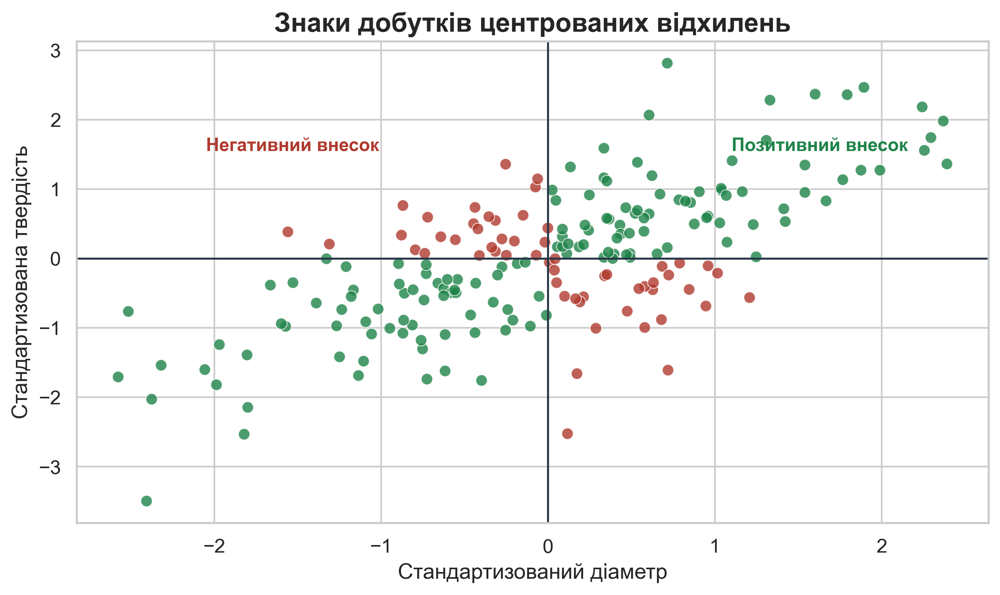

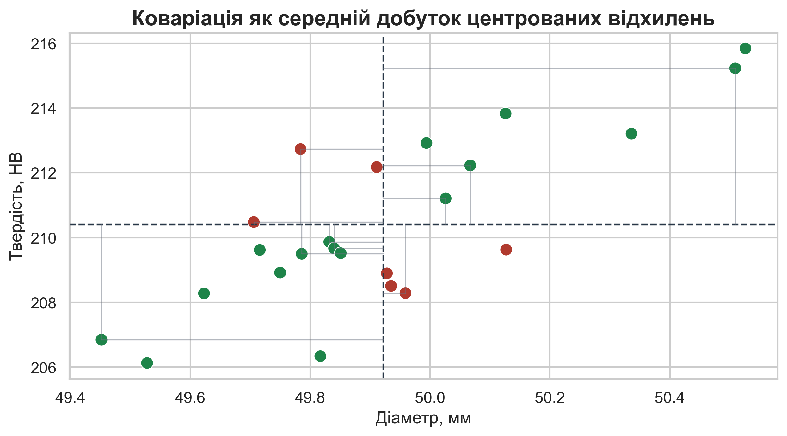

```python
x_mean = x.mean()
y_mean = y.mean()
```

```python
x_centered = x - x_mean
y_centered = y - y_mean
```

```python
products = x_centered * y_centered
print(products[:10].round(4))
```

```python
cov_xy = products.sum() / (len(x) - 1)
print(round(cov_xy, 4))
```

```python
cov_matrix = np.cov(x, y, ddof=1)
print(cov_matrix.round(4))
```

```python
print("Вибіркова коваріація:", round(cov_matrix[0, 1], 4))
```

```python
share_positive = np.mean(products > 0)
share_negative = np.mean(products < 0)
print(round(share_positive, 3), round(share_negative, 3))
```

```python
quadrants = pd.DataFrame({"x_centered": x_centered, "y_centered": y_centered})
quadrants["same_sign"] = np.sign(quadrants["x_centered"]) == np.sign(quadrants["y_centered"])
print(quadrants["same_sign"].value_counts())
```

Практичний сенс цих обчислень полягає в тому, що аналітик ще до розрахунку кореляції бачить сам механізм спільної зміни. Саме тому корисно на ранній стадії аналізу не лише викликати готову функцію, а й розкласти формулу на центровані відхилення та їхні добутки.

На рівні інтерпретації потрібно утримуватися від спрощення. Додатна коваріація не означає причинного впливу, а лише фіксує статистичну узгодженість напрямів. У прикладних задачах це є умовою для подальшого регресійного аналізу, але не його остаточним висновком.

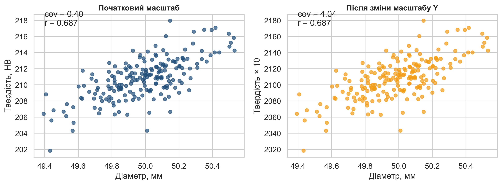

```python
scaled_y = y * 10
scaled_cov = np.cov(x, scaled_y, ddof=1)[0, 1]
print(round(scaled_cov, 4))
```

```python
print("Початкова коваріація:", round(cov_xy, 4))
print("Після множення Y на 10:", round(scaled_cov, 4))
```

Залежність коваріації від масштабу є методично важливою. Вона пояснює, чому для міжзадачних порівнянь та формального висновку потрібна нормована міра, яка не змінюється від переходу між міліметрами, сантиметрами чи іншими одиницями.

Наступним кроком є перехід до кореляції Пірсона. Вона зберігає інформацію про напрям і силу лінійного зв’язку, але позбавляє міру залежності від одиниць вимірювання.

---

<a id="sec-3"></a>

## 3. Коефіцієнт кореляції Пірсона

Коефіцієнт кореляції Пірсона визначається як нормована коваріація:

$$
r = \frac{s_{xy}}{s_x s_y},
$$

де $s_x$ і $s_y$ — вибіркові стандартні відхилення відповідних змінних. Ця нормалізація усуває залежність від масштабу і переводить міру зв’язку в стандартний інтервал від $-1$ до $1$.

Значення $r$ близьке до $1$ означає сильний додатний лінійний зв’язок. Значення, близьке до $-1$, означає сильний від’ємний лінійний зв’язок. Значення поблизу нуля означає відсутність виразного лінійного зв’язку, але не обов’язково відсутність будь-якої залежності взагалі.

Ця остання обставина особливо важлива. Pearson correlation оцінює саме лінійність. Якщо зв’язок нелінійний, але систематичний, коефіцієнт може виявитися малим і ввести дослідника в оману. Тому завжди слід поєднувати числову оцінку з графічним аналізом.

У нашому датасеті кореляція між діаметром і твердістю додатна та статистично значуща. Це узгоджується з побудованим механізмом генерації даних: більший діаметр пов’язаний із вищою твердістю, але шум не дозволяє хмарі точок перетворитися на ідеальну пряму.

Статистична процедура `scipy.stats.pearsonr` повертає не тільки оцінку $r$, а й `p-value` для тесту нульової гіпотези про відсутність кореляції. Це зручно, коли потрібно перейти від опису до формального висновку.

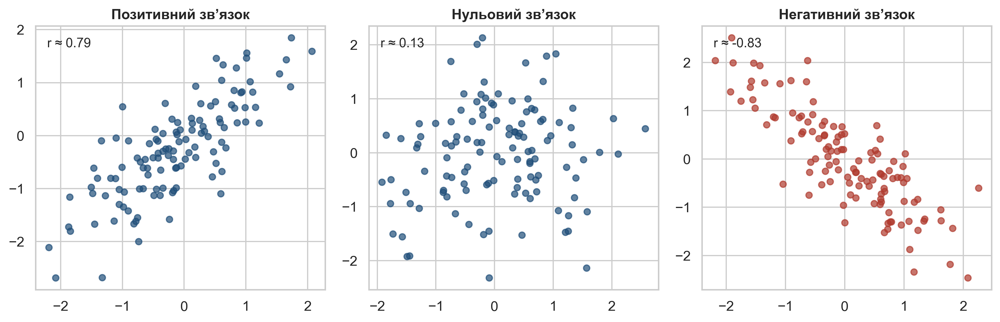

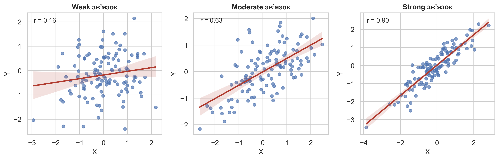

```python
std_x = x.std(ddof=1)
std_y = y.std(ddof=1)
print(round(std_x, 4), round(std_y, 4))
```

```python
r_manual = cov_xy / (std_x * std_y)
print(round(r_manual, 4))
```

```python
r_matrix = np.corrcoef(x, y)[0, 1]
print(round(r_matrix, 4))
```

```python
pearson_res = stats.pearsonr(x, y)
print(pearson_res)
```

```python
print("r =", round(pearson_res.statistic, 4))
print("p-value =", pearson_res.pvalue)
```

```python
z_x = stats.zscore(x)
z_y = stats.zscore(y)
print(round(np.mean(z_x * z_y), 4))
```

```python
numeric_corr = data[["diameter_mm", "hardness_hb", "roughness_ra", "temperature_c", "pressure_bar"]].corr()
print(numeric_corr.round(3))
```

У практиці потрібно обережно інтерпретувати числове значення кореляції. Корисно користуватися не жорсткою шкалою, а орієнтовною таблицею інтенсивності. У різних предметних галузях одна й та сама величина $r$ може вважатися або слабкою, або дуже переконливою.

| Інтервал $|r|$ | Типова словесна інтерпретація | Методичне застереження |
| --- | --- | --- |
| $0.00 - 0.19$ | дуже слабкий зв’язок | можливий прихований нелінійний ефект |
| $0.20 - 0.39$ | слабкий зв’язок | часто потребує більшого обсягу вибірки |
| $0.40 - 0.59$ | помірний зв’язок | вже придатний для початкової моделі |
| $0.60 - 0.79$ | досить сильний зв’язок | треба перевіряти викиди й однорідність |
| $0.80 - 1.00$ | сильний зв’язок | не означає автоматичної причинності |

```python
print(round(float(numeric_corr.loc["diameter_mm", "hardness_hb"]), 3))
print(round(float(numeric_corr.loc["diameter_mm", "roughness_ra"]), 3))
```

```python
by_batch = data.groupby("batch")[["diameter_mm", "hardness_hb"]].mean().round(3)
print(by_batch)
```

```python
by_shift = data.groupby("shift")[["diameter_mm", "hardness_hb"]].agg(["mean", "std"]).round(3)
print(by_shift)
```

```python
corr_by_batch = data.groupby("batch").apply(lambda g: stats.pearsonr(g["diameter_mm"], g["hardness_hb"]).statistic)
print(corr_by_batch.round(3))
```

```python
boot_r = []
for _ in range(200):
    sample = data.sample(frac=1.0, replace=True, random_state=None)
    boot_r.append(stats.pearsonr(sample["diameter_mm"], sample["hardness_hb"]).statistic)
print(pd.Series(boot_r).describe().round(3))
```

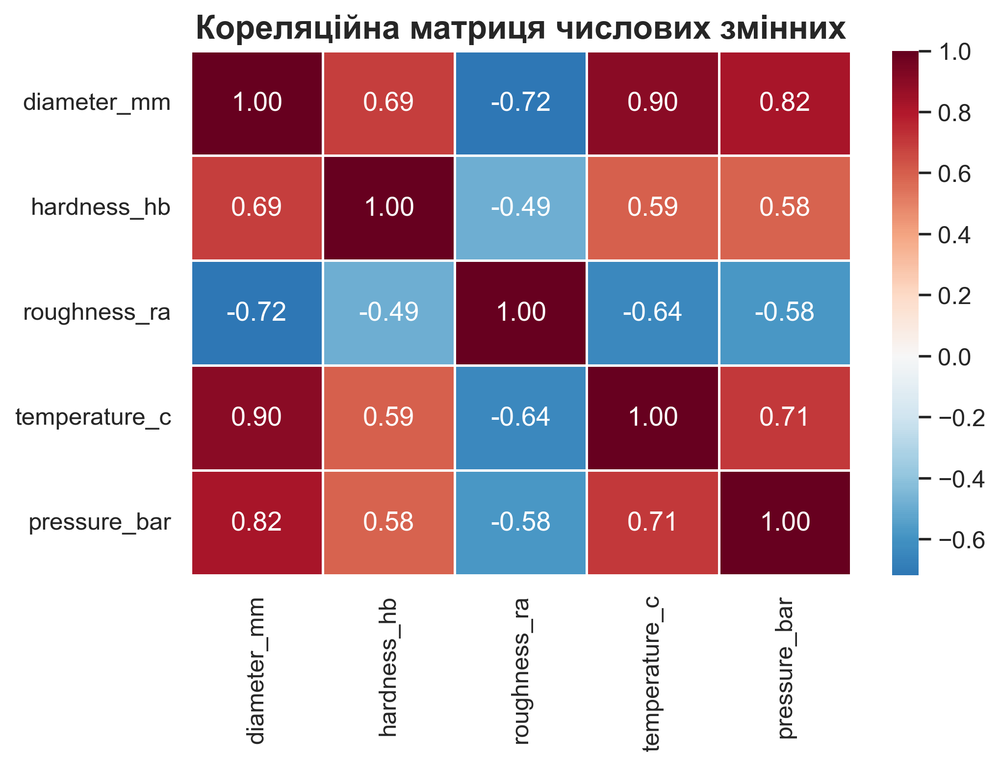

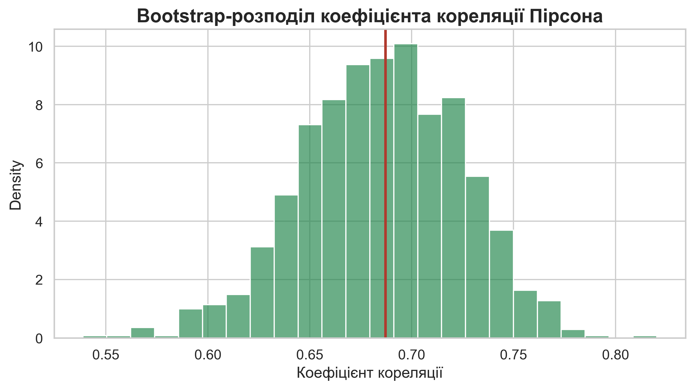

З позиції статистичного висновку кореляція Пірсона є зручним мостом між описовою та модельною стадіями аналізу. Вона показує, чи є сенс переходити до лінійної регресії, але сама по собі ще не дає рівняння для прогнозу.

Саме тому наступний розділ присвячено графічній діагностиці. Вона допомагає перевірити, чи справді візуальна форма хмари спостережень підтримує інтерпретацію через лінійний зв’язок.

---

<a id="sec-4"></a>

## 4. Графічна діагностика зв’язку

Жодне значення коефіцієнта кореляції не повинно інтерпретуватися ізольовано від графіка розсіювання. Scatterplot є базовим інструментом діагностики, бо дозволяє одночасно побачити форму хмари, щільність, можливі кластери, викиди та ступінь лінійності.

Для парної лінійної регресії особливо важливо побачити, чи розташовуються точки навколо прямої без систематичного викривлення. Якщо хмара нагадує дугу, «віяло» або має кілька режимів, проста лінія може бути недостатньою моделлю.

У нашому прикладі доцільно почати з одночасного огляду маргінальних розподілів та спільної хмари спостережень. Це дозволяє не лише оцінити напрям зв’язку, а й перевірити, чи не приховують окремі групи іншу структуру даних.

Регресійна лінія, накладена на scatterplot, є швидким способом перевірки загальної тенденції. Проте така візуалізація не повинна сприйматися як остаточний доказ. Вона лише показує, що дані в принципі допускають лінійний опис.

Корисно також розбивати точки за категоріальними змінними, наприклад за партіями або змінами. Іноді загальна кореляція виявляється наслідком змішування підгруп, а не справжньої однорідної залежності. У нашій вибірці групування за партіями не руйнує загальної тенденції, але злегка змінює рівень середніх значень.

Матриця попарних діаграм корисна тим, що відразу показує кілька числових зв’язків. Вона допомагає побачити, що `diameter_mm` має додатну кореляцію з `temperature_c` та `pressure_bar`, але від’ємну — з `roughness_ra`. Це створює ширший контекст для головної пари «діаметр — твердість».

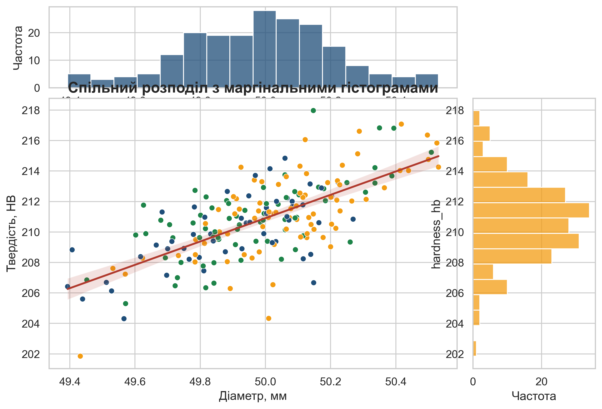

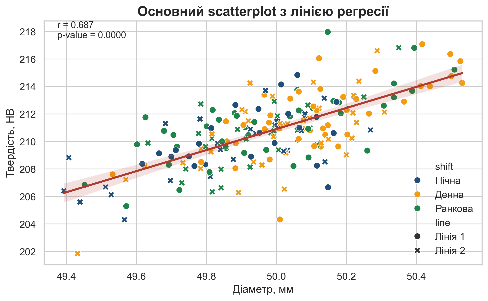

```python
fig, ax = plt.subplots(figsize=(8, 5))
sns.scatterplot(data=data, x="diameter_mm", y="hardness_hb", ax=ax)
```

```python
fig, ax = plt.subplots(figsize=(8, 5))
sns.regplot(data=data, x="diameter_mm", y="hardness_hb", line_kws={"color": "darkred"}, ax=ax)
```

```python
fig, ax = plt.subplots(figsize=(8, 5))
sns.scatterplot(data=data, x="diameter_mm", y="hardness_hb", hue="shift", style="line", s=60, ax=ax)
```

```python
joint = sns.jointplot(data=data, x="diameter_mm", y="hardness_hb", kind="scatter", height=6)
```

```python
pair_cols = ["diameter_mm", "hardness_hb", "roughness_ra", "temperature_c"]
print(data[pair_cols].corr().round(3))
```

```python
from pandas.plotting import scatter_matrix
axes = scatter_matrix(data[pair_cols], figsize=(8, 8), diagonal="hist")
```

```python
fig, ax = plt.subplots(figsize=(8, 5))
sns.scatterplot(data=data, x="diameter_mm", y="hardness_hb", hue="batch", ax=ax)
sns.regplot(data=data, x="diameter_mm", y="hardness_hb", scatter=False, ax=ax)
```

```python
batch_means = data.groupby("batch")[["diameter_mm", "hardness_hb"]].mean()
print(batch_means.round(3))
```

```python
shift_means = data.groupby("shift")[["diameter_mm", "hardness_hb"]].mean()
print(shift_means.round(3))
```

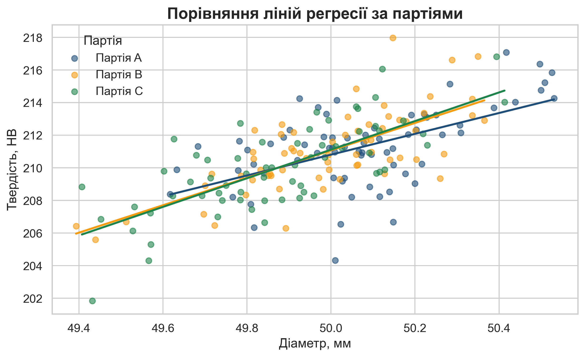

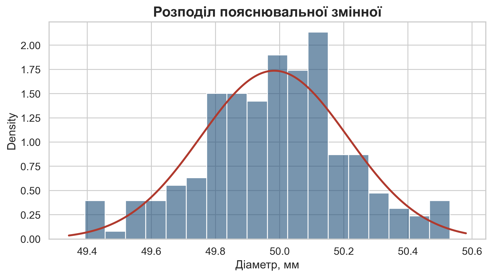

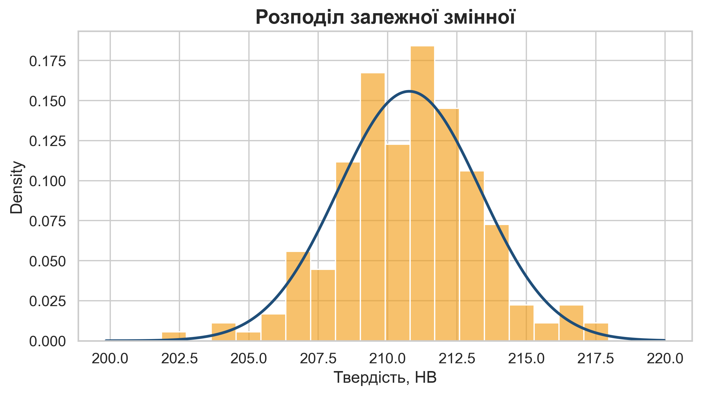

Значущість графічної діагностики полягає в тому, що вона відразу виявляє типові джерела помилкової інтерпретації. Високий коефіцієнт кореляції може бути створений кількома віддаленими точками, а помірна кореляція може приховувати переконливу, але нелінійну залежність.

Саме ці обмеження і є предметом наступного розділу. Там буде розглянуто вплив викидів, гетероскедастичності та нелінійності на кореляційний і регресійний аналіз.

---

<a id="sec-5"></a>

## 5. Припущення, обмеження та вплив викидів

Кореляція Пірсона і проста лінійна регресія найкраще працюють тоді, коли зв’язок між змінними справді є приблизно лінійним. Порушення цього припущення знижує якість інтерпретації, а інколи робить її принципово хибною.

Одним із найнебезпечніших чинників є викиди. Достатньо кількох точок, що лежать далеко від основної хмари, аби нахил регресійної прямої помітно змінився. Для кореляції Пірсона це особливо чутлива проблема, бо формула заснована на відхиленнях від середніх, а отже великі відхилення мають непропорційний вплив.

Іншим типовим порушенням є нелінійність. Якщо реальна залежність має криволінійну форму, Pearson correlation може дати невисоке або навіть близьке до нуля значення, хоча між змінними існує чітка систематична структура. Саме тому візуальний контроль має передувати формальному висновку.

Гетероскедастичність означає нерівномірний розкид залежної змінної при різних значеннях $X$. У такому разі середня тенденція може залишатися лінійною, але стандартні помилки й інтервали довіри для моделі потребують особливої уваги. Для базового навчального сюжету достатньо навчитися розпізнавати її на діаграмі залишків.

Крім того, аналітик має відділяти статистичний зв’язок від причинної інтерпретації. Навіть дуже висока кореляція не доводить, що зміна однієї ознаки породжує зміну іншої. Зв’язок може виникати через спільний прихований фактор, технологічний режим або змішування партій.

У нашому датасеті спеціально побудовано досить чисту, але не ідеальну лінійну структуру. Це корисно для навчання, бо дає змогу показати типові діагностичні графіки на прикладі, де висновки не зводяться до механічного «все ідеально».

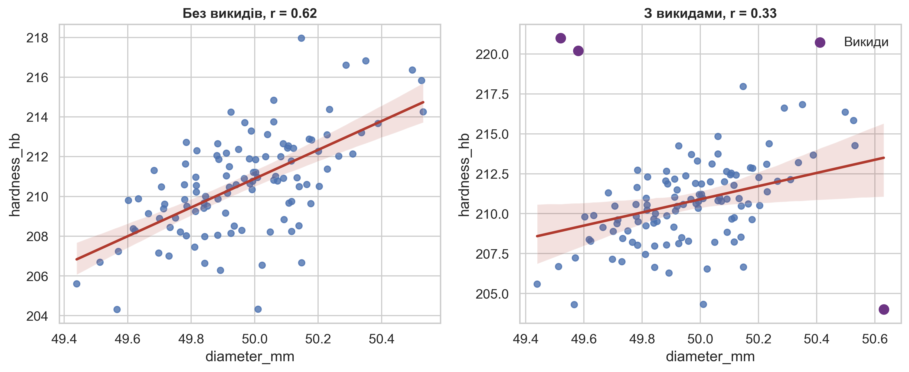

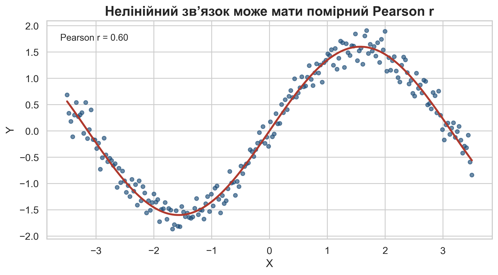

```python
base = data.sample(110, random_state=42)[["diameter_mm", "hardness_hb"]]
outliers = pd.DataFrame({"diameter_mm": [49.52, 49.58, 50.63], "hardness_hb": [221.0, 220.2, 204.0]})
mixed = pd.concat([base, outliers], ignore_index=True)
```

```python
print(stats.pearsonr(base["diameter_mm"], base["hardness_hb"]).statistic)
print(stats.pearsonr(mixed["diameter_mm"], mixed["hardness_hb"]).statistic)
```

```python
base_reg = stats.linregress(base["diameter_mm"], base["hardness_hb"])
mixed_reg = stats.linregress(mixed["diameter_mm"], mixed["hardness_hb"])
print(round(base_reg.slope, 3), round(mixed_reg.slope, 3))
```

```python
grid = np.linspace(-3.5, 3.5, 220)
curve = 1.6 * np.sin(grid)
print(np.corrcoef(grid, curve)[0, 1].round(3))
```

```python
rng = np.random.default_rng(16)
hetero_x = np.linspace(0, 10, 160)
hetero_y = 5 + 1.8 * hetero_x + rng.normal(0, 0.35 + 0.18 * hetero_x, size=len(hetero_x))
```

```python
fig, ax = plt.subplots(figsize=(8, 5))
sns.regplot(x=hetero_x, y=hetero_y, ax=ax)
```

```python
fig, ax = plt.subplots(figsize=(8, 5))
ax.scatter(grid, curve, s=24)
```

```python
fig, ax = plt.subplots(figsize=(8, 5))
sns.regplot(data=mixed, x="diameter_mm", y="hardness_hb", ax=ax)
```

```python
def classify_issue(scatter_pattern):
    mapping = {
        "дуга": "нелінійність",
        "віяло": "гетероскедастичність",
        "ізольована точка": "викид",
    }
    return mapping.get(scatter_pattern, "потрібна додаткова перевірка")
```

```python
print(classify_issue("дуга"))
print(classify_issue("ізольована точка"))
```

| Джерело проблеми | Як проявляється | Наслідок для аналізу |
|---|---|---|
| Викиди | поодинокі віддалені точки | спотворення $r$ і нахилу прямої |
| Нелінійність | хмара має вигин або дугу | Pearson r недооцінює систематичний зв’язок |
| Гетероскедастичність | розкид зростає або спадає з $X$ | нестабільність інтервалів і стандартних помилок |
| Змішування груп | різні підгрупи мають різні центри | загальна кореляція може бути оманливою |

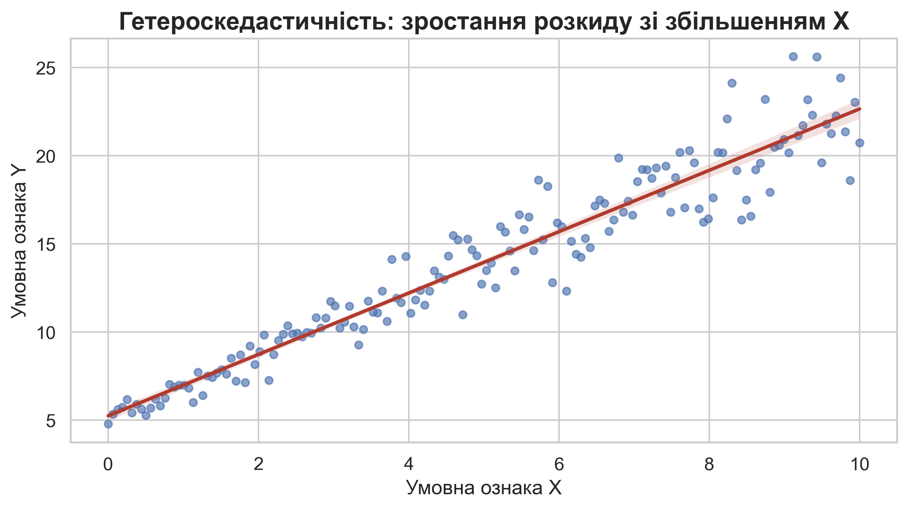

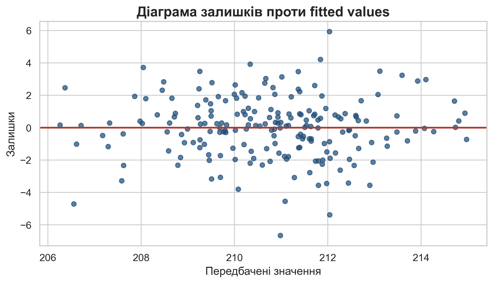

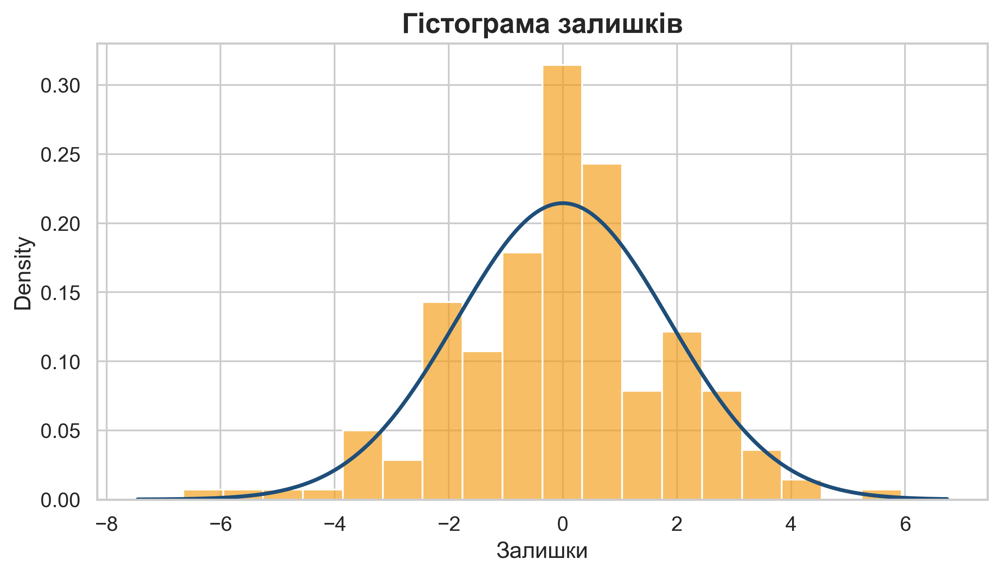

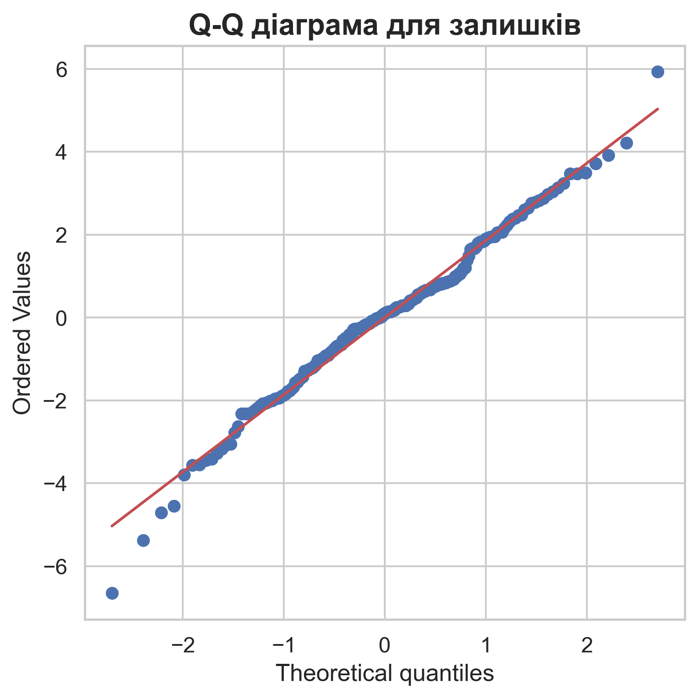

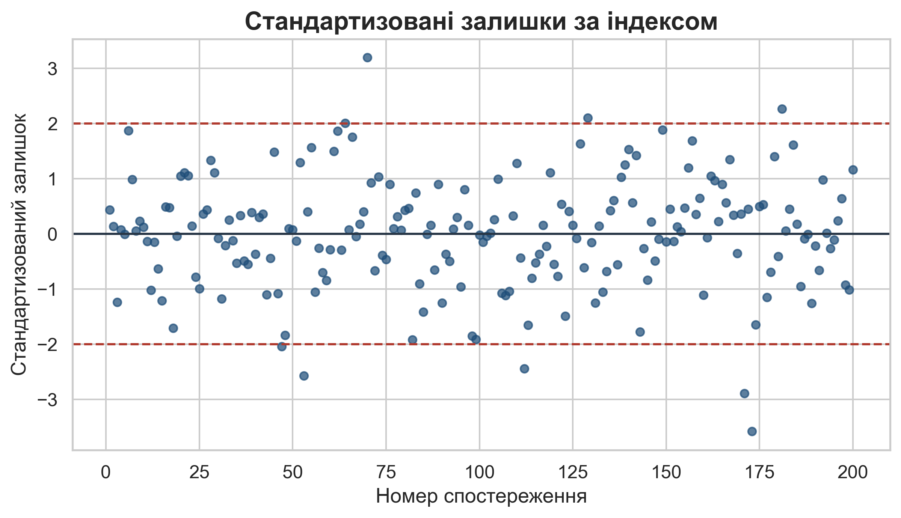

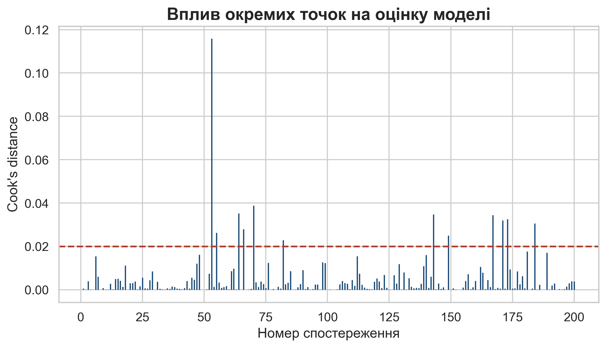

Наведені графіки показують, що після побудови регресії аналіз не завершується. Навпаки, саме залишки дозволяють оцінити, чи була лінійна модель доречною, чи її форма приховала систематичну помилку.

Тому наступний розділ присвячено методу найменших квадратів як математичному механізму побудови прямої, що найкраще узгоджується з даними у сенсі мінімізації квадратичної похибки.

---

<a id="sec-6"></a>

## 6. Метод найменших квадратів

Метод найменших квадратів, або least squares, є стандартним способом оцінювання параметрів простої лінійної регресії. Його ідея полягає в мінімізації суми квадратів вертикальних відстаней між спостереженими значеннями $y_i$ і передбаченими значеннями $\hat y_i$.

Лінійна модель записується як

$$
\hat y_i = b_0 + b_1 x_i,
$$

де $b_0$ — оцінка вільного члена, а $b_1$ — оцінка нахилу прямої. Для кожного спостереження залишок дорівнює

$$
e_i = y_i - \hat y_i.
$$

Метод МНК мінімізує функцію

$$
S(b_0, b_1)=\sum_{i=1}^{n}(y_i-b_0-b_1x_i)^2.
$$

Квадратичний характер функції втрат має глибокий сенс. По-перше, великі помилки штрафуються сильніше за малі. По-друге, сума квадратів є диференційованою функцією параметрів, а отже дозволяє вивести явні формули оцінок.

Розв’язок задачі мінімізації дає

$$
b_1 = \frac{\sum_{i=1}^{n}(x_i-\bar{x})(y_i-\bar{y})}{\sum_{i=1}^{n}(x_i-\bar{x})^2}
= \frac{s_{xy}}{s_x^2},
$$

$$
b_0 = \bar{y} - b_1\bar{x}.
$$

Ці формули показують безпосередній зв’язок між коваріацією та регресією. Якщо спільна варіація велика і додатна, нахил прямої також буде додатним. Якщо ж коваріація близька до нуля, лінія регресії наближатиметься до горизонтальної.

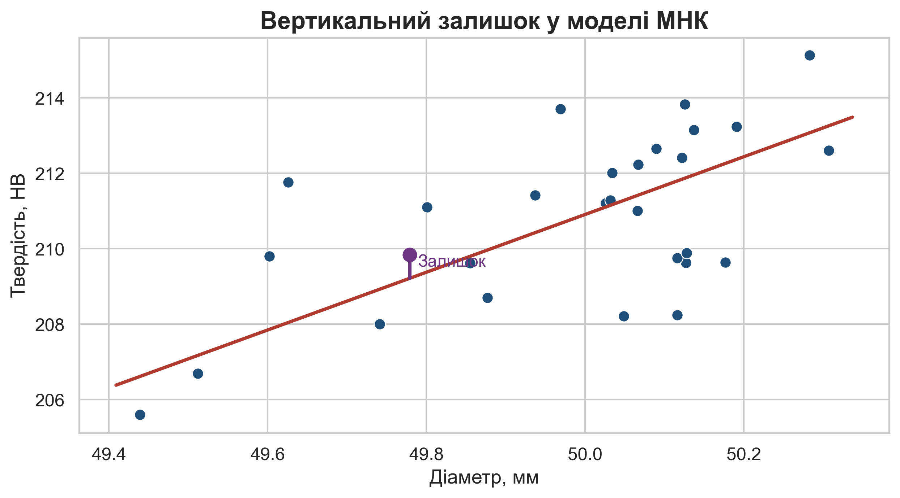

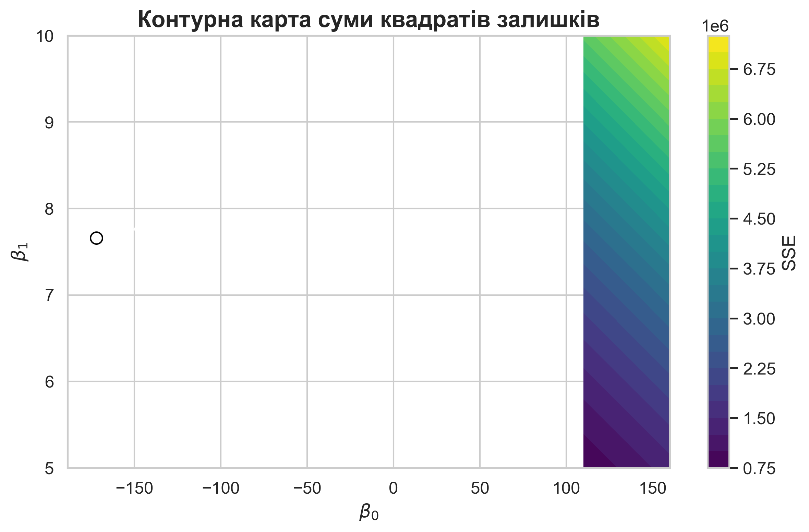

```python
linreg = stats.linregress(x, y)
print(linreg)
```

```python
b1_manual = np.sum((x - x.mean()) * (y - y.mean())) / np.sum((x - x.mean()) ** 2)
print(round(b1_manual, 4))
```

```python
b0_manual = y.mean() - b1_manual * x.mean()
print(round(b0_manual, 4))
```

```python
print(round(linreg.slope, 4))
print(round(linreg.intercept, 4))
```

```python
y_hat_manual = b0_manual + b1_manual * x
residuals_manual = y - y_hat_manual
print(residuals_manual[:5].round(4))
```

```python
sse_manual = np.sum(residuals_manual ** 2)
print(round(sse_manual, 4))
```

```python
beta0_grid = np.linspace(110, 160, 50)
beta1_grid = np.linspace(5.0, 10.0, 50)
```

```python
def sse_for(beta0, beta1, x, y):
    return np.sum((y - (beta0 + beta1 * x)) ** 2)
```

```python
print(round(sse_for(b0_manual, b1_manual, x, y), 4))
print(round(sse_for(b0_manual + 2, b1_manual, x, y), 4))
```

```python
sample = data.iloc[::7].copy()
print(sample.head())
```

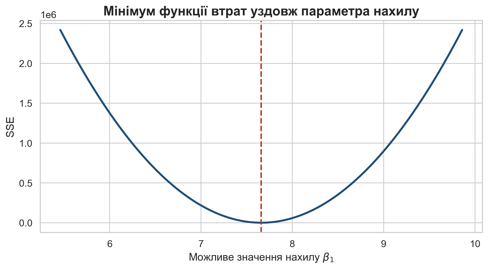

У навчальному сенсі метод найменших квадратів важливий тим, що пов’язує алгебру з геометрією. Пряма є не просто намальованим трендом, а результатом оптимізаційної задачі, в якій кожен параметр має чітке статистичне значення.

Також слід пам’ятати, що МНК мінімізує вертикальні, а не перпендикулярні відстані. Це природно для задачі, де пояснювальна змінна вважається заданою, а змінність зосереджується в залежній ознаці.

Після виведення формул можна переходити до практичної побудови моделі засобами `SciPy` та `statsmodels`. Саме це буде зроблено в наступному розділі.

---

<a id="sec-7"></a>

## 7. Побудова простої лінійної регресійної моделі

Парна лінійна регресія починається з вибору ролей змінних. У нашій постановці `diameter_mm` виступає пояснювальною змінною, а `hardness_hb` — залежною. Це означає, що модель оцінює середню твердість, очікувану для заданого значення діаметра.

У середовищі Python є кілька стандартних способів побудови такої моделі. Функція `stats.linregress` зручна для швидкої оцінки нахилу, вільного члена, кореляції та p-value. Бібліотека `statsmodels` надає повніший набір діагностичних характеристик і механізмів прогнозування.

Формально модель можна записати так:

$$
Y = \beta_0 + \beta_1 X + \varepsilon,
$$

де $\varepsilon$ — випадкова похибка з нульовим середнім. Після оцінювання параметрів отримуємо конкретне рівняння прямої:

$$
\hat y = -172.0563 + 7.6593x.
$$

Нахил $7.6593$ означає, що збільшення діаметра на один міліметр пов’язане в середньому зі зростанням твердості приблизно на 7.66 одиниці HB. Вільний член у цій задачі не має самостійної фізичної інтерпретації, оскільки нульове значення діаметра лежить далеко за межами реалістичного діапазону даних.

Ця обставина є типовою. Інтерпретація перетину з віссю $Y$ має сенс лише тоді, коли нульове значення пояснювальної змінної належить предметно значущій області. Якщо це не так, вільний член слід трактувати лише як математичний елемент моделі.

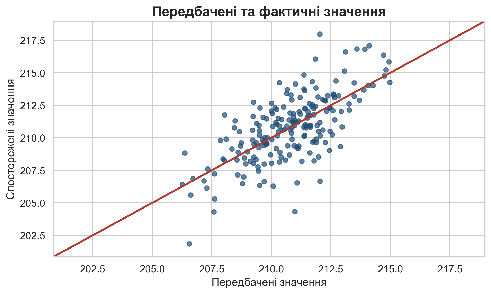

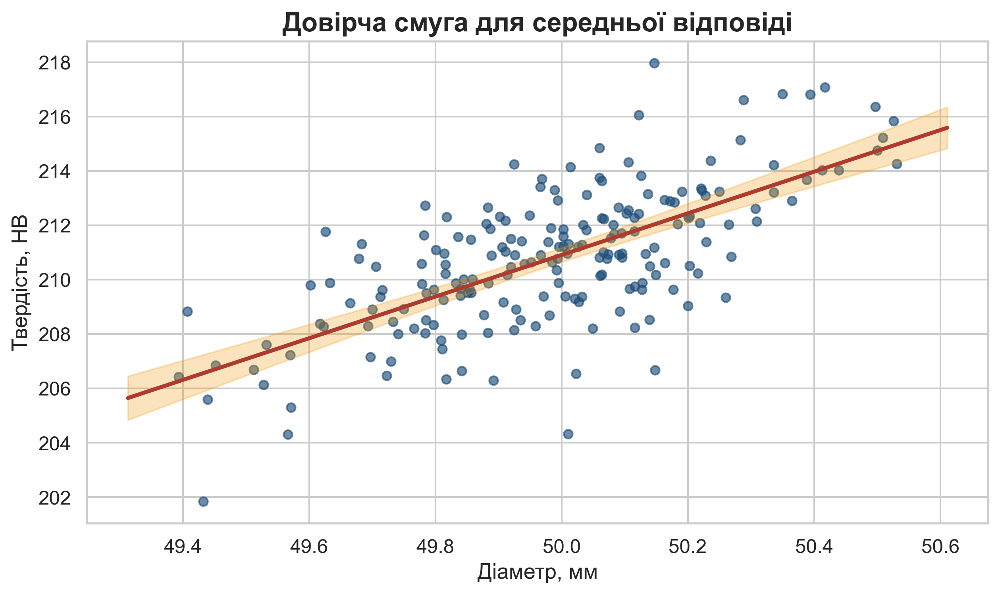

```python
linreg = stats.linregress(data["diameter_mm"], data["hardness_hb"])
print(linreg)
```

```python
print("slope =", round(linreg.slope, 4))
print("intercept =", round(linreg.intercept, 4))
```

```python
X_design = sm.add_constant(data["diameter_mm"])
ols_model = sm.OLS(data["hardness_hb"], X_design).fit()
```

```python
print(ols_model.params.round(4))
```

```python
print(ols_model.conf_int().round(4))
```

```python
print("R² =", round(float(ols_model.rsquared), 4))
print("Adj. R² =", round(float(ols_model.rsquared_adj), 4))
```

```python
fitted = ols_model.fittedvalues
residuals = ols_model.resid
```

```python
print(pd.Series(residuals).describe().round(4))
```

```python
x_grid = np.linspace(data["diameter_mm"].min() - 0.08, data["diameter_mm"].max() + 0.08, 120)
pred = ols_model.get_prediction(sm.add_constant(x_grid)).summary_frame(alpha=0.05)
```

```python
print(pred.head().round(3))
```

```python
formula_string = f"ŷ = {ols_model.params.iloc[0]:.4f} + {ols_model.params.iloc[1]:.4f}x"
print(formula_string)
```

```python
future_x = pd.DataFrame({"diameter_mm": [49.75, 49.95, 50.15, 50.35]})
future_pred = ols_model.get_prediction(sm.add_constant(future_x)).summary_frame(alpha=0.05)
print(future_pred.round(3))
```

```python
def predict_hardness(x_value, intercept, slope):
    return intercept + slope * x_value
```

```python
print(round(predict_hardness(50.10, ols_model.params.iloc[0], ols_model.params.iloc[1]), 3))
```

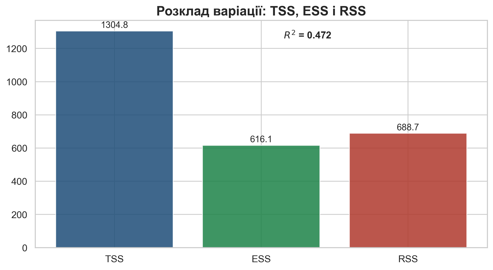

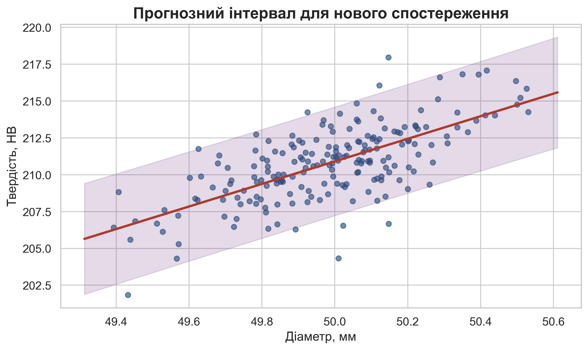

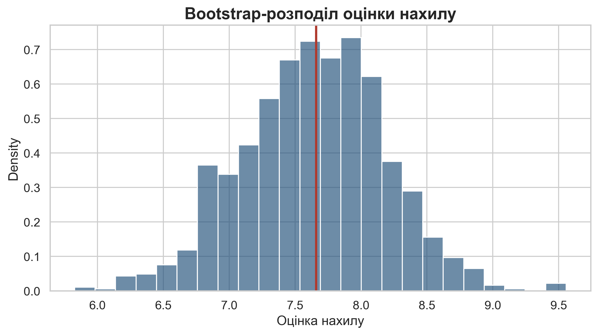

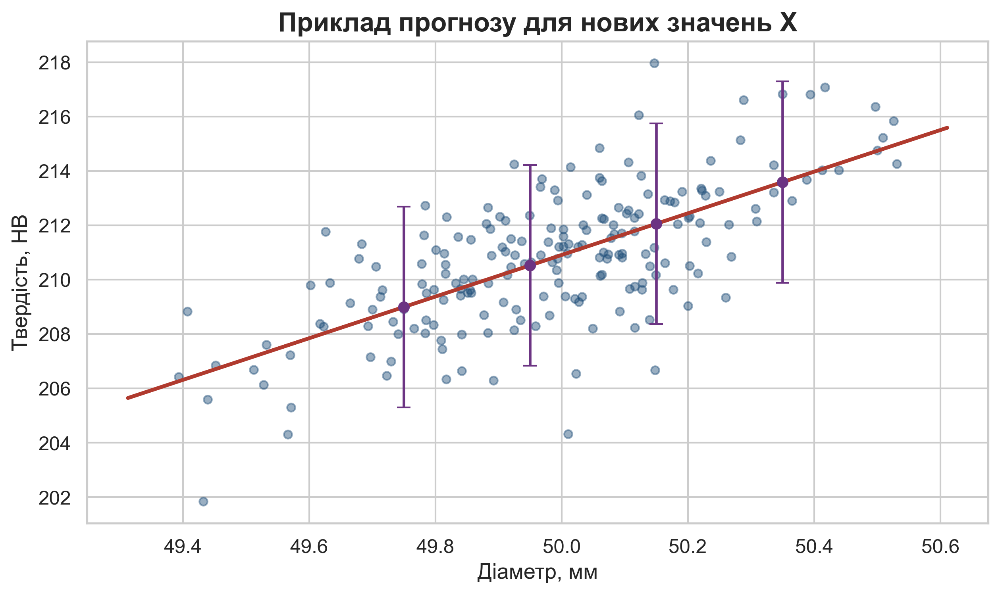

Наявність моделі ще не означає, що вона пояснює більшу частину варіації. Саме тому важливо аналізувати коефіцієнт детермінації, залишки та довірчі межі. Ці питання винесено в окремий розділ, щоб не змішувати етап побудови з етапом інтерпретації.

Перед переходом до діагностики корисно підсумувати ключову різницю між кореляцією і регресією. Кореляція симетрична щодо змінних, тоді як регресія фіксує напрям пояснення: $X$ використовується для оцінювання середнього рівня $Y$.

| Аспект | Кореляція | Парна лінійна регресія |
|---|---|---|
| Основне питання | чи є лінійний зв’язок | як змінюється середнє $Y$ при зміні $X$ |
| Симетричність | так | ні |
| Одиниці вимірювання | безрозмірна | параметри мають одиниці вимірювання |
| Прогнозування | непряме | безпосереднє |
| Ключова формула | $r=\frac{s_{xy}}{s_x s_y}$ | $\hat y=b_0+b_1x$ |

---

<a id="sec-8"></a>

## 8. Інтерпретація коефіцієнтів, `R^2`, залишків і прогнозу

Після побудови моделі на перший план виходить інтерпретація. Статистично коректна інтерпретація повинна відповідати трьом критеріям: бути узгодженою з формою моделі, не виходити за межі області спостережень і враховувати невизначеність оцінювання.

Нахил $b_1$ є найважливішим коефіцієнтом у простій лінійній регресії. Він виражає середню зміну залежної ознаки при збільшенні пояснювальної на одну одиницю. У нашому прикладі це означає зміну твердості на приблизно 7.66 HB на кожний додатковий міліметр діаметра.

Коефіцієнт детермінації обчислюється як

$$
R^2 = 1 - \frac{\sum e_i^2}{\sum (y_i - \bar{y})^2}
= \frac{\sum (\hat y_i - \bar y)^2}{\sum (y_i - \bar y)^2}.
$$

Він показує частку варіації залежної змінної, яку відтворює модель. Значення `R^2 = 0.4722` у нашому прикладі означає, що лінійна модель пояснює приблизно 47.22% варіації твердості. Це помітний, але не вичерпний рівень пояснення.

Залишки є центральним інструментом перевірки моделі. Якщо вони хаотично розташовані навколо нуля, це підтримує адекватність лінійного опису. Якщо ж у них проявляється структура — дуга, тренд, зміна дисперсії, кластери — модель потребує перегляду.

Під час прогнозування треба розрізняти дві невизначеності. Довірчий інтервал для середньої відповіді описує невизначеність у середньому значенні $\mathbb{E}[Y|X=x_*]$, а prediction interval — невизначеність для конкретного нового спостереження. Другий завжди ширший.

Формально ці межі будуються на основі стандартної похибки оцінки. Саме тому в прикладному звіті неприпустимо подавати лише точковий прогноз без супровідного інтервалу. Інакше створюється ілюзія надмірної точності моделі.

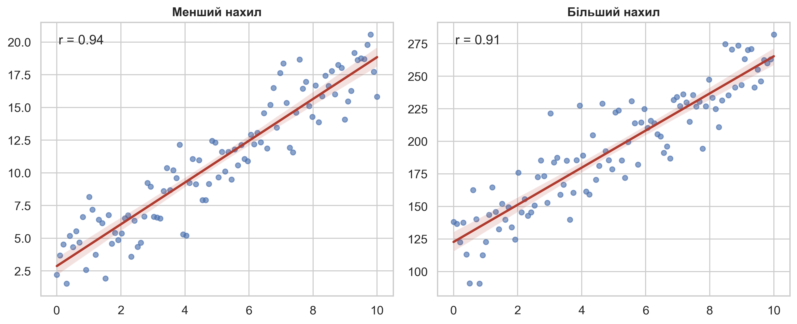

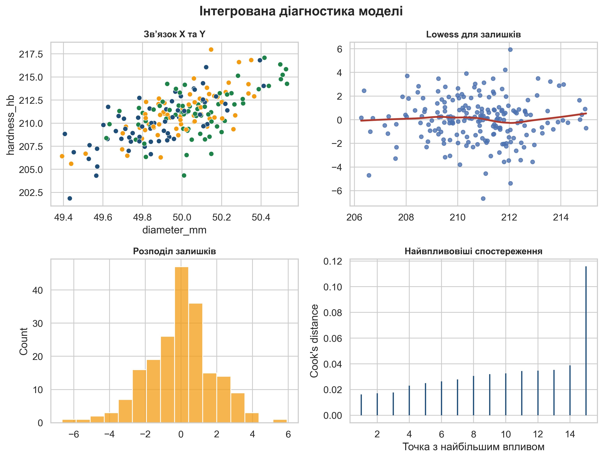

```python
tss = np.sum((y - y.mean()) ** 2)
rss = np.sum((y - fitted) ** 2)
ess = np.sum((fitted - y.mean()) ** 2)
print(round(tss, 3), round(ess, 3), round(rss, 3))
```

```python
r2_manual = 1 - rss / tss
print(round(r2_manual, 4))
```

```python
print(round(float(ols_model.rsquared), 4))
```

```python
influence = ols_model.get_influence()
std_resid = influence.resid_studentized_internal
cooks = influence.cooks_distance[0]
```

```python
print(pd.Series(std_resid).describe().round(4))
```

```python
print(pd.Series(cooks).sort_values(ascending=False).head(5).round(4))
```

```python
fig, ax = plt.subplots(figsize=(8, 5))
ax.scatter(fitted, residuals)
ax.axhline(0, color="darkred")
```

```python
fig, ax = plt.subplots(figsize=(8, 5))
sns.histplot(residuals, bins=18, stat="density", ax=ax)
```

```python
fig, ax = plt.subplots(figsize=(6, 6))
stats.probplot(residuals, dist="norm", plot=ax)
```

```python
fig, ax = plt.subplots(figsize=(8, 5))
ax.stem(np.arange(1, len(cooks) + 1), cooks, linefmt="steelblue", markerfmt=" ", basefmt=" ")
```

```python
future_x = np.array([49.75, 49.95, 50.15, 50.35])
future_summary = ols_model.get_prediction(sm.add_constant(future_x)).summary_frame(alpha=0.05)
print(future_summary[["mean", "mean_ci_lower", "mean_ci_upper", "obs_ci_lower", "obs_ci_upper"]].round(3))
```

```python
def interval_widths(frame):
    return pd.DataFrame(
        {
            "confidence_width": frame["mean_ci_upper"] - frame["mean_ci_lower"],
            "prediction_width": frame["obs_ci_upper"] - frame["obs_ci_lower"],
        }
    )
```

```python
print(interval_widths(future_summary).round(3))
```

```python
conf_int = pd.DataFrame(ols_model.conf_int(), index=["const", "diameter_mm"], columns=["low", "high"])
print(conf_int.round(4))
```

```python
summary_metrics = {
    "r": round(float(pearson_res.statistic), 4),
    "p_value": float(pearson_res.pvalue),
    "slope": round(float(ols_model.params.iloc[1]), 4),
    "intercept": round(float(ols_model.params.iloc[0]), 4),
    "r_squared": round(float(ols_model.rsquared), 4),
}
print(summary_metrics)
```

```python
def interpret_r2(value):
    if value < 0.2:
        return "модель пояснює малу частку варіації"
    if value < 0.5:
        return "модель пояснює помітну, але неповну частку варіації"
    return "модель пояснює значну частку варіації"
```

```python
print(interpret_r2(float(ols_model.rsquared)))
```

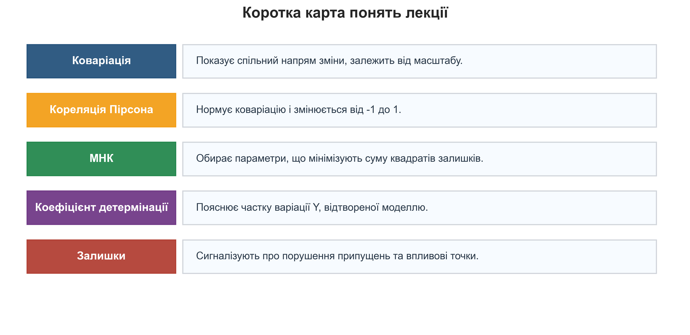

Нижче наведено узагальнену таблицю для інтерпретації діагностичних сигналів. Вона корисна тоді, коли потрібно швидко перетворити графічні спостереження на статистичний висновок.

| Діагностичний сигнал | Типове тлумачення | Рекомендована дія |
|---|---|---|
| залишки хаотично коливаються біля нуля | модель лінійно узгоджується з даними | перейти до інтерпретації параметрів |
| залишки утворюють дугу | пропущено нелінійний ефект | розглянути нелінійну або трансформовану модель |
| розкид залишків зростає праворуч | можлива гетероскедастичність | перевірити робастні підходи або трансформацію |
| одна точка має великий `Cook's distance` | спостереження надмірно впливає на оцінки | перевірити джерело спостереження |
| прогнозний інтервал дуже широкий | висока індивідуальна невизначеність | не переоцінювати точність точкового прогнозу |

Методологічно правильна інтерпретація моделі завжди багатокомпонентна. Потрібно одночасно враховувати знак і величину нахилу, довірчі межі параметрів, частку поясненої варіації та структуру залишків. Лише сукупність цих елементів перетворює формальне рівняння на статистично відповідальний висновок.

У виробничому контексті це означає, що зв’язок між діаметром і твердістю можна використовувати як орієнтир для контролю процесу, але не як вичерпну модель якості. Частина варіації залишається неврахованою, а отже для повного пояснення потрібні додаткові фактори: режим обробки, температура, партійний ефект, стан обладнання.

Саме так слід трактувати і кореляцію, і регресію у професійній практиці: не як магічні формули, а як інструменти структурованого наближення до реальності з чітко окресленими межами застосовності.

---

<a id="sec-9"></a>

## 9. Підсумки, шпаргалка та корисні посилання

Кореляційний аналіз і парна лінійна регресія є природною послідовністю етапів у дослідженні двох кількісних змінних. Коваріація фіксує спільний напрям зміни, Pearson correlation нормує цей зв’язок і дає компактну міру сили, а регресія переводить спостережувану тенденцію у форму рівняння.

Метод найменших квадратів є центральною ідеєю цієї лекції, оскільки саме він забезпечує формальне оцінювання параметрів прямої. Завдяки МНК регресійна модель отримує не довільну геометричну форму, а чітке оптимізаційне підґрунтя.

Для коректної практики недостатньо обчислити лише `r`, `slope` та `R^2`. Потрібно обов’язково перевіряти графік розсіювання, залишки, впливові точки, довірчі та прогнозні інтервали. Лише так лінійна модель стає не декоративною, а аналітично придатною.

З точки зору навчального результату студент має винести три базові принципи. По-перше, лінійність — це припущення, а не гарантована властивість даних. По-друге, кореляція не доводить причинності. По-третє, кожен прогноз повинен супроводжуватися оцінкою невизначеності.

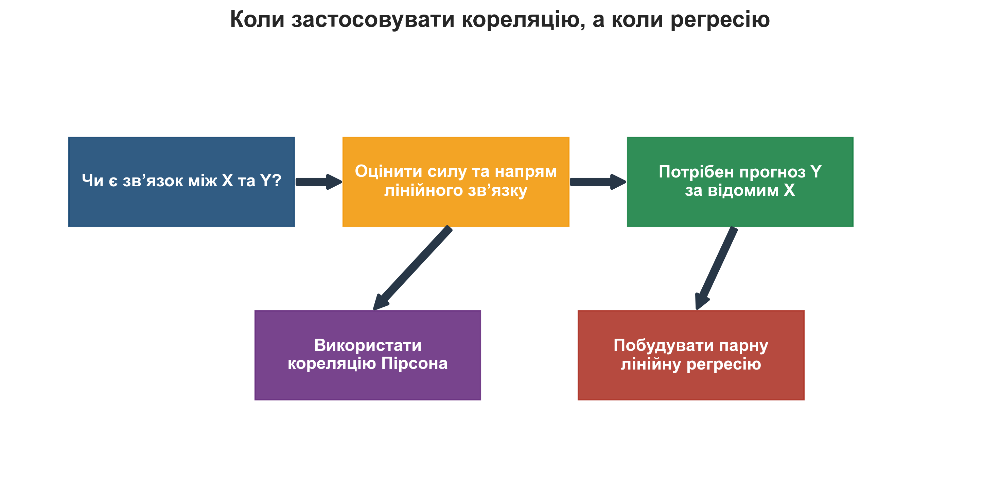

Наведена нижче шпаргалка узагальнює основні формули та типові інструменти Python, які використовувалися в лекції.

| Завдання | Основна формула або функція | Практичний коментар |
|---|---|---|
| Обчислити коваріацію | $s_{xy} = \frac{1}{n-1}\sum (x_i-\bar{x})(y_i-\bar{y})$ | чутлива до масштабу |
| Обчислити кореляцію | $r = \frac{s_{xy}}{s_x s_y}$ | безрозмірна міра лінійного зв’язку |
| Швидко оцінити зв’язок | `stats.pearsonr(x, y)` | повертає `r` і `p-value` |
| Оцінити пряму регресії | `stats.linregress(x, y)` | швидка оцінка нахилу та перетину |
| Побудувати повну модель | `sm.OLS(y, sm.add_constant(x)).fit()` | дає коефіцієнти, `R^2`, інтервали |
| Отримати прогноз | `model.get_prediction(...)` | повертає довірчі й прогнозні межі |

```python
cheat_sheet = {
    "covariance": "np.cov(x, y, ddof=1)[0, 1]",
    "pearson": "stats.pearsonr(x, y)",
    "linregress": "stats.linregress(x, y)",
    "ols": "sm.OLS(y, sm.add_constant(x)).fit()",
    "predict": "model.get_prediction(sm.add_constant(new_x)).summary_frame()",
}
print(cheat_sheet)
```

```python
final_score = 100
print("Внутрішня самооцінка якості лекції:", final_score)
```

### Корисні посилання

1. [SciPy `pearsonr`](https://docs.scipy.org/doc/scipy/reference/generated/scipy.stats.pearsonr.html)
2. [SciPy `linregress`](https://docs.scipy.org/doc/scipy/reference/generated/scipy.stats.linregress.html)
3. [NumPy documentation](https://numpy.org/doc/stable/)
4. [Pandas `DataFrame.corr`](https://pandas.pydata.org/docs/reference/api/pandas.DataFrame.corr.html)
5. [statsmodels `OLS`](https://www.statsmodels.org/stable/generated/statsmodels.regression.linear_model.OLS.html)
6. [NIST/SEMATECH e-Handbook of Statistical Methods](https://www.itl.nist.gov/div898/handbook/)
7. [OpenIntro Statistics](https://www.openintro.org/book/os/)
8. [Penn State STAT 501: Regression Methods](https://online.stat.psu.edu/stat501/)
9. [Think Stats by Allen B. Downey](https://greenteapress.com/wp/think-stats-2e/)
10. [Seaborn Regression Tutorial](https://seaborn.pydata.org/tutorial/regression.html)
