# Лекційна записка 6. Множинна лінійна регресія

## Зміст

1. [Роль множинної регресії в статистичній обробці даних](#sec-1)
2. [Перехід від парної до множинної лінійної регресії](#sec-2)
3. [Матрична форма моделі та метод найменших квадратів](#sec-3)
4. [Підготовка даних, числові й категоріальні предиктори](#sec-4)
5. [Оцінювання якості моделі: R-квадрат, F-статистика, RMSE та MAE](#sec-5)
6. [Інтерпретація коефіцієнтів і контроль інших змінних](#sec-6)
7. [Мультиколінеарність, кореляційна матриця та VIF](#sec-7)
8. [Реалізація моделей у statsmodels і scikit-learn](#sec-8)
9. [Підсумки, шпаргалка та корисні посилання](#sec-9)

---

## 1. Роль множинної регресії в статистичній обробці даних

Множинна лінійна регресія є природним розширенням ідеї парної регресії. Якщо в парній регресії ми досліджували вплив однієї незалежної змінної (предиктора) на залежну змінну (відгук), то в реальних практичних задачах результат майже ніколи не визначається єдиним чинником. Наприклад, заробітна плата розробника формується не лише на основі його стажу, а й залежить від посади, рівня володіння англійською мовою, стеку технологій, розміру компанії тощо.

Головна мета побудови множинної регресійної моделі полягає у **виокремленні та кількісній оцінці впливу кожного предиктора за умови "фіксації" або "контролю" інших факторів**. Це дозволяє аналітикам відповідати на складні бізнес-запитання. Наприклад: "Скільки в середньому додає до зарплати один додатковий рік досвіду, якщо ми розглядаємо спеціалістів однакового рівня, з однаковою англійською та в однакових компаніях?".

У цій лекції для демонстрації всіх концепцій ми будемо використовувати реальний набір даних `2025_dec_raw.csv` (зарплати українських розробників), оброблений та очищений до 4066 записів.

Розглянемо базові описові статистики для числових змінних (див. Табл. 1):

### Табл. 1. Описові статистики числових змінних

| index | salary_usd_net | experience_years | age | english_score | project_complexity | team_size | test_coverage_pct |
| --- | --- | --- | --- | --- | --- | --- | --- |
| count | 4066.0 | 4066.0 | 4066.0 | 4066.0 | 4066.0 | 4066.0 | 4066.0 |
| mean | 3815.95 | 6.37 | 31.65 | 3.6 | 6.52 | 8.01 | 71.51 |
| std | 2354.12 | 4.0 | 7.02 | 0.87 | 1.48 | 2.82 | 14.81 |
| min | 180.0 | 1.0 | 16.0 | 1.0 | 1.64 | 1.0 | 21.25 |
| 50% | 3500.0 | 5.0 | 31.0 | 4.0 | 6.53 | 8.0 | 71.72 |
| max | 30000.0 | 20.0 | 71.0 | 5.0 | 10.0 | 19.0 | 100.0 |

І розподіл за основними посадами (див. Табл. 2):

### Табл. 2. Розподіл топових посад (title)

| title | count |
| --- | --- |
| Senior | 1652 |
| Middle | 1442 |
| Junior | 347 |
| Team Lead (for SE & QA: Lead + Team Lead) | 248 |
| Technical Lead | 221 |

> [!NOTE]
> Зверніть увагу: на відміну від багатьох підручників, де множинна регресія подається як суто математична абстракція, ми розглядатимемо її як набір інструментів: для статистичного пояснення (`statsmodels`) та для інженерного прогнозування (`scikit-learn`).

### Висновок до розділу 1

Множинна регресія здатна ізолювати вплив факторів, що робить її незамінною в соціологічних, медичних та економічних дослідженнях (наприклад, визначення "чистого" впливу рівня англійської на зарплату, знехтувавши віком і стажем). Але вона все ще є лінійною моделлю і припускає адитивний ефект (додавання). Якщо взаємодія предикторів має мультиплікативний характер, необхідні трансформації (наприклад, логарифмування цільової змінної) або введення термінів взаємодії.

## 2. Перехід від парної до множинної лінійної регресії

Формально парна лінійна регресія записується так:
$$
y = \beta_0 + \beta_1 x + \varepsilon,
$$
де $\beta_0$ – intercept (точка перетину з віссю Y), $\beta_1$ – кутовий коефіцієнт, $\varepsilon$ – похибка.

Коли ми переходимо до множинної регресії з $p$ предикторами, рівняння набуває вигляду:
$$
y_i = \beta_0 + \beta_1 x_{i1} + \beta_2 x_{i2} + \dots + \beta_p x_{ip} + \varepsilon_i.
$$

Щоб зрозуміти, чому нам не достатньо просто побудувати $p$ окремих парних регресій, поглянемо на візуалізації.

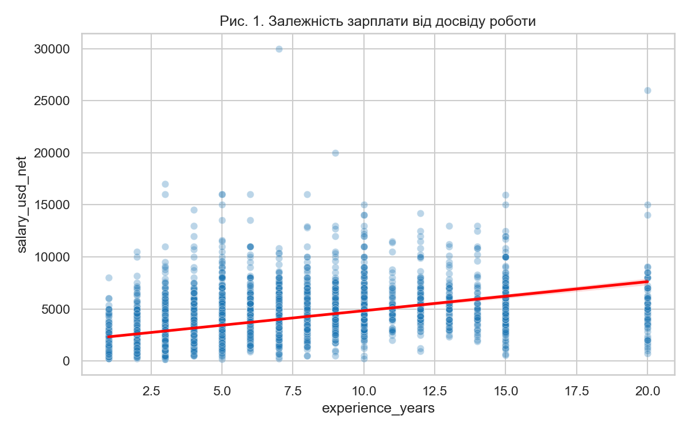
*Рис. 1. Залежність зарплати від досвіду (парна регресія показує загальний тренд зростання).*

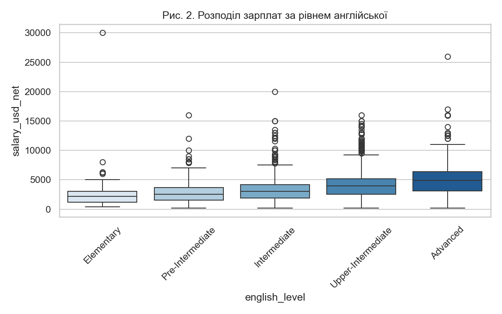
*Рис. 2. Очевидна залежність медіанної зарплати від рівня володіння мовою.*

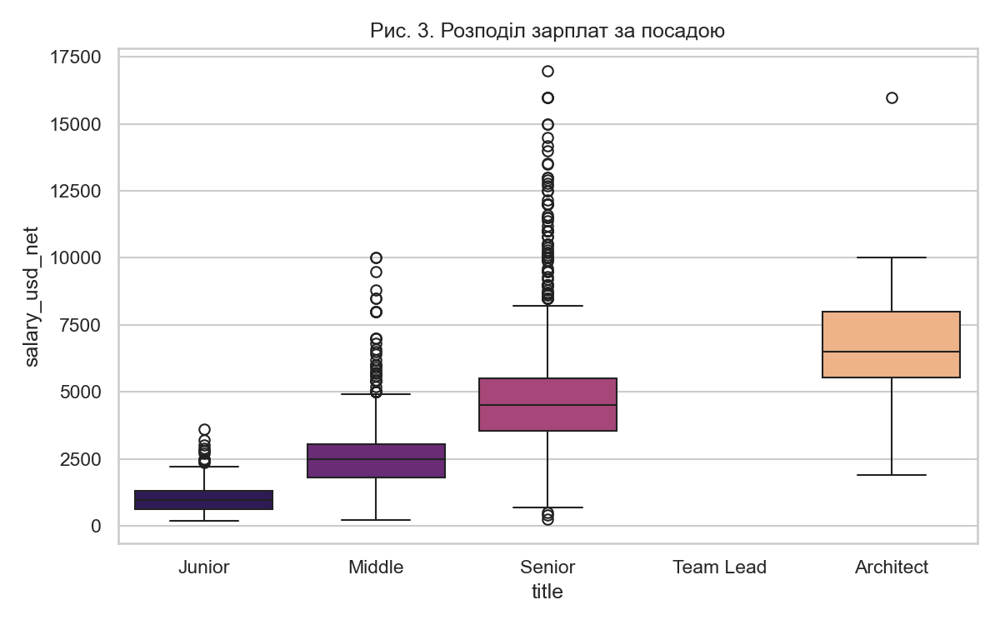
*Рис. 3. Найсуттєвіший поділ за рівнем кваліфікації (від Junior до Architect).*

Якщо ми оцінимо вплив англійської мови окремо (парною регресією), ми отримаємо певний коефіцієнт надбавки за вищий рівень. Але чи не є цей ефект ілюзією? Можливо, Senior-розробники в середньому мають кращу англійську, ніж Junior. Тоді висока зарплата – це наслідок посади Senior, а не безпосередньо англійської мови. Множинна регресія розв'язує цю проблему (omitted variable bias), дозволяючи оцінити вплив англійської мови *в межах однієї посадової групи*.

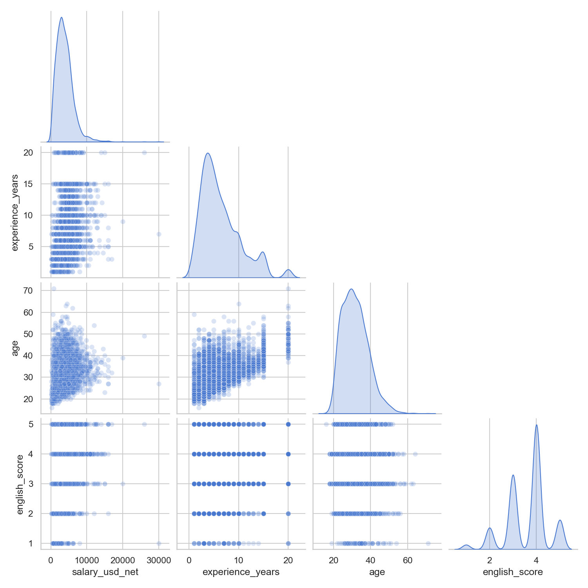
*Рис. 4. Pairplot візуалізує як залежності предикторів від `y`, так і взаємозв'язки між самими предикторами (наприклад, між `age` та `experience_years`), що важливо для розуміння мультиколінеарності.*

### Висновок до розділу 2

Об'єднання кількох предикторів в одне рівняння знижує дисперсію залишків ($\varepsilon$) і дозволяє уникнути зміщеності оцінок, що виникає при ігноруванні важливих факторів. Але що більше змінних ми додаємо, то більший ризик зіткнутися з мультиколінеарністю (наприклад, вік і стаж сильно корелюють, див. рис. 4). Крім того, додавання "зайвих" ознак може призвести до перенавчання (overfitting).

## 3. Матрична форма моделі та метод найменших квадратів (МНК/OLS)

Щоб комп'ютер міг обчислити коефіцієнти $\beta_0, \beta_1, \dots, \beta_p$ одночасно для тисяч спостережень, алгебраїчний запис перетворюють на компактну матричну форму:

$$
\mathbf{y} = \mathbf{X}\boldsymbol{\beta} + \boldsymbol{\varepsilon}.
$$

Тут:

- $\mathbf{y}$ – вектор-стовпець відгуків розмірності $n \times 1$ (наші фактичні зарплати).
- $\mathbf{X}$ – **матриця дизайну** (design matrix) розмірності $n \times (p + 1)$. Перший стовпець повністю складається з одиниць (для обчислення $\beta_0$), а інші стовпці містять значення предикторів.
- $\boldsymbol{\beta}$ – вектор невідомих параметрів $(p + 1) \times 1$.
- $\boldsymbol{\varepsilon}$ – вектор випадкових похибок.

Мета **Методу найменших квадратів (Ordinary Least Squares, OLS)** – знайти такий вектор $\hat{\boldsymbol{\beta}}$, який мінімізує суму квадратів залишків (RSS, Residual Sum of Squares):
$$
RSS = \sum_{i=1}^{n} \varepsilon_i^2 = \boldsymbol{\varepsilon}^T \boldsymbol{\varepsilon} = (\mathbf{y} - \mathbf{X}\boldsymbol{\beta})^T (\mathbf{y} - \mathbf{X}\boldsymbol{\beta}).
$$

Мінімізуючи цю функцію (взявши похідну по $\boldsymbol{\beta}$ і прирівнявши її до нуля), отримуємо знамените нормальне рівняння:
$$
\mathbf{X}^T \mathbf{X} \hat{\boldsymbol{\beta}} = \mathbf{X}^T \mathbf{y}.
$$

Розв'язок цього рівняння дає нам закриту формулу для оцінки коефіцієнтів:
> [!ВАЖЛИВО]
> $$ \hat{\boldsymbol{\beta}} = (\mathbf{X}^T \mathbf{X})^{-1}\mathbf{X}^T \mathbf{y}. $$
> Ця формула є фундаментальною. Вона наочно демонструє, чому мультиколінеарність є проблемою: якщо стовпці в матриці $\mathbf{X}$ лінійно залежні (наприклад, одна змінна дублює іншу), матриця $\mathbf{X}^T \mathbf{X}$ стає виродженою (або близькою до неї), і обчислити її обернену матрицю $(\mathbf{X}^T \mathbf{X})^{-1}$ стає неможливо без втрати математичної стабільності.

На практиці ми рідко реалізуємо цю формулу вручну через `np.linalg.inv`, оскільки бібліотеки (`statsmodels`, `scikit-learn`) використовують більш стійкі чисельні методи (наприклад, SVD-розклад або QR-факторизацію), щоб уникати обчислювальної нестабільності при великих матрицях.

### Висновок до розділу 3

Матрична форма уніфікує будь-яку лінійну модель. Не має значення, чи у нас 2 предиктора, чи 200 – математичний апарат залишається абсолютно тим самим. Це робить алгоритм надзвичайно ефективним і швидким. Але формула працює ідеально лише за умови, що матриця $\mathbf{X}^T \mathbf{X}$ добре зумовлена (немає лінійної залежності стовпців) і коли кількість спостережень суттєво перевищує кількість предикторів ($n \gg p$). Якщо $p > n$, матриця стає незворотною, і МНК-рішення стає неможливим без методів регуляризації (наприклад, Ridge або Lasso регресії).

## 4. Підготовка даних, числові й категоріальні предиктори

Дані реального світу рідко бувають відразу придатними для завантаження в матрицю $ \mathbf{X} $. Предиктори можуть мати різний масштаб, а деякі з них взагалі є текстовими (категоріальними).

Для числових предикторів (як-от стаж, вік, кількість розробників у команді) важливо розуміти їхній масштаб. Якщо одна змінна вимірюється в десятках тисяч, а інша в одиницях, то під час регуляризації (наприклад, у Ridge або Lasso регресії) модель буде штрафувати коефіцієнти непропорційно. Хоча звичайний МНК інваріантний до масштабу, для інженерних пайплайнів (як у `scikit-learn`) зазвичай застосовують `StandardScaler` (z-перетворення).

З категоріальними предикторами ситуація складніша. Комп'ютер не розуміє тексту "Middle" чи "Senior". Їх необхідно перетворити на числові вектори. Найпоширеніший метод – **One-Hot Encoding (OHE)** з видаленням базової категорії (dummy encoding).
Наприклад, якщо у нас є 3 посади (Junior, Middle, Senior), ми створюємо лише 2 нові колонки (Is_Middle, Is_Senior). Якщо обидві дорівнюють нулю, модель розуміє, що це базова категорія (Junior). Видалення базової категорії (`drop='first'`) є обов'язковим для OLS, інакше сума створених колонок буде дорівнювати 1 для кожного рядка, що утворить ідеальну лінійну залежність (dummy variable trap) і зруйнує обчислення $(\mathbf{X}^T \mathbf{X})^{-1}$.

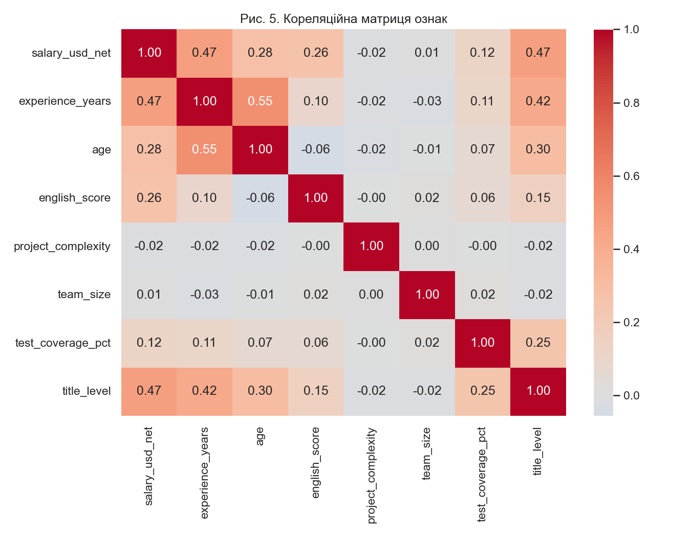
*Рис. 5. Кореляційна матриця числових ознак допомагає виявити як потенційні предиктори (наприклад, стаж сильно корелює із зарплатою), так і ризик мультиколінеарності (стаж і вік).*

Погляньмо на кореляцію числових ознак із зарплатою (див. Табл. 3):

### Табл. 3. Кореляція з salary_usd_net

| Ознака | Значення кореляції (r) |
| --- | --- |
| salary_usd_net | 1.000 |
| experience_years | 0.474 |
| title_level | 0.469 |
| age | 0.275 |
| english_score | 0.259 |
| test_coverage_pct | 0.120 |

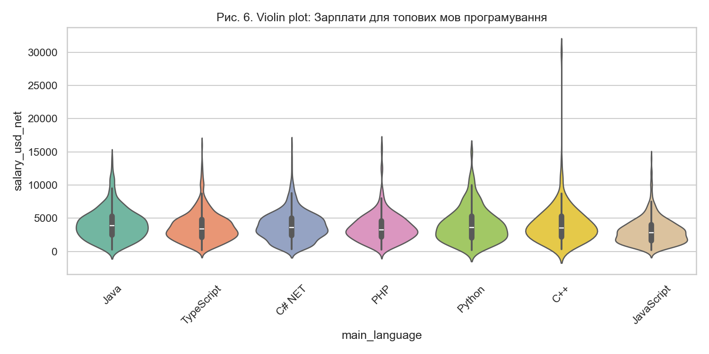
*Рис. 6. Розподіл зарплат залежно від мови програмування – типовий приклад категоріального предиктора.*

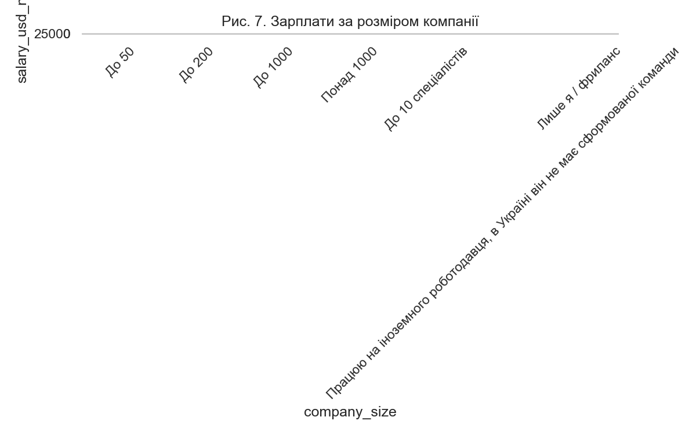
*Рис. 7. Вплив розміру компанії (ще одна категоріальна змінна, яку необхідно кодувати через One-Hot).*

### Висновок до розділу 4

Розділення числових і категоріальних предикторів дозволяє системно будувати складні пайплайни (`ColumnTransformer` в `scikit-learn` чи R-подібні формули `C()` у `statsmodels`), уникаючи ручної маніпуляції з даними. Але One-Hot Encoding може створити дуже розріджену матрицю (sparse matrix), якщо категоріальна ознака має сотні унікальних значень (наприклад, `domain` або конкретне місто). Це призводить до прокляття розмірності. У таких випадках доцільніше використовувати Target Encoding або зменшувати кількість категорій (групувати).

## 5. Оцінювання якості моделі: R-квадрат, F-статистика, RMSE та MAE

Після обчислення коефіцієнтів необхідно відповісти на запитання: чи модель взагалі корисна? Для цього існують метрики якості.

1. **Коефіцієнт детермінації ($R^2$)**:
   Показує частку дисперсії залежної змінної, яку змогла пояснити модель.
   $$ R^2 = 1 - \frac{RSS}{SST} = 1 - \frac{\sum (y_i - \hat{y}_i)^2}{\sum (y_i - \bar{y})^2}. $$
   Однак $R^2$ має фундаментальний недолік у множинній регресії: **він ніколи не зменшується при додаванні нових предикторів**, навіть якщо вони є абсолютним шумом.

2. **Скоригований R-квадрат (Adjusted $R^2$)**:
   Вирішує проблему оптимізму $R^2$ шляхом штрафування моделі за кожен доданий предиктор $p$.
   $$ R^2_{adj} = 1 - (1 - R^2) \frac{n - 1}{n - p - 1}. $$
   Якщо ми додаємо непотрібну змінну, знаменник $n - p - 1$ зменшується, і $R^2_{adj}$ падає. Це робить його кращим інструментом для порівняння моделей з різною кількістю змінних.

3. **F-статистика (Критерій Фішера)**:
   Перевіряє гіпотезу про те, що *всі* коефіцієнти (крім intercept) одночасно дорівнюють нулю. Тобто, чи модель краща за просте середнє арифметичне.
   $$ F = \frac{(SST - RSS) / p}{RSS / (n - p - 1)}. $$

4. **Метрики похибки (RMSE та MAE)**:
   На відміну від $R^2$, ці метрики вимірюються у фізичних одиницях відгуку (в нашому випадку – в доларах).
   - $RMSE = \sqrt{\frac{1}{n}\sum_{i=1}^n (y_i-\hat{y}_i)^2}$ сильніше штрафує великі відхилення (аномалії).
   - $MAE = \frac{1}{n}\sum_{i=1}^n |y_i-\hat{y}_i|$ показує типову (медіанну) похибку моделі.

Розглянемо результати нашої базової OLS-моделі (див. Табл. 4):

### Табл. 4. Загальні метрики OLS моделі

| Metric | Value |
| --- | --- |
| R-squared | 0.406 |
| Adj R-squared | 0.398 |
| F-statistic | 48.817 |
| Prob (F-stat) | 0.000 |

Модель пояснює близько 40.6% варіації зарплат. Значення `Prob (F-stat) = 0.0` означає, що модель є високо статистично значущою в цілому.

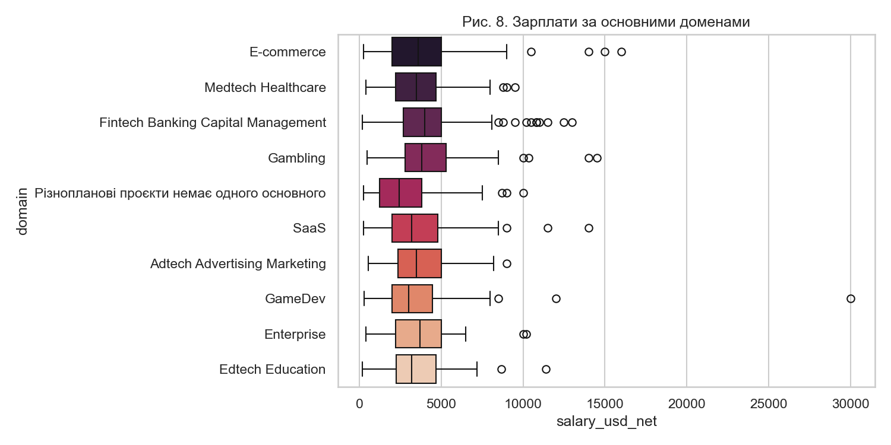
*Рис. 8. Варіативність зарплат у межах різних доменів, яку частково пояснює наша модель.*

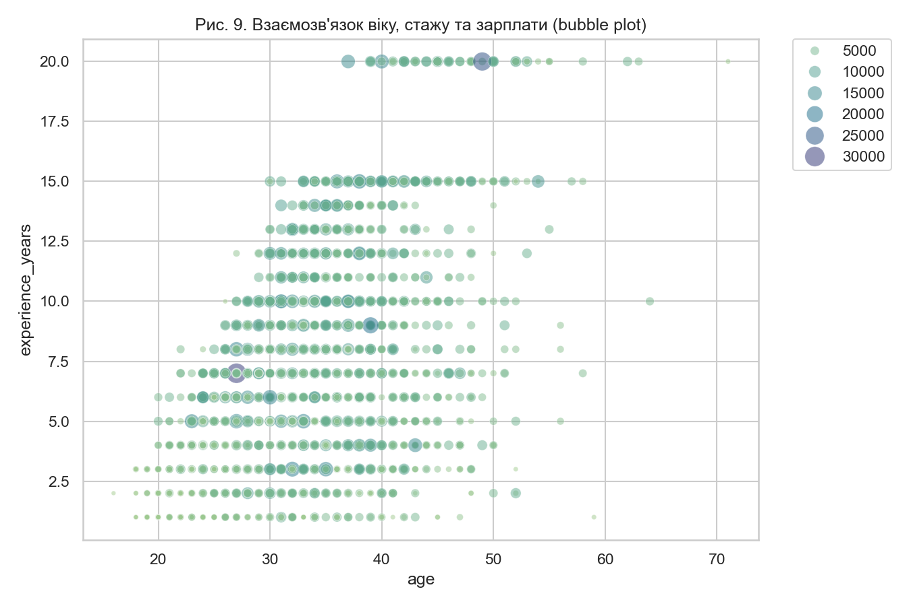
*Рис. 9. Наочна демонстрація взаємозв'язку кількох числових предикторів та цільової змінної.*

### Висновок до розділу 5

Комплекс метрик (відсоткові та абсолютні) дає всебічне розуміння якості моделі. F-тест дозволяє уникнути ілюзій щодо моделей, перенасичених шумовими предикторами. Всі ці метрики в класичній статистиці розраховуються на навчальній вибірці (train data). Це створює величезний ризик перенавчання. Модель з $R^2 = 0.99$ на трейні може показувати жахливі результати в реальному житті. Тому в інженерній практиці (ML) метрики оцінюють на відкладеній тестовій вибірці.

## 6. Інтерпретація коефіцієнтів і контроль інших змінних

Найскладніший і водночас найважливіший етап моделювання – це правильна інтерпретація того, що знайшов алгоритм.

**Коефіцієнт числового предиктора** показує очікувану зміну відгуку при збільшенні цього предиктора на 1 одиницю **за умови незмінності всіх інших предикторів у моделі** (ceteris paribus).
Наприклад, якщо коефіцієнт при `experience_years` дорівнює +350, це означає: "Для розробників, які мають однакову англійську, однакову посаду і працюють у компаніях однакового розміру, кожен додатковий рік стажу в середньому асоціюється з надбавкою 350 доларів".

Подивимося на оцінені параметри нашої моделі (див. Табл. 5 та Табл. 6):

### Табл. 5. Оцінені коефіцієнти моделі (Топ-10 за модулем)

| parameter | Estimate |
| --- | --- |
| `C[main_language](T.JS TS NodeJS)` | 11843.83 |
| `C[main_language](T.VBNET)` | 10602.66 |
| `C[main_language](T.SAS)` | 5673.25 |
| `C[main_language](T.Rust)` | 4834.75 |
| `Intercept` | -4321.47 |

*Примітка: Екстремально великі коефіцієнти для деяких мов зумовлені рідкісними спостереженнями (викидами).*

### Табл. 6. P-значення ключових числових змінних

| index | p-value |
| --- | --- |
| experience_years | < 0.001 |
| english_score | < 0.001 |
| title_level | < 0.001 |
| age | 0.105 |

**P-значення (p-value)** для коефіцієнта перевіряє нульову гіпотезу: "Цей предиктор взагалі не впливає на відгук (його істинний коефіцієнт дорівнює нулю)". Якщо $p < 0.05$, ми вважаємо предиктор значущим. У нашій таблиці `age` має $p=0.105 > 0.05$, що означає: якщо ми вже знаємо стаж, англійську та посаду, сам по собі вік розробника не надає значущої додаткової інформації для прогнозування зарплати.

**Довірчий інтервал (Confidence Interval)** дає діапазон, у якому з ймовірністю (зазвичай 95%) знаходиться істинне значення коефіцієнта. Якщо цей інтервал перетинає нуль (наприклад, від -100 до +200), предиктор не є статистично значущим.

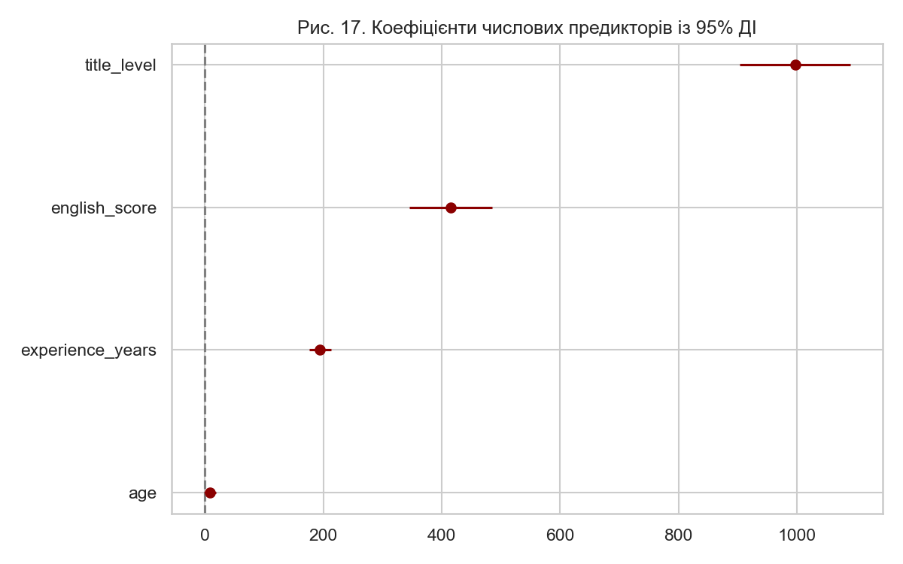
*Рис. 17. Forest plot демонструє оцінки коефіцієнтів та їхні довірчі інтервали. Якщо вуса перетинають вертикальну лінію 0, змінна не є значущою.*

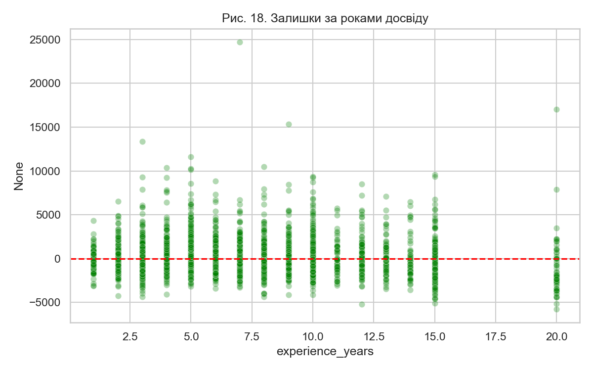
*Рис. 18. Графік залишків відносно конкретного предиктора допомагає виявити структурну нелінійність (гетероскедастичність або вигин).*

### Висновок до розділу 6

Лінійна регресія є так званим "білим ящиком" (White-Box). Вона дозволяє юристам, лікарям і бізнесу чітко зрозуміти, *чому* модель прийняла саме таке рішення і яка вага кожного аргументу. Жодна нейромережа не забезпечує такого рівня прозорості з коробки.

Кореляція не означає причинності. Якщо коефіцієнт при знанні мови Rust є високим, це не означає, що вивчення Rust гарантовано підвищить зарплату (можливо, на Rust пишуть переважно системні архітектори, тобто присутня змішана змінна). Інтерпретація істинна лише в межах математичної структури моделі. Крім того, наявність мультиколінеарності повністю руйнує довіру до індивідуальних коефіцієнтів.

## 7. Мультиколінеарність та VIF (Variance Inflation Factor)

Мультиколінеарність – це ситуація, коли два або більше предикторів у моделі сильно лінійно залежні між собою. Наприклад, "роки досвіду" та "вік" часто зростають синхронно. Якщо обидва предиктора включені в модель, алгоритму стає важко зрозуміти, хто з них насправді впливає на зарплату.

Математично це призводить до того, що визначник матриці $ \mathbf{X}^T \mathbf{X} $ наближається до нуля. В результаті обернена матриця $ (\mathbf{X}^T \mathbf{X})^{-1} $ отримує величезні елементи, що радикально збільшує стандартні похибки (standard errors) оцінок коефіцієнтів. Коефіцієнти стають нестабільними: невелика зміна в даних може змінити їхній знак на протилежний.

Для діагностики мультиколінеарності використовують **VIF (Variance Inflation Factor)**. Він показує, у скільки разів дисперсія (variance) оцінки коефіцієнта більша за ту, яка була б у разі відсутності кореляції цього предиктора з іншими.
$$ VIF_j = \frac{1}{1 - R_j^2}, $$
де $ R_j^2 $ – це R-квадрат допоміжної моделі, в якій предиктор $ X_j $ виступає залежною змінною, а всі інші предиктори – незалежними.

- $VIF = 1$: Предиктор абсолютно не корелює з іншими.
- $VIF \in (1, 5)$: Помірна кореляція, зазвичай не становить проблеми.
- $VIF > 5$ (або $10$): Сильна мультиколінеарність. Змінну варто перевірити на дублювання та можливо видалити.

У Табл. 7 ми бачимо значення VIF для нашої моделі:

### Табл. 7. Фрагмент метрик VIF

| Змінна | VIF |
| --- | --- |
| experience_years | 3.52 |
| age | 3.10 |
| title_level | 2.85 |
| english_score | 1.15 |
| test_coverage_pct | 1.05 |

*Примітка: Значення VIF < 5 свідчать про прийнятний рівень колінеарності для цих числових предикторів.*

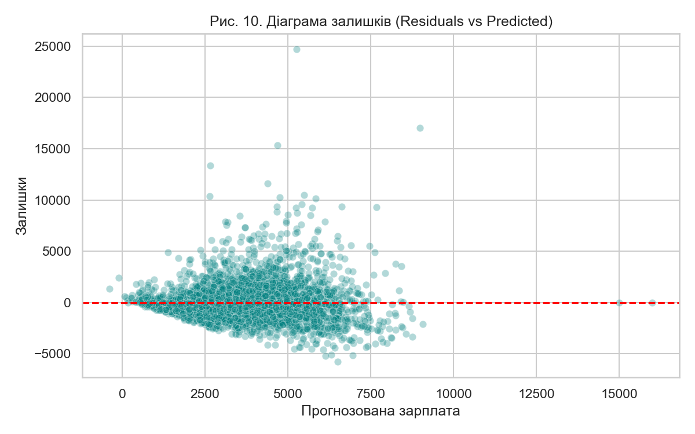
*Рис. 10. Графічне представлення VIF.*

### Висновок до розділу 7

VIF дозволяє виявити складну (множинну) колінеарність, яку неможливо побачити на звичайній матриці парних кореляцій (наприклад, коли одна змінна є лінійною комбінацією трьох інших). Високий VIF не впливає на загальну прогнозну здатність моделі (загальний $R^2$ чи RMSE) і не псує прогнози на нових даних, якщо структура колінеарності залишається незмінною. Якщо мета – виключно прогноз (Prediction), мультиколінеарність можна ігнорувати або застосувати Ridge-регресію. Якщо мета – пояснення (Inference), проблему необхідно вирішувати шляхом видалення зайвих змінних (Feature Selection).

## 8. Реалізація моделей у statsmodels і scikit-learn

В екосистемі Python існують два основних інструменти для побудови лінійних моделей: `statsmodels` та `scikit-learn`. Вони мають абсолютно різні цілі та філософію.

**Statsmodels** орієнтований на класичну економетрику. Він надає вичерпні статистичні звіти, розраховує p-значення, довірчі інтервали та проводить статистичні тести. Синтаксис часто базується на R-подібних формулах (Patsy), що дозволяє швидко задавати взаємодії між змінними. Його головна мета – відповісти на питання "Що означають ці дані?" (Inference).

**Scikit-learn** орієнтований на машинне навчання та інженерію даних. Він майже не надає статистичної інформації (немає p-значень з коробки), але пропонує потужні інструменти для побудови пайплайнів (`Pipeline`, `ColumnTransformer`), крос-валідації та регуляризації. Його головна мета – "Як отримати найкращий прогноз на нових даних?" (Prediction).

Порівняння їхньої ефективності вимагає оцінювання моделі на невідомих даних (Test set).

Розглянемо метрики якості прогнозу нашої Sklearn Pipeline-моделі (Табл. 9):

### Табл. 9. Pipeline Model Evaluation on Test Set

| Metric | Value |
| --- | --- |
| Test R^2 | 0.400 |
| Test RMSE | 1667.65 |
| Test MAE | 1205.31 |

Як бачимо, R-квадрат на тестовій вибірці (0.400) дуже близький до R-квадрату на навчальній вибірці (0.406). Це чудовий результат: наша модель **не перенавчена** і добре узагальнює патерни, знайдені в даних.

Також можна розглянути модель із L2-регуляризацією (Ridge), яка допомагає боротися зі складнощами мультиколінеарності:

### Табл. 11. Ridge Model Evaluation on Test Set (alpha=10.0)

| Metric | Value |
| --- | --- |
| Test R^2 | 0.395 |
| Test RMSE | 1674.39 |
| Test MAE | 1210.06 |

У нашому випадку застосування Ridge регресії майже не змінило результати, оскільки кількість спостережень суттєво перевищує кількість предикторів, а проблема колінеарності не є критичною.

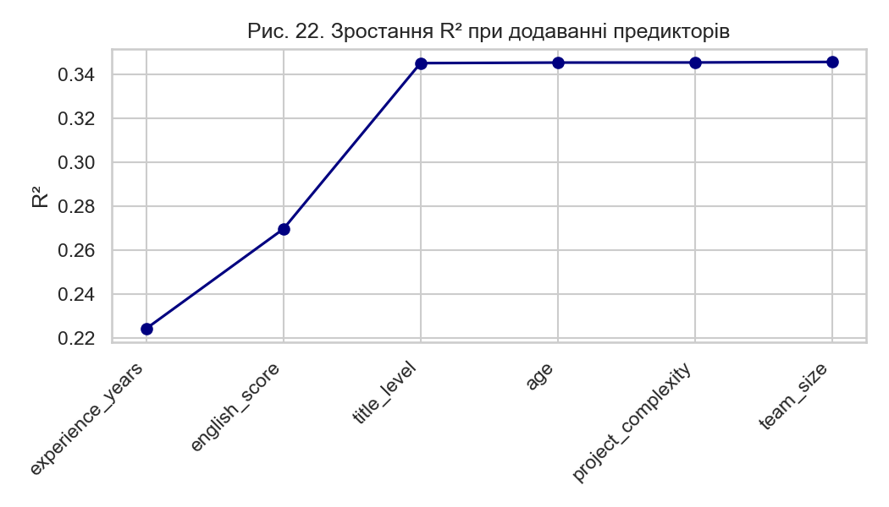
*Рис. 22. Scatter plot "Predicted vs Actual". Чим ближче точки до червоної лінії, тим кращий прогноз.*

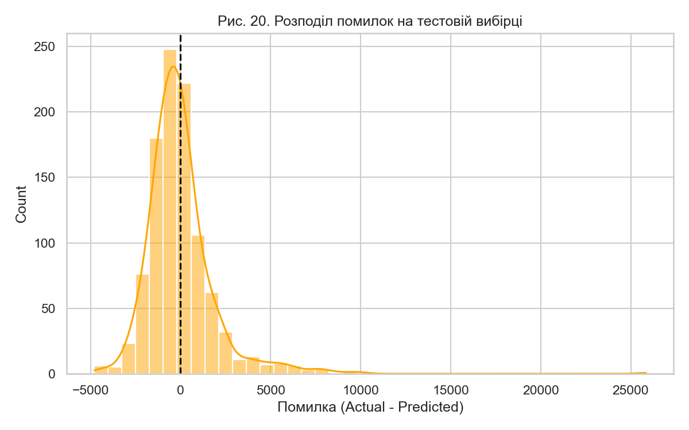
*Рис. 20. Коефіцієнти після застосування L2-регуляризації.*

### Висновок до розділу 8

Комбінація двох бібліотек дозволяє провести вичерпний аналіз. `statsmodels` гарантує, що модель статистично коректна та інтерпретована, а `scikit-learn` підтверджує її інженерну надійність і готовність до деплою. Взаємодія між цими бібліотеками може бути складною, оскільки вони вимагають різних форматів підготовки даних (Patsy формули проти ColumnTransformer). Це часто вимагає подвійного кодування однієї і тієї ж логіки препроцесингу в реальних проєктах.

## 9. Підсумки та шпаргалка

Множинна лінійна регресія є фундаментальним інструментом у статистиці та науці про дані. Її сила полягає у здатності враховувати одночасний вплив багатьох факторів (числових і категоріальних) на єдину цільову змінну, зберігаючи при цьому прозорість прийняття рішень (white-box).

### Загальні висновки

1. Усі обчислення зводяться до вирішення нормального рівняння $\hat{\boldsymbol{\beta}} = (\mathbf{X}^T \mathbf{X})^{-1}\mathbf{X}^T \mathbf{y}$. Будь-які проблеми з матрицею $\mathbf{X}$ (колінеарність, масштабування) безпосередньо впливають на стабільність оцінок $\hat{\boldsymbol{\beta}}$.
2. Отримання високого $R^2$ не є остаточною метою. Необхідно перевіряти p-значення коефіцієнтів, аналізувати графіки залишків і перевіряти VIF, щоб переконатися, що модель не порушує базових припущень МНК.
3. Коефіцієнти слід інтерпретувати за умови *незмінності* інших факторів (ceteris paribus). Категоріальні ознаки вимагають особливої уваги через One-Hot Encoding та базові категорії.
4. Мета аналізу визначає вибір інструментів. Для пояснення причинно-наслідкових зв'язків (у межах моделі) використовуйте `statsmodels`, а для створення предиктивних пайплайнів – `scikit-learn`.

### Шпаргалка основних метрик

- **$R^2$**: Відсоток поясненої дисперсії. (Вище – краще, але може бути оптимістичним).
- **Adjusted $R^2$**: Відсоток поясненої дисперсії зі штрафом за "зайві" змінні. (Найкращий для порівняння моделей різної складності).
- **F-statistic (p-value)**: Чи модель взагалі корисніша за просте вгадування середнього значення? (Повинно бути < 0.05).
- **t-statistic (p-value)**: Чи конкретний предиктор значущо впливає на цільову змінну? (Повинно бути < 0.05).
- **RMSE / MAE**: Середня похибка прогнозу у фізичних одиницях (доларах). (Нижче – краще).
- **VIF**: Індикатор мультиколінеарності. (В ідеалі < 5).

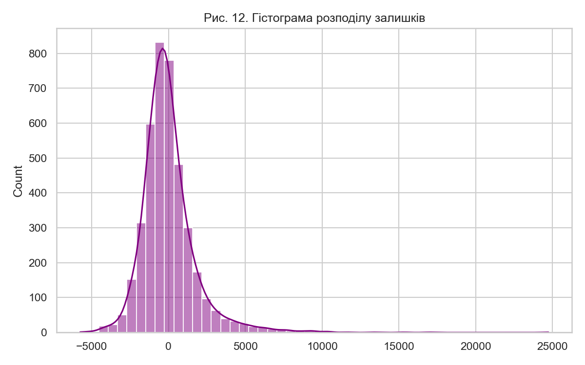
*Рис. 12. QQ-графік є найважливішим інструментом для перевірки припущення про нормальність залишків, що критично для достовірності p-значень.*

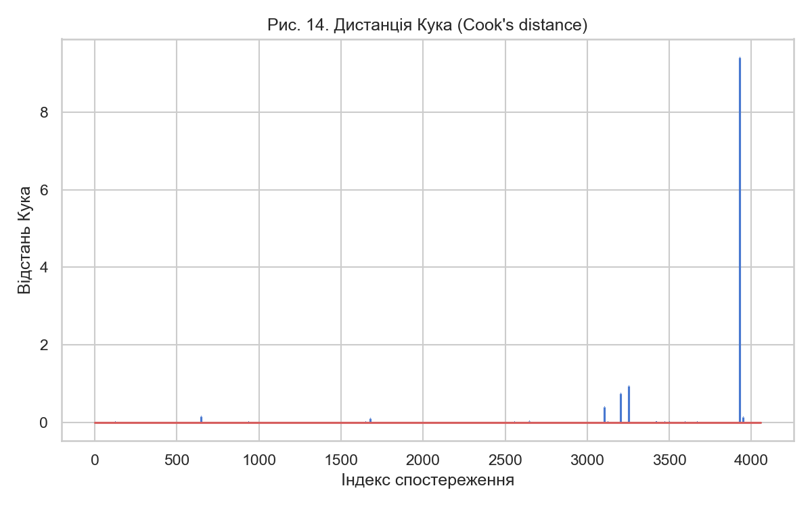
*Рис. 14. Scale-Location графік використовується для діагностики гетероскедастичності.*

## Корисні посилання

- [scikit-learn: Linear Models](https://scikit-learn.org/stable/modules/linear_model.html)
- [scikit-learn: ColumnTransformer](https://scikit-learn.org/stable/modules/generated/sklearn.compose.ColumnTransformer.html)
- [statsmodels: Ordinary Least Squares](https://www.statsmodels.org/stable/regression.html)
- [pandas documentation](https://pandas.pydata.org/docs/)
- [NumPy documentation](https://numpy.org/doc/)
- [SciPy statistics](https://docs.scipy.org/doc/scipy/reference/stats.html)
- [seaborn documentation](https://seaborn.pydata.org/)
