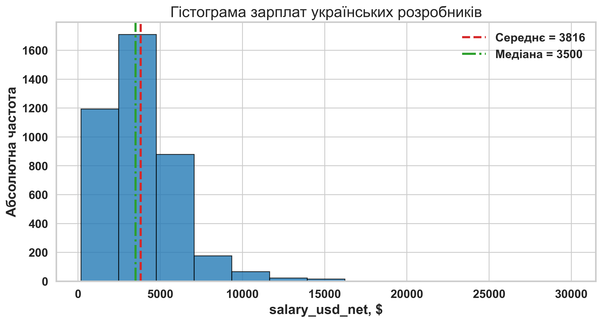
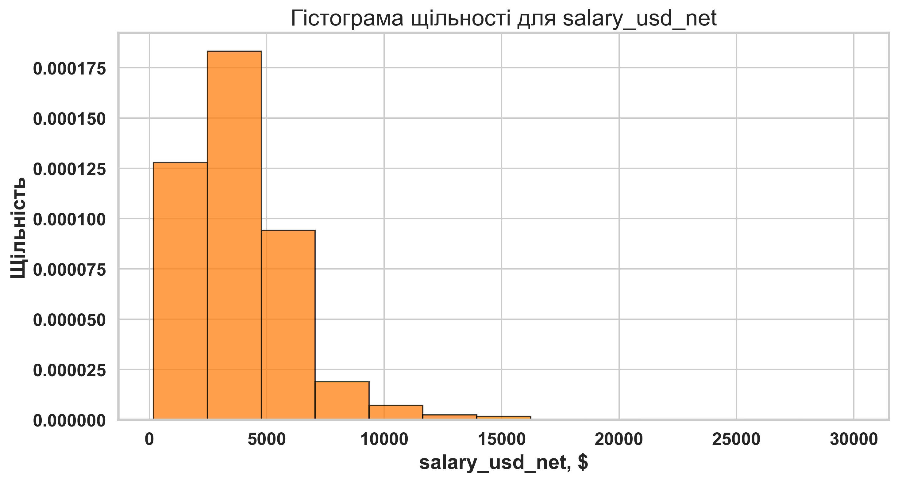
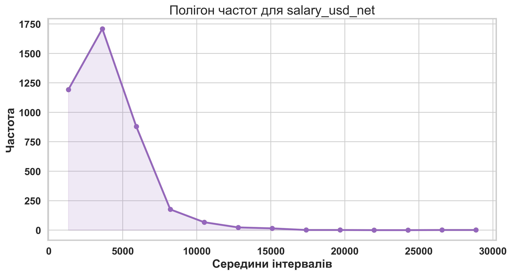
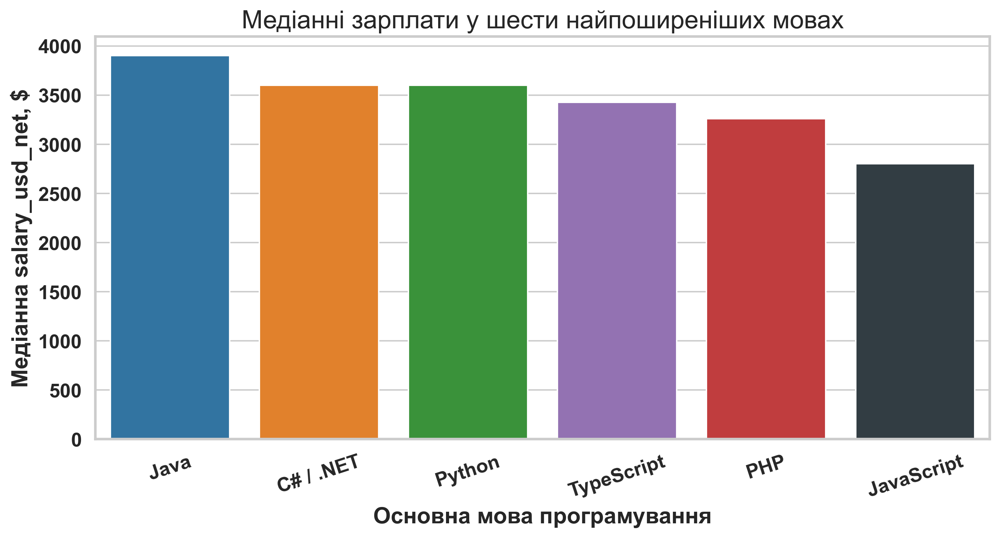
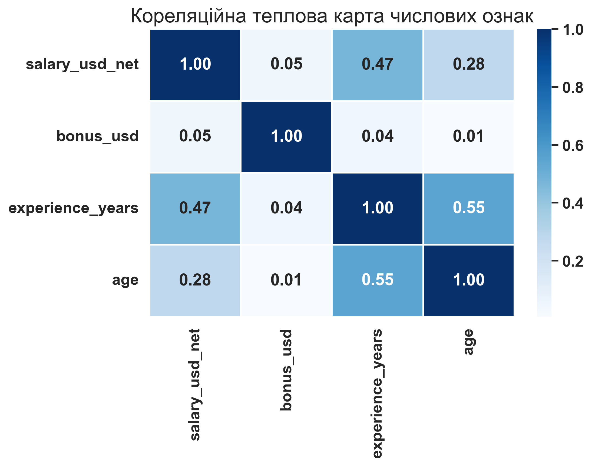

# Лабораторна робота 2. Візуалізація даних – гістограми, полігони, діаграми, теплові карти

**Тема:** *Описова статистика та візуалізація даних*

**Мета:** *Навчитися очищати реальний CSV-набір, будувати гістограми, полігони частот, порівняльні діаграми та кореляційні теплові карти, а також формулювати строгі аналітичні висновки на основі візуального дослідження даних.*

---

## Контрольний приклад: Візуалізація зарплат українських розробників за даними DOU, зима 2026

### Постановка задачі

Нехай потрібно підготувати стислий, але змістовно повний візуальний огляд зарплат українських розробників за зимовою хвилею опитування DOU. Як змістовий орієнтир використаємо статтю DOU [12 січня 2026 року](https://dou.ua/lenta/articles/salary-report-devs-winter-2026/) «Зарплати українських розробників — зима 2026», а як локальне джерело даних — файл `04_data/2025_dec_raw.csv`.

У контрольному прикладі працюємо лише з підвибіркою респондентів, для яких категорія відповідає `Software Engineer / Developer`, а значення поля країни дорівнює «В Україні». Після технічного очищення одержуємо **4066** спостережень. Це менше, ніж **4356** відповідей розробників в Україні, згаданих у статті DOU, тому числові результати локальної лабораторної не мають дослівно відтворювати опубліковані медіани. Причина полягає в тому, що локальний CSV є сирішим технічним експортом і вимагає власного етапу нормалізації.

### Вхідні дані для аналізу

Для практичної роботи перейменуємо ключові поля так, щоб подальший код був стислим і прозорим: `salary_usd_net`, `bonus_usd`, `title`, `domain`, `specialization`, `main_language`, `company_size`, `experience_years`, `english_level`, `age`, `country`.

Нижче подано фрагмент уже очищеної навчальної таблиці.

| main_language | title | specialization | experience_years | salary_usd_net | bonus_usd | company_size |
| :--- | :--- | :--- | :--- | :--- | :--- | :--- |
| C# / .NET | Junior | Back-end розробка | 2 | 1300 | 0 | Понад 1000 |
| Java | Senior | Back-end розробка | 10 | 7000 | 0 | До 1000 |
| JavaScript | Senior | Front-end розробка | 5 | 7000 | 0 | До 1000 |
| Kotlin | Senior | Mobile розробка | 7 | 2000 | 0 | До 200 |
| PHP | Consultant / External Expert | Back-end розробка | 13 | 6900 | 0 | Працюю на іноземного роботодавця, в Україні він не має сформованої команди |
| Python | Senior | Back-end розробка | 9 | 6100 | 0 | До 1000 |
| Ruby | Senior | Full Stack розробка | 15 | 5600 | 0 | До 10 спеціалістів |
| TypeScript | Middle | Full Stack розробка | 5 | 1100 | 0 | До 200 |

Також сформуємо зведену таблицю основних описових характеристик змінної `salary_usd_net`.

| Показник | Значення |
| :--- | :--- |
| Кількість спостережень | 4066 |
| Середня salary_usd_net | 3815.95 |
| Медіанна salary_usd_net | 3500 |
| Стандартне відхилення salary_usd_net | 2354.12 |
| Перший квартиль Q1 | 2200 |
| Третій квартиль Q3 | 5000 |

### Покрокове виконання аналізу

**Крок 1.1. Підготуємо та очистимо дані**

Спершу зчитаємо сирий CSV, очистимо грошові значення від розділювачів тисяч, вилучимо числову складову зі стажу, а потім звузимо масив до українських розробників. Така підготовка потрібна для того, щоб усі наступні графіки працювали вже з однорідною підвибіркою.

```python
import re
import pandas as pd

raw = pd.read_csv("04_data/2025_dec_raw.csv", encoding="utf-8-sig")

def parse_money(value):
    text = str(value).replace(",", "").strip()
    return pd.to_numeric(text, errors="coerce")

def parse_experience(value):
    match = re.search(r"\d+", str(value))
    return int(match.group()) if match else pd.NA

df = pd.DataFrame(
    {
        "salary_usd_net": raw.iloc[:, 2].map(parse_money),
        "bonus_usd": raw.iloc[:, 3].map(parse_money),
        "title": raw.iloc[:, 4],
        "domain": raw.iloc[:, 7],
        "specialization": raw.iloc[:, 8],
        "main_language": raw.iloc[:, 10],
        "company_size": raw.iloc[:, 12],
        "experience_years": raw.iloc[:, 13].map(parse_experience),
        "english_level": raw.iloc[:, 14],
        "age": pd.to_numeric(raw.iloc[:, 16], errors="coerce"),
        "country": raw.iloc[:, 17],
    }
)

mask = raw.iloc[:, 5].fillna("").str.contains("Software Engineer / Developer", regex=False)
mask &= raw.iloc[:, 17].fillna("").eq("В Україні")

df = df.loc[mask].dropna(subset=["salary_usd_net", "experience_years", "age"]).copy()
print(df.shape)
```

**Результат очищення:** після фільтрації маємо **4066** рядки. Для локальної підвибірки медіанна зарплата становить **3500.00 $**, тоді як у статті DOU для ширшого аналітичного зрізу наведено медіану **3450 $**.

**Крок 1.2. Побудуємо гістограму абсолютних частот і гістограму щільності**

Для кількісної змінної `salary_usd_net` побудуємо два споріднені графіки. Перший показує абсолютні частоти, другий — нормовану щільність. Для гістограми щільності виконується умова

$$
\sum_{j=1}^{m} h_j \cdot \Delta_j = 1,
$$

де $h_j$ — висота $j$-го стовпчика, а $\Delta_j$ — ширина відповідного інтервалу.

У цьому прикладі використаємо **13** інтервалів. Це дає графіку достатню деталізацію, але не робить його надмірно роздрібненим.

```python
import matplotlib.pyplot as plt
import numpy as np

bins = 13
salary = df["salary_usd_net"]

mean_salary = salary.mean()
median_salary = salary.median()

plt.hist(salary, bins=bins, color="#1f77b4", edgecolor="black", alpha=0.78)
plt.axvline(mean_salary, color="#d62728", linestyle="--", linewidth=2, label=f"mean = {mean_salary:.0f}")
plt.axvline(median_salary, color="#2ca02c", linestyle="-.", linewidth=2, label=f"median = {median_salary:.0f}")
plt.legend()
plt.show()

density_counts, density_edges = np.histogram(salary, bins=bins, density=True)
total_area = np.sum(density_counts * np.diff(density_edges))
print(round(total_area, 5))
```





**Проміжний висновок:** локальний розподіл є правосторонньо асиметричним: середнє **3815.95 $** перевищує медіану **3500.00 $**, що узгоджується з наявністю довгого правого хвоста високих компенсацій.

**Крок 1.3. Побудуємо полігон частот та порівняльну діаграму для топових мов**

Полігон частот будується через середини тих самих інтервалів, що й гістограма. Для середини $j$-го інтервалу використовуємо формулу

$$
m_j = \frac{a_j + b_j}{2},
$$

де $a_j$ та $b_j$ — ліва й права межі інтервалу.

Окремо побудуємо стовпчикову діаграму медіанної зарплати для шести найпоширеніших мов програмування у локальній вибірці. Це дозволяє перейти від форми загального розподілу до контрольованого порівняння кількох груп.

```python
hist_counts, hist_edges = np.histogram(df["salary_usd_net"], bins=bins)
hist_mids = (hist_edges[:-1] + hist_edges[1:]) / 2

language_summary = (
    df[df["main_language"].isin(df["main_language"].value_counts().head(6).index)]
    .groupby("main_language")
    .agg(
        median_salary_usd=("salary_usd_net", "median"),
        respondents=("salary_usd_net", "size"),
    )
    .sort_values("median_salary_usd", ascending=False)
    .reset_index()
)
print(language_summary)
```





Зведену таблицю для цього етапу подано нижче.

| main_language | median_salary_usd | respondents |
| :--- | :--- | :--- |
| Java | 3900 | 436 |
| C# / .NET | 3600 | 554 |
| Python | 3600 | 279 |
| TypeScript | 3425 | 1004 |
| PHP | 3260 | 344 |
| JavaScript | 2800 | 516 |

**Крок 1.4. Побудуємо кореляційну теплову карту**

Щоб оцінити силу й напрям зв’язку між кількома числовими ознаками, використаємо коефіцієнт кореляції Пірсона:

$$
r_{xy} = \frac{\operatorname{cov}(X, Y)}{s_X s_Y}.
$$

Для кореляційної матриці візьмемо ознаки `salary_usd_net`, `bonus_usd`, `experience_years`, `age` і застосуємо `dropna()`, щоб працювати лише з повними спостереженнями.

```python
import seaborn as sns

corr_df = df[["salary_usd_net", "bonus_usd", "experience_years", "age"]].dropna()
corr = corr_df.corr(numeric_only=True)

plt.figure(figsize=(7, 5))
sns.heatmap(corr, annot=True, cmap="Blues", fmt=".2f", linewidths=1.0)
plt.title("Кореляційна матриця числових ознак")
plt.show()
```



Для теплової карти після `dropna()` залишилося **4066** спостережень. Це достатньо для коректної ілюстративної оцінки напрямку зв’язків.

Кореляційну матрицю подано також у табличному вигляді.

| Ознака | salary_usd_net | bonus_usd | experience_years | age |
| :--- | :--- | :--- | :--- | :--- |
| salary_usd_net | 1 | 0.05 | 0.47 | 0.28 |
| bonus_usd | 0.05 | 1 | 0.04 | 0.01 |
| experience_years | 0.47 | 0.04 | 1 | 0.55 |
| age | 0.28 | 0.01 | 0.55 | 1 |

### Результати виконання

Після виконання контрольного прикладу одержано такі результати:

1. Локальна навчальна вибірка містить **4066** спостережень українських розробників.
2. Середня `salary_usd_net` дорівнює **3815.95 $**.
3. Медіанна `salary_usd_net` дорівнює **3500.00 $**.
4. Стандартне відхилення `salary_usd_net` становить **2354.12 $**.
5. Для гістограми щільності сума площ дорівнює **1.00000**, що підтверджує правильність нормування.
6. Теплова карта побудована за **4066** повними спостереженнями.

### Висновки (інтерпретація результатів)

Локальна вибірка демонструє типову для компенсацій асиметрію: основна маса зарплат зосереджена в середньому діапазоні, але верхній хвіст високих значень помітно зміщує середнє вправо відносно медіани. Саме тому для зарплатних оглядів медіана є більш стійкою мірою центру, ніж звичайне арифметичне середнє.

Порівняльна діаграма для найпоширеніших мов показує, що навіть у межах одного локального CSV розподіли за мовами відрізняються не лише рівнем медіани, а й чисельністю груп. Це означає, що в лабораторних роботах студент має інтерпретувати графік з огляду і на центральну тенденцію, і на обсяг підвибірки.

Кореляційна теплова карта не замінює повноцінного причинного аналізу, однак добре виконує діагностичну функцію. Вона дає змогу швидко виявити, які змінні рухаються узгоджено, а які мають слабкий або майже нульовий лінійний зв’язок.

### Критичний аналіз результатів (додатково)

1. **Відмінність від публікованих медіан:** локальний CSV є сирішим технічним набором, ніж опрацьований масив для публікації DOU, тому лабораторний результат не зобов’язаний збігатися з медіаною **3450 $**, наведеною в статті.
2. **Пропуски в `bonus_usd`:** бонуси заповнені не для всіх респондентів, тому кореляційна матриця з цією ознакою будується на меншій кількості спостережень.
3. **Категоріальні зрізи нерівноважні:** деякі підгрупи, наприклад Desktop або Embedded, природно менші за TypeScript чи Back-end. Через це графіки для різних варіантів не слід порівнювати механічно лише за висотою стовпчиків.

---

## Завдання для самостійного виконання

### <span style="color:red; font-size:1.5em;">Завдання 1. Гістограми та полігони частот</span>

---

**Для всіх варіантів:**

* **Робочий зріз:** Працюйте лише з підвибіркою українських розробників із локального CSV після очищення та перейменування полів.
* **Основна змінна:** Для всіх варіантів досліджуйте лише `salary_usd_net`.
* **Обов’язкові результати:** Побудуйте таблицю абсолютних і відносних частот, гістограму, полігон частот, обґрунтуйте кількість бінів та порівняйте `mean()` із `median()`.
* **Технічна вимога:** Використовуйте `Pandas`, `NumPy`, `Matplotlib` або `Seaborn`; кількість бінів зафіксуйте в коді явно, а не залишайте значення за замовчуванням.

**Варіант 1 – TypeScript:**

* **Мета:** Дослідити форму розподілу `salary_usd_net` для зрізу розробників з основною мовою TypeScript.
* **Кроки:**

    1. Сформуйте `df_variant` за правилом `df[df["main_language"] == "TypeScript"].copy()` та перевірте розмір вибірки через `df_variant.shape[0]`.
    2. Побудуйте таблицю абсолютних і відносних частот для `salary_usd_net`. За потреби створіть інтервали через `pd.cut()` або використайте межі з `np.histogram()`.
    3. Побудуйте гістограму абсолютних частот і підпишіть осі так, щоб із графіка було зрозуміло, який саме зріз аналізується.
    4. Побудуйте полігон частот на тих самих інтервалах, використавши середини бінів `m_j = (a_j + b_j) / 2`.
    5. Порівняйте вибіркове середнє та медіану зарплати, вкажіть ознаки асиметрії або впливу викидів і сформулюйте короткий висновок.

* **Підказки:** Для відтворюваності зафіксуйте кількість бінів один раз і використайте її і для гістограми, і для полігона. Якщо інтервали будуються вручну, збережіть і масив частот, і межі бінів, щоб не змішувати різні схеми групування. Для стислої інтерпретації достатньо відповісти, чи є розподіл приблизно симетричним, правосторонньо асиметричним або містить довгий хвіст.

**Варіант 2 – JavaScript:**

* **Мета:** Дослідити форму розподілу `salary_usd_net` для зрізу розробників з основною мовою JavaScript.
* **Кроки:**

    1. Сформуйте `df_variant` за правилом `df[df["main_language"] == "JavaScript"].copy()` та перевірте розмір вибірки через `df_variant.shape[0]`.
    2. Побудуйте таблицю абсолютних і відносних частот для `salary_usd_net`. За потреби створіть інтервали через `pd.cut()` або використайте межі з `np.histogram()`.
    3. Побудуйте гістограму абсолютних частот і підпишіть осі так, щоб із графіка було зрозуміло, який саме зріз аналізується.
    4. Побудуйте полігон частот на тих самих інтервалах, використавши середини бінів `m_j = (a_j + b_j) / 2`.
    5. Порівняйте вибіркове середнє та медіану зарплати, вкажіть ознаки асиметрії або впливу викидів і сформулюйте короткий висновок.

* **Підказки:** Для відтворюваності зафіксуйте кількість бінів один раз і використайте її і для гістограми, і для полігона. Якщо інтервали будуються вручну, збережіть і масив частот, і межі бінів, щоб не змішувати різні схеми групування. Для стислої інтерпретації достатньо відповісти, чи є розподіл приблизно симетричним, правосторонньо асиметричним або містить довгий хвіст.

**Варіант 3 – C# / .NET:**

* **Мета:** Дослідити форму розподілу `salary_usd_net` для зрізу розробників з основною мовою C# / .NET.
* **Кроки:**

    1. Сформуйте `df_variant` за правилом `df[df["main_language"] == "C# / .NET"].copy()` та перевірте розмір вибірки через `df_variant.shape[0]`.
    2. Побудуйте таблицю абсолютних і відносних частот для `salary_usd_net`. За потреби створіть інтервали через `pd.cut()` або використайте межі з `np.histogram()`.
    3. Побудуйте гістограму абсолютних частот і підпишіть осі так, щоб із графіка було зрозуміло, який саме зріз аналізується.
    4. Побудуйте полігон частот на тих самих інтервалах, використавши середини бінів `m_j = (a_j + b_j) / 2`.
    5. Порівняйте вибіркове середнє та медіану зарплати, вкажіть ознаки асиметрії або впливу викидів і сформулюйте короткий висновок.

* **Підказки:** Для відтворюваності зафіксуйте кількість бінів один раз і використайте її і для гістограми, і для полігона. Якщо інтервали будуються вручну, збережіть і масив частот, і межі бінів, щоб не змішувати різні схеми групування. Для стислої інтерпретації достатньо відповісти, чи є розподіл приблизно симетричним, правосторонньо асиметричним або містить довгий хвіст.

**Варіант 4 – Java:**

* **Мета:** Дослідити форму розподілу `salary_usd_net` для зрізу розробників з основною мовою Java.
* **Кроки:**

    1. Сформуйте `df_variant` за правилом `df[df["main_language"] == "Java"].copy()` та перевірте розмір вибірки через `df_variant.shape[0]`.
    2. Побудуйте таблицю абсолютних і відносних частот для `salary_usd_net`. За потреби створіть інтервали через `pd.cut()` або використайте межі з `np.histogram()`.
    3. Побудуйте гістограму абсолютних частот і підпишіть осі так, щоб із графіка було зрозуміло, який саме зріз аналізується.
    4. Побудуйте полігон частот на тих самих інтервалах, використавши середини бінів `m_j = (a_j + b_j) / 2`.
    5. Порівняйте вибіркове середнє та медіану зарплати, вкажіть ознаки асиметрії або впливу викидів і сформулюйте короткий висновок.

* **Підказки:** Для відтворюваності зафіксуйте кількість бінів один раз і використайте її і для гістограми, і для полігона. Якщо інтервали будуються вручну, збережіть і масив частот, і межі бінів, щоб не змішувати різні схеми групування. Для стислої інтерпретації достатньо відповісти, чи є розподіл приблизно симетричним, правосторонньо асиметричним або містить довгий хвіст.

**Варіант 5 – PHP:**

* **Мета:** Дослідити форму розподілу `salary_usd_net` для зрізу розробників з основною мовою PHP.
* **Кроки:**

    1. Сформуйте `df_variant` за правилом `df[df["main_language"] == "PHP"].copy()` та перевірте розмір вибірки через `df_variant.shape[0]`.
    2. Побудуйте таблицю абсолютних і відносних частот для `salary_usd_net`. За потреби створіть інтервали через `pd.cut()` або використайте межі з `np.histogram()`.
    3. Побудуйте гістограму абсолютних частот і підпишіть осі так, щоб із графіка було зрозуміло, який саме зріз аналізується.
    4. Побудуйте полігон частот на тих самих інтервалах, використавши середини бінів `m_j = (a_j + b_j) / 2`.
    5. Порівняйте вибіркове середнє та медіану зарплати, вкажіть ознаки асиметрії або впливу викидів і сформулюйте короткий висновок.

* **Підказки:** Для відтворюваності зафіксуйте кількість бінів один раз і використайте її і для гістограми, і для полігона. Якщо інтервали будуються вручну, збережіть і масив частот, і межі бінів, щоб не змішувати різні схеми групування. Для стислої інтерпретації достатньо відповісти, чи є розподіл приблизно симетричним, правосторонньо асиметричним або містить довгий хвіст.

**Варіант 6 – Python:**

* **Мета:** Дослідити форму розподілу `salary_usd_net` для зрізу розробників з основною мовою Python.
* **Кроки:**

    1. Сформуйте `df_variant` за правилом `df[df["main_language"] == "Python"].copy()` та перевірте розмір вибірки через `df_variant.shape[0]`.
    2. Побудуйте таблицю абсолютних і відносних частот для `salary_usd_net`. За потреби створіть інтервали через `pd.cut()` або використайте межі з `np.histogram()`.
    3. Побудуйте гістограму абсолютних частот і підпишіть осі так, щоб із графіка було зрозуміло, який саме зріз аналізується.
    4. Побудуйте полігон частот на тих самих інтервалах, використавши середини бінів `m_j = (a_j + b_j) / 2`.
    5. Порівняйте вибіркове середнє та медіану зарплати, вкажіть ознаки асиметрії або впливу викидів і сформулюйте короткий висновок.

* **Підказки:** Для відтворюваності зафіксуйте кількість бінів один раз і використайте її і для гістограми, і для полігона. Якщо інтервали будуються вручну, збережіть і масив частот, і межі бінів, щоб не змішувати різні схеми групування. Для стислої інтерпретації достатньо відповісти, чи є розподіл приблизно симетричним, правосторонньо асиметричним або містить довгий хвіст.

**Варіант 7 – Back-end:**

* **Мета:** Дослідити форму розподілу `salary_usd_net` для зрізу розробників зі спеціалізацією Back-end розробка.
* **Кроки:**

    1. Сформуйте `df_variant` за правилом `df[df["specialization"] == "Back-end розробка"].copy()` та перевірте розмір вибірки через `df_variant.shape[0]`.
    2. Побудуйте таблицю абсолютних і відносних частот для `salary_usd_net`. За потреби створіть інтервали через `pd.cut()` або використайте межі з `np.histogram()`.
    3. Побудуйте гістограму абсолютних частот і підпишіть осі так, щоб із графіка було зрозуміло, який саме зріз аналізується.
    4. Побудуйте полігон частот на тих самих інтервалах, використавши середини бінів `m_j = (a_j + b_j) / 2`.
    5. Порівняйте вибіркове середнє та медіану зарплати, вкажіть ознаки асиметрії або впливу викидів і сформулюйте короткий висновок.

* **Підказки:** Для відтворюваності зафіксуйте кількість бінів один раз і використайте її і для гістограми, і для полігона. Якщо інтервали будуються вручну, збережіть і масив частот, і межі бінів, щоб не змішувати різні схеми групування. Для стислої інтерпретації достатньо відповісти, чи є розподіл приблизно симетричним, правосторонньо асиметричним або містить довгий хвіст.

**Варіант 8 – Front-end:**

* **Мета:** Дослідити форму розподілу `salary_usd_net` для зрізу розробників зі спеціалізацією Front-end розробка.
* **Кроки:**

    1. Сформуйте `df_variant` за правилом `df[df["specialization"] == "Front-end розробка"].copy()` та перевірте розмір вибірки через `df_variant.shape[0]`.
    2. Побудуйте таблицю абсолютних і відносних частот для `salary_usd_net`. За потреби створіть інтервали через `pd.cut()` або використайте межі з `np.histogram()`.
    3. Побудуйте гістограму абсолютних частот і підпишіть осі так, щоб із графіка було зрозуміло, який саме зріз аналізується.
    4. Побудуйте полігон частот на тих самих інтервалах, використавши середини бінів `m_j = (a_j + b_j) / 2`.
    5. Порівняйте вибіркове середнє та медіану зарплати, вкажіть ознаки асиметрії або впливу викидів і сформулюйте короткий висновок.

* **Підказки:** Для відтворюваності зафіксуйте кількість бінів один раз і використайте її і для гістограми, і для полігона. Якщо інтервали будуються вручну, збережіть і масив частот, і межі бінів, щоб не змішувати різні схеми групування. Для стислої інтерпретації достатньо відповісти, чи є розподіл приблизно симетричним, правосторонньо асиметричним або містить довгий хвіст.

**Варіант 9 – Full Stack:**

* **Мета:** Дослідити форму розподілу `salary_usd_net` для зрізу розробників зі спеціалізацією Full Stack розробка.
* **Кроки:**

    1. Сформуйте `df_variant` за правилом `df[df["specialization"] == "Full Stack розробка"].copy()` та перевірте розмір вибірки через `df_variant.shape[0]`.
    2. Побудуйте таблицю абсолютних і відносних частот для `salary_usd_net`. За потреби створіть інтервали через `pd.cut()` або використайте межі з `np.histogram()`.
    3. Побудуйте гістограму абсолютних частот і підпишіть осі так, щоб із графіка було зрозуміло, який саме зріз аналізується.
    4. Побудуйте полігон частот на тих самих інтервалах, використавши середини бінів `m_j = (a_j + b_j) / 2`.
    5. Порівняйте вибіркове середнє та медіану зарплати, вкажіть ознаки асиметрії або впливу викидів і сформулюйте короткий висновок.

* **Підказки:** Для відтворюваності зафіксуйте кількість бінів один раз і використайте її і для гістограми, і для полігона. Якщо інтервали будуються вручну, збережіть і масив частот, і межі бінів, щоб не змішувати різні схеми групування. Для стислої інтерпретації достатньо відповісти, чи є розподіл приблизно симетричним, правосторонньо асиметричним або містить довгий хвіст.

**Варіант 10 – Mobile:**

* **Мета:** Дослідити форму розподілу `salary_usd_net` для зрізу розробників зі спеціалізацією Mobile розробка.
* **Кроки:**

    1. Сформуйте `df_variant` за правилом `df[df["specialization"] == "Mobile розробка"].copy()` та перевірте розмір вибірки через `df_variant.shape[0]`.
    2. Побудуйте таблицю абсолютних і відносних частот для `salary_usd_net`. За потреби створіть інтервали через `pd.cut()` або використайте межі з `np.histogram()`.
    3. Побудуйте гістограму абсолютних частот і підпишіть осі так, щоб із графіка було зрозуміло, який саме зріз аналізується.
    4. Побудуйте полігон частот на тих самих інтервалах, використавши середини бінів `m_j = (a_j + b_j) / 2`.
    5. Порівняйте вибіркове середнє та медіану зарплати, вкажіть ознаки асиметрії або впливу викидів і сформулюйте короткий висновок.

* **Підказки:** Для відтворюваності зафіксуйте кількість бінів один раз і використайте її і для гістограми, і для полігона. Якщо інтервали будуються вручну, збережіть і масив частот, і межі бінів, щоб не змішувати різні схеми групування. Для стислої інтерпретації достатньо відповісти, чи є розподіл приблизно симетричним, правосторонньо асиметричним або містить довгий хвіст.

**Варіант 11 – Desktop:**

* **Мета:** Дослідити форму розподілу `salary_usd_net` для зрізу розробників зі спеціалізацією Desktop.
* **Кроки:**

    1. Сформуйте `df_variant` за правилом `df[df["specialization"] == "Desktop"].copy()` та перевірте розмір вибірки через `df_variant.shape[0]`.
    2. Побудуйте таблицю абсолютних і відносних частот для `salary_usd_net`. За потреби створіть інтервали через `pd.cut()` або використайте межі з `np.histogram()`.
    3. Побудуйте гістограму абсолютних частот і підпишіть осі так, щоб із графіка було зрозуміло, який саме зріз аналізується.
    4. Побудуйте полігон частот на тих самих інтервалах, використавши середини бінів `m_j = (a_j + b_j) / 2`.
    5. Порівняйте вибіркове середнє та медіану зарплати, вкажіть ознаки асиметрії або впливу викидів і сформулюйте короткий висновок.

* **Підказки:** Для відтворюваності зафіксуйте кількість бінів один раз і використайте її і для гістограми, і для полігона. Якщо інтервали будуються вручну, збережіть і масив частот, і межі бінів, щоб не змішувати різні схеми групування. Для стислої інтерпретації достатньо відповісти, чи є розподіл приблизно симетричним, правосторонньо асиметричним або містить довгий хвіст.

**Варіант 12 – Embedded:**

* **Мета:** Дослідити форму розподілу `salary_usd_net` для зрізу розробників зі спеціалізацією Embedded.
* **Кроки:**

    1. Сформуйте `df_variant` за правилом `df[df["specialization"] == "Embedded"].copy()` та перевірте розмір вибірки через `df_variant.shape[0]`.
    2. Побудуйте таблицю абсолютних і відносних частот для `salary_usd_net`. За потреби створіть інтервали через `pd.cut()` або використайте межі з `np.histogram()`.
    3. Побудуйте гістограму абсолютних частот і підпишіть осі так, щоб із графіка було зрозуміло, який саме зріз аналізується.
    4. Побудуйте полігон частот на тих самих інтервалах, використавши середини бінів `m_j = (a_j + b_j) / 2`.
    5. Порівняйте вибіркове середнє та медіану зарплати, вкажіть ознаки асиметрії або впливу викидів і сформулюйте короткий висновок.

* **Підказки:** Для відтворюваності зафіксуйте кількість бінів один раз і використайте її і для гістограми, і для полігона. Якщо інтервали будуються вручну, збережіть і масив частот, і межі бінів, щоб не змішувати різні схеми групування. Для стислої інтерпретації достатньо відповісти, чи є розподіл приблизно симетричним, правосторонньо асиметричним або містить довгий хвіст.

**Варіант 13 – Fintech:**

* **Мета:** Дослідити форму розподілу `salary_usd_net` для зрізу розробників домену Fintech / Banking / Capital Management.
* **Кроки:**

    1. Сформуйте `df_variant` за правилом `df[df["domain"] == "Fintech / Banking / Capital Management"].copy()` та перевірте розмір вибірки через `df_variant.shape[0]`.
    2. Побудуйте таблицю абсолютних і відносних частот для `salary_usd_net`. За потреби створіть інтервали через `pd.cut()` або використайте межі з `np.histogram()`.
    3. Побудуйте гістограму абсолютних частот і підпишіть осі так, щоб із графіка було зрозуміло, який саме зріз аналізується.
    4. Побудуйте полігон частот на тих самих інтервалах, використавши середини бінів `m_j = (a_j + b_j) / 2`.
    5. Порівняйте вибіркове середнє та медіану зарплати, вкажіть ознаки асиметрії або впливу викидів і сформулюйте короткий висновок.

* **Підказки:** Для відтворюваності зафіксуйте кількість бінів один раз і використайте її і для гістограми, і для полігона. Якщо інтервали будуються вручну, збережіть і масив частот, і межі бінів, щоб не змішувати різні схеми групування. Для стислої інтерпретації достатньо відповісти, чи є розподіл приблизно симетричним, правосторонньо асиметричним або містить довгий хвіст.

**Варіант 14 – E-commerce:**

* **Мета:** Дослідити форму розподілу `salary_usd_net` для зрізу розробників домену E-commerce.
* **Кроки:**

    1. Сформуйте `df_variant` за правилом `df[df["domain"] == "E-commerce"].copy()` та перевірте розмір вибірки через `df_variant.shape[0]`.
    2. Побудуйте таблицю абсолютних і відносних частот для `salary_usd_net`. За потреби створіть інтервали через `pd.cut()` або використайте межі з `np.histogram()`.
    3. Побудуйте гістограму абсолютних частот і підпишіть осі так, щоб із графіка було зрозуміло, який саме зріз аналізується.
    4. Побудуйте полігон частот на тих самих інтервалах, використавши середини бінів `m_j = (a_j + b_j) / 2`.
    5. Порівняйте вибіркове середнє та медіану зарплати, вкажіть ознаки асиметрії або впливу викидів і сформулюйте короткий висновок.

* **Підказки:** Для відтворюваності зафіксуйте кількість бінів один раз і використайте її і для гістограми, і для полігона. Якщо інтервали будуються вручну, збережіть і масив частот, і межі бінів, щоб не змішувати різні схеми групування. Для стислої інтерпретації достатньо відповісти, чи є розподіл приблизно симетричним, правосторонньо асиметричним або містить довгий хвіст.

**Варіант 15 – Gambling:**

* **Мета:** Дослідити форму розподілу `salary_usd_net` для зрізу розробників домену Gambling.
* **Кроки:**

    1. Сформуйте `df_variant` за правилом `df[df["domain"] == "Gambling"].copy()` та перевірте розмір вибірки через `df_variant.shape[0]`.
    2. Побудуйте таблицю абсолютних і відносних частот для `salary_usd_net`. За потреби створіть інтервали через `pd.cut()` або використайте межі з `np.histogram()`.
    3. Побудуйте гістограму абсолютних частот і підпишіть осі так, щоб із графіка було зрозуміло, який саме зріз аналізується.
    4. Побудуйте полігон частот на тих самих інтервалах, використавши середини бінів `m_j = (a_j + b_j) / 2`.
    5. Порівняйте вибіркове середнє та медіану зарплати, вкажіть ознаки асиметрії або впливу викидів і сформулюйте короткий висновок.

* **Підказки:** Для відтворюваності зафіксуйте кількість бінів один раз і використайте її і для гістограми, і для полігона. Якщо інтервали будуються вручну, збережіть і масив частот, і межі бінів, щоб не змішувати різні схеми групування. Для стислої інтерпретації достатньо відповісти, чи є розподіл приблизно симетричним, правосторонньо асиметричним або містить довгий хвіст.

**Варіант 16 – Medtech:**

* **Мета:** Дослідити форму розподілу `salary_usd_net` для зрізу розробників домену Medtech / Healthcare.
* **Кроки:**

    1. Сформуйте `df_variant` за правилом `df[df["domain"] == "Medtech / Healthcare"].copy()` та перевірте розмір вибірки через `df_variant.shape[0]`.
    2. Побудуйте таблицю абсолютних і відносних частот для `salary_usd_net`. За потреби створіть інтервали через `pd.cut()` або використайте межі з `np.histogram()`.
    3. Побудуйте гістограму абсолютних частот і підпишіть осі так, щоб із графіка було зрозуміло, який саме зріз аналізується.
    4. Побудуйте полігон частот на тих самих інтервалах, використавши середини бінів `m_j = (a_j + b_j) / 2`.
    5. Порівняйте вибіркове середнє та медіану зарплати, вкажіть ознаки асиметрії або впливу викидів і сформулюйте короткий висновок.

* **Підказки:** Для відтворюваності зафіксуйте кількість бінів один раз і використайте її і для гістограми, і для полігона. Якщо інтервали будуються вручну, збережіть і масив частот, і межі бінів, щоб не змішувати різні схеми групування. Для стислої інтерпретації достатньо відповісти, чи є розподіл приблизно симетричним, правосторонньо асиметричним або містить довгий хвіст.

**Варіант 17 – SaaS:**

* **Мета:** Дослідити форму розподілу `salary_usd_net` для зрізу розробників домену SaaS.
* **Кроки:**

    1. Сформуйте `df_variant` за правилом `df[df["domain"] == "SaaS"].copy()` та перевірте розмір вибірки через `df_variant.shape[0]`.
    2. Побудуйте таблицю абсолютних і відносних частот для `salary_usd_net`. За потреби створіть інтервали через `pd.cut()` або використайте межі з `np.histogram()`.
    3. Побудуйте гістограму абсолютних частот і підпишіть осі так, щоб із графіка було зрозуміло, який саме зріз аналізується.
    4. Побудуйте полігон частот на тих самих інтервалах, використавши середини бінів `m_j = (a_j + b_j) / 2`.
    5. Порівняйте вибіркове середнє та медіану зарплати, вкажіть ознаки асиметрії або впливу викидів і сформулюйте короткий висновок.

* **Підказки:** Для відтворюваності зафіксуйте кількість бінів один раз і використайте її і для гістограми, і для полігона. Якщо інтервали будуються вручну, збережіть і масив частот, і межі бінів, щоб не змішувати різні схеми групування. Для стислої інтерпретації достатньо відповісти, чи є розподіл приблизно симетричним, правосторонньо асиметричним або містить довгий хвіст.

**Варіант 18 – GameDev:**

* **Мета:** Дослідити форму розподілу `salary_usd_net` для зрізу розробників домену GameDev.
* **Кроки:**

    1. Сформуйте `df_variant` за правилом `df[df["domain"] == "GameDev"].copy()` та перевірте розмір вибірки через `df_variant.shape[0]`.
    2. Побудуйте таблицю абсолютних і відносних частот для `salary_usd_net`. За потреби створіть інтервали через `pd.cut()` або використайте межі з `np.histogram()`.
    3. Побудуйте гістограму абсолютних частот і підпишіть осі так, щоб із графіка було зрозуміло, який саме зріз аналізується.
    4. Побудуйте полігон частот на тих самих інтервалах, використавши середини бінів `m_j = (a_j + b_j) / 2`.
    5. Порівняйте вибіркове середнє та медіану зарплати, вкажіть ознаки асиметрії або впливу викидів і сформулюйте короткий висновок.

* **Підказки:** Для відтворюваності зафіксуйте кількість бінів один раз і використайте її і для гістограми, і для полігона. Якщо інтервали будуються вручну, збережіть і масив частот, і межі бінів, щоб не змішувати різні схеми групування. Для стислої інтерпретації достатньо відповісти, чи є розподіл приблизно симетричним, правосторонньо асиметричним або містить довгий хвіст.

**Варіант 19 – 1-2 роки стажу:**

* **Мета:** Дослідити форму розподілу `salary_usd_net` для зрізу розробників зі стажем від 1 до 2 років включно.
* **Кроки:**

    1. Сформуйте `df_variant` за правилом `df[df["experience_years"].between(1, 2)].copy()` та перевірте розмір вибірки через `df_variant.shape[0]`.
    2. Побудуйте таблицю абсолютних і відносних частот для `salary_usd_net`. За потреби створіть інтервали через `pd.cut()` або використайте межі з `np.histogram()`.
    3. Побудуйте гістограму абсолютних частот і підпишіть осі так, щоб із графіка було зрозуміло, який саме зріз аналізується.
    4. Побудуйте полігон частот на тих самих інтервалах, використавши середини бінів `m_j = (a_j + b_j) / 2`.
    5. Порівняйте вибіркове середнє та медіану зарплати, вкажіть ознаки асиметрії або впливу викидів і сформулюйте короткий висновок.

* **Підказки:** Для відтворюваності зафіксуйте кількість бінів один раз і використайте її і для гістограми, і для полігона. Якщо інтервали будуються вручну, збережіть і масив частот, і межі бінів, щоб не змішувати різні схеми групування. Для стислої інтерпретації достатньо відповісти, чи є розподіл приблизно симетричним, правосторонньо асиметричним або містить довгий хвіст.

**Варіант 20 – 3-4 роки стажу:**

* **Мета:** Дослідити форму розподілу `salary_usd_net` для зрізу розробників зі стажем від 3 до 4 років включно.
* **Кроки:**

    1. Сформуйте `df_variant` за правилом `df[df["experience_years"].between(3, 4)].copy()` та перевірте розмір вибірки через `df_variant.shape[0]`.
    2. Побудуйте таблицю абсолютних і відносних частот для `salary_usd_net`. За потреби створіть інтервали через `pd.cut()` або використайте межі з `np.histogram()`.
    3. Побудуйте гістограму абсолютних частот і підпишіть осі так, щоб із графіка було зрозуміло, який саме зріз аналізується.
    4. Побудуйте полігон частот на тих самих інтервалах, використавши середини бінів `m_j = (a_j + b_j) / 2`.
    5. Порівняйте вибіркове середнє та медіану зарплати, вкажіть ознаки асиметрії або впливу викидів і сформулюйте короткий висновок.

* **Підказки:** Для відтворюваності зафіксуйте кількість бінів один раз і використайте її і для гістограми, і для полігона. Якщо інтервали будуються вручну, збережіть і масив частот, і межі бінів, щоб не змішувати різні схеми групування. Для стислої інтерпретації достатньо відповісти, чи є розподіл приблизно симетричним, правосторонньо асиметричним або містить довгий хвіст.

**Варіант 21 – 5-6 років стажу:**

* **Мета:** Дослідити форму розподілу `salary_usd_net` для зрізу розробників зі стажем від 5 до 6 років включно.
* **Кроки:**

    1. Сформуйте `df_variant` за правилом `df[df["experience_years"].between(5, 6)].copy()` та перевірте розмір вибірки через `df_variant.shape[0]`.
    2. Побудуйте таблицю абсолютних і відносних частот для `salary_usd_net`. За потреби створіть інтервали через `pd.cut()` або використайте межі з `np.histogram()`.
    3. Побудуйте гістограму абсолютних частот і підпишіть осі так, щоб із графіка було зрозуміло, який саме зріз аналізується.
    4. Побудуйте полігон частот на тих самих інтервалах, використавши середини бінів `m_j = (a_j + b_j) / 2`.
    5. Порівняйте вибіркове середнє та медіану зарплати, вкажіть ознаки асиметрії або впливу викидів і сформулюйте короткий висновок.

* **Підказки:** Для відтворюваності зафіксуйте кількість бінів один раз і використайте її і для гістограми, і для полігона. Якщо інтервали будуються вручну, збережіть і масив частот, і межі бінів, щоб не змішувати різні схеми групування. Для стислої інтерпретації достатньо відповісти, чи є розподіл приблизно симетричним, правосторонньо асиметричним або містить довгий хвіст.

**Варіант 22 – 7-8 років стажу:**

* **Мета:** Дослідити форму розподілу `salary_usd_net` для зрізу розробників зі стажем від 7 до 8 років включно.
* **Кроки:**

    1. Сформуйте `df_variant` за правилом `df[df["experience_years"].between(7, 8)].copy()` та перевірте розмір вибірки через `df_variant.shape[0]`.
    2. Побудуйте таблицю абсолютних і відносних частот для `salary_usd_net`. За потреби створіть інтервали через `pd.cut()` або використайте межі з `np.histogram()`.
    3. Побудуйте гістограму абсолютних частот і підпишіть осі так, щоб із графіка було зрозуміло, який саме зріз аналізується.
    4. Побудуйте полігон частот на тих самих інтервалах, використавши середини бінів `m_j = (a_j + b_j) / 2`.
    5. Порівняйте вибіркове середнє та медіану зарплати, вкажіть ознаки асиметрії або впливу викидів і сформулюйте короткий висновок.

* **Підказки:** Для відтворюваності зафіксуйте кількість бінів один раз і використайте її і для гістограми, і для полігона. Якщо інтервали будуються вручну, збережіть і масив частот, і межі бінів, щоб не змішувати різні схеми групування. Для стислої інтерпретації достатньо відповісти, чи є розподіл приблизно симетричним, правосторонньо асиметричним або містить довгий хвіст.

**Варіант 23 – 9-10 років стажу:**

* **Мета:** Дослідити форму розподілу `salary_usd_net` для зрізу розробників зі стажем від 9 до 10 років включно.
* **Кроки:**

    1. Сформуйте `df_variant` за правилом `df[df["experience_years"].between(9, 10)].copy()` та перевірте розмір вибірки через `df_variant.shape[0]`.
    2. Побудуйте таблицю абсолютних і відносних частот для `salary_usd_net`. За потреби створіть інтервали через `pd.cut()` або використайте межі з `np.histogram()`.
    3. Побудуйте гістограму абсолютних частот і підпишіть осі так, щоб із графіка було зрозуміло, який саме зріз аналізується.
    4. Побудуйте полігон частот на тих самих інтервалах, використавши середини бінів `m_j = (a_j + b_j) / 2`.
    5. Порівняйте вибіркове середнє та медіану зарплати, вкажіть ознаки асиметрії або впливу викидів і сформулюйте короткий висновок.

* **Підказки:** Для відтворюваності зафіксуйте кількість бінів один раз і використайте її і для гістограми, і для полігона. Якщо інтервали будуються вручну, збережіть і масив частот, і межі бінів, щоб не змішувати різні схеми групування. Для стислої інтерпретації достатньо відповісти, чи є розподіл приблизно симетричним, правосторонньо асиметричним або містить довгий хвіст.

**Варіант 24 – 11+ років стажу:**

* **Мета:** Дослідити форму розподілу `salary_usd_net` для зрізу розробників зі стажем 11 років і більше.
* **Кроки:**

    1. Сформуйте `df_variant` за правилом `df[df["experience_years"] >= 11].copy()` та перевірте розмір вибірки через `df_variant.shape[0]`.
    2. Побудуйте таблицю абсолютних і відносних частот для `salary_usd_net`. За потреби створіть інтервали через `pd.cut()` або використайте межі з `np.histogram()`.
    3. Побудуйте гістограму абсолютних частот і підпишіть осі так, щоб із графіка було зрозуміло, який саме зріз аналізується.
    4. Побудуйте полігон частот на тих самих інтервалах, використавши середини бінів `m_j = (a_j + b_j) / 2`.
    5. Порівняйте вибіркове середнє та медіану зарплати, вкажіть ознаки асиметрії або впливу викидів і сформулюйте короткий висновок.

* **Підказки:** Для відтворюваності зафіксуйте кількість бінів один раз і використайте її і для гістограми, і для полігона. Якщо інтервали будуються вручну, збережіть і масив частот, і межі бінів, щоб не змішувати різні схеми групування. Для стислої інтерпретації достатньо відповісти, чи є розподіл приблизно симетричним, правосторонньо асиметричним або містить довгий хвіст.

**Варіант 25 – Компанія до 10 фахівців:**

* **Мета:** Дослідити форму розподілу `salary_usd_net` для зрізу розробників із компаній розміру До 10 спеціалістів.
* **Кроки:**

    1. Сформуйте `df_variant` за правилом `df[df["company_size"] == "До 10 спеціалістів"].copy()` та перевірте розмір вибірки через `df_variant.shape[0]`.
    2. Побудуйте таблицю абсолютних і відносних частот для `salary_usd_net`. За потреби створіть інтервали через `pd.cut()` або використайте межі з `np.histogram()`.
    3. Побудуйте гістограму абсолютних частот і підпишіть осі так, щоб із графіка було зрозуміло, який саме зріз аналізується.
    4. Побудуйте полігон частот на тих самих інтервалах, використавши середини бінів `m_j = (a_j + b_j) / 2`.
    5. Порівняйте вибіркове середнє та медіану зарплати, вкажіть ознаки асиметрії або впливу викидів і сформулюйте короткий висновок.

* **Підказки:** Для відтворюваності зафіксуйте кількість бінів один раз і використайте її і для гістограми, і для полігона. Якщо інтервали будуються вручну, збережіть і масив частот, і межі бінів, щоб не змішувати різні схеми групування. Для стислої інтерпретації достатньо відповісти, чи є розподіл приблизно симетричним, правосторонньо асиметричним або містить довгий хвіст.

**Варіант 26 – Компанія до 50 фахівців:**

* **Мета:** Дослідити форму розподілу `salary_usd_net` для зрізу розробників із компаній розміру До 50.
* **Кроки:**

    1. Сформуйте `df_variant` за правилом `df[df["company_size"] == "До 50"].copy()` та перевірте розмір вибірки через `df_variant.shape[0]`.
    2. Побудуйте таблицю абсолютних і відносних частот для `salary_usd_net`. За потреби створіть інтервали через `pd.cut()` або використайте межі з `np.histogram()`.
    3. Побудуйте гістограму абсолютних частот і підпишіть осі так, щоб із графіка було зрозуміло, який саме зріз аналізується.
    4. Побудуйте полігон частот на тих самих інтервалах, використавши середини бінів `m_j = (a_j + b_j) / 2`.
    5. Порівняйте вибіркове середнє та медіану зарплати, вкажіть ознаки асиметрії або впливу викидів і сформулюйте короткий висновок.

* **Підказки:** Для відтворюваності зафіксуйте кількість бінів один раз і використайте її і для гістограми, і для полігона. Якщо інтервали будуються вручну, збережіть і масив частот, і межі бінів, щоб не змішувати різні схеми групування. Для стислої інтерпретації достатньо відповісти, чи є розподіл приблизно симетричним, правосторонньо асиметричним або містить довгий хвіст.

**Варіант 27 – Компанія до 200 фахівців:**

* **Мета:** Дослідити форму розподілу `salary_usd_net` для зрізу розробників із компаній розміру До 200.
* **Кроки:**

    1. Сформуйте `df_variant` за правилом `df[df["company_size"] == "До 200"].copy()` та перевірте розмір вибірки через `df_variant.shape[0]`.
    2. Побудуйте таблицю абсолютних і відносних частот для `salary_usd_net`. За потреби створіть інтервали через `pd.cut()` або використайте межі з `np.histogram()`.
    3. Побудуйте гістограму абсолютних частот і підпишіть осі так, щоб із графіка було зрозуміло, який саме зріз аналізується.
    4. Побудуйте полігон частот на тих самих інтервалах, використавши середини бінів `m_j = (a_j + b_j) / 2`.
    5. Порівняйте вибіркове середнє та медіану зарплати, вкажіть ознаки асиметрії або впливу викидів і сформулюйте короткий висновок.

* **Підказки:** Для відтворюваності зафіксуйте кількість бінів один раз і використайте її і для гістограми, і для полігона. Якщо інтервали будуються вручну, збережіть і масив частот, і межі бінів, щоб не змішувати різні схеми групування. Для стислої інтерпретації достатньо відповісти, чи є розподіл приблизно симетричним, правосторонньо асиметричним або містить довгий хвіст.

**Варіант 28 – Компанія до 1000 фахівців:**

* **Мета:** Дослідити форму розподілу `salary_usd_net` для зрізу розробників із компаній розміру До 1000.
* **Кроки:**

    1. Сформуйте `df_variant` за правилом `df[df["company_size"] == "До 1000"].copy()` та перевірте розмір вибірки через `df_variant.shape[0]`.
    2. Побудуйте таблицю абсолютних і відносних частот для `salary_usd_net`. За потреби створіть інтервали через `pd.cut()` або використайте межі з `np.histogram()`.
    3. Побудуйте гістограму абсолютних частот і підпишіть осі так, щоб із графіка було зрозуміло, який саме зріз аналізується.
    4. Побудуйте полігон частот на тих самих інтервалах, використавши середини бінів `m_j = (a_j + b_j) / 2`.
    5. Порівняйте вибіркове середнє та медіану зарплати, вкажіть ознаки асиметрії або впливу викидів і сформулюйте короткий висновок.

* **Підказки:** Для відтворюваності зафіксуйте кількість бінів один раз і використайте її і для гістограми, і для полігона. Якщо інтервали будуються вручну, збережіть і масив частот, і межі бінів, щоб не змішувати різні схеми групування. Для стислої інтерпретації достатньо відповісти, чи є розподіл приблизно симетричним, правосторонньо асиметричним або містить довгий хвіст.

**Варіант 29 – Компанія понад 1000 фахівців:**

* **Мета:** Дослідити форму розподілу `salary_usd_net` для зрізу розробників із компаній розміру `"Понад 1000"`.
* **Кроки:**

    1. Сформуйте `df_variant` за правилом `df[df["company_size"] == "Понад 1000"].copy()` та перевірте розмір вибірки через `df_variant.shape[0]`.
    2. Побудуйте таблицю абсолютних і відносних частот для `salary_usd_net`. За потреби створіть інтервали через `pd.cut()` або використайте межі з `np.histogram()`.
    3. Побудуйте гістограму абсолютних частот і підпишіть осі так, щоб із графіка було зрозуміло, який саме зріз аналізується.
    4. Побудуйте полігон частот на тих самих інтервалах, використавши середини бінів `m_j = (a_j + b_j) / 2`.
    5. Порівняйте вибіркове середнє та медіану зарплати, вкажіть ознаки асиметрії або впливу викидів і сформулюйте короткий висновок.

* **Підказки:** Для відтворюваності зафіксуйте кількість бінів один раз і використайте її і для гістограми, і для полігона. Якщо інтервали будуються вручну, збережіть і масив частот, і межі бінів, щоб не змішувати різні схеми групування. Для стислої інтерпретації достатньо відповісти, чи є розподіл приблизно симетричним, правосторонньо асиметричним або містить довгий хвіст.

**Варіант 30 – Іноземний роботодавець без сформованої команди в Україні:**

* **Мета:** Дослідити форму розподілу `salary_usd_net` для зрізу розробників, які працюють на іноземного роботодавця без сформованої команди в Україні.
* **Кроки:**

    1. Сформуйте `df_variant` за правилом `df[df["company_size"] == "Працюю на іноземного роботодавця, в Україні він не має сформованої команди"].copy()` та перевірте розмір вибірки через `df_variant.shape[0]`.
    2. Побудуйте таблицю абсолютних і відносних частот для `salary_usd_net`. За потреби створіть інтервали через `pd.cut()` або використайте межі з `np.histogram()`.
    3. Побудуйте гістограму абсолютних частот і підпишіть осі так, щоб із графіка було зрозуміло, який саме зріз аналізується.
    4. Побудуйте полігон частот на тих самих інтервалах, використавши середини бінів `m_j = (a_j + b_j) / 2`.
    5. Порівняйте вибіркове середнє та медіану зарплати, вкажіть ознаки асиметрії або впливу викидів і сформулюйте короткий висновок.

* **Підказки:** Для відтворюваності зафіксуйте кількість бінів один раз і використайте її і для гістограми, і для полігона. Якщо інтервали будуються вручну, збережіть і масив частот, і межі бінів, щоб не змішувати різні схеми групування. Для стислої інтерпретації достатньо відповісти, чи є розподіл приблизно симетричним, правосторонньо асиметричним або містить довгий хвіст.

### <span style="color:red; font-size:1.5em;">Завдання 2. Порівняльні діаграми для категоріальних зрізів</span>

---

**Для всіх варіантів:**

* **Робочий зріз:** Формуйте `df_variant` лише на основі одного варіанта з матриці нижче.
* **Обов’язкові результати:** Для кожного варіанта побудуйте або `countplot`, або `barplot`, обмеживши діаграму найрепрезентативнішими категоріями.
* **Критерій якості:** На графіку має бути видно не лише порядок категорій, а й підпис, за якою ознакою виконується порівняння.

**Варіант 1 – TypeScript:**

* **Мета:** Порівняти зріз розробників з основною мовою TypeScript за тайтлом.
* **Кроки:**

    1. Створіть `df_variant` за правилом `df[df["main_language"] == "TypeScript"].copy()` та переконайтеся, що зріз містить достатньо спостережень для побудови діаграми.
    2. Визначте провідні категорії ознаки `title`. Якщо категорій забагато, залиште топ-5 або топ-6 за частотою.
    3. Побудуйте `countplot` для структури зрізу за `title` або `barplot` для медіанної `salary_usd_net` за `title`.
    4. Відсортуйте категорії так, щоб домінантні підгрупи були легко прочитані зліва направо або зверху вниз.
    5. Поясніть, яка категорія є домінантною, які категорії утворюють ядро вибірки та чи є помітний розрив між лідером і рештою підгруп.

* **Підказки:** Для `barplot` зручно спочатку побудувати агреговану таблицю через `groupby(...).agg(...)`, а потім передати її в `Seaborn`. Для `countplot` не перевантажуйте вісь X дрібними категоріями; краще відфільтрувати лише репрезентативні рівні. У висновку обов’язково вкажіть, що саме характеризує графік: структуру підвибірки чи відмінності в медіанній зарплаті.

**Варіант 2 – JavaScript:**

* **Мета:** Порівняти зріз розробників з основною мовою JavaScript за тайтлом.
* **Кроки:**

    1. Створіть `df_variant` за правилом `df[df["main_language"] == "JavaScript"].copy()` та переконайтеся, що зріз містить достатньо спостережень для побудови діаграми.
    2. Визначте провідні категорії ознаки `title`. Якщо категорій забагато, залиште топ-5 або топ-6 за частотою.
    3. Побудуйте `countplot` для структури зрізу за `title` або `barplot` для медіанної `salary_usd_net` за `title`.
    4. Відсортуйте категорії так, щоб домінантні підгрупи були легко прочитані зліва направо або зверху вниз.
    5. Поясніть, яка категорія є домінантною, які категорії утворюють ядро вибірки та чи є помітний розрив між лідером і рештою підгруп.

* **Підказки:** Для `barplot` зручно спочатку побудувати агреговану таблицю через `groupby(...).agg(...)`, а потім передати її в `Seaborn`. Для `countplot` не перевантажуйте вісь X дрібними категоріями; краще відфільтрувати лише репрезентативні рівні. У висновку обов’язково вкажіть, що саме характеризує графік: структуру підвибірки чи відмінності в медіанній зарплаті.

**Варіант 3 – C# / .NET:**

* **Мета:** Порівняти зріз розробників з основною мовою C# / .NET за тайтлом.
* **Кроки:**

    1. Створіть `df_variant` за правилом `df[df["main_language"] == "C# / .NET"].copy()` та переконайтеся, що зріз містить достатньо спостережень для побудови діаграми.
    2. Визначте провідні категорії ознаки `title`. Якщо категорій забагато, залиште топ-5 або топ-6 за частотою.
    3. Побудуйте `countplot` для структури зрізу за `title` або `barplot` для медіанної `salary_usd_net` за `title`.
    4. Відсортуйте категорії так, щоб домінантні підгрупи були легко прочитані зліва направо або зверху вниз.
    5. Поясніть, яка категорія є домінантною, які категорії утворюють ядро вибірки та чи є помітний розрив між лідером і рештою підгруп.

* **Підказки:** Для `barplot` зручно спочатку побудувати агреговану таблицю через `groupby(...).agg(...)`, а потім передати її в `Seaborn`. Для `countplot` не перевантажуйте вісь X дрібними категоріями; краще відфільтрувати лише репрезентативні рівні. У висновку обов’язково вкажіть, що саме характеризує графік: структуру підвибірки чи відмінності в медіанній зарплаті.

**Варіант 4 – Java:**

* **Мета:** Порівняти зріз розробників з основною мовою Java за тайтлом.
* **Кроки:**

    1. Створіть `df_variant` за правилом `df[df["main_language"] == "Java"].copy()` та переконайтеся, що зріз містить достатньо спостережень для побудови діаграми.
    2. Визначте провідні категорії ознаки `title`. Якщо категорій забагато, залиште топ-5 або топ-6 за частотою.
    3. Побудуйте `countplot` для структури зрізу за `title` або `barplot` для медіанної `salary_usd_net` за `title`.
    4. Відсортуйте категорії так, щоб домінантні підгрупи були легко прочитані зліва направо або зверху вниз.
    5. Поясніть, яка категорія є домінантною, які категорії утворюють ядро вибірки та чи є помітний розрив між лідером і рештою підгруп.

* **Підказки:** Для `barplot` зручно спочатку побудувати агреговану таблицю через `groupby(...).agg(...)`, а потім передати її в `Seaborn`. Для `countplot` не перевантажуйте вісь X дрібними категоріями; краще відфільтрувати лише репрезентативні рівні. У висновку обов’язково вкажіть, що саме характеризує графік: структуру підвибірки чи відмінності в медіанній зарплаті.

**Варіант 5 – PHP:**

* **Мета:** Порівняти зріз розробників з основною мовою PHP за тайтлом.
* **Кроки:**

    1. Створіть `df_variant` за правилом `df[df["main_language"] == "PHP"].copy()` та переконайтеся, що зріз містить достатньо спостережень для побудови діаграми.
    2. Визначте провідні категорії ознаки `title`. Якщо категорій забагато, залиште топ-5 або топ-6 за частотою.
    3. Побудуйте `countplot` для структури зрізу за `title` або `barplot` для медіанної `salary_usd_net` за `title`.
    4. Відсортуйте категорії так, щоб домінантні підгрупи були легко прочитані зліва направо або зверху вниз.
    5. Поясніть, яка категорія є домінантною, які категорії утворюють ядро вибірки та чи є помітний розрив між лідером і рештою підгруп.

* **Підказки:** Для `barplot` зручно спочатку побудувати агреговану таблицю через `groupby(...).agg(...)`, а потім передати її в `Seaborn`. Для `countplot` не перевантажуйте вісь X дрібними категоріями; краще відфільтрувати лише репрезентативні рівні. У висновку обов’язково вкажіть, що саме характеризує графік: структуру підвибірки чи відмінності в медіанній зарплаті.

**Варіант 6 – Python:**

* **Мета:** Порівняти зріз розробників з основною мовою Python за тайтлом.
* **Кроки:**

    1. Створіть `df_variant` за правилом `df[df["main_language"] == "Python"].copy()` та переконайтеся, що зріз містить достатньо спостережень для побудови діаграми.
    2. Визначте провідні категорії ознаки `title`. Якщо категорій забагато, залиште топ-5 або топ-6 за частотою.
    3. Побудуйте `countplot` для структури зрізу за `title` або `barplot` для медіанної `salary_usd_net` за `title`.
    4. Відсортуйте категорії так, щоб домінантні підгрупи були легко прочитані зліва направо або зверху вниз.
    5. Поясніть, яка категорія є домінантною, які категорії утворюють ядро вибірки та чи є помітний розрив між лідером і рештою підгруп.

* **Підказки:** Для `barplot` зручно спочатку побудувати агреговану таблицю через `groupby(...).agg(...)`, а потім передати її в `Seaborn`. Для `countplot` не перевантажуйте вісь X дрібними категоріями; краще відфільтрувати лише репрезентативні рівні. У висновку обов’язково вкажіть, що саме характеризує графік: структуру підвибірки чи відмінності в медіанній зарплаті.

**Варіант 7 – Back-end:**

* **Мета:** Порівняти зріз розробників зі спеціалізацією Back-end розробка за основною мовою програмування.
* **Кроки:**

    1. Створіть `df_variant` за правилом `df[df["specialization"] == "Back-end розробка"].copy()` та переконайтеся, що зріз містить достатньо спостережень для побудови діаграми.
    2. Визначте провідні категорії ознаки `main_language`. Якщо категорій забагато, залиште топ-5 або топ-6 за частотою.
    3. Побудуйте `countplot` для структури зрізу за `main_language` або `barplot` для медіанної `salary_usd_net` за `main_language`.
    4. Відсортуйте категорії так, щоб домінантні підгрупи були легко прочитані зліва направо або зверху вниз.
    5. Поясніть, яка категорія є домінантною, які категорії утворюють ядро вибірки та чи є помітний розрив між лідером і рештою підгруп.

* **Підказки:** Для `barplot` зручно спочатку побудувати агреговану таблицю через `groupby(...).agg(...)`, а потім передати її в `Seaborn`. Для `countplot` не перевантажуйте вісь X дрібними категоріями; краще відфільтрувати лише репрезентативні рівні. У висновку обов’язково вкажіть, що саме характеризує графік: структуру підвибірки чи відмінності в медіанній зарплаті.

**Варіант 8 – Front-end:**

* **Мета:** Порівняти зріз розробників зі спеціалізацією Front-end розробка за основною мовою програмування.
* **Кроки:**

    1. Створіть `df_variant` за правилом `df[df["specialization"] == "Front-end розробка"].copy()` та переконайтеся, що зріз містить достатньо спостережень для побудови діаграми.
    2. Визначте провідні категорії ознаки `main_language`. Якщо категорій забагато, залиште топ-5 або топ-6 за частотою.
    3. Побудуйте `countplot` для структури зрізу за `main_language` або `barplot` для медіанної `salary_usd_net` за `main_language`.
    4. Відсортуйте категорії так, щоб домінантні підгрупи були легко прочитані зліва направо або зверху вниз.
    5. Поясніть, яка категорія є домінантною, які категорії утворюють ядро вибірки та чи є помітний розрив між лідером і рештою підгруп.

* **Підказки:** Для `barplot` зручно спочатку побудувати агреговану таблицю через `groupby(...).agg(...)`, а потім передати її в `Seaborn`. Для `countplot` не перевантажуйте вісь X дрібними категоріями; краще відфільтрувати лише репрезентативні рівні. У висновку обов’язково вкажіть, що саме характеризує графік: структуру підвибірки чи відмінності в медіанній зарплаті.

**Варіант 9 – Full Stack:**

* **Мета:** Порівняти зріз розробників зі спеціалізацією Full Stack розробка за основною мовою програмування.
* **Кроки:**

    1. Створіть `df_variant` за правилом `df[df["specialization"] == "Full Stack розробка"].copy()` та переконайтеся, що зріз містить достатньо спостережень для побудови діаграми.
    2. Визначте провідні категорії ознаки `main_language`. Якщо категорій забагато, залиште топ-5 або топ-6 за частотою.
    3. Побудуйте `countplot` для структури зрізу за `main_language` або `barplot` для медіанної `salary_usd_net` за `main_language`.
    4. Відсортуйте категорії так, щоб домінантні підгрупи були легко прочитані зліва направо або зверху вниз.
    5. Поясніть, яка категорія є домінантною, які категорії утворюють ядро вибірки та чи є помітний розрив між лідером і рештою підгруп.

* **Підказки:** Для `barplot` зручно спочатку побудувати агреговану таблицю через `groupby(...).agg(...)`, а потім передати її в `Seaborn`. Для `countplot` не перевантажуйте вісь X дрібними категоріями; краще відфільтрувати лише репрезентативні рівні. У висновку обов’язково вкажіть, що саме характеризує графік: структуру підвибірки чи відмінності в медіанній зарплаті.

**Варіант 10 – Mobile:**

* **Мета:** Порівняти зріз розробників зі спеціалізацією Mobile розробка за основною мовою програмування.
* **Кроки:**

    1. Створіть `df_variant` за правилом `df[df["specialization"] == "Mobile розробка"].copy()` та переконайтеся, що зріз містить достатньо спостережень для побудови діаграми.
    2. Визначте провідні категорії ознаки `main_language`. Якщо категорій забагато, залиште топ-5 або топ-6 за частотою.
    3. Побудуйте `countplot` для структури зрізу за `main_language` або `barplot` для медіанної `salary_usd_net` за `main_language`.
    4. Відсортуйте категорії так, щоб домінантні підгрупи були легко прочитані зліва направо або зверху вниз.
    5. Поясніть, яка категорія є домінантною, які категорії утворюють ядро вибірки та чи є помітний розрив між лідером і рештою підгруп.

* **Підказки:** Для `barplot` зручно спочатку побудувати агреговану таблицю через `groupby(...).agg(...)`, а потім передати її в `Seaborn`. Для `countplot` не перевантажуйте вісь X дрібними категоріями; краще відфільтрувати лише репрезентативні рівні. У висновку обов’язково вкажіть, що саме характеризує графік: структуру підвибірки чи відмінності в медіанній зарплаті.

**Варіант 11 – Desktop:**

* **Мета:** Порівняти зріз розробників зі спеціалізацією Desktop за основною мовою програмування.
* **Кроки:**

    1. Створіть `df_variant` за правилом `df[df["specialization"] == "Desktop"].copy()` та переконайтеся, що зріз містить достатньо спостережень для побудови діаграми.
    2. Визначте провідні категорії ознаки `main_language`. Якщо категорій забагато, залиште топ-5 або топ-6 за частотою.
    3. Побудуйте `countplot` для структури зрізу за `main_language` або `barplot` для медіанної `salary_usd_net` за `main_language`.
    4. Відсортуйте категорії так, щоб домінантні підгрупи були легко прочитані зліва направо або зверху вниз.
    5. Поясніть, яка категорія є домінантною, які категорії утворюють ядро вибірки та чи є помітний розрив між лідером і рештою підгруп.

* **Підказки:** Для `barplot` зручно спочатку побудувати агреговану таблицю через `groupby(...).agg(...)`, а потім передати її в `Seaborn`. Для `countplot` не перевантажуйте вісь X дрібними категоріями; краще відфільтрувати лише репрезентативні рівні. У висновку обов’язково вкажіть, що саме характеризує графік: структуру підвибірки чи відмінності в медіанній зарплаті.

**Варіант 12 – Embedded:**

* **Мета:** Порівняти зріз розробників зі спеціалізацією Embedded за основною мовою програмування.
* **Кроки:**

    1. Створіть `df_variant` за правилом `df[df["specialization"] == "Embedded"].copy()` та переконайтеся, що зріз містить достатньо спостережень для побудови діаграми.
    2. Визначте провідні категорії ознаки `main_language`. Якщо категорій забагато, залиште топ-5 або топ-6 за частотою.
    3. Побудуйте `countplot` для структури зрізу за `main_language` або `barplot` для медіанної `salary_usd_net` за `main_language`.
    4. Відсортуйте категорії так, щоб домінантні підгрупи були легко прочитані зліва направо або зверху вниз.
    5. Поясніть, яка категорія є домінантною, які категорії утворюють ядро вибірки та чи є помітний розрив між лідером і рештою підгруп.

* **Підказки:** Для `barplot` зручно спочатку побудувати агреговану таблицю через `groupby(...).agg(...)`, а потім передати її в `Seaborn`. Для `countplot` не перевантажуйте вісь X дрібними категоріями; краще відфільтрувати лише репрезентативні рівні. У висновку обов’язково вкажіть, що саме характеризує графік: структуру підвибірки чи відмінності в медіанній зарплаті.

**Варіант 13 – Fintech:**

* **Мета:** Порівняти зріз розробників домену Fintech / Banking / Capital Management за тайтлом.
* **Кроки:**

    1. Створіть `df_variant` за правилом `df[df["domain"] == "Fintech / Banking / Capital Management"].copy()` та переконайтеся, що зріз містить достатньо спостережень для побудови діаграми.
    2. Визначте провідні категорії ознаки `title`. Якщо категорій забагато, залиште топ-5 або топ-6 за частотою.
    3. Побудуйте `countplot` для структури зрізу за `title` або `barplot` для медіанної `salary_usd_net` за `title`.
    4. Відсортуйте категорії так, щоб домінантні підгрупи були легко прочитані зліва направо або зверху вниз.
    5. Поясніть, яка категорія є домінантною, які категорії утворюють ядро вибірки та чи є помітний розрив між лідером і рештою підгруп.

* **Підказки:** Для `barplot` зручно спочатку побудувати агреговану таблицю через `groupby(...).agg(...)`, а потім передати її в `Seaborn`. Для `countplot` не перевантажуйте вісь X дрібними категоріями; краще відфільтрувати лише репрезентативні рівні. У висновку обов’язково вкажіть, що саме характеризує графік: структуру підвибірки чи відмінності в медіанній зарплаті.

**Варіант 14 – E-commerce:**

* **Мета:** Порівняти зріз розробників домену E-commerce за тайтлом.
* **Кроки:**

    1. Створіть `df_variant` за правилом `df[df["domain"] == "E-commerce"].copy()` та переконайтеся, що зріз містить достатньо спостережень для побудови діаграми.
    2. Визначте провідні категорії ознаки `title`. Якщо категорій забагато, залиште топ-5 або топ-6 за частотою.
    3. Побудуйте `countplot` для структури зрізу за `title` або `barplot` для медіанної `salary_usd_net` за `title`.
    4. Відсортуйте категорії так, щоб домінантні підгрупи були легко прочитані зліва направо або зверху вниз.
    5. Поясніть, яка категорія є домінантною, які категорії утворюють ядро вибірки та чи є помітний розрив між лідером і рештою підгруп.

* **Підказки:** Для `barplot` зручно спочатку побудувати агреговану таблицю через `groupby(...).agg(...)`, а потім передати її в `Seaborn`. Для `countplot` не перевантажуйте вісь X дрібними категоріями; краще відфільтрувати лише репрезентативні рівні. У висновку обов’язково вкажіть, що саме характеризує графік: структуру підвибірки чи відмінності в медіанній зарплаті.

**Варіант 15 – Gambling:**

* **Мета:** Порівняти зріз розробників домену Gambling за тайтлом.
* **Кроки:**

    1. Створіть `df_variant` за правилом `df[df["domain"] == "Gambling"].copy()` та переконайтеся, що зріз містить достатньо спостережень для побудови діаграми.
    2. Визначте провідні категорії ознаки `title`. Якщо категорій забагато, залиште топ-5 або топ-6 за частотою.
    3. Побудуйте `countplot` для структури зрізу за `title` або `barplot` для медіанної `salary_usd_net` за `title`.
    4. Відсортуйте категорії так, щоб домінантні підгрупи були легко прочитані зліва направо або зверху вниз.
    5. Поясніть, яка категорія є домінантною, які категорії утворюють ядро вибірки та чи є помітний розрив між лідером і рештою підгруп.

* **Підказки:** Для `barplot` зручно спочатку побудувати агреговану таблицю через `groupby(...).agg(...)`, а потім передати її в `Seaborn`. Для `countplot` не перевантажуйте вісь X дрібними категоріями; краще відфільтрувати лише репрезентативні рівні. У висновку обов’язково вкажіть, що саме характеризує графік: структуру підвибірки чи відмінності в медіанній зарплаті.

**Варіант 16 – Medtech:**

* **Мета:** Порівняти зріз розробників домену Medtech / Healthcare за тайтлом.
* **Кроки:**

    1. Створіть `df_variant` за правилом `df[df["domain"] == "Medtech / Healthcare"].copy()` та переконайтеся, що зріз містить достатньо спостережень для побудови діаграми.
    2. Визначте провідні категорії ознаки `title`. Якщо категорій забагато, залиште топ-5 або топ-6 за частотою.
    3. Побудуйте `countplot` для структури зрізу за `title` або `barplot` для медіанної `salary_usd_net` за `title`.
    4. Відсортуйте категорії так, щоб домінантні підгрупи були легко прочитані зліва направо або зверху вниз.
    5. Поясніть, яка категорія є домінантною, які категорії утворюють ядро вибірки та чи є помітний розрив між лідером і рештою підгруп.

* **Підказки:** Для `barplot` зручно спочатку побудувати агреговану таблицю через `groupby(...).agg(...)`, а потім передати її в `Seaborn`. Для `countplot` не перевантажуйте вісь X дрібними категоріями; краще відфільтрувати лише репрезентативні рівні. У висновку обов’язково вкажіть, що саме характеризує графік: структуру підвибірки чи відмінності в медіанній зарплаті.

**Варіант 17 – SaaS:**

* **Мета:** Порівняти зріз розробників домену SaaS за тайтлом.
* **Кроки:**

    1. Створіть `df_variant` за правилом `df[df["domain"] == "SaaS"].copy()` та переконайтеся, що зріз містить достатньо спостережень для побудови діаграми.
    2. Визначте провідні категорії ознаки `title`. Якщо категорій забагато, залиште топ-5 або топ-6 за частотою.
    3. Побудуйте `countplot` для структури зрізу за `title` або `barplot` для медіанної `salary_usd_net` за `title`.
    4. Відсортуйте категорії так, щоб домінантні підгрупи були легко прочитані зліва направо або зверху вниз.
    5. Поясніть, яка категорія є домінантною, які категорії утворюють ядро вибірки та чи є помітний розрив між лідером і рештою підгруп.

* **Підказки:** Для `barplot` зручно спочатку побудувати агреговану таблицю через `groupby(...).agg(...)`, а потім передати її в `Seaborn`. Для `countplot` не перевантажуйте вісь X дрібними категоріями; краще відфільтрувати лише репрезентативні рівні. У висновку обов’язково вкажіть, що саме характеризує графік: структуру підвибірки чи відмінності в медіанній зарплаті.

**Варіант 18 – GameDev:**

* **Мета:** Порівняти зріз розробників домену GameDev за тайтлом.
* **Кроки:**

    1. Створіть `df_variant` за правилом `df[df["domain"] == "GameDev"].copy()` та переконайтеся, що зріз містить достатньо спостережень для побудови діаграми.
    2. Визначте провідні категорії ознаки `title`. Якщо категорій забагато, залиште топ-5 або топ-6 за частотою.
    3. Побудуйте `countplot` для структури зрізу за `title` або `barplot` для медіанної `salary_usd_net` за `title`.
    4. Відсортуйте категорії так, щоб домінантні підгрупи були легко прочитані зліва направо або зверху вниз.
    5. Поясніть, яка категорія є домінантною, які категорії утворюють ядро вибірки та чи є помітний розрив між лідером і рештою підгруп.

* **Підказки:** Для `barplot` зручно спочатку побудувати агреговану таблицю через `groupby(...).agg(...)`, а потім передати її в `Seaborn`. Для `countplot` не перевантажуйте вісь X дрібними категоріями; краще відфільтрувати лише репрезентативні рівні. У висновку обов’язково вкажіть, що саме характеризує графік: структуру підвибірки чи відмінності в медіанній зарплаті.

**Варіант 19 – 1-2 роки стажу:**

* **Мета:** Порівняти зріз розробників зі стажем від 1 до 2 років включно за основною мовою програмування.
* **Кроки:**

    1. Створіть `df_variant` за правилом `df[df["experience_years"].between(1, 2)].copy()` та переконайтеся, що зріз містить достатньо спостережень для побудови діаграми.
    2. Визначте провідні категорії ознаки `main_language`. Якщо категорій забагато, залиште топ-5 або топ-6 за частотою.
    3. Побудуйте `countplot` для структури зрізу за `main_language` або `barplot` для медіанної `salary_usd_net` за `main_language`.
    4. Відсортуйте категорії так, щоб домінантні підгрупи були легко прочитані зліва направо або зверху вниз.
    5. Поясніть, яка категорія є домінантною, які категорії утворюють ядро вибірки та чи є помітний розрив між лідером і рештою підгруп.

* **Підказки:** Для `barplot` зручно спочатку побудувати агреговану таблицю через `groupby(...).agg(...)`, а потім передати її в `Seaborn`. Для `countplot` не перевантажуйте вісь X дрібними категоріями; краще відфільтрувати лише репрезентативні рівні. У висновку обов’язково вкажіть, що саме характеризує графік: структуру підвибірки чи відмінності в медіанній зарплаті.

**Варіант 20 – 3-4 роки стажу:**

* **Мета:** Порівняти зріз розробників зі стажем від 3 до 4 років включно за основною мовою програмування.
* **Кроки:**

    1. Створіть `df_variant` за правилом `df[df["experience_years"].between(3, 4)].copy()` та переконайтеся, що зріз містить достатньо спостережень для побудови діаграми.
    2. Визначте провідні категорії ознаки `main_language`. Якщо категорій забагато, залиште топ-5 або топ-6 за частотою.
    3. Побудуйте `countplot` для структури зрізу за `main_language` або `barplot` для медіанної `salary_usd_net` за `main_language`.
    4. Відсортуйте категорії так, щоб домінантні підгрупи були легко прочитані зліва направо або зверху вниз.
    5. Поясніть, яка категорія є домінантною, які категорії утворюють ядро вибірки та чи є помітний розрив між лідером і рештою підгруп.

* **Підказки:** Для `barplot` зручно спочатку побудувати агреговану таблицю через `groupby(...).agg(...)`, а потім передати її в `Seaborn`. Для `countplot` не перевантажуйте вісь X дрібними категоріями; краще відфільтрувати лише репрезентативні рівні. У висновку обов’язково вкажіть, що саме характеризує графік: структуру підвибірки чи відмінності в медіанній зарплаті.

**Варіант 21 – 5-6 років стажу:**

* **Мета:** Порівняти зріз розробників зі стажем від 5 до 6 років включно за основною мовою програмування.
* **Кроки:**

    1. Створіть `df_variant` за правилом `df[df["experience_years"].between(5, 6)].copy()` та переконайтеся, що зріз містить достатньо спостережень для побудови діаграми.
    2. Визначте провідні категорії ознаки `main_language`. Якщо категорій забагато, залиште топ-5 або топ-6 за частотою.
    3. Побудуйте `countplot` для структури зрізу за `main_language` або `barplot` для медіанної `salary_usd_net` за `main_language`.
    4. Відсортуйте категорії так, щоб домінантні підгрупи були легко прочитані зліва направо або зверху вниз.
    5. Поясніть, яка категорія є домінантною, які категорії утворюють ядро вибірки та чи є помітний розрив між лідером і рештою підгруп.

* **Підказки:** Для `barplot` зручно спочатку побудувати агреговану таблицю через `groupby(...).agg(...)`, а потім передати її в `Seaborn`. Для `countplot` не перевантажуйте вісь X дрібними категоріями; краще відфільтрувати лише репрезентативні рівні. У висновку обов’язково вкажіть, що саме характеризує графік: структуру підвибірки чи відмінності в медіанній зарплаті.

**Варіант 22 – 7-8 років стажу:**

* **Мета:** Порівняти зріз розробників зі стажем від 7 до 8 років включно за основною мовою програмування.
* **Кроки:**

    1. Створіть `df_variant` за правилом `df[df["experience_years"].between(7, 8)].copy()` та переконайтеся, що зріз містить достатньо спостережень для побудови діаграми.
    2. Визначте провідні категорії ознаки `main_language`. Якщо категорій забагато, залиште топ-5 або топ-6 за частотою.
    3. Побудуйте `countplot` для структури зрізу за `main_language` або `barplot` для медіанної `salary_usd_net` за `main_language`.
    4. Відсортуйте категорії так, щоб домінантні підгрупи були легко прочитані зліва направо або зверху вниз.
    5. Поясніть, яка категорія є домінантною, які категорії утворюють ядро вибірки та чи є помітний розрив між лідером і рештою підгруп.

* **Підказки:** Для `barplot` зручно спочатку побудувати агреговану таблицю через `groupby(...).agg(...)`, а потім передати її в `Seaborn`. Для `countplot` не перевантажуйте вісь X дрібними категоріями; краще відфільтрувати лише репрезентативні рівні. У висновку обов’язково вкажіть, що саме характеризує графік: структуру підвибірки чи відмінності в медіанній зарплаті.

**Варіант 23 – 9-10 років стажу:**

* **Мета:** Порівняти зріз розробників зі стажем від 9 до 10 років включно за основною мовою програмування.
* **Кроки:**

    1. Створіть `df_variant` за правилом `df[df["experience_years"].between(9, 10)].copy()` та переконайтеся, що зріз містить достатньо спостережень для побудови діаграми.
    2. Визначте провідні категорії ознаки `main_language`. Якщо категорій забагато, залиште топ-5 або топ-6 за частотою.
    3. Побудуйте `countplot` для структури зрізу за `main_language` або `barplot` для медіанної `salary_usd_net` за `main_language`.
    4. Відсортуйте категорії так, щоб домінантні підгрупи були легко прочитані зліва направо або зверху вниз.
    5. Поясніть, яка категорія є домінантною, які категорії утворюють ядро вибірки та чи є помітний розрив між лідером і рештою підгруп.

* **Підказки:** Для `barplot` зручно спочатку побудувати агреговану таблицю через `groupby(...).agg(...)`, а потім передати її в `Seaborn`. Для `countplot` не перевантажуйте вісь X дрібними категоріями; краще відфільтрувати лише репрезентативні рівні. У висновку обов’язково вкажіть, що саме характеризує графік: структуру підвибірки чи відмінності в медіанній зарплаті.

**Варіант 24 – 11+ років стажу:**

* **Мета:** Порівняти зріз розробників зі стажем 11 років і більше за основною мовою програмування.
* **Кроки:**

    1. Створіть `df_variant` за правилом `df[df["experience_years"] >= 11].copy()` та переконайтеся, що зріз містить достатньо спостережень для побудови діаграми.
    2. Визначте провідні категорії ознаки `main_language`. Якщо категорій забагато, залиште топ-5 або топ-6 за частотою.
    3. Побудуйте `countplot` для структури зрізу за `main_language` або `barplot` для медіанної `salary_usd_net` за `main_language`.
    4. Відсортуйте категорії так, щоб домінантні підгрупи були легко прочитані зліва направо або зверху вниз.
    5. Поясніть, яка категорія є домінантною, які категорії утворюють ядро вибірки та чи є помітний розрив між лідером і рештою підгруп.

* **Підказки:** Для `barplot` зручно спочатку побудувати агреговану таблицю через `groupby(...).agg(...)`, а потім передати її в `Seaborn`. Для `countplot` не перевантажуйте вісь X дрібними категоріями; краще відфільтрувати лише репрезентативні рівні. У висновку обов’язково вкажіть, що саме характеризує графік: структуру підвибірки чи відмінності в медіанній зарплаті.

**Варіант 25 – Компанія до 10 фахівців:**

* **Мета:** Порівняти зріз розробників із компаній розміру До 10 спеціалістів за тайтлом.
* **Кроки:**

    1. Створіть `df_variant` за правилом `df[df["company_size"] == "До 10 спеціалістів"].copy()` та переконайтеся, що зріз містить достатньо спостережень для побудови діаграми.
    2. Визначте провідні категорії ознаки `title`. Якщо категорій забагато, залиште топ-5 або топ-6 за частотою.
    3. Побудуйте `countplot` для структури зрізу за `title` або `barplot` для медіанної `salary_usd_net` за `title`.
    4. Відсортуйте категорії так, щоб домінантні підгрупи були легко прочитані зліва направо або зверху вниз.
    5. Поясніть, яка категорія є домінантною, які категорії утворюють ядро вибірки та чи є помітний розрив між лідером і рештою підгруп.

* **Підказки:** Для `barplot` зручно спочатку побудувати агреговану таблицю через `groupby(...).agg(...)`, а потім передати її в `Seaborn`. Для `countplot` не перевантажуйте вісь X дрібними категоріями; краще відфільтрувати лише репрезентативні рівні. У висновку обов’язково вкажіть, що саме характеризує графік: структуру підвибірки чи відмінності в медіанній зарплаті.

**Варіант 26 – Компанія до 50 фахівців:**

* **Мета:** Порівняти зріз розробників із компаній розміру До 50 за тайтлом.
* **Кроки:**

    1. Створіть `df_variant` за правилом `df[df["company_size"] == "До 50"].copy()` та переконайтеся, що зріз містить достатньо спостережень для побудови діаграми.
    2. Визначте провідні категорії ознаки `title`. Якщо категорій забагато, залиште топ-5 або топ-6 за частотою.
    3. Побудуйте `countplot` для структури зрізу за `title` або `barplot` для медіанної `salary_usd_net` за `title`.
    4. Відсортуйте категорії так, щоб домінантні підгрупи були легко прочитані зліва направо або зверху вниз.
    5. Поясніть, яка категорія є домінантною, які категорії утворюють ядро вибірки та чи є помітний розрив між лідером і рештою підгруп.

* **Підказки:** Для `barplot` зручно спочатку побудувати агреговану таблицю через `groupby(...).agg(...)`, а потім передати її в `Seaborn`. Для `countplot` не перевантажуйте вісь X дрібними категоріями; краще відфільтрувати лише репрезентативні рівні. У висновку обов’язково вкажіть, що саме характеризує графік: структуру підвибірки чи відмінності в медіанній зарплаті.

**Варіант 27 – Компанія до 200 фахівців:**

* **Мета:** Порівняти зріз розробників із компаній розміру До 200 за тайтлом.
* **Кроки:**

    1. Створіть `df_variant` за правилом `df[df["company_size"] == "До 200"].copy()` та переконайтеся, що зріз містить достатньо спостережень для побудови діаграми.
    2. Визначте провідні категорії ознаки `title`. Якщо категорій забагато, залиште топ-5 або топ-6 за частотою.
    3. Побудуйте `countplot` для структури зрізу за `title` або `barplot` для медіанної `salary_usd_net` за `title`.
    4. Відсортуйте категорії так, щоб домінантні підгрупи були легко прочитані зліва направо або зверху вниз.
    5. Поясніть, яка категорія є домінантною, які категорії утворюють ядро вибірки та чи є помітний розрив між лідером і рештою підгруп.

* **Підказки:** Для `barplot` зручно спочатку побудувати агреговану таблицю через `groupby(...).agg(...)`, а потім передати її в `Seaborn`. Для `countplot` не перевантажуйте вісь X дрібними категоріями; краще відфільтрувати лише репрезентативні рівні. У висновку обов’язково вкажіть, що саме характеризує графік: структуру підвибірки чи відмінності в медіанній зарплаті.

**Варіант 28 – Компанія до 1000 фахівців:**

* **Мета:** Порівняти зріз розробників із компаній розміру До 1000 за тайтлом.
* **Кроки:**

    1. Створіть `df_variant` за правилом `df[df["company_size"] == "До 1000"].copy()` та переконайтеся, що зріз містить достатньо спостережень для побудови діаграми.
    2. Визначте провідні категорії ознаки `title`. Якщо категорій забагато, залиште топ-5 або топ-6 за частотою.
    3. Побудуйте `countplot` для структури зрізу за `title` або `barplot` для медіанної `salary_usd_net` за `title`.
    4. Відсортуйте категорії так, щоб домінантні підгрупи були легко прочитані зліва направо або зверху вниз.
    5. Поясніть, яка категорія є домінантною, які категорії утворюють ядро вибірки та чи є помітний розрив між лідером і рештою підгруп.

* **Підказки:** Для `barplot` зручно спочатку побудувати агреговану таблицю через `groupby(...).agg(...)`, а потім передати її в `Seaborn`. Для `countplot` не перевантажуйте вісь X дрібними категоріями; краще відфільтрувати лише репрезентативні рівні. У висновку обов’язково вкажіть, що саме характеризує графік: структуру підвибірки чи відмінності в медіанній зарплаті.

**Варіант 29 – Компанія понад 1000 фахівців:**

* **Мета:** Порівняти зріз розробників із компаній розміру `"Понад 1000"` за тайтлом.
* **Кроки:**

    1. Створіть `df_variant` за правилом `df[df["company_size"] == "Понад 1000"].copy()` та переконайтеся, що зріз містить достатньо спостережень для побудови діаграми.
    2. Визначте провідні категорії ознаки `title`. Якщо категорій забагато, залиште топ-5 або топ-6 за частотою.
    3. Побудуйте `countplot` для структури зрізу за `title` або `barplot` для медіанної `salary_usd_net` за `title`.
    4. Відсортуйте категорії так, щоб домінантні підгрупи були легко прочитані зліва направо або зверху вниз.
    5. Поясніть, яка категорія є домінантною, які категорії утворюють ядро вибірки та чи є помітний розрив між лідером і рештою підгруп.

* **Підказки:** Для `barplot` зручно спочатку побудувати агреговану таблицю через `groupby(...).agg(...)`, а потім передати її в `Seaborn`. Для `countplot` не перевантажуйте вісь X дрібними категоріями; краще відфільтрувати лише репрезентативні рівні. У висновку обов’язково вкажіть, що саме характеризує графік: структуру підвибірки чи відмінності в медіанній зарплаті.

**Варіант 30 – Іноземний роботодавець без сформованої команди в Україні:**

* **Мета:** Порівняти зріз розробників, які працюють на іноземного роботодавця без сформованої команди в Україні за тайтлом.
* **Кроки:**

    1. Створіть `df_variant` за правилом `df[df["company_size"] == "Працюю на іноземного роботодавця, в Україні він не має сформованої команди"].copy()` та переконайтеся, що зріз містить достатньо спостережень для побудови діаграми.
    2. Визначте провідні категорії ознаки `title`. Якщо категорій забагато, залиште топ-5 або топ-6 за частотою.
    3. Побудуйте `countplot` для структури зрізу за `title` або `barplot` для медіанної `salary_usd_net` за `title`.
    4. Відсортуйте категорії так, щоб домінантні підгрупи були легко прочитані зліва направо або зверху вниз.
    5. Поясніть, яка категорія є домінантною, які категорії утворюють ядро вибірки та чи є помітний розрив між лідером і рештою підгруп.

* **Підказки:** Для `barplot` зручно спочатку побудувати агреговану таблицю через `groupby(...).agg(...)`, а потім передати її в `Seaborn`. Для `countplot` не перевантажуйте вісь X дрібними категоріями; краще відфільтрувати лише репрезентативні рівні. У висновку обов’язково вкажіть, що саме характеризує графік: структуру підвибірки чи відмінності в медіанній зарплаті.

### <span style="color:red; font-size:1.5em;">Завдання 3. Теплові карти та зведений візуальний аналіз</span>

---

**Для всіх варіантів:**

* **Базова матриця:** Починайте з числових ознак `salary_usd_net`, `bonus_usd`, `experience_years`, `age`.
* **Правило запасного сценарію:** Якщо після `dropna()` для чотиривимірної матриці залишається менше ніж 30 спостережень, вилучіть `bonus_usd` і працюйте з трьома ознаками.
* **Обов’язкові результати:** Побудуйте `heatmap`, створіть одну зведену таблицю `groupby` і сформулюйте 2-3 аналітичні висновки.

**Варіант 1 – TypeScript:**

* **Мета:** Виявити кореляційні зв’язки та отримати зведений опис для зрізу розробників з основною мовою TypeScript.
* **Кроки:**

    1. Створіть `df_variant` за правилом `df[df["main_language"] == "TypeScript"].copy()`.
    2. Сформуйте числову матрицю для `heatmap`. Спочатку використайте чотири ознаки, а якщо після `dropna()` залишилося менше ніж 30 рядків, повторіть аналіз без `bonus_usd`.
    3. Побудуйте кореляційну теплову карту через `sns.heatmap()` і прокоментуйте знак та силу найпомітніших зв’язків.
    4. Створіть зведену таблицю `groupby` за `title`, наприклад із медіаною та міжквартильним розмахом `salary_usd_net` або із середнім стажем.
    5. Сформулюйте 2-3 висновки про зріз: які зв’язки є очікуваними, які слабкі, і що показує групування за тайтлом.

* **Підказки:** Перед побудовою `heatmap` перевіряйте кількість рядків у матриці через `corr_df.shape[0]`. Якщо кореляції слабкі, це також повноцінний результат; важливо коректно інтерпретувати його, а не перебільшувати силу зв’язку. Для зведеної таблиці зручно застосувати `agg(['median', 'mean', 'min', 'max'])` або власний набір агрегатів.

**Варіант 2 – JavaScript:**

* **Мета:** Виявити кореляційні зв’язки та отримати зведений опис для зрізу розробників з основною мовою JavaScript.
* **Кроки:**

    1. Створіть `df_variant` за правилом `df[df["main_language"] == "JavaScript"].copy()`.
    2. Сформуйте числову матрицю для `heatmap`. Спочатку використайте чотири ознаки, а якщо після `dropna()` залишилося менше ніж 30 рядків, повторіть аналіз без `bonus_usd`.
    3. Побудуйте кореляційну теплову карту через `sns.heatmap()` і прокоментуйте знак та силу найпомітніших зв’язків.
    4. Створіть зведену таблицю `groupby` за `title`, наприклад із медіаною та міжквартильним розмахом `salary_usd_net` або із середнім стажем.
    5. Сформулюйте 2-3 висновки про зріз: які зв’язки є очікуваними, які слабкі, і що показує групування за тайтлом.

* **Підказки:** Перед побудовою `heatmap` перевіряйте кількість рядків у матриці через `corr_df.shape[0]`. Якщо кореляції слабкі, це також повноцінний результат; важливо коректно інтерпретувати його, а не перебільшувати силу зв’язку. Для зведеної таблиці зручно застосувати `agg(['median', 'mean', 'min', 'max'])` або власний набір агрегатів.

**Варіант 3 – C# / .NET:**

* **Мета:** Виявити кореляційні зв’язки та отримати зведений опис для зрізу розробників з основною мовою C# / .NET.
* **Кроки:**

    1. Створіть `df_variant` за правилом `df[df["main_language"] == "C# / .NET"].copy()`.
    2. Сформуйте числову матрицю для `heatmap`. Спочатку використайте чотири ознаки, а якщо після `dropna()` залишилося менше ніж 30 рядків, повторіть аналіз без `bonus_usd`.
    3. Побудуйте кореляційну теплову карту через `sns.heatmap()` і прокоментуйте знак та силу найпомітніших зв’язків.
    4. Створіть зведену таблицю `groupby` за `title`, наприклад із медіаною та міжквартильним розмахом `salary_usd_net` або із середнім стажем.
    5. Сформулюйте 2-3 висновки про зріз: які зв’язки є очікуваними, які слабкі, і що показує групування за тайтлом.

* **Підказки:** Перед побудовою `heatmap` перевіряйте кількість рядків у матриці через `corr_df.shape[0]`. Якщо кореляції слабкі, це також повноцінний результат; важливо коректно інтерпретувати його, а не перебільшувати силу зв’язку. Для зведеної таблиці зручно застосувати `agg(['median', 'mean', 'min', 'max'])` або власний набір агрегатів.

**Варіант 4 – Java:**

* **Мета:** Виявити кореляційні зв’язки та отримати зведений опис для зрізу розробників з основною мовою Java.
* **Кроки:**

    1. Створіть `df_variant` за правилом `df[df["main_language"] == "Java"].copy()`.
    2. Сформуйте числову матрицю для `heatmap`. Спочатку використайте чотири ознаки, а якщо після `dropna()` залишилося менше ніж 30 рядків, повторіть аналіз без `bonus_usd`.
    3. Побудуйте кореляційну теплову карту через `sns.heatmap()` і прокоментуйте знак та силу найпомітніших зв’язків.
    4. Створіть зведену таблицю `groupby` за `title`, наприклад із медіаною та міжквартильним розмахом `salary_usd_net` або із середнім стажем.
    5. Сформулюйте 2-3 висновки про зріз: які зв’язки є очікуваними, які слабкі, і що показує групування за тайтлом.

* **Підказки:** Перед побудовою `heatmap` перевіряйте кількість рядків у матриці через `corr_df.shape[0]`. Якщо кореляції слабкі, це також повноцінний результат; важливо коректно інтерпретувати його, а не перебільшувати силу зв’язку. Для зведеної таблиці зручно застосувати `agg(['median', 'mean', 'min', 'max'])` або власний набір агрегатів.

**Варіант 5 – PHP:**

* **Мета:** Виявити кореляційні зв’язки та отримати зведений опис для зрізу розробників з основною мовою PHP.
* **Кроки:**

    1. Створіть `df_variant` за правилом `df[df["main_language"] == "PHP"].copy()`.
    2. Сформуйте числову матрицю для `heatmap`. Спочатку використайте чотири ознаки, а якщо після `dropna()` залишилося менше ніж 30 рядків, повторіть аналіз без `bonus_usd`.
    3. Побудуйте кореляційну теплову карту через `sns.heatmap()` і прокоментуйте знак та силу найпомітніших зв’язків.
    4. Створіть зведену таблицю `groupby` за `title`, наприклад із медіаною та міжквартильним розмахом `salary_usd_net` або із середнім стажем.
    5. Сформулюйте 2-3 висновки про зріз: які зв’язки є очікуваними, які слабкі, і що показує групування за тайтлом.

* **Підказки:** Перед побудовою `heatmap` перевіряйте кількість рядків у матриці через `corr_df.shape[0]`. Якщо кореляції слабкі, це також повноцінний результат; важливо коректно інтерпретувати його, а не перебільшувати силу зв’язку. Для зведеної таблиці зручно застосувати `agg(['median', 'mean', 'min', 'max'])` або власний набір агрегатів.

**Варіант 6 – Python:**

* **Мета:** Виявити кореляційні зв’язки та отримати зведений опис для зрізу розробників з основною мовою Python.
* **Кроки:**

    1. Створіть `df_variant` за правилом `df[df["main_language"] == "Python"].copy()`.
    2. Сформуйте числову матрицю для `heatmap`. Спочатку використайте чотири ознаки, а якщо після `dropna()` залишилося менше ніж 30 рядків, повторіть аналіз без `bonus_usd`.
    3. Побудуйте кореляційну теплову карту через `sns.heatmap()` і прокоментуйте знак та силу найпомітніших зв’язків.
    4. Створіть зведену таблицю `groupby` за `title`, наприклад із медіаною та міжквартильним розмахом `salary_usd_net` або із середнім стажем.
    5. Сформулюйте 2-3 висновки про зріз: які зв’язки є очікуваними, які слабкі, і що показує групування за тайтлом.

* **Підказки:** Перед побудовою `heatmap` перевіряйте кількість рядків у матриці через `corr_df.shape[0]`. Якщо кореляції слабкі, це також повноцінний результат; важливо коректно інтерпретувати його, а не перебільшувати силу зв’язку. Для зведеної таблиці зручно застосувати `agg(['median', 'mean', 'min', 'max'])` або власний набір агрегатів.

**Варіант 7 – Back-end:**

* **Мета:** Виявити кореляційні зв’язки та отримати зведений опис для зрізу розробників зі спеціалізацією Back-end розробка.
* **Кроки:**

    1. Створіть `df_variant` за правилом `df[df["specialization"] == "Back-end розробка"].copy()`.
    2. Сформуйте числову матрицю для `heatmap`. Спочатку використайте чотири ознаки, а якщо після `dropna()` залишилося менше ніж 30 рядків, повторіть аналіз без `bonus_usd`.
    3. Побудуйте кореляційну теплову карту через `sns.heatmap()` і прокоментуйте знак та силу найпомітніших зв’язків.
    4. Створіть зведену таблицю `groupby` за `main_language`, наприклад із медіаною та міжквартильним розмахом `salary_usd_net` або із середнім стажем.
    5. Сформулюйте 2-3 висновки про зріз: які зв’язки є очікуваними, які слабкі, і що показує групування за основною мовою програмування.

* **Підказки:** Перед побудовою `heatmap` перевіряйте кількість рядків у матриці через `corr_df.shape[0]`. Якщо кореляції слабкі, це також повноцінний результат; важливо коректно інтерпретувати його, а не перебільшувати силу зв’язку. Для зведеної таблиці зручно застосувати `agg(['median', 'mean', 'min', 'max'])` або власний набір агрегатів.

**Варіант 8 – Front-end:**

* **Мета:** Виявити кореляційні зв’язки та отримати зведений опис для зрізу розробників зі спеціалізацією Front-end розробка.
* **Кроки:**

    1. Створіть `df_variant` за правилом `df[df["specialization"] == "Front-end розробка"].copy()`.
    2. Сформуйте числову матрицю для `heatmap`. Спочатку використайте чотири ознаки, а якщо після `dropna()` залишилося менше ніж 30 рядків, повторіть аналіз без `bonus_usd`.
    3. Побудуйте кореляційну теплову карту через `sns.heatmap()` і прокоментуйте знак та силу найпомітніших зв’язків.
    4. Створіть зведену таблицю `groupby` за `main_language`, наприклад із медіаною та міжквартильним розмахом `salary_usd_net` або із середнім стажем.
    5. Сформулюйте 2-3 висновки про зріз: які зв’язки є очікуваними, які слабкі, і що показує групування за основною мовою програмування.

* **Підказки:** Перед побудовою `heatmap` перевіряйте кількість рядків у матриці через `corr_df.shape[0]`. Якщо кореляції слабкі, це також повноцінний результат; важливо коректно інтерпретувати його, а не перебільшувати силу зв’язку. Для зведеної таблиці зручно застосувати `agg(['median', 'mean', 'min', 'max'])` або власний набір агрегатів.

**Варіант 9 – Full Stack:**

* **Мета:** Виявити кореляційні зв’язки та отримати зведений опис для зрізу розробників зі спеціалізацією Full Stack розробка.
* **Кроки:**

    1. Створіть `df_variant` за правилом `df[df["specialization"] == "Full Stack розробка"].copy()`.
    2. Сформуйте числову матрицю для `heatmap`. Спочатку використайте чотири ознаки, а якщо після `dropna()` залишилося менше ніж 30 рядків, повторіть аналіз без `bonus_usd`.
    3. Побудуйте кореляційну теплову карту через `sns.heatmap()` і прокоментуйте знак та силу найпомітніших зв’язків.
    4. Створіть зведену таблицю `groupby` за `main_language`, наприклад із медіаною та міжквартильним розмахом `salary_usd_net` або із середнім стажем.
    5. Сформулюйте 2-3 висновки про зріз: які зв’язки є очікуваними, які слабкі, і що показує групування за основною мовою програмування.

* **Підказки:** Перед побудовою `heatmap` перевіряйте кількість рядків у матриці через `corr_df.shape[0]`. Якщо кореляції слабкі, це також повноцінний результат; важливо коректно інтерпретувати його, а не перебільшувати силу зв’язку. Для зведеної таблиці зручно застосувати `agg(['median', 'mean', 'min', 'max'])` або власний набір агрегатів.

**Варіант 10 – Mobile:**

* **Мета:** Виявити кореляційні зв’язки та отримати зведений опис для зрізу розробників зі спеціалізацією Mobile розробка.
* **Кроки:**

    1. Створіть `df_variant` за правилом `df[df["specialization"] == "Mobile розробка"].copy()`.
    2. Сформуйте числову матрицю для `heatmap`. Спочатку використайте чотири ознаки, а якщо після `dropna()` залишилося менше ніж 30 рядків, повторіть аналіз без `bonus_usd`.
    3. Побудуйте кореляційну теплову карту через `sns.heatmap()` і прокоментуйте знак та силу найпомітніших зв’язків.
    4. Створіть зведену таблицю `groupby` за `main_language`, наприклад із медіаною та міжквартильним розмахом `salary_usd_net` або із середнім стажем.
    5. Сформулюйте 2-3 висновки про зріз: які зв’язки є очікуваними, які слабкі, і що показує групування за основною мовою програмування.

* **Підказки:** Перед побудовою `heatmap` перевіряйте кількість рядків у матриці через `corr_df.shape[0]`. Якщо кореляції слабкі, це також повноцінний результат; важливо коректно інтерпретувати його, а не перебільшувати силу зв’язку. Для зведеної таблиці зручно застосувати `agg(['median', 'mean', 'min', 'max'])` або власний набір агрегатів.

**Варіант 11 – Desktop:**

* **Мета:** Виявити кореляційні зв’язки та отримати зведений опис для зрізу розробників зі спеціалізацією Desktop.
* **Кроки:**

    1. Створіть `df_variant` за правилом `df[df["specialization"] == "Desktop"].copy()`.
    2. Сформуйте числову матрицю для `heatmap`. Спочатку використайте чотири ознаки, а якщо після `dropna()` залишилося менше ніж 30 рядків, повторіть аналіз без `bonus_usd`.
    3. Побудуйте кореляційну теплову карту через `sns.heatmap()` і прокоментуйте знак та силу найпомітніших зв’язків.
    4. Створіть зведену таблицю `groupby` за `main_language`, наприклад із медіаною та міжквартильним розмахом `salary_usd_net` або із середнім стажем.
    5. Сформулюйте 2-3 висновки про зріз: які зв’язки є очікуваними, які слабкі, і що показує групування за основною мовою програмування.

* **Підказки:** Перед побудовою `heatmap` перевіряйте кількість рядків у матриці через `corr_df.shape[0]`. Якщо кореляції слабкі, це також повноцінний результат; важливо коректно інтерпретувати його, а не перебільшувати силу зв’язку. Для зведеної таблиці зручно застосувати `agg(['median', 'mean', 'min', 'max'])` або власний набір агрегатів.

**Варіант 12 – Embedded:**

* **Мета:** Виявити кореляційні зв’язки та отримати зведений опис для зрізу розробників зі спеціалізацією Embedded.
* **Кроки:**

    1. Створіть `df_variant` за правилом `df[df["specialization"] == "Embedded"].copy()`.
    2. Сформуйте числову матрицю для `heatmap`. Спочатку використайте чотири ознаки, а якщо після `dropna()` залишилося менше ніж 30 рядків, повторіть аналіз без `bonus_usd`.
    3. Побудуйте кореляційну теплову карту через `sns.heatmap()` і прокоментуйте знак та силу найпомітніших зв’язків.
    4. Створіть зведену таблицю `groupby` за `main_language`, наприклад із медіаною та міжквартильним розмахом `salary_usd_net` або із середнім стажем.
    5. Сформулюйте 2-3 висновки про зріз: які зв’язки є очікуваними, які слабкі, і що показує групування за основною мовою програмування.

* **Підказки:** Перед побудовою `heatmap` перевіряйте кількість рядків у матриці через `corr_df.shape[0]`. Якщо кореляції слабкі, це також повноцінний результат; важливо коректно інтерпретувати його, а не перебільшувати силу зв’язку. Для зведеної таблиці зручно застосувати `agg(['median', 'mean', 'min', 'max'])` або власний набір агрегатів.

**Варіант 13 – Fintech:**

* **Мета:** Виявити кореляційні зв’язки та отримати зведений опис для зрізу розробників домену Fintech / Banking / Capital Management.
* **Кроки:**

    1. Створіть `df_variant` за правилом `df[df["domain"] == "Fintech / Banking / Capital Management"].copy()`.
    2. Сформуйте числову матрицю для `heatmap`. Спочатку використайте чотири ознаки, а якщо після `dropna()` залишилося менше ніж 30 рядків, повторіть аналіз без `bonus_usd`.
    3. Побудуйте кореляційну теплову карту через `sns.heatmap()` і прокоментуйте знак та силу найпомітніших зв’язків.
    4. Створіть зведену таблицю `groupby` за `title`, наприклад із медіаною та міжквартильним розмахом `salary_usd_net` або із середнім стажем.
    5. Сформулюйте 2-3 висновки про зріз: які зв’язки є очікуваними, які слабкі, і що показує групування за тайтлом.

* **Підказки:** Перед побудовою `heatmap` перевіряйте кількість рядків у матриці через `corr_df.shape[0]`. Якщо кореляції слабкі, це також повноцінний результат; важливо коректно інтерпретувати його, а не перебільшувати силу зв’язку. Для зведеної таблиці зручно застосувати `agg(['median', 'mean', 'min', 'max'])` або власний набір агрегатів.

**Варіант 14 – E-commerce:**

* **Мета:** Виявити кореляційні зв’язки та отримати зведений опис для зрізу розробників домену E-commerce.
* **Кроки:**

    1. Створіть `df_variant` за правилом `df[df["domain"] == "E-commerce"].copy()`.
    2. Сформуйте числову матрицю для `heatmap`. Спочатку використайте чотири ознаки, а якщо після `dropna()` залишилося менше ніж 30 рядків, повторіть аналіз без `bonus_usd`.
    3. Побудуйте кореляційну теплову карту через `sns.heatmap()` і прокоментуйте знак та силу найпомітніших зв’язків.
    4. Створіть зведену таблицю `groupby` за `title`, наприклад із медіаною та міжквартильним розмахом `salary_usd_net` або із середнім стажем.
    5. Сформулюйте 2-3 висновки про зріз: які зв’язки є очікуваними, які слабкі, і що показує групування за тайтлом.

* **Підказки:** Перед побудовою `heatmap` перевіряйте кількість рядків у матриці через `corr_df.shape[0]`. Якщо кореляції слабкі, це також повноцінний результат; важливо коректно інтерпретувати його, а не перебільшувати силу зв’язку. Для зведеної таблиці зручно застосувати `agg(['median', 'mean', 'min', 'max'])` або власний набір агрегатів.

**Варіант 15 – Gambling:**

* **Мета:** Виявити кореляційні зв’язки та отримати зведений опис для зрізу розробників домену Gambling.
* **Кроки:**

    1. Створіть `df_variant` за правилом `df[df["domain"] == "Gambling"].copy()`.
    2. Сформуйте числову матрицю для `heatmap`. Спочатку використайте чотири ознаки, а якщо після `dropna()` залишилося менше ніж 30 рядків, повторіть аналіз без `bonus_usd`.
    3. Побудуйте кореляційну теплову карту через `sns.heatmap()` і прокоментуйте знак та силу найпомітніших зв’язків.
    4. Створіть зведену таблицю `groupby` за `title`, наприклад із медіаною та міжквартильним розмахом `salary_usd_net` або із середнім стажем.
    5. Сформулюйте 2-3 висновки про зріз: які зв’язки є очікуваними, які слабкі, і що показує групування за тайтлом.

* **Підказки:** Перед побудовою `heatmap` перевіряйте кількість рядків у матриці через `corr_df.shape[0]`. Якщо кореляції слабкі, це також повноцінний результат; важливо коректно інтерпретувати його, а не перебільшувати силу зв’язку. Для зведеної таблиці зручно застосувати `agg(['median', 'mean', 'min', 'max'])` або власний набір агрегатів.

**Варіант 16 – Medtech:**

* **Мета:** Виявити кореляційні зв’язки та отримати зведений опис для зрізу розробників домену Medtech / Healthcare.
* **Кроки:**

    1. Створіть `df_variant` за правилом `df[df["domain"] == "Medtech / Healthcare"].copy()`.
    2. Сформуйте числову матрицю для `heatmap`. Спочатку використайте чотири ознаки, а якщо після `dropna()` залишилося менше ніж 30 рядків, повторіть аналіз без `bonus_usd`.
    3. Побудуйте кореляційну теплову карту через `sns.heatmap()` і прокоментуйте знак та силу найпомітніших зв’язків.
    4. Створіть зведену таблицю `groupby` за `title`, наприклад із медіаною та міжквартильним розмахом `salary_usd_net` або із середнім стажем.
    5. Сформулюйте 2-3 висновки про зріз: які зв’язки є очікуваними, які слабкі, і що показує групування за тайтлом.

* **Підказки:** Перед побудовою `heatmap` перевіряйте кількість рядків у матриці через `corr_df.shape[0]`. Якщо кореляції слабкі, це також повноцінний результат; важливо коректно інтерпретувати його, а не перебільшувати силу зв’язку. Для зведеної таблиці зручно застосувати `agg(['median', 'mean', 'min', 'max'])` або власний набір агрегатів.

**Варіант 17 – SaaS:**

* **Мета:** Виявити кореляційні зв’язки та отримати зведений опис для зрізу розробників домену SaaS.
* **Кроки:**

    1. Створіть `df_variant` за правилом `df[df["domain"] == "SaaS"].copy()`.
    2. Сформуйте числову матрицю для `heatmap`. Спочатку використайте чотири ознаки, а якщо після `dropna()` залишилося менше ніж 30 рядків, повторіть аналіз без `bonus_usd`.
    3. Побудуйте кореляційну теплову карту через `sns.heatmap()` і прокоментуйте знак та силу найпомітніших зв’язків.
    4. Створіть зведену таблицю `groupby` за `title`, наприклад із медіаною та міжквартильним розмахом `salary_usd_net` або із середнім стажем.
    5. Сформулюйте 2-3 висновки про зріз: які зв’язки є очікуваними, які слабкі, і що показує групування за тайтлом.

* **Підказки:** Перед побудовою `heatmap` перевіряйте кількість рядків у матриці через `corr_df.shape[0]`. Якщо кореляції слабкі, це також повноцінний результат; важливо коректно інтерпретувати його, а не перебільшувати силу зв’язку. Для зведеної таблиці зручно застосувати `agg(['median', 'mean', 'min', 'max'])` або власний набір агрегатів.

**Варіант 18 – GameDev:**

* **Мета:** Виявити кореляційні зв’язки та отримати зведений опис для зрізу розробників домену GameDev.
* **Кроки:**

    1. Створіть `df_variant` за правилом `df[df["domain"] == "GameDev"].copy()`.
    2. Сформуйте числову матрицю для `heatmap`. Спочатку використайте чотири ознаки, а якщо після `dropna()` залишилося менше ніж 30 рядків, повторіть аналіз без `bonus_usd`.
    3. Побудуйте кореляційну теплову карту через `sns.heatmap()` і прокоментуйте знак та силу найпомітніших зв’язків.
    4. Створіть зведену таблицю `groupby` за `title`, наприклад із медіаною та міжквартильним розмахом `salary_usd_net` або із середнім стажем.
    5. Сформулюйте 2-3 висновки про зріз: які зв’язки є очікуваними, які слабкі, і що показує групування за тайтлом.

* **Підказки:** Перед побудовою `heatmap` перевіряйте кількість рядків у матриці через `corr_df.shape[0]`. Якщо кореляції слабкі, це також повноцінний результат; важливо коректно інтерпретувати його, а не перебільшувати силу зв’язку. Для зведеної таблиці зручно застосувати `agg(['median', 'mean', 'min', 'max'])` або власний набір агрегатів.

**Варіант 19 – 1-2 роки стажу:**

* **Мета:** Виявити кореляційні зв’язки та отримати зведений опис для зрізу розробників зі стажем від 1 до 2 років включно.
* **Кроки:**

    1. Створіть `df_variant` за правилом `df[df["experience_years"].between(1, 2)].copy()`.
    2. Сформуйте числову матрицю для `heatmap`. Спочатку використайте чотири ознаки, а якщо після `dropna()` залишилося менше ніж 30 рядків, повторіть аналіз без `bonus_usd`.
    3. Побудуйте кореляційну теплову карту через `sns.heatmap()` і прокоментуйте знак та силу найпомітніших зв’язків.
    4. Створіть зведену таблицю `groupby` за `main_language`, наприклад із медіаною та міжквартильним розмахом `salary_usd_net` або із середнім стажем.
    5. Сформулюйте 2-3 висновки про зріз: які зв’язки є очікуваними, які слабкі, і що показує групування за основною мовою програмування.

* **Підказки:** Перед побудовою `heatmap` перевіряйте кількість рядків у матриці через `corr_df.shape[0]`. Якщо кореляції слабкі, це також повноцінний результат; важливо коректно інтерпретувати його, а не перебільшувати силу зв’язку. Для зведеної таблиці зручно застосувати `agg(['median', 'mean', 'min', 'max'])` або власний набір агрегатів.

**Варіант 20 – 3-4 роки стажу:**

* **Мета:** Виявити кореляційні зв’язки та отримати зведений опис для зрізу розробників зі стажем від 3 до 4 років включно.
* **Кроки:**

    1. Створіть `df_variant` за правилом `df[df["experience_years"].between(3, 4)].copy()`.
    2. Сформуйте числову матрицю для `heatmap`. Спочатку використайте чотири ознаки, а якщо після `dropna()` залишилося менше ніж 30 рядків, повторіть аналіз без `bonus_usd`.
    3. Побудуйте кореляційну теплову карту через `sns.heatmap()` і прокоментуйте знак та силу найпомітніших зв’язків.
    4. Створіть зведену таблицю `groupby` за `main_language`, наприклад із медіаною та міжквартильним розмахом `salary_usd_net` або із середнім стажем.
    5. Сформулюйте 2-3 висновки про зріз: які зв’язки є очікуваними, які слабкі, і що показує групування за основною мовою програмування.

* **Підказки:** Перед побудовою `heatmap` перевіряйте кількість рядків у матриці через `corr_df.shape[0]`. Якщо кореляції слабкі, це також повноцінний результат; важливо коректно інтерпретувати його, а не перебільшувати силу зв’язку. Для зведеної таблиці зручно застосувати `agg(['median', 'mean', 'min', 'max'])` або власний набір агрегатів.

**Варіант 21 – 5-6 років стажу:**

* **Мета:** Виявити кореляційні зв’язки та отримати зведений опис для зрізу розробників зі стажем від 5 до 6 років включно.
* **Кроки:**

    1. Створіть `df_variant` за правилом `df[df["experience_years"].between(5, 6)].copy()`.
    2. Сформуйте числову матрицю для `heatmap`. Спочатку використайте чотири ознаки, а якщо після `dropna()` залишилося менше ніж 30 рядків, повторіть аналіз без `bonus_usd`.
    3. Побудуйте кореляційну теплову карту через `sns.heatmap()` і прокоментуйте знак та силу найпомітніших зв’язків.
    4. Створіть зведену таблицю `groupby` за `main_language`, наприклад із медіаною та міжквартильним розмахом `salary_usd_net` або із середнім стажем.
    5. Сформулюйте 2-3 висновки про зріз: які зв’язки є очікуваними, які слабкі, і що показує групування за основною мовою програмування.

* **Підказки:** Перед побудовою `heatmap` перевіряйте кількість рядків у матриці через `corr_df.shape[0]`. Якщо кореляції слабкі, це також повноцінний результат; важливо коректно інтерпретувати його, а не перебільшувати силу зв’язку. Для зведеної таблиці зручно застосувати `agg(['median', 'mean', 'min', 'max'])` або власний набір агрегатів.

**Варіант 22 – 7-8 років стажу:**

* **Мета:** Виявити кореляційні зв’язки та отримати зведений опис для зрізу розробників зі стажем від 7 до 8 років включно.
* **Кроки:**

    1. Створіть `df_variant` за правилом `df[df["experience_years"].between(7, 8)].copy()`.
    2. Сформуйте числову матрицю для `heatmap`. Спочатку використайте чотири ознаки, а якщо після `dropna()` залишилося менше ніж 30 рядків, повторіть аналіз без `bonus_usd`.
    3. Побудуйте кореляційну теплову карту через `sns.heatmap()` і прокоментуйте знак та силу найпомітніших зв’язків.
    4. Створіть зведену таблицю `groupby` за `main_language`, наприклад із медіаною та міжквартильним розмахом `salary_usd_net` або із середнім стажем.
    5. Сформулюйте 2-3 висновки про зріз: які зв’язки є очікуваними, які слабкі, і що показує групування за основною мовою програмування.

* **Підказки:** Перед побудовою `heatmap` перевіряйте кількість рядків у матриці через `corr_df.shape[0]`. Якщо кореляції слабкі, це також повноцінний результат; важливо коректно інтерпретувати його, а не перебільшувати силу зв’язку. Для зведеної таблиці зручно застосувати `agg(['median', 'mean', 'min', 'max'])` або власний набір агрегатів.

**Варіант 23 – 9-10 років стажу:**

* **Мета:** Виявити кореляційні зв’язки та отримати зведений опис для зрізу розробників зі стажем від 9 до 10 років включно.
* **Кроки:**

    1. Створіть `df_variant` за правилом `df[df["experience_years"].between(9, 10)].copy()`.
    2. Сформуйте числову матрицю для `heatmap`. Спочатку використайте чотири ознаки, а якщо після `dropna()` залишилося менше ніж 30 рядків, повторіть аналіз без `bonus_usd`.
    3. Побудуйте кореляційну теплову карту через `sns.heatmap()` і прокоментуйте знак та силу найпомітніших зв’язків.
    4. Створіть зведену таблицю `groupby` за `main_language`, наприклад із медіаною та міжквартильним розмахом `salary_usd_net` або із середнім стажем.
    5. Сформулюйте 2-3 висновки про зріз: які зв’язки є очікуваними, які слабкі, і що показує групування за основною мовою програмування.

* **Підказки:** Перед побудовою `heatmap` перевіряйте кількість рядків у матриці через `corr_df.shape[0]`. Якщо кореляції слабкі, це також повноцінний результат; важливо коректно інтерпретувати його, а не перебільшувати силу зв’язку. Для зведеної таблиці зручно застосувати `agg(['median', 'mean', 'min', 'max'])` або власний набір агрегатів.

**Варіант 24 – 11+ років стажу:**

* **Мета:** Виявити кореляційні зв’язки та отримати зведений опис для зрізу розробників зі стажем 11 років і більше.
* **Кроки:**

    1. Створіть `df_variant` за правилом `df[df["experience_years"] >= 11].copy()`.
    2. Сформуйте числову матрицю для `heatmap`. Спочатку використайте чотири ознаки, а якщо після `dropna()` залишилося менше ніж 30 рядків, повторіть аналіз без `bonus_usd`.
    3. Побудуйте кореляційну теплову карту через `sns.heatmap()` і прокоментуйте знак та силу найпомітніших зв’язків.
    4. Створіть зведену таблицю `groupby` за `main_language`, наприклад із медіаною та міжквартильним розмахом `salary_usd_net` або із середнім стажем.
    5. Сформулюйте 2-3 висновки про зріз: які зв’язки є очікуваними, які слабкі, і що показує групування за основною мовою програмування.

* **Підказки:** Перед побудовою `heatmap` перевіряйте кількість рядків у матриці через `corr_df.shape[0]`. Якщо кореляції слабкі, це також повноцінний результат; важливо коректно інтерпретувати його, а не перебільшувати силу зв’язку. Для зведеної таблиці зручно застосувати `agg(['median', 'mean', 'min', 'max'])` або власний набір агрегатів.

**Варіант 25 – Компанія до 10 фахівців:**

* **Мета:** Виявити кореляційні зв’язки та отримати зведений опис для зрізу розробників із компаній розміру До 10 спеціалістів.
* **Кроки:**

    1. Створіть `df_variant` за правилом `df[df["company_size"] == "До 10 спеціалістів"].copy()`.
    2. Сформуйте числову матрицю для `heatmap`. Спочатку використайте чотири ознаки, а якщо після `dropna()` залишилося менше ніж 30 рядків, повторіть аналіз без `bonus_usd`.
    3. Побудуйте кореляційну теплову карту через `sns.heatmap()` і прокоментуйте знак та силу найпомітніших зв’язків.
    4. Створіть зведену таблицю `groupby` за `title`, наприклад із медіаною та міжквартильним розмахом `salary_usd_net` або із середнім стажем.
    5. Сформулюйте 2-3 висновки про зріз: які зв’язки є очікуваними, які слабкі, і що показує групування за тайтлом.

* **Підказки:** Перед побудовою `heatmap` перевіряйте кількість рядків у матриці через `corr_df.shape[0]`. Якщо кореляції слабкі, це також повноцінний результат; важливо коректно інтерпретувати його, а не перебільшувати силу зв’язку. Для зведеної таблиці зручно застосувати `agg(['median', 'mean', 'min', 'max'])` або власний набір агрегатів.

**Варіант 26 – Компанія до 50 фахівців:**

* **Мета:** Виявити кореляційні зв’язки та отримати зведений опис для зрізу розробників із компаній розміру До 50.
* **Кроки:**

    1. Створіть `df_variant` за правилом `df[df["company_size"] == "До 50"].copy()`.
    2. Сформуйте числову матрицю для `heatmap`. Спочатку використайте чотири ознаки, а якщо після `dropna()` залишилося менше ніж 30 рядків, повторіть аналіз без `bonus_usd`.
    3. Побудуйте кореляційну теплову карту через `sns.heatmap()` і прокоментуйте знак та силу найпомітніших зв’язків.
    4. Створіть зведену таблицю `groupby` за `title`, наприклад із медіаною та міжквартильним розмахом `salary_usd_net` або із середнім стажем.
    5. Сформулюйте 2-3 висновки про зріз: які зв’язки є очікуваними, які слабкі, і що показує групування за тайтлом.

* **Підказки:** Перед побудовою `heatmap` перевіряйте кількість рядків у матриці через `corr_df.shape[0]`. Якщо кореляції слабкі, це також повноцінний результат; важливо коректно інтерпретувати його, а не перебільшувати силу зв’язку. Для зведеної таблиці зручно застосувати `agg(['median', 'mean', 'min', 'max'])` або власний набір агрегатів.

**Варіант 27 – Компанія до 200 фахівців:**

* **Мета:** Виявити кореляційні зв’язки та отримати зведений опис для зрізу розробників із компаній розміру До 200.
* **Кроки:**

    1. Створіть `df_variant` за правилом `df[df["company_size"] == "До 200"].copy()`.
    2. Сформуйте числову матрицю для `heatmap`. Спочатку використайте чотири ознаки, а якщо після `dropna()` залишилося менше ніж 30 рядків, повторіть аналіз без `bonus_usd`.
    3. Побудуйте кореляційну теплову карту через `sns.heatmap()` і прокоментуйте знак та силу найпомітніших зв’язків.
    4. Створіть зведену таблицю `groupby` за `title`, наприклад із медіаною та міжквартильним розмахом `salary_usd_net` або із середнім стажем.
    5. Сформулюйте 2-3 висновки про зріз: які зв’язки є очікуваними, які слабкі, і що показує групування за тайтлом.

* **Підказки:** Перед побудовою `heatmap` перевіряйте кількість рядків у матриці через `corr_df.shape[0]`. Якщо кореляції слабкі, це також повноцінний результат; важливо коректно інтерпретувати його, а не перебільшувати силу зв’язку. Для зведеної таблиці зручно застосувати `agg(['median', 'mean', 'min', 'max'])` або власний набір агрегатів.

**Варіант 28 – Компанія до 1000 фахівців:**

* **Мета:** Виявити кореляційні зв’язки та отримати зведений опис для зрізу розробників із компаній розміру До 1000.
* **Кроки:**

    1. Створіть `df_variant` за правилом `df[df["company_size"] == "До 1000"].copy()`.
    2. Сформуйте числову матрицю для `heatmap`. Спочатку використайте чотири ознаки, а якщо після `dropna()` залишилося менше ніж 30 рядків, повторіть аналіз без `bonus_usd`.
    3. Побудуйте кореляційну теплову карту через `sns.heatmap()` і прокоментуйте знак та силу найпомітніших зв’язків.
    4. Створіть зведену таблицю `groupby` за `title`, наприклад із медіаною та міжквартильним розмахом `salary_usd_net` або із середнім стажем.
    5. Сформулюйте 2-3 висновки про зріз: які зв’язки є очікуваними, які слабкі, і що показує групування за тайтлом.

* **Підказки:** Перед побудовою `heatmap` перевіряйте кількість рядків у матриці через `corr_df.shape[0]`. Якщо кореляції слабкі, це також повноцінний результат; важливо коректно інтерпретувати його, а не перебільшувати силу зв’язку. Для зведеної таблиці зручно застосувати `agg(['median', 'mean', 'min', 'max'])` або власний набір агрегатів.

**Варіант 29 – Компанія понад 1000 фахівців:**

* **Мета:** Виявити кореляційні зв’язки та отримати зведений опис для зрізу розробників із компаній розміру `"Понад 1000"`.
* **Кроки:**

    1. Створіть `df_variant` за правилом `df[df["company_size"] == "Понад 1000"].copy()`.
    2. Сформуйте числову матрицю для `heatmap`. Спочатку використайте чотири ознаки, а якщо після `dropna()` залишилося менше ніж 30 рядків, повторіть аналіз без `bonus_usd`.
    3. Побудуйте кореляційну теплову карту через `sns.heatmap()` і прокоментуйте знак та силу найпомітніших зв’язків.
    4. Створіть зведену таблицю `groupby` за `title`, наприклад із медіаною та міжквартильним розмахом `salary_usd_net` або із середнім стажем.
    5. Сформулюйте 2-3 висновки про зріз: які зв’язки є очікуваними, які слабкі, і що показує групування за тайтлом.

* **Підказки:** Перед побудовою `heatmap` перевіряйте кількість рядків у матриці через `corr_df.shape[0]`. Якщо кореляції слабкі, це також повноцінний результат; важливо коректно інтерпретувати його, а не перебільшувати силу зв’язку. Для зведеної таблиці зручно застосувати `agg(['median', 'mean', 'min', 'max'])` або власний набір агрегатів.

**Варіант 30 – Іноземний роботодавець без сформованої команди в Україні:**

* **Мета:** Виявити кореляційні зв’язки та отримати зведений опис для зрізу розробників, які працюють на іноземного роботодавця без сформованої команди в Україні.
* **Кроки:**

    1. Створіть `df_variant` за правилом `df[df["company_size"] == "Працюю на іноземного роботодавця, в Україні він не має сформованої команди"].copy()`.
    2. Сформуйте числову матрицю для `heatmap`. Спочатку використайте чотири ознаки, а якщо після `dropna()` залишилося менше ніж 30 рядків, повторіть аналіз без `bonus_usd`.
    3. Побудуйте кореляційну теплову карту через `sns.heatmap()` і прокоментуйте знак та силу найпомітніших зв’язків.
    4. Створіть зведену таблицю `groupby` за `title`, наприклад із медіаною та міжквартильним розмахом `salary_usd_net` або із середнім стажем.
    5. Сформулюйте 2-3 висновки про зріз: які зв’язки є очікуваними, які слабкі, і що показує групування за тайтлом.

* **Підказки:** Перед побудовою `heatmap` перевіряйте кількість рядків у матриці через `corr_df.shape[0]`. Якщо кореляції слабкі, це також повноцінний результат; важливо коректно інтерпретувати його, а не перебільшувати силу зв’язку. Для зведеної таблиці зручно застосувати `agg(['median', 'mean', 'min', 'max'])` або власний набір агрегатів.
