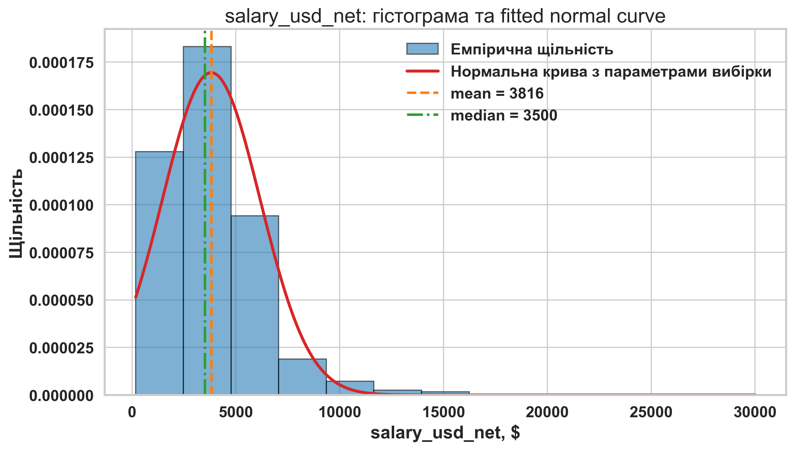
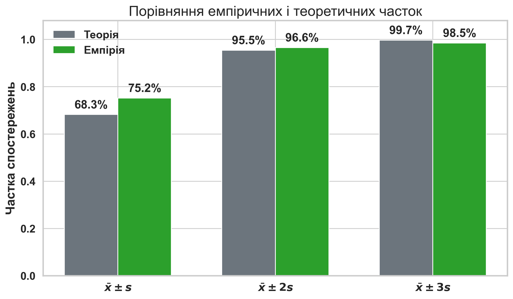
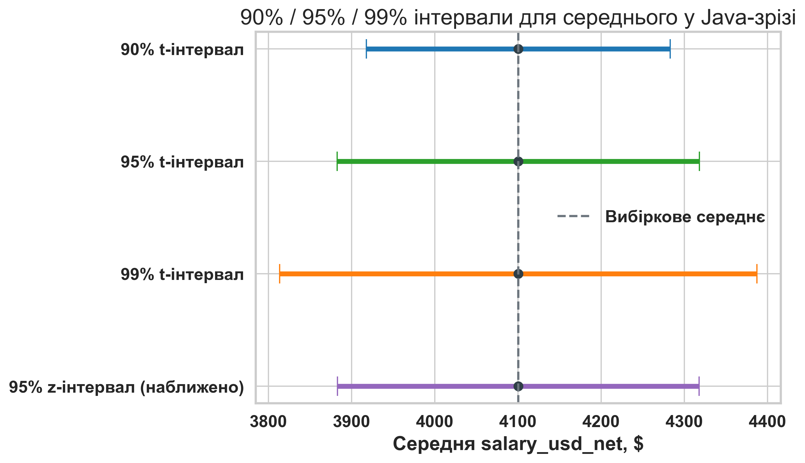
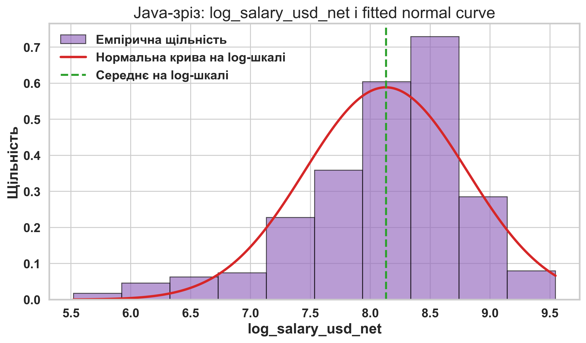
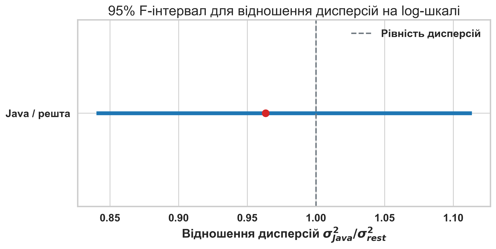

# Лабораторна робота 3. Робота з ймовірнісними розподілами та побудова довірчих інтервалів

**Тема:** *Ймовірнісні розподіли та статистичне оцінювання*

**Мета:** *Навчитися очищати реальний зарплатний CSV-набір, оцінювати форму розподілу кількісної ознаки, будувати точкові оцінки параметрів, застосовувати t-, χ²- та F-апарат для інтервального оцінювання і формулювати строгі висновки щодо рівня та мінливості компенсацій.*

---

## Контрольний приклад: Ймовірнісні розподіли та довірчі інтервали для зарплат українських розробників

### Постановка задачі

Нехай потрібно побудувати компактний, але методично повний приклад статистичного оцінювання на сучасному реальному наборі даних про зарплати українських розробників. Як змістовий орієнтир використаємо статтю DOU [12 січня 2026 року](https://dou.ua/lenta/articles/salary-report-devs-winter-2026/) «Зарплати українських розробників — зима 2026», а як локальне джерело даних — файл `04_data/2025_dec_raw.csv`.

У контрольному прикладі працюємо лише з підвибіркою респондентів, для яких категорія містить `Software Engineer / Developer`, а значення поля країни дорівнює «В Україні». Після технічного очищення одержуємо **4066** спостережень. Це менше, ніж **4356** відповідей розробників в Україні, згаданих у публікації DOU, отже лабораторні числові підсумки не мають механічно збігатися з опублікованими медіанами. Причина полягає в тому, що локальний CSV є неочищеним технічним експортом і потребує власного етапу нормалізації та відсікання пропусків.

### Вхідні дані для аналізу

Для практичної роботи перейменуємо ключові поля так, щоб код був стислим і прозорим: `salary_usd_net`, `bonus_usd`, `title`, `domain`, `specialization`, `main_language`, `company_size`, `experience_years`, `english_level`, `age`, `country`, `log_salary_usd_net`.

Нижче наведено фрагмент уже очищеної навчальної таблиці.

| main_language | title | specialization | experience_years | salary_usd_net | bonus_usd | company_size |
| :--- | :--- | :--- | :--- | :--- | :--- | :--- |
| C# / .NET | Junior | Back-end розробка | 2 | 1300 | 0 | Понад 1000 |
| Java | Senior | Back-end розробка | 10 | 7000 | 0 | До 1000 |
| JavaScript | Senior | Front-end розробка | 5 | 7000 | 0 | До 1000 |
| Kotlin | Senior | Mobile розробка | 7 | 2000 | 0 | До 200 |
| PHP | Consultant / External Expert | Back-end розробка | 13 | 6900 | 0 | Працюю на іноземного роботодавця, в Україні він не має сформованої команди |
| Python | Senior | Back-end розробка | 9 | 6100 | 0 | До 1000 |
| Ruby | Senior | Full Stack розробка | 15 | 5600 | 0 | До 10 спеціалістів |
| TypeScript | Middle | Full Stack розробка | 5 | 1100 | 0 | До 200 |

Зведення основних описових характеристик змінної `salary_usd_net` подано окремо.

| Показник | Значення |
| :--- | :--- |
| Кількість спостережень | 4066 |
| Середня salary_usd_net | 3815.95 |
| Медіанна salary_usd_net | 3500 |
| Дисперсія salary_usd_net | 5541883.42 |
| Стандартне відхилення salary_usd_net | 2354.12 |
| Перший квартиль Q1 | 2200 |
| Третій квартиль Q3 | 5000 |

### Покрокове виконання аналізу

**Крок 1.1. Завантажимо та нормалізуємо дані**

Спершу зчитаємо початковий неочищений CSV, очистимо грошові значення від розділювачів тисяч, вилучимо числову складову зі стажу, нормалізуємо окремі назви мов і доменів, а потім звузимо масив до українських розробників. Така підготовка потрібна для того, щоб усі подальші оцінки працювали з однорідною підвибіркою.

```python
import re
import numpy as np
import pandas as pd

raw = pd.read_csv("04_data/2025_dec_raw.csv", encoding="utf-8-sig")

def collapse_whitespace(value):
    text = str(value).replace("\n", " ").replace("\r", " ")
    return re.sub(r"\s+", " ", text).strip()

def parse_money(value):
    text = collapse_whitespace(value).replace(",", "")
    return pd.to_numeric(text, errors="coerce")

def parse_experience(value):
    match = re.search(r"\d+", collapse_whitespace(value))
    return int(match.group()) if match else pd.NA

def normalize_language(value):
    return {"C# NET": "C# / .NET"}.get(value, value)

def normalize_domain(value):
    replacements = {
        "Fintech Banking Capital Management": "Fintech / Banking / Capital Management",
        "Medtech Healthcare": "Medtech / Healthcare",
    }
    return replacements.get(value, value)

category = raw.iloc[:, 5].map(collapse_whitespace)
country = raw.iloc[:, 17].map(collapse_whitespace)

df = pd.DataFrame(
    {
        "salary_usd_net": raw.iloc[:, 2].map(parse_money),
        "bonus_usd": raw.iloc[:, 3].map(parse_money),
        "title": raw.iloc[:, 4].map(collapse_whitespace),
        "domain": raw.iloc[:, 7].map(collapse_whitespace).map(normalize_domain),
        "specialization": raw.iloc[:, 8].map(collapse_whitespace),
        "main_language": raw.iloc[:, 10].map(collapse_whitespace).map(normalize_language),
        "company_size": raw.iloc[:, 12].map(collapse_whitespace),
        "experience_years": raw.iloc[:, 13].map(parse_experience),
        "english_level": raw.iloc[:, 14].map(collapse_whitespace),
        "age": pd.to_numeric(raw.iloc[:, 16], errors="coerce"),
        "country": country,
    }
)

mask = category.str.contains("Software Engineer / Developer", regex=False)
mask &= country.eq("В Україні")

df = df.loc[mask].dropna(subset=["salary_usd_net", "experience_years", "age"]).copy()
df["experience_years"] = df["experience_years"].astype(int)
df["age"] = df["age"].astype(int)
df["log_salary_usd_net"] = np.log(df["salary_usd_net"])
print(df.shape)
```

**Результат очищення:** після фільтрації маємо **4066** рядків. Для локальної підвибірки медіанна зарплата становить **3500.00 USD**, тоді як у статті DOU для ширшого аналітичного зрізу наведено медіану **3450 USD**.

**Крок 1.2. Перевіримо форму розподілу `salary_usd_net` і порівняємо емпірію з правилом 68-95-99.7**

Для оцінювання нормального наближення використаємо гістограму щільності, fitted normal curve з параметрами вибірки та порівняння емпіричних часток у симетричних інтервалах навколо середнього. Густина нормального розподілу задається формулою

$$
f(x) = \frac{1}{s\sqrt{2\pi}} \exp\left(-\frac{(x - \bar{x})^2}{2s^2}\right),
$$

а стандартизована оцінка контрольної точки обчислюється як

$$
z = \frac{x - \bar{x}}{s}.
$$

```python
import matplotlib.pyplot as plt
from scipy import stats

salary = df["salary_usd_net"]
mean_salary = salary.mean()
median_salary = salary.median()
std_salary = salary.std(ddof=1)

bins = int(np.ceil(np.log2(len(df))) + 1)
x = np.linspace(salary.min(), salary.max(), 400)
pdf = stats.norm.pdf(x, loc=mean_salary, scale=std_salary)

share_1s = salary.between(mean_salary - std_salary, mean_salary + std_salary).mean()
share_2s = salary.between(mean_salary - 2 * std_salary, mean_salary + 2 * std_salary).mean()
share_3s = salary.between(mean_salary - 3 * std_salary, mean_salary + 3 * std_salary).mean()

q1, q2, q3 = salary.quantile([0.25, 0.5, 0.75])
z_q1 = (q1 - mean_salary) / std_salary
z_q2 = (q2 - mean_salary) / std_salary
z_q3 = (q3 - mean_salary) / std_salary
```





Таблицю емпіричних часток подано нижче.

| Інтервал | Теоретична частка | Емпірична частка |
| :--- | :--- | :--- |
| $\bar{x} \pm s$ | 68.27% | 75.23% |
| $\bar{x} \pm 2s$ | 95.45% | 96.58% |
| $\bar{x} \pm 3s$ | 99.73% | 98.50% |

Таблицю стандартизованих контрольних точок подано окремо.

| Контрольна точка | Значення salary_usd_net | z-оцінка |
| :--- | :--- | :--- |
| Q1 | 2200 | -0.686 |
| Медіана | 3500 | -0.134 |
| Q3 | 5000 | 0.503 |

**Проміжний висновок:** локальний розподіл є правосторонньо асиметричним: середнє **3815.95 USD** перевищує медіану **3500.00 USD**. Водночас емпіричні частки в інтервалах навколо середнього залишаються відносно близькими до теоретичного правила, тому нормальне наближення можна використати як орієнтир, але не як буквальну модель зарплатних даних.

**Крок 1.3. Побудуємо точкові оцінки та t-довірчі інтервали для Java-зрізу**

Для інтервального оцінювання середнього візьмемо велику і змістовно природну підвибірку Java-розробників. Тут застосуємо класичний t-підхід, оскільки стандартне відхилення генеральної сукупності невідоме. Формула інтервалу має вигляд

$$
\bar{x} \pm t_{1-\alpha/2,\,n-1} \frac{s}{\sqrt{n}}.
$$

```python
from scipy import stats

df_java = df[df["main_language"] == "Java"].copy()
salary_java = df_java["salary_usd_net"]
n_java = len(salary_java)

mean_java = salary_java.mean()
var_java = salary_java.var(ddof=1)
std_java = salary_java.std(ddof=1)
se_java = std_java / np.sqrt(n_java)

def t_interval_mean(sample, confidence):
    alpha = 1 - confidence
    n = len(sample)
    mean = sample.mean()
    std = sample.std(ddof=1)
    t_crit = stats.t.ppf(1 - alpha / 2, df=n - 1)
    margin = t_crit * std / np.sqrt(n)
    return mean - margin, mean + margin

def z_interval_mean(sample, confidence):
    alpha = 1 - confidence
    n = len(sample)
    mean = sample.mean()
    std = sample.std(ddof=1)
    z_crit = stats.norm.ppf(1 - alpha / 2)
    margin = z_crit * std / np.sqrt(n)
    return mean - margin, mean + margin

ci90_t = t_interval_mean(salary_java, 0.90)
ci95_t = t_interval_mean(salary_java, 0.95)
ci99_t = t_interval_mean(salary_java, 0.99)
ci95_z = z_interval_mean(salary_java, 0.95)
```



Точкові оцінки для Java-зрізу подано нижче.

| Показник | Значення |
| :--- | :--- |
| Кількість спостережень у Java-зрізі | 436 |
| Середня salary_usd_net | 4100.29 |
| Медіанна salary_usd_net | 3900 |
| Незміщена дисперсія salary_usd_net | 5357617.01 |
| Стандартне відхилення salary_usd_net | 2314.65 |
| Стандартна похибка середнього | 110.85 |

Зведення інтервалів для середнього `salary_usd_net`:

| Рівень довіри | Модель | Нижня межа | Верхня межа | Ширина |
| :--- | :--- | :--- | :--- | :--- |
| 90% | t | 3917.56 | 4283.01 | 365.45 |
| 95% | t | 3882.42 | 4318.16 | 435.74 |
| 99% | t | 3813.50 | 4387.08 | 573.59 |
| 95% | z | 3883.02 | 4317.55 | 434.53 |

**Проміжний висновок:** зі зростанням рівня довіри інтервал систематично розширюється. Для Java-зрізу 95% t-інтервал становить приблизно **[3882.42; 4318.16] USD**, а 95% z-інтервал майже збігається з ним через великий обсяг вибірки. Це не скасовує того, що методично коректним базовим інструментом при невідомому `σ` залишається саме t-апарат.

**Крок 1.4. Побудуємо χ²-інтервали для дисперсії на log-шкалі**

Неочищені зарплатні дані мають виразний правий хвіст, тому для аналізу мінливості доцільно перейти до `log_salary_usd_net`. Це не змінює структуру задачі, але робить її методично акуратнішою для variance-based оцінювання. Для дисперсії застосовуємо формулу

$$
\left(
\frac{(n-1)s^2}{\chi^2_{1-\alpha/2}},
\frac{(n-1)s^2}{\chi^2_{\alpha/2}}
\right).
$$

```python
log_salary_java = np.log(salary_java)
var_log_java = log_salary_java.var(ddof=1)
std_log_java = log_salary_java.std(ddof=1)
dfree = len(log_salary_java) - 1

chi_left = stats.chi2.ppf(0.975, df=dfree)
chi_right = stats.chi2.ppf(0.025, df=dfree)

ci_var_log = ((dfree * var_log_java) / chi_left, (dfree * var_log_java) / chi_right)
ci_std_log = (np.sqrt(ci_var_log[0]), np.sqrt(ci_var_log[1]))
```



Таблицю χ²-оцінювання наведено нижче.

| Показник | Точкова оцінка | Нижня 95% межа | Верхня 95% межа |
| :--- | :--- | :--- | :--- |
| Дисперсія log_salary_usd_net | 0.45945 | 0.40402 | 0.52719 |
| Стандартне відхилення log_salary_usd_net | 0.67783 | 0.63562 | 0.72608 |

**Проміжний висновок:** навіть після логарифмування мінливість не зникає, але її оцінювання стає змістовно прозорішим. Для Java-зрізу стандартне відхилення на log-шкалі лежить у 95% інтервалі **[0.63562; 0.72608]**.

**Крок 1.5. Порівняємо дисперсію Java-зрізу з рештою вибірки через F-розподіл**

Тепер розглянемо, чи є Java-зріз суттєво більш або менш мінливим, ніж уся інша частина очищеного масиву. Для цього використовуємо відношення двох вибіркових дисперсій на log-шкалі:

$$
F = \frac{s_1^2}{s_2^2},
$$

а 95% інтервал для параметра $\sigma_1^2 / \sigma_2^2$ задаємо як

$$
\left(
\frac{s_1^2 / s_2^2}{F_{1-\alpha/2}(\nu_1, \nu_2)},
\frac{s_1^2 / s_2^2}{F_{\alpha/2}(\nu_1, \nu_2)}
\right).
$$

```python
df_rest = df[df["main_language"] != "Java"].copy()
log_salary_rest = np.log(df_rest["salary_usd_net"])

f_ratio = log_salary_java.var(ddof=1) / log_salary_rest.var(ddof=1)
f_left_quantile = stats.f.ppf(0.025, dfn=len(log_salary_java) - 1, dfd=len(log_salary_rest) - 1)
f_right_quantile = stats.f.ppf(0.975, dfn=len(log_salary_java) - 1, dfd=len(log_salary_rest) - 1)
ci_f = (f_ratio / f_right_quantile, f_ratio / f_left_quantile)
```



Таблицю F-порівняння подано нижче.

| Показник | Значення |
| :--- | :--- |
| Кількість спостережень у Java-зрізі | 436 |
| Кількість спостережень у решті вибірки | 3630 |
| Оцінка відношення дисперсій F | 0.96339 |
| Нижня межа 95% F-інтервалу | 0.84018 |
| Верхня межа 95% F-інтервалу | 1.11342 |

**Проміжний висновок:** оцінка відношення дисперсій становить **0.96339**, а 95% інтервал дорівнює **[0.84018; 1.11342]**. Оскільки інтервал перекриває 1, на рівні цього класичного F-апарату немає підстав говорити про виразно іншу мінливість Java-зрізу відносно решти вибірки.

### Результати виконання

Після виконання контрольного прикладу одержано такі результати:

1. Очищена локальна вибірка містить **4066** спостережень українських розробників.
2. Для всієї вибірки `salary_usd_net` має середнє **3815.95 USD**, медіану **3500.00 USD** і стандартне відхилення **2354.12 USD**.
3. Емпіричні частки в інтервалах `x̄ ± s`, `x̄ ± 2s`, `x̄ ± 3s` дорівнюють відповідно **75.23%**, **96.58%** і **98.50%**.
4. Java-зріз містить **436** спостережень, а 95% t-інтервал для його середнього `salary_usd_net` дорівнює **[3882.42; 4318.16] USD**.
5. Для `log_salary_usd_net` у Java-зрізі 95% χ²-інтервал для стандартного відхилення дорівнює **[0.63562; 0.72608]**.
6. Для порівняння Java-зрізу з рештою вибірки 95% F-інтервал для відношення дисперсій дорівнює **[0.84018; 1.11342]**.

### Висновки (інтерпретація результатів)

Неочищений розподіл зарплат українських розробників не є строго нормальним: він має виразну правосторонню асиметрію, через що середнє перевищує медіану. Проте нормальне наближення все ще корисне як діагностичний орієнтир, особливо на етапі стандартизації та грубої перевірки часток у симетричних інтервалах навколо середнього.

Для оцінювання середнього при невідомому стандартному відхиленні базовим інструментом виступає t-розподіл. У великій підвибірці Java-розробників різниця між 95% t- і z-інтервалами виявляється малою, але це не скасовує методичного пріоритету t-підходу.

Для аналізу мінливості доцільно перейти до `log_salary_usd_net`, оскільки саме на цій шкалі χ²- і F-апарат інтерпретуються переконливіше. Одержаний F-інтервал перекриває 1, тому Java-зріз не демонструє виразно іншої дисперсійної структури порівняно з рештою очищеного масиву.

### Критичний аналіз результатів (додатково)

1. **Відмінність від медіани DOU:** локальний CSV є технічним експортом, а не фінальною редакційною таблицею публікації, тому збіг із медіаною **3450 USD** не є обов’язковим.
2. **Правий хвіст зарплат:** великі компенсації зміщують середнє вгору, тому висновки щодо центру розподілу слід формулювати обережно і не підміняти медіану середнім без застережень.
3. **Класичні інтервали мають модельні припущення:** t-, χ²- та F-апарат є дуже корисними для навчального оцінювання, але їх не слід сприймати як універсально точні незалежно від форми реальних економічних розподілів.

---

## Завдання для самостійного виконання

### <span style="color:red; font-size:1.5em;">Завдання 1. Нормальне наближення та стандартизація</span>

---

**Для всіх варіантів:**

– **Робочий зріз:** Працюйте лише з очищеною підвибіркою українських розробників і формуйте `df_variant` тільки за правилом свого варіанта.
– **Основна змінна:** У всіх варіантах досліджуйте лише `salary_usd_net`.
– **Обов’язкові результати:** Подайте `n`, `mean`, `median`, незміщену `var`, `std`, гістограму з fitted normal curve, таблицю стандартизованих контрольних точок і короткий висновок про придатність нормального наближення.
– **Критерій інтерпретації:** Порівняйте емпіричні частки для інтервалів `x̄ ± s`, `x̄ ± 2s`, `x̄ ± 3s` з теоретичним правилом 68-95-99.7.

**Варіант 1 – TypeScript:**

* **Мета:** Дослідити, наскільки нормальною є форма розподілу `salary_usd_net` для зрізу розробників з основною мовою TypeScript.
* **Кроки:**

    1. Сформуйте `df_variant` за правилом `df[df["main_language"] == "TypeScript"].copy()` і перевірте розмір підвибірки через `df_variant.shape[0]`.
    2. Обчисліть `mean`, `median`, `var(ddof=1)` і `std(ddof=1)` для `salary_usd_net`.
    3. Побудуйте гістограму щільності та накладіть на неї теоретичну нормальну криву з параметрами `loc=mean`, `scale=std`.
    4. Обчисліть z-оцінки для трьох контрольних точок, наприклад `Q1`, `median`, `Q3`, використавши формулу `z = (x - mean) / std`.
    5. Обчисліть емпіричні частки спостережень в інтервалах `x̄ ± s`, `x̄ ± 2s`, `x̄ ± 3s`, порівняйте їх із теоретичними 68.27%, 95.45%, 99.73% і сформулюйте висновок.

* **Підказки:** Для накладання fitted normal curve зручно побудувати сітку `x = np.linspace(...)` і використати `stats.norm.pdf(x, loc=mean, scale=std)`. Якщо `mean` помітно перевищує `median`, не ігноруйте цю асиметрію у висновку. Від студента вимагається не довести нормальність формально, а аргументовано оцінити силу відхилення від неї.

**Варіант 2 – JavaScript:**

* **Мета:** Дослідити, наскільки нормальною є форма розподілу `salary_usd_net` для зрізу розробників з основною мовою JavaScript.
* **Кроки:**

    1. Сформуйте `df_variant` за правилом `df[df["main_language"] == "JavaScript"].copy()` і перевірте розмір підвибірки через `df_variant.shape[0]`.
    2. Обчисліть `mean`, `median`, `var(ddof=1)` і `std(ddof=1)` для `salary_usd_net`.
    3. Побудуйте гістограму щільності та накладіть на неї теоретичну нормальну криву з параметрами `loc=mean`, `scale=std`.
    4. Обчисліть z-оцінки для трьох контрольних точок, наприклад `Q1`, `median`, `Q3`, використавши формулу `z = (x - mean) / std`.
    5. Обчисліть емпіричні частки спостережень в інтервалах `x̄ ± s`, `x̄ ± 2s`, `x̄ ± 3s`, порівняйте їх із теоретичними 68.27%, 95.45%, 99.73% і сформулюйте висновок.

* **Підказки:** Для накладання fitted normal curve зручно побудувати сітку `x = np.linspace(...)` і використати `stats.norm.pdf(x, loc=mean, scale=std)`. Якщо `mean` помітно перевищує `median`, не ігноруйте цю асиметрію у висновку. Від студента вимагається не довести нормальність формально, а аргументовано оцінити силу відхилення від неї.

**Варіант 3 – C# / .NET:**

* **Мета:** Дослідити, наскільки нормальною є форма розподілу `salary_usd_net` для зрізу розробників з основною мовою C# / .NET.
* **Кроки:**

    1. Сформуйте `df_variant` за правилом `df[df["main_language"] == "C# / .NET"].copy()` і перевірте розмір підвибірки через `df_variant.shape[0]`.
    2. Обчисліть `mean`, `median`, `var(ddof=1)` і `std(ddof=1)` для `salary_usd_net`.
    3. Побудуйте гістограму щільності та накладіть на неї теоретичну нормальну криву з параметрами `loc=mean`, `scale=std`.
    4. Обчисліть z-оцінки для трьох контрольних точок, наприклад `Q1`, `median`, `Q3`, використавши формулу `z = (x - mean) / std`.
    5. Обчисліть емпіричні частки спостережень в інтервалах `x̄ ± s`, `x̄ ± 2s`, `x̄ ± 3s`, порівняйте їх із теоретичними 68.27%, 95.45%, 99.73% і сформулюйте висновок.

* **Підказки:** Для накладання fitted normal curve зручно побудувати сітку `x = np.linspace(...)` і використати `stats.norm.pdf(x, loc=mean, scale=std)`. Якщо `mean` помітно перевищує `median`, не ігноруйте цю асиметрію у висновку. Від студента вимагається не довести нормальність формально, а аргументовано оцінити силу відхилення від неї.

**Варіант 4 – Java:**

* **Мета:** Дослідити, наскільки нормальною є форма розподілу `salary_usd_net` для зрізу розробників з основною мовою Java.
* **Кроки:**

    1. Сформуйте `df_variant` за правилом `df[df["main_language"] == "Java"].copy()` і перевірте розмір підвибірки через `df_variant.shape[0]`.
    2. Обчисліть `mean`, `median`, `var(ddof=1)` і `std(ddof=1)` для `salary_usd_net`.
    3. Побудуйте гістограму щільності та накладіть на неї теоретичну нормальну криву з параметрами `loc=mean`, `scale=std`.
    4. Обчисліть z-оцінки для трьох контрольних точок, наприклад `Q1`, `median`, `Q3`, використавши формулу `z = (x - mean) / std`.
    5. Обчисліть емпіричні частки спостережень в інтервалах `x̄ ± s`, `x̄ ± 2s`, `x̄ ± 3s`, порівняйте їх із теоретичними 68.27%, 95.45%, 99.73% і сформулюйте висновок.

* **Підказки:** Для накладання fitted normal curve зручно побудувати сітку `x = np.linspace(...)` і використати `stats.norm.pdf(x, loc=mean, scale=std)`. Якщо `mean` помітно перевищує `median`, не ігноруйте цю асиметрію у висновку. Від студента вимагається не довести нормальність формально, а аргументовано оцінити силу відхилення від неї.

**Варіант 5 – PHP:**

* **Мета:** Дослідити, наскільки нормальною є форма розподілу `salary_usd_net` для зрізу розробників з основною мовою PHP.
* **Кроки:**

    1. Сформуйте `df_variant` за правилом `df[df["main_language"] == "PHP"].copy()` і перевірте розмір підвибірки через `df_variant.shape[0]`.
    2. Обчисліть `mean`, `median`, `var(ddof=1)` і `std(ddof=1)` для `salary_usd_net`.
    3. Побудуйте гістограму щільності та накладіть на неї теоретичну нормальну криву з параметрами `loc=mean`, `scale=std`.
    4. Обчисліть z-оцінки для трьох контрольних точок, наприклад `Q1`, `median`, `Q3`, використавши формулу `z = (x - mean) / std`.
    5. Обчисліть емпіричні частки спостережень в інтервалах `x̄ ± s`, `x̄ ± 2s`, `x̄ ± 3s`, порівняйте їх із теоретичними 68.27%, 95.45%, 99.73% і сформулюйте висновок.

* **Підказки:** Для накладання fitted normal curve зручно побудувати сітку `x = np.linspace(...)` і використати `stats.norm.pdf(x, loc=mean, scale=std)`. Якщо `mean` помітно перевищує `median`, не ігноруйте цю асиметрію у висновку. Від студента вимагається не довести нормальність формально, а аргументовано оцінити силу відхилення від неї.

**Варіант 6 – Python:**

* **Мета:** Дослідити, наскільки нормальною є форма розподілу `salary_usd_net` для зрізу розробників з основною мовою Python.
* **Кроки:**

    1. Сформуйте `df_variant` за правилом `df[df["main_language"] == "Python"].copy()` і перевірте розмір підвибірки через `df_variant.shape[0]`.
    2. Обчисліть `mean`, `median`, `var(ddof=1)` і `std(ddof=1)` для `salary_usd_net`.
    3. Побудуйте гістограму щільності та накладіть на неї теоретичну нормальну криву з параметрами `loc=mean`, `scale=std`.
    4. Обчисліть z-оцінки для трьох контрольних точок, наприклад `Q1`, `median`, `Q3`, використавши формулу `z = (x - mean) / std`.
    5. Обчисліть емпіричні частки спостережень в інтервалах `x̄ ± s`, `x̄ ± 2s`, `x̄ ± 3s`, порівняйте їх із теоретичними 68.27%, 95.45%, 99.73% і сформулюйте висновок.

* **Підказки:** Для накладання fitted normal curve зручно побудувати сітку `x = np.linspace(...)` і використати `stats.norm.pdf(x, loc=mean, scale=std)`. Якщо `mean` помітно перевищує `median`, не ігноруйте цю асиметрію у висновку. Від студента вимагається не довести нормальність формально, а аргументовано оцінити силу відхилення від неї.

**Варіант 7 – Back-end:**

* **Мета:** Дослідити, наскільки нормальною є форма розподілу `salary_usd_net` для зрізу розробників зі спеціалізацією Back-end розробка.
* **Кроки:**

    1. Сформуйте `df_variant` за правилом `df[df["specialization"] == "Back-end розробка"].copy()` і перевірте розмір підвибірки через `df_variant.shape[0]`.
    2. Обчисліть `mean`, `median`, `var(ddof=1)` і `std(ddof=1)` для `salary_usd_net`.
    3. Побудуйте гістограму щільності та накладіть на неї теоретичну нормальну криву з параметрами `loc=mean`, `scale=std`.
    4. Обчисліть z-оцінки для трьох контрольних точок, наприклад `Q1`, `median`, `Q3`, використавши формулу `z = (x - mean) / std`.
    5. Обчисліть емпіричні частки спостережень в інтервалах `x̄ ± s`, `x̄ ± 2s`, `x̄ ± 3s`, порівняйте їх із теоретичними 68.27%, 95.45%, 99.73% і сформулюйте висновок.

* **Підказки:** Для накладання fitted normal curve зручно побудувати сітку `x = np.linspace(...)` і використати `stats.norm.pdf(x, loc=mean, scale=std)`. Якщо `mean` помітно перевищує `median`, не ігноруйте цю асиметрію у висновку. Від студента вимагається не довести нормальність формально, а аргументовано оцінити силу відхилення від неї.

**Варіант 8 – Front-end:**

* **Мета:** Дослідити, наскільки нормальною є форма розподілу `salary_usd_net` для зрізу розробників зі спеціалізацією Front-end розробка.
* **Кроки:**

    1. Сформуйте `df_variant` за правилом `df[df["specialization"] == "Front-end розробка"].copy()` і перевірте розмір підвибірки через `df_variant.shape[0]`.
    2. Обчисліть `mean`, `median`, `var(ddof=1)` і `std(ddof=1)` для `salary_usd_net`.
    3. Побудуйте гістограму щільності та накладіть на неї теоретичну нормальну криву з параметрами `loc=mean`, `scale=std`.
    4. Обчисліть z-оцінки для трьох контрольних точок, наприклад `Q1`, `median`, `Q3`, використавши формулу `z = (x - mean) / std`.
    5. Обчисліть емпіричні частки спостережень в інтервалах `x̄ ± s`, `x̄ ± 2s`, `x̄ ± 3s`, порівняйте їх із теоретичними 68.27%, 95.45%, 99.73% і сформулюйте висновок.

* **Підказки:** Для накладання fitted normal curve зручно побудувати сітку `x = np.linspace(...)` і використати `stats.norm.pdf(x, loc=mean, scale=std)`. Якщо `mean` помітно перевищує `median`, не ігноруйте цю асиметрію у висновку. Від студента вимагається не довести нормальність формально, а аргументовано оцінити силу відхилення від неї.

**Варіант 9 – Full Stack:**

* **Мета:** Дослідити, наскільки нормальною є форма розподілу `salary_usd_net` для зрізу розробників зі спеціалізацією Full Stack розробка.
* **Кроки:**

    1. Сформуйте `df_variant` за правилом `df[df["specialization"] == "Full Stack розробка"].copy()` і перевірте розмір підвибірки через `df_variant.shape[0]`.
    2. Обчисліть `mean`, `median`, `var(ddof=1)` і `std(ddof=1)` для `salary_usd_net`.
    3. Побудуйте гістограму щільності та накладіть на неї теоретичну нормальну криву з параметрами `loc=mean`, `scale=std`.
    4. Обчисліть z-оцінки для трьох контрольних точок, наприклад `Q1`, `median`, `Q3`, використавши формулу `z = (x - mean) / std`.
    5. Обчисліть емпіричні частки спостережень в інтервалах `x̄ ± s`, `x̄ ± 2s`, `x̄ ± 3s`, порівняйте їх із теоретичними 68.27%, 95.45%, 99.73% і сформулюйте висновок.

* **Підказки:** Для накладання fitted normal curve зручно побудувати сітку `x = np.linspace(...)` і використати `stats.norm.pdf(x, loc=mean, scale=std)`. Якщо `mean` помітно перевищує `median`, не ігноруйте цю асиметрію у висновку. Від студента вимагається не довести нормальність формально, а аргументовано оцінити силу відхилення від неї.

**Варіант 10 – Mobile:**

* **Мета:** Дослідити, наскільки нормальною є форма розподілу `salary_usd_net` для зрізу розробників зі спеціалізацією Mobile розробка.
* **Кроки:**

    1. Сформуйте `df_variant` за правилом `df[df["specialization"] == "Mobile розробка"].copy()` і перевірте розмір підвибірки через `df_variant.shape[0]`.
    2. Обчисліть `mean`, `median`, `var(ddof=1)` і `std(ddof=1)` для `salary_usd_net`.
    3. Побудуйте гістограму щільності та накладіть на неї теоретичну нормальну криву з параметрами `loc=mean`, `scale=std`.
    4. Обчисліть z-оцінки для трьох контрольних точок, наприклад `Q1`, `median`, `Q3`, використавши формулу `z = (x - mean) / std`.
    5. Обчисліть емпіричні частки спостережень в інтервалах `x̄ ± s`, `x̄ ± 2s`, `x̄ ± 3s`, порівняйте їх із теоретичними 68.27%, 95.45%, 99.73% і сформулюйте висновок.

* **Підказки:** Для накладання fitted normal curve зручно побудувати сітку `x = np.linspace(...)` і використати `stats.norm.pdf(x, loc=mean, scale=std)`. Якщо `mean` помітно перевищує `median`, не ігноруйте цю асиметрію у висновку. Від студента вимагається не довести нормальність формально, а аргументовано оцінити силу відхилення від неї.

**Варіант 11 – Desktop:**

* **Мета:** Дослідити, наскільки нормальною є форма розподілу `salary_usd_net` для зрізу розробників зі спеціалізацією Desktop.
* **Кроки:**

    1. Сформуйте `df_variant` за правилом `df[df["specialization"] == "Desktop"].copy()` і перевірте розмір підвибірки через `df_variant.shape[0]`.
    2. Обчисліть `mean`, `median`, `var(ddof=1)` і `std(ddof=1)` для `salary_usd_net`.
    3. Побудуйте гістограму щільності та накладіть на неї теоретичну нормальну криву з параметрами `loc=mean`, `scale=std`.
    4. Обчисліть z-оцінки для трьох контрольних точок, наприклад `Q1`, `median`, `Q3`, використавши формулу `z = (x - mean) / std`.
    5. Обчисліть емпіричні частки спостережень в інтервалах `x̄ ± s`, `x̄ ± 2s`, `x̄ ± 3s`, порівняйте їх із теоретичними 68.27%, 95.45%, 99.73% і сформулюйте висновок.

* **Підказки:** Для накладання fitted normal curve зручно побудувати сітку `x = np.linspace(...)` і використати `stats.norm.pdf(x, loc=mean, scale=std)`. Якщо `mean` помітно перевищує `median`, не ігноруйте цю асиметрію у висновку. Від студента вимагається не довести нормальність формально, а аргументовано оцінити силу відхилення від неї.

**Варіант 12 – Embedded:**

* **Мета:** Дослідити, наскільки нормальною є форма розподілу `salary_usd_net` для зрізу розробників зі спеціалізацією Embedded.
* **Кроки:**

    1. Сформуйте `df_variant` за правилом `df[df["specialization"] == "Embedded"].copy()` і перевірте розмір підвибірки через `df_variant.shape[0]`.
    2. Обчисліть `mean`, `median`, `var(ddof=1)` і `std(ddof=1)` для `salary_usd_net`.
    3. Побудуйте гістограму щільності та накладіть на неї теоретичну нормальну криву з параметрами `loc=mean`, `scale=std`.
    4. Обчисліть z-оцінки для трьох контрольних точок, наприклад `Q1`, `median`, `Q3`, використавши формулу `z = (x - mean) / std`.
    5. Обчисліть емпіричні частки спостережень в інтервалах `x̄ ± s`, `x̄ ± 2s`, `x̄ ± 3s`, порівняйте їх із теоретичними 68.27%, 95.45%, 99.73% і сформулюйте висновок.

* **Підказки:** Для накладання fitted normal curve зручно побудувати сітку `x = np.linspace(...)` і використати `stats.norm.pdf(x, loc=mean, scale=std)`. Якщо `mean` помітно перевищує `median`, не ігноруйте цю асиметрію у висновку. Від студента вимагається не довести нормальність формально, а аргументовано оцінити силу відхилення від неї.

**Варіант 13 – Fintech:**

* **Мета:** Дослідити, наскільки нормальною є форма розподілу `salary_usd_net` для зрізу розробників домену Fintech / Banking / Capital Management.
* **Кроки:**

    1. Сформуйте `df_variant` за правилом `df[df["domain"] == "Fintech / Banking / Capital Management"].copy()` і перевірте розмір підвибірки через `df_variant.shape[0]`.
    2. Обчисліть `mean`, `median`, `var(ddof=1)` і `std(ddof=1)` для `salary_usd_net`.
    3. Побудуйте гістограму щільності та накладіть на неї теоретичну нормальну криву з параметрами `loc=mean`, `scale=std`.
    4. Обчисліть z-оцінки для трьох контрольних точок, наприклад `Q1`, `median`, `Q3`, використавши формулу `z = (x - mean) / std`.
    5. Обчисліть емпіричні частки спостережень в інтервалах `x̄ ± s`, `x̄ ± 2s`, `x̄ ± 3s`, порівняйте їх із теоретичними 68.27%, 95.45%, 99.73% і сформулюйте висновок.

* **Підказки:** Для накладання fitted normal curve зручно побудувати сітку `x = np.linspace(...)` і використати `stats.norm.pdf(x, loc=mean, scale=std)`. Якщо `mean` помітно перевищує `median`, не ігноруйте цю асиметрію у висновку. Від студента вимагається не довести нормальність формально, а аргументовано оцінити силу відхилення від неї.

**Варіант 14 – E-commerce:**

* **Мета:** Дослідити, наскільки нормальною є форма розподілу `salary_usd_net` для зрізу розробників домену E-commerce.
* **Кроки:**

    1. Сформуйте `df_variant` за правилом `df[df["domain"] == "E-commerce"].copy()` і перевірте розмір підвибірки через `df_variant.shape[0]`.
    2. Обчисліть `mean`, `median`, `var(ddof=1)` і `std(ddof=1)` для `salary_usd_net`.
    3. Побудуйте гістограму щільності та накладіть на неї теоретичну нормальну криву з параметрами `loc=mean`, `scale=std`.
    4. Обчисліть z-оцінки для трьох контрольних точок, наприклад `Q1`, `median`, `Q3`, використавши формулу `z = (x - mean) / std`.
    5. Обчисліть емпіричні частки спостережень в інтервалах `x̄ ± s`, `x̄ ± 2s`, `x̄ ± 3s`, порівняйте їх із теоретичними 68.27%, 95.45%, 99.73% і сформулюйте висновок.

* **Підказки:** Для накладання fitted normal curve зручно побудувати сітку `x = np.linspace(...)` і використати `stats.norm.pdf(x, loc=mean, scale=std)`. Якщо `mean` помітно перевищує `median`, не ігноруйте цю асиметрію у висновку. Від студента вимагається не довести нормальність формально, а аргументовано оцінити силу відхилення від неї.

**Варіант 15 – Gambling:**

* **Мета:** Дослідити, наскільки нормальною є форма розподілу `salary_usd_net` для зрізу розробників домену Gambling.
* **Кроки:**

    1. Сформуйте `df_variant` за правилом `df[df["domain"] == "Gambling"].copy()` і перевірте розмір підвибірки через `df_variant.shape[0]`.
    2. Обчисліть `mean`, `median`, `var(ddof=1)` і `std(ddof=1)` для `salary_usd_net`.
    3. Побудуйте гістограму щільності та накладіть на неї теоретичну нормальну криву з параметрами `loc=mean`, `scale=std`.
    4. Обчисліть z-оцінки для трьох контрольних точок, наприклад `Q1`, `median`, `Q3`, використавши формулу `z = (x - mean) / std`.
    5. Обчисліть емпіричні частки спостережень в інтервалах `x̄ ± s`, `x̄ ± 2s`, `x̄ ± 3s`, порівняйте їх із теоретичними 68.27%, 95.45%, 99.73% і сформулюйте висновок.

* **Підказки:** Для накладання fitted normal curve зручно побудувати сітку `x = np.linspace(...)` і використати `stats.norm.pdf(x, loc=mean, scale=std)`. Якщо `mean` помітно перевищує `median`, не ігноруйте цю асиметрію у висновку. Від студента вимагається не довести нормальність формально, а аргументовано оцінити силу відхилення від неї.

**Варіант 16 – Medtech:**

* **Мета:** Дослідити, наскільки нормальною є форма розподілу `salary_usd_net` для зрізу розробників домену Medtech / Healthcare.
* **Кроки:**

    1. Сформуйте `df_variant` за правилом `df[df["domain"] == "Medtech / Healthcare"].copy()` і перевірте розмір підвибірки через `df_variant.shape[0]`.
    2. Обчисліть `mean`, `median`, `var(ddof=1)` і `std(ddof=1)` для `salary_usd_net`.
    3. Побудуйте гістограму щільності та накладіть на неї теоретичну нормальну криву з параметрами `loc=mean`, `scale=std`.
    4. Обчисліть z-оцінки для трьох контрольних точок, наприклад `Q1`, `median`, `Q3`, використавши формулу `z = (x - mean) / std`.
    5. Обчисліть емпіричні частки спостережень в інтервалах `x̄ ± s`, `x̄ ± 2s`, `x̄ ± 3s`, порівняйте їх із теоретичними 68.27%, 95.45%, 99.73% і сформулюйте висновок.

* **Підказки:** Для накладання fitted normal curve зручно побудувати сітку `x = np.linspace(...)` і використати `stats.norm.pdf(x, loc=mean, scale=std)`. Якщо `mean` помітно перевищує `median`, не ігноруйте цю асиметрію у висновку. Від студента вимагається не довести нормальність формально, а аргументовано оцінити силу відхилення від неї.

**Варіант 17 – SaaS:**

* **Мета:** Дослідити, наскільки нормальною є форма розподілу `salary_usd_net` для зрізу розробників домену SaaS.
* **Кроки:**

    1. Сформуйте `df_variant` за правилом `df[df["domain"] == "SaaS"].copy()` і перевірте розмір підвибірки через `df_variant.shape[0]`.
    2. Обчисліть `mean`, `median`, `var(ddof=1)` і `std(ddof=1)` для `salary_usd_net`.
    3. Побудуйте гістограму щільності та накладіть на неї теоретичну нормальну криву з параметрами `loc=mean`, `scale=std`.
    4. Обчисліть z-оцінки для трьох контрольних точок, наприклад `Q1`, `median`, `Q3`, використавши формулу `z = (x - mean) / std`.
    5. Обчисліть емпіричні частки спостережень в інтервалах `x̄ ± s`, `x̄ ± 2s`, `x̄ ± 3s`, порівняйте їх із теоретичними 68.27%, 95.45%, 99.73% і сформулюйте висновок.

* **Підказки:** Для накладання fitted normal curve зручно побудувати сітку `x = np.linspace(...)` і використати `stats.norm.pdf(x, loc=mean, scale=std)`. Якщо `mean` помітно перевищує `median`, не ігноруйте цю асиметрію у висновку. Від студента вимагається не довести нормальність формально, а аргументовано оцінити силу відхилення від неї.

**Варіант 18 – GameDev:**

* **Мета:** Дослідити, наскільки нормальною є форма розподілу `salary_usd_net` для зрізу розробників домену GameDev.
* **Кроки:**

    1. Сформуйте `df_variant` за правилом `df[df["domain"] == "GameDev"].copy()` і перевірте розмір підвибірки через `df_variant.shape[0]`.
    2. Обчисліть `mean`, `median`, `var(ddof=1)` і `std(ddof=1)` для `salary_usd_net`.
    3. Побудуйте гістограму щільності та накладіть на неї теоретичну нормальну криву з параметрами `loc=mean`, `scale=std`.
    4. Обчисліть z-оцінки для трьох контрольних точок, наприклад `Q1`, `median`, `Q3`, використавши формулу `z = (x - mean) / std`.
    5. Обчисліть емпіричні частки спостережень в інтервалах `x̄ ± s`, `x̄ ± 2s`, `x̄ ± 3s`, порівняйте їх із теоретичними 68.27%, 95.45%, 99.73% і сформулюйте висновок.

* **Підказки:** Для накладання fitted normal curve зручно побудувати сітку `x = np.linspace(...)` і використати `stats.norm.pdf(x, loc=mean, scale=std)`. Якщо `mean` помітно перевищує `median`, не ігноруйте цю асиметрію у висновку. Від студента вимагається не довести нормальність формально, а аргументовано оцінити силу відхилення від неї.

**Варіант 19 – 1-2 роки стажу:**

* **Мета:** Дослідити, наскільки нормальною є форма розподілу `salary_usd_net` для зрізу розробників зі стажем від 1 до 2 років включно.
* **Кроки:**

    1. Сформуйте `df_variant` за правилом `df[df["experience_years"].between(1, 2)].copy()` і перевірте розмір підвибірки через `df_variant.shape[0]`.
    2. Обчисліть `mean`, `median`, `var(ddof=1)` і `std(ddof=1)` для `salary_usd_net`.
    3. Побудуйте гістограму щільності та накладіть на неї теоретичну нормальну криву з параметрами `loc=mean`, `scale=std`.
    4. Обчисліть z-оцінки для трьох контрольних точок, наприклад `Q1`, `median`, `Q3`, використавши формулу `z = (x - mean) / std`.
    5. Обчисліть емпіричні частки спостережень в інтервалах `x̄ ± s`, `x̄ ± 2s`, `x̄ ± 3s`, порівняйте їх із теоретичними 68.27%, 95.45%, 99.73% і сформулюйте висновок.

* **Підказки:** Для накладання fitted normal curve зручно побудувати сітку `x = np.linspace(...)` і використати `stats.norm.pdf(x, loc=mean, scale=std)`. Якщо `mean` помітно перевищує `median`, не ігноруйте цю асиметрію у висновку. Від студента вимагається не довести нормальність формально, а аргументовано оцінити силу відхилення від неї.

**Варіант 20 – 3-4 роки стажу:**

* **Мета:** Дослідити, наскільки нормальною є форма розподілу `salary_usd_net` для зрізу розробників зі стажем від 3 до 4 років включно.
* **Кроки:**

    1. Сформуйте `df_variant` за правилом `df[df["experience_years"].between(3, 4)].copy()` і перевірте розмір підвибірки через `df_variant.shape[0]`.
    2. Обчисліть `mean`, `median`, `var(ddof=1)` і `std(ddof=1)` для `salary_usd_net`.
    3. Побудуйте гістограму щільності та накладіть на неї теоретичну нормальну криву з параметрами `loc=mean`, `scale=std`.
    4. Обчисліть z-оцінки для трьох контрольних точок, наприклад `Q1`, `median`, `Q3`, використавши формулу `z = (x - mean) / std`.
    5. Обчисліть емпіричні частки спостережень в інтервалах `x̄ ± s`, `x̄ ± 2s`, `x̄ ± 3s`, порівняйте їх із теоретичними 68.27%, 95.45%, 99.73% і сформулюйте висновок.

* **Підказки:** Для накладання fitted normal curve зручно побудувати сітку `x = np.linspace(...)` і використати `stats.norm.pdf(x, loc=mean, scale=std)`. Якщо `mean` помітно перевищує `median`, не ігноруйте цю асиметрію у висновку. Від студента вимагається не довести нормальність формально, а аргументовано оцінити силу відхилення від неї.

**Варіант 21 – 5-6 років стажу:**

* **Мета:** Дослідити, наскільки нормальною є форма розподілу `salary_usd_net` для зрізу розробників зі стажем від 5 до 6 років включно.
* **Кроки:**

    1. Сформуйте `df_variant` за правилом `df[df["experience_years"].between(5, 6)].copy()` і перевірте розмір підвибірки через `df_variant.shape[0]`.
    2. Обчисліть `mean`, `median`, `var(ddof=1)` і `std(ddof=1)` для `salary_usd_net`.
    3. Побудуйте гістограму щільності та накладіть на неї теоретичну нормальну криву з параметрами `loc=mean`, `scale=std`.
    4. Обчисліть z-оцінки для трьох контрольних точок, наприклад `Q1`, `median`, `Q3`, використавши формулу `z = (x - mean) / std`.
    5. Обчисліть емпіричні частки спостережень в інтервалах `x̄ ± s`, `x̄ ± 2s`, `x̄ ± 3s`, порівняйте їх із теоретичними 68.27%, 95.45%, 99.73% і сформулюйте висновок.

* **Підказки:** Для накладання fitted normal curve зручно побудувати сітку `x = np.linspace(...)` і використати `stats.norm.pdf(x, loc=mean, scale=std)`. Якщо `mean` помітно перевищує `median`, не ігноруйте цю асиметрію у висновку. Від студента вимагається не довести нормальність формально, а аргументовано оцінити силу відхилення від неї.

**Варіант 22 – 7-8 років стажу:**

* **Мета:** Дослідити, наскільки нормальною є форма розподілу `salary_usd_net` для зрізу розробників зі стажем від 7 до 8 років включно.
* **Кроки:**

    1. Сформуйте `df_variant` за правилом `df[df["experience_years"].between(7, 8)].copy()` і перевірте розмір підвибірки через `df_variant.shape[0]`.
    2. Обчисліть `mean`, `median`, `var(ddof=1)` і `std(ddof=1)` для `salary_usd_net`.
    3. Побудуйте гістограму щільності та накладіть на неї теоретичну нормальну криву з параметрами `loc=mean`, `scale=std`.
    4. Обчисліть z-оцінки для трьох контрольних точок, наприклад `Q1`, `median`, `Q3`, використавши формулу `z = (x - mean) / std`.
    5. Обчисліть емпіричні частки спостережень в інтервалах `x̄ ± s`, `x̄ ± 2s`, `x̄ ± 3s`, порівняйте їх із теоретичними 68.27%, 95.45%, 99.73% і сформулюйте висновок.

* **Підказки:** Для накладання fitted normal curve зручно побудувати сітку `x = np.linspace(...)` і використати `stats.norm.pdf(x, loc=mean, scale=std)`. Якщо `mean` помітно перевищує `median`, не ігноруйте цю асиметрію у висновку. Від студента вимагається не довести нормальність формально, а аргументовано оцінити силу відхилення від неї.

**Варіант 23 – 9-10 років стажу:**

* **Мета:** Дослідити, наскільки нормальною є форма розподілу `salary_usd_net` для зрізу розробників зі стажем від 9 до 10 років включно.
* **Кроки:**

    1. Сформуйте `df_variant` за правилом `df[df["experience_years"].between(9, 10)].copy()` і перевірте розмір підвибірки через `df_variant.shape[0]`.
    2. Обчисліть `mean`, `median`, `var(ddof=1)` і `std(ddof=1)` для `salary_usd_net`.
    3. Побудуйте гістограму щільності та накладіть на неї теоретичну нормальну криву з параметрами `loc=mean`, `scale=std`.
    4. Обчисліть z-оцінки для трьох контрольних точок, наприклад `Q1`, `median`, `Q3`, використавши формулу `z = (x - mean) / std`.
    5. Обчисліть емпіричні частки спостережень в інтервалах `x̄ ± s`, `x̄ ± 2s`, `x̄ ± 3s`, порівняйте їх із теоретичними 68.27%, 95.45%, 99.73% і сформулюйте висновок.

* **Підказки:** Для накладання fitted normal curve зручно побудувати сітку `x = np.linspace(...)` і використати `stats.norm.pdf(x, loc=mean, scale=std)`. Якщо `mean` помітно перевищує `median`, не ігноруйте цю асиметрію у висновку. Від студента вимагається не довести нормальність формально, а аргументовано оцінити силу відхилення від неї.

**Варіант 24 – 11+ років стажу:**

* **Мета:** Дослідити, наскільки нормальною є форма розподілу `salary_usd_net` для зрізу розробників зі стажем 11 років і більше.
* **Кроки:**

    1. Сформуйте `df_variant` за правилом `df[df["experience_years"] >= 11].copy()` і перевірте розмір підвибірки через `df_variant.shape[0]`.
    2. Обчисліть `mean`, `median`, `var(ddof=1)` і `std(ddof=1)` для `salary_usd_net`.
    3. Побудуйте гістограму щільності та накладіть на неї теоретичну нормальну криву з параметрами `loc=mean`, `scale=std`.
    4. Обчисліть z-оцінки для трьох контрольних точок, наприклад `Q1`, `median`, `Q3`, використавши формулу `z = (x - mean) / std`.
    5. Обчисліть емпіричні частки спостережень в інтервалах `x̄ ± s`, `x̄ ± 2s`, `x̄ ± 3s`, порівняйте їх із теоретичними 68.27%, 95.45%, 99.73% і сформулюйте висновок.

* **Підказки:** Для накладання fitted normal curve зручно побудувати сітку `x = np.linspace(...)` і використати `stats.norm.pdf(x, loc=mean, scale=std)`. Якщо `mean` помітно перевищує `median`, не ігноруйте цю асиметрію у висновку. Від студента вимагається не довести нормальність формально, а аргументовано оцінити силу відхилення від неї.

**Варіант 25 – Компанія до 10 фахівців:**

* **Мета:** Дослідити, наскільки нормальною є форма розподілу `salary_usd_net` для зрізу розробників із компаній розміру До 10 спеціалістів.
* **Кроки:**

    1. Сформуйте `df_variant` за правилом `df[df["company_size"] == "До 10 спеціалістів"].copy()` і перевірте розмір підвибірки через `df_variant.shape[0]`.
    2. Обчисліть `mean`, `median`, `var(ddof=1)` і `std(ddof=1)` для `salary_usd_net`.
    3. Побудуйте гістограму щільності та накладіть на неї теоретичну нормальну криву з параметрами `loc=mean`, `scale=std`.
    4. Обчисліть z-оцінки для трьох контрольних точок, наприклад `Q1`, `median`, `Q3`, використавши формулу `z = (x - mean) / std`.
    5. Обчисліть емпіричні частки спостережень в інтервалах `x̄ ± s`, `x̄ ± 2s`, `x̄ ± 3s`, порівняйте їх із теоретичними 68.27%, 95.45%, 99.73% і сформулюйте висновок.

* **Підказки:** Для накладання fitted normal curve зручно побудувати сітку `x = np.linspace(...)` і використати `stats.norm.pdf(x, loc=mean, scale=std)`. Якщо `mean` помітно перевищує `median`, не ігноруйте цю асиметрію у висновку. Від студента вимагається не довести нормальність формально, а аргументовано оцінити силу відхилення від неї.

**Варіант 26 – Компанія до 50 фахівців:**

* **Мета:** Дослідити, наскільки нормальною є форма розподілу `salary_usd_net` для зрізу розробників із компаній розміру До 50.
* **Кроки:**

    1. Сформуйте `df_variant` за правилом `df[df["company_size"] == "До 50"].copy()` і перевірте розмір підвибірки через `df_variant.shape[0]`.
    2. Обчисліть `mean`, `median`, `var(ddof=1)` і `std(ddof=1)` для `salary_usd_net`.
    3. Побудуйте гістограму щільності та накладіть на неї теоретичну нормальну криву з параметрами `loc=mean`, `scale=std`.
    4. Обчисліть z-оцінки для трьох контрольних точок, наприклад `Q1`, `median`, `Q3`, використавши формулу `z = (x - mean) / std`.
    5. Обчисліть емпіричні частки спостережень в інтервалах `x̄ ± s`, `x̄ ± 2s`, `x̄ ± 3s`, порівняйте їх із теоретичними 68.27%, 95.45%, 99.73% і сформулюйте висновок.

* **Підказки:** Для накладання fitted normal curve зручно побудувати сітку `x = np.linspace(...)` і використати `stats.norm.pdf(x, loc=mean, scale=std)`. Якщо `mean` помітно перевищує `median`, не ігноруйте цю асиметрію у висновку. Від студента вимагається не довести нормальність формально, а аргументовано оцінити силу відхилення від неї.

**Варіант 27 – Компанія до 200 фахівців:**

* **Мета:** Дослідити, наскільки нормальною є форма розподілу `salary_usd_net` для зрізу розробників із компаній розміру До 200.
* **Кроки:**

    1. Сформуйте `df_variant` за правилом `df[df["company_size"] == "До 200"].copy()` і перевірте розмір підвибірки через `df_variant.shape[0]`.
    2. Обчисліть `mean`, `median`, `var(ddof=1)` і `std(ddof=1)` для `salary_usd_net`.
    3. Побудуйте гістограму щільності та накладіть на неї теоретичну нормальну криву з параметрами `loc=mean`, `scale=std`.
    4. Обчисліть z-оцінки для трьох контрольних точок, наприклад `Q1`, `median`, `Q3`, використавши формулу `z = (x - mean) / std`.
    5. Обчисліть емпіричні частки спостережень в інтервалах `x̄ ± s`, `x̄ ± 2s`, `x̄ ± 3s`, порівняйте їх із теоретичними 68.27%, 95.45%, 99.73% і сформулюйте висновок.

* **Підказки:** Для накладання fitted normal curve зручно побудувати сітку `x = np.linspace(...)` і використати `stats.norm.pdf(x, loc=mean, scale=std)`. Якщо `mean` помітно перевищує `median`, не ігноруйте цю асиметрію у висновку. Від студента вимагається не довести нормальність формально, а аргументовано оцінити силу відхилення від неї.

**Варіант 28 – Компанія до 1000 фахівців:**

* **Мета:** Дослідити, наскільки нормальною є форма розподілу `salary_usd_net` для зрізу розробників із компаній розміру До 1000.
* **Кроки:**

    1. Сформуйте `df_variant` за правилом `df[df["company_size"] == "До 1000"].copy()` і перевірте розмір підвибірки через `df_variant.shape[0]`.
    2. Обчисліть `mean`, `median`, `var(ddof=1)` і `std(ddof=1)` для `salary_usd_net`.
    3. Побудуйте гістограму щільності та накладіть на неї теоретичну нормальну криву з параметрами `loc=mean`, `scale=std`.
    4. Обчисліть z-оцінки для трьох контрольних точок, наприклад `Q1`, `median`, `Q3`, використавши формулу `z = (x - mean) / std`.
    5. Обчисліть емпіричні частки спостережень в інтервалах `x̄ ± s`, `x̄ ± 2s`, `x̄ ± 3s`, порівняйте їх із теоретичними 68.27%, 95.45%, 99.73% і сформулюйте висновок.

* **Підказки:** Для накладання fitted normal curve зручно побудувати сітку `x = np.linspace(...)` і використати `stats.norm.pdf(x, loc=mean, scale=std)`. Якщо `mean` помітно перевищує `median`, не ігноруйте цю асиметрію у висновку. Від студента вимагається не довести нормальність формально, а аргументовано оцінити силу відхилення від неї.

**Варіант 29 – Компанія понад 1000 фахівців:**

* **Мета:** Дослідити, наскільки нормальною є форма розподілу `salary_usd_net` для зрізу розробників із компаній розміру Понад 1000.
* **Кроки:**

    1. Сформуйте `df_variant` за правилом `df[df["company_size"] == "Понад 1000"].copy()` і перевірте розмір підвибірки через `df_variant.shape[0]`.
    2. Обчисліть `mean`, `median`, `var(ddof=1)` і `std(ddof=1)` для `salary_usd_net`.
    3. Побудуйте гістограму щільності та накладіть на неї теоретичну нормальну криву з параметрами `loc=mean`, `scale=std`.
    4. Обчисліть z-оцінки для трьох контрольних точок, наприклад `Q1`, `median`, `Q3`, використавши формулу `z = (x - mean) / std`.
    5. Обчисліть емпіричні частки спостережень в інтервалах `x̄ ± s`, `x̄ ± 2s`, `x̄ ± 3s`, порівняйте їх із теоретичними 68.27%, 95.45%, 99.73% і сформулюйте висновок.

* **Підказки:** Для накладання fitted normal curve зручно побудувати сітку `x = np.linspace(...)` і використати `stats.norm.pdf(x, loc=mean, scale=std)`. Якщо `mean` помітно перевищує `median`, не ігноруйте цю асиметрію у висновку. Від студента вимагається не довести нормальність формально, а аргументовано оцінити силу відхилення від неї.

**Варіант 30 – Іноземний роботодавець без сформованої команди в Україні:**

* **Мета:** Дослідити, наскільки нормальною є форма розподілу `salary_usd_net` для зрізу розробників, які працюють на іноземного роботодавця без сформованої команди в Україні.
* **Кроки:**

    1. Сформуйте `df_variant` за правилом `df[df["company_size"] == "Працюю на іноземного роботодавця, в Україні він не має сформованої команди"].copy()` і перевірте розмір підвибірки через `df_variant.shape[0]`.
    2. Обчисліть `mean`, `median`, `var(ddof=1)` і `std(ddof=1)` для `salary_usd_net`.
    3. Побудуйте гістограму щільності та накладіть на неї теоретичну нормальну криву з параметрами `loc=mean`, `scale=std`.
    4. Обчисліть z-оцінки для трьох контрольних точок, наприклад `Q1`, `median`, `Q3`, використавши формулу `z = (x - mean) / std`.
    5. Обчисліть емпіричні частки спостережень в інтервалах `x̄ ± s`, `x̄ ± 2s`, `x̄ ± 3s`, порівняйте їх із теоретичними 68.27%, 95.45%, 99.73% і сформулюйте висновок.

* **Підказки:** Для накладання fitted normal curve зручно побудувати сітку `x = np.linspace(...)` і використати `stats.norm.pdf(x, loc=mean, scale=std)`. Якщо `mean` помітно перевищує `median`, не ігноруйте цю асиметрію у висновку. Від студента вимагається не довести нормальність формально, а аргументовано оцінити силу відхилення від неї.

### <span style="color:red; font-size:1.5em;">Завдання 2. Точкові оцінки та t-довірчі інтервали</span>

---

**Для всіх варіантів:**

– **Робочий зріз:** Формуйте `df_variant` лише за своїм варіантом і працюйте з `salary_usd_net` на шкалі USD.
– **Обов’язкові результати:** Подайте точкові оцінки, `SE`, 90% / 95% / 99% t-інтервали для середнього, а також наближений 95% z-інтервал.
– **Критерій інтерпретації:** Порівняйте ширини інтервалів і поясніть, чому при невідомому `σ` основним є саме t-підхід.

**Варіант 1 – TypeScript:**

* **Мета:** Побудувати точкові та інтервальні оцінки для середнього `salary_usd_net` у зрізі розробників з основною мовою TypeScript.
* **Кроки:**

    1. Створіть `df_variant` за правилом `df[df["main_language"] == "TypeScript"].copy()` і переконайтеся, що в ньому є достатня кількість рядків.
    2. Обчисліть `mean`, `var(ddof=1)`, `std(ddof=1)` і стандартну похибку `SE = std / sqrt(n)`.
    3. Побудуйте 90%, 95% і 99% t-довірчі інтервали для середнього `salary_usd_net` через `stats.t.ppf(...)`.
    4. Додатково побудуйте наближений 95% z-інтервал через `stats.norm.ppf(...)` і порівняйте його з 95% t-інтервалом.
    5. Подайте результати у зведеній таблиці та сформулюйте висновок: який інтервал є ширшим, що означають його межі та як на ширину впливає рівень довіри.

* **Підказки:** Зручно зробити окрему функцію `interval_mean(sample, confidence, model='t')`. Не плутайте інтервал для середнього з інтервалом для окремого спостереження. Якщо підвибірка асиметрична, це слід чесно зазначити, але все одно треба завершити обчислення в межах класичного t-апарату.

**Варіант 2 – JavaScript:**

* **Мета:** Побудувати точкові та інтервальні оцінки для середнього `salary_usd_net` у зрізі розробників з основною мовою JavaScript.
* **Кроки:**

    1. Створіть `df_variant` за правилом `df[df["main_language"] == "JavaScript"].copy()` і переконайтеся, що в ньому є достатня кількість рядків.
    2. Обчисліть `mean`, `var(ddof=1)`, `std(ddof=1)` і стандартну похибку `SE = std / sqrt(n)`.
    3. Побудуйте 90%, 95% і 99% t-довірчі інтервали для середнього `salary_usd_net` через `stats.t.ppf(...)`.
    4. Додатково побудуйте наближений 95% z-інтервал через `stats.norm.ppf(...)` і порівняйте його з 95% t-інтервалом.
    5. Подайте результати у зведеній таблиці та сформулюйте висновок: який інтервал є ширшим, що означають його межі та як на ширину впливає рівень довіри.

* **Підказки:** Зручно зробити окрему функцію `interval_mean(sample, confidence, model='t')`. Не плутайте інтервал для середнього з інтервалом для окремого спостереження. Якщо підвибірка асиметрична, це слід чесно зазначити, але все одно треба завершити обчислення в межах класичного t-апарату.

**Варіант 3 – C# / .NET:**

* **Мета:** Побудувати точкові та інтервальні оцінки для середнього `salary_usd_net` у зрізі розробників з основною мовою C# / .NET.
* **Кроки:**

    1. Створіть `df_variant` за правилом `df[df["main_language"] == "C# / .NET"].copy()` і переконайтеся, що в ньому є достатня кількість рядків.
    2. Обчисліть `mean`, `var(ddof=1)`, `std(ddof=1)` і стандартну похибку `SE = std / sqrt(n)`.
    3. Побудуйте 90%, 95% і 99% t-довірчі інтервали для середнього `salary_usd_net` через `stats.t.ppf(...)`.
    4. Додатково побудуйте наближений 95% z-інтервал через `stats.norm.ppf(...)` і порівняйте його з 95% t-інтервалом.
    5. Подайте результати у зведеній таблиці та сформулюйте висновок: який інтервал є ширшим, що означають його межі та як на ширину впливає рівень довіри.

* **Підказки:** Зручно зробити окрему функцію `interval_mean(sample, confidence, model='t')`. Не плутайте інтервал для середнього з інтервалом для окремого спостереження. Якщо підвибірка асиметрична, це слід чесно зазначити, але все одно треба завершити обчислення в межах класичного t-апарату.

**Варіант 4 – Java:**

* **Мета:** Побудувати точкові та інтервальні оцінки для середнього `salary_usd_net` у зрізі розробників з основною мовою Java.
* **Кроки:**

    1. Створіть `df_variant` за правилом `df[df["main_language"] == "Java"].copy()` і переконайтеся, що в ньому є достатня кількість рядків.
    2. Обчисліть `mean`, `var(ddof=1)`, `std(ddof=1)` і стандартну похибку `SE = std / sqrt(n)`.
    3. Побудуйте 90%, 95% і 99% t-довірчі інтервали для середнього `salary_usd_net` через `stats.t.ppf(...)`.
    4. Додатково побудуйте наближений 95% z-інтервал через `stats.norm.ppf(...)` і порівняйте його з 95% t-інтервалом.
    5. Подайте результати у зведеній таблиці та сформулюйте висновок: який інтервал є ширшим, що означають його межі та як на ширину впливає рівень довіри.

* **Підказки:** Зручно зробити окрему функцію `interval_mean(sample, confidence, model='t')`. Не плутайте інтервал для середнього з інтервалом для окремого спостереження. Якщо підвибірка асиметрична, це слід чесно зазначити, але все одно треба завершити обчислення в межах класичного t-апарату.

**Варіант 5 – PHP:**

* **Мета:** Побудувати точкові та інтервальні оцінки для середнього `salary_usd_net` у зрізі розробників з основною мовою PHP.
* **Кроки:**

    1. Створіть `df_variant` за правилом `df[df["main_language"] == "PHP"].copy()` і переконайтеся, що в ньому є достатня кількість рядків.
    2. Обчисліть `mean`, `var(ddof=1)`, `std(ddof=1)` і стандартну похибку `SE = std / sqrt(n)`.
    3. Побудуйте 90%, 95% і 99% t-довірчі інтервали для середнього `salary_usd_net` через `stats.t.ppf(...)`.
    4. Додатково побудуйте наближений 95% z-інтервал через `stats.norm.ppf(...)` і порівняйте його з 95% t-інтервалом.
    5. Подайте результати у зведеній таблиці та сформулюйте висновок: який інтервал є ширшим, що означають його межі та як на ширину впливає рівень довіри.

* **Підказки:** Зручно зробити окрему функцію `interval_mean(sample, confidence, model='t')`. Не плутайте інтервал для середнього з інтервалом для окремого спостереження. Якщо підвибірка асиметрична, це слід чесно зазначити, але все одно треба завершити обчислення в межах класичного t-апарату.

**Варіант 6 – Python:**

* **Мета:** Побудувати точкові та інтервальні оцінки для середнього `salary_usd_net` у зрізі розробників з основною мовою Python.
* **Кроки:**

    1. Створіть `df_variant` за правилом `df[df["main_language"] == "Python"].copy()` і переконайтеся, що в ньому є достатня кількість рядків.
    2. Обчисліть `mean`, `var(ddof=1)`, `std(ddof=1)` і стандартну похибку `SE = std / sqrt(n)`.
    3. Побудуйте 90%, 95% і 99% t-довірчі інтервали для середнього `salary_usd_net` через `stats.t.ppf(...)`.
    4. Додатково побудуйте наближений 95% z-інтервал через `stats.norm.ppf(...)` і порівняйте його з 95% t-інтервалом.
    5. Подайте результати у зведеній таблиці та сформулюйте висновок: який інтервал є ширшим, що означають його межі та як на ширину впливає рівень довіри.

* **Підказки:** Зручно зробити окрему функцію `interval_mean(sample, confidence, model='t')`. Не плутайте інтервал для середнього з інтервалом для окремого спостереження. Якщо підвибірка асиметрична, це слід чесно зазначити, але все одно треба завершити обчислення в межах класичного t-апарату.

**Варіант 7 – Back-end:**

* **Мета:** Побудувати точкові та інтервальні оцінки для середнього `salary_usd_net` у зрізі розробників зі спеціалізацією Back-end розробка.
* **Кроки:**

    1. Створіть `df_variant` за правилом `df[df["specialization"] == "Back-end розробка"].copy()` і переконайтеся, що в ньому є достатня кількість рядків.
    2. Обчисліть `mean`, `var(ddof=1)`, `std(ddof=1)` і стандартну похибку `SE = std / sqrt(n)`.
    3. Побудуйте 90%, 95% і 99% t-довірчі інтервали для середнього `salary_usd_net` через `stats.t.ppf(...)`.
    4. Додатково побудуйте наближений 95% z-інтервал через `stats.norm.ppf(...)` і порівняйте його з 95% t-інтервалом.
    5. Подайте результати у зведеній таблиці та сформулюйте висновок: який інтервал є ширшим, що означають його межі та як на ширину впливає рівень довіри.

* **Підказки:** Зручно зробити окрему функцію `interval_mean(sample, confidence, model='t')`. Не плутайте інтервал для середнього з інтервалом для окремого спостереження. Якщо підвибірка асиметрична, це слід чесно зазначити, але все одно треба завершити обчислення в межах класичного t-апарату.

**Варіант 8 – Front-end:**

* **Мета:** Побудувати точкові та інтервальні оцінки для середнього `salary_usd_net` у зрізі розробників зі спеціалізацією Front-end розробка.
* **Кроки:**

    1. Створіть `df_variant` за правилом `df[df["specialization"] == "Front-end розробка"].copy()` і переконайтеся, що в ньому є достатня кількість рядків.
    2. Обчисліть `mean`, `var(ddof=1)`, `std(ddof=1)` і стандартну похибку `SE = std / sqrt(n)`.
    3. Побудуйте 90%, 95% і 99% t-довірчі інтервали для середнього `salary_usd_net` через `stats.t.ppf(...)`.
    4. Додатково побудуйте наближений 95% z-інтервал через `stats.norm.ppf(...)` і порівняйте його з 95% t-інтервалом.
    5. Подайте результати у зведеній таблиці та сформулюйте висновок: який інтервал є ширшим, що означають його межі та як на ширину впливає рівень довіри.

* **Підказки:** Зручно зробити окрему функцію `interval_mean(sample, confidence, model='t')`. Не плутайте інтервал для середнього з інтервалом для окремого спостереження. Якщо підвибірка асиметрична, це слід чесно зазначити, але все одно треба завершити обчислення в межах класичного t-апарату.

**Варіант 9 – Full Stack:**

* **Мета:** Побудувати точкові та інтервальні оцінки для середнього `salary_usd_net` у зрізі розробників зі спеціалізацією Full Stack розробка.
* **Кроки:**

    1. Створіть `df_variant` за правилом `df[df["specialization"] == "Full Stack розробка"].copy()` і переконайтеся, що в ньому є достатня кількість рядків.
    2. Обчисліть `mean`, `var(ddof=1)`, `std(ddof=1)` і стандартну похибку `SE = std / sqrt(n)`.
    3. Побудуйте 90%, 95% і 99% t-довірчі інтервали для середнього `salary_usd_net` через `stats.t.ppf(...)`.
    4. Додатково побудуйте наближений 95% z-інтервал через `stats.norm.ppf(...)` і порівняйте його з 95% t-інтервалом.
    5. Подайте результати у зведеній таблиці та сформулюйте висновок: який інтервал є ширшим, що означають його межі та як на ширину впливає рівень довіри.

* **Підказки:** Зручно зробити окрему функцію `interval_mean(sample, confidence, model='t')`. Не плутайте інтервал для середнього з інтервалом для окремого спостереження. Якщо підвибірка асиметрична, це слід чесно зазначити, але все одно треба завершити обчислення в межах класичного t-апарату.

**Варіант 10 – Mobile:**

* **Мета:** Побудувати точкові та інтервальні оцінки для середнього `salary_usd_net` у зрізі розробників зі спеціалізацією Mobile розробка.
* **Кроки:**

    1. Створіть `df_variant` за правилом `df[df["specialization"] == "Mobile розробка"].copy()` і переконайтеся, що в ньому є достатня кількість рядків.
    2. Обчисліть `mean`, `var(ddof=1)`, `std(ddof=1)` і стандартну похибку `SE = std / sqrt(n)`.
    3. Побудуйте 90%, 95% і 99% t-довірчі інтервали для середнього `salary_usd_net` через `stats.t.ppf(...)`.
    4. Додатково побудуйте наближений 95% z-інтервал через `stats.norm.ppf(...)` і порівняйте його з 95% t-інтервалом.
    5. Подайте результати у зведеній таблиці та сформулюйте висновок: який інтервал є ширшим, що означають його межі та як на ширину впливає рівень довіри.

* **Підказки:** Зручно зробити окрему функцію `interval_mean(sample, confidence, model='t')`. Не плутайте інтервал для середнього з інтервалом для окремого спостереження. Якщо підвибірка асиметрична, це слід чесно зазначити, але все одно треба завершити обчислення в межах класичного t-апарату.

**Варіант 11 – Desktop:**

* **Мета:** Побудувати точкові та інтервальні оцінки для середнього `salary_usd_net` у зрізі розробників зі спеціалізацією Desktop.
* **Кроки:**

    1. Створіть `df_variant` за правилом `df[df["specialization"] == "Desktop"].copy()` і переконайтеся, що в ньому є достатня кількість рядків.
    2. Обчисліть `mean`, `var(ddof=1)`, `std(ddof=1)` і стандартну похибку `SE = std / sqrt(n)`.
    3. Побудуйте 90%, 95% і 99% t-довірчі інтервали для середнього `salary_usd_net` через `stats.t.ppf(...)`.
    4. Додатково побудуйте наближений 95% z-інтервал через `stats.norm.ppf(...)` і порівняйте його з 95% t-інтервалом.
    5. Подайте результати у зведеній таблиці та сформулюйте висновок: який інтервал є ширшим, що означають його межі та як на ширину впливає рівень довіри.

* **Підказки:** Зручно зробити окрему функцію `interval_mean(sample, confidence, model='t')`. Не плутайте інтервал для середнього з інтервалом для окремого спостереження. Якщо підвибірка асиметрична, це слід чесно зазначити, але все одно треба завершити обчислення в межах класичного t-апарату.

**Варіант 12 – Embedded:**

* **Мета:** Побудувати точкові та інтервальні оцінки для середнього `salary_usd_net` у зрізі розробників зі спеціалізацією Embedded.
* **Кроки:**

    1. Створіть `df_variant` за правилом `df[df["specialization"] == "Embedded"].copy()` і переконайтеся, що в ньому є достатня кількість рядків.
    2. Обчисліть `mean`, `var(ddof=1)`, `std(ddof=1)` і стандартну похибку `SE = std / sqrt(n)`.
    3. Побудуйте 90%, 95% і 99% t-довірчі інтервали для середнього `salary_usd_net` через `stats.t.ppf(...)`.
    4. Додатково побудуйте наближений 95% z-інтервал через `stats.norm.ppf(...)` і порівняйте його з 95% t-інтервалом.
    5. Подайте результати у зведеній таблиці та сформулюйте висновок: який інтервал є ширшим, що означають його межі та як на ширину впливає рівень довіри.

* **Підказки:** Зручно зробити окрему функцію `interval_mean(sample, confidence, model='t')`. Не плутайте інтервал для середнього з інтервалом для окремого спостереження. Якщо підвибірка асиметрична, це слід чесно зазначити, але все одно треба завершити обчислення в межах класичного t-апарату.

**Варіант 13 – Fintech:**

* **Мета:** Побудувати точкові та інтервальні оцінки для середнього `salary_usd_net` у зрізі розробників домену Fintech / Banking / Capital Management.
* **Кроки:**

    1. Створіть `df_variant` за правилом `df[df["domain"] == "Fintech / Banking / Capital Management"].copy()` і переконайтеся, що в ньому є достатня кількість рядків.
    2. Обчисліть `mean`, `var(ddof=1)`, `std(ddof=1)` і стандартну похибку `SE = std / sqrt(n)`.
    3. Побудуйте 90%, 95% і 99% t-довірчі інтервали для середнього `salary_usd_net` через `stats.t.ppf(...)`.
    4. Додатково побудуйте наближений 95% z-інтервал через `stats.norm.ppf(...)` і порівняйте його з 95% t-інтервалом.
    5. Подайте результати у зведеній таблиці та сформулюйте висновок: який інтервал є ширшим, що означають його межі та як на ширину впливає рівень довіри.

* **Підказки:** Зручно зробити окрему функцію `interval_mean(sample, confidence, model='t')`. Не плутайте інтервал для середнього з інтервалом для окремого спостереження. Якщо підвибірка асиметрична, це слід чесно зазначити, але все одно треба завершити обчислення в межах класичного t-апарату.

**Варіант 14 – E-commerce:**

* **Мета:** Побудувати точкові та інтервальні оцінки для середнього `salary_usd_net` у зрізі розробників домену E-commerce.
* **Кроки:**

    1. Створіть `df_variant` за правилом `df[df["domain"] == "E-commerce"].copy()` і переконайтеся, що в ньому є достатня кількість рядків.
    2. Обчисліть `mean`, `var(ddof=1)`, `std(ddof=1)` і стандартну похибку `SE = std / sqrt(n)`.
    3. Побудуйте 90%, 95% і 99% t-довірчі інтервали для середнього `salary_usd_net` через `stats.t.ppf(...)`.
    4. Додатково побудуйте наближений 95% z-інтервал через `stats.norm.ppf(...)` і порівняйте його з 95% t-інтервалом.
    5. Подайте результати у зведеній таблиці та сформулюйте висновок: який інтервал є ширшим, що означають його межі та як на ширину впливає рівень довіри.

* **Підказки:** Зручно зробити окрему функцію `interval_mean(sample, confidence, model='t')`. Не плутайте інтервал для середнього з інтервалом для окремого спостереження. Якщо підвибірка асиметрична, це слід чесно зазначити, але все одно треба завершити обчислення в межах класичного t-апарату.

**Варіант 15 – Gambling:**

* **Мета:** Побудувати точкові та інтервальні оцінки для середнього `salary_usd_net` у зрізі розробників домену Gambling.
* **Кроки:**

    1. Створіть `df_variant` за правилом `df[df["domain"] == "Gambling"].copy()` і переконайтеся, що в ньому є достатня кількість рядків.
    2. Обчисліть `mean`, `var(ddof=1)`, `std(ddof=1)` і стандартну похибку `SE = std / sqrt(n)`.
    3. Побудуйте 90%, 95% і 99% t-довірчі інтервали для середнього `salary_usd_net` через `stats.t.ppf(...)`.
    4. Додатково побудуйте наближений 95% z-інтервал через `stats.norm.ppf(...)` і порівняйте його з 95% t-інтервалом.
    5. Подайте результати у зведеній таблиці та сформулюйте висновок: який інтервал є ширшим, що означають його межі та як на ширину впливає рівень довіри.

* **Підказки:** Зручно зробити окрему функцію `interval_mean(sample, confidence, model='t')`. Не плутайте інтервал для середнього з інтервалом для окремого спостереження. Якщо підвибірка асиметрична, це слід чесно зазначити, але все одно треба завершити обчислення в межах класичного t-апарату.

**Варіант 16 – Medtech:**

* **Мета:** Побудувати точкові та інтервальні оцінки для середнього `salary_usd_net` у зрізі розробників домену Medtech / Healthcare.
* **Кроки:**

    1. Створіть `df_variant` за правилом `df[df["domain"] == "Medtech / Healthcare"].copy()` і переконайтеся, що в ньому є достатня кількість рядків.
    2. Обчисліть `mean`, `var(ddof=1)`, `std(ddof=1)` і стандартну похибку `SE = std / sqrt(n)`.
    3. Побудуйте 90%, 95% і 99% t-довірчі інтервали для середнього `salary_usd_net` через `stats.t.ppf(...)`.
    4. Додатково побудуйте наближений 95% z-інтервал через `stats.norm.ppf(...)` і порівняйте його з 95% t-інтервалом.
    5. Подайте результати у зведеній таблиці та сформулюйте висновок: який інтервал є ширшим, що означають його межі та як на ширину впливає рівень довіри.

* **Підказки:** Зручно зробити окрему функцію `interval_mean(sample, confidence, model='t')`. Не плутайте інтервал для середнього з інтервалом для окремого спостереження. Якщо підвибірка асиметрична, це слід чесно зазначити, але все одно треба завершити обчислення в межах класичного t-апарату.

**Варіант 17 – SaaS:**

* **Мета:** Побудувати точкові та інтервальні оцінки для середнього `salary_usd_net` у зрізі розробників домену SaaS.
* **Кроки:**

    1. Створіть `df_variant` за правилом `df[df["domain"] == "SaaS"].copy()` і переконайтеся, що в ньому є достатня кількість рядків.
    2. Обчисліть `mean`, `var(ddof=1)`, `std(ddof=1)` і стандартну похибку `SE = std / sqrt(n)`.
    3. Побудуйте 90%, 95% і 99% t-довірчі інтервали для середнього `salary_usd_net` через `stats.t.ppf(...)`.
    4. Додатково побудуйте наближений 95% z-інтервал через `stats.norm.ppf(...)` і порівняйте його з 95% t-інтервалом.
    5. Подайте результати у зведеній таблиці та сформулюйте висновок: який інтервал є ширшим, що означають його межі та як на ширину впливає рівень довіри.

* **Підказки:** Зручно зробити окрему функцію `interval_mean(sample, confidence, model='t')`. Не плутайте інтервал для середнього з інтервалом для окремого спостереження. Якщо підвибірка асиметрична, це слід чесно зазначити, але все одно треба завершити обчислення в межах класичного t-апарату.

**Варіант 18 – GameDev:**

* **Мета:** Побудувати точкові та інтервальні оцінки для середнього `salary_usd_net` у зрізі розробників домену GameDev.
* **Кроки:**

    1. Створіть `df_variant` за правилом `df[df["domain"] == "GameDev"].copy()` і переконайтеся, що в ньому є достатня кількість рядків.
    2. Обчисліть `mean`, `var(ddof=1)`, `std(ddof=1)` і стандартну похибку `SE = std / sqrt(n)`.
    3. Побудуйте 90%, 95% і 99% t-довірчі інтервали для середнього `salary_usd_net` через `stats.t.ppf(...)`.
    4. Додатково побудуйте наближений 95% z-інтервал через `stats.norm.ppf(...)` і порівняйте його з 95% t-інтервалом.
    5. Подайте результати у зведеній таблиці та сформулюйте висновок: який інтервал є ширшим, що означають його межі та як на ширину впливає рівень довіри.

* **Підказки:** Зручно зробити окрему функцію `interval_mean(sample, confidence, model='t')`. Не плутайте інтервал для середнього з інтервалом для окремого спостереження. Якщо підвибірка асиметрична, це слід чесно зазначити, але все одно треба завершити обчислення в межах класичного t-апарату.

**Варіант 19 – 1-2 роки стажу:**

* **Мета:** Побудувати точкові та інтервальні оцінки для середнього `salary_usd_net` у зрізі розробників зі стажем від 1 до 2 років включно.
* **Кроки:**

    1. Створіть `df_variant` за правилом `df[df["experience_years"].between(1, 2)].copy()` і переконайтеся, що в ньому є достатня кількість рядків.
    2. Обчисліть `mean`, `var(ddof=1)`, `std(ddof=1)` і стандартну похибку `SE = std / sqrt(n)`.
    3. Побудуйте 90%, 95% і 99% t-довірчі інтервали для середнього `salary_usd_net` через `stats.t.ppf(...)`.
    4. Додатково побудуйте наближений 95% z-інтервал через `stats.norm.ppf(...)` і порівняйте його з 95% t-інтервалом.
    5. Подайте результати у зведеній таблиці та сформулюйте висновок: який інтервал є ширшим, що означають його межі та як на ширину впливає рівень довіри.

* **Підказки:** Зручно зробити окрему функцію `interval_mean(sample, confidence, model='t')`. Не плутайте інтервал для середнього з інтервалом для окремого спостереження. Якщо підвибірка асиметрична, це слід чесно зазначити, але все одно треба завершити обчислення в межах класичного t-апарату.

**Варіант 20 – 3-4 роки стажу:**

* **Мета:** Побудувати точкові та інтервальні оцінки для середнього `salary_usd_net` у зрізі розробників зі стажем від 3 до 4 років включно.
* **Кроки:**

    1. Створіть `df_variant` за правилом `df[df["experience_years"].between(3, 4)].copy()` і переконайтеся, що в ньому є достатня кількість рядків.
    2. Обчисліть `mean`, `var(ddof=1)`, `std(ddof=1)` і стандартну похибку `SE = std / sqrt(n)`.
    3. Побудуйте 90%, 95% і 99% t-довірчі інтервали для середнього `salary_usd_net` через `stats.t.ppf(...)`.
    4. Додатково побудуйте наближений 95% z-інтервал через `stats.norm.ppf(...)` і порівняйте його з 95% t-інтервалом.
    5. Подайте результати у зведеній таблиці та сформулюйте висновок: який інтервал є ширшим, що означають його межі та як на ширину впливає рівень довіри.

* **Підказки:** Зручно зробити окрему функцію `interval_mean(sample, confidence, model='t')`. Не плутайте інтервал для середнього з інтервалом для окремого спостереження. Якщо підвибірка асиметрична, це слід чесно зазначити, але все одно треба завершити обчислення в межах класичного t-апарату.

**Варіант 21 – 5-6 років стажу:**

* **Мета:** Побудувати точкові та інтервальні оцінки для середнього `salary_usd_net` у зрізі розробників зі стажем від 5 до 6 років включно.
* **Кроки:**

    1. Створіть `df_variant` за правилом `df[df["experience_years"].between(5, 6)].copy()` і переконайтеся, що в ньому є достатня кількість рядків.
    2. Обчисліть `mean`, `var(ddof=1)`, `std(ddof=1)` і стандартну похибку `SE = std / sqrt(n)`.
    3. Побудуйте 90%, 95% і 99% t-довірчі інтервали для середнього `salary_usd_net` через `stats.t.ppf(...)`.
    4. Додатково побудуйте наближений 95% z-інтервал через `stats.norm.ppf(...)` і порівняйте його з 95% t-інтервалом.
    5. Подайте результати у зведеній таблиці та сформулюйте висновок: який інтервал є ширшим, що означають його межі та як на ширину впливає рівень довіри.

* **Підказки:** Зручно зробити окрему функцію `interval_mean(sample, confidence, model='t')`. Не плутайте інтервал для середнього з інтервалом для окремого спостереження. Якщо підвибірка асиметрична, це слід чесно зазначити, але все одно треба завершити обчислення в межах класичного t-апарату.

**Варіант 22 – 7-8 років стажу:**

* **Мета:** Побудувати точкові та інтервальні оцінки для середнього `salary_usd_net` у зрізі розробників зі стажем від 7 до 8 років включно.
* **Кроки:**

    1. Створіть `df_variant` за правилом `df[df["experience_years"].between(7, 8)].copy()` і переконайтеся, що в ньому є достатня кількість рядків.
    2. Обчисліть `mean`, `var(ddof=1)`, `std(ddof=1)` і стандартну похибку `SE = std / sqrt(n)`.
    3. Побудуйте 90%, 95% і 99% t-довірчі інтервали для середнього `salary_usd_net` через `stats.t.ppf(...)`.
    4. Додатково побудуйте наближений 95% z-інтервал через `stats.norm.ppf(...)` і порівняйте його з 95% t-інтервалом.
    5. Подайте результати у зведеній таблиці та сформулюйте висновок: який інтервал є ширшим, що означають його межі та як на ширину впливає рівень довіри.

* **Підказки:** Зручно зробити окрему функцію `interval_mean(sample, confidence, model='t')`. Не плутайте інтервал для середнього з інтервалом для окремого спостереження. Якщо підвибірка асиметрична, це слід чесно зазначити, але все одно треба завершити обчислення в межах класичного t-апарату.

**Варіант 23 – 9-10 років стажу:**

* **Мета:** Побудувати точкові та інтервальні оцінки для середнього `salary_usd_net` у зрізі розробників зі стажем від 9 до 10 років включно.
* **Кроки:**

    1. Створіть `df_variant` за правилом `df[df["experience_years"].between(9, 10)].copy()` і переконайтеся, що в ньому є достатня кількість рядків.
    2. Обчисліть `mean`, `var(ddof=1)`, `std(ddof=1)` і стандартну похибку `SE = std / sqrt(n)`.
    3. Побудуйте 90%, 95% і 99% t-довірчі інтервали для середнього `salary_usd_net` через `stats.t.ppf(...)`.
    4. Додатково побудуйте наближений 95% z-інтервал через `stats.norm.ppf(...)` і порівняйте його з 95% t-інтервалом.
    5. Подайте результати у зведеній таблиці та сформулюйте висновок: який інтервал є ширшим, що означають його межі та як на ширину впливає рівень довіри.

* **Підказки:** Зручно зробити окрему функцію `interval_mean(sample, confidence, model='t')`. Не плутайте інтервал для середнього з інтервалом для окремого спостереження. Якщо підвибірка асиметрична, це слід чесно зазначити, але все одно треба завершити обчислення в межах класичного t-апарату.

**Варіант 24 – 11+ років стажу:**

* **Мета:** Побудувати точкові та інтервальні оцінки для середнього `salary_usd_net` у зрізі розробників зі стажем 11 років і більше.
* **Кроки:**

    1. Створіть `df_variant` за правилом `df[df["experience_years"] >= 11].copy()` і переконайтеся, що в ньому є достатня кількість рядків.
    2. Обчисліть `mean`, `var(ddof=1)`, `std(ddof=1)` і стандартну похибку `SE = std / sqrt(n)`.
    3. Побудуйте 90%, 95% і 99% t-довірчі інтервали для середнього `salary_usd_net` через `stats.t.ppf(...)`.
    4. Додатково побудуйте наближений 95% z-інтервал через `stats.norm.ppf(...)` і порівняйте його з 95% t-інтервалом.
    5. Подайте результати у зведеній таблиці та сформулюйте висновок: який інтервал є ширшим, що означають його межі та як на ширину впливає рівень довіри.

* **Підказки:** Зручно зробити окрему функцію `interval_mean(sample, confidence, model='t')`. Не плутайте інтервал для середнього з інтервалом для окремого спостереження. Якщо підвибірка асиметрична, це слід чесно зазначити, але все одно треба завершити обчислення в межах класичного t-апарату.

**Варіант 25 – Компанія до 10 фахівців:**

* **Мета:** Побудувати точкові та інтервальні оцінки для середнього `salary_usd_net` у зрізі розробників із компаній розміру До 10 спеціалістів.
* **Кроки:**

    1. Створіть `df_variant` за правилом `df[df["company_size"] == "До 10 спеціалістів"].copy()` і переконайтеся, що в ньому є достатня кількість рядків.
    2. Обчисліть `mean`, `var(ddof=1)`, `std(ddof=1)` і стандартну похибку `SE = std / sqrt(n)`.
    3. Побудуйте 90%, 95% і 99% t-довірчі інтервали для середнього `salary_usd_net` через `stats.t.ppf(...)`.
    4. Додатково побудуйте наближений 95% z-інтервал через `stats.norm.ppf(...)` і порівняйте його з 95% t-інтервалом.
    5. Подайте результати у зведеній таблиці та сформулюйте висновок: який інтервал є ширшим, що означають його межі та як на ширину впливає рівень довіри.

* **Підказки:** Зручно зробити окрему функцію `interval_mean(sample, confidence, model='t')`. Не плутайте інтервал для середнього з інтервалом для окремого спостереження. Якщо підвибірка асиметрична, це слід чесно зазначити, але все одно треба завершити обчислення в межах класичного t-апарату.

**Варіант 26 – Компанія до 50 фахівців:**

* **Мета:** Побудувати точкові та інтервальні оцінки для середнього `salary_usd_net` у зрізі розробників із компаній розміру До 50.
* **Кроки:**

    1. Створіть `df_variant` за правилом `df[df["company_size"] == "До 50"].copy()` і переконайтеся, що в ньому є достатня кількість рядків.
    2. Обчисліть `mean`, `var(ddof=1)`, `std(ddof=1)` і стандартну похибку `SE = std / sqrt(n)`.
    3. Побудуйте 90%, 95% і 99% t-довірчі інтервали для середнього `salary_usd_net` через `stats.t.ppf(...)`.
    4. Додатково побудуйте наближений 95% z-інтервал через `stats.norm.ppf(...)` і порівняйте його з 95% t-інтервалом.
    5. Подайте результати у зведеній таблиці та сформулюйте висновок: який інтервал є ширшим, що означають його межі та як на ширину впливає рівень довіри.

* **Підказки:** Зручно зробити окрему функцію `interval_mean(sample, confidence, model='t')`. Не плутайте інтервал для середнього з інтервалом для окремого спостереження. Якщо підвибірка асиметрична, це слід чесно зазначити, але все одно треба завершити обчислення в межах класичного t-апарату.

**Варіант 27 – Компанія до 200 фахівців:**

* **Мета:** Побудувати точкові та інтервальні оцінки для середнього `salary_usd_net` у зрізі розробників із компаній розміру До 200.
* **Кроки:**

    1. Створіть `df_variant` за правилом `df[df["company_size"] == "До 200"].copy()` і переконайтеся, що в ньому є достатня кількість рядків.
    2. Обчисліть `mean`, `var(ddof=1)`, `std(ddof=1)` і стандартну похибку `SE = std / sqrt(n)`.
    3. Побудуйте 90%, 95% і 99% t-довірчі інтервали для середнього `salary_usd_net` через `stats.t.ppf(...)`.
    4. Додатково побудуйте наближений 95% z-інтервал через `stats.norm.ppf(...)` і порівняйте його з 95% t-інтервалом.
    5. Подайте результати у зведеній таблиці та сформулюйте висновок: який інтервал є ширшим, що означають його межі та як на ширину впливає рівень довіри.

* **Підказки:** Зручно зробити окрему функцію `interval_mean(sample, confidence, model='t')`. Не плутайте інтервал для середнього з інтервалом для окремого спостереження. Якщо підвибірка асиметрична, це слід чесно зазначити, але все одно треба завершити обчислення в межах класичного t-апарату.

**Варіант 28 – Компанія до 1000 фахівців:**

* **Мета:** Побудувати точкові та інтервальні оцінки для середнього `salary_usd_net` у зрізі розробників із компаній розміру До 1000.
* **Кроки:**

    1. Створіть `df_variant` за правилом `df[df["company_size"] == "До 1000"].copy()` і переконайтеся, що в ньому є достатня кількість рядків.
    2. Обчисліть `mean`, `var(ddof=1)`, `std(ddof=1)` і стандартну похибку `SE = std / sqrt(n)`.
    3. Побудуйте 90%, 95% і 99% t-довірчі інтервали для середнього `salary_usd_net` через `stats.t.ppf(...)`.
    4. Додатково побудуйте наближений 95% z-інтервал через `stats.norm.ppf(...)` і порівняйте його з 95% t-інтервалом.
    5. Подайте результати у зведеній таблиці та сформулюйте висновок: який інтервал є ширшим, що означають його межі та як на ширину впливає рівень довіри.

* **Підказки:** Зручно зробити окрему функцію `interval_mean(sample, confidence, model='t')`. Не плутайте інтервал для середнього з інтервалом для окремого спостереження. Якщо підвибірка асиметрична, це слід чесно зазначити, але все одно треба завершити обчислення в межах класичного t-апарату.

**Варіант 29 – Компанія понад 1000 фахівців:**

* **Мета:** Побудувати точкові та інтервальні оцінки для середнього `salary_usd_net` у зрізі розробників із компаній розміру Понад 1000.
* **Кроки:**

    1. Створіть `df_variant` за правилом `df[df["company_size"] == "Понад 1000"].copy()` і переконайтеся, що в ньому є достатня кількість рядків.
    2. Обчисліть `mean`, `var(ddof=1)`, `std(ddof=1)` і стандартну похибку `SE = std / sqrt(n)`.
    3. Побудуйте 90%, 95% і 99% t-довірчі інтервали для середнього `salary_usd_net` через `stats.t.ppf(...)`.
    4. Додатково побудуйте наближений 95% z-інтервал через `stats.norm.ppf(...)` і порівняйте його з 95% t-інтервалом.
    5. Подайте результати у зведеній таблиці та сформулюйте висновок: який інтервал є ширшим, що означають його межі та як на ширину впливає рівень довіри.

* **Підказки:** Зручно зробити окрему функцію `interval_mean(sample, confidence, model='t')`. Не плутайте інтервал для середнього з інтервалом для окремого спостереження. Якщо підвибірка асиметрична, це слід чесно зазначити, але все одно треба завершити обчислення в межах класичного t-апарату.

**Варіант 30 – Іноземний роботодавець без сформованої команди в Україні:**

* **Мета:** Побудувати точкові та інтервальні оцінки для середнього `salary_usd_net` у зрізі розробників, які працюють на іноземного роботодавця без сформованої команди в Україні.
* **Кроки:**

    1. Створіть `df_variant` за правилом `df[df["company_size"] == "Працюю на іноземного роботодавця, в Україні він не має сформованої команди"].copy()` і переконайтеся, що в ньому є достатня кількість рядків.
    2. Обчисліть `mean`, `var(ddof=1)`, `std(ddof=1)` і стандартну похибку `SE = std / sqrt(n)`.
    3. Побудуйте 90%, 95% і 99% t-довірчі інтервали для середнього `salary_usd_net` через `stats.t.ppf(...)`.
    4. Додатково побудуйте наближений 95% z-інтервал через `stats.norm.ppf(...)` і порівняйте його з 95% t-інтервалом.
    5. Подайте результати у зведеній таблиці та сформулюйте висновок: який інтервал є ширшим, що означають його межі та як на ширину впливає рівень довіри.

* **Підказки:** Зручно зробити окрему функцію `interval_mean(sample, confidence, model='t')`. Не плутайте інтервал для середнього з інтервалом для окремого спостереження. Якщо підвибірка асиметрична, це слід чесно зазначити, але все одно треба завершити обчислення в межах класичного t-апарату.

### <span style="color:red; font-size:1.5em;">Завдання 3. χ²- та F-аналіз мінливості</span>

---

**Для всіх варіантів:**

– **Перетворення:** Для всіх варіантів працюйте з новою змінною `log_salary_usd_net = np.log(salary_usd_net)`.
– **Базова логіка:** Спочатку оцініть мінливість усередині `df_variant`, а потім порівняйте її з мінливістю `df_rest`, де `df_rest` є доповненням до варіантного зрізу в межах того самого cleaned `df`.
– **Обов’язкові результати:** Подайте точкові оцінки дисперсії та стандартного відхилення на log-шкалі, 95% χ²-інтервал, F-відношення дисперсій і 95% F-інтервал.

**Варіант 1 – TypeScript:**

* **Мета:** Оцінити мінливість компенсацій для зрізу розробників з основною мовою TypeScript і порівняти її з рештою вибірки.
* **Кроки:**

    1. Створіть `df_variant` за правилом `df[df["main_language"] == "TypeScript"].copy()` і сформуйте `df_rest = df.loc[~df.index.isin(df_variant.index)].copy()`.
    2. Додайте в обидві таблиці змінну `log_salary_usd_net = np.log(salary_usd_net)` і працюйте далі саме з нею.
    3. Для `df_variant` обчисліть точкові оцінки `var(ddof=1)` і `std(ddof=1)`, а також побудуйте 95% χ²-інтервал для дисперсії та стандартного відхилення.
    4. Обчисліть F-відношення `s_variant^2 / s_rest^2` на log-шкалі й побудуйте 95% інтервал для `σ_variant^2 / σ_rest^2` через квантили F-розподілу.
    5. Сформулюйте змістовний висновок: чи є варіантний зріз більш однорідним, більш мінливим або статистично близьким до решти вибірки.

* **Підказки:** Якщо F-інтервал перекриває 1, це не підтверджує виразної відмінності мінливості між двома масивами. У формулах чітко розрізняйте дисперсію та стандартне відхилення. Перехід до `log_salary_usd_net` потрібний не для декоративності, а для більш коректної роботи з правосторонньо асиметричними зарплатними даними.

**Варіант 2 – JavaScript:**

* **Мета:** Оцінити мінливість компенсацій для зрізу розробників з основною мовою JavaScript і порівняти її з рештою вибірки.
* **Кроки:**

    1. Створіть `df_variant` за правилом `df[df["main_language"] == "JavaScript"].copy()` і сформуйте `df_rest = df.loc[~df.index.isin(df_variant.index)].copy()`.
    2. Додайте в обидві таблиці змінну `log_salary_usd_net = np.log(salary_usd_net)` і працюйте далі саме з нею.
    3. Для `df_variant` обчисліть точкові оцінки `var(ddof=1)` і `std(ddof=1)`, а також побудуйте 95% χ²-інтервал для дисперсії та стандартного відхилення.
    4. Обчисліть F-відношення `s_variant^2 / s_rest^2` на log-шкалі й побудуйте 95% інтервал для `σ_variant^2 / σ_rest^2` через квантили F-розподілу.
    5. Сформулюйте змістовний висновок: чи є варіантний зріз більш однорідним, більш мінливим або статистично близьким до решти вибірки.

* **Підказки:** Якщо F-інтервал перекриває 1, це не підтверджує виразної відмінності мінливості між двома масивами. У формулах чітко розрізняйте дисперсію та стандартне відхилення. Перехід до `log_salary_usd_net` потрібний не для декоративності, а для більш коректної роботи з правосторонньо асиметричними зарплатними даними.

**Варіант 3 – C# / .NET:**

* **Мета:** Оцінити мінливість компенсацій для зрізу розробників з основною мовою C# / .NET і порівняти її з рештою вибірки.
* **Кроки:**

    1. Створіть `df_variant` за правилом `df[df["main_language"] == "C# / .NET"].copy()` і сформуйте `df_rest = df.loc[~df.index.isin(df_variant.index)].copy()`.
    2. Додайте в обидві таблиці змінну `log_salary_usd_net = np.log(salary_usd_net)` і працюйте далі саме з нею.
    3. Для `df_variant` обчисліть точкові оцінки `var(ddof=1)` і `std(ddof=1)`, а також побудуйте 95% χ²-інтервал для дисперсії та стандартного відхилення.
    4. Обчисліть F-відношення `s_variant^2 / s_rest^2` на log-шкалі й побудуйте 95% інтервал для `σ_variant^2 / σ_rest^2` через квантили F-розподілу.
    5. Сформулюйте змістовний висновок: чи є варіантний зріз більш однорідним, більш мінливим або статистично близьким до решти вибірки.

* **Підказки:** Якщо F-інтервал перекриває 1, це не підтверджує виразної відмінності мінливості між двома масивами. У формулах чітко розрізняйте дисперсію та стандартне відхилення. Перехід до `log_salary_usd_net` потрібний не для декоративності, а для більш коректної роботи з правосторонньо асиметричними зарплатними даними.

**Варіант 4 – Java:**

* **Мета:** Оцінити мінливість компенсацій для зрізу розробників з основною мовою Java і порівняти її з рештою вибірки.
* **Кроки:**

    1. Створіть `df_variant` за правилом `df[df["main_language"] == "Java"].copy()` і сформуйте `df_rest = df.loc[~df.index.isin(df_variant.index)].copy()`.
    2. Додайте в обидві таблиці змінну `log_salary_usd_net = np.log(salary_usd_net)` і працюйте далі саме з нею.
    3. Для `df_variant` обчисліть точкові оцінки `var(ddof=1)` і `std(ddof=1)`, а також побудуйте 95% χ²-інтервал для дисперсії та стандартного відхилення.
    4. Обчисліть F-відношення `s_variant^2 / s_rest^2` на log-шкалі й побудуйте 95% інтервал для `σ_variant^2 / σ_rest^2` через квантили F-розподілу.
    5. Сформулюйте змістовний висновок: чи є варіантний зріз більш однорідним, більш мінливим або статистично близьким до решти вибірки.

* **Підказки:** Якщо F-інтервал перекриває 1, це не підтверджує виразної відмінності мінливості між двома масивами. У формулах чітко розрізняйте дисперсію та стандартне відхилення. Перехід до `log_salary_usd_net` потрібний не для декоративності, а для більш коректної роботи з правосторонньо асиметричними зарплатними даними.

**Варіант 5 – PHP:**

* **Мета:** Оцінити мінливість компенсацій для зрізу розробників з основною мовою PHP і порівняти її з рештою вибірки.
* **Кроки:**

    1. Створіть `df_variant` за правилом `df[df["main_language"] == "PHP"].copy()` і сформуйте `df_rest = df.loc[~df.index.isin(df_variant.index)].copy()`.
    2. Додайте в обидві таблиці змінну `log_salary_usd_net = np.log(salary_usd_net)` і працюйте далі саме з нею.
    3. Для `df_variant` обчисліть точкові оцінки `var(ddof=1)` і `std(ddof=1)`, а також побудуйте 95% χ²-інтервал для дисперсії та стандартного відхилення.
    4. Обчисліть F-відношення `s_variant^2 / s_rest^2` на log-шкалі й побудуйте 95% інтервал для `σ_variant^2 / σ_rest^2` через квантили F-розподілу.
    5. Сформулюйте змістовний висновок: чи є варіантний зріз більш однорідним, більш мінливим або статистично близьким до решти вибірки.

* **Підказки:** Якщо F-інтервал перекриває 1, це не підтверджує виразної відмінності мінливості між двома масивами. У формулах чітко розрізняйте дисперсію та стандартне відхилення. Перехід до `log_salary_usd_net` потрібний не для декоративності, а для більш коректної роботи з правосторонньо асиметричними зарплатними даними.

**Варіант 6 – Python:**

* **Мета:** Оцінити мінливість компенсацій для зрізу розробників з основною мовою Python і порівняти її з рештою вибірки.
* **Кроки:**

    1. Створіть `df_variant` за правилом `df[df["main_language"] == "Python"].copy()` і сформуйте `df_rest = df.loc[~df.index.isin(df_variant.index)].copy()`.
    2. Додайте в обидві таблиці змінну `log_salary_usd_net = np.log(salary_usd_net)` і працюйте далі саме з нею.
    3. Для `df_variant` обчисліть точкові оцінки `var(ddof=1)` і `std(ddof=1)`, а також побудуйте 95% χ²-інтервал для дисперсії та стандартного відхилення.
    4. Обчисліть F-відношення `s_variant^2 / s_rest^2` на log-шкалі й побудуйте 95% інтервал для `σ_variant^2 / σ_rest^2` через квантили F-розподілу.
    5. Сформулюйте змістовний висновок: чи є варіантний зріз більш однорідним, більш мінливим або статистично близьким до решти вибірки.

* **Підказки:** Якщо F-інтервал перекриває 1, це не підтверджує виразної відмінності мінливості між двома масивами. У формулах чітко розрізняйте дисперсію та стандартне відхилення. Перехід до `log_salary_usd_net` потрібний не для декоративності, а для більш коректної роботи з правосторонньо асиметричними зарплатними даними.

**Варіант 7 – Back-end:**

* **Мета:** Оцінити мінливість компенсацій для зрізу розробників зі спеціалізацією Back-end розробка і порівняти її з рештою вибірки.
* **Кроки:**

    1. Створіть `df_variant` за правилом `df[df["specialization"] == "Back-end розробка"].copy()` і сформуйте `df_rest = df.loc[~df.index.isin(df_variant.index)].copy()`.
    2. Додайте в обидві таблиці змінну `log_salary_usd_net = np.log(salary_usd_net)` і працюйте далі саме з нею.
    3. Для `df_variant` обчисліть точкові оцінки `var(ddof=1)` і `std(ddof=1)`, а також побудуйте 95% χ²-інтервал для дисперсії та стандартного відхилення.
    4. Обчисліть F-відношення `s_variant^2 / s_rest^2` на log-шкалі й побудуйте 95% інтервал для `σ_variant^2 / σ_rest^2` через квантили F-розподілу.
    5. Сформулюйте змістовний висновок: чи є варіантний зріз більш однорідним, більш мінливим або статистично близьким до решти вибірки.

* **Підказки:** Якщо F-інтервал перекриває 1, це не підтверджує виразної відмінності мінливості між двома масивами. У формулах чітко розрізняйте дисперсію та стандартне відхилення. Перехід до `log_salary_usd_net` потрібний не для декоративності, а для більш коректної роботи з правосторонньо асиметричними зарплатними даними.

**Варіант 8 – Front-end:**

* **Мета:** Оцінити мінливість компенсацій для зрізу розробників зі спеціалізацією Front-end розробка і порівняти її з рештою вибірки.
* **Кроки:**

    1. Створіть `df_variant` за правилом `df[df["specialization"] == "Front-end розробка"].copy()` і сформуйте `df_rest = df.loc[~df.index.isin(df_variant.index)].copy()`.
    2. Додайте в обидві таблиці змінну `log_salary_usd_net = np.log(salary_usd_net)` і працюйте далі саме з нею.
    3. Для `df_variant` обчисліть точкові оцінки `var(ddof=1)` і `std(ddof=1)`, а також побудуйте 95% χ²-інтервал для дисперсії та стандартного відхилення.
    4. Обчисліть F-відношення `s_variant^2 / s_rest^2` на log-шкалі й побудуйте 95% інтервал для `σ_variant^2 / σ_rest^2` через квантили F-розподілу.
    5. Сформулюйте змістовний висновок: чи є варіантний зріз більш однорідним, більш мінливим або статистично близьким до решти вибірки.

* **Підказки:** Якщо F-інтервал перекриває 1, це не підтверджує виразної відмінності мінливості між двома масивами. У формулах чітко розрізняйте дисперсію та стандартне відхилення. Перехід до `log_salary_usd_net` потрібний не для декоративності, а для більш коректної роботи з правосторонньо асиметричними зарплатними даними.

**Варіант 9 – Full Stack:**

* **Мета:** Оцінити мінливість компенсацій для зрізу розробників зі спеціалізацією Full Stack розробка і порівняти її з рештою вибірки.
* **Кроки:**

    1. Створіть `df_variant` за правилом `df[df["specialization"] == "Full Stack розробка"].copy()` і сформуйте `df_rest = df.loc[~df.index.isin(df_variant.index)].copy()`.
    2. Додайте в обидві таблиці змінну `log_salary_usd_net = np.log(salary_usd_net)` і працюйте далі саме з нею.
    3. Для `df_variant` обчисліть точкові оцінки `var(ddof=1)` і `std(ddof=1)`, а також побудуйте 95% χ²-інтервал для дисперсії та стандартного відхилення.
    4. Обчисліть F-відношення `s_variant^2 / s_rest^2` на log-шкалі й побудуйте 95% інтервал для `σ_variant^2 / σ_rest^2` через квантили F-розподілу.
    5. Сформулюйте змістовний висновок: чи є варіантний зріз більш однорідним, більш мінливим або статистично близьким до решти вибірки.

* **Підказки:** Якщо F-інтервал перекриває 1, це не підтверджує виразної відмінності мінливості між двома масивами. У формулах чітко розрізняйте дисперсію та стандартне відхилення. Перехід до `log_salary_usd_net` потрібний не для декоративності, а для більш коректної роботи з правосторонньо асиметричними зарплатними даними.

**Варіант 10 – Mobile:**

* **Мета:** Оцінити мінливість компенсацій для зрізу розробників зі спеціалізацією Mobile розробка і порівняти її з рештою вибірки.
* **Кроки:**

    1. Створіть `df_variant` за правилом `df[df["specialization"] == "Mobile розробка"].copy()` і сформуйте `df_rest = df.loc[~df.index.isin(df_variant.index)].copy()`.
    2. Додайте в обидві таблиці змінну `log_salary_usd_net = np.log(salary_usd_net)` і працюйте далі саме з нею.
    3. Для `df_variant` обчисліть точкові оцінки `var(ddof=1)` і `std(ddof=1)`, а також побудуйте 95% χ²-інтервал для дисперсії та стандартного відхилення.
    4. Обчисліть F-відношення `s_variant^2 / s_rest^2` на log-шкалі й побудуйте 95% інтервал для `σ_variant^2 / σ_rest^2` через квантили F-розподілу.
    5. Сформулюйте змістовний висновок: чи є варіантний зріз більш однорідним, більш мінливим або статистично близьким до решти вибірки.

* **Підказки:** Якщо F-інтервал перекриває 1, це не підтверджує виразної відмінності мінливості між двома масивами. У формулах чітко розрізняйте дисперсію та стандартне відхилення. Перехід до `log_salary_usd_net` потрібний не для декоративності, а для більш коректної роботи з правосторонньо асиметричними зарплатними даними.

**Варіант 11 – Desktop:**

* **Мета:** Оцінити мінливість компенсацій для зрізу розробників зі спеціалізацією Desktop і порівняти її з рештою вибірки.
* **Кроки:**

    1. Створіть `df_variant` за правилом `df[df["specialization"] == "Desktop"].copy()` і сформуйте `df_rest = df.loc[~df.index.isin(df_variant.index)].copy()`.
    2. Додайте в обидві таблиці змінну `log_salary_usd_net = np.log(salary_usd_net)` і працюйте далі саме з нею.
    3. Для `df_variant` обчисліть точкові оцінки `var(ddof=1)` і `std(ddof=1)`, а також побудуйте 95% χ²-інтервал для дисперсії та стандартного відхилення.
    4. Обчисліть F-відношення `s_variant^2 / s_rest^2` на log-шкалі й побудуйте 95% інтервал для `σ_variant^2 / σ_rest^2` через квантили F-розподілу.
    5. Сформулюйте змістовний висновок: чи є варіантний зріз більш однорідним, більш мінливим або статистично близьким до решти вибірки.

* **Підказки:** Якщо F-інтервал перекриває 1, це не підтверджує виразної відмінності мінливості між двома масивами. У формулах чітко розрізняйте дисперсію та стандартне відхилення. Перехід до `log_salary_usd_net` потрібний не для декоративності, а для більш коректної роботи з правосторонньо асиметричними зарплатними даними.

**Варіант 12 – Embedded:**

* **Мета:** Оцінити мінливість компенсацій для зрізу розробників зі спеціалізацією Embedded і порівняти її з рештою вибірки.
* **Кроки:**

    1. Створіть `df_variant` за правилом `df[df["specialization"] == "Embedded"].copy()` і сформуйте `df_rest = df.loc[~df.index.isin(df_variant.index)].copy()`.
    2. Додайте в обидві таблиці змінну `log_salary_usd_net = np.log(salary_usd_net)` і працюйте далі саме з нею.
    3. Для `df_variant` обчисліть точкові оцінки `var(ddof=1)` і `std(ddof=1)`, а також побудуйте 95% χ²-інтервал для дисперсії та стандартного відхилення.
    4. Обчисліть F-відношення `s_variant^2 / s_rest^2` на log-шкалі й побудуйте 95% інтервал для `σ_variant^2 / σ_rest^2` через квантили F-розподілу.
    5. Сформулюйте змістовний висновок: чи є варіантний зріз більш однорідним, більш мінливим або статистично близьким до решти вибірки.

* **Підказки:** Якщо F-інтервал перекриває 1, це не підтверджує виразної відмінності мінливості між двома масивами. У формулах чітко розрізняйте дисперсію та стандартне відхилення. Перехід до `log_salary_usd_net` потрібний не для декоративності, а для більш коректної роботи з правосторонньо асиметричними зарплатними даними.

**Варіант 13 – Fintech:**

* **Мета:** Оцінити мінливість компенсацій для зрізу розробників домену Fintech / Banking / Capital Management і порівняти її з рештою вибірки.
* **Кроки:**

    1. Створіть `df_variant` за правилом `df[df["domain"] == "Fintech / Banking / Capital Management"].copy()` і сформуйте `df_rest = df.loc[~df.index.isin(df_variant.index)].copy()`.
    2. Додайте в обидві таблиці змінну `log_salary_usd_net = np.log(salary_usd_net)` і працюйте далі саме з нею.
    3. Для `df_variant` обчисліть точкові оцінки `var(ddof=1)` і `std(ddof=1)`, а також побудуйте 95% χ²-інтервал для дисперсії та стандартного відхилення.
    4. Обчисліть F-відношення `s_variant^2 / s_rest^2` на log-шкалі й побудуйте 95% інтервал для `σ_variant^2 / σ_rest^2` через квантили F-розподілу.
    5. Сформулюйте змістовний висновок: чи є варіантний зріз більш однорідним, більш мінливим або статистично близьким до решти вибірки.

* **Підказки:** Якщо F-інтервал перекриває 1, це не підтверджує виразної відмінності мінливості між двома масивами. У формулах чітко розрізняйте дисперсію та стандартне відхилення. Перехід до `log_salary_usd_net` потрібний не для декоративності, а для більш коректної роботи з правосторонньо асиметричними зарплатними даними.

**Варіант 14 – E-commerce:**

* **Мета:** Оцінити мінливість компенсацій для зрізу розробників домену E-commerce і порівняти її з рештою вибірки.
* **Кроки:**

    1. Створіть `df_variant` за правилом `df[df["domain"] == "E-commerce"].copy()` і сформуйте `df_rest = df.loc[~df.index.isin(df_variant.index)].copy()`.
    2. Додайте в обидві таблиці змінну `log_salary_usd_net = np.log(salary_usd_net)` і працюйте далі саме з нею.
    3. Для `df_variant` обчисліть точкові оцінки `var(ddof=1)` і `std(ddof=1)`, а також побудуйте 95% χ²-інтервал для дисперсії та стандартного відхилення.
    4. Обчисліть F-відношення `s_variant^2 / s_rest^2` на log-шкалі й побудуйте 95% інтервал для `σ_variant^2 / σ_rest^2` через квантили F-розподілу.
    5. Сформулюйте змістовний висновок: чи є варіантний зріз більш однорідним, більш мінливим або статистично близьким до решти вибірки.

* **Підказки:** Якщо F-інтервал перекриває 1, це не підтверджує виразної відмінності мінливості між двома масивами. У формулах чітко розрізняйте дисперсію та стандартне відхилення. Перехід до `log_salary_usd_net` потрібний не для декоративності, а для більш коректної роботи з правосторонньо асиметричними зарплатними даними.

**Варіант 15 – Gambling:**

* **Мета:** Оцінити мінливість компенсацій для зрізу розробників домену Gambling і порівняти її з рештою вибірки.
* **Кроки:**

    1. Створіть `df_variant` за правилом `df[df["domain"] == "Gambling"].copy()` і сформуйте `df_rest = df.loc[~df.index.isin(df_variant.index)].copy()`.
    2. Додайте в обидві таблиці змінну `log_salary_usd_net = np.log(salary_usd_net)` і працюйте далі саме з нею.
    3. Для `df_variant` обчисліть точкові оцінки `var(ddof=1)` і `std(ddof=1)`, а також побудуйте 95% χ²-інтервал для дисперсії та стандартного відхилення.
    4. Обчисліть F-відношення `s_variant^2 / s_rest^2` на log-шкалі й побудуйте 95% інтервал для `σ_variant^2 / σ_rest^2` через квантили F-розподілу.
    5. Сформулюйте змістовний висновок: чи є варіантний зріз більш однорідним, більш мінливим або статистично близьким до решти вибірки.

* **Підказки:** Якщо F-інтервал перекриває 1, це не підтверджує виразної відмінності мінливості між двома масивами. У формулах чітко розрізняйте дисперсію та стандартне відхилення. Перехід до `log_salary_usd_net` потрібний не для декоративності, а для більш коректної роботи з правосторонньо асиметричними зарплатними даними.

**Варіант 16 – Medtech:**

* **Мета:** Оцінити мінливість компенсацій для зрізу розробників домену Medtech / Healthcare і порівняти її з рештою вибірки.
* **Кроки:**

    1. Створіть `df_variant` за правилом `df[df["domain"] == "Medtech / Healthcare"].copy()` і сформуйте `df_rest = df.loc[~df.index.isin(df_variant.index)].copy()`.
    2. Додайте в обидві таблиці змінну `log_salary_usd_net = np.log(salary_usd_net)` і працюйте далі саме з нею.
    3. Для `df_variant` обчисліть точкові оцінки `var(ddof=1)` і `std(ddof=1)`, а також побудуйте 95% χ²-інтервал для дисперсії та стандартного відхилення.
    4. Обчисліть F-відношення `s_variant^2 / s_rest^2` на log-шкалі й побудуйте 95% інтервал для `σ_variant^2 / σ_rest^2` через квантили F-розподілу.
    5. Сформулюйте змістовний висновок: чи є варіантний зріз більш однорідним, більш мінливим або статистично близьким до решти вибірки.

* **Підказки:** Якщо F-інтервал перекриває 1, це не підтверджує виразної відмінності мінливості між двома масивами. У формулах чітко розрізняйте дисперсію та стандартне відхилення. Перехід до `log_salary_usd_net` потрібний не для декоративності, а для більш коректної роботи з правосторонньо асиметричними зарплатними даними.

**Варіант 17 – SaaS:**

* **Мета:** Оцінити мінливість компенсацій для зрізу розробників домену SaaS і порівняти її з рештою вибірки.
* **Кроки:**

    1. Створіть `df_variant` за правилом `df[df["domain"] == "SaaS"].copy()` і сформуйте `df_rest = df.loc[~df.index.isin(df_variant.index)].copy()`.
    2. Додайте в обидві таблиці змінну `log_salary_usd_net = np.log(salary_usd_net)` і працюйте далі саме з нею.
    3. Для `df_variant` обчисліть точкові оцінки `var(ddof=1)` і `std(ddof=1)`, а також побудуйте 95% χ²-інтервал для дисперсії та стандартного відхилення.
    4. Обчисліть F-відношення `s_variant^2 / s_rest^2` на log-шкалі й побудуйте 95% інтервал для `σ_variant^2 / σ_rest^2` через квантили F-розподілу.
    5. Сформулюйте змістовний висновок: чи є варіантний зріз більш однорідним, більш мінливим або статистично близьким до решти вибірки.

* **Підказки:** Якщо F-інтервал перекриває 1, це не підтверджує виразної відмінності мінливості між двома масивами. У формулах чітко розрізняйте дисперсію та стандартне відхилення. Перехід до `log_salary_usd_net` потрібний не для декоративності, а для більш коректної роботи з правосторонньо асиметричними зарплатними даними.

**Варіант 18 – GameDev:**

* **Мета:** Оцінити мінливість компенсацій для зрізу розробників домену GameDev і порівняти її з рештою вибірки.
* **Кроки:**

    1. Створіть `df_variant` за правилом `df[df["domain"] == "GameDev"].copy()` і сформуйте `df_rest = df.loc[~df.index.isin(df_variant.index)].copy()`.
    2. Додайте в обидві таблиці змінну `log_salary_usd_net = np.log(salary_usd_net)` і працюйте далі саме з нею.
    3. Для `df_variant` обчисліть точкові оцінки `var(ddof=1)` і `std(ddof=1)`, а також побудуйте 95% χ²-інтервал для дисперсії та стандартного відхилення.
    4. Обчисліть F-відношення `s_variant^2 / s_rest^2` на log-шкалі й побудуйте 95% інтервал для `σ_variant^2 / σ_rest^2` через квантили F-розподілу.
    5. Сформулюйте змістовний висновок: чи є варіантний зріз більш однорідним, більш мінливим або статистично близьким до решти вибірки.

* **Підказки:** Якщо F-інтервал перекриває 1, це не підтверджує виразної відмінності мінливості між двома масивами. У формулах чітко розрізняйте дисперсію та стандартне відхилення. Перехід до `log_salary_usd_net` потрібний не для декоративності, а для більш коректної роботи з правосторонньо асиметричними зарплатними даними.

**Варіант 19 – 1-2 роки стажу:**

* **Мета:** Оцінити мінливість компенсацій для зрізу розробників зі стажем від 1 до 2 років включно і порівняти її з рештою вибірки.
* **Кроки:**

    1. Створіть `df_variant` за правилом `df[df["experience_years"].between(1, 2)].copy()` і сформуйте `df_rest = df.loc[~df.index.isin(df_variant.index)].copy()`.
    2. Додайте в обидві таблиці змінну `log_salary_usd_net = np.log(salary_usd_net)` і працюйте далі саме з нею.
    3. Для `df_variant` обчисліть точкові оцінки `var(ddof=1)` і `std(ddof=1)`, а також побудуйте 95% χ²-інтервал для дисперсії та стандартного відхилення.
    4. Обчисліть F-відношення `s_variant^2 / s_rest^2` на log-шкалі й побудуйте 95% інтервал для `σ_variant^2 / σ_rest^2` через квантили F-розподілу.
    5. Сформулюйте змістовний висновок: чи є варіантний зріз більш однорідним, більш мінливим або статистично близьким до решти вибірки.

* **Підказки:** Якщо F-інтервал перекриває 1, це не підтверджує виразної відмінності мінливості між двома масивами. У формулах чітко розрізняйте дисперсію та стандартне відхилення. Перехід до `log_salary_usd_net` потрібний не для декоративності, а для більш коректної роботи з правосторонньо асиметричними зарплатними даними.

**Варіант 20 – 3-4 роки стажу:**

* **Мета:** Оцінити мінливість компенсацій для зрізу розробників зі стажем від 3 до 4 років включно і порівняти її з рештою вибірки.
* **Кроки:**

    1. Створіть `df_variant` за правилом `df[df["experience_years"].between(3, 4)].copy()` і сформуйте `df_rest = df.loc[~df.index.isin(df_variant.index)].copy()`.
    2. Додайте в обидві таблиці змінну `log_salary_usd_net = np.log(salary_usd_net)` і працюйте далі саме з нею.
    3. Для `df_variant` обчисліть точкові оцінки `var(ddof=1)` і `std(ddof=1)`, а також побудуйте 95% χ²-інтервал для дисперсії та стандартного відхилення.
    4. Обчисліть F-відношення `s_variant^2 / s_rest^2` на log-шкалі й побудуйте 95% інтервал для `σ_variant^2 / σ_rest^2` через квантили F-розподілу.
    5. Сформулюйте змістовний висновок: чи є варіантний зріз більш однорідним, більш мінливим або статистично близьким до решти вибірки.

* **Підказки:** Якщо F-інтервал перекриває 1, це не підтверджує виразної відмінності мінливості між двома масивами. У формулах чітко розрізняйте дисперсію та стандартне відхилення. Перехід до `log_salary_usd_net` потрібний не для декоративності, а для більш коректної роботи з правосторонньо асиметричними зарплатними даними.

**Варіант 21 – 5-6 років стажу:**

* **Мета:** Оцінити мінливість компенсацій для зрізу розробників зі стажем від 5 до 6 років включно і порівняти її з рештою вибірки.
* **Кроки:**

    1. Створіть `df_variant` за правилом `df[df["experience_years"].between(5, 6)].copy()` і сформуйте `df_rest = df.loc[~df.index.isin(df_variant.index)].copy()`.
    2. Додайте в обидві таблиці змінну `log_salary_usd_net = np.log(salary_usd_net)` і працюйте далі саме з нею.
    3. Для `df_variant` обчисліть точкові оцінки `var(ddof=1)` і `std(ddof=1)`, а також побудуйте 95% χ²-інтервал для дисперсії та стандартного відхилення.
    4. Обчисліть F-відношення `s_variant^2 / s_rest^2` на log-шкалі й побудуйте 95% інтервал для `σ_variant^2 / σ_rest^2` через квантили F-розподілу.
    5. Сформулюйте змістовний висновок: чи є варіантний зріз більш однорідним, більш мінливим або статистично близьким до решти вибірки.

* **Підказки:** Якщо F-інтервал перекриває 1, це не підтверджує виразної відмінності мінливості між двома масивами. У формулах чітко розрізняйте дисперсію та стандартне відхилення. Перехід до `log_salary_usd_net` потрібний не для декоративності, а для більш коректної роботи з правосторонньо асиметричними зарплатними даними.

**Варіант 22 – 7-8 років стажу:**

* **Мета:** Оцінити мінливість компенсацій для зрізу розробників зі стажем від 7 до 8 років включно і порівняти її з рештою вибірки.
* **Кроки:**

    1. Створіть `df_variant` за правилом `df[df["experience_years"].between(7, 8)].copy()` і сформуйте `df_rest = df.loc[~df.index.isin(df_variant.index)].copy()`.
    2. Додайте в обидві таблиці змінну `log_salary_usd_net = np.log(salary_usd_net)` і працюйте далі саме з нею.
    3. Для `df_variant` обчисліть точкові оцінки `var(ddof=1)` і `std(ddof=1)`, а також побудуйте 95% χ²-інтервал для дисперсії та стандартного відхилення.
    4. Обчисліть F-відношення `s_variant^2 / s_rest^2` на log-шкалі й побудуйте 95% інтервал для `σ_variant^2 / σ_rest^2` через квантили F-розподілу.
    5. Сформулюйте змістовний висновок: чи є варіантний зріз більш однорідним, більш мінливим або статистично близьким до решти вибірки.

* **Підказки:** Якщо F-інтервал перекриває 1, це не підтверджує виразної відмінності мінливості між двома масивами. У формулах чітко розрізняйте дисперсію та стандартне відхилення. Перехід до `log_salary_usd_net` потрібний не для декоративності, а для більш коректної роботи з правосторонньо асиметричними зарплатними даними.

**Варіант 23 – 9-10 років стажу:**

* **Мета:** Оцінити мінливість компенсацій для зрізу розробників зі стажем від 9 до 10 років включно і порівняти її з рештою вибірки.
* **Кроки:**

    1. Створіть `df_variant` за правилом `df[df["experience_years"].between(9, 10)].copy()` і сформуйте `df_rest = df.loc[~df.index.isin(df_variant.index)].copy()`.
    2. Додайте в обидві таблиці змінну `log_salary_usd_net = np.log(salary_usd_net)` і працюйте далі саме з нею.
    3. Для `df_variant` обчисліть точкові оцінки `var(ddof=1)` і `std(ddof=1)`, а також побудуйте 95% χ²-інтервал для дисперсії та стандартного відхилення.
    4. Обчисліть F-відношення `s_variant^2 / s_rest^2` на log-шкалі й побудуйте 95% інтервал для `σ_variant^2 / σ_rest^2` через квантили F-розподілу.
    5. Сформулюйте змістовний висновок: чи є варіантний зріз більш однорідним, більш мінливим або статистично близьким до решти вибірки.

* **Підказки:** Якщо F-інтервал перекриває 1, це не підтверджує виразної відмінності мінливості між двома масивами. У формулах чітко розрізняйте дисперсію та стандартне відхилення. Перехід до `log_salary_usd_net` потрібний не для декоративності, а для більш коректної роботи з правосторонньо асиметричними зарплатними даними.

**Варіант 24 – 11+ років стажу:**

* **Мета:** Оцінити мінливість компенсацій для зрізу розробників зі стажем 11 років і більше і порівняти її з рештою вибірки.
* **Кроки:**

    1. Створіть `df_variant` за правилом `df[df["experience_years"] >= 11].copy()` і сформуйте `df_rest = df.loc[~df.index.isin(df_variant.index)].copy()`.
    2. Додайте в обидві таблиці змінну `log_salary_usd_net = np.log(salary_usd_net)` і працюйте далі саме з нею.
    3. Для `df_variant` обчисліть точкові оцінки `var(ddof=1)` і `std(ddof=1)`, а також побудуйте 95% χ²-інтервал для дисперсії та стандартного відхилення.
    4. Обчисліть F-відношення `s_variant^2 / s_rest^2` на log-шкалі й побудуйте 95% інтервал для `σ_variant^2 / σ_rest^2` через квантили F-розподілу.
    5. Сформулюйте змістовний висновок: чи є варіантний зріз більш однорідним, більш мінливим або статистично близьким до решти вибірки.

* **Підказки:** Якщо F-інтервал перекриває 1, це не підтверджує виразної відмінності мінливості між двома масивами. У формулах чітко розрізняйте дисперсію та стандартне відхилення. Перехід до `log_salary_usd_net` потрібний не для декоративності, а для більш коректної роботи з правосторонньо асиметричними зарплатними даними.

**Варіант 25 – Компанія до 10 фахівців:**

* **Мета:** Оцінити мінливість компенсацій для зрізу розробників із компаній розміру До 10 спеціалістів і порівняти її з рештою вибірки.
* **Кроки:**

    1. Створіть `df_variant` за правилом `df[df["company_size"] == "До 10 спеціалістів"].copy()` і сформуйте `df_rest = df.loc[~df.index.isin(df_variant.index)].copy()`.
    2. Додайте в обидві таблиці змінну `log_salary_usd_net = np.log(salary_usd_net)` і працюйте далі саме з нею.
    3. Для `df_variant` обчисліть точкові оцінки `var(ddof=1)` і `std(ddof=1)`, а також побудуйте 95% χ²-інтервал для дисперсії та стандартного відхилення.
    4. Обчисліть F-відношення `s_variant^2 / s_rest^2` на log-шкалі й побудуйте 95% інтервал для `σ_variant^2 / σ_rest^2` через квантили F-розподілу.
    5. Сформулюйте змістовний висновок: чи є варіантний зріз більш однорідним, більш мінливим або статистично близьким до решти вибірки.

* **Підказки:** Якщо F-інтервал перекриває 1, це не підтверджує виразної відмінності мінливості між двома масивами. У формулах чітко розрізняйте дисперсію та стандартне відхилення. Перехід до `log_salary_usd_net` потрібний не для декоративності, а для більш коректної роботи з правосторонньо асиметричними зарплатними даними.

**Варіант 26 – Компанія до 50 фахівців:**

* **Мета:** Оцінити мінливість компенсацій для зрізу розробників із компаній розміру До 50 і порівняти її з рештою вибірки.
* **Кроки:**

    1. Створіть `df_variant` за правилом `df[df["company_size"] == "До 50"].copy()` і сформуйте `df_rest = df.loc[~df.index.isin(df_variant.index)].copy()`.
    2. Додайте в обидві таблиці змінну `log_salary_usd_net = np.log(salary_usd_net)` і працюйте далі саме з нею.
    3. Для `df_variant` обчисліть точкові оцінки `var(ddof=1)` і `std(ddof=1)`, а також побудуйте 95% χ²-інтервал для дисперсії та стандартного відхилення.
    4. Обчисліть F-відношення `s_variant^2 / s_rest^2` на log-шкалі й побудуйте 95% інтервал для `σ_variant^2 / σ_rest^2` через квантили F-розподілу.
    5. Сформулюйте змістовний висновок: чи є варіантний зріз більш однорідним, більш мінливим або статистично близьким до решти вибірки.

* **Підказки:** Якщо F-інтервал перекриває 1, це не підтверджує виразної відмінності мінливості між двома масивами. У формулах чітко розрізняйте дисперсію та стандартне відхилення. Перехід до `log_salary_usd_net` потрібний не для декоративності, а для більш коректної роботи з правосторонньо асиметричними зарплатними даними.

**Варіант 27 – Компанія до 200 фахівців:**

* **Мета:** Оцінити мінливість компенсацій для зрізу розробників із компаній розміру До 200 і порівняти її з рештою вибірки.
* **Кроки:**

    1. Створіть `df_variant` за правилом `df[df["company_size"] == "До 200"].copy()` і сформуйте `df_rest = df.loc[~df.index.isin(df_variant.index)].copy()`.
    2. Додайте в обидві таблиці змінну `log_salary_usd_net = np.log(salary_usd_net)` і працюйте далі саме з нею.
    3. Для `df_variant` обчисліть точкові оцінки `var(ddof=1)` і `std(ddof=1)`, а також побудуйте 95% χ²-інтервал для дисперсії та стандартного відхилення.
    4. Обчисліть F-відношення `s_variant^2 / s_rest^2` на log-шкалі й побудуйте 95% інтервал для `σ_variant^2 / σ_rest^2` через квантили F-розподілу.
    5. Сформулюйте змістовний висновок: чи є варіантний зріз більш однорідним, більш мінливим або статистично близьким до решти вибірки.

* **Підказки:** Якщо F-інтервал перекриває 1, це не підтверджує виразної відмінності мінливості між двома масивами. У формулах чітко розрізняйте дисперсію та стандартне відхилення. Перехід до `log_salary_usd_net` потрібний не для декоративності, а для більш коректної роботи з правосторонньо асиметричними зарплатними даними.

**Варіант 28 – Компанія до 1000 фахівців:**

* **Мета:** Оцінити мінливість компенсацій для зрізу розробників із компаній розміру До 1000 і порівняти її з рештою вибірки.
* **Кроки:**

    1. Створіть `df_variant` за правилом `df[df["company_size"] == "До 1000"].copy()` і сформуйте `df_rest = df.loc[~df.index.isin(df_variant.index)].copy()`.
    2. Додайте в обидві таблиці змінну `log_salary_usd_net = np.log(salary_usd_net)` і працюйте далі саме з нею.
    3. Для `df_variant` обчисліть точкові оцінки `var(ddof=1)` і `std(ddof=1)`, а також побудуйте 95% χ²-інтервал для дисперсії та стандартного відхилення.
    4. Обчисліть F-відношення `s_variant^2 / s_rest^2` на log-шкалі й побудуйте 95% інтервал для `σ_variant^2 / σ_rest^2` через квантили F-розподілу.
    5. Сформулюйте змістовний висновок: чи є варіантний зріз більш однорідним, більш мінливим або статистично близьким до решти вибірки.

* **Підказки:** Якщо F-інтервал перекриває 1, це не підтверджує виразної відмінності мінливості між двома масивами. У формулах чітко розрізняйте дисперсію та стандартне відхилення. Перехід до `log_salary_usd_net` потрібний не для декоративності, а для більш коректної роботи з правосторонньо асиметричними зарплатними даними.

**Варіант 29 – Компанія понад 1000 фахівців:**

* **Мета:** Оцінити мінливість компенсацій для зрізу розробників із компаній розміру Понад 1000 і порівняти її з рештою вибірки.
* **Кроки:**

    1. Створіть `df_variant` за правилом `df[df["company_size"] == "Понад 1000"].copy()` і сформуйте `df_rest = df.loc[~df.index.isin(df_variant.index)].copy()`.
    2. Додайте в обидві таблиці змінну `log_salary_usd_net = np.log(salary_usd_net)` і працюйте далі саме з нею.
    3. Для `df_variant` обчисліть точкові оцінки `var(ddof=1)` і `std(ddof=1)`, а також побудуйте 95% χ²-інтервал для дисперсії та стандартного відхилення.
    4. Обчисліть F-відношення `s_variant^2 / s_rest^2` на log-шкалі й побудуйте 95% інтервал для `σ_variant^2 / σ_rest^2` через квантили F-розподілу.
    5. Сформулюйте змістовний висновок: чи є варіантний зріз більш однорідним, більш мінливим або статистично близьким до решти вибірки.

* **Підказки:** Якщо F-інтервал перекриває 1, це не підтверджує виразної відмінності мінливості між двома масивами. У формулах чітко розрізняйте дисперсію та стандартне відхилення. Перехід до `log_salary_usd_net` потрібний не для декоративності, а для більш коректної роботи з правосторонньо асиметричними зарплатними даними.

**Варіант 30 – Іноземний роботодавець без сформованої команди в Україні:**

* **Мета:** Оцінити мінливість компенсацій для зрізу розробників, які працюють на іноземного роботодавця без сформованої команди в Україні і порівняти її з рештою вибірки.
* **Кроки:**

    1. Створіть `df_variant` за правилом `df[df["company_size"] == "Працюю на іноземного роботодавця, в Україні він не має сформованої команди"].copy()` і сформуйте `df_rest = df.loc[~df.index.isin(df_variant.index)].copy()`.
    2. Додайте в обидві таблиці змінну `log_salary_usd_net = np.log(salary_usd_net)` і працюйте далі саме з нею.
    3. Для `df_variant` обчисліть точкові оцінки `var(ddof=1)` і `std(ddof=1)`, а також побудуйте 95% χ²-інтервал для дисперсії та стандартного відхилення.
    4. Обчисліть F-відношення `s_variant^2 / s_rest^2` на log-шкалі й побудуйте 95% інтервал для `σ_variant^2 / σ_rest^2` через квантили F-розподілу.
    5. Сформулюйте змістовний висновок: чи є варіантний зріз більш однорідним, більш мінливим або статистично близьким до решти вибірки.

* **Підказки:** Якщо F-інтервал перекриває 1, це не підтверджує виразної відмінності мінливості між двома масивами. У формулах чітко розрізняйте дисперсію та стандартне відхилення. Перехід до `log_salary_usd_net` потрібний не для декоративності, а для більш коректної роботи з правосторонньо асиметричними зарплатними даними.
