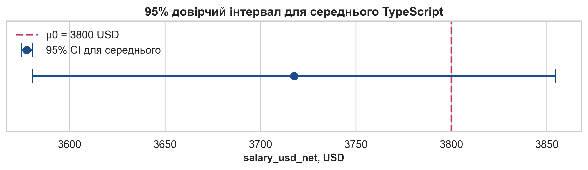
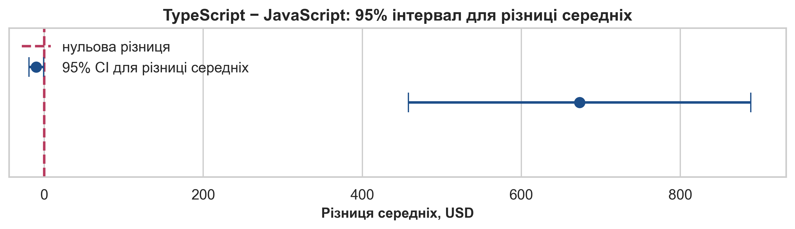

# Лабораторна робота 4. Проведення одно- та двовибіркових t-тестів, тестів на рівність дисперсій (тест Левена) та критерію χ² на реальних наборах даних

**Тема:** *Перевірка статистичних гіпотез для середніх, дисперсійної однорідності та зв’язку категоріальних ознак на реальному зарплатному наборі даних*

**Мета:** *Навчитися очищати реальний CSV-набір із зарплатами українських розробників, формалізувати нульові та альтернативні гіпотези, застосовувати одновибіркові та двовибіркові t-тести, коректно використовувати тест Левена для перевірки однорідності дисперсій, обчислювати критерій χ² незалежності та формулювати строгі висновки за `p-value`, рівнем значущості й довірчими інтервалами.*

---

## Контрольний приклад: Перевірка статистичних гіпотез для зарплат українських розробників

### Постановка задачі

Для контрольного прикладу використаємо реальний набір даних **«Зарплати українських розробників – зима 2026»** з локального файлу `04_data/2025_dec_raw.csv` і контекст аналітичної статті DOU від **12 січня 2026 року** за посиланням [«Зарплати українських розробників — зима 2026»](https://dou.ua/lenta/articles/salary-report-devs-winter-2026/). У статті зазначено, що для аналітики було враховано **4575** анкет розробників, із них **4356** респондентів перебували в Україні, а опублікована медіанна зарплата становила **3450 USD**.

Ці опубліковані числа є зовнішнім контекстом, але не замінюють локальної статистичної обробки. У лабораторній роботі ми очищаємо технічний CSV самостійно, формуємо власну робочу вибірку українських `Software Engineer / Developer` і лише після цього формулюємо гіпотези. Саме такий підхід узгоджується зі змістом лекційної записки 4 про перевірку статистичних гіпотез: спочатку слід чітко визначити `H0` і `H1`, встановити рівень значущості `alpha`, пам’ятати про помилки першого та другого роду, а вже потім обирати статистичний критерій і тлумачити `p-value`.

У цьому контрольному прикладі послідовно виконаємо три перевірки:

1. Одновибірковий t-тест для зрізу TypeScript-розробників проти еталонного значення **3800 USD**.
2. Тест Левена і двовибірковий t-тест для порівняння TypeScript і JavaScript.
3. Критерій χ² незалежності для таблиці `english_group × salary_band`.

### Вхідні дані для аналізу

Після фільтрації залишаємо лише українських розробників, очищаємо грошові значення, нормалізуємо окремі назви мов і доменів, а також створюємо дві допоміжні категорії:

- `english_group`: `Upper-Intermediate / Advanced` проти `Intermediate і нижче`;
- `salary_band`: `>= 3500 USD` проти `< 3500 USD`.

Робоча очищена вибірка містить **4066** спостережень. Узагальнення основних характеристик наведено нижче.

| Показник | Значення |
| :--- | :--- |
| Кількість спостережень | 4066 |
| Середня salary_usd_net | 3815.95 |
| Медіанна salary_usd_net | 3500 |
| Стандартне відхилення salary_usd_net | 2354.12 |
| Перший квартиль Q1 | 2200 |
| Третій квартиль Q3 | 5000 |

Фрагмент очищеної навчальної таблиці:

| main_language | title | specialization | experience_years | salary_usd_net | english_level | company_size |
| :--- | :--- | :--- | :--- | :--- | :--- | :--- |
| Java | Technical Lead |  | 10 | 4566 | Intermediate | Понад 1000 |
| TypeScript | Architect |  | 3 | 7900 | Pre-Intermediate | До 1000 |
| C | Junior |  | 2 | 1500 | Intermediate | До 50 |
| Go | Architect |  | 1 | 5000 | Advanced | До 50 |
| C# / .NET | Architect |  | 3 | 8500 | Upper-Intermediate | До 1000 |
| C# / .NET | Architect |  | 4 | 5700 | Upper-Intermediate | До 1000 |
| TypeScript | Architect |  | 10 | 5000 | Intermediate | До 200 |
| Ruby | Architect |  | 15 | 7200 | Advanced | Понад 1000 |

### Покрокове виконання аналізу

**Крок 1.1. Завантажимо та підготуємо дані**

На етапі підготовки потрібно чітко зберегти логіку лекції про перевірку статистичних гіпотез: до обчислення критеріїв маємо працювати лише з придатною вибіркою, де типи змінних узгоджені з майбутнім тестом. Для цього читаємо неочищений CSV, очищаємо числові поля, формуємо робочу підвибірку українських розробників та створюємо допоміжні категорії `english_group` і `salary_band`.

```python
import re
import numpy as np
import pandas as pd

raw = pd.read_csv("04_data/2025_dec_raw.csv", encoding="utf-8-sig")

def collapse_whitespace(value):
    text = str(value).replace("\n", " ").replace("\r", " ")
    return re.sub(r"\s+", " ", text).strip()

def parse_money(value):
    text = collapse_whitespace(value).replace(",", "")
    return pd.to_numeric(text, errors="coerce")

def parse_first_int(value):
    match = re.search(r"\d+", collapse_whitespace(value))
    return int(match.group()) if match else pd.NA

category = raw.iloc[:, 5].map(collapse_whitespace)
country = raw.iloc[:, 17].map(collapse_whitespace)

df = pd.DataFrame(
    {
        "salary_usd_net": raw.iloc[:, 2].map(parse_money),
        "bonus_usd": raw.iloc[:, 3].map(parse_money),
        "title": raw.iloc[:, 4].map(collapse_whitespace),
        "domain": raw.iloc[:, 7].map(collapse_whitespace),
        "specialization": raw.iloc[:, 8].map(collapse_whitespace),
        "main_language": raw.iloc[:, 10].map(collapse_whitespace),
        "company_size": raw.iloc[:, 12].map(collapse_whitespace),
        "experience_years": raw.iloc[:, 13].map(parse_first_int),
        "english_level": raw.iloc[:, 14].map(collapse_whitespace),
        "age": pd.to_numeric(raw.iloc[:, 16], errors="coerce"),
        "country": country,
    }
)

mask = category.str.contains("Software Engineer / Developer", regex=False)
mask &= country.eq("В Україні")

df = df.loc[mask].dropna(subset=["salary_usd_net", "experience_years", "age"]).copy()
df["experience_years"] = df["experience_years"].astype(int)
df["age"] = df["age"].astype(int)
df["log_salary_usd_net"] = np.log(df["salary_usd_net"])
df["english_group"] = np.where(
    df["english_level"].isin(["Upper-Intermediate", "Advanced"]),
    "Upper-Intermediate / Advanced",
    "Intermediate і нижче",
)
df["salary_band"] = np.where(df["salary_usd_net"] >= 3500, ">= 3500 USD", "< 3500 USD")
```

Після такого очищення одержуємо **4066** валідних спостережень. Локальна медіана вибірки дорівнює **3500.00 USD**, тому вона не зобов’язана буквально збігатися з медіаною зі статті DOU **3450 USD**, оскільки технічний CSV і редакційний аналітичний масив не є тотожними.

**Крок 1.2. Проведемо одновибірковий t-тест для TypeScript-зрізу**

Нехай `H0: μ = 3800 USD`, а `H1: μ \ne 3800 USD` для середньої зарплати TypeScript-розробників. Рівень значущості беремо `alpha = 0.05`. Якщо `H0` істинна, але ми її відхилимо, це буде помилка першого роду з ризиком `α = 0.05`; якщо `H0` хибна, але ми її не відхилимо, виникає помилка другого роду `β`, величина якої залежить від обсягу вибірки та сили ефекту.

Для one-sample t-тесту використовуємо формули

$$
t = \frac{\bar{x} - \mu_0}{s / \sqrt{n}},
$$

$$
\bar{x} \pm t_{1-\alpha/2,\,n-1} \frac{s}{\sqrt{n}}.
$$

```python
from scipy import stats
import numpy as np

df_variant = df[df["main_language"] == "TypeScript"].copy()
salary = df_variant["salary_usd_net"]
mu0 = 3800
alpha = 0.05

t_res = stats.ttest_1samp(salary, popmean=mu0)
n = len(salary)
mean_salary = salary.mean()
std_salary = salary.std(ddof=1)
se = std_salary / np.sqrt(n)
t_crit = stats.t.ppf(1 - alpha / 2, df=n - 1)
ci_mean = (mean_salary - t_crit * se, mean_salary + t_crit * se)
print(t_res, ci_mean)
```

Статистичне зведення для TypeScript-зрізу:

| Показник | Значення |
| :--- | :--- |
| Кількість спостережень | 1004 |
| Середня salary_usd_net | 3717.5807 |
| Медіанна salary_usd_net | 3425 |
| Стандартне відхилення | 2209.1461 |
| Еталонне μ0 | 3800 |
| t-статистика | -1.1821 |
| p-value | 0.2374 |
| Нижня межа 95% CI | 3580.7668 |
| Верхня межа 95% CI | 3854.3945 |




**Проміжний висновок:** у TypeScript-зрізі маємо **1004** спостережень. Значення t-статистики становить **-1.1821**, а `p-value` дорівнює **0.2374**. Отже, на рівні значущості `0.05` маємо висновок: **Немає підстав відхиляти H0** щодо гіпотези `H0: μ = 3800 USD`.

**Крок 1.3. Перевіримо рівність дисперсій і порівняємо TypeScript з JavaScript**

Тепер формулюємо двовибіркову задачу:

$$
H_0: \mu_{TS} = \mu_{JS}, \qquad H_1: \mu_{TS} \ne \mu_{JS}.
$$

Перед t-тестом перевіряємо припущення про рівність дисперсій за тестом Левена. Для нього використовуємо статистику

$$
W = \frac{(N-k)}{k-1} \cdot
\frac{\sum_{i=1}^k n_i(\bar{Z}_{i\cdot} - \bar{Z}_{\cdot\cdot})^2}
{\sum_{i=1}^k \sum_{j=1}^{n_i} (Z_{ij} - \bar{Z}_{i\cdot})^2},
\qquad
Z_{ij} = |X_{ij} - \tilde{X}_i|.
$$

Якщо `p-value` тесту Левена не менше за `0.05`, можна застосувати класичний двовибірковий t-тест із припущенням `equal_var=True`. Якщо ж дисперсії відрізняються, методично коректніше переходити до Welch-підходу. Його узагальнена статистика має вигляд

$$
t = \frac{\bar{x}_1 - \bar{x}_2}
{\sqrt{s_1^2 / n_1 + s_2^2 / n_2}}.
$$

```python
from scipy import stats

df_ts = df[df["main_language"] == "TypeScript"].copy()
df_js = df[df["main_language"] == "JavaScript"].copy()

levene_res = stats.levene(
    df_ts["salary_usd_net"],
    df_js["salary_usd_net"],
    center="median",
)
equal_var = bool(levene_res.pvalue >= 0.05)

t_res = stats.ttest_ind(
    df_ts["salary_usd_net"],
    df_js["salary_usd_net"],
    equal_var=equal_var,
)
print(levene_res, equal_var, t_res)
```

Описові характеристики двох груп:

| Група | n | mean | median | std |
| :--- | :--- | :--- | :--- | :--- |
| TypeScript | 1004 | 3717.58 | 3425 | 2209.15 |
| JavaScript | 516 | 3044.18 | 2800 | 1924.12 |

Підсумок перевірки Левена та двовибіркового t-тесту:

| Показник | Значення |
| :--- | :--- |
| Статистика Левена | 7.5156 |
| p-value Левена | 0.0062 |
| Модель двовибіркового t-тесту | Welch t-test |
| Різниця середніх TypeScript − JavaScript | 673.4024 |
| t-статистика | 6.1382 |
| df | 1172.7975 |
| p-value t-тесту | 0.0000 |
| Нижня межа 95% CI | 458.1576 |
| Верхня межа 95% CI | 888.6472 |




**Проміжний висновок:** для TypeScript та JavaScript маємо відповідно **1004** і **516** спостережень. Статистика Левена дорівнює **7.5156**, `p-value = 0.0062`; отже, для t-тесту використано модель **Welch**. Значення t-статистики становить **6.1382**, `p-value = 0.0000`. Це означає: **Відхиляємо H0** щодо рівності середніх зарплат у двох мовних зрізах.

**Крок 1.4. Перевіримо незалежність `english_group × salary_band` через критерій χ²**

Для категоріальної задачі формулюємо гіпотези:

$$
\begin{aligned}
H_0&: \text{ознаки english\_group та salary\_band незалежні}, \\
H_1&: \text{між ознаками існує статистично значущий зв’язок}.
\end{aligned}
$$

Статистика Пірсона обчислюється за формулою:

$$
\chi^2 = \sum_{i=1}^r \sum_{j=1}^c \frac{(O_{ij} - E_{ij})^2}{E_{ij}},
$$

де очікувані частоти визначаються як

$$
E_{ij} = \frac{(\text{row}_i)(\text{col}_j)}{N}.
$$

```python
from scipy import stats
import pandas as pd

table = pd.crosstab(df["english_group"], df["salary_band"]).reindex(
    index=["Intermediate і нижче", "Upper-Intermediate / Advanced"],
    columns=["< 3500 USD", ">= 3500 USD"],
    fill_value=0,
)

chi2_stat, chi2_pvalue, chi2_dof, expected = stats.chi2_contingency(table)
expected_df = pd.DataFrame(expected, index=table.index, columns=table.columns)
print(table)
print(expected_df.round(2))
print(chi2_stat, chi2_pvalue, chi2_dof)
```

Спостережена таблиця спряженості:

| english_group | < 3500 USD | >= 3500 USD |
| :--- | :--- | :--- |
| Intermediate і нижче | 1013 | 594 |
| Upper-Intermediate / Advanced | 979 | 1480 |

Очікувані частоти:

| english_group | < 3500 USD | >= 3500 USD |
| :--- | :--- | :--- |
| Intermediate і нижче | 787.30 | 819.70 |
| Upper-Intermediate / Advanced | 1204.70 | 1254.30 |

Підсумок χ²-перевірки:

| Показник | Значення |
| :--- | :--- |
| χ²-статистика | 208.8254 |
| Кількість ступенів вільності | 1 |
| p-value | 0.0000 |
| Мінімальна очікувана частота | 787.2956 |


**Проміжний висновок:** χ²-статистика дорівнює **208.8254**, `df = 1`, `p-value = 0.0000`. На рівні `alpha = 0.05` маємо рішення: **Відхиляємо H0** щодо гіпотези незалежності між рівнем англійської та зарплатним порогом.

**Крок 1.5. Узагальнимо результати перевірок**

Послідовність із трьох критеріїв демонструє різні класи статистичних задач на одному й тому самому реальному наборі даних. Одновибірковий t-тест відповідає на питання про відповідність середнього наперед заданому еталону, тест Левена та двовибірковий t-тест дають змогу коректно порівняти дві незалежні підвибірки, а критерій χ² Пірсона працює вже не з числовим середнім, а зі структурою частот у таблиці спряженості.

Саме така логіка узгоджується з лекцією 4: формалізація `H0` і `H1`, контроль ризику помилки першого роду через `alpha`, інтерпретація `p-value`, перевірка припущень і змістовний висновок без підміни статистичної процедури побутовим враженням від даних.

### Результати виконання

1. Після очищення локального CSV одержано **4066** валідних спостережень українських розробників.
2. Для TypeScript-зрізу одновибірковий t-тест проти `μ0 = 3800 USD` дав `t = -1.1821` і `p-value = 0.2374`.
3. Для порівняння TypeScript і JavaScript тест Левена дав `p-value = 0.0062`, а двовибірковий t-тест — `p-value = 0.0000`.
4. Для таблиці `english_group × salary_band` критерій χ² дав `χ² = 208.8254`, `df = 1`, `p-value = 0.0000`.

### Висновки (інтерпретація результатів)

Контрольний приклад показує, що одна й та сама вибірка потребує різних статистичних інструментів залежно від формулювання запитання. Якщо дослідника цікавить середнє значення числової ознаки відносно еталона, базовим інструментом стає одновибірковий t-тест. Якщо треба порівняти дві підвибірки, перед t-тестом слід перевірити однорідність дисперсій, щоб не змішувати Student- і Welch-логіку без формальної підстави.

Критерій χ² працює в іншому режимі: він не оцінює різницю середніх, а перевіряє, чи узгоджується структура частот із моделлю незалежності. Саме тому для категоріальних задач необхідно подавати не лише `χ²` і `p-value`, а й observed/expected tables, без яких зміст відхилення від `H0` залишається неочевидним.

Для коректної інтерпретації всіх трьох критеріїв потрібно чітко відрізняти статистичну значущість від практичної важливості. Навіть дуже мале `p-value` не замінює змістовного аналізу розміру ефекту, напряму відхилення та контексту джерела даних.

### Критичний аналіз результатів (додатково)

1. **Контекст DOU і локального CSV не тотожний.** Стаття DOU використовує власний аналітичний пайплайн і редакційні правила, тоді як лабораторна спирається на технічний неочищений експорт `04_data/2025_dec_raw.csv`.
2. **Тест Левена не є заміною t-тесту.** Його роль полягає у виборі коректної моделі порівняння середніх, а не в автоматичному доведенні наявності чи відсутності відмінності між групами.
3. **χ²-висновок не є причинним висновком.** Навіть якщо залежність статистично значуща, це ще не означає, що рівень англійської причинно визначає належність до зарплатного порогу.

---

## Завдання для самостійного виконання

### <span style="color:red; font-size:1.5em;">Завдання 1. Одновибірковий t-тест для середнього</span>

---

**Для всіх варіантів:**

- **Робочий зріз:** формуйте `df_variant` лише за правилом свого варіанта на очищеній підвибірці українських розробників.

- **Змінна аналізу:** в усіх варіантах використовуйте лише `salary_usd_net`.

- **Параметри перевірки:** встановлюйте `alpha = 0.05`, перевіряйте двобічну гіпотезу `H0: μ = 3800 USD` проти `H1: μ \ne 3800 USD`.

- **Обов’язкові результати:** подайте `n`, `mean`, `median`, `std`, `t-statistic`, `p-value`, 95% CI та короткий змістовний висновок.

**Варіант 1 – TypeScript:**

- **Мета:** Перевірити, чи відрізняється середня `salary_usd_net` для зрізу розробників з основною мовою TypeScript від еталонного значення **3800 USD**.
- **Кроки:**

    1. Сформуйте `df_variant` за правилом `df[df["main_language"] == "TypeScript"].copy()` і зафіксуйте обсяг підвибірки через `df_variant.shape[0]`.
    2. Обчисліть для `salary_usd_net` показники `n`, `mean`, `median`, `std(ddof=1)` та `se = std / np.sqrt(n)`, щоб мати повний базовий опис вибірки.
    3. Запишіть двобічні гіпотези `H0: μ = 3800` і `H1: μ \ne 3800`, встановіть `alpha = 0.05` та виконайте `stats.ttest_1samp(df_variant["salary_usd_net"], popmean=3800)`.
    4. Побудуйте 95% довірчий інтервал для середнього за формулою `x̄ ± t_crit * s / sqrt(n)` і подайте його поряд із t-статистикою та `p-value`.
    5. Сформулюйте строгий висновок: чи є підстави відхиляти `H0`, наскільки напрям відхилення узгоджується зі знаком `x̄ - 3800`, і чи має зріз середню зарплату нижчу, вищу або статистично близьку до еталона.

- **Підказки:** Використовуйте `stats.t.ppf(0.975, df=n-1)` для критичного значення 95% інтервалу. Якщо `p-value < 0.05`, висновок має містити фразу про відхилення `H0`; якщо `p-value >= 0.05`, слід прямо написати, що дані не дають достатніх підстав відхиляти нульову гіпотезу.

**Варіант 2 – JavaScript:**

- **Мета:** Перевірити, чи відрізняється середня `salary_usd_net` для зрізу розробників з основною мовою JavaScript від еталонного значення **3800 USD**.
- **Кроки:**

    1. Сформуйте `df_variant` за правилом `df[df["main_language"] == "JavaScript"].copy()` і зафіксуйте обсяг підвибірки через `df_variant.shape[0]`.
    2. Обчисліть для `salary_usd_net` показники `n`, `mean`, `median`, `std(ddof=1)` та `se = std / np.sqrt(n)`, щоб мати повний базовий опис вибірки.
    3. Запишіть двобічні гіпотези `H0: μ = 3800` і `H1: μ \ne 3800`, встановіть `alpha = 0.05` та виконайте `stats.ttest_1samp(df_variant["salary_usd_net"], popmean=3800)`.
    4. Побудуйте 95% довірчий інтервал для середнього за формулою `x̄ ± t_crit * s / sqrt(n)` і подайте його поряд із t-статистикою та `p-value`.
    5. Сформулюйте строгий висновок: чи є підстави відхиляти `H0`, наскільки напрям відхилення узгоджується зі знаком `x̄ - 3800`, і чи має зріз середню зарплату нижчу, вищу або статистично близьку до еталона.

- **Підказки:** Використовуйте `stats.t.ppf(0.975, df=n-1)` для критичного значення 95% інтервалу. Якщо `p-value < 0.05`, висновок має містити фразу про відхилення `H0`; якщо `p-value >= 0.05`, слід прямо написати, що дані не дають достатніх підстав відхиляти нульову гіпотезу.

**Варіант 3 – C# / .NET:**

- **Мета:** Перевірити, чи відрізняється середня `salary_usd_net` для зрізу розробників з основною мовою C# / .NET від еталонного значення **3800 USD**.
- **Кроки:**

    1. Сформуйте `df_variant` за правилом `df[df["main_language"] == "C# / .NET"].copy()` і зафіксуйте обсяг підвибірки через `df_variant.shape[0]`.
    2. Обчисліть для `salary_usd_net` показники `n`, `mean`, `median`, `std(ddof=1)` та `se = std / np.sqrt(n)`, щоб мати повний базовий опис вибірки.
    3. Запишіть двобічні гіпотези `H0: μ = 3800` і `H1: μ \ne 3800`, встановіть `alpha = 0.05` та виконайте `stats.ttest_1samp(df_variant["salary_usd_net"], popmean=3800)`.
    4. Побудуйте 95% довірчий інтервал для середнього за формулою `x̄ ± t_crit * s / sqrt(n)` і подайте його поряд із t-статистикою та `p-value`.
    5. Сформулюйте строгий висновок: чи є підстави відхиляти `H0`, наскільки напрям відхилення узгоджується зі знаком `x̄ - 3800`, і чи має зріз середню зарплату нижчу, вищу або статистично близьку до еталона.

- **Підказки:** Використовуйте `stats.t.ppf(0.975, df=n-1)` для критичного значення 95% інтервалу. Якщо `p-value < 0.05`, висновок має містити фразу про відхилення `H0`; якщо `p-value >= 0.05`, слід прямо написати, що дані не дають достатніх підстав відхиляти нульову гіпотезу.

**Варіант 4 – Java:**

- **Мета:** Перевірити, чи відрізняється середня `salary_usd_net` для зрізу розробників з основною мовою Java від еталонного значення **3800 USD**.
- **Кроки:**

    1. Сформуйте `df_variant` за правилом `df[df["main_language"] == "Java"].copy()` і зафіксуйте обсяг підвибірки через `df_variant.shape[0]`.
    2. Обчисліть для `salary_usd_net` показники `n`, `mean`, `median`, `std(ddof=1)` та `se = std / np.sqrt(n)`, щоб мати повний базовий опис вибірки.
    3. Запишіть двобічні гіпотези `H0: μ = 3800` і `H1: μ \ne 3800`, встановіть `alpha = 0.05` та виконайте `stats.ttest_1samp(df_variant["salary_usd_net"], popmean=3800)`.
    4. Побудуйте 95% довірчий інтервал для середнього за формулою `x̄ ± t_crit * s / sqrt(n)` і подайте його поряд із t-статистикою та `p-value`.
    5. Сформулюйте строгий висновок: чи є підстави відхиляти `H0`, наскільки напрям відхилення узгоджується зі знаком `x̄ - 3800`, і чи має зріз середню зарплату нижчу, вищу або статистично близьку до еталона.

- **Підказки:** Використовуйте `stats.t.ppf(0.975, df=n-1)` для критичного значення 95% інтервалу. Якщо `p-value < 0.05`, висновок має містити фразу про відхилення `H0`; якщо `p-value >= 0.05`, слід прямо написати, що дані не дають достатніх підстав відхиляти нульову гіпотезу.

**Варіант 5 – PHP:**

- **Мета:** Перевірити, чи відрізняється середня `salary_usd_net` для зрізу розробників з основною мовою PHP від еталонного значення **3800 USD**.
- **Кроки:**

    1. Сформуйте `df_variant` за правилом `df[df["main_language"] == "PHP"].copy()` і зафіксуйте обсяг підвибірки через `df_variant.shape[0]`.
    2. Обчисліть для `salary_usd_net` показники `n`, `mean`, `median`, `std(ddof=1)` та `se = std / np.sqrt(n)`, щоб мати повний базовий опис вибірки.
    3. Запишіть двобічні гіпотези `H0: μ = 3800` і `H1: μ \ne 3800`, встановіть `alpha = 0.05` та виконайте `stats.ttest_1samp(df_variant["salary_usd_net"], popmean=3800)`.
    4. Побудуйте 95% довірчий інтервал для середнього за формулою `x̄ ± t_crit * s / sqrt(n)` і подайте його поряд із t-статистикою та `p-value`.
    5. Сформулюйте строгий висновок: чи є підстави відхиляти `H0`, наскільки напрям відхилення узгоджується зі знаком `x̄ - 3800`, і чи має зріз середню зарплату нижчу, вищу або статистично близьку до еталона.

- **Підказки:** Використовуйте `stats.t.ppf(0.975, df=n-1)` для критичного значення 95% інтервалу. Якщо `p-value < 0.05`, висновок має містити фразу про відхилення `H0`; якщо `p-value >= 0.05`, слід прямо написати, що дані не дають достатніх підстав відхиляти нульову гіпотезу.

**Варіант 6 – Python:**

- **Мета:** Перевірити, чи відрізняється середня `salary_usd_net` для зрізу розробників з основною мовою Python від еталонного значення **3800 USD**.
- **Кроки:**

    1. Сформуйте `df_variant` за правилом `df[df["main_language"] == "Python"].copy()` і зафіксуйте обсяг підвибірки через `df_variant.shape[0]`.
    2. Обчисліть для `salary_usd_net` показники `n`, `mean`, `median`, `std(ddof=1)` та `se = std / np.sqrt(n)`, щоб мати повний базовий опис вибірки.
    3. Запишіть двобічні гіпотези `H0: μ = 3800` і `H1: μ \ne 3800`, встановіть `alpha = 0.05` та виконайте `stats.ttest_1samp(df_variant["salary_usd_net"], popmean=3800)`.
    4. Побудуйте 95% довірчий інтервал для середнього за формулою `x̄ ± t_crit * s / sqrt(n)` і подайте його поряд із t-статистикою та `p-value`.
    5. Сформулюйте строгий висновок: чи є підстави відхиляти `H0`, наскільки напрям відхилення узгоджується зі знаком `x̄ - 3800`, і чи має зріз середню зарплату нижчу, вищу або статистично близьку до еталона.

- **Підказки:** Використовуйте `stats.t.ppf(0.975, df=n-1)` для критичного значення 95% інтервалу. Якщо `p-value < 0.05`, висновок має містити фразу про відхилення `H0`; якщо `p-value >= 0.05`, слід прямо написати, що дані не дають достатніх підстав відхиляти нульову гіпотезу.

**Варіант 7 – Back-end:**

- **Мета:** Перевірити, чи відрізняється середня `salary_usd_net` для зрізу розробників зі спеціалізацією Back-end розробка від еталонного значення **3800 USD**.
- **Кроки:**

    1. Сформуйте `df_variant` за правилом `df[df["specialization"] == "Back-end розробка"].copy()` і зафіксуйте обсяг підвибірки через `df_variant.shape[0]`.
    2. Обчисліть для `salary_usd_net` показники `n`, `mean`, `median`, `std(ddof=1)` та `se = std / np.sqrt(n)`, щоб мати повний базовий опис вибірки.
    3. Запишіть двобічні гіпотези `H0: μ = 3800` і `H1: μ \ne 3800`, встановіть `alpha = 0.05` та виконайте `stats.ttest_1samp(df_variant["salary_usd_net"], popmean=3800)`.
    4. Побудуйте 95% довірчий інтервал для середнього за формулою `x̄ ± t_crit * s / sqrt(n)` і подайте його поряд із t-статистикою та `p-value`.
    5. Сформулюйте строгий висновок: чи є підстави відхиляти `H0`, наскільки напрям відхилення узгоджується зі знаком `x̄ - 3800`, і чи має зріз середню зарплату нижчу, вищу або статистично близьку до еталона.

- **Підказки:** Використовуйте `stats.t.ppf(0.975, df=n-1)` для критичного значення 95% інтервалу. Якщо `p-value < 0.05`, висновок має містити фразу про відхилення `H0`; якщо `p-value >= 0.05`, слід прямо написати, що дані не дають достатніх підстав відхиляти нульову гіпотезу.

**Варіант 8 – Front-end:**

- **Мета:** Перевірити, чи відрізняється середня `salary_usd_net` для зрізу розробників зі спеціалізацією Front-end розробка від еталонного значення **3800 USD**.
- **Кроки:**

    1. Сформуйте `df_variant` за правилом `df[df["specialization"] == "Front-end розробка"].copy()` і зафіксуйте обсяг підвибірки через `df_variant.shape[0]`.
    2. Обчисліть для `salary_usd_net` показники `n`, `mean`, `median`, `std(ddof=1)` та `se = std / np.sqrt(n)`, щоб мати повний базовий опис вибірки.
    3. Запишіть двобічні гіпотези `H0: μ = 3800` і `H1: μ \ne 3800`, встановіть `alpha = 0.05` та виконайте `stats.ttest_1samp(df_variant["salary_usd_net"], popmean=3800)`.
    4. Побудуйте 95% довірчий інтервал для середнього за формулою `x̄ ± t_crit * s / sqrt(n)` і подайте його поряд із t-статистикою та `p-value`.
    5. Сформулюйте строгий висновок: чи є підстави відхиляти `H0`, наскільки напрям відхилення узгоджується зі знаком `x̄ - 3800`, і чи має зріз середню зарплату нижчу, вищу або статистично близьку до еталона.

- **Підказки:** Використовуйте `stats.t.ppf(0.975, df=n-1)` для критичного значення 95% інтервалу. Якщо `p-value < 0.05`, висновок має містити фразу про відхилення `H0`; якщо `p-value >= 0.05`, слід прямо написати, що дані не дають достатніх підстав відхиляти нульову гіпотезу.

**Варіант 9 – Full Stack:**

- **Мета:** Перевірити, чи відрізняється середня `salary_usd_net` для зрізу розробників зі спеціалізацією Full Stack розробка від еталонного значення **3800 USD**.
- **Кроки:**

    1. Сформуйте `df_variant` за правилом `df[df["specialization"] == "Full Stack розробка"].copy()` і зафіксуйте обсяг підвибірки через `df_variant.shape[0]`.
    2. Обчисліть для `salary_usd_net` показники `n`, `mean`, `median`, `std(ddof=1)` та `se = std / np.sqrt(n)`, щоб мати повний базовий опис вибірки.
    3. Запишіть двобічні гіпотези `H0: μ = 3800` і `H1: μ \ne 3800`, встановіть `alpha = 0.05` та виконайте `stats.ttest_1samp(df_variant["salary_usd_net"], popmean=3800)`.
    4. Побудуйте 95% довірчий інтервал для середнього за формулою `x̄ ± t_crit * s / sqrt(n)` і подайте його поряд із t-статистикою та `p-value`.
    5. Сформулюйте строгий висновок: чи є підстави відхиляти `H0`, наскільки напрям відхилення узгоджується зі знаком `x̄ - 3800`, і чи має зріз середню зарплату нижчу, вищу або статистично близьку до еталона.

- **Підказки:** Використовуйте `stats.t.ppf(0.975, df=n-1)` для критичного значення 95% інтервалу. Якщо `p-value < 0.05`, висновок має містити фразу про відхилення `H0`; якщо `p-value >= 0.05`, слід прямо написати, що дані не дають достатніх підстав відхиляти нульову гіпотезу.

**Варіант 10 – Mobile:**

- **Мета:** Перевірити, чи відрізняється середня `salary_usd_net` для зрізу розробників зі спеціалізацією Mobile розробка від еталонного значення **3800 USD**.
- **Кроки:**

    1. Сформуйте `df_variant` за правилом `df[df["specialization"] == "Mobile розробка"].copy()` і зафіксуйте обсяг підвибірки через `df_variant.shape[0]`.
    2. Обчисліть для `salary_usd_net` показники `n`, `mean`, `median`, `std(ddof=1)` та `se = std / np.sqrt(n)`, щоб мати повний базовий опис вибірки.
    3. Запишіть двобічні гіпотези `H0: μ = 3800` і `H1: μ \ne 3800`, встановіть `alpha = 0.05` та виконайте `stats.ttest_1samp(df_variant["salary_usd_net"], popmean=3800)`.
    4. Побудуйте 95% довірчий інтервал для середнього за формулою `x̄ ± t_crit * s / sqrt(n)` і подайте його поряд із t-статистикою та `p-value`.
    5. Сформулюйте строгий висновок: чи є підстави відхиляти `H0`, наскільки напрям відхилення узгоджується зі знаком `x̄ - 3800`, і чи має зріз середню зарплату нижчу, вищу або статистично близьку до еталона.

- **Підказки:** Використовуйте `stats.t.ppf(0.975, df=n-1)` для критичного значення 95% інтервалу. Якщо `p-value < 0.05`, висновок має містити фразу про відхилення `H0`; якщо `p-value >= 0.05`, слід прямо написати, що дані не дають достатніх підстав відхиляти нульову гіпотезу.

**Варіант 11 – Desktop:**

- **Мета:** Перевірити, чи відрізняється середня `salary_usd_net` для зрізу розробників зі спеціалізацією Desktop від еталонного значення **3800 USD**.
- **Кроки:**

    1. Сформуйте `df_variant` за правилом `df[df["specialization"] == "Desktop"].copy()` і зафіксуйте обсяг підвибірки через `df_variant.shape[0]`.
    2. Обчисліть для `salary_usd_net` показники `n`, `mean`, `median`, `std(ddof=1)` та `se = std / np.sqrt(n)`, щоб мати повний базовий опис вибірки.
    3. Запишіть двобічні гіпотези `H0: μ = 3800` і `H1: μ \ne 3800`, встановіть `alpha = 0.05` та виконайте `stats.ttest_1samp(df_variant["salary_usd_net"], popmean=3800)`.
    4. Побудуйте 95% довірчий інтервал для середнього за формулою `x̄ ± t_crit * s / sqrt(n)` і подайте його поряд із t-статистикою та `p-value`.
    5. Сформулюйте строгий висновок: чи є підстави відхиляти `H0`, наскільки напрям відхилення узгоджується зі знаком `x̄ - 3800`, і чи має зріз середню зарплату нижчу, вищу або статистично близьку до еталона.

- **Підказки:** Використовуйте `stats.t.ppf(0.975, df=n-1)` для критичного значення 95% інтервалу. Якщо `p-value < 0.05`, висновок має містити фразу про відхилення `H0`; якщо `p-value >= 0.05`, слід прямо написати, що дані не дають достатніх підстав відхиляти нульову гіпотезу.

**Варіант 12 – Embedded:**

- **Мета:** Перевірити, чи відрізняється середня `salary_usd_net` для зрізу розробників зі спеціалізацією Embedded від еталонного значення **3800 USD**.
- **Кроки:**

    1. Сформуйте `df_variant` за правилом `df[df["specialization"] == "Embedded"].copy()` і зафіксуйте обсяг підвибірки через `df_variant.shape[0]`.
    2. Обчисліть для `salary_usd_net` показники `n`, `mean`, `median`, `std(ddof=1)` та `se = std / np.sqrt(n)`, щоб мати повний базовий опис вибірки.
    3. Запишіть двобічні гіпотези `H0: μ = 3800` і `H1: μ \ne 3800`, встановіть `alpha = 0.05` та виконайте `stats.ttest_1samp(df_variant["salary_usd_net"], popmean=3800)`.
    4. Побудуйте 95% довірчий інтервал для середнього за формулою `x̄ ± t_crit * s / sqrt(n)` і подайте його поряд із t-статистикою та `p-value`.
    5. Сформулюйте строгий висновок: чи є підстави відхиляти `H0`, наскільки напрям відхилення узгоджується зі знаком `x̄ - 3800`, і чи має зріз середню зарплату нижчу, вищу або статистично близьку до еталона.

- **Підказки:** Використовуйте `stats.t.ppf(0.975, df=n-1)` для критичного значення 95% інтервалу. Якщо `p-value < 0.05`, висновок має містити фразу про відхилення `H0`; якщо `p-value >= 0.05`, слід прямо написати, що дані не дають достатніх підстав відхиляти нульову гіпотезу.

**Варіант 13 – Fintech / Banking / Capital Management:**

- **Мета:** Перевірити, чи відрізняється середня `salary_usd_net` для зрізу розробників домену Fintech / Banking / Capital Management від еталонного значення **3800 USD**.
- **Кроки:**

    1. Сформуйте `df_variant` за правилом `df[df["domain"] == "Fintech / Banking / Capital Management"].copy()` і зафіксуйте обсяг підвибірки через `df_variant.shape[0]`.
    2. Обчисліть для `salary_usd_net` показники `n`, `mean`, `median`, `std(ddof=1)` та `se = std / np.sqrt(n)`, щоб мати повний базовий опис вибірки.
    3. Запишіть двобічні гіпотези `H0: μ = 3800` і `H1: μ \ne 3800`, встановіть `alpha = 0.05` та виконайте `stats.ttest_1samp(df_variant["salary_usd_net"], popmean=3800)`.
    4. Побудуйте 95% довірчий інтервал для середнього за формулою `x̄ ± t_crit * s / sqrt(n)` і подайте його поряд із t-статистикою та `p-value`.
    5. Сформулюйте строгий висновок: чи є підстави відхиляти `H0`, наскільки напрям відхилення узгоджується зі знаком `x̄ - 3800`, і чи має зріз середню зарплату нижчу, вищу або статистично близьку до еталона.

- **Підказки:** Використовуйте `stats.t.ppf(0.975, df=n-1)` для критичного значення 95% інтервалу. Якщо `p-value < 0.05`, висновок має містити фразу про відхилення `H0`; якщо `p-value >= 0.05`, слід прямо написати, що дані не дають достатніх підстав відхиляти нульову гіпотезу.

**Варіант 14 – E-commerce:**

- **Мета:** Перевірити, чи відрізняється середня `salary_usd_net` для зрізу розробників домену E-commerce від еталонного значення **3800 USD**.
- **Кроки:**

    1. Сформуйте `df_variant` за правилом `df[df["domain"] == "E-commerce"].copy()` і зафіксуйте обсяг підвибірки через `df_variant.shape[0]`.
    2. Обчисліть для `salary_usd_net` показники `n`, `mean`, `median`, `std(ddof=1)` та `se = std / np.sqrt(n)`, щоб мати повний базовий опис вибірки.
    3. Запишіть двобічні гіпотези `H0: μ = 3800` і `H1: μ \ne 3800`, встановіть `alpha = 0.05` та виконайте `stats.ttest_1samp(df_variant["salary_usd_net"], popmean=3800)`.
    4. Побудуйте 95% довірчий інтервал для середнього за формулою `x̄ ± t_crit * s / sqrt(n)` і подайте його поряд із t-статистикою та `p-value`.
    5. Сформулюйте строгий висновок: чи є підстави відхиляти `H0`, наскільки напрям відхилення узгоджується зі знаком `x̄ - 3800`, і чи має зріз середню зарплату нижчу, вищу або статистично близьку до еталона.

- **Підказки:** Використовуйте `stats.t.ppf(0.975, df=n-1)` для критичного значення 95% інтервалу. Якщо `p-value < 0.05`, висновок має містити фразу про відхилення `H0`; якщо `p-value >= 0.05`, слід прямо написати, що дані не дають достатніх підстав відхиляти нульову гіпотезу.

**Варіант 15 – Gambling:**

- **Мета:** Перевірити, чи відрізняється середня `salary_usd_net` для зрізу розробників домену Gambling від еталонного значення **3800 USD**.
- **Кроки:**

    1. Сформуйте `df_variant` за правилом `df[df["domain"] == "Gambling"].copy()` і зафіксуйте обсяг підвибірки через `df_variant.shape[0]`.
    2. Обчисліть для `salary_usd_net` показники `n`, `mean`, `median`, `std(ddof=1)` та `se = std / np.sqrt(n)`, щоб мати повний базовий опис вибірки.
    3. Запишіть двобічні гіпотези `H0: μ = 3800` і `H1: μ \ne 3800`, встановіть `alpha = 0.05` та виконайте `stats.ttest_1samp(df_variant["salary_usd_net"], popmean=3800)`.
    4. Побудуйте 95% довірчий інтервал для середнього за формулою `x̄ ± t_crit * s / sqrt(n)` і подайте його поряд із t-статистикою та `p-value`.
    5. Сформулюйте строгий висновок: чи є підстави відхиляти `H0`, наскільки напрям відхилення узгоджується зі знаком `x̄ - 3800`, і чи має зріз середню зарплату нижчу, вищу або статистично близьку до еталона.

- **Підказки:** Використовуйте `stats.t.ppf(0.975, df=n-1)` для критичного значення 95% інтервалу. Якщо `p-value < 0.05`, висновок має містити фразу про відхилення `H0`; якщо `p-value >= 0.05`, слід прямо написати, що дані не дають достатніх підстав відхиляти нульову гіпотезу.

**Варіант 16 – Medtech / Healthcare:**

- **Мета:** Перевірити, чи відрізняється середня `salary_usd_net` для зрізу розробників домену Medtech / Healthcare від еталонного значення **3800 USD**.
- **Кроки:**

    1. Сформуйте `df_variant` за правилом `df[df["domain"] == "Medtech / Healthcare"].copy()` і зафіксуйте обсяг підвибірки через `df_variant.shape[0]`.
    2. Обчисліть для `salary_usd_net` показники `n`, `mean`, `median`, `std(ddof=1)` та `se = std / np.sqrt(n)`, щоб мати повний базовий опис вибірки.
    3. Запишіть двобічні гіпотези `H0: μ = 3800` і `H1: μ \ne 3800`, встановіть `alpha = 0.05` та виконайте `stats.ttest_1samp(df_variant["salary_usd_net"], popmean=3800)`.
    4. Побудуйте 95% довірчий інтервал для середнього за формулою `x̄ ± t_crit * s / sqrt(n)` і подайте його поряд із t-статистикою та `p-value`.
    5. Сформулюйте строгий висновок: чи є підстави відхиляти `H0`, наскільки напрям відхилення узгоджується зі знаком `x̄ - 3800`, і чи має зріз середню зарплату нижчу, вищу або статистично близьку до еталона.

- **Підказки:** Використовуйте `stats.t.ppf(0.975, df=n-1)` для критичного значення 95% інтервалу. Якщо `p-value < 0.05`, висновок має містити фразу про відхилення `H0`; якщо `p-value >= 0.05`, слід прямо написати, що дані не дають достатніх підстав відхиляти нульову гіпотезу.

**Варіант 17 – SaaS:**

- **Мета:** Перевірити, чи відрізняється середня `salary_usd_net` для зрізу розробників домену SaaS від еталонного значення **3800 USD**.
- **Кроки:**

    1. Сформуйте `df_variant` за правилом `df[df["domain"] == "SaaS"].copy()` і зафіксуйте обсяг підвибірки через `df_variant.shape[0]`.
    2. Обчисліть для `salary_usd_net` показники `n`, `mean`, `median`, `std(ddof=1)` та `se = std / np.sqrt(n)`, щоб мати повний базовий опис вибірки.
    3. Запишіть двобічні гіпотези `H0: μ = 3800` і `H1: μ \ne 3800`, встановіть `alpha = 0.05` та виконайте `stats.ttest_1samp(df_variant["salary_usd_net"], popmean=3800)`.
    4. Побудуйте 95% довірчий інтервал для середнього за формулою `x̄ ± t_crit * s / sqrt(n)` і подайте його поряд із t-статистикою та `p-value`.
    5. Сформулюйте строгий висновок: чи є підстави відхиляти `H0`, наскільки напрям відхилення узгоджується зі знаком `x̄ - 3800`, і чи має зріз середню зарплату нижчу, вищу або статистично близьку до еталона.

- **Підказки:** Використовуйте `stats.t.ppf(0.975, df=n-1)` для критичного значення 95% інтервалу. Якщо `p-value < 0.05`, висновок має містити фразу про відхилення `H0`; якщо `p-value >= 0.05`, слід прямо написати, що дані не дають достатніх підстав відхиляти нульову гіпотезу.

**Варіант 18 – GameDev:**

- **Мета:** Перевірити, чи відрізняється середня `salary_usd_net` для зрізу розробників домену GameDev від еталонного значення **3800 USD**.
- **Кроки:**

    1. Сформуйте `df_variant` за правилом `df[df["domain"] == "GameDev"].copy()` і зафіксуйте обсяг підвибірки через `df_variant.shape[0]`.
    2. Обчисліть для `salary_usd_net` показники `n`, `mean`, `median`, `std(ddof=1)` та `se = std / np.sqrt(n)`, щоб мати повний базовий опис вибірки.
    3. Запишіть двобічні гіпотези `H0: μ = 3800` і `H1: μ \ne 3800`, встановіть `alpha = 0.05` та виконайте `stats.ttest_1samp(df_variant["salary_usd_net"], popmean=3800)`.
    4. Побудуйте 95% довірчий інтервал для середнього за формулою `x̄ ± t_crit * s / sqrt(n)` і подайте його поряд із t-статистикою та `p-value`.
    5. Сформулюйте строгий висновок: чи є підстави відхиляти `H0`, наскільки напрям відхилення узгоджується зі знаком `x̄ - 3800`, і чи має зріз середню зарплату нижчу, вищу або статистично близьку до еталона.

- **Підказки:** Використовуйте `stats.t.ppf(0.975, df=n-1)` для критичного значення 95% інтервалу. Якщо `p-value < 0.05`, висновок має містити фразу про відхилення `H0`; якщо `p-value >= 0.05`, слід прямо написати, що дані не дають достатніх підстав відхиляти нульову гіпотезу.

**Варіант 19 – 1-2 роки стажу:**

- **Мета:** Перевірити, чи відрізняється середня `salary_usd_net` для зрізу розробників зі стажем від 1 до 2 років включно від еталонного значення **3800 USD**.
- **Кроки:**

    1. Сформуйте `df_variant` за правилом `df[df["experience_years"].between(1, 2)].copy()` і зафіксуйте обсяг підвибірки через `df_variant.shape[0]`.
    2. Обчисліть для `salary_usd_net` показники `n`, `mean`, `median`, `std(ddof=1)` та `se = std / np.sqrt(n)`, щоб мати повний базовий опис вибірки.
    3. Запишіть двобічні гіпотези `H0: μ = 3800` і `H1: μ \ne 3800`, встановіть `alpha = 0.05` та виконайте `stats.ttest_1samp(df_variant["salary_usd_net"], popmean=3800)`.
    4. Побудуйте 95% довірчий інтервал для середнього за формулою `x̄ ± t_crit * s / sqrt(n)` і подайте його поряд із t-статистикою та `p-value`.
    5. Сформулюйте строгий висновок: чи є підстави відхиляти `H0`, наскільки напрям відхилення узгоджується зі знаком `x̄ - 3800`, і чи має зріз середню зарплату нижчу, вищу або статистично близьку до еталона.

- **Підказки:** Використовуйте `stats.t.ppf(0.975, df=n-1)` для критичного значення 95% інтервалу. Якщо `p-value < 0.05`, висновок має містити фразу про відхилення `H0`; якщо `p-value >= 0.05`, слід прямо написати, що дані не дають достатніх підстав відхиляти нульову гіпотезу.

**Варіант 20 – 3-4 роки стажу:**

- **Мета:** Перевірити, чи відрізняється середня `salary_usd_net` для зрізу розробників зі стажем від 3 до 4 років включно від еталонного значення **3800 USD**.
- **Кроки:**

    1. Сформуйте `df_variant` за правилом `df[df["experience_years"].between(3, 4)].copy()` і зафіксуйте обсяг підвибірки через `df_variant.shape[0]`.
    2. Обчисліть для `salary_usd_net` показники `n`, `mean`, `median`, `std(ddof=1)` та `se = std / np.sqrt(n)`, щоб мати повний базовий опис вибірки.
    3. Запишіть двобічні гіпотези `H0: μ = 3800` і `H1: μ \ne 3800`, встановіть `alpha = 0.05` та виконайте `stats.ttest_1samp(df_variant["salary_usd_net"], popmean=3800)`.
    4. Побудуйте 95% довірчий інтервал для середнього за формулою `x̄ ± t_crit * s / sqrt(n)` і подайте його поряд із t-статистикою та `p-value`.
    5. Сформулюйте строгий висновок: чи є підстави відхиляти `H0`, наскільки напрям відхилення узгоджується зі знаком `x̄ - 3800`, і чи має зріз середню зарплату нижчу, вищу або статистично близьку до еталона.

- **Підказки:** Використовуйте `stats.t.ppf(0.975, df=n-1)` для критичного значення 95% інтервалу. Якщо `p-value < 0.05`, висновок має містити фразу про відхилення `H0`; якщо `p-value >= 0.05`, слід прямо написати, що дані не дають достатніх підстав відхиляти нульову гіпотезу.

**Варіант 21 – 5-6 років стажу:**

- **Мета:** Перевірити, чи відрізняється середня `salary_usd_net` для зрізу розробників зі стажем від 5 до 6 років включно від еталонного значення **3800 USD**.
- **Кроки:**

    1. Сформуйте `df_variant` за правилом `df[df["experience_years"].between(5, 6)].copy()` і зафіксуйте обсяг підвибірки через `df_variant.shape[0]`.
    2. Обчисліть для `salary_usd_net` показники `n`, `mean`, `median`, `std(ddof=1)` та `se = std / np.sqrt(n)`, щоб мати повний базовий опис вибірки.
    3. Запишіть двобічні гіпотези `H0: μ = 3800` і `H1: μ \ne 3800`, встановіть `alpha = 0.05` та виконайте `stats.ttest_1samp(df_variant["salary_usd_net"], popmean=3800)`.
    4. Побудуйте 95% довірчий інтервал для середнього за формулою `x̄ ± t_crit * s / sqrt(n)` і подайте його поряд із t-статистикою та `p-value`.
    5. Сформулюйте строгий висновок: чи є підстави відхиляти `H0`, наскільки напрям відхилення узгоджується зі знаком `x̄ - 3800`, і чи має зріз середню зарплату нижчу, вищу або статистично близьку до еталона.

- **Підказки:** Використовуйте `stats.t.ppf(0.975, df=n-1)` для критичного значення 95% інтервалу. Якщо `p-value < 0.05`, висновок має містити фразу про відхилення `H0`; якщо `p-value >= 0.05`, слід прямо написати, що дані не дають достатніх підстав відхиляти нульову гіпотезу.

**Варіант 22 – 7-8 років стажу:**

- **Мета:** Перевірити, чи відрізняється середня `salary_usd_net` для зрізу розробників зі стажем від 7 до 8 років включно від еталонного значення **3800 USD**.
- **Кроки:**

    1. Сформуйте `df_variant` за правилом `df[df["experience_years"].between(7, 8)].copy()` і зафіксуйте обсяг підвибірки через `df_variant.shape[0]`.
    2. Обчисліть для `salary_usd_net` показники `n`, `mean`, `median`, `std(ddof=1)` та `se = std / np.sqrt(n)`, щоб мати повний базовий опис вибірки.
    3. Запишіть двобічні гіпотези `H0: μ = 3800` і `H1: μ \ne 3800`, встановіть `alpha = 0.05` та виконайте `stats.ttest_1samp(df_variant["salary_usd_net"], popmean=3800)`.
    4. Побудуйте 95% довірчий інтервал для середнього за формулою `x̄ ± t_crit * s / sqrt(n)` і подайте його поряд із t-статистикою та `p-value`.
    5. Сформулюйте строгий висновок: чи є підстави відхиляти `H0`, наскільки напрям відхилення узгоджується зі знаком `x̄ - 3800`, і чи має зріз середню зарплату нижчу, вищу або статистично близьку до еталона.

- **Підказки:** Використовуйте `stats.t.ppf(0.975, df=n-1)` для критичного значення 95% інтервалу. Якщо `p-value < 0.05`, висновок має містити фразу про відхилення `H0`; якщо `p-value >= 0.05`, слід прямо написати, що дані не дають достатніх підстав відхиляти нульову гіпотезу.

**Варіант 23 – 9-10 років стажу:**

- **Мета:** Перевірити, чи відрізняється середня `salary_usd_net` для зрізу розробників зі стажем від 9 до 10 років включно від еталонного значення **3800 USD**.
- **Кроки:**

    1. Сформуйте `df_variant` за правилом `df[df["experience_years"].between(9, 10)].copy()` і зафіксуйте обсяг підвибірки через `df_variant.shape[0]`.
    2. Обчисліть для `salary_usd_net` показники `n`, `mean`, `median`, `std(ddof=1)` та `se = std / np.sqrt(n)`, щоб мати повний базовий опис вибірки.
    3. Запишіть двобічні гіпотези `H0: μ = 3800` і `H1: μ \ne 3800`, встановіть `alpha = 0.05` та виконайте `stats.ttest_1samp(df_variant["salary_usd_net"], popmean=3800)`.
    4. Побудуйте 95% довірчий інтервал для середнього за формулою `x̄ ± t_crit * s / sqrt(n)` і подайте його поряд із t-статистикою та `p-value`.
    5. Сформулюйте строгий висновок: чи є підстави відхиляти `H0`, наскільки напрям відхилення узгоджується зі знаком `x̄ - 3800`, і чи має зріз середню зарплату нижчу, вищу або статистично близьку до еталона.

- **Підказки:** Використовуйте `stats.t.ppf(0.975, df=n-1)` для критичного значення 95% інтервалу. Якщо `p-value < 0.05`, висновок має містити фразу про відхилення `H0`; якщо `p-value >= 0.05`, слід прямо написати, що дані не дають достатніх підстав відхиляти нульову гіпотезу.

**Варіант 24 – 11+ років стажу:**

- **Мета:** Перевірити, чи відрізняється середня `salary_usd_net` для зрізу розробників зі стажем 11 років і більше від еталонного значення **3800 USD**.
- **Кроки:**

    1. Сформуйте `df_variant` за правилом `df[df["experience_years"] >= 11].copy()` і зафіксуйте обсяг підвибірки через `df_variant.shape[0]`.
    2. Обчисліть для `salary_usd_net` показники `n`, `mean`, `median`, `std(ddof=1)` та `se = std / np.sqrt(n)`, щоб мати повний базовий опис вибірки.
    3. Запишіть двобічні гіпотези `H0: μ = 3800` і `H1: μ \ne 3800`, встановіть `alpha = 0.05` та виконайте `stats.ttest_1samp(df_variant["salary_usd_net"], popmean=3800)`.
    4. Побудуйте 95% довірчий інтервал для середнього за формулою `x̄ ± t_crit * s / sqrt(n)` і подайте його поряд із t-статистикою та `p-value`.
    5. Сформулюйте строгий висновок: чи є підстави відхиляти `H0`, наскільки напрям відхилення узгоджується зі знаком `x̄ - 3800`, і чи має зріз середню зарплату нижчу, вищу або статистично близьку до еталона.

- **Підказки:** Використовуйте `stats.t.ppf(0.975, df=n-1)` для критичного значення 95% інтервалу. Якщо `p-value < 0.05`, висновок має містити фразу про відхилення `H0`; якщо `p-value >= 0.05`, слід прямо написати, що дані не дають достатніх підстав відхиляти нульову гіпотезу.

**Варіант 25 – До 10 спеціалістів:**

- **Мета:** Перевірити, чи відрізняється середня `salary_usd_net` для зрізу розробників із компаній розміру До 10 спеціалістів від еталонного значення **3800 USD**.
- **Кроки:**

    1. Сформуйте `df_variant` за правилом `df[df["company_size"] == "До 10 спеціалістів"].copy()` і зафіксуйте обсяг підвибірки через `df_variant.shape[0]`.
    2. Обчисліть для `salary_usd_net` показники `n`, `mean`, `median`, `std(ddof=1)` та `se = std / np.sqrt(n)`, щоб мати повний базовий опис вибірки.
    3. Запишіть двобічні гіпотези `H0: μ = 3800` і `H1: μ \ne 3800`, встановіть `alpha = 0.05` та виконайте `stats.ttest_1samp(df_variant["salary_usd_net"], popmean=3800)`.
    4. Побудуйте 95% довірчий інтервал для середнього за формулою `x̄ ± t_crit * s / sqrt(n)` і подайте його поряд із t-статистикою та `p-value`.
    5. Сформулюйте строгий висновок: чи є підстави відхиляти `H0`, наскільки напрям відхилення узгоджується зі знаком `x̄ - 3800`, і чи має зріз середню зарплату нижчу, вищу або статистично близьку до еталона.

- **Підказки:** Використовуйте `stats.t.ppf(0.975, df=n-1)` для критичного значення 95% інтервалу. Якщо `p-value < 0.05`, висновок має містити фразу про відхилення `H0`; якщо `p-value >= 0.05`, слід прямо написати, що дані не дають достатніх підстав відхиляти нульову гіпотезу.

**Варіант 26 – До 50:**

- **Мета:** Перевірити, чи відрізняється середня `salary_usd_net` для зрізу розробників із компаній розміру До 50 від еталонного значення **3800 USD**.
- **Кроки:**

    1. Сформуйте `df_variant` за правилом `df[df["company_size"] == "До 50"].copy()` і зафіксуйте обсяг підвибірки через `df_variant.shape[0]`.
    2. Обчисліть для `salary_usd_net` показники `n`, `mean`, `median`, `std(ddof=1)` та `se = std / np.sqrt(n)`, щоб мати повний базовий опис вибірки.
    3. Запишіть двобічні гіпотези `H0: μ = 3800` і `H1: μ \ne 3800`, встановіть `alpha = 0.05` та виконайте `stats.ttest_1samp(df_variant["salary_usd_net"], popmean=3800)`.
    4. Побудуйте 95% довірчий інтервал для середнього за формулою `x̄ ± t_crit * s / sqrt(n)` і подайте його поряд із t-статистикою та `p-value`.
    5. Сформулюйте строгий висновок: чи є підстави відхиляти `H0`, наскільки напрям відхилення узгоджується зі знаком `x̄ - 3800`, і чи має зріз середню зарплату нижчу, вищу або статистично близьку до еталона.

- **Підказки:** Використовуйте `stats.t.ppf(0.975, df=n-1)` для критичного значення 95% інтервалу. Якщо `p-value < 0.05`, висновок має містити фразу про відхилення `H0`; якщо `p-value >= 0.05`, слід прямо написати, що дані не дають достатніх підстав відхиляти нульову гіпотезу.

**Варіант 27 – До 200:**

- **Мета:** Перевірити, чи відрізняється середня `salary_usd_net` для зрізу розробників із компаній розміру До 200 від еталонного значення **3800 USD**.
- **Кроки:**

    1. Сформуйте `df_variant` за правилом `df[df["company_size"] == "До 200"].copy()` і зафіксуйте обсяг підвибірки через `df_variant.shape[0]`.
    2. Обчисліть для `salary_usd_net` показники `n`, `mean`, `median`, `std(ddof=1)` та `se = std / np.sqrt(n)`, щоб мати повний базовий опис вибірки.
    3. Запишіть двобічні гіпотези `H0: μ = 3800` і `H1: μ \ne 3800`, встановіть `alpha = 0.05` та виконайте `stats.ttest_1samp(df_variant["salary_usd_net"], popmean=3800)`.
    4. Побудуйте 95% довірчий інтервал для середнього за формулою `x̄ ± t_crit * s / sqrt(n)` і подайте його поряд із t-статистикою та `p-value`.
    5. Сформулюйте строгий висновок: чи є підстави відхиляти `H0`, наскільки напрям відхилення узгоджується зі знаком `x̄ - 3800`, і чи має зріз середню зарплату нижчу, вищу або статистично близьку до еталона.

- **Підказки:** Використовуйте `stats.t.ppf(0.975, df=n-1)` для критичного значення 95% інтервалу. Якщо `p-value < 0.05`, висновок має містити фразу про відхилення `H0`; якщо `p-value >= 0.05`, слід прямо написати, що дані не дають достатніх підстав відхиляти нульову гіпотезу.

**Варіант 28 – До 1000:**

- **Мета:** Перевірити, чи відрізняється середня `salary_usd_net` для зрізу розробників із компаній розміру До 1000 від еталонного значення **3800 USD**.
- **Кроки:**

    1. Сформуйте `df_variant` за правилом `df[df["company_size"] == "До 1000"].copy()` і зафіксуйте обсяг підвибірки через `df_variant.shape[0]`.
    2. Обчисліть для `salary_usd_net` показники `n`, `mean`, `median`, `std(ddof=1)` та `se = std / np.sqrt(n)`, щоб мати повний базовий опис вибірки.
    3. Запишіть двобічні гіпотези `H0: μ = 3800` і `H1: μ \ne 3800`, встановіть `alpha = 0.05` та виконайте `stats.ttest_1samp(df_variant["salary_usd_net"], popmean=3800)`.
    4. Побудуйте 95% довірчий інтервал для середнього за формулою `x̄ ± t_crit * s / sqrt(n)` і подайте його поряд із t-статистикою та `p-value`.
    5. Сформулюйте строгий висновок: чи є підстави відхиляти `H0`, наскільки напрям відхилення узгоджується зі знаком `x̄ - 3800`, і чи має зріз середню зарплату нижчу, вищу або статистично близьку до еталона.

- **Підказки:** Використовуйте `stats.t.ppf(0.975, df=n-1)` для критичного значення 95% інтервалу. Якщо `p-value < 0.05`, висновок має містити фразу про відхилення `H0`; якщо `p-value >= 0.05`, слід прямо написати, що дані не дають достатніх підстав відхиляти нульову гіпотезу.

**Варіант 29 – Понад 1000:**

- **Мета:** Перевірити, чи відрізняється середня `salary_usd_net` для зрізу розробників із компаній розміру Понад 1000 від еталонного значення **3800 USD**.
- **Кроки:**

    1. Сформуйте `df_variant` за правилом `df[df["company_size"] == "Понад 1000"].copy()` і зафіксуйте обсяг підвибірки через `df_variant.shape[0]`.
    2. Обчисліть для `salary_usd_net` показники `n`, `mean`, `median`, `std(ddof=1)` та `se = std / np.sqrt(n)`, щоб мати повний базовий опис вибірки.
    3. Запишіть двобічні гіпотези `H0: μ = 3800` і `H1: μ \ne 3800`, встановіть `alpha = 0.05` та виконайте `stats.ttest_1samp(df_variant["salary_usd_net"], popmean=3800)`.
    4. Побудуйте 95% довірчий інтервал для середнього за формулою `x̄ ± t_crit * s / sqrt(n)` і подайте його поряд із t-статистикою та `p-value`.
    5. Сформулюйте строгий висновок: чи є підстави відхиляти `H0`, наскільки напрям відхилення узгоджується зі знаком `x̄ - 3800`, і чи має зріз середню зарплату нижчу, вищу або статистично близьку до еталона.

- **Підказки:** Використовуйте `stats.t.ppf(0.975, df=n-1)` для критичного значення 95% інтервалу. Якщо `p-value < 0.05`, висновок має містити фразу про відхилення `H0`; якщо `p-value >= 0.05`, слід прямо написати, що дані не дають достатніх підстав відхиляти нульову гіпотезу.

**Варіант 30 – Працюю на іноземного роботодавця, в Україні він не має сформованої команди:**

- **Мета:** Перевірити, чи відрізняється середня `salary_usd_net` для зрізу розробників, які працюють на іноземного роботодавця без сформованої команди в Україні від еталонного значення **3800 USD**.
- **Кроки:**

    1. Сформуйте `df_variant` за правилом `df[df["company_size"] == "Працюю на іноземного роботодавця, в Україні він не має сформованої команди"].copy()` і зафіксуйте обсяг підвибірки через `df_variant.shape[0]`.
    2. Обчисліть для `salary_usd_net` показники `n`, `mean`, `median`, `std(ddof=1)` та `se = std / np.sqrt(n)`, щоб мати повний базовий опис вибірки.
    3. Запишіть двобічні гіпотези `H0: μ = 3800` і `H1: μ \ne 3800`, встановіть `alpha = 0.05` та виконайте `stats.ttest_1samp(df_variant["salary_usd_net"], popmean=3800)`.
    4. Побудуйте 95% довірчий інтервал для середнього за формулою `x̄ ± t_crit * s / sqrt(n)` і подайте його поряд із t-статистикою та `p-value`.
    5. Сформулюйте строгий висновок: чи є підстави відхиляти `H0`, наскільки напрям відхилення узгоджується зі знаком `x̄ - 3800`, і чи має зріз середню зарплату нижчу, вищу або статистично близьку до еталона.

- **Підказки:** Використовуйте `stats.t.ppf(0.975, df=n-1)` для критичного значення 95% інтервалу. Якщо `p-value < 0.05`, висновок має містити фразу про відхилення `H0`; якщо `p-value >= 0.05`, слід прямо написати, що дані не дають достатніх підстав відхиляти нульову гіпотезу.

### <span style="color:red; font-size:1.5em;">Завдання 2. Двовибірковий t-тест і тест Левена</span>

---

**Для всіх варіантів:**

- **Робочі масиви:** формуйте `df_variant` за правилом свого варіанта, а `df_rest` як доповнення до повної очищеної вибірки.

- **Змінна аналізу:** порівнюйте лише `salary_usd_net`.

- **Послідовність:** спочатку виконайте тест Левена, потім відповідний двовибірковий t-тест, далі побудуйте 95% інтервал для різниці середніх.

- **Обов’язкові результати:** подайте розміри груп, середні, стандартні відхилення, Levene statistic, `p-value` Левена, модель t-тесту, `t-statistic`, `p-value` та висновок про напрям ефекту.

**Варіант 1 – TypeScript:**

- **Мета:** Порівняти середню `salary_usd_net` у зрізі розробників з основною мовою TypeScript з рештою очищеної вибірки та коректно врахувати можливу нерівність дисперсій.
- **Кроки:**

    1. Сформуйте `df_variant` за правилом `df[df["main_language"] == "TypeScript"].copy()` і побудуйте `df_rest = df.loc[~df.index.isin(df_variant.index)].copy()`; зафіксуйте `n_variant` та `n_rest`.
    2. Для обох масивів обчисліть `mean`, `median`, `std(ddof=1)` та коротко порівняйте центри й розсіювання ще до запуску формальних критеріїв.
    3. Виконайте `stats.levene(df_variant["salary_usd_net"], df_rest["salary_usd_net"], center="median")`, подайте статистику Левена та `p-value`, а далі прийміть технічне рішення щодо `equal_var`.
    4. Запустіть двовибірковий t-тест через `stats.ttest_ind(..., equal_var=equal_var)`, побудуйте 95% інтервал для різниці середніх `μ_variant - μ_rest` і чітко зафіксуйте, яку саме модель ви використали: Student або Welch.
    5. Сформулюйте висновок про наявність або відсутність статистично значущої різниці між зрізом і рештою вибірки, а також про те, у який бік спрямована оцінена різниця середніх.

- **Підказки:** Якщо `p-value` тесту Левена менше за `0.05`, використовуйте Welch-підхід із `equal_var=False`. Інтервал для різниці середніх треба інтерпретувати разом зі знаком `mean_variant - mean_rest`: перетин нуля означає, що на рівні 95% немає переконливої різниці.

**Варіант 2 – JavaScript:**

- **Мета:** Порівняти середню `salary_usd_net` у зрізі розробників з основною мовою JavaScript з рештою очищеної вибірки та коректно врахувати можливу нерівність дисперсій.
- **Кроки:**

    1. Сформуйте `df_variant` за правилом `df[df["main_language"] == "JavaScript"].copy()` і побудуйте `df_rest = df.loc[~df.index.isin(df_variant.index)].copy()`; зафіксуйте `n_variant` та `n_rest`.
    2. Для обох масивів обчисліть `mean`, `median`, `std(ddof=1)` та коротко порівняйте центри й розсіювання ще до запуску формальних критеріїв.
    3. Виконайте `stats.levene(df_variant["salary_usd_net"], df_rest["salary_usd_net"], center="median")`, подайте статистику Левена та `p-value`, а далі прийміть технічне рішення щодо `equal_var`.
    4. Запустіть двовибірковий t-тест через `stats.ttest_ind(..., equal_var=equal_var)`, побудуйте 95% інтервал для різниці середніх `μ_variant - μ_rest` і чітко зафіксуйте, яку саме модель ви використали: Student або Welch.
    5. Сформулюйте висновок про наявність або відсутність статистично значущої різниці між зрізом і рештою вибірки, а також про те, у який бік спрямована оцінена різниця середніх.

- **Підказки:** Якщо `p-value` тесту Левена менше за `0.05`, використовуйте Welch-підхід із `equal_var=False`. Інтервал для різниці середніх треба інтерпретувати разом зі знаком `mean_variant - mean_rest`: перетин нуля означає, що на рівні 95% немає переконливої різниці.

**Варіант 3 – C# / .NET:**

- **Мета:** Порівняти середню `salary_usd_net` у зрізі розробників з основною мовою C# / .NET з рештою очищеної вибірки та коректно врахувати можливу нерівність дисперсій.
- **Кроки:**

    1. Сформуйте `df_variant` за правилом `df[df["main_language"] == "C# / .NET"].copy()` і побудуйте `df_rest = df.loc[~df.index.isin(df_variant.index)].copy()`; зафіксуйте `n_variant` та `n_rest`.
    2. Для обох масивів обчисліть `mean`, `median`, `std(ddof=1)` та коротко порівняйте центри й розсіювання ще до запуску формальних критеріїв.
    3. Виконайте `stats.levene(df_variant["salary_usd_net"], df_rest["salary_usd_net"], center="median")`, подайте статистику Левена та `p-value`, а далі прийміть технічне рішення щодо `equal_var`.
    4. Запустіть двовибірковий t-тест через `stats.ttest_ind(..., equal_var=equal_var)`, побудуйте 95% інтервал для різниці середніх `μ_variant - μ_rest` і чітко зафіксуйте, яку саме модель ви використали: Student або Welch.
    5. Сформулюйте висновок про наявність або відсутність статистично значущої різниці між зрізом і рештою вибірки, а також про те, у який бік спрямована оцінена різниця середніх.

- **Підказки:** Якщо `p-value` тесту Левена менше за `0.05`, використовуйте Welch-підхід із `equal_var=False`. Інтервал для різниці середніх треба інтерпретувати разом зі знаком `mean_variant - mean_rest`: перетин нуля означає, що на рівні 95% немає переконливої різниці.

**Варіант 4 – Java:**

- **Мета:** Порівняти середню `salary_usd_net` у зрізі розробників з основною мовою Java з рештою очищеної вибірки та коректно врахувати можливу нерівність дисперсій.
- **Кроки:**

    1. Сформуйте `df_variant` за правилом `df[df["main_language"] == "Java"].copy()` і побудуйте `df_rest = df.loc[~df.index.isin(df_variant.index)].copy()`; зафіксуйте `n_variant` та `n_rest`.
    2. Для обох масивів обчисліть `mean`, `median`, `std(ddof=1)` та коротко порівняйте центри й розсіювання ще до запуску формальних критеріїв.
    3. Виконайте `stats.levene(df_variant["salary_usd_net"], df_rest["salary_usd_net"], center="median")`, подайте статистику Левена та `p-value`, а далі прийміть технічне рішення щодо `equal_var`.
    4. Запустіть двовибірковий t-тест через `stats.ttest_ind(..., equal_var=equal_var)`, побудуйте 95% інтервал для різниці середніх `μ_variant - μ_rest` і чітко зафіксуйте, яку саме модель ви використали: Student або Welch.
    5. Сформулюйте висновок про наявність або відсутність статистично значущої різниці між зрізом і рештою вибірки, а також про те, у який бік спрямована оцінена різниця середніх.

- **Підказки:** Якщо `p-value` тесту Левена менше за `0.05`, використовуйте Welch-підхід із `equal_var=False`. Інтервал для різниці середніх треба інтерпретувати разом зі знаком `mean_variant - mean_rest`: перетин нуля означає, що на рівні 95% немає переконливої різниці.

**Варіант 5 – PHP:**

- **Мета:** Порівняти середню `salary_usd_net` у зрізі розробників з основною мовою PHP з рештою очищеної вибірки та коректно врахувати можливу нерівність дисперсій.
- **Кроки:**

    1. Сформуйте `df_variant` за правилом `df[df["main_language"] == "PHP"].copy()` і побудуйте `df_rest = df.loc[~df.index.isin(df_variant.index)].copy()`; зафіксуйте `n_variant` та `n_rest`.
    2. Для обох масивів обчисліть `mean`, `median`, `std(ddof=1)` та коротко порівняйте центри й розсіювання ще до запуску формальних критеріїв.
    3. Виконайте `stats.levene(df_variant["salary_usd_net"], df_rest["salary_usd_net"], center="median")`, подайте статистику Левена та `p-value`, а далі прийміть технічне рішення щодо `equal_var`.
    4. Запустіть двовибірковий t-тест через `stats.ttest_ind(..., equal_var=equal_var)`, побудуйте 95% інтервал для різниці середніх `μ_variant - μ_rest` і чітко зафіксуйте, яку саме модель ви використали: Student або Welch.
    5. Сформулюйте висновок про наявність або відсутність статистично значущої різниці між зрізом і рештою вибірки, а також про те, у який бік спрямована оцінена різниця середніх.

- **Підказки:** Якщо `p-value` тесту Левена менше за `0.05`, використовуйте Welch-підхід із `equal_var=False`. Інтервал для різниці середніх треба інтерпретувати разом зі знаком `mean_variant - mean_rest`: перетин нуля означає, що на рівні 95% немає переконливої різниці.

**Варіант 6 – Python:**

- **Мета:** Порівняти середню `salary_usd_net` у зрізі розробників з основною мовою Python з рештою очищеної вибірки та коректно врахувати можливу нерівність дисперсій.
- **Кроки:**

    1. Сформуйте `df_variant` за правилом `df[df["main_language"] == "Python"].copy()` і побудуйте `df_rest = df.loc[~df.index.isin(df_variant.index)].copy()`; зафіксуйте `n_variant` та `n_rest`.
    2. Для обох масивів обчисліть `mean`, `median`, `std(ddof=1)` та коротко порівняйте центри й розсіювання ще до запуску формальних критеріїв.
    3. Виконайте `stats.levene(df_variant["salary_usd_net"], df_rest["salary_usd_net"], center="median")`, подайте статистику Левена та `p-value`, а далі прийміть технічне рішення щодо `equal_var`.
    4. Запустіть двовибірковий t-тест через `stats.ttest_ind(..., equal_var=equal_var)`, побудуйте 95% інтервал для різниці середніх `μ_variant - μ_rest` і чітко зафіксуйте, яку саме модель ви використали: Student або Welch.
    5. Сформулюйте висновок про наявність або відсутність статистично значущої різниці між зрізом і рештою вибірки, а також про те, у який бік спрямована оцінена різниця середніх.

- **Підказки:** Якщо `p-value` тесту Левена менше за `0.05`, використовуйте Welch-підхід із `equal_var=False`. Інтервал для різниці середніх треба інтерпретувати разом зі знаком `mean_variant - mean_rest`: перетин нуля означає, що на рівні 95% немає переконливої різниці.

**Варіант 7 – Back-end:**

- **Мета:** Порівняти середню `salary_usd_net` у зрізі розробників зі спеціалізацією Back-end розробка з рештою очищеної вибірки та коректно врахувати можливу нерівність дисперсій.
- **Кроки:**

    1. Сформуйте `df_variant` за правилом `df[df["specialization"] == "Back-end розробка"].copy()` і побудуйте `df_rest = df.loc[~df.index.isin(df_variant.index)].copy()`; зафіксуйте `n_variant` та `n_rest`.
    2. Для обох масивів обчисліть `mean`, `median`, `std(ddof=1)` та коротко порівняйте центри й розсіювання ще до запуску формальних критеріїв.
    3. Виконайте `stats.levene(df_variant["salary_usd_net"], df_rest["salary_usd_net"], center="median")`, подайте статистику Левена та `p-value`, а далі прийміть технічне рішення щодо `equal_var`.
    4. Запустіть двовибірковий t-тест через `stats.ttest_ind(..., equal_var=equal_var)`, побудуйте 95% інтервал для різниці середніх `μ_variant - μ_rest` і чітко зафіксуйте, яку саме модель ви використали: Student або Welch.
    5. Сформулюйте висновок про наявність або відсутність статистично значущої різниці між зрізом і рештою вибірки, а також про те, у який бік спрямована оцінена різниця середніх.

- **Підказки:** Якщо `p-value` тесту Левена менше за `0.05`, використовуйте Welch-підхід із `equal_var=False`. Інтервал для різниці середніх треба інтерпретувати разом зі знаком `mean_variant - mean_rest`: перетин нуля означає, що на рівні 95% немає переконливої різниці.

**Варіант 8 – Front-end:**

- **Мета:** Порівняти середню `salary_usd_net` у зрізі розробників зі спеціалізацією Front-end розробка з рештою очищеної вибірки та коректно врахувати можливу нерівність дисперсій.
- **Кроки:**

    1. Сформуйте `df_variant` за правилом `df[df["specialization"] == "Front-end розробка"].copy()` і побудуйте `df_rest = df.loc[~df.index.isin(df_variant.index)].copy()`; зафіксуйте `n_variant` та `n_rest`.
    2. Для обох масивів обчисліть `mean`, `median`, `std(ddof=1)` та коротко порівняйте центри й розсіювання ще до запуску формальних критеріїв.
    3. Виконайте `stats.levene(df_variant["salary_usd_net"], df_rest["salary_usd_net"], center="median")`, подайте статистику Левена та `p-value`, а далі прийміть технічне рішення щодо `equal_var`.
    4. Запустіть двовибірковий t-тест через `stats.ttest_ind(..., equal_var=equal_var)`, побудуйте 95% інтервал для різниці середніх `μ_variant - μ_rest` і чітко зафіксуйте, яку саме модель ви використали: Student або Welch.
    5. Сформулюйте висновок про наявність або відсутність статистично значущої різниці між зрізом і рештою вибірки, а також про те, у який бік спрямована оцінена різниця середніх.

- **Підказки:** Якщо `p-value` тесту Левена менше за `0.05`, використовуйте Welch-підхід із `equal_var=False`. Інтервал для різниці середніх треба інтерпретувати разом зі знаком `mean_variant - mean_rest`: перетин нуля означає, що на рівні 95% немає переконливої різниці.

**Варіант 9 – Full Stack:**

- **Мета:** Порівняти середню `salary_usd_net` у зрізі розробників зі спеціалізацією Full Stack розробка з рештою очищеної вибірки та коректно врахувати можливу нерівність дисперсій.
- **Кроки:**

    1. Сформуйте `df_variant` за правилом `df[df["specialization"] == "Full Stack розробка"].copy()` і побудуйте `df_rest = df.loc[~df.index.isin(df_variant.index)].copy()`; зафіксуйте `n_variant` та `n_rest`.
    2. Для обох масивів обчисліть `mean`, `median`, `std(ddof=1)` та коротко порівняйте центри й розсіювання ще до запуску формальних критеріїв.
    3. Виконайте `stats.levene(df_variant["salary_usd_net"], df_rest["salary_usd_net"], center="median")`, подайте статистику Левена та `p-value`, а далі прийміть технічне рішення щодо `equal_var`.
    4. Запустіть двовибірковий t-тест через `stats.ttest_ind(..., equal_var=equal_var)`, побудуйте 95% інтервал для різниці середніх `μ_variant - μ_rest` і чітко зафіксуйте, яку саме модель ви використали: Student або Welch.
    5. Сформулюйте висновок про наявність або відсутність статистично значущої різниці між зрізом і рештою вибірки, а також про те, у який бік спрямована оцінена різниця середніх.

- **Підказки:** Якщо `p-value` тесту Левена менше за `0.05`, використовуйте Welch-підхід із `equal_var=False`. Інтервал для різниці середніх треба інтерпретувати разом зі знаком `mean_variant - mean_rest`: перетин нуля означає, що на рівні 95% немає переконливої різниці.

**Варіант 10 – Mobile:**

- **Мета:** Порівняти середню `salary_usd_net` у зрізі розробників зі спеціалізацією Mobile розробка з рештою очищеної вибірки та коректно врахувати можливу нерівність дисперсій.
- **Кроки:**

    1. Сформуйте `df_variant` за правилом `df[df["specialization"] == "Mobile розробка"].copy()` і побудуйте `df_rest = df.loc[~df.index.isin(df_variant.index)].copy()`; зафіксуйте `n_variant` та `n_rest`.
    2. Для обох масивів обчисліть `mean`, `median`, `std(ddof=1)` та коротко порівняйте центри й розсіювання ще до запуску формальних критеріїв.
    3. Виконайте `stats.levene(df_variant["salary_usd_net"], df_rest["salary_usd_net"], center="median")`, подайте статистику Левена та `p-value`, а далі прийміть технічне рішення щодо `equal_var`.
    4. Запустіть двовибірковий t-тест через `stats.ttest_ind(..., equal_var=equal_var)`, побудуйте 95% інтервал для різниці середніх `μ_variant - μ_rest` і чітко зафіксуйте, яку саме модель ви використали: Student або Welch.
    5. Сформулюйте висновок про наявність або відсутність статистично значущої різниці між зрізом і рештою вибірки, а також про те, у який бік спрямована оцінена різниця середніх.

- **Підказки:** Якщо `p-value` тесту Левена менше за `0.05`, використовуйте Welch-підхід із `equal_var=False`. Інтервал для різниці середніх треба інтерпретувати разом зі знаком `mean_variant - mean_rest`: перетин нуля означає, що на рівні 95% немає переконливої різниці.

**Варіант 11 – Desktop:**

- **Мета:** Порівняти середню `salary_usd_net` у зрізі розробників зі спеціалізацією Desktop з рештою очищеної вибірки та коректно врахувати можливу нерівність дисперсій.
- **Кроки:**

    1. Сформуйте `df_variant` за правилом `df[df["specialization"] == "Desktop"].copy()` і побудуйте `df_rest = df.loc[~df.index.isin(df_variant.index)].copy()`; зафіксуйте `n_variant` та `n_rest`.
    2. Для обох масивів обчисліть `mean`, `median`, `std(ddof=1)` та коротко порівняйте центри й розсіювання ще до запуску формальних критеріїв.
    3. Виконайте `stats.levene(df_variant["salary_usd_net"], df_rest["salary_usd_net"], center="median")`, подайте статистику Левена та `p-value`, а далі прийміть технічне рішення щодо `equal_var`.
    4. Запустіть двовибірковий t-тест через `stats.ttest_ind(..., equal_var=equal_var)`, побудуйте 95% інтервал для різниці середніх `μ_variant - μ_rest` і чітко зафіксуйте, яку саме модель ви використали: Student або Welch.
    5. Сформулюйте висновок про наявність або відсутність статистично значущої різниці між зрізом і рештою вибірки, а також про те, у який бік спрямована оцінена різниця середніх.

- **Підказки:** Якщо `p-value` тесту Левена менше за `0.05`, використовуйте Welch-підхід із `equal_var=False`. Інтервал для різниці середніх треба інтерпретувати разом зі знаком `mean_variant - mean_rest`: перетин нуля означає, що на рівні 95% немає переконливої різниці.

**Варіант 12 – Embedded:**

- **Мета:** Порівняти середню `salary_usd_net` у зрізі розробників зі спеціалізацією Embedded з рештою очищеної вибірки та коректно врахувати можливу нерівність дисперсій.
- **Кроки:**

    1. Сформуйте `df_variant` за правилом `df[df["specialization"] == "Embedded"].copy()` і побудуйте `df_rest = df.loc[~df.index.isin(df_variant.index)].copy()`; зафіксуйте `n_variant` та `n_rest`.
    2. Для обох масивів обчисліть `mean`, `median`, `std(ddof=1)` та коротко порівняйте центри й розсіювання ще до запуску формальних критеріїв.
    3. Виконайте `stats.levene(df_variant["salary_usd_net"], df_rest["salary_usd_net"], center="median")`, подайте статистику Левена та `p-value`, а далі прийміть технічне рішення щодо `equal_var`.
    4. Запустіть двовибірковий t-тест через `stats.ttest_ind(..., equal_var=equal_var)`, побудуйте 95% інтервал для різниці середніх `μ_variant - μ_rest` і чітко зафіксуйте, яку саме модель ви використали: Student або Welch.
    5. Сформулюйте висновок про наявність або відсутність статистично значущої різниці між зрізом і рештою вибірки, а також про те, у який бік спрямована оцінена різниця середніх.

- **Підказки:** Якщо `p-value` тесту Левена менше за `0.05`, використовуйте Welch-підхід із `equal_var=False`. Інтервал для різниці середніх треба інтерпретувати разом зі знаком `mean_variant - mean_rest`: перетин нуля означає, що на рівні 95% немає переконливої різниці.

**Варіант 13 – Fintech / Banking / Capital Management:**

- **Мета:** Порівняти середню `salary_usd_net` у зрізі розробників домену Fintech / Banking / Capital Management з рештою очищеної вибірки та коректно врахувати можливу нерівність дисперсій.
- **Кроки:**

    1. Сформуйте `df_variant` за правилом `df[df["domain"] == "Fintech / Banking / Capital Management"].copy()` і побудуйте `df_rest = df.loc[~df.index.isin(df_variant.index)].copy()`; зафіксуйте `n_variant` та `n_rest`.
    2. Для обох масивів обчисліть `mean`, `median`, `std(ddof=1)` та коротко порівняйте центри й розсіювання ще до запуску формальних критеріїв.
    3. Виконайте `stats.levene(df_variant["salary_usd_net"], df_rest["salary_usd_net"], center="median")`, подайте статистику Левена та `p-value`, а далі прийміть технічне рішення щодо `equal_var`.
    4. Запустіть двовибірковий t-тест через `stats.ttest_ind(..., equal_var=equal_var)`, побудуйте 95% інтервал для різниці середніх `μ_variant - μ_rest` і чітко зафіксуйте, яку саме модель ви використали: Student або Welch.
    5. Сформулюйте висновок про наявність або відсутність статистично значущої різниці між зрізом і рештою вибірки, а також про те, у який бік спрямована оцінена різниця середніх.

- **Підказки:** Якщо `p-value` тесту Левена менше за `0.05`, використовуйте Welch-підхід із `equal_var=False`. Інтервал для різниці середніх треба інтерпретувати разом зі знаком `mean_variant - mean_rest`: перетин нуля означає, що на рівні 95% немає переконливої різниці.

**Варіант 14 – E-commerce:**

- **Мета:** Порівняти середню `salary_usd_net` у зрізі розробників домену E-commerce з рештою очищеної вибірки та коректно врахувати можливу нерівність дисперсій.
- **Кроки:**

    1. Сформуйте `df_variant` за правилом `df[df["domain"] == "E-commerce"].copy()` і побудуйте `df_rest = df.loc[~df.index.isin(df_variant.index)].copy()`; зафіксуйте `n_variant` та `n_rest`.
    2. Для обох масивів обчисліть `mean`, `median`, `std(ddof=1)` та коротко порівняйте центри й розсіювання ще до запуску формальних критеріїв.
    3. Виконайте `stats.levene(df_variant["salary_usd_net"], df_rest["salary_usd_net"], center="median")`, подайте статистику Левена та `p-value`, а далі прийміть технічне рішення щодо `equal_var`.
    4. Запустіть двовибірковий t-тест через `stats.ttest_ind(..., equal_var=equal_var)`, побудуйте 95% інтервал для різниці середніх `μ_variant - μ_rest` і чітко зафіксуйте, яку саме модель ви використали: Student або Welch.
    5. Сформулюйте висновок про наявність або відсутність статистично значущої різниці між зрізом і рештою вибірки, а також про те, у який бік спрямована оцінена різниця середніх.

- **Підказки:** Якщо `p-value` тесту Левена менше за `0.05`, використовуйте Welch-підхід із `equal_var=False`. Інтервал для різниці середніх треба інтерпретувати разом зі знаком `mean_variant - mean_rest`: перетин нуля означає, що на рівні 95% немає переконливої різниці.

**Варіант 15 – Gambling:**

- **Мета:** Порівняти середню `salary_usd_net` у зрізі розробників домену Gambling з рештою очищеної вибірки та коректно врахувати можливу нерівність дисперсій.
- **Кроки:**

    1. Сформуйте `df_variant` за правилом `df[df["domain"] == "Gambling"].copy()` і побудуйте `df_rest = df.loc[~df.index.isin(df_variant.index)].copy()`; зафіксуйте `n_variant` та `n_rest`.
    2. Для обох масивів обчисліть `mean`, `median`, `std(ddof=1)` та коротко порівняйте центри й розсіювання ще до запуску формальних критеріїв.
    3. Виконайте `stats.levene(df_variant["salary_usd_net"], df_rest["salary_usd_net"], center="median")`, подайте статистику Левена та `p-value`, а далі прийміть технічне рішення щодо `equal_var`.
    4. Запустіть двовибірковий t-тест через `stats.ttest_ind(..., equal_var=equal_var)`, побудуйте 95% інтервал для різниці середніх `μ_variant - μ_rest` і чітко зафіксуйте, яку саме модель ви використали: Student або Welch.
    5. Сформулюйте висновок про наявність або відсутність статистично значущої різниці між зрізом і рештою вибірки, а також про те, у який бік спрямована оцінена різниця середніх.

- **Підказки:** Якщо `p-value` тесту Левена менше за `0.05`, використовуйте Welch-підхід із `equal_var=False`. Інтервал для різниці середніх треба інтерпретувати разом зі знаком `mean_variant - mean_rest`: перетин нуля означає, що на рівні 95% немає переконливої різниці.

**Варіант 16 – Medtech / Healthcare:**

- **Мета:** Порівняти середню `salary_usd_net` у зрізі розробників домену Medtech / Healthcare з рештою очищеної вибірки та коректно врахувати можливу нерівність дисперсій.
- **Кроки:**

    1. Сформуйте `df_variant` за правилом `df[df["domain"] == "Medtech / Healthcare"].copy()` і побудуйте `df_rest = df.loc[~df.index.isin(df_variant.index)].copy()`; зафіксуйте `n_variant` та `n_rest`.
    2. Для обох масивів обчисліть `mean`, `median`, `std(ddof=1)` та коротко порівняйте центри й розсіювання ще до запуску формальних критеріїв.
    3. Виконайте `stats.levene(df_variant["salary_usd_net"], df_rest["salary_usd_net"], center="median")`, подайте статистику Левена та `p-value`, а далі прийміть технічне рішення щодо `equal_var`.
    4. Запустіть двовибірковий t-тест через `stats.ttest_ind(..., equal_var=equal_var)`, побудуйте 95% інтервал для різниці середніх `μ_variant - μ_rest` і чітко зафіксуйте, яку саме модель ви використали: Student або Welch.
    5. Сформулюйте висновок про наявність або відсутність статистично значущої різниці між зрізом і рештою вибірки, а також про те, у який бік спрямована оцінена різниця середніх.

- **Підказки:** Якщо `p-value` тесту Левена менше за `0.05`, використовуйте Welch-підхід із `equal_var=False`. Інтервал для різниці середніх треба інтерпретувати разом зі знаком `mean_variant - mean_rest`: перетин нуля означає, що на рівні 95% немає переконливої різниці.

**Варіант 17 – SaaS:**

- **Мета:** Порівняти середню `salary_usd_net` у зрізі розробників домену SaaS з рештою очищеної вибірки та коректно врахувати можливу нерівність дисперсій.
- **Кроки:**

    1. Сформуйте `df_variant` за правилом `df[df["domain"] == "SaaS"].copy()` і побудуйте `df_rest = df.loc[~df.index.isin(df_variant.index)].copy()`; зафіксуйте `n_variant` та `n_rest`.
    2. Для обох масивів обчисліть `mean`, `median`, `std(ddof=1)` та коротко порівняйте центри й розсіювання ще до запуску формальних критеріїв.
    3. Виконайте `stats.levene(df_variant["salary_usd_net"], df_rest["salary_usd_net"], center="median")`, подайте статистику Левена та `p-value`, а далі прийміть технічне рішення щодо `equal_var`.
    4. Запустіть двовибірковий t-тест через `stats.ttest_ind(..., equal_var=equal_var)`, побудуйте 95% інтервал для різниці середніх `μ_variant - μ_rest` і чітко зафіксуйте, яку саме модель ви використали: Student або Welch.
    5. Сформулюйте висновок про наявність або відсутність статистично значущої різниці між зрізом і рештою вибірки, а також про те, у який бік спрямована оцінена різниця середніх.

- **Підказки:** Якщо `p-value` тесту Левена менше за `0.05`, використовуйте Welch-підхід із `equal_var=False`. Інтервал для різниці середніх треба інтерпретувати разом зі знаком `mean_variant - mean_rest`: перетин нуля означає, що на рівні 95% немає переконливої різниці.

**Варіант 18 – GameDev:**

- **Мета:** Порівняти середню `salary_usd_net` у зрізі розробників домену GameDev з рештою очищеної вибірки та коректно врахувати можливу нерівність дисперсій.
- **Кроки:**

    1. Сформуйте `df_variant` за правилом `df[df["domain"] == "GameDev"].copy()` і побудуйте `df_rest = df.loc[~df.index.isin(df_variant.index)].copy()`; зафіксуйте `n_variant` та `n_rest`.
    2. Для обох масивів обчисліть `mean`, `median`, `std(ddof=1)` та коротко порівняйте центри й розсіювання ще до запуску формальних критеріїв.
    3. Виконайте `stats.levene(df_variant["salary_usd_net"], df_rest["salary_usd_net"], center="median")`, подайте статистику Левена та `p-value`, а далі прийміть технічне рішення щодо `equal_var`.
    4. Запустіть двовибірковий t-тест через `stats.ttest_ind(..., equal_var=equal_var)`, побудуйте 95% інтервал для різниці середніх `μ_variant - μ_rest` і чітко зафіксуйте, яку саме модель ви використали: Student або Welch.
    5. Сформулюйте висновок про наявність або відсутність статистично значущої різниці між зрізом і рештою вибірки, а також про те, у який бік спрямована оцінена різниця середніх.

- **Підказки:** Якщо `p-value` тесту Левена менше за `0.05`, використовуйте Welch-підхід із `equal_var=False`. Інтервал для різниці середніх треба інтерпретувати разом зі знаком `mean_variant - mean_rest`: перетин нуля означає, що на рівні 95% немає переконливої різниці.

**Варіант 19 – 1-2 роки стажу:**

- **Мета:** Порівняти середню `salary_usd_net` у зрізі розробників зі стажем від 1 до 2 років включно з рештою очищеної вибірки та коректно врахувати можливу нерівність дисперсій.
- **Кроки:**

    1. Сформуйте `df_variant` за правилом `df[df["experience_years"].between(1, 2)].copy()` і побудуйте `df_rest = df.loc[~df.index.isin(df_variant.index)].copy()`; зафіксуйте `n_variant` та `n_rest`.
    2. Для обох масивів обчисліть `mean`, `median`, `std(ddof=1)` та коротко порівняйте центри й розсіювання ще до запуску формальних критеріїв.
    3. Виконайте `stats.levene(df_variant["salary_usd_net"], df_rest["salary_usd_net"], center="median")`, подайте статистику Левена та `p-value`, а далі прийміть технічне рішення щодо `equal_var`.
    4. Запустіть двовибірковий t-тест через `stats.ttest_ind(..., equal_var=equal_var)`, побудуйте 95% інтервал для різниці середніх `μ_variant - μ_rest` і чітко зафіксуйте, яку саме модель ви використали: Student або Welch.
    5. Сформулюйте висновок про наявність або відсутність статистично значущої різниці між зрізом і рештою вибірки, а також про те, у який бік спрямована оцінена різниця середніх.

- **Підказки:** Якщо `p-value` тесту Левена менше за `0.05`, використовуйте Welch-підхід із `equal_var=False`. Інтервал для різниці середніх треба інтерпретувати разом зі знаком `mean_variant - mean_rest`: перетин нуля означає, що на рівні 95% немає переконливої різниці.

**Варіант 20 – 3-4 роки стажу:**

- **Мета:** Порівняти середню `salary_usd_net` у зрізі розробників зі стажем від 3 до 4 років включно з рештою очищеної вибірки та коректно врахувати можливу нерівність дисперсій.
- **Кроки:**

    1. Сформуйте `df_variant` за правилом `df[df["experience_years"].between(3, 4)].copy()` і побудуйте `df_rest = df.loc[~df.index.isin(df_variant.index)].copy()`; зафіксуйте `n_variant` та `n_rest`.
    2. Для обох масивів обчисліть `mean`, `median`, `std(ddof=1)` та коротко порівняйте центри й розсіювання ще до запуску формальних критеріїв.
    3. Виконайте `stats.levene(df_variant["salary_usd_net"], df_rest["salary_usd_net"], center="median")`, подайте статистику Левена та `p-value`, а далі прийміть технічне рішення щодо `equal_var`.
    4. Запустіть двовибірковий t-тест через `stats.ttest_ind(..., equal_var=equal_var)`, побудуйте 95% інтервал для різниці середніх `μ_variant - μ_rest` і чітко зафіксуйте, яку саме модель ви використали: Student або Welch.
    5. Сформулюйте висновок про наявність або відсутність статистично значущої різниці між зрізом і рештою вибірки, а також про те, у який бік спрямована оцінена різниця середніх.

- **Підказки:** Якщо `p-value` тесту Левена менше за `0.05`, використовуйте Welch-підхід із `equal_var=False`. Інтервал для різниці середніх треба інтерпретувати разом зі знаком `mean_variant - mean_rest`: перетин нуля означає, що на рівні 95% немає переконливої різниці.

**Варіант 21 – 5-6 років стажу:**

- **Мета:** Порівняти середню `salary_usd_net` у зрізі розробників зі стажем від 5 до 6 років включно з рештою очищеної вибірки та коректно врахувати можливу нерівність дисперсій.
- **Кроки:**

    1. Сформуйте `df_variant` за правилом `df[df["experience_years"].between(5, 6)].copy()` і побудуйте `df_rest = df.loc[~df.index.isin(df_variant.index)].copy()`; зафіксуйте `n_variant` та `n_rest`.
    2. Для обох масивів обчисліть `mean`, `median`, `std(ddof=1)` та коротко порівняйте центри й розсіювання ще до запуску формальних критеріїв.
    3. Виконайте `stats.levene(df_variant["salary_usd_net"], df_rest["salary_usd_net"], center="median")`, подайте статистику Левена та `p-value`, а далі прийміть технічне рішення щодо `equal_var`.
    4. Запустіть двовибірковий t-тест через `stats.ttest_ind(..., equal_var=equal_var)`, побудуйте 95% інтервал для різниці середніх `μ_variant - μ_rest` і чітко зафіксуйте, яку саме модель ви використали: Student або Welch.
    5. Сформулюйте висновок про наявність або відсутність статистично значущої різниці між зрізом і рештою вибірки, а також про те, у який бік спрямована оцінена різниця середніх.

- **Підказки:** Якщо `p-value` тесту Левена менше за `0.05`, використовуйте Welch-підхід із `equal_var=False`. Інтервал для різниці середніх треба інтерпретувати разом зі знаком `mean_variant - mean_rest`: перетин нуля означає, що на рівні 95% немає переконливої різниці.

**Варіант 22 – 7-8 років стажу:**

- **Мета:** Порівняти середню `salary_usd_net` у зрізі розробників зі стажем від 7 до 8 років включно з рештою очищеної вибірки та коректно врахувати можливу нерівність дисперсій.
- **Кроки:**

    1. Сформуйте `df_variant` за правилом `df[df["experience_years"].between(7, 8)].copy()` і побудуйте `df_rest = df.loc[~df.index.isin(df_variant.index)].copy()`; зафіксуйте `n_variant` та `n_rest`.
    2. Для обох масивів обчисліть `mean`, `median`, `std(ddof=1)` та коротко порівняйте центри й розсіювання ще до запуску формальних критеріїв.
    3. Виконайте `stats.levene(df_variant["salary_usd_net"], df_rest["salary_usd_net"], center="median")`, подайте статистику Левена та `p-value`, а далі прийміть технічне рішення щодо `equal_var`.
    4. Запустіть двовибірковий t-тест через `stats.ttest_ind(..., equal_var=equal_var)`, побудуйте 95% інтервал для різниці середніх `μ_variant - μ_rest` і чітко зафіксуйте, яку саме модель ви використали: Student або Welch.
    5. Сформулюйте висновок про наявність або відсутність статистично значущої різниці між зрізом і рештою вибірки, а також про те, у який бік спрямована оцінена різниця середніх.

- **Підказки:** Якщо `p-value` тесту Левена менше за `0.05`, використовуйте Welch-підхід із `equal_var=False`. Інтервал для різниці середніх треба інтерпретувати разом зі знаком `mean_variant - mean_rest`: перетин нуля означає, що на рівні 95% немає переконливої різниці.

**Варіант 23 – 9-10 років стажу:**

- **Мета:** Порівняти середню `salary_usd_net` у зрізі розробників зі стажем від 9 до 10 років включно з рештою очищеної вибірки та коректно врахувати можливу нерівність дисперсій.
- **Кроки:**

    1. Сформуйте `df_variant` за правилом `df[df["experience_years"].between(9, 10)].copy()` і побудуйте `df_rest = df.loc[~df.index.isin(df_variant.index)].copy()`; зафіксуйте `n_variant` та `n_rest`.
    2. Для обох масивів обчисліть `mean`, `median`, `std(ddof=1)` та коротко порівняйте центри й розсіювання ще до запуску формальних критеріїв.
    3. Виконайте `stats.levene(df_variant["salary_usd_net"], df_rest["salary_usd_net"], center="median")`, подайте статистику Левена та `p-value`, а далі прийміть технічне рішення щодо `equal_var`.
    4. Запустіть двовибірковий t-тест через `stats.ttest_ind(..., equal_var=equal_var)`, побудуйте 95% інтервал для різниці середніх `μ_variant - μ_rest` і чітко зафіксуйте, яку саме модель ви використали: Student або Welch.
    5. Сформулюйте висновок про наявність або відсутність статистично значущої різниці між зрізом і рештою вибірки, а також про те, у який бік спрямована оцінена різниця середніх.

- **Підказки:** Якщо `p-value` тесту Левена менше за `0.05`, використовуйте Welch-підхід із `equal_var=False`. Інтервал для різниці середніх треба інтерпретувати разом зі знаком `mean_variant - mean_rest`: перетин нуля означає, що на рівні 95% немає переконливої різниці.

**Варіант 24 – 11+ років стажу:**

- **Мета:** Порівняти середню `salary_usd_net` у зрізі розробників зі стажем 11 років і більше з рештою очищеної вибірки та коректно врахувати можливу нерівність дисперсій.
- **Кроки:**

    1. Сформуйте `df_variant` за правилом `df[df["experience_years"] >= 11].copy()` і побудуйте `df_rest = df.loc[~df.index.isin(df_variant.index)].copy()`; зафіксуйте `n_variant` та `n_rest`.
    2. Для обох масивів обчисліть `mean`, `median`, `std(ddof=1)` та коротко порівняйте центри й розсіювання ще до запуску формальних критеріїв.
    3. Виконайте `stats.levene(df_variant["salary_usd_net"], df_rest["salary_usd_net"], center="median")`, подайте статистику Левена та `p-value`, а далі прийміть технічне рішення щодо `equal_var`.
    4. Запустіть двовибірковий t-тест через `stats.ttest_ind(..., equal_var=equal_var)`, побудуйте 95% інтервал для різниці середніх `μ_variant - μ_rest` і чітко зафіксуйте, яку саме модель ви використали: Student або Welch.
    5. Сформулюйте висновок про наявність або відсутність статистично значущої різниці між зрізом і рештою вибірки, а також про те, у який бік спрямована оцінена різниця середніх.

- **Підказки:** Якщо `p-value` тесту Левена менше за `0.05`, використовуйте Welch-підхід із `equal_var=False`. Інтервал для різниці середніх треба інтерпретувати разом зі знаком `mean_variant - mean_rest`: перетин нуля означає, що на рівні 95% немає переконливої різниці.

**Варіант 25 – До 10 спеціалістів:**

- **Мета:** Порівняти середню `salary_usd_net` у зрізі розробників із компаній розміру До 10 спеціалістів з рештою очищеної вибірки та коректно врахувати можливу нерівність дисперсій.
- **Кроки:**

    1. Сформуйте `df_variant` за правилом `df[df["company_size"] == "До 10 спеціалістів"].copy()` і побудуйте `df_rest = df.loc[~df.index.isin(df_variant.index)].copy()`; зафіксуйте `n_variant` та `n_rest`.
    2. Для обох масивів обчисліть `mean`, `median`, `std(ddof=1)` та коротко порівняйте центри й розсіювання ще до запуску формальних критеріїв.
    3. Виконайте `stats.levene(df_variant["salary_usd_net"], df_rest["salary_usd_net"], center="median")`, подайте статистику Левена та `p-value`, а далі прийміть технічне рішення щодо `equal_var`.
    4. Запустіть двовибірковий t-тест через `stats.ttest_ind(..., equal_var=equal_var)`, побудуйте 95% інтервал для різниці середніх `μ_variant - μ_rest` і чітко зафіксуйте, яку саме модель ви використали: Student або Welch.
    5. Сформулюйте висновок про наявність або відсутність статистично значущої різниці між зрізом і рештою вибірки, а також про те, у який бік спрямована оцінена різниця середніх.

- **Підказки:** Якщо `p-value` тесту Левена менше за `0.05`, використовуйте Welch-підхід із `equal_var=False`. Інтервал для різниці середніх треба інтерпретувати разом зі знаком `mean_variant - mean_rest`: перетин нуля означає, що на рівні 95% немає переконливої різниці.

**Варіант 26 – До 50:**

- **Мета:** Порівняти середню `salary_usd_net` у зрізі розробників із компаній розміру До 50 з рештою очищеної вибірки та коректно врахувати можливу нерівність дисперсій.
- **Кроки:**

    1. Сформуйте `df_variant` за правилом `df[df["company_size"] == "До 50"].copy()` і побудуйте `df_rest = df.loc[~df.index.isin(df_variant.index)].copy()`; зафіксуйте `n_variant` та `n_rest`.
    2. Для обох масивів обчисліть `mean`, `median`, `std(ddof=1)` та коротко порівняйте центри й розсіювання ще до запуску формальних критеріїв.
    3. Виконайте `stats.levene(df_variant["salary_usd_net"], df_rest["salary_usd_net"], center="median")`, подайте статистику Левена та `p-value`, а далі прийміть технічне рішення щодо `equal_var`.
    4. Запустіть двовибірковий t-тест через `stats.ttest_ind(..., equal_var=equal_var)`, побудуйте 95% інтервал для різниці середніх `μ_variant - μ_rest` і чітко зафіксуйте, яку саме модель ви використали: Student або Welch.
    5. Сформулюйте висновок про наявність або відсутність статистично значущої різниці між зрізом і рештою вибірки, а також про те, у який бік спрямована оцінена різниця середніх.

- **Підказки:** Якщо `p-value` тесту Левена менше за `0.05`, використовуйте Welch-підхід із `equal_var=False`. Інтервал для різниці середніх треба інтерпретувати разом зі знаком `mean_variant - mean_rest`: перетин нуля означає, що на рівні 95% немає переконливої різниці.

**Варіант 27 – До 200:**

- **Мета:** Порівняти середню `salary_usd_net` у зрізі розробників із компаній розміру До 200 з рештою очищеної вибірки та коректно врахувати можливу нерівність дисперсій.
- **Кроки:**

    1. Сформуйте `df_variant` за правилом `df[df["company_size"] == "До 200"].copy()` і побудуйте `df_rest = df.loc[~df.index.isin(df_variant.index)].copy()`; зафіксуйте `n_variant` та `n_rest`.
    2. Для обох масивів обчисліть `mean`, `median`, `std(ddof=1)` та коротко порівняйте центри й розсіювання ще до запуску формальних критеріїв.
    3. Виконайте `stats.levene(df_variant["salary_usd_net"], df_rest["salary_usd_net"], center="median")`, подайте статистику Левена та `p-value`, а далі прийміть технічне рішення щодо `equal_var`.
    4. Запустіть двовибірковий t-тест через `stats.ttest_ind(..., equal_var=equal_var)`, побудуйте 95% інтервал для різниці середніх `μ_variant - μ_rest` і чітко зафіксуйте, яку саме модель ви використали: Student або Welch.
    5. Сформулюйте висновок про наявність або відсутність статистично значущої різниці між зрізом і рештою вибірки, а також про те, у який бік спрямована оцінена різниця середніх.

- **Підказки:** Якщо `p-value` тесту Левена менше за `0.05`, використовуйте Welch-підхід із `equal_var=False`. Інтервал для різниці середніх треба інтерпретувати разом зі знаком `mean_variant - mean_rest`: перетин нуля означає, що на рівні 95% немає переконливої різниці.

**Варіант 28 – До 1000:**

- **Мета:** Порівняти середню `salary_usd_net` у зрізі розробників із компаній розміру До 1000 з рештою очищеної вибірки та коректно врахувати можливу нерівність дисперсій.
- **Кроки:**

    1. Сформуйте `df_variant` за правилом `df[df["company_size"] == "До 1000"].copy()` і побудуйте `df_rest = df.loc[~df.index.isin(df_variant.index)].copy()`; зафіксуйте `n_variant` та `n_rest`.
    2. Для обох масивів обчисліть `mean`, `median`, `std(ddof=1)` та коротко порівняйте центри й розсіювання ще до запуску формальних критеріїв.
    3. Виконайте `stats.levene(df_variant["salary_usd_net"], df_rest["salary_usd_net"], center="median")`, подайте статистику Левена та `p-value`, а далі прийміть технічне рішення щодо `equal_var`.
    4. Запустіть двовибірковий t-тест через `stats.ttest_ind(..., equal_var=equal_var)`, побудуйте 95% інтервал для різниці середніх `μ_variant - μ_rest` і чітко зафіксуйте, яку саме модель ви використали: Student або Welch.
    5. Сформулюйте висновок про наявність або відсутність статистично значущої різниці між зрізом і рештою вибірки, а також про те, у який бік спрямована оцінена різниця середніх.

- **Підказки:** Якщо `p-value` тесту Левена менше за `0.05`, використовуйте Welch-підхід із `equal_var=False`. Інтервал для різниці середніх треба інтерпретувати разом зі знаком `mean_variant - mean_rest`: перетин нуля означає, що на рівні 95% немає переконливої різниці.

**Варіант 29 – Понад 1000:**

- **Мета:** Порівняти середню `salary_usd_net` у зрізі розробників із компаній розміру Понад 1000 з рештою очищеної вибірки та коректно врахувати можливу нерівність дисперсій.
- **Кроки:**

    1. Сформуйте `df_variant` за правилом `df[df["company_size"] == "Понад 1000"].copy()` і побудуйте `df_rest = df.loc[~df.index.isin(df_variant.index)].copy()`; зафіксуйте `n_variant` та `n_rest`.
    2. Для обох масивів обчисліть `mean`, `median`, `std(ddof=1)` та коротко порівняйте центри й розсіювання ще до запуску формальних критеріїв.
    3. Виконайте `stats.levene(df_variant["salary_usd_net"], df_rest["salary_usd_net"], center="median")`, подайте статистику Левена та `p-value`, а далі прийміть технічне рішення щодо `equal_var`.
    4. Запустіть двовибірковий t-тест через `stats.ttest_ind(..., equal_var=equal_var)`, побудуйте 95% інтервал для різниці середніх `μ_variant - μ_rest` і чітко зафіксуйте, яку саме модель ви використали: Student або Welch.
    5. Сформулюйте висновок про наявність або відсутність статистично значущої різниці між зрізом і рештою вибірки, а також про те, у який бік спрямована оцінена різниця середніх.

- **Підказки:** Якщо `p-value` тесту Левена менше за `0.05`, використовуйте Welch-підхід із `equal_var=False`. Інтервал для різниці середніх треба інтерпретувати разом зі знаком `mean_variant - mean_rest`: перетин нуля означає, що на рівні 95% немає переконливої різниці.

**Варіант 30 – Працюю на іноземного роботодавця, в Україні він не має сформованої команди:**

- **Мета:** Порівняти середню `salary_usd_net` у зрізі розробників, які працюють на іноземного роботодавця без сформованої команди в Україні з рештою очищеної вибірки та коректно врахувати можливу нерівність дисперсій.
- **Кроки:**

    1. Сформуйте `df_variant` за правилом `df[df["company_size"] == "Працюю на іноземного роботодавця, в Україні він не має сформованої команди"].copy()` і побудуйте `df_rest = df.loc[~df.index.isin(df_variant.index)].copy()`; зафіксуйте `n_variant` та `n_rest`.
    2. Для обох масивів обчисліть `mean`, `median`, `std(ddof=1)` та коротко порівняйте центри й розсіювання ще до запуску формальних критеріїв.
    3. Виконайте `stats.levene(df_variant["salary_usd_net"], df_rest["salary_usd_net"], center="median")`, подайте статистику Левена та `p-value`, а далі прийміть технічне рішення щодо `equal_var`.
    4. Запустіть двовибірковий t-тест через `stats.ttest_ind(..., equal_var=equal_var)`, побудуйте 95% інтервал для різниці середніх `μ_variant - μ_rest` і чітко зафіксуйте, яку саме модель ви використали: Student або Welch.
    5. Сформулюйте висновок про наявність або відсутність статистично значущої різниці між зрізом і рештою вибірки, а також про те, у який бік спрямована оцінена різниця середніх.

- **Підказки:** Якщо `p-value` тесту Левена менше за `0.05`, використовуйте Welch-підхід із `equal_var=False`. Інтервал для різниці середніх треба інтерпретувати разом зі знаком `mean_variant - mean_rest`: перетин нуля означає, що на рівні 95% немає переконливої різниці.

### <span style="color:red; font-size:1.5em;">Завдання 3. Критерій χ² незалежності</span>

---

**Для всіх варіантів:**

- **Робочий зріз:** використовуйте лише `df_variant`, сформований відповідно до свого варіанта.

- **Категорії:** аналізуйте зв’язок між `english_group` (`Upper-Intermediate / Advanced` проти `Intermediate і нижче`) та `salary_band` (`>= 3500 USD` проти `< 3500 USD`).

- **Параметри перевірки:** встановлюйте `alpha = 0.05`, перевіряйте незалежність через `stats.chi2_contingency`.

- **Обов’язкові результати:** подайте observed table, expected frequencies, `χ²`, `df`, `p-value` та короткий висновок про наявність або відсутність зв’язку.

**Варіант 1 – TypeScript:**

- **Мета:** Перевірити, чи пов’язані в межах зрізу розробників з основною мовою TypeScript рівень англійської `english_group` та належність до зарплатного діапазону `salary_band`.
- **Кроки:**

    1. Сформуйте `df_variant` за правилом `df[df["main_language"] == "TypeScript"].copy()` і побудуйте таблицю спряженості `pd.crosstab(df_variant["english_group"], df_variant["salary_band"])` у фіксованому порядку рядків і стовпців.
    2. Запишіть гіпотези `H0`: `english_group` і `salary_band` незалежні, `H1`: між ними існує статистично значущий зв’язок, після чого виконайте `stats.chi2_contingency(table)`.
    3. Подайте спостережені частоти, очікувані частоти `expected`, статистику `χ²`, кількість ступенів вільності `df` та `p-value`.
    4. Порівняйте принаймні дві клітинки таблиці: вкажіть, де спостережені частоти вищі або нижчі за очікувані, і як це впливає на загальну інтерпретацію результату.
    5. Сформулюйте підсумковий висновок щодо наявності або відсутності статистично значущого зв’язку між рівнем англійської та зарплатним порогом `3500 USD`.

- **Підказки:** Використовуйте одні й ті самі категорії в усіх варіантах: `Upper-Intermediate / Advanced` проти `Intermediate і нижче`, а також `>= 3500 USD` проти `< 3500 USD`. Після `stats.chi2_contingency` обов’язково подайте не лише `χ²` і `p-value`, а й таблицю `expected`, бо саме вона пояснює зміст відхилення від моделі незалежності.

**Варіант 2 – JavaScript:**

- **Мета:** Перевірити, чи пов’язані в межах зрізу розробників з основною мовою JavaScript рівень англійської `english_group` та належність до зарплатного діапазону `salary_band`.
- **Кроки:**

    1. Сформуйте `df_variant` за правилом `df[df["main_language"] == "JavaScript"].copy()` і побудуйте таблицю спряженості `pd.crosstab(df_variant["english_group"], df_variant["salary_band"])` у фіксованому порядку рядків і стовпців.
    2. Запишіть гіпотези `H0`: `english_group` і `salary_band` незалежні, `H1`: між ними існує статистично значущий зв’язок, після чого виконайте `stats.chi2_contingency(table)`.
    3. Подайте спостережені частоти, очікувані частоти `expected`, статистику `χ²`, кількість ступенів вільності `df` та `p-value`.
    4. Порівняйте принаймні дві клітинки таблиці: вкажіть, де спостережені частоти вищі або нижчі за очікувані, і як це впливає на загальну інтерпретацію результату.
    5. Сформулюйте підсумковий висновок щодо наявності або відсутності статистично значущого зв’язку між рівнем англійської та зарплатним порогом `3500 USD`.

- **Підказки:** Використовуйте одні й ті самі категорії в усіх варіантах: `Upper-Intermediate / Advanced` проти `Intermediate і нижче`, а також `>= 3500 USD` проти `< 3500 USD`. Після `stats.chi2_contingency` обов’язково подайте не лише `χ²` і `p-value`, а й таблицю `expected`, бо саме вона пояснює зміст відхилення від моделі незалежності.

**Варіант 3 – C# / .NET:**

- **Мета:** Перевірити, чи пов’язані в межах зрізу розробників з основною мовою C# / .NET рівень англійської `english_group` та належність до зарплатного діапазону `salary_band`.
- **Кроки:**

    1. Сформуйте `df_variant` за правилом `df[df["main_language"] == "C# / .NET"].copy()` і побудуйте таблицю спряженості `pd.crosstab(df_variant["english_group"], df_variant["salary_band"])` у фіксованому порядку рядків і стовпців.
    2. Запишіть гіпотези `H0`: `english_group` і `salary_band` незалежні, `H1`: між ними існує статистично значущий зв’язок, після чого виконайте `stats.chi2_contingency(table)`.
    3. Подайте спостережені частоти, очікувані частоти `expected`, статистику `χ²`, кількість ступенів вільності `df` та `p-value`.
    4. Порівняйте принаймні дві клітинки таблиці: вкажіть, де спостережені частоти вищі або нижчі за очікувані, і як це впливає на загальну інтерпретацію результату.
    5. Сформулюйте підсумковий висновок щодо наявності або відсутності статистично значущого зв’язку між рівнем англійської та зарплатним порогом `3500 USD`.

- **Підказки:** Використовуйте одні й ті самі категорії в усіх варіантах: `Upper-Intermediate / Advanced` проти `Intermediate і нижче`, а також `>= 3500 USD` проти `< 3500 USD`. Після `stats.chi2_contingency` обов’язково подайте не лише `χ²` і `p-value`, а й таблицю `expected`, бо саме вона пояснює зміст відхилення від моделі незалежності.

**Варіант 4 – Java:**

- **Мета:** Перевірити, чи пов’язані в межах зрізу розробників з основною мовою Java рівень англійської `english_group` та належність до зарплатного діапазону `salary_band`.
- **Кроки:**

    1. Сформуйте `df_variant` за правилом `df[df["main_language"] == "Java"].copy()` і побудуйте таблицю спряженості `pd.crosstab(df_variant["english_group"], df_variant["salary_band"])` у фіксованому порядку рядків і стовпців.
    2. Запишіть гіпотези `H0`: `english_group` і `salary_band` незалежні, `H1`: між ними існує статистично значущий зв’язок, після чого виконайте `stats.chi2_contingency(table)`.
    3. Подайте спостережені частоти, очікувані частоти `expected`, статистику `χ²`, кількість ступенів вільності `df` та `p-value`.
    4. Порівняйте принаймні дві клітинки таблиці: вкажіть, де спостережені частоти вищі або нижчі за очікувані, і як це впливає на загальну інтерпретацію результату.
    5. Сформулюйте підсумковий висновок щодо наявності або відсутності статистично значущого зв’язку між рівнем англійської та зарплатним порогом `3500 USD`.

- **Підказки:** Використовуйте одні й ті самі категорії в усіх варіантах: `Upper-Intermediate / Advanced` проти `Intermediate і нижче`, а також `>= 3500 USD` проти `< 3500 USD`. Після `stats.chi2_contingency` обов’язково подайте не лише `χ²` і `p-value`, а й таблицю `expected`, бо саме вона пояснює зміст відхилення від моделі незалежності.

**Варіант 5 – PHP:**

- **Мета:** Перевірити, чи пов’язані в межах зрізу розробників з основною мовою PHP рівень англійської `english_group` та належність до зарплатного діапазону `salary_band`.
- **Кроки:**

    1. Сформуйте `df_variant` за правилом `df[df["main_language"] == "PHP"].copy()` і побудуйте таблицю спряженості `pd.crosstab(df_variant["english_group"], df_variant["salary_band"])` у фіксованому порядку рядків і стовпців.
    2. Запишіть гіпотези `H0`: `english_group` і `salary_band` незалежні, `H1`: між ними існує статистично значущий зв’язок, після чого виконайте `stats.chi2_contingency(table)`.
    3. Подайте спостережені частоти, очікувані частоти `expected`, статистику `χ²`, кількість ступенів вільності `df` та `p-value`.
    4. Порівняйте принаймні дві клітинки таблиці: вкажіть, де спостережені частоти вищі або нижчі за очікувані, і як це впливає на загальну інтерпретацію результату.
    5. Сформулюйте підсумковий висновок щодо наявності або відсутності статистично значущого зв’язку між рівнем англійської та зарплатним порогом `3500 USD`.

- **Підказки:** Використовуйте одні й ті самі категорії в усіх варіантах: `Upper-Intermediate / Advanced` проти `Intermediate і нижче`, а також `>= 3500 USD` проти `< 3500 USD`. Після `stats.chi2_contingency` обов’язково подайте не лише `χ²` і `p-value`, а й таблицю `expected`, бо саме вона пояснює зміст відхилення від моделі незалежності.

**Варіант 6 – Python:**

- **Мета:** Перевірити, чи пов’язані в межах зрізу розробників з основною мовою Python рівень англійської `english_group` та належність до зарплатного діапазону `salary_band`.
- **Кроки:**

    1. Сформуйте `df_variant` за правилом `df[df["main_language"] == "Python"].copy()` і побудуйте таблицю спряженості `pd.crosstab(df_variant["english_group"], df_variant["salary_band"])` у фіксованому порядку рядків і стовпців.
    2. Запишіть гіпотези `H0`: `english_group` і `salary_band` незалежні, `H1`: між ними існує статистично значущий зв’язок, після чого виконайте `stats.chi2_contingency(table)`.
    3. Подайте спостережені частоти, очікувані частоти `expected`, статистику `χ²`, кількість ступенів вільності `df` та `p-value`.
    4. Порівняйте принаймні дві клітинки таблиці: вкажіть, де спостережені частоти вищі або нижчі за очікувані, і як це впливає на загальну інтерпретацію результату.
    5. Сформулюйте підсумковий висновок щодо наявності або відсутності статистично значущого зв’язку між рівнем англійської та зарплатним порогом `3500 USD`.

- **Підказки:** Використовуйте одні й ті самі категорії в усіх варіантах: `Upper-Intermediate / Advanced` проти `Intermediate і нижче`, а також `>= 3500 USD` проти `< 3500 USD`. Після `stats.chi2_contingency` обов’язково подайте не лише `χ²` і `p-value`, а й таблицю `expected`, бо саме вона пояснює зміст відхилення від моделі незалежності.

**Варіант 7 – Back-end:**

- **Мета:** Перевірити, чи пов’язані в межах зрізу розробників зі спеціалізацією Back-end розробка рівень англійської `english_group` та належність до зарплатного діапазону `salary_band`.
- **Кроки:**

    1. Сформуйте `df_variant` за правилом `df[df["specialization"] == "Back-end розробка"].copy()` і побудуйте таблицю спряженості `pd.crosstab(df_variant["english_group"], df_variant["salary_band"])` у фіксованому порядку рядків і стовпців.
    2. Запишіть гіпотези `H0`: `english_group` і `salary_band` незалежні, `H1`: між ними існує статистично значущий зв’язок, після чого виконайте `stats.chi2_contingency(table)`.
    3. Подайте спостережені частоти, очікувані частоти `expected`, статистику `χ²`, кількість ступенів вільності `df` та `p-value`.
    4. Порівняйте принаймні дві клітинки таблиці: вкажіть, де спостережені частоти вищі або нижчі за очікувані, і як це впливає на загальну інтерпретацію результату.
    5. Сформулюйте підсумковий висновок щодо наявності або відсутності статистично значущого зв’язку між рівнем англійської та зарплатним порогом `3500 USD`.

- **Підказки:** Використовуйте одні й ті самі категорії в усіх варіантах: `Upper-Intermediate / Advanced` проти `Intermediate і нижче`, а також `>= 3500 USD` проти `< 3500 USD`. Після `stats.chi2_contingency` обов’язково подайте не лише `χ²` і `p-value`, а й таблицю `expected`, бо саме вона пояснює зміст відхилення від моделі незалежності.

**Варіант 8 – Front-end:**

- **Мета:** Перевірити, чи пов’язані в межах зрізу розробників зі спеціалізацією Front-end розробка рівень англійської `english_group` та належність до зарплатного діапазону `salary_band`.
- **Кроки:**

    1. Сформуйте `df_variant` за правилом `df[df["specialization"] == "Front-end розробка"].copy()` і побудуйте таблицю спряженості `pd.crosstab(df_variant["english_group"], df_variant["salary_band"])` у фіксованому порядку рядків і стовпців.
    2. Запишіть гіпотези `H0`: `english_group` і `salary_band` незалежні, `H1`: між ними існує статистично значущий зв’язок, після чого виконайте `stats.chi2_contingency(table)`.
    3. Подайте спостережені частоти, очікувані частоти `expected`, статистику `χ²`, кількість ступенів вільності `df` та `p-value`.
    4. Порівняйте принаймні дві клітинки таблиці: вкажіть, де спостережені частоти вищі або нижчі за очікувані, і як це впливає на загальну інтерпретацію результату.
    5. Сформулюйте підсумковий висновок щодо наявності або відсутності статистично значущого зв’язку між рівнем англійської та зарплатним порогом `3500 USD`.

- **Підказки:** Використовуйте одні й ті самі категорії в усіх варіантах: `Upper-Intermediate / Advanced` проти `Intermediate і нижче`, а також `>= 3500 USD` проти `< 3500 USD`. Після `stats.chi2_contingency` обов’язково подайте не лише `χ²` і `p-value`, а й таблицю `expected`, бо саме вона пояснює зміст відхилення від моделі незалежності.

**Варіант 9 – Full Stack:**

- **Мета:** Перевірити, чи пов’язані в межах зрізу розробників зі спеціалізацією Full Stack розробка рівень англійської `english_group` та належність до зарплатного діапазону `salary_band`.
- **Кроки:**

    1. Сформуйте `df_variant` за правилом `df[df["specialization"] == "Full Stack розробка"].copy()` і побудуйте таблицю спряженості `pd.crosstab(df_variant["english_group"], df_variant["salary_band"])` у фіксованому порядку рядків і стовпців.
    2. Запишіть гіпотези `H0`: `english_group` і `salary_band` незалежні, `H1`: між ними існує статистично значущий зв’язок, після чого виконайте `stats.chi2_contingency(table)`.
    3. Подайте спостережені частоти, очікувані частоти `expected`, статистику `χ²`, кількість ступенів вільності `df` та `p-value`.
    4. Порівняйте принаймні дві клітинки таблиці: вкажіть, де спостережені частоти вищі або нижчі за очікувані, і як це впливає на загальну інтерпретацію результату.
    5. Сформулюйте підсумковий висновок щодо наявності або відсутності статистично значущого зв’язку між рівнем англійської та зарплатним порогом `3500 USD`.

- **Підказки:** Використовуйте одні й ті самі категорії в усіх варіантах: `Upper-Intermediate / Advanced` проти `Intermediate і нижче`, а також `>= 3500 USD` проти `< 3500 USD`. Після `stats.chi2_contingency` обов’язково подайте не лише `χ²` і `p-value`, а й таблицю `expected`, бо саме вона пояснює зміст відхилення від моделі незалежності.

**Варіант 10 – Mobile:**

- **Мета:** Перевірити, чи пов’язані в межах зрізу розробників зі спеціалізацією Mobile розробка рівень англійської `english_group` та належність до зарплатного діапазону `salary_band`.
- **Кроки:**

    1. Сформуйте `df_variant` за правилом `df[df["specialization"] == "Mobile розробка"].copy()` і побудуйте таблицю спряженості `pd.crosstab(df_variant["english_group"], df_variant["salary_band"])` у фіксованому порядку рядків і стовпців.
    2. Запишіть гіпотези `H0`: `english_group` і `salary_band` незалежні, `H1`: між ними існує статистично значущий зв’язок, після чого виконайте `stats.chi2_contingency(table)`.
    3. Подайте спостережені частоти, очікувані частоти `expected`, статистику `χ²`, кількість ступенів вільності `df` та `p-value`.
    4. Порівняйте принаймні дві клітинки таблиці: вкажіть, де спостережені частоти вищі або нижчі за очікувані, і як це впливає на загальну інтерпретацію результату.
    5. Сформулюйте підсумковий висновок щодо наявності або відсутності статистично значущого зв’язку між рівнем англійської та зарплатним порогом `3500 USD`.

- **Підказки:** Використовуйте одні й ті самі категорії в усіх варіантах: `Upper-Intermediate / Advanced` проти `Intermediate і нижче`, а також `>= 3500 USD` проти `< 3500 USD`. Після `stats.chi2_contingency` обов’язково подайте не лише `χ²` і `p-value`, а й таблицю `expected`, бо саме вона пояснює зміст відхилення від моделі незалежності.

**Варіант 11 – Desktop:**

- **Мета:** Перевірити, чи пов’язані в межах зрізу розробників зі спеціалізацією Desktop рівень англійської `english_group` та належність до зарплатного діапазону `salary_band`.
- **Кроки:**

    1. Сформуйте `df_variant` за правилом `df[df["specialization"] == "Desktop"].copy()` і побудуйте таблицю спряженості `pd.crosstab(df_variant["english_group"], df_variant["salary_band"])` у фіксованому порядку рядків і стовпців.
    2. Запишіть гіпотези `H0`: `english_group` і `salary_band` незалежні, `H1`: між ними існує статистично значущий зв’язок, після чого виконайте `stats.chi2_contingency(table)`.
    3. Подайте спостережені частоти, очікувані частоти `expected`, статистику `χ²`, кількість ступенів вільності `df` та `p-value`.
    4. Порівняйте принаймні дві клітинки таблиці: вкажіть, де спостережені частоти вищі або нижчі за очікувані, і як це впливає на загальну інтерпретацію результату.
    5. Сформулюйте підсумковий висновок щодо наявності або відсутності статистично значущого зв’язку між рівнем англійської та зарплатним порогом `3500 USD`.

- **Підказки:** Використовуйте одні й ті самі категорії в усіх варіантах: `Upper-Intermediate / Advanced` проти `Intermediate і нижче`, а також `>= 3500 USD` проти `< 3500 USD`. Після `stats.chi2_contingency` обов’язково подайте не лише `χ²` і `p-value`, а й таблицю `expected`, бо саме вона пояснює зміст відхилення від моделі незалежності.

**Варіант 12 – Embedded:**

- **Мета:** Перевірити, чи пов’язані в межах зрізу розробників зі спеціалізацією Embedded рівень англійської `english_group` та належність до зарплатного діапазону `salary_band`.
- **Кроки:**

    1. Сформуйте `df_variant` за правилом `df[df["specialization"] == "Embedded"].copy()` і побудуйте таблицю спряженості `pd.crosstab(df_variant["english_group"], df_variant["salary_band"])` у фіксованому порядку рядків і стовпців.
    2. Запишіть гіпотези `H0`: `english_group` і `salary_band` незалежні, `H1`: між ними існує статистично значущий зв’язок, після чого виконайте `stats.chi2_contingency(table)`.
    3. Подайте спостережені частоти, очікувані частоти `expected`, статистику `χ²`, кількість ступенів вільності `df` та `p-value`.
    4. Порівняйте принаймні дві клітинки таблиці: вкажіть, де спостережені частоти вищі або нижчі за очікувані, і як це впливає на загальну інтерпретацію результату.
    5. Сформулюйте підсумковий висновок щодо наявності або відсутності статистично значущого зв’язку між рівнем англійської та зарплатним порогом `3500 USD`.

- **Підказки:** Використовуйте одні й ті самі категорії в усіх варіантах: `Upper-Intermediate / Advanced` проти `Intermediate і нижче`, а також `>= 3500 USD` проти `< 3500 USD`. Після `stats.chi2_contingency` обов’язково подайте не лише `χ²` і `p-value`, а й таблицю `expected`, бо саме вона пояснює зміст відхилення від моделі незалежності.

**Варіант 13 – Fintech / Banking / Capital Management:**

- **Мета:** Перевірити, чи пов’язані в межах зрізу розробників домену Fintech / Banking / Capital Management рівень англійської `english_group` та належність до зарплатного діапазону `salary_band`.
- **Кроки:**

    1. Сформуйте `df_variant` за правилом `df[df["domain"] == "Fintech / Banking / Capital Management"].copy()` і побудуйте таблицю спряженості `pd.crosstab(df_variant["english_group"], df_variant["salary_band"])` у фіксованому порядку рядків і стовпців.
    2. Запишіть гіпотези `H0`: `english_group` і `salary_band` незалежні, `H1`: між ними існує статистично значущий зв’язок, після чого виконайте `stats.chi2_contingency(table)`.
    3. Подайте спостережені частоти, очікувані частоти `expected`, статистику `χ²`, кількість ступенів вільності `df` та `p-value`.
    4. Порівняйте принаймні дві клітинки таблиці: вкажіть, де спостережені частоти вищі або нижчі за очікувані, і як це впливає на загальну інтерпретацію результату.
    5. Сформулюйте підсумковий висновок щодо наявності або відсутності статистично значущого зв’язку між рівнем англійської та зарплатним порогом `3500 USD`.

- **Підказки:** Використовуйте одні й ті самі категорії в усіх варіантах: `Upper-Intermediate / Advanced` проти `Intermediate і нижче`, а також `>= 3500 USD` проти `< 3500 USD`. Після `stats.chi2_contingency` обов’язково подайте не лише `χ²` і `p-value`, а й таблицю `expected`, бо саме вона пояснює зміст відхилення від моделі незалежності.

**Варіант 14 – E-commerce:**

- **Мета:** Перевірити, чи пов’язані в межах зрізу розробників домену E-commerce рівень англійської `english_group` та належність до зарплатного діапазону `salary_band`.
- **Кроки:**

    1. Сформуйте `df_variant` за правилом `df[df["domain"] == "E-commerce"].copy()` і побудуйте таблицю спряженості `pd.crosstab(df_variant["english_group"], df_variant["salary_band"])` у фіксованому порядку рядків і стовпців.
    2. Запишіть гіпотези `H0`: `english_group` і `salary_band` незалежні, `H1`: між ними існує статистично значущий зв’язок, після чого виконайте `stats.chi2_contingency(table)`.
    3. Подайте спостережені частоти, очікувані частоти `expected`, статистику `χ²`, кількість ступенів вільності `df` та `p-value`.
    4. Порівняйте принаймні дві клітинки таблиці: вкажіть, де спостережені частоти вищі або нижчі за очікувані, і як це впливає на загальну інтерпретацію результату.
    5. Сформулюйте підсумковий висновок щодо наявності або відсутності статистично значущого зв’язку між рівнем англійської та зарплатним порогом `3500 USD`.

- **Підказки:** Використовуйте одні й ті самі категорії в усіх варіантах: `Upper-Intermediate / Advanced` проти `Intermediate і нижче`, а також `>= 3500 USD` проти `< 3500 USD`. Після `stats.chi2_contingency` обов’язково подайте не лише `χ²` і `p-value`, а й таблицю `expected`, бо саме вона пояснює зміст відхилення від моделі незалежності.

**Варіант 15 – Gambling:**

- **Мета:** Перевірити, чи пов’язані в межах зрізу розробників домену Gambling рівень англійської `english_group` та належність до зарплатного діапазону `salary_band`.
- **Кроки:**

    1. Сформуйте `df_variant` за правилом `df[df["domain"] == "Gambling"].copy()` і побудуйте таблицю спряженості `pd.crosstab(df_variant["english_group"], df_variant["salary_band"])` у фіксованому порядку рядків і стовпців.
    2. Запишіть гіпотези `H0`: `english_group` і `salary_band` незалежні, `H1`: між ними існує статистично значущий зв’язок, після чого виконайте `stats.chi2_contingency(table)`.
    3. Подайте спостережені частоти, очікувані частоти `expected`, статистику `χ²`, кількість ступенів вільності `df` та `p-value`.
    4. Порівняйте принаймні дві клітинки таблиці: вкажіть, де спостережені частоти вищі або нижчі за очікувані, і як це впливає на загальну інтерпретацію результату.
    5. Сформулюйте підсумковий висновок щодо наявності або відсутності статистично значущого зв’язку між рівнем англійської та зарплатним порогом `3500 USD`.

- **Підказки:** Використовуйте одні й ті самі категорії в усіх варіантах: `Upper-Intermediate / Advanced` проти `Intermediate і нижче`, а також `>= 3500 USD` проти `< 3500 USD`. Після `stats.chi2_contingency` обов’язково подайте не лише `χ²` і `p-value`, а й таблицю `expected`, бо саме вона пояснює зміст відхилення від моделі незалежності.

**Варіант 16 – Medtech / Healthcare:**

- **Мета:** Перевірити, чи пов’язані в межах зрізу розробників домену Medtech / Healthcare рівень англійської `english_group` та належність до зарплатного діапазону `salary_band`.
- **Кроки:**

    1. Сформуйте `df_variant` за правилом `df[df["domain"] == "Medtech / Healthcare"].copy()` і побудуйте таблицю спряженості `pd.crosstab(df_variant["english_group"], df_variant["salary_band"])` у фіксованому порядку рядків і стовпців.
    2. Запишіть гіпотези `H0`: `english_group` і `salary_band` незалежні, `H1`: між ними існує статистично значущий зв’язок, після чого виконайте `stats.chi2_contingency(table)`.
    3. Подайте спостережені частоти, очікувані частоти `expected`, статистику `χ²`, кількість ступенів вільності `df` та `p-value`.
    4. Порівняйте принаймні дві клітинки таблиці: вкажіть, де спостережені частоти вищі або нижчі за очікувані, і як це впливає на загальну інтерпретацію результату.
    5. Сформулюйте підсумковий висновок щодо наявності або відсутності статистично значущого зв’язку між рівнем англійської та зарплатним порогом `3500 USD`.

- **Підказки:** Використовуйте одні й ті самі категорії в усіх варіантах: `Upper-Intermediate / Advanced` проти `Intermediate і нижче`, а також `>= 3500 USD` проти `< 3500 USD`. Після `stats.chi2_contingency` обов’язково подайте не лише `χ²` і `p-value`, а й таблицю `expected`, бо саме вона пояснює зміст відхилення від моделі незалежності.

**Варіант 17 – SaaS:**

- **Мета:** Перевірити, чи пов’язані в межах зрізу розробників домену SaaS рівень англійської `english_group` та належність до зарплатного діапазону `salary_band`.
- **Кроки:**

    1. Сформуйте `df_variant` за правилом `df[df["domain"] == "SaaS"].copy()` і побудуйте таблицю спряженості `pd.crosstab(df_variant["english_group"], df_variant["salary_band"])` у фіксованому порядку рядків і стовпців.
    2. Запишіть гіпотези `H0`: `english_group` і `salary_band` незалежні, `H1`: між ними існує статистично значущий зв’язок, після чого виконайте `stats.chi2_contingency(table)`.
    3. Подайте спостережені частоти, очікувані частоти `expected`, статистику `χ²`, кількість ступенів вільності `df` та `p-value`.
    4. Порівняйте принаймні дві клітинки таблиці: вкажіть, де спостережені частоти вищі або нижчі за очікувані, і як це впливає на загальну інтерпретацію результату.
    5. Сформулюйте підсумковий висновок щодо наявності або відсутності статистично значущого зв’язку між рівнем англійської та зарплатним порогом `3500 USD`.

- **Підказки:** Використовуйте одні й ті самі категорії в усіх варіантах: `Upper-Intermediate / Advanced` проти `Intermediate і нижче`, а також `>= 3500 USD` проти `< 3500 USD`. Після `stats.chi2_contingency` обов’язково подайте не лише `χ²` і `p-value`, а й таблицю `expected`, бо саме вона пояснює зміст відхилення від моделі незалежності.

**Варіант 18 – GameDev:**

- **Мета:** Перевірити, чи пов’язані в межах зрізу розробників домену GameDev рівень англійської `english_group` та належність до зарплатного діапазону `salary_band`.
- **Кроки:**

    1. Сформуйте `df_variant` за правилом `df[df["domain"] == "GameDev"].copy()` і побудуйте таблицю спряженості `pd.crosstab(df_variant["english_group"], df_variant["salary_band"])` у фіксованому порядку рядків і стовпців.
    2. Запишіть гіпотези `H0`: `english_group` і `salary_band` незалежні, `H1`: між ними існує статистично значущий зв’язок, після чого виконайте `stats.chi2_contingency(table)`.
    3. Подайте спостережені частоти, очікувані частоти `expected`, статистику `χ²`, кількість ступенів вільності `df` та `p-value`.
    4. Порівняйте принаймні дві клітинки таблиці: вкажіть, де спостережені частоти вищі або нижчі за очікувані, і як це впливає на загальну інтерпретацію результату.
    5. Сформулюйте підсумковий висновок щодо наявності або відсутності статистично значущого зв’язку між рівнем англійської та зарплатним порогом `3500 USD`.

- **Підказки:** Використовуйте одні й ті самі категорії в усіх варіантах: `Upper-Intermediate / Advanced` проти `Intermediate і нижче`, а також `>= 3500 USD` проти `< 3500 USD`. Після `stats.chi2_contingency` обов’язково подайте не лише `χ²` і `p-value`, а й таблицю `expected`, бо саме вона пояснює зміст відхилення від моделі незалежності.

**Варіант 19 – 1-2 роки стажу:**

- **Мета:** Перевірити, чи пов’язані в межах зрізу розробників зі стажем від 1 до 2 років включно рівень англійської `english_group` та належність до зарплатного діапазону `salary_band`.
- **Кроки:**

    1. Сформуйте `df_variant` за правилом `df[df["experience_years"].between(1, 2)].copy()` і побудуйте таблицю спряженості `pd.crosstab(df_variant["english_group"], df_variant["salary_band"])` у фіксованому порядку рядків і стовпців.
    2. Запишіть гіпотези `H0`: `english_group` і `salary_band` незалежні, `H1`: між ними існує статистично значущий зв’язок, після чого виконайте `stats.chi2_contingency(table)`.
    3. Подайте спостережені частоти, очікувані частоти `expected`, статистику `χ²`, кількість ступенів вільності `df` та `p-value`.
    4. Порівняйте принаймні дві клітинки таблиці: вкажіть, де спостережені частоти вищі або нижчі за очікувані, і як це впливає на загальну інтерпретацію результату.
    5. Сформулюйте підсумковий висновок щодо наявності або відсутності статистично значущого зв’язку між рівнем англійської та зарплатним порогом `3500 USD`.

- **Підказки:** Використовуйте одні й ті самі категорії в усіх варіантах: `Upper-Intermediate / Advanced` проти `Intermediate і нижче`, а також `>= 3500 USD` проти `< 3500 USD`. Після `stats.chi2_contingency` обов’язково подайте не лише `χ²` і `p-value`, а й таблицю `expected`, бо саме вона пояснює зміст відхилення від моделі незалежності.

**Варіант 20 – 3-4 роки стажу:**

- **Мета:** Перевірити, чи пов’язані в межах зрізу розробників зі стажем від 3 до 4 років включно рівень англійської `english_group` та належність до зарплатного діапазону `salary_band`.
- **Кроки:**

    1. Сформуйте `df_variant` за правилом `df[df["experience_years"].between(3, 4)].copy()` і побудуйте таблицю спряженості `pd.crosstab(df_variant["english_group"], df_variant["salary_band"])` у фіксованому порядку рядків і стовпців.
    2. Запишіть гіпотези `H0`: `english_group` і `salary_band` незалежні, `H1`: між ними існує статистично значущий зв’язок, після чого виконайте `stats.chi2_contingency(table)`.
    3. Подайте спостережені частоти, очікувані частоти `expected`, статистику `χ²`, кількість ступенів вільності `df` та `p-value`.
    4. Порівняйте принаймні дві клітинки таблиці: вкажіть, де спостережені частоти вищі або нижчі за очікувані, і як це впливає на загальну інтерпретацію результату.
    5. Сформулюйте підсумковий висновок щодо наявності або відсутності статистично значущого зв’язку між рівнем англійської та зарплатним порогом `3500 USD`.

- **Підказки:** Використовуйте одні й ті самі категорії в усіх варіантах: `Upper-Intermediate / Advanced` проти `Intermediate і нижче`, а також `>= 3500 USD` проти `< 3500 USD`. Після `stats.chi2_contingency` обов’язково подайте не лише `χ²` і `p-value`, а й таблицю `expected`, бо саме вона пояснює зміст відхилення від моделі незалежності.

**Варіант 21 – 5-6 років стажу:**

- **Мета:** Перевірити, чи пов’язані в межах зрізу розробників зі стажем від 5 до 6 років включно рівень англійської `english_group` та належність до зарплатного діапазону `salary_band`.
- **Кроки:**

    1. Сформуйте `df_variant` за правилом `df[df["experience_years"].between(5, 6)].copy()` і побудуйте таблицю спряженості `pd.crosstab(df_variant["english_group"], df_variant["salary_band"])` у фіксованому порядку рядків і стовпців.
    2. Запишіть гіпотези `H0`: `english_group` і `salary_band` незалежні, `H1`: між ними існує статистично значущий зв’язок, після чого виконайте `stats.chi2_contingency(table)`.
    3. Подайте спостережені частоти, очікувані частоти `expected`, статистику `χ²`, кількість ступенів вільності `df` та `p-value`.
    4. Порівняйте принаймні дві клітинки таблиці: вкажіть, де спостережені частоти вищі або нижчі за очікувані, і як це впливає на загальну інтерпретацію результату.
    5. Сформулюйте підсумковий висновок щодо наявності або відсутності статистично значущого зв’язку між рівнем англійської та зарплатним порогом `3500 USD`.

- **Підказки:** Використовуйте одні й ті самі категорії в усіх варіантах: `Upper-Intermediate / Advanced` проти `Intermediate і нижче`, а також `>= 3500 USD` проти `< 3500 USD`. Після `stats.chi2_contingency` обов’язково подайте не лише `χ²` і `p-value`, а й таблицю `expected`, бо саме вона пояснює зміст відхилення від моделі незалежності.

**Варіант 22 – 7-8 років стажу:**

- **Мета:** Перевірити, чи пов’язані в межах зрізу розробників зі стажем від 7 до 8 років включно рівень англійської `english_group` та належність до зарплатного діапазону `salary_band`.
- **Кроки:**

    1. Сформуйте `df_variant` за правилом `df[df["experience_years"].between(7, 8)].copy()` і побудуйте таблицю спряженості `pd.crosstab(df_variant["english_group"], df_variant["salary_band"])` у фіксованому порядку рядків і стовпців.
    2. Запишіть гіпотези `H0`: `english_group` і `salary_band` незалежні, `H1`: між ними існує статистично значущий зв’язок, після чого виконайте `stats.chi2_contingency(table)`.
    3. Подайте спостережені частоти, очікувані частоти `expected`, статистику `χ²`, кількість ступенів вільності `df` та `p-value`.
    4. Порівняйте принаймні дві клітинки таблиці: вкажіть, де спостережені частоти вищі або нижчі за очікувані, і як це впливає на загальну інтерпретацію результату.
    5. Сформулюйте підсумковий висновок щодо наявності або відсутності статистично значущого зв’язку між рівнем англійської та зарплатним порогом `3500 USD`.

- **Підказки:** Використовуйте одні й ті самі категорії в усіх варіантах: `Upper-Intermediate / Advanced` проти `Intermediate і нижче`, а також `>= 3500 USD` проти `< 3500 USD`. Після `stats.chi2_contingency` обов’язково подайте не лише `χ²` і `p-value`, а й таблицю `expected`, бо саме вона пояснює зміст відхилення від моделі незалежності.

**Варіант 23 – 9-10 років стажу:**

- **Мета:** Перевірити, чи пов’язані в межах зрізу розробників зі стажем від 9 до 10 років включно рівень англійської `english_group` та належність до зарплатного діапазону `salary_band`.
- **Кроки:**

    1. Сформуйте `df_variant` за правилом `df[df["experience_years"].between(9, 10)].copy()` і побудуйте таблицю спряженості `pd.crosstab(df_variant["english_group"], df_variant["salary_band"])` у фіксованому порядку рядків і стовпців.
    2. Запишіть гіпотези `H0`: `english_group` і `salary_band` незалежні, `H1`: між ними існує статистично значущий зв’язок, після чого виконайте `stats.chi2_contingency(table)`.
    3. Подайте спостережені частоти, очікувані частоти `expected`, статистику `χ²`, кількість ступенів вільності `df` та `p-value`.
    4. Порівняйте принаймні дві клітинки таблиці: вкажіть, де спостережені частоти вищі або нижчі за очікувані, і як це впливає на загальну інтерпретацію результату.
    5. Сформулюйте підсумковий висновок щодо наявності або відсутності статистично значущого зв’язку між рівнем англійської та зарплатним порогом `3500 USD`.

- **Підказки:** Використовуйте одні й ті самі категорії в усіх варіантах: `Upper-Intermediate / Advanced` проти `Intermediate і нижче`, а також `>= 3500 USD` проти `< 3500 USD`. Після `stats.chi2_contingency` обов’язково подайте не лише `χ²` і `p-value`, а й таблицю `expected`, бо саме вона пояснює зміст відхилення від моделі незалежності.

**Варіант 24 – 11+ років стажу:**

- **Мета:** Перевірити, чи пов’язані в межах зрізу розробників зі стажем 11 років і більше рівень англійської `english_group` та належність до зарплатного діапазону `salary_band`.
- **Кроки:**

    1. Сформуйте `df_variant` за правилом `df[df["experience_years"] >= 11].copy()` і побудуйте таблицю спряженості `pd.crosstab(df_variant["english_group"], df_variant["salary_band"])` у фіксованому порядку рядків і стовпців.
    2. Запишіть гіпотези `H0`: `english_group` і `salary_band` незалежні, `H1`: між ними існує статистично значущий зв’язок, після чого виконайте `stats.chi2_contingency(table)`.
    3. Подайте спостережені частоти, очікувані частоти `expected`, статистику `χ²`, кількість ступенів вільності `df` та `p-value`.
    4. Порівняйте принаймні дві клітинки таблиці: вкажіть, де спостережені частоти вищі або нижчі за очікувані, і як це впливає на загальну інтерпретацію результату.
    5. Сформулюйте підсумковий висновок щодо наявності або відсутності статистично значущого зв’язку між рівнем англійської та зарплатним порогом `3500 USD`.

- **Підказки:** Використовуйте одні й ті самі категорії в усіх варіантах: `Upper-Intermediate / Advanced` проти `Intermediate і нижче`, а також `>= 3500 USD` проти `< 3500 USD`. Після `stats.chi2_contingency` обов’язково подайте не лише `χ²` і `p-value`, а й таблицю `expected`, бо саме вона пояснює зміст відхилення від моделі незалежності.

**Варіант 25 – До 10 спеціалістів:**

- **Мета:** Перевірити, чи пов’язані в межах зрізу розробників із компаній розміру До 10 спеціалістів рівень англійської `english_group` та належність до зарплатного діапазону `salary_band`.
- **Кроки:**

    1. Сформуйте `df_variant` за правилом `df[df["company_size"] == "До 10 спеціалістів"].copy()` і побудуйте таблицю спряженості `pd.crosstab(df_variant["english_group"], df_variant["salary_band"])` у фіксованому порядку рядків і стовпців.
    2. Запишіть гіпотези `H0`: `english_group` і `salary_band` незалежні, `H1`: між ними існує статистично значущий зв’язок, після чого виконайте `stats.chi2_contingency(table)`.
    3. Подайте спостережені частоти, очікувані частоти `expected`, статистику `χ²`, кількість ступенів вільності `df` та `p-value`.
    4. Порівняйте принаймні дві клітинки таблиці: вкажіть, де спостережені частоти вищі або нижчі за очікувані, і як це впливає на загальну інтерпретацію результату.
    5. Сформулюйте підсумковий висновок щодо наявності або відсутності статистично значущого зв’язку між рівнем англійської та зарплатним порогом `3500 USD`.

- **Підказки:** Використовуйте одні й ті самі категорії в усіх варіантах: `Upper-Intermediate / Advanced` проти `Intermediate і нижче`, а також `>= 3500 USD` проти `< 3500 USD`. Після `stats.chi2_contingency` обов’язково подайте не лише `χ²` і `p-value`, а й таблицю `expected`, бо саме вона пояснює зміст відхилення від моделі незалежності.

**Варіант 26 – До 50:**

- **Мета:** Перевірити, чи пов’язані в межах зрізу розробників із компаній розміру До 50 рівень англійської `english_group` та належність до зарплатного діапазону `salary_band`.
- **Кроки:**

    1. Сформуйте `df_variant` за правилом `df[df["company_size"] == "До 50"].copy()` і побудуйте таблицю спряженості `pd.crosstab(df_variant["english_group"], df_variant["salary_band"])` у фіксованому порядку рядків і стовпців.
    2. Запишіть гіпотези `H0`: `english_group` і `salary_band` незалежні, `H1`: між ними існує статистично значущий зв’язок, після чого виконайте `stats.chi2_contingency(table)`.
    3. Подайте спостережені частоти, очікувані частоти `expected`, статистику `χ²`, кількість ступенів вільності `df` та `p-value`.
    4. Порівняйте принаймні дві клітинки таблиці: вкажіть, де спостережені частоти вищі або нижчі за очікувані, і як це впливає на загальну інтерпретацію результату.
    5. Сформулюйте підсумковий висновок щодо наявності або відсутності статистично значущого зв’язку між рівнем англійської та зарплатним порогом `3500 USD`.

- **Підказки:** Використовуйте одні й ті самі категорії в усіх варіантах: `Upper-Intermediate / Advanced` проти `Intermediate і нижче`, а також `>= 3500 USD` проти `< 3500 USD`. Після `stats.chi2_contingency` обов’язково подайте не лише `χ²` і `p-value`, а й таблицю `expected`, бо саме вона пояснює зміст відхилення від моделі незалежності.

**Варіант 27 – До 200:**

- **Мета:** Перевірити, чи пов’язані в межах зрізу розробників із компаній розміру До 200 рівень англійської `english_group` та належність до зарплатного діапазону `salary_band`.
- **Кроки:**

    1. Сформуйте `df_variant` за правилом `df[df["company_size"] == "До 200"].copy()` і побудуйте таблицю спряженості `pd.crosstab(df_variant["english_group"], df_variant["salary_band"])` у фіксованому порядку рядків і стовпців.
    2. Запишіть гіпотези `H0`: `english_group` і `salary_band` незалежні, `H1`: між ними існує статистично значущий зв’язок, після чого виконайте `stats.chi2_contingency(table)`.
    3. Подайте спостережені частоти, очікувані частоти `expected`, статистику `χ²`, кількість ступенів вільності `df` та `p-value`.
    4. Порівняйте принаймні дві клітинки таблиці: вкажіть, де спостережені частоти вищі або нижчі за очікувані, і як це впливає на загальну інтерпретацію результату.
    5. Сформулюйте підсумковий висновок щодо наявності або відсутності статистично значущого зв’язку між рівнем англійської та зарплатним порогом `3500 USD`.

- **Підказки:** Використовуйте одні й ті самі категорії в усіх варіантах: `Upper-Intermediate / Advanced` проти `Intermediate і нижче`, а також `>= 3500 USD` проти `< 3500 USD`. Після `stats.chi2_contingency` обов’язково подайте не лише `χ²` і `p-value`, а й таблицю `expected`, бо саме вона пояснює зміст відхилення від моделі незалежності.

**Варіант 28 – До 1000:**

- **Мета:** Перевірити, чи пов’язані в межах зрізу розробників із компаній розміру До 1000 рівень англійської `english_group` та належність до зарплатного діапазону `salary_band`.
- **Кроки:**

    1. Сформуйте `df_variant` за правилом `df[df["company_size"] == "До 1000"].copy()` і побудуйте таблицю спряженості `pd.crosstab(df_variant["english_group"], df_variant["salary_band"])` у фіксованому порядку рядків і стовпців.
    2. Запишіть гіпотези `H0`: `english_group` і `salary_band` незалежні, `H1`: між ними існує статистично значущий зв’язок, після чого виконайте `stats.chi2_contingency(table)`.
    3. Подайте спостережені частоти, очікувані частоти `expected`, статистику `χ²`, кількість ступенів вільності `df` та `p-value`.
    4. Порівняйте принаймні дві клітинки таблиці: вкажіть, де спостережені частоти вищі або нижчі за очікувані, і як це впливає на загальну інтерпретацію результату.
    5. Сформулюйте підсумковий висновок щодо наявності або відсутності статистично значущого зв’язку між рівнем англійської та зарплатним порогом `3500 USD`.

- **Підказки:** Використовуйте одні й ті самі категорії в усіх варіантах: `Upper-Intermediate / Advanced` проти `Intermediate і нижче`, а також `>= 3500 USD` проти `< 3500 USD`. Після `stats.chi2_contingency` обов’язково подайте не лише `χ²` і `p-value`, а й таблицю `expected`, бо саме вона пояснює зміст відхилення від моделі незалежності.

**Варіант 29 – Понад 1000:**

- **Мета:** Перевірити, чи пов’язані в межах зрізу розробників із компаній розміру Понад 1000 рівень англійської `english_group` та належність до зарплатного діапазону `salary_band`.
- **Кроки:**

    1. Сформуйте `df_variant` за правилом `df[df["company_size"] == "Понад 1000"].copy()` і побудуйте таблицю спряженості `pd.crosstab(df_variant["english_group"], df_variant["salary_band"])` у фіксованому порядку рядків і стовпців.
    2. Запишіть гіпотези `H0`: `english_group` і `salary_band` незалежні, `H1`: між ними існує статистично значущий зв’язок, після чого виконайте `stats.chi2_contingency(table)`.
    3. Подайте спостережені частоти, очікувані частоти `expected`, статистику `χ²`, кількість ступенів вільності `df` та `p-value`.
    4. Порівняйте принаймні дві клітинки таблиці: вкажіть, де спостережені частоти вищі або нижчі за очікувані, і як це впливає на загальну інтерпретацію результату.
    5. Сформулюйте підсумковий висновок щодо наявності або відсутності статистично значущого зв’язку між рівнем англійської та зарплатним порогом `3500 USD`.

- **Підказки:** Використовуйте одні й ті самі категорії в усіх варіантах: `Upper-Intermediate / Advanced` проти `Intermediate і нижче`, а також `>= 3500 USD` проти `< 3500 USD`. Після `stats.chi2_contingency` обов’язково подайте не лише `χ²` і `p-value`, а й таблицю `expected`, бо саме вона пояснює зміст відхилення від моделі незалежності.

**Варіант 30 – Працюю на іноземного роботодавця, в Україні він не має сформованої команди:**

- **Мета:** Перевірити, чи пов’язані в межах зрізу розробників, які працюють на іноземного роботодавця без сформованої команди в Україні рівень англійської `english_group` та належність до зарплатного діапазону `salary_band`.
- **Кроки:**

    1. Сформуйте `df_variant` за правилом `df[df["company_size"] == "Працюю на іноземного роботодавця, в Україні він не має сформованої команди"].copy()` і побудуйте таблицю спряженості `pd.crosstab(df_variant["english_group"], df_variant["salary_band"])` у фіксованому порядку рядків і стовпців.
    2. Запишіть гіпотези `H0`: `english_group` і `salary_band` незалежні, `H1`: між ними існує статистично значущий зв’язок, після чого виконайте `stats.chi2_contingency(table)`.
    3. Подайте спостережені частоти, очікувані частоти `expected`, статистику `χ²`, кількість ступенів вільності `df` та `p-value`.
    4. Порівняйте принаймні дві клітинки таблиці: вкажіть, де спостережені частоти вищі або нижчі за очікувані, і як це впливає на загальну інтерпретацію результату.
    5. Сформулюйте підсумковий висновок щодо наявності або відсутності статистично значущого зв’язку між рівнем англійської та зарплатним порогом `3500 USD`.

- **Підказки:** Використовуйте одні й ті самі категорії в усіх варіантах: `Upper-Intermediate / Advanced` проти `Intermediate і нижче`, а також `>= 3500 USD` проти `< 3500 USD`. Після `stats.chi2_contingency` обов’язково подайте не лише `χ²` і `p-value`, а й таблицю `expected`, бо саме вона пояснює зміст відхилення від моделі незалежності.
