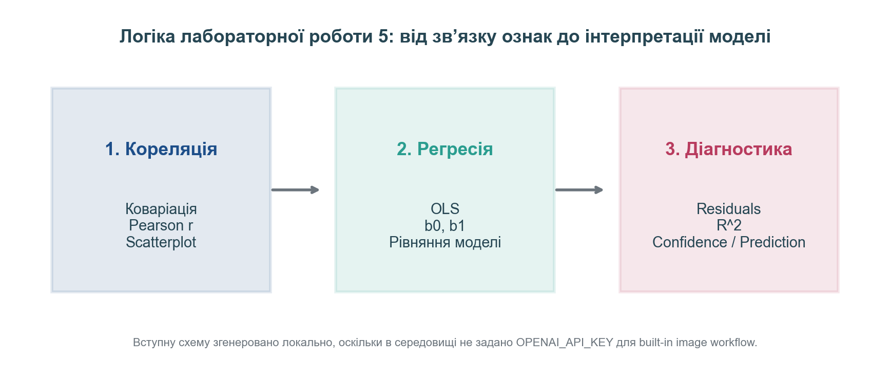
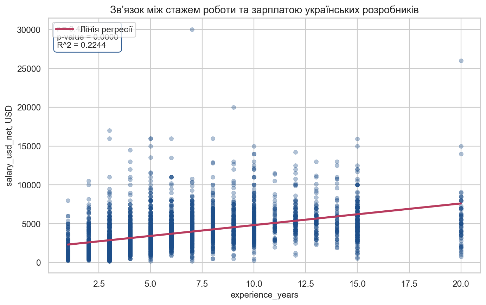
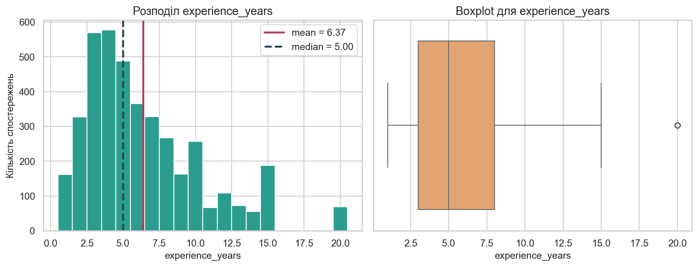
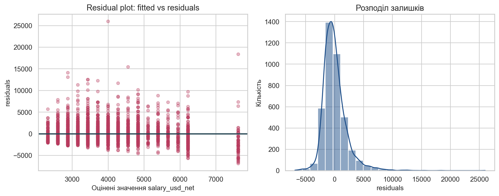
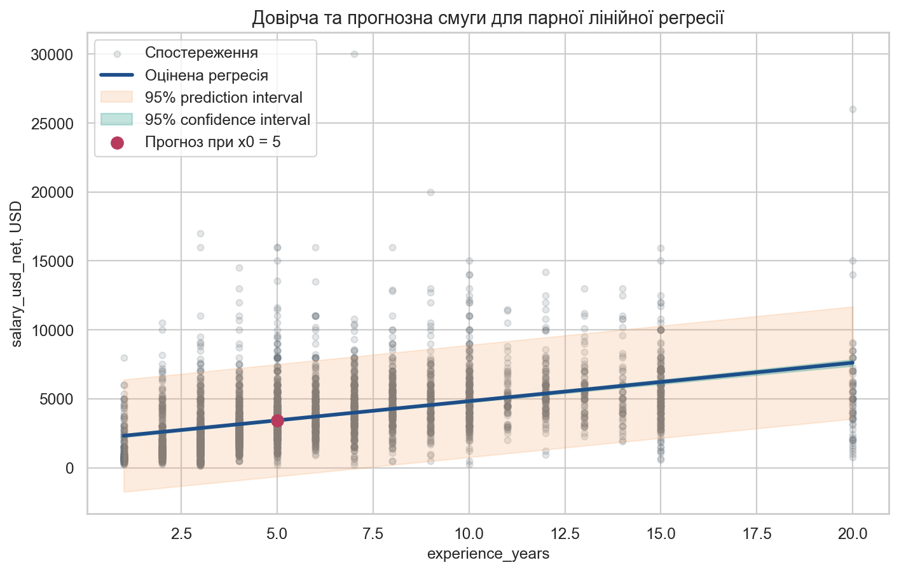

# Лабораторна робота 5. Побудова та аналіз парної лінійної регресійної моделі

**Тема:** *Кореляційний аналіз та парна лінійна регресія.*

**Мета:** *Навчитися очищати реальний CSV-набір, обчислювати коваріацію та коефіцієнт кореляції Пірсона, оцінювати параметри простої лінійної регресії методом найменших квадратів, аналізувати залишки, інтерпретувати `R^2`, будувати довірчі та прогнозні інтервали і формулювати строгі висновки про межі застосування моделі.*

---

## Контрольний приклад: Побудова та аналіз парної лінійної регресійної моделі для зарплат українських розробників

### Постановка задачі

Для контрольного прикладу використаємо реальний набір даних **«Зарплати українських розробників – зима 2026»** з локального файлу `04_data/2025_dec_raw.csv` і контекст аналітичної статті DOU від **12 січня 2026 року** за посиланням [«Зарплати українських розробників – зима 2026»](https://dou.ua/lenta/articles/salary-report-devs-winter-2026/). У статті зазначено, що до аналізу було включено **4575** анкет, із них **4356** респондентів перебували в Україні, а редакційно опублікована медіанна зарплата становила **3450 USD**.

Ці зовнішні числа є лише контекстом. У лабораторній роботі ми виконуємо власне очищення CSV, залишаємо лише українських `Software Engineer / Developer`, а далі працюємо з неперервною парою ознак `experience_years` та `salary_usd_net`. Саме така постановка повністю узгоджується з лекційною запискою 5: спочатку потрібно оцінити напрям і силу лінійного зв’язку, після цього побудувати модель методом найменших квадратів, а вже потім перейти до інтерпретації коефіцієнтів, `R^2`, залишків і прогнозних меж.

У контрольному прикладі послідовно виконаємо три логічні блоки:

1. Оцінимо коваріацію і Pearson correlation між стажем та зарплатою.
2. Побудуємо парну лінійну регресію `salary_usd_net ~ experience_years`.
3. Проаналізуємо залишки, `R^2`, довірчі та прогнозні інтервали.



### Вхідні дані для аналізу

Після очищення технічного CSV формуємо локальну навчальну вибірку українських розробників, для яких валідно зчитуються `experience_years`, `salary_usd_net` і `age`. Змістовно це означає, що до статистичних обчислень потрапляють лише записи, придатні для кореляційного та регресійного аналізу. Робоча підвибірка містить **4066** спостережень.

| Показник | Значення |
| :--- | :--- |
| Кількість спостережень | 4066 |
| Середній стаж `experience_years` | 6.37 |
| Медіана стажу | 5.00 |
| Середня `salary_usd_net` | 3815.95 |
| Медіанна `salary_usd_net` | 3500.00 |
| Стандартне відхилення `salary_usd_net` | 2354.12 |

Фрагмент очищеної навчальної таблиці:

| `main_language` | `specialization` | `domain` | `experience_years` | `salary_usd_net` | `company_size` |
| :--- | :--- | :--- | :--- | :--- | :--- |
| Java |  | Adtech Advertising Marketing Big Data Telecom | 10 | 4566 | Понад 1000 |
| TypeScript |  | E-commerce | 3 | 7900 | До 1000 |
| C |  | ITSM | 2 | 1500 | До 50 |
| Go |  | E-commerce | 1 | 5000 | До 50 |
| C# / .NET |  | Fintech Banking Capital Management Gambling | 3 | 8500 | До 1000 |

### Покрокове виконання аналізу

**Крок 1.1. Завантажимо та підготуємо дані**

На підготовчому етапі потрібно зберегти логіку лекції про кореляційний аналіз і парну лінійну регресію: усі подальші оцінки мають спиратися лише на придатну числову вибірку. Саме тому спочатку читаємо сирий CSV, очищаємо зарплатні значення, виділяємо стаж у роках, відкидаємо пропуски та залишаємо лише українських `Software Engineer / Developer`.

```python
import numpy as np
import pandas as pd

raw = pd.read_csv("04_data/2025_dec_raw.csv", encoding="utf-8-sig")
df = clean_dataframe(raw)

df = df.dropna(subset=["experience_years", "salary_usd_net"]).copy()
df["experience_years"] = df["experience_years"].astype(int)
df["salary_usd_net"] = df["salary_usd_net"].astype(float)
```

Після очищення маємо **4066** валідних спостережень. Локальна медіана зарплати дорівнює **3500 USD**, тому вона не зобов’язана буквально збігатися з опублікованою редакційною медіаною **3450 USD**, оскільки локальна лабораторна вибірка і редакційний масив DOU не є тотожними за правилами підготовки.

**Крок 1.2. Оцінимо коваріацію та Pearson correlation**

Для двох неперервних ознак вибіркова коваріація обчислюється за формулою

$$
s_{xy} = \frac{1}{n-1} \sum_{i=1}^n (x_i - \bar{x})(y_i - \bar{y}),
$$

а коефіцієнт кореляції Пірсона визначається як

$$
r = \frac{\sum_{i=1}^n (x_i - \bar{x})(y_i - \bar{y})}{\sqrt{\sum_{i=1}^n (x_i - \bar{x})^2} \sqrt{\sum_{i=1}^n (y_i - \bar{y})^2}}.
$$

Для перевірки статистичної значущості використовуємо двобічну гіпотезу `H0: ρ = 0` проти `H1: ρ \ne 0` на рівні значущості `alpha = 0.05`.

```python
from scipy import stats
import numpy as np

x = df["experience_years"]
y = df["salary_usd_net"]

sample_cov = np.cov(x, y, ddof=1)[0, 1]
r_stat, p_value = stats.pearsonr(x, y)
print(sample_cov, r_stat, p_value)
```

| Показник | Значення |
| :--- | :--- |
| Вибіркова коваріація | 4461.92 |
| Pearson correlation `r` | 0.4737 |
| Напрям зв’язку | прямий |
| Інтерпретація сили зв’язку | помірний |
| p-value для перевірки `H0: ρ = 0` | 0.0000 |



**Проміжний висновок:** вибіркова коваріація є додатною, а коефіцієнт Pearson `r = 0.4737` свідчить про **помірний прямий** зв’язок між стажем та зарплатою. Оскільки `p-value = 0.0000`, на рівні `0.05` маємо підстави відхилити `H0` і визнати лінійну залежність статистично значущою.

**Крок 1.3. Побудуємо модель простої лінійної регресії**

Проста лінійна регресія записується як

$$
y_i = b_0 + b_1 x_i + \varepsilon_i,
$$

де параметри методу найменших квадратів мають вигляд

$$
b_1 = \frac{\sum_{i=1}^n (x_i - \bar{x})(y_i - \bar{y})}{\sum_{i=1}^n (x_i - \bar{x})^2},
\qquad
b_0 = \bar{y} - b_1 \bar{x}.
$$

Таким чином, ми мінімізуємо суму квадратів залишків

$$
SSE = \sum_{i=1}^n (y_i - \hat{y}_i)^2.
$$

```python
from scipy import stats

x = df["experience_years"]
y = df["salary_usd_net"]

reg = stats.linregress(x, y)
print(reg.slope, reg.intercept, reg.rvalue**2, reg.pvalue)
```

| Параметр | Оцінка | 95% CI |
| :--- | :--- | :--- |
| `b0` (intercept) | 2040.58 | [1920.71; 2160.46] |
| `b1` (slope) | 278.67 | [262.74; 294.60] |
| `R^2` | 0.2244 | – |
| Adjusted `R^2` | 0.2242 | – |
| F-statistic | 1175.5758 | `p = 0.0000` |

Рівняння оціненої моделі:

$$
\hat{y} = 2040.58 + 278.67 \cdot x.
$$



**Проміжний висновок:** коефіцієнт нахилу `b1 = 278.67` означає, що в середньому кожен додатковий рік стажу пов’язаний зі зміною очікуваної `salary_usd_net` приблизно на **278.67 USD**, якщо не виходити за межі спостережуваного діапазону `experience_years`. Значення `R^2 = 0.2244` означає, що стаж сам по собі пояснює лише частину мінливості зарплат, тому модель не можна тлумачити як повний опис усіх причинних чинників.

**Крок 1.4. Проаналізуємо залишки та інтервали для прогнозу**

Залишки визначаються як

$$
e_i = y_i - \hat{y}_i.
$$

Коефіцієнт детермінації має форму

$$
R^2 = 1 - \frac{SSE}{SST},
$$

де

$$
SST = \sum_{i=1}^n (y_i - \bar{y})^2.
$$

Для середнього відгуку при заданому `x_0` довірчий інтервал обчислюємо як

$$
\hat{y}(x_0) \pm t_{1-\alpha/2,\,n-2} s \sqrt{\frac{1}{n} + \frac{(x_0 - \bar{x})^2}{\sum (x_i - \bar{x})^2}},
$$

а прогнозний інтервал для нового спостереження є ширшим:

$$
\hat{y}(x_0) \pm t_{1-\alpha/2,\,n-2} s \sqrt{1 + \frac{1}{n} + \frac{(x_0 - \bar{x})^2}{\sum (x_i - \bar{x})^2}}.
$$

```python
import numpy as np
from scipy import stats

x = df["experience_years"].to_numpy(dtype=float)
y = df["salary_usd_net"].to_numpy(dtype=float)
reg = stats.linregress(x, y)
y_hat = reg.intercept + reg.slope * x
residuals = y - y_hat

rmse = np.sqrt(np.mean(residuals**2))
print(residuals[:5], rmse)
```

| Показник | Значення |
| :--- | :--- |
| Базове значення `x0` | 5 років |
| Точковий прогноз `ŷ(x0)` | 3433.93 USD |
| 95% confidence interval для середнього відгуку | [3366.54; 3501.32] |
| 95% prediction interval для нового спостереження | [-631.89; 7499.75] |
| RMSE | 2073.02 |





**Проміжний висновок:** `RMSE = 2073.02` показує типовий масштаб помилки апроксимації в доларах США. Довірча смуга для середнього відгуку помітно вужча за прогнозну, оскільки прогнозування нового індивідуального спостереження завжди пов’язане з більшою невизначеністю, ніж оцінювання умовного середнього.

**Крок 1.5. Узагальнимо результати**

Контрольний приклад демонструє повну логіку лабораторної роботи 5: спочатку ми перевіряємо, чи є між ознаками лінійний зв’язок, далі оцінюємо рівняння регресії методом least squares, а наприкінці аналізуємо межі застосування моделі через залишки, `R^2` і прогнозні інтервали. Така послідовність повністю узгоджується зі змістом лекційної записки про коваріацію, Pearson correlation, метод найменших квадратів та інтерпретацію простої лінійної регресії.

### Результати виконання

1. Після очищення локального CSV одержано **4066** валідних спостережень українських розробників.
2. Для пари `experience_years` і `salary_usd_net` одержано `r = 0.4737` та `p-value = 0.0000`.
3. Оцінена модель має вигляд `ŷ = 2040.58 + 278.67 · x`.
4. Коефіцієнт детермінації дорівнює `R^2 = 0.2244`, а прогноз для `x0 = 5` років становить `ŷ(x0) = 3433.93 USD`.

### Висновки (інтерпретація результатів)

На очищеній вибірці українських розробників стаж роботи статистично значуще пов’язаний із зарплатою, але цей зв’язок не є настільки сильним, щоб тлумачити стаж як вичерпне пояснення всіх відмінностей у доходах. Саме тому лінійна регресія тут виконує роль компактної аналітичної моделі, а не повного опису ринку праці.

Коефіцієнт нахилу має чітку змістову інтерпретацію: він показує середню зміну очікуваної зарплати за приросту стажу на один рік. Водночас intercept не слід тлумачити буквально поза межами спостережуваного діапазону, оскільки лінійна модель є локальною апроксимацією даних, а не загальним економічним законом.

Аналіз залишків і різниці між confidence interval та prediction interval нагадує, що статистична модель завжди має обмеження. Навіть за значущого `p-value` і помірного `R^2` нові індивідуальні зарплатні спостереження можуть істотно відхилятися від лінії регресії, тому якісний висновок повинен поєднувати формальні оцінки з предметним контекстом.

### Критичний аналіз результатів (додатково)

1. **Контекст DOU і локального CSV не тотожний.** Редакційна стаття і лабораторний набір даних не збігаються повністю за правилами очищення, тому локальні числа можуть не повторювати опубліковані медіани буквально.
2. **Кореляція не дорівнює причинності.** Значущий Pearson correlation і статистично значущий коефіцієнт нахилу не доводять, що стаж є єдиною причиною зміни зарплати.
3. **Лінійна модель спрощує реальність.** На зарплату одночасно впливають мова програмування, домен, формат зайнятості, рівень англійської, тип компанії та інші чинники, які не враховані в цій однофакторній моделі.

---

## Завдання для самостійного виконання

### <span style="color:red; font-size:1.5em;">Завдання 1. Кореляційний аналіз для пари `experience_years` і `salary_usd_net`</span>

---

**Для всіх варіантів:**

- **Робочий зріз:** формуйте `df_variant` лише за правилом свого варіанта на очищеній підвибірці українських `Software Engineer / Developer`.
- **Пара ознак:** в усіх варіантах використовуйте `x = experience_years` і `y = salary_usd_net`.
- **Параметри перевірки:** встановлюйте `alpha = 0.05`, перевіряйте двобічну гіпотезу `H0: ρ = 0` проти `H1: ρ \ne 0`.
- **Обов’язкові результати:** подайте `n`, `mean(x)`, `mean(y)`, `cov(x, y)`, `r`, `p-value`, scatterplot та короткий змістовний висновок.

**Варіант 1 – TypeScript:**

- **Мета:** оцінити напрям, силу та статистичну значущість лінійного зв’язку між `experience_years` і `salary_usd_net` для зрізу розробників з основною мовою TypeScript.
- **Кроки:**

    1. Сформуйте `df_variant` за правилом `df[df["main_language"] == "TypeScript"].copy()` і зафіксуйте кількість спостережень, а також мінімальне, максимальне та середнє значення `experience_years`.
    2. Обчисліть описові характеристики для `experience_years` і `salary_usd_net`, після чого знайдіть вибіркову коваріацію `cov(x, y)` через `np.cov(x, y, ddof=1)[0, 1]` або еквівалентну формулу.
    3. Запишіть гіпотези `H0: ρ = 0` і `H1: ρ \ne 0`, встановіть `alpha = 0.05`, виконайте `stats.pearsonr(df_variant["experience_years"], df_variant["salary_usd_net"])` та подайте `r` і `p-value`.
    4. Побудуйте `scatterplot` для пари `experience_years` та `salary_usd_net`; за потреби додайте лінію `sns.regplot(..., scatter=False)` або `ax.plot(...)`, щоб візуально показати напрям зв’язку.
    5. Сформулюйте строгий висновок: чи є зв’язок прямим або оберненим, наскільки він сильний за модулем `r`, чи достатньо даних для відхилення `H0`, і чи узгоджується статистичний висновок із візуальним виглядом scatterplot.

- **Підказки:** використовуйте однакову очищену вибірку у всіх кроках. Якщо `p-value < 0.05`, потрібно прямо зазначити, що нульову гіпотезу про відсутність лінійної кореляції відхиляємо; якщо `p-value >= 0.05`, слід обережно написати, що дані не дають достатніх підстав вважати лінійний зв’язок статистично значущим.

**Варіант 2 – JavaScript:**

- **Мета:** оцінити напрям, силу та статистичну значущість лінійного зв’язку між `experience_years` і `salary_usd_net` для зрізу розробників з основною мовою JavaScript.
- **Кроки:**

    1. Сформуйте `df_variant` за правилом `df[df["main_language"] == "JavaScript"].copy()` і зафіксуйте кількість спостережень, а також мінімальне, максимальне та середнє значення `experience_years`.
    2. Обчисліть описові характеристики для `experience_years` і `salary_usd_net`, після чого знайдіть вибіркову коваріацію `cov(x, y)` через `np.cov(x, y, ddof=1)[0, 1]` або еквівалентну формулу.
    3. Запишіть гіпотези `H0: ρ = 0` і `H1: ρ \ne 0`, встановіть `alpha = 0.05`, виконайте `stats.pearsonr(df_variant["experience_years"], df_variant["salary_usd_net"])` та подайте `r` і `p-value`.
    4. Побудуйте `scatterplot` для пари `experience_years` та `salary_usd_net`; за потреби додайте лінію `sns.regplot(..., scatter=False)` або `ax.plot(...)`, щоб візуально показати напрям зв’язку.
    5. Сформулюйте строгий висновок: чи є зв’язок прямим або оберненим, наскільки він сильний за модулем `r`, чи достатньо даних для відхилення `H0`, і чи узгоджується статистичний висновок із візуальним виглядом scatterplot.

- **Підказки:** використовуйте однакову очищену вибірку у всіх кроках. Якщо `p-value < 0.05`, потрібно прямо зазначити, що нульову гіпотезу про відсутність лінійної кореляції відхиляємо; якщо `p-value >= 0.05`, слід обережно написати, що дані не дають достатніх підстав вважати лінійний зв’язок статистично значущим.

**Варіант 3 – C# / .NET:**

- **Мета:** оцінити напрям, силу та статистичну значущість лінійного зв’язку між `experience_years` і `salary_usd_net` для зрізу розробників з основною мовою C# / .NET.
- **Кроки:**

    1. Сформуйте `df_variant` за правилом `df[df["main_language"] == "C# / .NET"].copy()` і зафіксуйте кількість спостережень, а також мінімальне, максимальне та середнє значення `experience_years`.
    2. Обчисліть описові характеристики для `experience_years` і `salary_usd_net`, після чого знайдіть вибіркову коваріацію `cov(x, y)` через `np.cov(x, y, ddof=1)[0, 1]` або еквівалентну формулу.
    3. Запишіть гіпотези `H0: ρ = 0` і `H1: ρ \ne 0`, встановіть `alpha = 0.05`, виконайте `stats.pearsonr(df_variant["experience_years"], df_variant["salary_usd_net"])` та подайте `r` і `p-value`.
    4. Побудуйте `scatterplot` для пари `experience_years` та `salary_usd_net`; за потреби додайте лінію `sns.regplot(..., scatter=False)` або `ax.plot(...)`, щоб візуально показати напрям зв’язку.
    5. Сформулюйте строгий висновок: чи є зв’язок прямим або оберненим, наскільки він сильний за модулем `r`, чи достатньо даних для відхилення `H0`, і чи узгоджується статистичний висновок із візуальним виглядом scatterplot.

- **Підказки:** використовуйте однакову очищену вибірку у всіх кроках. Якщо `p-value < 0.05`, потрібно прямо зазначити, що нульову гіпотезу про відсутність лінійної кореляції відхиляємо; якщо `p-value >= 0.05`, слід обережно написати, що дані не дають достатніх підстав вважати лінійний зв’язок статистично значущим.

**Варіант 4 – Java:**

- **Мета:** оцінити напрям, силу та статистичну значущість лінійного зв’язку між `experience_years` і `salary_usd_net` для зрізу розробників з основною мовою Java.
- **Кроки:**

    1. Сформуйте `df_variant` за правилом `df[df["main_language"] == "Java"].copy()` і зафіксуйте кількість спостережень, а також мінімальне, максимальне та середнє значення `experience_years`.
    2. Обчисліть описові характеристики для `experience_years` і `salary_usd_net`, після чого знайдіть вибіркову коваріацію `cov(x, y)` через `np.cov(x, y, ddof=1)[0, 1]` або еквівалентну формулу.
    3. Запишіть гіпотези `H0: ρ = 0` і `H1: ρ \ne 0`, встановіть `alpha = 0.05`, виконайте `stats.pearsonr(df_variant["experience_years"], df_variant["salary_usd_net"])` та подайте `r` і `p-value`.
    4. Побудуйте `scatterplot` для пари `experience_years` та `salary_usd_net`; за потреби додайте лінію `sns.regplot(..., scatter=False)` або `ax.plot(...)`, щоб візуально показати напрям зв’язку.
    5. Сформулюйте строгий висновок: чи є зв’язок прямим або оберненим, наскільки він сильний за модулем `r`, чи достатньо даних для відхилення `H0`, і чи узгоджується статистичний висновок із візуальним виглядом scatterplot.

- **Підказки:** використовуйте однакову очищену вибірку у всіх кроках. Якщо `p-value < 0.05`, потрібно прямо зазначити, що нульову гіпотезу про відсутність лінійної кореляції відхиляємо; якщо `p-value >= 0.05`, слід обережно написати, що дані не дають достатніх підстав вважати лінійний зв’язок статистично значущим.

**Варіант 5 – PHP:**

- **Мета:** оцінити напрям, силу та статистичну значущість лінійного зв’язку між `experience_years` і `salary_usd_net` для зрізу розробників з основною мовою PHP.
- **Кроки:**

    1. Сформуйте `df_variant` за правилом `df[df["main_language"] == "PHP"].copy()` і зафіксуйте кількість спостережень, а також мінімальне, максимальне та середнє значення `experience_years`.
    2. Обчисліть описові характеристики для `experience_years` і `salary_usd_net`, після чого знайдіть вибіркову коваріацію `cov(x, y)` через `np.cov(x, y, ddof=1)[0, 1]` або еквівалентну формулу.
    3. Запишіть гіпотези `H0: ρ = 0` і `H1: ρ \ne 0`, встановіть `alpha = 0.05`, виконайте `stats.pearsonr(df_variant["experience_years"], df_variant["salary_usd_net"])` та подайте `r` і `p-value`.
    4. Побудуйте `scatterplot` для пари `experience_years` та `salary_usd_net`; за потреби додайте лінію `sns.regplot(..., scatter=False)` або `ax.plot(...)`, щоб візуально показати напрям зв’язку.
    5. Сформулюйте строгий висновок: чи є зв’язок прямим або оберненим, наскільки він сильний за модулем `r`, чи достатньо даних для відхилення `H0`, і чи узгоджується статистичний висновок із візуальним виглядом scatterplot.

- **Підказки:** використовуйте однакову очищену вибірку у всіх кроках. Якщо `p-value < 0.05`, потрібно прямо зазначити, що нульову гіпотезу про відсутність лінійної кореляції відхиляємо; якщо `p-value >= 0.05`, слід обережно написати, що дані не дають достатніх підстав вважати лінійний зв’язок статистично значущим.

**Варіант 6 – Python:**

- **Мета:** оцінити напрям, силу та статистичну значущість лінійного зв’язку між `experience_years` і `salary_usd_net` для зрізу розробників з основною мовою Python.
- **Кроки:**

    1. Сформуйте `df_variant` за правилом `df[df["main_language"] == "Python"].copy()` і зафіксуйте кількість спостережень, а також мінімальне, максимальне та середнє значення `experience_years`.
    2. Обчисліть описові характеристики для `experience_years` і `salary_usd_net`, після чого знайдіть вибіркову коваріацію `cov(x, y)` через `np.cov(x, y, ddof=1)[0, 1]` або еквівалентну формулу.
    3. Запишіть гіпотези `H0: ρ = 0` і `H1: ρ \ne 0`, встановіть `alpha = 0.05`, виконайте `stats.pearsonr(df_variant["experience_years"], df_variant["salary_usd_net"])` та подайте `r` і `p-value`.
    4. Побудуйте `scatterplot` для пари `experience_years` та `salary_usd_net`; за потреби додайте лінію `sns.regplot(..., scatter=False)` або `ax.plot(...)`, щоб візуально показати напрям зв’язку.
    5. Сформулюйте строгий висновок: чи є зв’язок прямим або оберненим, наскільки він сильний за модулем `r`, чи достатньо даних для відхилення `H0`, і чи узгоджується статистичний висновок із візуальним виглядом scatterplot.

- **Підказки:** використовуйте однакову очищену вибірку у всіх кроках. Якщо `p-value < 0.05`, потрібно прямо зазначити, що нульову гіпотезу про відсутність лінійної кореляції відхиляємо; якщо `p-value >= 0.05`, слід обережно написати, що дані не дають достатніх підстав вважати лінійний зв’язок статистично значущим.

**Варіант 7 – Back-end:**

- **Мета:** оцінити напрям, силу та статистичну значущість лінійного зв’язку між `experience_years` і `salary_usd_net` для зрізу розробників зі спеціалізацією Back-end розробка.
- **Кроки:**

    1. Сформуйте `df_variant` за правилом `df[df["specialization"] == "Back-end розробка"].copy()` і зафіксуйте кількість спостережень, а також мінімальне, максимальне та середнє значення `experience_years`.
    2. Обчисліть описові характеристики для `experience_years` і `salary_usd_net`, після чого знайдіть вибіркову коваріацію `cov(x, y)` через `np.cov(x, y, ddof=1)[0, 1]` або еквівалентну формулу.
    3. Запишіть гіпотези `H0: ρ = 0` і `H1: ρ \ne 0`, встановіть `alpha = 0.05`, виконайте `stats.pearsonr(df_variant["experience_years"], df_variant["salary_usd_net"])` та подайте `r` і `p-value`.
    4. Побудуйте `scatterplot` для пари `experience_years` та `salary_usd_net`; за потреби додайте лінію `sns.regplot(..., scatter=False)` або `ax.plot(...)`, щоб візуально показати напрям зв’язку.
    5. Сформулюйте строгий висновок: чи є зв’язок прямим або оберненим, наскільки він сильний за модулем `r`, чи достатньо даних для відхилення `H0`, і чи узгоджується статистичний висновок із візуальним виглядом scatterplot.

- **Підказки:** використовуйте однакову очищену вибірку у всіх кроках. Якщо `p-value < 0.05`, потрібно прямо зазначити, що нульову гіпотезу про відсутність лінійної кореляції відхиляємо; якщо `p-value >= 0.05`, слід обережно написати, що дані не дають достатніх підстав вважати лінійний зв’язок статистично значущим.

**Варіант 8 – Front-end:**

- **Мета:** оцінити напрям, силу та статистичну значущість лінійного зв’язку між `experience_years` і `salary_usd_net` для зрізу розробників зі спеціалізацією Front-end розробка.
- **Кроки:**

    1. Сформуйте `df_variant` за правилом `df[df["specialization"] == "Front-end розробка"].copy()` і зафіксуйте кількість спостережень, а також мінімальне, максимальне та середнє значення `experience_years`.
    2. Обчисліть описові характеристики для `experience_years` і `salary_usd_net`, після чого знайдіть вибіркову коваріацію `cov(x, y)` через `np.cov(x, y, ddof=1)[0, 1]` або еквівалентну формулу.
    3. Запишіть гіпотези `H0: ρ = 0` і `H1: ρ \ne 0`, встановіть `alpha = 0.05`, виконайте `stats.pearsonr(df_variant["experience_years"], df_variant["salary_usd_net"])` та подайте `r` і `p-value`.
    4. Побудуйте `scatterplot` для пари `experience_years` та `salary_usd_net`; за потреби додайте лінію `sns.regplot(..., scatter=False)` або `ax.plot(...)`, щоб візуально показати напрям зв’язку.
    5. Сформулюйте строгий висновок: чи є зв’язок прямим або оберненим, наскільки він сильний за модулем `r`, чи достатньо даних для відхилення `H0`, і чи узгоджується статистичний висновок із візуальним виглядом scatterplot.

- **Підказки:** використовуйте однакову очищену вибірку у всіх кроках. Якщо `p-value < 0.05`, потрібно прямо зазначити, що нульову гіпотезу про відсутність лінійної кореляції відхиляємо; якщо `p-value >= 0.05`, слід обережно написати, що дані не дають достатніх підстав вважати лінійний зв’язок статистично значущим.

**Варіант 9 – Full Stack:**

- **Мета:** оцінити напрям, силу та статистичну значущість лінійного зв’язку між `experience_years` і `salary_usd_net` для зрізу розробників зі спеціалізацією Full Stack розробка.
- **Кроки:**

    1. Сформуйте `df_variant` за правилом `df[df["specialization"] == "Full Stack розробка"].copy()` і зафіксуйте кількість спостережень, а також мінімальне, максимальне та середнє значення `experience_years`.
    2. Обчисліть описові характеристики для `experience_years` і `salary_usd_net`, після чого знайдіть вибіркову коваріацію `cov(x, y)` через `np.cov(x, y, ddof=1)[0, 1]` або еквівалентну формулу.
    3. Запишіть гіпотези `H0: ρ = 0` і `H1: ρ \ne 0`, встановіть `alpha = 0.05`, виконайте `stats.pearsonr(df_variant["experience_years"], df_variant["salary_usd_net"])` та подайте `r` і `p-value`.
    4. Побудуйте `scatterplot` для пари `experience_years` та `salary_usd_net`; за потреби додайте лінію `sns.regplot(..., scatter=False)` або `ax.plot(...)`, щоб візуально показати напрям зв’язку.
    5. Сформулюйте строгий висновок: чи є зв’язок прямим або оберненим, наскільки він сильний за модулем `r`, чи достатньо даних для відхилення `H0`, і чи узгоджується статистичний висновок із візуальним виглядом scatterplot.

- **Підказки:** використовуйте однакову очищену вибірку у всіх кроках. Якщо `p-value < 0.05`, потрібно прямо зазначити, що нульову гіпотезу про відсутність лінійної кореляції відхиляємо; якщо `p-value >= 0.05`, слід обережно написати, що дані не дають достатніх підстав вважати лінійний зв’язок статистично значущим.

**Варіант 10 – Mobile:**

- **Мета:** оцінити напрям, силу та статистичну значущість лінійного зв’язку між `experience_years` і `salary_usd_net` для зрізу розробників зі спеціалізацією Mobile розробка.
- **Кроки:**

    1. Сформуйте `df_variant` за правилом `df[df["specialization"] == "Mobile розробка"].copy()` і зафіксуйте кількість спостережень, а також мінімальне, максимальне та середнє значення `experience_years`.
    2. Обчисліть описові характеристики для `experience_years` і `salary_usd_net`, після чого знайдіть вибіркову коваріацію `cov(x, y)` через `np.cov(x, y, ddof=1)[0, 1]` або еквівалентну формулу.
    3. Запишіть гіпотези `H0: ρ = 0` і `H1: ρ \ne 0`, встановіть `alpha = 0.05`, виконайте `stats.pearsonr(df_variant["experience_years"], df_variant["salary_usd_net"])` та подайте `r` і `p-value`.
    4. Побудуйте `scatterplot` для пари `experience_years` та `salary_usd_net`; за потреби додайте лінію `sns.regplot(..., scatter=False)` або `ax.plot(...)`, щоб візуально показати напрям зв’язку.
    5. Сформулюйте строгий висновок: чи є зв’язок прямим або оберненим, наскільки він сильний за модулем `r`, чи достатньо даних для відхилення `H0`, і чи узгоджується статистичний висновок із візуальним виглядом scatterplot.

- **Підказки:** використовуйте однакову очищену вибірку у всіх кроках. Якщо `p-value < 0.05`, потрібно прямо зазначити, що нульову гіпотезу про відсутність лінійної кореляції відхиляємо; якщо `p-value >= 0.05`, слід обережно написати, що дані не дають достатніх підстав вважати лінійний зв’язок статистично значущим.

**Варіант 11 – Desktop:**

- **Мета:** оцінити напрям, силу та статистичну значущість лінійного зв’язку між `experience_years` і `salary_usd_net` для зрізу розробників зі спеціалізацією Desktop.
- **Кроки:**

    1. Сформуйте `df_variant` за правилом `df[df["specialization"] == "Desktop"].copy()` і зафіксуйте кількість спостережень, а також мінімальне, максимальне та середнє значення `experience_years`.
    2. Обчисліть описові характеристики для `experience_years` і `salary_usd_net`, після чого знайдіть вибіркову коваріацію `cov(x, y)` через `np.cov(x, y, ddof=1)[0, 1]` або еквівалентну формулу.
    3. Запишіть гіпотези `H0: ρ = 0` і `H1: ρ \ne 0`, встановіть `alpha = 0.05`, виконайте `stats.pearsonr(df_variant["experience_years"], df_variant["salary_usd_net"])` та подайте `r` і `p-value`.
    4. Побудуйте `scatterplot` для пари `experience_years` та `salary_usd_net`; за потреби додайте лінію `sns.regplot(..., scatter=False)` або `ax.plot(...)`, щоб візуально показати напрям зв’язку.
    5. Сформулюйте строгий висновок: чи є зв’язок прямим або оберненим, наскільки він сильний за модулем `r`, чи достатньо даних для відхилення `H0`, і чи узгоджується статистичний висновок із візуальним виглядом scatterplot.

- **Підказки:** використовуйте однакову очищену вибірку у всіх кроках. Якщо `p-value < 0.05`, потрібно прямо зазначити, що нульову гіпотезу про відсутність лінійної кореляції відхиляємо; якщо `p-value >= 0.05`, слід обережно написати, що дані не дають достатніх підстав вважати лінійний зв’язок статистично значущим.

**Варіант 12 – Embedded:**

- **Мета:** оцінити напрям, силу та статистичну значущість лінійного зв’язку між `experience_years` і `salary_usd_net` для зрізу розробників зі спеціалізацією Embedded.
- **Кроки:**

    1. Сформуйте `df_variant` за правилом `df[df["specialization"] == "Embedded"].copy()` і зафіксуйте кількість спостережень, а також мінімальне, максимальне та середнє значення `experience_years`.
    2. Обчисліть описові характеристики для `experience_years` і `salary_usd_net`, після чого знайдіть вибіркову коваріацію `cov(x, y)` через `np.cov(x, y, ddof=1)[0, 1]` або еквівалентну формулу.
    3. Запишіть гіпотези `H0: ρ = 0` і `H1: ρ \ne 0`, встановіть `alpha = 0.05`, виконайте `stats.pearsonr(df_variant["experience_years"], df_variant["salary_usd_net"])` та подайте `r` і `p-value`.
    4. Побудуйте `scatterplot` для пари `experience_years` та `salary_usd_net`; за потреби додайте лінію `sns.regplot(..., scatter=False)` або `ax.plot(...)`, щоб візуально показати напрям зв’язку.
    5. Сформулюйте строгий висновок: чи є зв’язок прямим або оберненим, наскільки він сильний за модулем `r`, чи достатньо даних для відхилення `H0`, і чи узгоджується статистичний висновок із візуальним виглядом scatterplot.

- **Підказки:** використовуйте однакову очищену вибірку у всіх кроках. Якщо `p-value < 0.05`, потрібно прямо зазначити, що нульову гіпотезу про відсутність лінійної кореляції відхиляємо; якщо `p-value >= 0.05`, слід обережно написати, що дані не дають достатніх підстав вважати лінійний зв’язок статистично значущим.

**Варіант 13 – Fintech / Banking / Capital Management:**

- **Мета:** оцінити напрям, силу та статистичну значущість лінійного зв’язку між `experience_years` і `salary_usd_net` для зрізу розробників домену Fintech / Banking / Capital Management.
- **Кроки:**

    1. Сформуйте `df_variant` за правилом `df[df["domain"] == "Fintech / Banking / Capital Management"].copy()` і зафіксуйте кількість спостережень, а також мінімальне, максимальне та середнє значення `experience_years`.
    2. Обчисліть описові характеристики для `experience_years` і `salary_usd_net`, після чого знайдіть вибіркову коваріацію `cov(x, y)` через `np.cov(x, y, ddof=1)[0, 1]` або еквівалентну формулу.
    3. Запишіть гіпотези `H0: ρ = 0` і `H1: ρ \ne 0`, встановіть `alpha = 0.05`, виконайте `stats.pearsonr(df_variant["experience_years"], df_variant["salary_usd_net"])` та подайте `r` і `p-value`.
    4. Побудуйте `scatterplot` для пари `experience_years` та `salary_usd_net`; за потреби додайте лінію `sns.regplot(..., scatter=False)` або `ax.plot(...)`, щоб візуально показати напрям зв’язку.
    5. Сформулюйте строгий висновок: чи є зв’язок прямим або оберненим, наскільки він сильний за модулем `r`, чи достатньо даних для відхилення `H0`, і чи узгоджується статистичний висновок із візуальним виглядом scatterplot.

- **Підказки:** використовуйте однакову очищену вибірку у всіх кроках. Якщо `p-value < 0.05`, потрібно прямо зазначити, що нульову гіпотезу про відсутність лінійної кореляції відхиляємо; якщо `p-value >= 0.05`, слід обережно написати, що дані не дають достатніх підстав вважати лінійний зв’язок статистично значущим.

**Варіант 14 – E-commerce:**

- **Мета:** оцінити напрям, силу та статистичну значущість лінійного зв’язку між `experience_years` і `salary_usd_net` для зрізу розробників домену E-commerce.
- **Кроки:**

    1. Сформуйте `df_variant` за правилом `df[df["domain"] == "E-commerce"].copy()` і зафіксуйте кількість спостережень, а також мінімальне, максимальне та середнє значення `experience_years`.
    2. Обчисліть описові характеристики для `experience_years` і `salary_usd_net`, після чого знайдіть вибіркову коваріацію `cov(x, y)` через `np.cov(x, y, ddof=1)[0, 1]` або еквівалентну формулу.
    3. Запишіть гіпотези `H0: ρ = 0` і `H1: ρ \ne 0`, встановіть `alpha = 0.05`, виконайте `stats.pearsonr(df_variant["experience_years"], df_variant["salary_usd_net"])` та подайте `r` і `p-value`.
    4. Побудуйте `scatterplot` для пари `experience_years` та `salary_usd_net`; за потреби додайте лінію `sns.regplot(..., scatter=False)` або `ax.plot(...)`, щоб візуально показати напрям зв’язку.
    5. Сформулюйте строгий висновок: чи є зв’язок прямим або оберненим, наскільки він сильний за модулем `r`, чи достатньо даних для відхилення `H0`, і чи узгоджується статистичний висновок із візуальним виглядом scatterplot.

- **Підказки:** використовуйте однакову очищену вибірку у всіх кроках. Якщо `p-value < 0.05`, потрібно прямо зазначити, що нульову гіпотезу про відсутність лінійної кореляції відхиляємо; якщо `p-value >= 0.05`, слід обережно написати, що дані не дають достатніх підстав вважати лінійний зв’язок статистично значущим.

**Варіант 15 – Gambling:**

- **Мета:** оцінити напрям, силу та статистичну значущість лінійного зв’язку між `experience_years` і `salary_usd_net` для зрізу розробників домену Gambling.
- **Кроки:**

    1. Сформуйте `df_variant` за правилом `df[df["domain"] == "Gambling"].copy()` і зафіксуйте кількість спостережень, а також мінімальне, максимальне та середнє значення `experience_years`.
    2. Обчисліть описові характеристики для `experience_years` і `salary_usd_net`, після чого знайдіть вибіркову коваріацію `cov(x, y)` через `np.cov(x, y, ddof=1)[0, 1]` або еквівалентну формулу.
    3. Запишіть гіпотези `H0: ρ = 0` і `H1: ρ \ne 0`, встановіть `alpha = 0.05`, виконайте `stats.pearsonr(df_variant["experience_years"], df_variant["salary_usd_net"])` та подайте `r` і `p-value`.
    4. Побудуйте `scatterplot` для пари `experience_years` та `salary_usd_net`; за потреби додайте лінію `sns.regplot(..., scatter=False)` або `ax.plot(...)`, щоб візуально показати напрям зв’язку.
    5. Сформулюйте строгий висновок: чи є зв’язок прямим або оберненим, наскільки він сильний за модулем `r`, чи достатньо даних для відхилення `H0`, і чи узгоджується статистичний висновок із візуальним виглядом scatterplot.

- **Підказки:** використовуйте однакову очищену вибірку у всіх кроках. Якщо `p-value < 0.05`, потрібно прямо зазначити, що нульову гіпотезу про відсутність лінійної кореляції відхиляємо; якщо `p-value >= 0.05`, слід обережно написати, що дані не дають достатніх підстав вважати лінійний зв’язок статистично значущим.

**Варіант 16 – Medtech / Healthcare:**

- **Мета:** оцінити напрям, силу та статистичну значущість лінійного зв’язку між `experience_years` і `salary_usd_net` для зрізу розробників домену Medtech / Healthcare.
- **Кроки:**

    1. Сформуйте `df_variant` за правилом `df[df["domain"] == "Medtech / Healthcare"].copy()` і зафіксуйте кількість спостережень, а також мінімальне, максимальне та середнє значення `experience_years`.
    2. Обчисліть описові характеристики для `experience_years` і `salary_usd_net`, після чого знайдіть вибіркову коваріацію `cov(x, y)` через `np.cov(x, y, ddof=1)[0, 1]` або еквівалентну формулу.
    3. Запишіть гіпотези `H0: ρ = 0` і `H1: ρ \ne 0`, встановіть `alpha = 0.05`, виконайте `stats.pearsonr(df_variant["experience_years"], df_variant["salary_usd_net"])` та подайте `r` і `p-value`.
    4. Побудуйте `scatterplot` для пари `experience_years` та `salary_usd_net`; за потреби додайте лінію `sns.regplot(..., scatter=False)` або `ax.plot(...)`, щоб візуально показати напрям зв’язку.
    5. Сформулюйте строгий висновок: чи є зв’язок прямим або оберненим, наскільки він сильний за модулем `r`, чи достатньо даних для відхилення `H0`, і чи узгоджується статистичний висновок із візуальним виглядом scatterplot.

- **Підказки:** використовуйте однакову очищену вибірку у всіх кроках. Якщо `p-value < 0.05`, потрібно прямо зазначити, що нульову гіпотезу про відсутність лінійної кореляції відхиляємо; якщо `p-value >= 0.05`, слід обережно написати, що дані не дають достатніх підстав вважати лінійний зв’язок статистично значущим.

**Варіант 17 – SaaS:**

- **Мета:** оцінити напрям, силу та статистичну значущість лінійного зв’язку між `experience_years` і `salary_usd_net` для зрізу розробників домену SaaS.
- **Кроки:**

    1. Сформуйте `df_variant` за правилом `df[df["domain"] == "SaaS"].copy()` і зафіксуйте кількість спостережень, а також мінімальне, максимальне та середнє значення `experience_years`.
    2. Обчисліть описові характеристики для `experience_years` і `salary_usd_net`, після чого знайдіть вибіркову коваріацію `cov(x, y)` через `np.cov(x, y, ddof=1)[0, 1]` або еквівалентну формулу.
    3. Запишіть гіпотези `H0: ρ = 0` і `H1: ρ \ne 0`, встановіть `alpha = 0.05`, виконайте `stats.pearsonr(df_variant["experience_years"], df_variant["salary_usd_net"])` та подайте `r` і `p-value`.
    4. Побудуйте `scatterplot` для пари `experience_years` та `salary_usd_net`; за потреби додайте лінію `sns.regplot(..., scatter=False)` або `ax.plot(...)`, щоб візуально показати напрям зв’язку.
    5. Сформулюйте строгий висновок: чи є зв’язок прямим або оберненим, наскільки він сильний за модулем `r`, чи достатньо даних для відхилення `H0`, і чи узгоджується статистичний висновок із візуальним виглядом scatterplot.

- **Підказки:** використовуйте однакову очищену вибірку у всіх кроках. Якщо `p-value < 0.05`, потрібно прямо зазначити, що нульову гіпотезу про відсутність лінійної кореляції відхиляємо; якщо `p-value >= 0.05`, слід обережно написати, що дані не дають достатніх підстав вважати лінійний зв’язок статистично значущим.

**Варіант 18 – GameDev:**

- **Мета:** оцінити напрям, силу та статистичну значущість лінійного зв’язку між `experience_years` і `salary_usd_net` для зрізу розробників домену GameDev.
- **Кроки:**

    1. Сформуйте `df_variant` за правилом `df[df["domain"] == "GameDev"].copy()` і зафіксуйте кількість спостережень, а також мінімальне, максимальне та середнє значення `experience_years`.
    2. Обчисліть описові характеристики для `experience_years` і `salary_usd_net`, після чого знайдіть вибіркову коваріацію `cov(x, y)` через `np.cov(x, y, ddof=1)[0, 1]` або еквівалентну формулу.
    3. Запишіть гіпотези `H0: ρ = 0` і `H1: ρ \ne 0`, встановіть `alpha = 0.05`, виконайте `stats.pearsonr(df_variant["experience_years"], df_variant["salary_usd_net"])` та подайте `r` і `p-value`.
    4. Побудуйте `scatterplot` для пари `experience_years` та `salary_usd_net`; за потреби додайте лінію `sns.regplot(..., scatter=False)` або `ax.plot(...)`, щоб візуально показати напрям зв’язку.
    5. Сформулюйте строгий висновок: чи є зв’язок прямим або оберненим, наскільки він сильний за модулем `r`, чи достатньо даних для відхилення `H0`, і чи узгоджується статистичний висновок із візуальним виглядом scatterplot.

- **Підказки:** використовуйте однакову очищену вибірку у всіх кроках. Якщо `p-value < 0.05`, потрібно прямо зазначити, що нульову гіпотезу про відсутність лінійної кореляції відхиляємо; якщо `p-value >= 0.05`, слід обережно написати, що дані не дають достатніх підстав вважати лінійний зв’язок статистично значущим.

**Варіант 19 – 1-2 роки стажу:**

- **Мета:** оцінити напрям, силу та статистичну значущість лінійного зв’язку між `experience_years` і `salary_usd_net` для зрізу розробників зі стажем від 1 до 2 років включно.
- **Кроки:**

    1. Сформуйте `df_variant` за правилом `df[df["experience_years"].between(1, 2)].copy()` і зафіксуйте кількість спостережень, а також мінімальне, максимальне та середнє значення `experience_years`.
    2. Обчисліть описові характеристики для `experience_years` і `salary_usd_net`, після чого знайдіть вибіркову коваріацію `cov(x, y)` через `np.cov(x, y, ddof=1)[0, 1]` або еквівалентну формулу.
    3. Запишіть гіпотези `H0: ρ = 0` і `H1: ρ \ne 0`, встановіть `alpha = 0.05`, виконайте `stats.pearsonr(df_variant["experience_years"], df_variant["salary_usd_net"])` та подайте `r` і `p-value`.
    4. Побудуйте `scatterplot` для пари `experience_years` та `salary_usd_net`; за потреби додайте лінію `sns.regplot(..., scatter=False)` або `ax.plot(...)`, щоб візуально показати напрям зв’язку.
    5. Сформулюйте строгий висновок: чи є зв’язок прямим або оберненим, наскільки він сильний за модулем `r`, чи достатньо даних для відхилення `H0`, і чи узгоджується статистичний висновок із візуальним виглядом scatterplot.

- **Підказки:** використовуйте однакову очищену вибірку у всіх кроках. Якщо `p-value < 0.05`, потрібно прямо зазначити, що нульову гіпотезу про відсутність лінійної кореляції відхиляємо; якщо `p-value >= 0.05`, слід обережно написати, що дані не дають достатніх підстав вважати лінійний зв’язок статистично значущим.

**Варіант 20 – 3-4 роки стажу:**

- **Мета:** оцінити напрям, силу та статистичну значущість лінійного зв’язку між `experience_years` і `salary_usd_net` для зрізу розробників зі стажем від 3 до 4 років включно.
- **Кроки:**

    1. Сформуйте `df_variant` за правилом `df[df["experience_years"].between(3, 4)].copy()` і зафіксуйте кількість спостережень, а також мінімальне, максимальне та середнє значення `experience_years`.
    2. Обчисліть описові характеристики для `experience_years` і `salary_usd_net`, після чого знайдіть вибіркову коваріацію `cov(x, y)` через `np.cov(x, y, ddof=1)[0, 1]` або еквівалентну формулу.
    3. Запишіть гіпотези `H0: ρ = 0` і `H1: ρ \ne 0`, встановіть `alpha = 0.05`, виконайте `stats.pearsonr(df_variant["experience_years"], df_variant["salary_usd_net"])` та подайте `r` і `p-value`.
    4. Побудуйте `scatterplot` для пари `experience_years` та `salary_usd_net`; за потреби додайте лінію `sns.regplot(..., scatter=False)` або `ax.plot(...)`, щоб візуально показати напрям зв’язку.
    5. Сформулюйте строгий висновок: чи є зв’язок прямим або оберненим, наскільки він сильний за модулем `r`, чи достатньо даних для відхилення `H0`, і чи узгоджується статистичний висновок із візуальним виглядом scatterplot.

- **Підказки:** використовуйте однакову очищену вибірку у всіх кроках. Якщо `p-value < 0.05`, потрібно прямо зазначити, що нульову гіпотезу про відсутність лінійної кореляції відхиляємо; якщо `p-value >= 0.05`, слід обережно написати, що дані не дають достатніх підстав вважати лінійний зв’язок статистично значущим.

**Варіант 21 – 5-6 років стажу:**

- **Мета:** оцінити напрям, силу та статистичну значущість лінійного зв’язку між `experience_years` і `salary_usd_net` для зрізу розробників зі стажем від 5 до 6 років включно.
- **Кроки:**

    1. Сформуйте `df_variant` за правилом `df[df["experience_years"].between(5, 6)].copy()` і зафіксуйте кількість спостережень, а також мінімальне, максимальне та середнє значення `experience_years`.
    2. Обчисліть описові характеристики для `experience_years` і `salary_usd_net`, після чого знайдіть вибіркову коваріацію `cov(x, y)` через `np.cov(x, y, ddof=1)[0, 1]` або еквівалентну формулу.
    3. Запишіть гіпотези `H0: ρ = 0` і `H1: ρ \ne 0`, встановіть `alpha = 0.05`, виконайте `stats.pearsonr(df_variant["experience_years"], df_variant["salary_usd_net"])` та подайте `r` і `p-value`.
    4. Побудуйте `scatterplot` для пари `experience_years` та `salary_usd_net`; за потреби додайте лінію `sns.regplot(..., scatter=False)` або `ax.plot(...)`, щоб візуально показати напрям зв’язку.
    5. Сформулюйте строгий висновок: чи є зв’язок прямим або оберненим, наскільки він сильний за модулем `r`, чи достатньо даних для відхилення `H0`, і чи узгоджується статистичний висновок із візуальним виглядом scatterplot.

- **Підказки:** використовуйте однакову очищену вибірку у всіх кроках. Якщо `p-value < 0.05`, потрібно прямо зазначити, що нульову гіпотезу про відсутність лінійної кореляції відхиляємо; якщо `p-value >= 0.05`, слід обережно написати, що дані не дають достатніх підстав вважати лінійний зв’язок статистично значущим.

**Варіант 22 – 7-8 років стажу:**

- **Мета:** оцінити напрям, силу та статистичну значущість лінійного зв’язку між `experience_years` і `salary_usd_net` для зрізу розробників зі стажем від 7 до 8 років включно.
- **Кроки:**

    1. Сформуйте `df_variant` за правилом `df[df["experience_years"].between(7, 8)].copy()` і зафіксуйте кількість спостережень, а також мінімальне, максимальне та середнє значення `experience_years`.
    2. Обчисліть описові характеристики для `experience_years` і `salary_usd_net`, після чого знайдіть вибіркову коваріацію `cov(x, y)` через `np.cov(x, y, ddof=1)[0, 1]` або еквівалентну формулу.
    3. Запишіть гіпотези `H0: ρ = 0` і `H1: ρ \ne 0`, встановіть `alpha = 0.05`, виконайте `stats.pearsonr(df_variant["experience_years"], df_variant["salary_usd_net"])` та подайте `r` і `p-value`.
    4. Побудуйте `scatterplot` для пари `experience_years` та `salary_usd_net`; за потреби додайте лінію `sns.regplot(..., scatter=False)` або `ax.plot(...)`, щоб візуально показати напрям зв’язку.
    5. Сформулюйте строгий висновок: чи є зв’язок прямим або оберненим, наскільки він сильний за модулем `r`, чи достатньо даних для відхилення `H0`, і чи узгоджується статистичний висновок із візуальним виглядом scatterplot.

- **Підказки:** використовуйте однакову очищену вибірку у всіх кроках. Якщо `p-value < 0.05`, потрібно прямо зазначити, що нульову гіпотезу про відсутність лінійної кореляції відхиляємо; якщо `p-value >= 0.05`, слід обережно написати, що дані не дають достатніх підстав вважати лінійний зв’язок статистично значущим.

**Варіант 23 – 9-10 років стажу:**

- **Мета:** оцінити напрям, силу та статистичну значущість лінійного зв’язку між `experience_years` і `salary_usd_net` для зрізу розробників зі стажем від 9 до 10 років включно.
- **Кроки:**

    1. Сформуйте `df_variant` за правилом `df[df["experience_years"].between(9, 10)].copy()` і зафіксуйте кількість спостережень, а також мінімальне, максимальне та середнє значення `experience_years`.
    2. Обчисліть описові характеристики для `experience_years` і `salary_usd_net`, після чого знайдіть вибіркову коваріацію `cov(x, y)` через `np.cov(x, y, ddof=1)[0, 1]` або еквівалентну формулу.
    3. Запишіть гіпотези `H0: ρ = 0` і `H1: ρ \ne 0`, встановіть `alpha = 0.05`, виконайте `stats.pearsonr(df_variant["experience_years"], df_variant["salary_usd_net"])` та подайте `r` і `p-value`.
    4. Побудуйте `scatterplot` для пари `experience_years` та `salary_usd_net`; за потреби додайте лінію `sns.regplot(..., scatter=False)` або `ax.plot(...)`, щоб візуально показати напрям зв’язку.
    5. Сформулюйте строгий висновок: чи є зв’язок прямим або оберненим, наскільки він сильний за модулем `r`, чи достатньо даних для відхилення `H0`, і чи узгоджується статистичний висновок із візуальним виглядом scatterplot.

- **Підказки:** використовуйте однакову очищену вибірку у всіх кроках. Якщо `p-value < 0.05`, потрібно прямо зазначити, що нульову гіпотезу про відсутність лінійної кореляції відхиляємо; якщо `p-value >= 0.05`, слід обережно написати, що дані не дають достатніх підстав вважати лінійний зв’язок статистично значущим.

**Варіант 24 – 11+ років стажу:**

- **Мета:** оцінити напрям, силу та статистичну значущість лінійного зв’язку між `experience_years` і `salary_usd_net` для зрізу розробників зі стажем 11 років і більше.
- **Кроки:**

    1. Сформуйте `df_variant` за правилом `df[df["experience_years"] >= 11].copy()` і зафіксуйте кількість спостережень, а також мінімальне, максимальне та середнє значення `experience_years`.
    2. Обчисліть описові характеристики для `experience_years` і `salary_usd_net`, після чого знайдіть вибіркову коваріацію `cov(x, y)` через `np.cov(x, y, ddof=1)[0, 1]` або еквівалентну формулу.
    3. Запишіть гіпотези `H0: ρ = 0` і `H1: ρ \ne 0`, встановіть `alpha = 0.05`, виконайте `stats.pearsonr(df_variant["experience_years"], df_variant["salary_usd_net"])` та подайте `r` і `p-value`.
    4. Побудуйте `scatterplot` для пари `experience_years` та `salary_usd_net`; за потреби додайте лінію `sns.regplot(..., scatter=False)` або `ax.plot(...)`, щоб візуально показати напрям зв’язку.
    5. Сформулюйте строгий висновок: чи є зв’язок прямим або оберненим, наскільки він сильний за модулем `r`, чи достатньо даних для відхилення `H0`, і чи узгоджується статистичний висновок із візуальним виглядом scatterplot.

- **Підказки:** використовуйте однакову очищену вибірку у всіх кроках. Якщо `p-value < 0.05`, потрібно прямо зазначити, що нульову гіпотезу про відсутність лінійної кореляції відхиляємо; якщо `p-value >= 0.05`, слід обережно написати, що дані не дають достатніх підстав вважати лінійний зв’язок статистично значущим.

**Варіант 25 – До 10 спеціалістів:**

- **Мета:** оцінити напрям, силу та статистичну значущість лінійного зв’язку між `experience_years` і `salary_usd_net` для зрізу розробників із компаній розміру До 10 спеціалістів.
- **Кроки:**

    1. Сформуйте `df_variant` за правилом `df[df["company_size"] == "До 10 спеціалістів"].copy()` і зафіксуйте кількість спостережень, а також мінімальне, максимальне та середнє значення `experience_years`.
    2. Обчисліть описові характеристики для `experience_years` і `salary_usd_net`, після чого знайдіть вибіркову коваріацію `cov(x, y)` через `np.cov(x, y, ddof=1)[0, 1]` або еквівалентну формулу.
    3. Запишіть гіпотези `H0: ρ = 0` і `H1: ρ \ne 0`, встановіть `alpha = 0.05`, виконайте `stats.pearsonr(df_variant["experience_years"], df_variant["salary_usd_net"])` та подайте `r` і `p-value`.
    4. Побудуйте `scatterplot` для пари `experience_years` та `salary_usd_net`; за потреби додайте лінію `sns.regplot(..., scatter=False)` або `ax.plot(...)`, щоб візуально показати напрям зв’язку.
    5. Сформулюйте строгий висновок: чи є зв’язок прямим або оберненим, наскільки він сильний за модулем `r`, чи достатньо даних для відхилення `H0`, і чи узгоджується статистичний висновок із візуальним виглядом scatterplot.

- **Підказки:** використовуйте однакову очищену вибірку у всіх кроках. Якщо `p-value < 0.05`, потрібно прямо зазначити, що нульову гіпотезу про відсутність лінійної кореляції відхиляємо; якщо `p-value >= 0.05`, слід обережно написати, що дані не дають достатніх підстав вважати лінійний зв’язок статистично значущим.

**Варіант 26 – До 50:**

- **Мета:** оцінити напрям, силу та статистичну значущість лінійного зв’язку між `experience_years` і `salary_usd_net` для зрізу розробників із компаній розміру До 50.
- **Кроки:**

    1. Сформуйте `df_variant` за правилом `df[df["company_size"] == "До 50"].copy()` і зафіксуйте кількість спостережень, а також мінімальне, максимальне та середнє значення `experience_years`.
    2. Обчисліть описові характеристики для `experience_years` і `salary_usd_net`, після чого знайдіть вибіркову коваріацію `cov(x, y)` через `np.cov(x, y, ddof=1)[0, 1]` або еквівалентну формулу.
    3. Запишіть гіпотези `H0: ρ = 0` і `H1: ρ \ne 0`, встановіть `alpha = 0.05`, виконайте `stats.pearsonr(df_variant["experience_years"], df_variant["salary_usd_net"])` та подайте `r` і `p-value`.
    4. Побудуйте `scatterplot` для пари `experience_years` та `salary_usd_net`; за потреби додайте лінію `sns.regplot(..., scatter=False)` або `ax.plot(...)`, щоб візуально показати напрям зв’язку.
    5. Сформулюйте строгий висновок: чи є зв’язок прямим або оберненим, наскільки він сильний за модулем `r`, чи достатньо даних для відхилення `H0`, і чи узгоджується статистичний висновок із візуальним виглядом scatterplot.

- **Підказки:** використовуйте однакову очищену вибірку у всіх кроках. Якщо `p-value < 0.05`, потрібно прямо зазначити, що нульову гіпотезу про відсутність лінійної кореляції відхиляємо; якщо `p-value >= 0.05`, слід обережно написати, що дані не дають достатніх підстав вважати лінійний зв’язок статистично значущим.

**Варіант 27 – До 200:**

- **Мета:** оцінити напрям, силу та статистичну значущість лінійного зв’язку між `experience_years` і `salary_usd_net` для зрізу розробників із компаній розміру До 200.
- **Кроки:**

    1. Сформуйте `df_variant` за правилом `df[df["company_size"] == "До 200"].copy()` і зафіксуйте кількість спостережень, а також мінімальне, максимальне та середнє значення `experience_years`.
    2. Обчисліть описові характеристики для `experience_years` і `salary_usd_net`, після чого знайдіть вибіркову коваріацію `cov(x, y)` через `np.cov(x, y, ddof=1)[0, 1]` або еквівалентну формулу.
    3. Запишіть гіпотези `H0: ρ = 0` і `H1: ρ \ne 0`, встановіть `alpha = 0.05`, виконайте `stats.pearsonr(df_variant["experience_years"], df_variant["salary_usd_net"])` та подайте `r` і `p-value`.
    4. Побудуйте `scatterplot` для пари `experience_years` та `salary_usd_net`; за потреби додайте лінію `sns.regplot(..., scatter=False)` або `ax.plot(...)`, щоб візуально показати напрям зв’язку.
    5. Сформулюйте строгий висновок: чи є зв’язок прямим або оберненим, наскільки він сильний за модулем `r`, чи достатньо даних для відхилення `H0`, і чи узгоджується статистичний висновок із візуальним виглядом scatterplot.

- **Підказки:** використовуйте однакову очищену вибірку у всіх кроках. Якщо `p-value < 0.05`, потрібно прямо зазначити, що нульову гіпотезу про відсутність лінійної кореляції відхиляємо; якщо `p-value >= 0.05`, слід обережно написати, що дані не дають достатніх підстав вважати лінійний зв’язок статистично значущим.

**Варіант 28 – До 1000:**

- **Мета:** оцінити напрям, силу та статистичну значущість лінійного зв’язку між `experience_years` і `salary_usd_net` для зрізу розробників із компаній розміру До 1000.
- **Кроки:**

    1. Сформуйте `df_variant` за правилом `df[df["company_size"] == "До 1000"].copy()` і зафіксуйте кількість спостережень, а також мінімальне, максимальне та середнє значення `experience_years`.
    2. Обчисліть описові характеристики для `experience_years` і `salary_usd_net`, після чого знайдіть вибіркову коваріацію `cov(x, y)` через `np.cov(x, y, ddof=1)[0, 1]` або еквівалентну формулу.
    3. Запишіть гіпотези `H0: ρ = 0` і `H1: ρ \ne 0`, встановіть `alpha = 0.05`, виконайте `stats.pearsonr(df_variant["experience_years"], df_variant["salary_usd_net"])` та подайте `r` і `p-value`.
    4. Побудуйте `scatterplot` для пари `experience_years` та `salary_usd_net`; за потреби додайте лінію `sns.regplot(..., scatter=False)` або `ax.plot(...)`, щоб візуально показати напрям зв’язку.
    5. Сформулюйте строгий висновок: чи є зв’язок прямим або оберненим, наскільки він сильний за модулем `r`, чи достатньо даних для відхилення `H0`, і чи узгоджується статистичний висновок із візуальним виглядом scatterplot.

- **Підказки:** використовуйте однакову очищену вибірку у всіх кроках. Якщо `p-value < 0.05`, потрібно прямо зазначити, що нульову гіпотезу про відсутність лінійної кореляції відхиляємо; якщо `p-value >= 0.05`, слід обережно написати, що дані не дають достатніх підстав вважати лінійний зв’язок статистично значущим.

**Варіант 29 – Понад 1000:**

- **Мета:** оцінити напрям, силу та статистичну значущість лінійного зв’язку між `experience_years` і `salary_usd_net` для зрізу розробників із компаній розміру Понад 1000.
- **Кроки:**

    1. Сформуйте `df_variant` за правилом `df[df["company_size"] == "Понад 1000"].copy()` і зафіксуйте кількість спостережень, а також мінімальне, максимальне та середнє значення `experience_years`.
    2. Обчисліть описові характеристики для `experience_years` і `salary_usd_net`, після чого знайдіть вибіркову коваріацію `cov(x, y)` через `np.cov(x, y, ddof=1)[0, 1]` або еквівалентну формулу.
    3. Запишіть гіпотези `H0: ρ = 0` і `H1: ρ \ne 0`, встановіть `alpha = 0.05`, виконайте `stats.pearsonr(df_variant["experience_years"], df_variant["salary_usd_net"])` та подайте `r` і `p-value`.
    4. Побудуйте `scatterplot` для пари `experience_years` та `salary_usd_net`; за потреби додайте лінію `sns.regplot(..., scatter=False)` або `ax.plot(...)`, щоб візуально показати напрям зв’язку.
    5. Сформулюйте строгий висновок: чи є зв’язок прямим або оберненим, наскільки він сильний за модулем `r`, чи достатньо даних для відхилення `H0`, і чи узгоджується статистичний висновок із візуальним виглядом scatterplot.

- **Підказки:** використовуйте однакову очищену вибірку у всіх кроках. Якщо `p-value < 0.05`, потрібно прямо зазначити, що нульову гіпотезу про відсутність лінійної кореляції відхиляємо; якщо `p-value >= 0.05`, слід обережно написати, що дані не дають достатніх підстав вважати лінійний зв’язок статистично значущим.

**Варіант 30 – Працюю на іноземного роботодавця, в Україні він не має сформованої команди:**

- **Мета:** оцінити напрям, силу та статистичну значущість лінійного зв’язку між `experience_years` і `salary_usd_net` для зрізу розробників, які працюють на іноземного роботодавця без сформованої команди в Україні.
- **Кроки:**

    1. Сформуйте `df_variant` за правилом `df[df["company_size"] == "Працюю на іноземного роботодавця, в Україні він не має сформованої команди"].copy()` і зафіксуйте кількість спостережень, а також мінімальне, максимальне та середнє значення `experience_years`.
    2. Обчисліть описові характеристики для `experience_years` і `salary_usd_net`, після чого знайдіть вибіркову коваріацію `cov(x, y)` через `np.cov(x, y, ddof=1)[0, 1]` або еквівалентну формулу.
    3. Запишіть гіпотези `H0: ρ = 0` і `H1: ρ \ne 0`, встановіть `alpha = 0.05`, виконайте `stats.pearsonr(df_variant["experience_years"], df_variant["salary_usd_net"])` та подайте `r` і `p-value`.
    4. Побудуйте `scatterplot` для пари `experience_years` та `salary_usd_net`; за потреби додайте лінію `sns.regplot(..., scatter=False)` або `ax.plot(...)`, щоб візуально показати напрям зв’язку.
    5. Сформулюйте строгий висновок: чи є зв’язок прямим або оберненим, наскільки він сильний за модулем `r`, чи достатньо даних для відхилення `H0`, і чи узгоджується статистичний висновок із візуальним виглядом scatterplot.

- **Підказки:** використовуйте однакову очищену вибірку у всіх кроках. Якщо `p-value < 0.05`, потрібно прямо зазначити, що нульову гіпотезу про відсутність лінійної кореляції відхиляємо; якщо `p-value >= 0.05`, слід обережно написати, що дані не дають достатніх підстав вважати лінійний зв’язок статистично значущим.

### <span style="color:red; font-size:1.5em;">Завдання 2. Побудова парної лінійної регресійної моделі</span>

---

**Для всіх варіантів:**

- **Робочий зріз:** використовуйте той самий `df_variant`, який відповідає вашому варіанту.
- **Модель:** в усіх варіантах будуйте `salary_usd_net ~ experience_years`.
- **Параметри оцінювання:** застосовуйте `stats.linregress(...)` або `statsmodels.OLS(...)` з інтерпретацією коефіцієнтів `b0` і `b1`.
- **Обов’язкові результати:** подайте `n`, рівняння моделі, `slope`, `intercept`, 95% довірчі інтервали для коефіцієнтів, `R^2`, `p-value` для коефіцієнта нахилу та короткий висновок.

**Варіант 1 – TypeScript:**

- **Мета:** побудувати просту лінійну регресію `salary_usd_net ~ experience_years` для зрізу розробників з основною мовою TypeScript і надати змістовну інтерпретацію оцінених параметрів.
- **Кроки:**

    1. Сформуйте `df_variant` за правилом `df[df["main_language"] == "TypeScript"].copy()`, перевірте кількість спостережень і переконайтеся, що змінна `experience_years` має щонайменше два різні значення.
    2. Оцініть модель за допомогою `stats.linregress(df_variant["experience_years"], df_variant["salary_usd_net"])` або `sm.OLS(y, sm.add_constant(x)).fit()`, після чого зафіксуйте `slope`, `intercept`, `stderr`, `p-value` та `R^2`.
    3. Побудуйте 95% довірчі інтервали для `b0` і `b1` за формулою `estimate ± t_crit * SE`, де `t_crit = stats.t.ppf(0.975, df=n-2)` для простої лінійної регресії.
    4. Запишіть рівняння оціненої моделі у вигляді `ŷ = b0 + b1 · x` і поясніть, як потрібно інтерпретувати `b1` як середню зміну очікуваної зарплати за приросту стажу на один рік, не виходячи за межі спостережуваного діапазону.
    5. Сформулюйте строгий висновок: чи є коефіцієнт нахилу статистично значущим, який напрям зв’язку закладено в знак `b1`, яка частка дисперсії пояснюється моделлю через `R^2`, і наскільки змістовно переконливою є така однофакторна регресія.

- **Підказки:** якщо використовуєте `statsmodels`, не забудьте додати константу через `sm.add_constant(x)`. Якщо довірчий інтервал для `b1` містить нуль, це потрібно окремо прокоментувати як ознаку статистично невиразного нахилу на заданому рівні значущості.

**Варіант 2 – JavaScript:**

- **Мета:** побудувати просту лінійну регресію `salary_usd_net ~ experience_years` для зрізу розробників з основною мовою JavaScript і надати змістовну інтерпретацію оцінених параметрів.
- **Кроки:**

    1. Сформуйте `df_variant` за правилом `df[df["main_language"] == "JavaScript"].copy()`, перевірте кількість спостережень і переконайтеся, що змінна `experience_years` має щонайменше два різні значення.
    2. Оцініть модель за допомогою `stats.linregress(df_variant["experience_years"], df_variant["salary_usd_net"])` або `sm.OLS(y, sm.add_constant(x)).fit()`, після чого зафіксуйте `slope`, `intercept`, `stderr`, `p-value` та `R^2`.
    3. Побудуйте 95% довірчі інтервали для `b0` і `b1` за формулою `estimate ± t_crit * SE`, де `t_crit = stats.t.ppf(0.975, df=n-2)` для простої лінійної регресії.
    4. Запишіть рівняння оціненої моделі у вигляді `ŷ = b0 + b1 · x` і поясніть, як потрібно інтерпретувати `b1` як середню зміну очікуваної зарплати за приросту стажу на один рік, не виходячи за межі спостережуваного діапазону.
    5. Сформулюйте строгий висновок: чи є коефіцієнт нахилу статистично значущим, який напрям зв’язку закладено в знак `b1`, яка частка дисперсії пояснюється моделлю через `R^2`, і наскільки змістовно переконливою є така однофакторна регресія.

- **Підказки:** якщо використовуєте `statsmodels`, не забудьте додати константу через `sm.add_constant(x)`. Якщо довірчий інтервал для `b1` містить нуль, це потрібно окремо прокоментувати як ознаку статистично невиразного нахилу на заданому рівні значущості.

**Варіант 3 – C# / .NET:**

- **Мета:** побудувати просту лінійну регресію `salary_usd_net ~ experience_years` для зрізу розробників з основною мовою C# / .NET і надати змістовну інтерпретацію оцінених параметрів.
- **Кроки:**

    1. Сформуйте `df_variant` за правилом `df[df["main_language"] == "C# / .NET"].copy()`, перевірте кількість спостережень і переконайтеся, що змінна `experience_years` має щонайменше два різні значення.
    2. Оцініть модель за допомогою `stats.linregress(df_variant["experience_years"], df_variant["salary_usd_net"])` або `sm.OLS(y, sm.add_constant(x)).fit()`, після чого зафіксуйте `slope`, `intercept`, `stderr`, `p-value` та `R^2`.
    3. Побудуйте 95% довірчі інтервали для `b0` і `b1` за формулою `estimate ± t_crit * SE`, де `t_crit = stats.t.ppf(0.975, df=n-2)` для простої лінійної регресії.
    4. Запишіть рівняння оціненої моделі у вигляді `ŷ = b0 + b1 · x` і поясніть, як потрібно інтерпретувати `b1` як середню зміну очікуваної зарплати за приросту стажу на один рік, не виходячи за межі спостережуваного діапазону.
    5. Сформулюйте строгий висновок: чи є коефіцієнт нахилу статистично значущим, який напрям зв’язку закладено в знак `b1`, яка частка дисперсії пояснюється моделлю через `R^2`, і наскільки змістовно переконливою є така однофакторна регресія.

- **Підказки:** якщо використовуєте `statsmodels`, не забудьте додати константу через `sm.add_constant(x)`. Якщо довірчий інтервал для `b1` містить нуль, це потрібно окремо прокоментувати як ознаку статистично невиразного нахилу на заданому рівні значущості.

**Варіант 4 – Java:**

- **Мета:** побудувати просту лінійну регресію `salary_usd_net ~ experience_years` для зрізу розробників з основною мовою Java і надати змістовну інтерпретацію оцінених параметрів.
- **Кроки:**

    1. Сформуйте `df_variant` за правилом `df[df["main_language"] == "Java"].copy()`, перевірте кількість спостережень і переконайтеся, що змінна `experience_years` має щонайменше два різні значення.
    2. Оцініть модель за допомогою `stats.linregress(df_variant["experience_years"], df_variant["salary_usd_net"])` або `sm.OLS(y, sm.add_constant(x)).fit()`, після чого зафіксуйте `slope`, `intercept`, `stderr`, `p-value` та `R^2`.
    3. Побудуйте 95% довірчі інтервали для `b0` і `b1` за формулою `estimate ± t_crit * SE`, де `t_crit = stats.t.ppf(0.975, df=n-2)` для простої лінійної регресії.
    4. Запишіть рівняння оціненої моделі у вигляді `ŷ = b0 + b1 · x` і поясніть, як потрібно інтерпретувати `b1` як середню зміну очікуваної зарплати за приросту стажу на один рік, не виходячи за межі спостережуваного діапазону.
    5. Сформулюйте строгий висновок: чи є коефіцієнт нахилу статистично значущим, який напрям зв’язку закладено в знак `b1`, яка частка дисперсії пояснюється моделлю через `R^2`, і наскільки змістовно переконливою є така однофакторна регресія.

- **Підказки:** якщо використовуєте `statsmodels`, не забудьте додати константу через `sm.add_constant(x)`. Якщо довірчий інтервал для `b1` містить нуль, це потрібно окремо прокоментувати як ознаку статистично невиразного нахилу на заданому рівні значущості.

**Варіант 5 – PHP:**

- **Мета:** побудувати просту лінійну регресію `salary_usd_net ~ experience_years` для зрізу розробників з основною мовою PHP і надати змістовну інтерпретацію оцінених параметрів.
- **Кроки:**

    1. Сформуйте `df_variant` за правилом `df[df["main_language"] == "PHP"].copy()`, перевірте кількість спостережень і переконайтеся, що змінна `experience_years` має щонайменше два різні значення.
    2. Оцініть модель за допомогою `stats.linregress(df_variant["experience_years"], df_variant["salary_usd_net"])` або `sm.OLS(y, sm.add_constant(x)).fit()`, після чого зафіксуйте `slope`, `intercept`, `stderr`, `p-value` та `R^2`.
    3. Побудуйте 95% довірчі інтервали для `b0` і `b1` за формулою `estimate ± t_crit * SE`, де `t_crit = stats.t.ppf(0.975, df=n-2)` для простої лінійної регресії.
    4. Запишіть рівняння оціненої моделі у вигляді `ŷ = b0 + b1 · x` і поясніть, як потрібно інтерпретувати `b1` як середню зміну очікуваної зарплати за приросту стажу на один рік, не виходячи за межі спостережуваного діапазону.
    5. Сформулюйте строгий висновок: чи є коефіцієнт нахилу статистично значущим, який напрям зв’язку закладено в знак `b1`, яка частка дисперсії пояснюється моделлю через `R^2`, і наскільки змістовно переконливою є така однофакторна регресія.

- **Підказки:** якщо використовуєте `statsmodels`, не забудьте додати константу через `sm.add_constant(x)`. Якщо довірчий інтервал для `b1` містить нуль, це потрібно окремо прокоментувати як ознаку статистично невиразного нахилу на заданому рівні значущості.

**Варіант 6 – Python:**

- **Мета:** побудувати просту лінійну регресію `salary_usd_net ~ experience_years` для зрізу розробників з основною мовою Python і надати змістовну інтерпретацію оцінених параметрів.
- **Кроки:**

    1. Сформуйте `df_variant` за правилом `df[df["main_language"] == "Python"].copy()`, перевірте кількість спостережень і переконайтеся, що змінна `experience_years` має щонайменше два різні значення.
    2. Оцініть модель за допомогою `stats.linregress(df_variant["experience_years"], df_variant["salary_usd_net"])` або `sm.OLS(y, sm.add_constant(x)).fit()`, після чого зафіксуйте `slope`, `intercept`, `stderr`, `p-value` та `R^2`.
    3. Побудуйте 95% довірчі інтервали для `b0` і `b1` за формулою `estimate ± t_crit * SE`, де `t_crit = stats.t.ppf(0.975, df=n-2)` для простої лінійної регресії.
    4. Запишіть рівняння оціненої моделі у вигляді `ŷ = b0 + b1 · x` і поясніть, як потрібно інтерпретувати `b1` як середню зміну очікуваної зарплати за приросту стажу на один рік, не виходячи за межі спостережуваного діапазону.
    5. Сформулюйте строгий висновок: чи є коефіцієнт нахилу статистично значущим, який напрям зв’язку закладено в знак `b1`, яка частка дисперсії пояснюється моделлю через `R^2`, і наскільки змістовно переконливою є така однофакторна регресія.

- **Підказки:** якщо використовуєте `statsmodels`, не забудьте додати константу через `sm.add_constant(x)`. Якщо довірчий інтервал для `b1` містить нуль, це потрібно окремо прокоментувати як ознаку статистично невиразного нахилу на заданому рівні значущості.

**Варіант 7 – Back-end:**

- **Мета:** побудувати просту лінійну регресію `salary_usd_net ~ experience_years` для зрізу розробників зі спеціалізацією Back-end розробка і надати змістовну інтерпретацію оцінених параметрів.
- **Кроки:**

    1. Сформуйте `df_variant` за правилом `df[df["specialization"] == "Back-end розробка"].copy()`, перевірте кількість спостережень і переконайтеся, що змінна `experience_years` має щонайменше два різні значення.
    2. Оцініть модель за допомогою `stats.linregress(df_variant["experience_years"], df_variant["salary_usd_net"])` або `sm.OLS(y, sm.add_constant(x)).fit()`, після чого зафіксуйте `slope`, `intercept`, `stderr`, `p-value` та `R^2`.
    3. Побудуйте 95% довірчі інтервали для `b0` і `b1` за формулою `estimate ± t_crit * SE`, де `t_crit = stats.t.ppf(0.975, df=n-2)` для простої лінійної регресії.
    4. Запишіть рівняння оціненої моделі у вигляді `ŷ = b0 + b1 · x` і поясніть, як потрібно інтерпретувати `b1` як середню зміну очікуваної зарплати за приросту стажу на один рік, не виходячи за межі спостережуваного діапазону.
    5. Сформулюйте строгий висновок: чи є коефіцієнт нахилу статистично значущим, який напрям зв’язку закладено в знак `b1`, яка частка дисперсії пояснюється моделлю через `R^2`, і наскільки змістовно переконливою є така однофакторна регресія.

- **Підказки:** якщо використовуєте `statsmodels`, не забудьте додати константу через `sm.add_constant(x)`. Якщо довірчий інтервал для `b1` містить нуль, це потрібно окремо прокоментувати як ознаку статистично невиразного нахилу на заданому рівні значущості.

**Варіант 8 – Front-end:**

- **Мета:** побудувати просту лінійну регресію `salary_usd_net ~ experience_years` для зрізу розробників зі спеціалізацією Front-end розробка і надати змістовну інтерпретацію оцінених параметрів.
- **Кроки:**

    1. Сформуйте `df_variant` за правилом `df[df["specialization"] == "Front-end розробка"].copy()`, перевірте кількість спостережень і переконайтеся, що змінна `experience_years` має щонайменше два різні значення.
    2. Оцініть модель за допомогою `stats.linregress(df_variant["experience_years"], df_variant["salary_usd_net"])` або `sm.OLS(y, sm.add_constant(x)).fit()`, після чого зафіксуйте `slope`, `intercept`, `stderr`, `p-value` та `R^2`.
    3. Побудуйте 95% довірчі інтервали для `b0` і `b1` за формулою `estimate ± t_crit * SE`, де `t_crit = stats.t.ppf(0.975, df=n-2)` для простої лінійної регресії.
    4. Запишіть рівняння оціненої моделі у вигляді `ŷ = b0 + b1 · x` і поясніть, як потрібно інтерпретувати `b1` як середню зміну очікуваної зарплати за приросту стажу на один рік, не виходячи за межі спостережуваного діапазону.
    5. Сформулюйте строгий висновок: чи є коефіцієнт нахилу статистично значущим, який напрям зв’язку закладено в знак `b1`, яка частка дисперсії пояснюється моделлю через `R^2`, і наскільки змістовно переконливою є така однофакторна регресія.

- **Підказки:** якщо використовуєте `statsmodels`, не забудьте додати константу через `sm.add_constant(x)`. Якщо довірчий інтервал для `b1` містить нуль, це потрібно окремо прокоментувати як ознаку статистично невиразного нахилу на заданому рівні значущості.

**Варіант 9 – Full Stack:**

- **Мета:** побудувати просту лінійну регресію `salary_usd_net ~ experience_years` для зрізу розробників зі спеціалізацією Full Stack розробка і надати змістовну інтерпретацію оцінених параметрів.
- **Кроки:**

    1. Сформуйте `df_variant` за правилом `df[df["specialization"] == "Full Stack розробка"].copy()`, перевірте кількість спостережень і переконайтеся, що змінна `experience_years` має щонайменше два різні значення.
    2. Оцініть модель за допомогою `stats.linregress(df_variant["experience_years"], df_variant["salary_usd_net"])` або `sm.OLS(y, sm.add_constant(x)).fit()`, після чого зафіксуйте `slope`, `intercept`, `stderr`, `p-value` та `R^2`.
    3. Побудуйте 95% довірчі інтервали для `b0` і `b1` за формулою `estimate ± t_crit * SE`, де `t_crit = stats.t.ppf(0.975, df=n-2)` для простої лінійної регресії.
    4. Запишіть рівняння оціненої моделі у вигляді `ŷ = b0 + b1 · x` і поясніть, як потрібно інтерпретувати `b1` як середню зміну очікуваної зарплати за приросту стажу на один рік, не виходячи за межі спостережуваного діапазону.
    5. Сформулюйте строгий висновок: чи є коефіцієнт нахилу статистично значущим, який напрям зв’язку закладено в знак `b1`, яка частка дисперсії пояснюється моделлю через `R^2`, і наскільки змістовно переконливою є така однофакторна регресія.

- **Підказки:** якщо використовуєте `statsmodels`, не забудьте додати константу через `sm.add_constant(x)`. Якщо довірчий інтервал для `b1` містить нуль, це потрібно окремо прокоментувати як ознаку статистично невиразного нахилу на заданому рівні значущості.

**Варіант 10 – Mobile:**

- **Мета:** побудувати просту лінійну регресію `salary_usd_net ~ experience_years` для зрізу розробників зі спеціалізацією Mobile розробка і надати змістовну інтерпретацію оцінених параметрів.
- **Кроки:**

    1. Сформуйте `df_variant` за правилом `df[df["specialization"] == "Mobile розробка"].copy()`, перевірте кількість спостережень і переконайтеся, що змінна `experience_years` має щонайменше два різні значення.
    2. Оцініть модель за допомогою `stats.linregress(df_variant["experience_years"], df_variant["salary_usd_net"])` або `sm.OLS(y, sm.add_constant(x)).fit()`, після чого зафіксуйте `slope`, `intercept`, `stderr`, `p-value` та `R^2`.
    3. Побудуйте 95% довірчі інтервали для `b0` і `b1` за формулою `estimate ± t_crit * SE`, де `t_crit = stats.t.ppf(0.975, df=n-2)` для простої лінійної регресії.
    4. Запишіть рівняння оціненої моделі у вигляді `ŷ = b0 + b1 · x` і поясніть, як потрібно інтерпретувати `b1` як середню зміну очікуваної зарплати за приросту стажу на один рік, не виходячи за межі спостережуваного діапазону.
    5. Сформулюйте строгий висновок: чи є коефіцієнт нахилу статистично значущим, який напрям зв’язку закладено в знак `b1`, яка частка дисперсії пояснюється моделлю через `R^2`, і наскільки змістовно переконливою є така однофакторна регресія.

- **Підказки:** якщо використовуєте `statsmodels`, не забудьте додати константу через `sm.add_constant(x)`. Якщо довірчий інтервал для `b1` містить нуль, це потрібно окремо прокоментувати як ознаку статистично невиразного нахилу на заданому рівні значущості.

**Варіант 11 – Desktop:**

- **Мета:** побудувати просту лінійну регресію `salary_usd_net ~ experience_years` для зрізу розробників зі спеціалізацією Desktop і надати змістовну інтерпретацію оцінених параметрів.
- **Кроки:**

    1. Сформуйте `df_variant` за правилом `df[df["specialization"] == "Desktop"].copy()`, перевірте кількість спостережень і переконайтеся, що змінна `experience_years` має щонайменше два різні значення.
    2. Оцініть модель за допомогою `stats.linregress(df_variant["experience_years"], df_variant["salary_usd_net"])` або `sm.OLS(y, sm.add_constant(x)).fit()`, після чого зафіксуйте `slope`, `intercept`, `stderr`, `p-value` та `R^2`.
    3. Побудуйте 95% довірчі інтервали для `b0` і `b1` за формулою `estimate ± t_crit * SE`, де `t_crit = stats.t.ppf(0.975, df=n-2)` для простої лінійної регресії.
    4. Запишіть рівняння оціненої моделі у вигляді `ŷ = b0 + b1 · x` і поясніть, як потрібно інтерпретувати `b1` як середню зміну очікуваної зарплати за приросту стажу на один рік, не виходячи за межі спостережуваного діапазону.
    5. Сформулюйте строгий висновок: чи є коефіцієнт нахилу статистично значущим, який напрям зв’язку закладено в знак `b1`, яка частка дисперсії пояснюється моделлю через `R^2`, і наскільки змістовно переконливою є така однофакторна регресія.

- **Підказки:** якщо використовуєте `statsmodels`, не забудьте додати константу через `sm.add_constant(x)`. Якщо довірчий інтервал для `b1` містить нуль, це потрібно окремо прокоментувати як ознаку статистично невиразного нахилу на заданому рівні значущості.

**Варіант 12 – Embedded:**

- **Мета:** побудувати просту лінійну регресію `salary_usd_net ~ experience_years` для зрізу розробників зі спеціалізацією Embedded і надати змістовну інтерпретацію оцінених параметрів.
- **Кроки:**

    1. Сформуйте `df_variant` за правилом `df[df["specialization"] == "Embedded"].copy()`, перевірте кількість спостережень і переконайтеся, що змінна `experience_years` має щонайменше два різні значення.
    2. Оцініть модель за допомогою `stats.linregress(df_variant["experience_years"], df_variant["salary_usd_net"])` або `sm.OLS(y, sm.add_constant(x)).fit()`, після чого зафіксуйте `slope`, `intercept`, `stderr`, `p-value` та `R^2`.
    3. Побудуйте 95% довірчі інтервали для `b0` і `b1` за формулою `estimate ± t_crit * SE`, де `t_crit = stats.t.ppf(0.975, df=n-2)` для простої лінійної регресії.
    4. Запишіть рівняння оціненої моделі у вигляді `ŷ = b0 + b1 · x` і поясніть, як потрібно інтерпретувати `b1` як середню зміну очікуваної зарплати за приросту стажу на один рік, не виходячи за межі спостережуваного діапазону.
    5. Сформулюйте строгий висновок: чи є коефіцієнт нахилу статистично значущим, який напрям зв’язку закладено в знак `b1`, яка частка дисперсії пояснюється моделлю через `R^2`, і наскільки змістовно переконливою є така однофакторна регресія.

- **Підказки:** якщо використовуєте `statsmodels`, не забудьте додати константу через `sm.add_constant(x)`. Якщо довірчий інтервал для `b1` містить нуль, це потрібно окремо прокоментувати як ознаку статистично невиразного нахилу на заданому рівні значущості.

**Варіант 13 – Fintech / Banking / Capital Management:**

- **Мета:** побудувати просту лінійну регресію `salary_usd_net ~ experience_years` для зрізу розробників домену Fintech / Banking / Capital Management і надати змістовну інтерпретацію оцінених параметрів.
- **Кроки:**

    1. Сформуйте `df_variant` за правилом `df[df["domain"] == "Fintech / Banking / Capital Management"].copy()`, перевірте кількість спостережень і переконайтеся, що змінна `experience_years` має щонайменше два різні значення.
    2. Оцініть модель за допомогою `stats.linregress(df_variant["experience_years"], df_variant["salary_usd_net"])` або `sm.OLS(y, sm.add_constant(x)).fit()`, після чого зафіксуйте `slope`, `intercept`, `stderr`, `p-value` та `R^2`.
    3. Побудуйте 95% довірчі інтервали для `b0` і `b1` за формулою `estimate ± t_crit * SE`, де `t_crit = stats.t.ppf(0.975, df=n-2)` для простої лінійної регресії.
    4. Запишіть рівняння оціненої моделі у вигляді `ŷ = b0 + b1 · x` і поясніть, як потрібно інтерпретувати `b1` як середню зміну очікуваної зарплати за приросту стажу на один рік, не виходячи за межі спостережуваного діапазону.
    5. Сформулюйте строгий висновок: чи є коефіцієнт нахилу статистично значущим, який напрям зв’язку закладено в знак `b1`, яка частка дисперсії пояснюється моделлю через `R^2`, і наскільки змістовно переконливою є така однофакторна регресія.

- **Підказки:** якщо використовуєте `statsmodels`, не забудьте додати константу через `sm.add_constant(x)`. Якщо довірчий інтервал для `b1` містить нуль, це потрібно окремо прокоментувати як ознаку статистично невиразного нахилу на заданому рівні значущості.

**Варіант 14 – E-commerce:**

- **Мета:** побудувати просту лінійну регресію `salary_usd_net ~ experience_years` для зрізу розробників домену E-commerce і надати змістовну інтерпретацію оцінених параметрів.
- **Кроки:**

    1. Сформуйте `df_variant` за правилом `df[df["domain"] == "E-commerce"].copy()`, перевірте кількість спостережень і переконайтеся, що змінна `experience_years` має щонайменше два різні значення.
    2. Оцініть модель за допомогою `stats.linregress(df_variant["experience_years"], df_variant["salary_usd_net"])` або `sm.OLS(y, sm.add_constant(x)).fit()`, після чого зафіксуйте `slope`, `intercept`, `stderr`, `p-value` та `R^2`.
    3. Побудуйте 95% довірчі інтервали для `b0` і `b1` за формулою `estimate ± t_crit * SE`, де `t_crit = stats.t.ppf(0.975, df=n-2)` для простої лінійної регресії.
    4. Запишіть рівняння оціненої моделі у вигляді `ŷ = b0 + b1 · x` і поясніть, як потрібно інтерпретувати `b1` як середню зміну очікуваної зарплати за приросту стажу на один рік, не виходячи за межі спостережуваного діапазону.
    5. Сформулюйте строгий висновок: чи є коефіцієнт нахилу статистично значущим, який напрям зв’язку закладено в знак `b1`, яка частка дисперсії пояснюється моделлю через `R^2`, і наскільки змістовно переконливою є така однофакторна регресія.

- **Підказки:** якщо використовуєте `statsmodels`, не забудьте додати константу через `sm.add_constant(x)`. Якщо довірчий інтервал для `b1` містить нуль, це потрібно окремо прокоментувати як ознаку статистично невиразного нахилу на заданому рівні значущості.

**Варіант 15 – Gambling:**

- **Мета:** побудувати просту лінійну регресію `salary_usd_net ~ experience_years` для зрізу розробників домену Gambling і надати змістовну інтерпретацію оцінених параметрів.
- **Кроки:**

    1. Сформуйте `df_variant` за правилом `df[df["domain"] == "Gambling"].copy()`, перевірте кількість спостережень і переконайтеся, що змінна `experience_years` має щонайменше два різні значення.
    2. Оцініть модель за допомогою `stats.linregress(df_variant["experience_years"], df_variant["salary_usd_net"])` або `sm.OLS(y, sm.add_constant(x)).fit()`, після чого зафіксуйте `slope`, `intercept`, `stderr`, `p-value` та `R^2`.
    3. Побудуйте 95% довірчі інтервали для `b0` і `b1` за формулою `estimate ± t_crit * SE`, де `t_crit = stats.t.ppf(0.975, df=n-2)` для простої лінійної регресії.
    4. Запишіть рівняння оціненої моделі у вигляді `ŷ = b0 + b1 · x` і поясніть, як потрібно інтерпретувати `b1` як середню зміну очікуваної зарплати за приросту стажу на один рік, не виходячи за межі спостережуваного діапазону.
    5. Сформулюйте строгий висновок: чи є коефіцієнт нахилу статистично значущим, який напрям зв’язку закладено в знак `b1`, яка частка дисперсії пояснюється моделлю через `R^2`, і наскільки змістовно переконливою є така однофакторна регресія.

- **Підказки:** якщо використовуєте `statsmodels`, не забудьте додати константу через `sm.add_constant(x)`. Якщо довірчий інтервал для `b1` містить нуль, це потрібно окремо прокоментувати як ознаку статистично невиразного нахилу на заданому рівні значущості.

**Варіант 16 – Medtech / Healthcare:**

- **Мета:** побудувати просту лінійну регресію `salary_usd_net ~ experience_years` для зрізу розробників домену Medtech / Healthcare і надати змістовну інтерпретацію оцінених параметрів.
- **Кроки:**

    1. Сформуйте `df_variant` за правилом `df[df["domain"] == "Medtech / Healthcare"].copy()`, перевірте кількість спостережень і переконайтеся, що змінна `experience_years` має щонайменше два різні значення.
    2. Оцініть модель за допомогою `stats.linregress(df_variant["experience_years"], df_variant["salary_usd_net"])` або `sm.OLS(y, sm.add_constant(x)).fit()`, після чого зафіксуйте `slope`, `intercept`, `stderr`, `p-value` та `R^2`.
    3. Побудуйте 95% довірчі інтервали для `b0` і `b1` за формулою `estimate ± t_crit * SE`, де `t_crit = stats.t.ppf(0.975, df=n-2)` для простої лінійної регресії.
    4. Запишіть рівняння оціненої моделі у вигляді `ŷ = b0 + b1 · x` і поясніть, як потрібно інтерпретувати `b1` як середню зміну очікуваної зарплати за приросту стажу на один рік, не виходячи за межі спостережуваного діапазону.
    5. Сформулюйте строгий висновок: чи є коефіцієнт нахилу статистично значущим, який напрям зв’язку закладено в знак `b1`, яка частка дисперсії пояснюється моделлю через `R^2`, і наскільки змістовно переконливою є така однофакторна регресія.

- **Підказки:** якщо використовуєте `statsmodels`, не забудьте додати константу через `sm.add_constant(x)`. Якщо довірчий інтервал для `b1` містить нуль, це потрібно окремо прокоментувати як ознаку статистично невиразного нахилу на заданому рівні значущості.

**Варіант 17 – SaaS:**

- **Мета:** побудувати просту лінійну регресію `salary_usd_net ~ experience_years` для зрізу розробників домену SaaS і надати змістовну інтерпретацію оцінених параметрів.
- **Кроки:**

    1. Сформуйте `df_variant` за правилом `df[df["domain"] == "SaaS"].copy()`, перевірте кількість спостережень і переконайтеся, що змінна `experience_years` має щонайменше два різні значення.
    2. Оцініть модель за допомогою `stats.linregress(df_variant["experience_years"], df_variant["salary_usd_net"])` або `sm.OLS(y, sm.add_constant(x)).fit()`, після чого зафіксуйте `slope`, `intercept`, `stderr`, `p-value` та `R^2`.
    3. Побудуйте 95% довірчі інтервали для `b0` і `b1` за формулою `estimate ± t_crit * SE`, де `t_crit = stats.t.ppf(0.975, df=n-2)` для простої лінійної регресії.
    4. Запишіть рівняння оціненої моделі у вигляді `ŷ = b0 + b1 · x` і поясніть, як потрібно інтерпретувати `b1` як середню зміну очікуваної зарплати за приросту стажу на один рік, не виходячи за межі спостережуваного діапазону.
    5. Сформулюйте строгий висновок: чи є коефіцієнт нахилу статистично значущим, який напрям зв’язку закладено в знак `b1`, яка частка дисперсії пояснюється моделлю через `R^2`, і наскільки змістовно переконливою є така однофакторна регресія.

- **Підказки:** якщо використовуєте `statsmodels`, не забудьте додати константу через `sm.add_constant(x)`. Якщо довірчий інтервал для `b1` містить нуль, це потрібно окремо прокоментувати як ознаку статистично невиразного нахилу на заданому рівні значущості.

**Варіант 18 – GameDev:**

- **Мета:** побудувати просту лінійну регресію `salary_usd_net ~ experience_years` для зрізу розробників домену GameDev і надати змістовну інтерпретацію оцінених параметрів.
- **Кроки:**

    1. Сформуйте `df_variant` за правилом `df[df["domain"] == "GameDev"].copy()`, перевірте кількість спостережень і переконайтеся, що змінна `experience_years` має щонайменше два різні значення.
    2. Оцініть модель за допомогою `stats.linregress(df_variant["experience_years"], df_variant["salary_usd_net"])` або `sm.OLS(y, sm.add_constant(x)).fit()`, після чого зафіксуйте `slope`, `intercept`, `stderr`, `p-value` та `R^2`.
    3. Побудуйте 95% довірчі інтервали для `b0` і `b1` за формулою `estimate ± t_crit * SE`, де `t_crit = stats.t.ppf(0.975, df=n-2)` для простої лінійної регресії.
    4. Запишіть рівняння оціненої моделі у вигляді `ŷ = b0 + b1 · x` і поясніть, як потрібно інтерпретувати `b1` як середню зміну очікуваної зарплати за приросту стажу на один рік, не виходячи за межі спостережуваного діапазону.
    5. Сформулюйте строгий висновок: чи є коефіцієнт нахилу статистично значущим, який напрям зв’язку закладено в знак `b1`, яка частка дисперсії пояснюється моделлю через `R^2`, і наскільки змістовно переконливою є така однофакторна регресія.

- **Підказки:** якщо використовуєте `statsmodels`, не забудьте додати константу через `sm.add_constant(x)`. Якщо довірчий інтервал для `b1` містить нуль, це потрібно окремо прокоментувати як ознаку статистично невиразного нахилу на заданому рівні значущості.

**Варіант 19 – 1-2 роки стажу:**

- **Мета:** побудувати просту лінійну регресію `salary_usd_net ~ experience_years` для зрізу розробників зі стажем від 1 до 2 років включно і надати змістовну інтерпретацію оцінених параметрів.
- **Кроки:**

    1. Сформуйте `df_variant` за правилом `df[df["experience_years"].between(1, 2)].copy()`, перевірте кількість спостережень і переконайтеся, що змінна `experience_years` має щонайменше два різні значення.
    2. Оцініть модель за допомогою `stats.linregress(df_variant["experience_years"], df_variant["salary_usd_net"])` або `sm.OLS(y, sm.add_constant(x)).fit()`, після чого зафіксуйте `slope`, `intercept`, `stderr`, `p-value` та `R^2`.
    3. Побудуйте 95% довірчі інтервали для `b0` і `b1` за формулою `estimate ± t_crit * SE`, де `t_crit = stats.t.ppf(0.975, df=n-2)` для простої лінійної регресії.
    4. Запишіть рівняння оціненої моделі у вигляді `ŷ = b0 + b1 · x` і поясніть, як потрібно інтерпретувати `b1` як середню зміну очікуваної зарплати за приросту стажу на один рік, не виходячи за межі спостережуваного діапазону.
    5. Сформулюйте строгий висновок: чи є коефіцієнт нахилу статистично значущим, який напрям зв’язку закладено в знак `b1`, яка частка дисперсії пояснюється моделлю через `R^2`, і наскільки змістовно переконливою є така однофакторна регресія.

- **Підказки:** якщо використовуєте `statsmodels`, не забудьте додати константу через `sm.add_constant(x)`. Якщо довірчий інтервал для `b1` містить нуль, це потрібно окремо прокоментувати як ознаку статистично невиразного нахилу на заданому рівні значущості.

**Варіант 20 – 3-4 роки стажу:**

- **Мета:** побудувати просту лінійну регресію `salary_usd_net ~ experience_years` для зрізу розробників зі стажем від 3 до 4 років включно і надати змістовну інтерпретацію оцінених параметрів.
- **Кроки:**

    1. Сформуйте `df_variant` за правилом `df[df["experience_years"].between(3, 4)].copy()`, перевірте кількість спостережень і переконайтеся, що змінна `experience_years` має щонайменше два різні значення.
    2. Оцініть модель за допомогою `stats.linregress(df_variant["experience_years"], df_variant["salary_usd_net"])` або `sm.OLS(y, sm.add_constant(x)).fit()`, після чого зафіксуйте `slope`, `intercept`, `stderr`, `p-value` та `R^2`.
    3. Побудуйте 95% довірчі інтервали для `b0` і `b1` за формулою `estimate ± t_crit * SE`, де `t_crit = stats.t.ppf(0.975, df=n-2)` для простої лінійної регресії.
    4. Запишіть рівняння оціненої моделі у вигляді `ŷ = b0 + b1 · x` і поясніть, як потрібно інтерпретувати `b1` як середню зміну очікуваної зарплати за приросту стажу на один рік, не виходячи за межі спостережуваного діапазону.
    5. Сформулюйте строгий висновок: чи є коефіцієнт нахилу статистично значущим, який напрям зв’язку закладено в знак `b1`, яка частка дисперсії пояснюється моделлю через `R^2`, і наскільки змістовно переконливою є така однофакторна регресія.

- **Підказки:** якщо використовуєте `statsmodels`, не забудьте додати константу через `sm.add_constant(x)`. Якщо довірчий інтервал для `b1` містить нуль, це потрібно окремо прокоментувати як ознаку статистично невиразного нахилу на заданому рівні значущості.

**Варіант 21 – 5-6 років стажу:**

- **Мета:** побудувати просту лінійну регресію `salary_usd_net ~ experience_years` для зрізу розробників зі стажем від 5 до 6 років включно і надати змістовну інтерпретацію оцінених параметрів.
- **Кроки:**

    1. Сформуйте `df_variant` за правилом `df[df["experience_years"].between(5, 6)].copy()`, перевірте кількість спостережень і переконайтеся, що змінна `experience_years` має щонайменше два різні значення.
    2. Оцініть модель за допомогою `stats.linregress(df_variant["experience_years"], df_variant["salary_usd_net"])` або `sm.OLS(y, sm.add_constant(x)).fit()`, після чого зафіксуйте `slope`, `intercept`, `stderr`, `p-value` та `R^2`.
    3. Побудуйте 95% довірчі інтервали для `b0` і `b1` за формулою `estimate ± t_crit * SE`, де `t_crit = stats.t.ppf(0.975, df=n-2)` для простої лінійної регресії.
    4. Запишіть рівняння оціненої моделі у вигляді `ŷ = b0 + b1 · x` і поясніть, як потрібно інтерпретувати `b1` як середню зміну очікуваної зарплати за приросту стажу на один рік, не виходячи за межі спостережуваного діапазону.
    5. Сформулюйте строгий висновок: чи є коефіцієнт нахилу статистично значущим, який напрям зв’язку закладено в знак `b1`, яка частка дисперсії пояснюється моделлю через `R^2`, і наскільки змістовно переконливою є така однофакторна регресія.

- **Підказки:** якщо використовуєте `statsmodels`, не забудьте додати константу через `sm.add_constant(x)`. Якщо довірчий інтервал для `b1` містить нуль, це потрібно окремо прокоментувати як ознаку статистично невиразного нахилу на заданому рівні значущості.

**Варіант 22 – 7-8 років стажу:**

- **Мета:** побудувати просту лінійну регресію `salary_usd_net ~ experience_years` для зрізу розробників зі стажем від 7 до 8 років включно і надати змістовну інтерпретацію оцінених параметрів.
- **Кроки:**

    1. Сформуйте `df_variant` за правилом `df[df["experience_years"].between(7, 8)].copy()`, перевірте кількість спостережень і переконайтеся, що змінна `experience_years` має щонайменше два різні значення.
    2. Оцініть модель за допомогою `stats.linregress(df_variant["experience_years"], df_variant["salary_usd_net"])` або `sm.OLS(y, sm.add_constant(x)).fit()`, після чого зафіксуйте `slope`, `intercept`, `stderr`, `p-value` та `R^2`.
    3. Побудуйте 95% довірчі інтервали для `b0` і `b1` за формулою `estimate ± t_crit * SE`, де `t_crit = stats.t.ppf(0.975, df=n-2)` для простої лінійної регресії.
    4. Запишіть рівняння оціненої моделі у вигляді `ŷ = b0 + b1 · x` і поясніть, як потрібно інтерпретувати `b1` як середню зміну очікуваної зарплати за приросту стажу на один рік, не виходячи за межі спостережуваного діапазону.
    5. Сформулюйте строгий висновок: чи є коефіцієнт нахилу статистично значущим, який напрям зв’язку закладено в знак `b1`, яка частка дисперсії пояснюється моделлю через `R^2`, і наскільки змістовно переконливою є така однофакторна регресія.

- **Підказки:** якщо використовуєте `statsmodels`, не забудьте додати константу через `sm.add_constant(x)`. Якщо довірчий інтервал для `b1` містить нуль, це потрібно окремо прокоментувати як ознаку статистично невиразного нахилу на заданому рівні значущості.

**Варіант 23 – 9-10 років стажу:**

- **Мета:** побудувати просту лінійну регресію `salary_usd_net ~ experience_years` для зрізу розробників зі стажем від 9 до 10 років включно і надати змістовну інтерпретацію оцінених параметрів.
- **Кроки:**

    1. Сформуйте `df_variant` за правилом `df[df["experience_years"].between(9, 10)].copy()`, перевірте кількість спостережень і переконайтеся, що змінна `experience_years` має щонайменше два різні значення.
    2. Оцініть модель за допомогою `stats.linregress(df_variant["experience_years"], df_variant["salary_usd_net"])` або `sm.OLS(y, sm.add_constant(x)).fit()`, після чого зафіксуйте `slope`, `intercept`, `stderr`, `p-value` та `R^2`.
    3. Побудуйте 95% довірчі інтервали для `b0` і `b1` за формулою `estimate ± t_crit * SE`, де `t_crit = stats.t.ppf(0.975, df=n-2)` для простої лінійної регресії.
    4. Запишіть рівняння оціненої моделі у вигляді `ŷ = b0 + b1 · x` і поясніть, як потрібно інтерпретувати `b1` як середню зміну очікуваної зарплати за приросту стажу на один рік, не виходячи за межі спостережуваного діапазону.
    5. Сформулюйте строгий висновок: чи є коефіцієнт нахилу статистично значущим, який напрям зв’язку закладено в знак `b1`, яка частка дисперсії пояснюється моделлю через `R^2`, і наскільки змістовно переконливою є така однофакторна регресія.

- **Підказки:** якщо використовуєте `statsmodels`, не забудьте додати константу через `sm.add_constant(x)`. Якщо довірчий інтервал для `b1` містить нуль, це потрібно окремо прокоментувати як ознаку статистично невиразного нахилу на заданому рівні значущості.

**Варіант 24 – 11+ років стажу:**

- **Мета:** побудувати просту лінійну регресію `salary_usd_net ~ experience_years` для зрізу розробників зі стажем 11 років і більше і надати змістовну інтерпретацію оцінених параметрів.
- **Кроки:**

    1. Сформуйте `df_variant` за правилом `df[df["experience_years"] >= 11].copy()`, перевірте кількість спостережень і переконайтеся, що змінна `experience_years` має щонайменше два різні значення.
    2. Оцініть модель за допомогою `stats.linregress(df_variant["experience_years"], df_variant["salary_usd_net"])` або `sm.OLS(y, sm.add_constant(x)).fit()`, після чого зафіксуйте `slope`, `intercept`, `stderr`, `p-value` та `R^2`.
    3. Побудуйте 95% довірчі інтервали для `b0` і `b1` за формулою `estimate ± t_crit * SE`, де `t_crit = stats.t.ppf(0.975, df=n-2)` для простої лінійної регресії.
    4. Запишіть рівняння оціненої моделі у вигляді `ŷ = b0 + b1 · x` і поясніть, як потрібно інтерпретувати `b1` як середню зміну очікуваної зарплати за приросту стажу на один рік, не виходячи за межі спостережуваного діапазону.
    5. Сформулюйте строгий висновок: чи є коефіцієнт нахилу статистично значущим, який напрям зв’язку закладено в знак `b1`, яка частка дисперсії пояснюється моделлю через `R^2`, і наскільки змістовно переконливою є така однофакторна регресія.

- **Підказки:** якщо використовуєте `statsmodels`, не забудьте додати константу через `sm.add_constant(x)`. Якщо довірчий інтервал для `b1` містить нуль, це потрібно окремо прокоментувати як ознаку статистично невиразного нахилу на заданому рівні значущості.

**Варіант 25 – До 10 спеціалістів:**

- **Мета:** побудувати просту лінійну регресію `salary_usd_net ~ experience_years` для зрізу розробників із компаній розміру До 10 спеціалістів і надати змістовну інтерпретацію оцінених параметрів.
- **Кроки:**

    1. Сформуйте `df_variant` за правилом `df[df["company_size"] == "До 10 спеціалістів"].copy()`, перевірте кількість спостережень і переконайтеся, що змінна `experience_years` має щонайменше два різні значення.
    2. Оцініть модель за допомогою `stats.linregress(df_variant["experience_years"], df_variant["salary_usd_net"])` або `sm.OLS(y, sm.add_constant(x)).fit()`, після чого зафіксуйте `slope`, `intercept`, `stderr`, `p-value` та `R^2`.
    3. Побудуйте 95% довірчі інтервали для `b0` і `b1` за формулою `estimate ± t_crit * SE`, де `t_crit = stats.t.ppf(0.975, df=n-2)` для простої лінійної регресії.
    4. Запишіть рівняння оціненої моделі у вигляді `ŷ = b0 + b1 · x` і поясніть, як потрібно інтерпретувати `b1` як середню зміну очікуваної зарплати за приросту стажу на один рік, не виходячи за межі спостережуваного діапазону.
    5. Сформулюйте строгий висновок: чи є коефіцієнт нахилу статистично значущим, який напрям зв’язку закладено в знак `b1`, яка частка дисперсії пояснюється моделлю через `R^2`, і наскільки змістовно переконливою є така однофакторна регресія.

- **Підказки:** якщо використовуєте `statsmodels`, не забудьте додати константу через `sm.add_constant(x)`. Якщо довірчий інтервал для `b1` містить нуль, це потрібно окремо прокоментувати як ознаку статистично невиразного нахилу на заданому рівні значущості.

**Варіант 26 – До 50:**

- **Мета:** побудувати просту лінійну регресію `salary_usd_net ~ experience_years` для зрізу розробників із компаній розміру До 50 і надати змістовну інтерпретацію оцінених параметрів.
- **Кроки:**

    1. Сформуйте `df_variant` за правилом `df[df["company_size"] == "До 50"].copy()`, перевірте кількість спостережень і переконайтеся, що змінна `experience_years` має щонайменше два різні значення.
    2. Оцініть модель за допомогою `stats.linregress(df_variant["experience_years"], df_variant["salary_usd_net"])` або `sm.OLS(y, sm.add_constant(x)).fit()`, після чого зафіксуйте `slope`, `intercept`, `stderr`, `p-value` та `R^2`.
    3. Побудуйте 95% довірчі інтервали для `b0` і `b1` за формулою `estimate ± t_crit * SE`, де `t_crit = stats.t.ppf(0.975, df=n-2)` для простої лінійної регресії.
    4. Запишіть рівняння оціненої моделі у вигляді `ŷ = b0 + b1 · x` і поясніть, як потрібно інтерпретувати `b1` як середню зміну очікуваної зарплати за приросту стажу на один рік, не виходячи за межі спостережуваного діапазону.
    5. Сформулюйте строгий висновок: чи є коефіцієнт нахилу статистично значущим, який напрям зв’язку закладено в знак `b1`, яка частка дисперсії пояснюється моделлю через `R^2`, і наскільки змістовно переконливою є така однофакторна регресія.

- **Підказки:** якщо використовуєте `statsmodels`, не забудьте додати константу через `sm.add_constant(x)`. Якщо довірчий інтервал для `b1` містить нуль, це потрібно окремо прокоментувати як ознаку статистично невиразного нахилу на заданому рівні значущості.

**Варіант 27 – До 200:**

- **Мета:** побудувати просту лінійну регресію `salary_usd_net ~ experience_years` для зрізу розробників із компаній розміру До 200 і надати змістовну інтерпретацію оцінених параметрів.
- **Кроки:**

    1. Сформуйте `df_variant` за правилом `df[df["company_size"] == "До 200"].copy()`, перевірте кількість спостережень і переконайтеся, що змінна `experience_years` має щонайменше два різні значення.
    2. Оцініть модель за допомогою `stats.linregress(df_variant["experience_years"], df_variant["salary_usd_net"])` або `sm.OLS(y, sm.add_constant(x)).fit()`, після чого зафіксуйте `slope`, `intercept`, `stderr`, `p-value` та `R^2`.
    3. Побудуйте 95% довірчі інтервали для `b0` і `b1` за формулою `estimate ± t_crit * SE`, де `t_crit = stats.t.ppf(0.975, df=n-2)` для простої лінійної регресії.
    4. Запишіть рівняння оціненої моделі у вигляді `ŷ = b0 + b1 · x` і поясніть, як потрібно інтерпретувати `b1` як середню зміну очікуваної зарплати за приросту стажу на один рік, не виходячи за межі спостережуваного діапазону.
    5. Сформулюйте строгий висновок: чи є коефіцієнт нахилу статистично значущим, який напрям зв’язку закладено в знак `b1`, яка частка дисперсії пояснюється моделлю через `R^2`, і наскільки змістовно переконливою є така однофакторна регресія.

- **Підказки:** якщо використовуєте `statsmodels`, не забудьте додати константу через `sm.add_constant(x)`. Якщо довірчий інтервал для `b1` містить нуль, це потрібно окремо прокоментувати як ознаку статистично невиразного нахилу на заданому рівні значущості.

**Варіант 28 – До 1000:**

- **Мета:** побудувати просту лінійну регресію `salary_usd_net ~ experience_years` для зрізу розробників із компаній розміру До 1000 і надати змістовну інтерпретацію оцінених параметрів.
- **Кроки:**

    1. Сформуйте `df_variant` за правилом `df[df["company_size"] == "До 1000"].copy()`, перевірте кількість спостережень і переконайтеся, що змінна `experience_years` має щонайменше два різні значення.
    2. Оцініть модель за допомогою `stats.linregress(df_variant["experience_years"], df_variant["salary_usd_net"])` або `sm.OLS(y, sm.add_constant(x)).fit()`, після чого зафіксуйте `slope`, `intercept`, `stderr`, `p-value` та `R^2`.
    3. Побудуйте 95% довірчі інтервали для `b0` і `b1` за формулою `estimate ± t_crit * SE`, де `t_crit = stats.t.ppf(0.975, df=n-2)` для простої лінійної регресії.
    4. Запишіть рівняння оціненої моделі у вигляді `ŷ = b0 + b1 · x` і поясніть, як потрібно інтерпретувати `b1` як середню зміну очікуваної зарплати за приросту стажу на один рік, не виходячи за межі спостережуваного діапазону.
    5. Сформулюйте строгий висновок: чи є коефіцієнт нахилу статистично значущим, який напрям зв’язку закладено в знак `b1`, яка частка дисперсії пояснюється моделлю через `R^2`, і наскільки змістовно переконливою є така однофакторна регресія.

- **Підказки:** якщо використовуєте `statsmodels`, не забудьте додати константу через `sm.add_constant(x)`. Якщо довірчий інтервал для `b1` містить нуль, це потрібно окремо прокоментувати як ознаку статистично невиразного нахилу на заданому рівні значущості.

**Варіант 29 – Понад 1000:**

- **Мета:** побудувати просту лінійну регресію `salary_usd_net ~ experience_years` для зрізу розробників із компаній розміру Понад 1000 і надати змістовну інтерпретацію оцінених параметрів.
- **Кроки:**

    1. Сформуйте `df_variant` за правилом `df[df["company_size"] == "Понад 1000"].copy()`, перевірте кількість спостережень і переконайтеся, що змінна `experience_years` має щонайменше два різні значення.
    2. Оцініть модель за допомогою `stats.linregress(df_variant["experience_years"], df_variant["salary_usd_net"])` або `sm.OLS(y, sm.add_constant(x)).fit()`, після чого зафіксуйте `slope`, `intercept`, `stderr`, `p-value` та `R^2`.
    3. Побудуйте 95% довірчі інтервали для `b0` і `b1` за формулою `estimate ± t_crit * SE`, де `t_crit = stats.t.ppf(0.975, df=n-2)` для простої лінійної регресії.
    4. Запишіть рівняння оціненої моделі у вигляді `ŷ = b0 + b1 · x` і поясніть, як потрібно інтерпретувати `b1` як середню зміну очікуваної зарплати за приросту стажу на один рік, не виходячи за межі спостережуваного діапазону.
    5. Сформулюйте строгий висновок: чи є коефіцієнт нахилу статистично значущим, який напрям зв’язку закладено в знак `b1`, яка частка дисперсії пояснюється моделлю через `R^2`, і наскільки змістовно переконливою є така однофакторна регресія.

- **Підказки:** якщо використовуєте `statsmodels`, не забудьте додати константу через `sm.add_constant(x)`. Якщо довірчий інтервал для `b1` містить нуль, це потрібно окремо прокоментувати як ознаку статистично невиразного нахилу на заданому рівні значущості.

**Варіант 30 – Працюю на іноземного роботодавця, в Україні він не має сформованої команди:**

- **Мета:** побудувати просту лінійну регресію `salary_usd_net ~ experience_years` для зрізу розробників, які працюють на іноземного роботодавця без сформованої команди в Україні і надати змістовну інтерпретацію оцінених параметрів.
- **Кроки:**

    1. Сформуйте `df_variant` за правилом `df[df["company_size"] == "Працюю на іноземного роботодавця, в Україні він не має сформованої команди"].copy()`, перевірте кількість спостережень і переконайтеся, що змінна `experience_years` має щонайменше два різні значення.
    2. Оцініть модель за допомогою `stats.linregress(df_variant["experience_years"], df_variant["salary_usd_net"])` або `sm.OLS(y, sm.add_constant(x)).fit()`, після чого зафіксуйте `slope`, `intercept`, `stderr`, `p-value` та `R^2`.
    3. Побудуйте 95% довірчі інтервали для `b0` і `b1` за формулою `estimate ± t_crit * SE`, де `t_crit = stats.t.ppf(0.975, df=n-2)` для простої лінійної регресії.
    4. Запишіть рівняння оціненої моделі у вигляді `ŷ = b0 + b1 · x` і поясніть, як потрібно інтерпретувати `b1` як середню зміну очікуваної зарплати за приросту стажу на один рік, не виходячи за межі спостережуваного діапазону.
    5. Сформулюйте строгий висновок: чи є коефіцієнт нахилу статистично значущим, який напрям зв’язку закладено в знак `b1`, яка частка дисперсії пояснюється моделлю через `R^2`, і наскільки змістовно переконливою є така однофакторна регресія.

- **Підказки:** якщо використовуєте `statsmodels`, не забудьте додати константу через `sm.add_constant(x)`. Якщо довірчий інтервал для `b1` містить нуль, це потрібно окремо прокоментувати як ознаку статистично невиразного нахилу на заданому рівні значущості.

### <span style="color:red; font-size:1.5em;">Завдання 3. Діагностика моделі, `R^2`, залишки та прогноз</span>

---

**Для всіх варіантів:**

- **Робочий зріз:** використовуйте той самий `df_variant`, що й у двох попередніх завданнях вашого варіанта.
- **Діагностика:** обчислюйте fitted values, residuals, `R^2`, RMSE та аналізуйте графік залишків.
- **Інтервали:** побудуйте 95% confidence interval для середнього відгуку та 95% prediction interval для нового спостереження.
- **Прогноз:** для кожного варіанта використайте задане значення `x0` і подайте `ŷ(x0)`, confidence interval та prediction interval.

**Варіант 1 – TypeScript:**

- **Мета:** перевірити якість і межі застосування регресійної моделі `salary_usd_net ~ experience_years` для зрізу розробників з основною мовою TypeScript та виконати прогноз при `x0 = 5`.
- **Кроки:**

    1. Сформуйте `df_variant` за правилом `df[df["main_language"] == "TypeScript"].copy()`, використайте вже оцінену модель та обчисліть `ŷ_i = b0 + b1 x_i`, після чого знайдіть залишки `e_i = y_i - ŷ_i`.
    2. Подайте `R^2`, RMSE, середнє залишків і коротко прокоментуйте, чи не видно систематичного зміщення в моделі; для цього побудуйте `residual plot` у координатах `ŷ` проти `residuals`.
    3. Побудуйте довірчу та прогнозну смуги для всієї області спостережуваних значень `experience_years`, використовуючи формули для `confidence interval` і `prediction interval` у простій лінійній регресії.
    4. Обчисліть точковий прогноз `ŷ(x0)` для `x0 = 5` років стажу та подайте два інтервали: 95% confidence interval для середнього відгуку і 95% prediction interval для нового індивідуального спостереження.
    5. Сформулюйте строгий висновок: чи виглядають залишки випадковими відносно нульової лінії, чи є `R^2` достатнім для практичного використання моделі, який інтервал є ширшим і чому, а також які обмеження потрібно зазначити в підсумковій інтерпретації.

- **Підказки:** у простій лінійній регресії прогнозний інтервал завжди ширший за довірчий, оскільки включає не лише невизначеність оцінки середнього, а й індивідуальну випадкову варіацію нового спостереження. Якщо залишки демонструють виражену структуру або воронкоподібну форму, це потрібно прямо відзначити як ознаку можливої недосконалості лінійної моделі.

**Варіант 2 – JavaScript:**

- **Мета:** перевірити якість і межі застосування регресійної моделі `salary_usd_net ~ experience_years` для зрізу розробників з основною мовою JavaScript та виконати прогноз при `x0 = 5`.
- **Кроки:**

    1. Сформуйте `df_variant` за правилом `df[df["main_language"] == "JavaScript"].copy()`, використайте вже оцінену модель та обчисліть `ŷ_i = b0 + b1 x_i`, після чого знайдіть залишки `e_i = y_i - ŷ_i`.
    2. Подайте `R^2`, RMSE, середнє залишків і коротко прокоментуйте, чи не видно систематичного зміщення в моделі; для цього побудуйте `residual plot` у координатах `ŷ` проти `residuals`.
    3. Побудуйте довірчу та прогнозну смуги для всієї області спостережуваних значень `experience_years`, використовуючи формули для `confidence interval` і `prediction interval` у простій лінійній регресії.
    4. Обчисліть точковий прогноз `ŷ(x0)` для `x0 = 5` років стажу та подайте два інтервали: 95% confidence interval для середнього відгуку і 95% prediction interval для нового індивідуального спостереження.
    5. Сформулюйте строгий висновок: чи виглядають залишки випадковими відносно нульової лінії, чи є `R^2` достатнім для практичного використання моделі, який інтервал є ширшим і чому, а також які обмеження потрібно зазначити в підсумковій інтерпретації.

- **Підказки:** у простій лінійній регресії прогнозний інтервал завжди ширший за довірчий, оскільки включає не лише невизначеність оцінки середнього, а й індивідуальну випадкову варіацію нового спостереження. Якщо залишки демонструють виражену структуру або воронкоподібну форму, це потрібно прямо відзначити як ознаку можливої недосконалості лінійної моделі.

**Варіант 3 – C# / .NET:**

- **Мета:** перевірити якість і межі застосування регресійної моделі `salary_usd_net ~ experience_years` для зрізу розробників з основною мовою C# / .NET та виконати прогноз при `x0 = 6`.
- **Кроки:**

    1. Сформуйте `df_variant` за правилом `df[df["main_language"] == "C# / .NET"].copy()`, використайте вже оцінену модель та обчисліть `ŷ_i = b0 + b1 x_i`, після чого знайдіть залишки `e_i = y_i - ŷ_i`.
    2. Подайте `R^2`, RMSE, середнє залишків і коротко прокоментуйте, чи не видно систематичного зміщення в моделі; для цього побудуйте `residual plot` у координатах `ŷ` проти `residuals`.
    3. Побудуйте довірчу та прогнозну смуги для всієї області спостережуваних значень `experience_years`, використовуючи формули для `confidence interval` і `prediction interval` у простій лінійній регресії.
    4. Обчисліть точковий прогноз `ŷ(x0)` для `x0 = 6` років стажу та подайте два інтервали: 95% confidence interval для середнього відгуку і 95% prediction interval для нового індивідуального спостереження.
    5. Сформулюйте строгий висновок: чи виглядають залишки випадковими відносно нульової лінії, чи є `R^2` достатнім для практичного використання моделі, який інтервал є ширшим і чому, а також які обмеження потрібно зазначити в підсумковій інтерпретації.

- **Підказки:** у простій лінійній регресії прогнозний інтервал завжди ширший за довірчий, оскільки включає не лише невизначеність оцінки середнього, а й індивідуальну випадкову варіацію нового спостереження. Якщо залишки демонструють виражену структуру або воронкоподібну форму, це потрібно прямо відзначити як ознаку можливої недосконалості лінійної моделі.

**Варіант 4 – Java:**

- **Мета:** перевірити якість і межі застосування регресійної моделі `salary_usd_net ~ experience_years` для зрізу розробників з основною мовою Java та виконати прогноз при `x0 = 5`.
- **Кроки:**

    1. Сформуйте `df_variant` за правилом `df[df["main_language"] == "Java"].copy()`, використайте вже оцінену модель та обчисліть `ŷ_i = b0 + b1 x_i`, після чого знайдіть залишки `e_i = y_i - ŷ_i`.
    2. Подайте `R^2`, RMSE, середнє залишків і коротко прокоментуйте, чи не видно систематичного зміщення в моделі; для цього побудуйте `residual plot` у координатах `ŷ` проти `residuals`.
    3. Побудуйте довірчу та прогнозну смуги для всієї області спостережуваних значень `experience_years`, використовуючи формули для `confidence interval` і `prediction interval` у простій лінійній регресії.
    4. Обчисліть точковий прогноз `ŷ(x0)` для `x0 = 5` років стажу та подайте два інтервали: 95% confidence interval для середнього відгуку і 95% prediction interval для нового індивідуального спостереження.
    5. Сформулюйте строгий висновок: чи виглядають залишки випадковими відносно нульової лінії, чи є `R^2` достатнім для практичного використання моделі, який інтервал є ширшим і чому, а також які обмеження потрібно зазначити в підсумковій інтерпретації.

- **Підказки:** у простій лінійній регресії прогнозний інтервал завжди ширший за довірчий, оскільки включає не лише невизначеність оцінки середнього, а й індивідуальну випадкову варіацію нового спостереження. Якщо залишки демонструють виражену структуру або воронкоподібну форму, це потрібно прямо відзначити як ознаку можливої недосконалості лінійної моделі.

**Варіант 5 – PHP:**

- **Мета:** перевірити якість і межі застосування регресійної моделі `salary_usd_net ~ experience_years` для зрізу розробників з основною мовою PHP та виконати прогноз при `x0 = 7`.
- **Кроки:**

    1. Сформуйте `df_variant` за правилом `df[df["main_language"] == "PHP"].copy()`, використайте вже оцінену модель та обчисліть `ŷ_i = b0 + b1 x_i`, після чого знайдіть залишки `e_i = y_i - ŷ_i`.
    2. Подайте `R^2`, RMSE, середнє залишків і коротко прокоментуйте, чи не видно систематичного зміщення в моделі; для цього побудуйте `residual plot` у координатах `ŷ` проти `residuals`.
    3. Побудуйте довірчу та прогнозну смуги для всієї області спостережуваних значень `experience_years`, використовуючи формули для `confidence interval` і `prediction interval` у простій лінійній регресії.
    4. Обчисліть точковий прогноз `ŷ(x0)` для `x0 = 7` років стажу та подайте два інтервали: 95% confidence interval для середнього відгуку і 95% prediction interval для нового індивідуального спостереження.
    5. Сформулюйте строгий висновок: чи виглядають залишки випадковими відносно нульової лінії, чи є `R^2` достатнім для практичного використання моделі, який інтервал є ширшим і чому, а також які обмеження потрібно зазначити в підсумковій інтерпретації.

- **Підказки:** у простій лінійній регресії прогнозний інтервал завжди ширший за довірчий, оскільки включає не лише невизначеність оцінки середнього, а й індивідуальну випадкову варіацію нового спостереження. Якщо залишки демонструють виражену структуру або воронкоподібну форму, це потрібно прямо відзначити як ознаку можливої недосконалості лінійної моделі.

**Варіант 6 – Python:**

- **Мета:** перевірити якість і межі застосування регресійної моделі `salary_usd_net ~ experience_years` для зрізу розробників з основною мовою Python та виконати прогноз при `x0 = 4`.
- **Кроки:**

    1. Сформуйте `df_variant` за правилом `df[df["main_language"] == "Python"].copy()`, використайте вже оцінену модель та обчисліть `ŷ_i = b0 + b1 x_i`, після чого знайдіть залишки `e_i = y_i - ŷ_i`.
    2. Подайте `R^2`, RMSE, середнє залишків і коротко прокоментуйте, чи не видно систематичного зміщення в моделі; для цього побудуйте `residual plot` у координатах `ŷ` проти `residuals`.
    3. Побудуйте довірчу та прогнозну смуги для всієї області спостережуваних значень `experience_years`, використовуючи формули для `confidence interval` і `prediction interval` у простій лінійній регресії.
    4. Обчисліть точковий прогноз `ŷ(x0)` для `x0 = 4` років стажу та подайте два інтервали: 95% confidence interval для середнього відгуку і 95% prediction interval для нового індивідуального спостереження.
    5. Сформулюйте строгий висновок: чи виглядають залишки випадковими відносно нульової лінії, чи є `R^2` достатнім для практичного використання моделі, який інтервал є ширшим і чому, а також які обмеження потрібно зазначити в підсумковій інтерпретації.

- **Підказки:** у простій лінійній регресії прогнозний інтервал завжди ширший за довірчий, оскільки включає не лише невизначеність оцінки середнього, а й індивідуальну випадкову варіацію нового спостереження. Якщо залишки демонструють виражену структуру або воронкоподібну форму, це потрібно прямо відзначити як ознаку можливої недосконалості лінійної моделі.

**Варіант 7 – Back-end:**

- **Мета:** перевірити якість і межі застосування регресійної моделі `salary_usd_net ~ experience_years` для зрізу розробників зі спеціалізацією Back-end розробка та виконати прогноз при `x0 = 5`.
- **Кроки:**

    1. Сформуйте `df_variant` за правилом `df[df["specialization"] == "Back-end розробка"].copy()`, використайте вже оцінену модель та обчисліть `ŷ_i = b0 + b1 x_i`, після чого знайдіть залишки `e_i = y_i - ŷ_i`.
    2. Подайте `R^2`, RMSE, середнє залишків і коротко прокоментуйте, чи не видно систематичного зміщення в моделі; для цього побудуйте `residual plot` у координатах `ŷ` проти `residuals`.
    3. Побудуйте довірчу та прогнозну смуги для всієї області спостережуваних значень `experience_years`, використовуючи формули для `confidence interval` і `prediction interval` у простій лінійній регресії.
    4. Обчисліть точковий прогноз `ŷ(x0)` для `x0 = 5` років стажу та подайте два інтервали: 95% confidence interval для середнього відгуку і 95% prediction interval для нового індивідуального спостереження.
    5. Сформулюйте строгий висновок: чи виглядають залишки випадковими відносно нульової лінії, чи є `R^2` достатнім для практичного використання моделі, який інтервал є ширшим і чому, а також які обмеження потрібно зазначити в підсумковій інтерпретації.

- **Підказки:** у простій лінійній регресії прогнозний інтервал завжди ширший за довірчий, оскільки включає не лише невизначеність оцінки середнього, а й індивідуальну випадкову варіацію нового спостереження. Якщо залишки демонструють виражену структуру або воронкоподібну форму, це потрібно прямо відзначити як ознаку можливої недосконалості лінійної моделі.

**Варіант 8 – Front-end:**

- **Мета:** перевірити якість і межі застосування регресійної моделі `salary_usd_net ~ experience_years` для зрізу розробників зі спеціалізацією Front-end розробка та виконати прогноз при `x0 = 5`.
- **Кроки:**

    1. Сформуйте `df_variant` за правилом `df[df["specialization"] == "Front-end розробка"].copy()`, використайте вже оцінену модель та обчисліть `ŷ_i = b0 + b1 x_i`, після чого знайдіть залишки `e_i = y_i - ŷ_i`.
    2. Подайте `R^2`, RMSE, середнє залишків і коротко прокоментуйте, чи не видно систематичного зміщення в моделі; для цього побудуйте `residual plot` у координатах `ŷ` проти `residuals`.
    3. Побудуйте довірчу та прогнозну смуги для всієї області спостережуваних значень `experience_years`, використовуючи формули для `confidence interval` і `prediction interval` у простій лінійній регресії.
    4. Обчисліть точковий прогноз `ŷ(x0)` для `x0 = 5` років стажу та подайте два інтервали: 95% confidence interval для середнього відгуку і 95% prediction interval для нового індивідуального спостереження.
    5. Сформулюйте строгий висновок: чи виглядають залишки випадковими відносно нульової лінії, чи є `R^2` достатнім для практичного використання моделі, який інтервал є ширшим і чому, а також які обмеження потрібно зазначити в підсумковій інтерпретації.

- **Підказки:** у простій лінійній регресії прогнозний інтервал завжди ширший за довірчий, оскільки включає не лише невизначеність оцінки середнього, а й індивідуальну випадкову варіацію нового спостереження. Якщо залишки демонструють виражену структуру або воронкоподібну форму, це потрібно прямо відзначити як ознаку можливої недосконалості лінійної моделі.

**Варіант 9 – Full Stack:**

- **Мета:** перевірити якість і межі застосування регресійної моделі `salary_usd_net ~ experience_years` для зрізу розробників зі спеціалізацією Full Stack розробка та виконати прогноз при `x0 = 5`.
- **Кроки:**

    1. Сформуйте `df_variant` за правилом `df[df["specialization"] == "Full Stack розробка"].copy()`, використайте вже оцінену модель та обчисліть `ŷ_i = b0 + b1 x_i`, після чого знайдіть залишки `e_i = y_i - ŷ_i`.
    2. Подайте `R^2`, RMSE, середнє залишків і коротко прокоментуйте, чи не видно систематичного зміщення в моделі; для цього побудуйте `residual plot` у координатах `ŷ` проти `residuals`.
    3. Побудуйте довірчу та прогнозну смуги для всієї області спостережуваних значень `experience_years`, використовуючи формули для `confidence interval` і `prediction interval` у простій лінійній регресії.
    4. Обчисліть точковий прогноз `ŷ(x0)` для `x0 = 5` років стажу та подайте два інтервали: 95% confidence interval для середнього відгуку і 95% prediction interval для нового індивідуального спостереження.
    5. Сформулюйте строгий висновок: чи виглядають залишки випадковими відносно нульової лінії, чи є `R^2` достатнім для практичного використання моделі, який інтервал є ширшим і чому, а також які обмеження потрібно зазначити в підсумковій інтерпретації.

- **Підказки:** у простій лінійній регресії прогнозний інтервал завжди ширший за довірчий, оскільки включає не лише невизначеність оцінки середнього, а й індивідуальну випадкову варіацію нового спостереження. Якщо залишки демонструють виражену структуру або воронкоподібну форму, це потрібно прямо відзначити як ознаку можливої недосконалості лінійної моделі.

**Варіант 10 – Mobile:**

- **Мета:** перевірити якість і межі застосування регресійної моделі `salary_usd_net ~ experience_years` для зрізу розробників зі спеціалізацією Mobile розробка та виконати прогноз при `x0 = 6`.
- **Кроки:**

    1. Сформуйте `df_variant` за правилом `df[df["specialization"] == "Mobile розробка"].copy()`, використайте вже оцінену модель та обчисліть `ŷ_i = b0 + b1 x_i`, після чого знайдіть залишки `e_i = y_i - ŷ_i`.
    2. Подайте `R^2`, RMSE, середнє залишків і коротко прокоментуйте, чи не видно систематичного зміщення в моделі; для цього побудуйте `residual plot` у координатах `ŷ` проти `residuals`.
    3. Побудуйте довірчу та прогнозну смуги для всієї області спостережуваних значень `experience_years`, використовуючи формули для `confidence interval` і `prediction interval` у простій лінійній регресії.
    4. Обчисліть точковий прогноз `ŷ(x0)` для `x0 = 6` років стажу та подайте два інтервали: 95% confidence interval для середнього відгуку і 95% prediction interval для нового індивідуального спостереження.
    5. Сформулюйте строгий висновок: чи виглядають залишки випадковими відносно нульової лінії, чи є `R^2` достатнім для практичного використання моделі, який інтервал є ширшим і чому, а також які обмеження потрібно зазначити в підсумковій інтерпретації.

- **Підказки:** у простій лінійній регресії прогнозний інтервал завжди ширший за довірчий, оскільки включає не лише невизначеність оцінки середнього, а й індивідуальну випадкову варіацію нового спостереження. Якщо залишки демонструють виражену структуру або воронкоподібну форму, це потрібно прямо відзначити як ознаку можливої недосконалості лінійної моделі.

**Варіант 11 – Desktop:**

- **Мета:** перевірити якість і межі застосування регресійної моделі `salary_usd_net ~ experience_years` для зрізу розробників зі спеціалізацією Desktop та виконати прогноз при `x0 = 6`.
- **Кроки:**

    1. Сформуйте `df_variant` за правилом `df[df["specialization"] == "Desktop"].copy()`, використайте вже оцінену модель та обчисліть `ŷ_i = b0 + b1 x_i`, після чого знайдіть залишки `e_i = y_i - ŷ_i`.
    2. Подайте `R^2`, RMSE, середнє залишків і коротко прокоментуйте, чи не видно систематичного зміщення в моделі; для цього побудуйте `residual plot` у координатах `ŷ` проти `residuals`.
    3. Побудуйте довірчу та прогнозну смуги для всієї області спостережуваних значень `experience_years`, використовуючи формули для `confidence interval` і `prediction interval` у простій лінійній регресії.
    4. Обчисліть точковий прогноз `ŷ(x0)` для `x0 = 6` років стажу та подайте два інтервали: 95% confidence interval для середнього відгуку і 95% prediction interval для нового індивідуального спостереження.
    5. Сформулюйте строгий висновок: чи виглядають залишки випадковими відносно нульової лінії, чи є `R^2` достатнім для практичного використання моделі, який інтервал є ширшим і чому, а також які обмеження потрібно зазначити в підсумковій інтерпретації.

- **Підказки:** у простій лінійній регресії прогнозний інтервал завжди ширший за довірчий, оскільки включає не лише невизначеність оцінки середнього, а й індивідуальну випадкову варіацію нового спостереження. Якщо залишки демонструють виражену структуру або воронкоподібну форму, це потрібно прямо відзначити як ознаку можливої недосконалості лінійної моделі.

**Варіант 12 – Embedded:**

- **Мета:** перевірити якість і межі застосування регресійної моделі `salary_usd_net ~ experience_years` для зрізу розробників зі спеціалізацією Embedded та виконати прогноз при `x0 = 7`.
- **Кроки:**

    1. Сформуйте `df_variant` за правилом `df[df["specialization"] == "Embedded"].copy()`, використайте вже оцінену модель та обчисліть `ŷ_i = b0 + b1 x_i`, після чого знайдіть залишки `e_i = y_i - ŷ_i`.
    2. Подайте `R^2`, RMSE, середнє залишків і коротко прокоментуйте, чи не видно систематичного зміщення в моделі; для цього побудуйте `residual plot` у координатах `ŷ` проти `residuals`.
    3. Побудуйте довірчу та прогнозну смуги для всієї області спостережуваних значень `experience_years`, використовуючи формули для `confidence interval` і `prediction interval` у простій лінійній регресії.
    4. Обчисліть точковий прогноз `ŷ(x0)` для `x0 = 7` років стажу та подайте два інтервали: 95% confidence interval для середнього відгуку і 95% prediction interval для нового індивідуального спостереження.
    5. Сформулюйте строгий висновок: чи виглядають залишки випадковими відносно нульової лінії, чи є `R^2` достатнім для практичного використання моделі, який інтервал є ширшим і чому, а також які обмеження потрібно зазначити в підсумковій інтерпретації.

- **Підказки:** у простій лінійній регресії прогнозний інтервал завжди ширший за довірчий, оскільки включає не лише невизначеність оцінки середнього, а й індивідуальну випадкову варіацію нового спостереження. Якщо залишки демонструють виражену структуру або воронкоподібну форму, це потрібно прямо відзначити як ознаку можливої недосконалості лінійної моделі.

**Варіант 13 – Fintech / Banking / Capital Management:**

- **Мета:** перевірити якість і межі застосування регресійної моделі `salary_usd_net ~ experience_years` для зрізу розробників домену Fintech / Banking / Capital Management та виконати прогноз при `x0 = 6`.
- **Кроки:**

    1. Сформуйте `df_variant` за правилом `df[df["domain"] == "Fintech / Banking / Capital Management"].copy()`, використайте вже оцінену модель та обчисліть `ŷ_i = b0 + b1 x_i`, після чого знайдіть залишки `e_i = y_i - ŷ_i`.
    2. Подайте `R^2`, RMSE, середнє залишків і коротко прокоментуйте, чи не видно систематичного зміщення в моделі; для цього побудуйте `residual plot` у координатах `ŷ` проти `residuals`.
    3. Побудуйте довірчу та прогнозну смуги для всієї області спостережуваних значень `experience_years`, використовуючи формули для `confidence interval` і `prediction interval` у простій лінійній регресії.
    4. Обчисліть точковий прогноз `ŷ(x0)` для `x0 = 6` років стажу та подайте два інтервали: 95% confidence interval для середнього відгуку і 95% prediction interval для нового індивідуального спостереження.
    5. Сформулюйте строгий висновок: чи виглядають залишки випадковими відносно нульової лінії, чи є `R^2` достатнім для практичного використання моделі, який інтервал є ширшим і чому, а також які обмеження потрібно зазначити в підсумковій інтерпретації.

- **Підказки:** у простій лінійній регресії прогнозний інтервал завжди ширший за довірчий, оскільки включає не лише невизначеність оцінки середнього, а й індивідуальну випадкову варіацію нового спостереження. Якщо залишки демонструють виражену структуру або воронкоподібну форму, це потрібно прямо відзначити як ознаку можливої недосконалості лінійної моделі.

**Варіант 14 – E-commerce:**

- **Мета:** перевірити якість і межі застосування регресійної моделі `salary_usd_net ~ experience_years` для зрізу розробників домену E-commerce та виконати прогноз при `x0 = 5`.
- **Кроки:**

    1. Сформуйте `df_variant` за правилом `df[df["domain"] == "E-commerce"].copy()`, використайте вже оцінену модель та обчисліть `ŷ_i = b0 + b1 x_i`, після чого знайдіть залишки `e_i = y_i - ŷ_i`.
    2. Подайте `R^2`, RMSE, середнє залишків і коротко прокоментуйте, чи не видно систематичного зміщення в моделі; для цього побудуйте `residual plot` у координатах `ŷ` проти `residuals`.
    3. Побудуйте довірчу та прогнозну смуги для всієї області спостережуваних значень `experience_years`, використовуючи формули для `confidence interval` і `prediction interval` у простій лінійній регресії.
    4. Обчисліть точковий прогноз `ŷ(x0)` для `x0 = 5` років стажу та подайте два інтервали: 95% confidence interval для середнього відгуку і 95% prediction interval для нового індивідуального спостереження.
    5. Сформулюйте строгий висновок: чи виглядають залишки випадковими відносно нульової лінії, чи є `R^2` достатнім для практичного використання моделі, який інтервал є ширшим і чому, а також які обмеження потрібно зазначити в підсумковій інтерпретації.

- **Підказки:** у простій лінійній регресії прогнозний інтервал завжди ширший за довірчий, оскільки включає не лише невизначеність оцінки середнього, а й індивідуальну випадкову варіацію нового спостереження. Якщо залишки демонструють виражену структуру або воронкоподібну форму, це потрібно прямо відзначити як ознаку можливої недосконалості лінійної моделі.

**Варіант 15 – Gambling:**

- **Мета:** перевірити якість і межі застосування регресійної моделі `salary_usd_net ~ experience_years` для зрізу розробників домену Gambling та виконати прогноз при `x0 = 5`.
- **Кроки:**

    1. Сформуйте `df_variant` за правилом `df[df["domain"] == "Gambling"].copy()`, використайте вже оцінену модель та обчисліть `ŷ_i = b0 + b1 x_i`, після чого знайдіть залишки `e_i = y_i - ŷ_i`.
    2. Подайте `R^2`, RMSE, середнє залишків і коротко прокоментуйте, чи не видно систематичного зміщення в моделі; для цього побудуйте `residual plot` у координатах `ŷ` проти `residuals`.
    3. Побудуйте довірчу та прогнозну смуги для всієї області спостережуваних значень `experience_years`, використовуючи формули для `confidence interval` і `prediction interval` у простій лінійній регресії.
    4. Обчисліть точковий прогноз `ŷ(x0)` для `x0 = 5` років стажу та подайте два інтервали: 95% confidence interval для середнього відгуку і 95% prediction interval для нового індивідуального спостереження.
    5. Сформулюйте строгий висновок: чи виглядають залишки випадковими відносно нульової лінії, чи є `R^2` достатнім для практичного використання моделі, який інтервал є ширшим і чому, а також які обмеження потрібно зазначити в підсумковій інтерпретації.

- **Підказки:** у простій лінійній регресії прогнозний інтервал завжди ширший за довірчий, оскільки включає не лише невизначеність оцінки середнього, а й індивідуальну випадкову варіацію нового спостереження. Якщо залишки демонструють виражену структуру або воронкоподібну форму, це потрібно прямо відзначити як ознаку можливої недосконалості лінійної моделі.

**Варіант 16 – Medtech / Healthcare:**

- **Мета:** перевірити якість і межі застосування регресійної моделі `salary_usd_net ~ experience_years` для зрізу розробників домену Medtech / Healthcare та виконати прогноз при `x0 = 5`.
- **Кроки:**

    1. Сформуйте `df_variant` за правилом `df[df["domain"] == "Medtech / Healthcare"].copy()`, використайте вже оцінену модель та обчисліть `ŷ_i = b0 + b1 x_i`, після чого знайдіть залишки `e_i = y_i - ŷ_i`.
    2. Подайте `R^2`, RMSE, середнє залишків і коротко прокоментуйте, чи не видно систематичного зміщення в моделі; для цього побудуйте `residual plot` у координатах `ŷ` проти `residuals`.
    3. Побудуйте довірчу та прогнозну смуги для всієї області спостережуваних значень `experience_years`, використовуючи формули для `confidence interval` і `prediction interval` у простій лінійній регресії.
    4. Обчисліть точковий прогноз `ŷ(x0)` для `x0 = 5` років стажу та подайте два інтервали: 95% confidence interval для середнього відгуку і 95% prediction interval для нового індивідуального спостереження.
    5. Сформулюйте строгий висновок: чи виглядають залишки випадковими відносно нульової лінії, чи є `R^2` достатнім для практичного використання моделі, який інтервал є ширшим і чому, а також які обмеження потрібно зазначити в підсумковій інтерпретації.

- **Підказки:** у простій лінійній регресії прогнозний інтервал завжди ширший за довірчий, оскільки включає не лише невизначеність оцінки середнього, а й індивідуальну випадкову варіацію нового спостереження. Якщо залишки демонструють виражену структуру або воронкоподібну форму, це потрібно прямо відзначити як ознаку можливої недосконалості лінійної моделі.

**Варіант 17 – SaaS:**

- **Мета:** перевірити якість і межі застосування регресійної моделі `salary_usd_net ~ experience_years` для зрізу розробників домену SaaS та виконати прогноз при `x0 = 4`.
- **Кроки:**

    1. Сформуйте `df_variant` за правилом `df[df["domain"] == "SaaS"].copy()`, використайте вже оцінену модель та обчисліть `ŷ_i = b0 + b1 x_i`, після чого знайдіть залишки `e_i = y_i - ŷ_i`.
    2. Подайте `R^2`, RMSE, середнє залишків і коротко прокоментуйте, чи не видно систематичного зміщення в моделі; для цього побудуйте `residual plot` у координатах `ŷ` проти `residuals`.
    3. Побудуйте довірчу та прогнозну смуги для всієї області спостережуваних значень `experience_years`, використовуючи формули для `confidence interval` і `prediction interval` у простій лінійній регресії.
    4. Обчисліть точковий прогноз `ŷ(x0)` для `x0 = 4` років стажу та подайте два інтервали: 95% confidence interval для середнього відгуку і 95% prediction interval для нового індивідуального спостереження.
    5. Сформулюйте строгий висновок: чи виглядають залишки випадковими відносно нульової лінії, чи є `R^2` достатнім для практичного використання моделі, який інтервал є ширшим і чому, а також які обмеження потрібно зазначити в підсумковій інтерпретації.

- **Підказки:** у простій лінійній регресії прогнозний інтервал завжди ширший за довірчий, оскільки включає не лише невизначеність оцінки середнього, а й індивідуальну випадкову варіацію нового спостереження. Якщо залишки демонструють виражену структуру або воронкоподібну форму, це потрібно прямо відзначити як ознаку можливої недосконалості лінійної моделі.

**Варіант 18 – GameDev:**

- **Мета:** перевірити якість і межі застосування регресійної моделі `salary_usd_net ~ experience_years` для зрізу розробників домену GameDev та виконати прогноз при `x0 = 6`.
- **Кроки:**

    1. Сформуйте `df_variant` за правилом `df[df["domain"] == "GameDev"].copy()`, використайте вже оцінену модель та обчисліть `ŷ_i = b0 + b1 x_i`, після чого знайдіть залишки `e_i = y_i - ŷ_i`.
    2. Подайте `R^2`, RMSE, середнє залишків і коротко прокоментуйте, чи не видно систематичного зміщення в моделі; для цього побудуйте `residual plot` у координатах `ŷ` проти `residuals`.
    3. Побудуйте довірчу та прогнозну смуги для всієї області спостережуваних значень `experience_years`, використовуючи формули для `confidence interval` і `prediction interval` у простій лінійній регресії.
    4. Обчисліть точковий прогноз `ŷ(x0)` для `x0 = 6` років стажу та подайте два інтервали: 95% confidence interval для середнього відгуку і 95% prediction interval для нового індивідуального спостереження.
    5. Сформулюйте строгий висновок: чи виглядають залишки випадковими відносно нульової лінії, чи є `R^2` достатнім для практичного використання моделі, який інтервал є ширшим і чому, а також які обмеження потрібно зазначити в підсумковій інтерпретації.

- **Підказки:** у простій лінійній регресії прогнозний інтервал завжди ширший за довірчий, оскільки включає не лише невизначеність оцінки середнього, а й індивідуальну випадкову варіацію нового спостереження. Якщо залишки демонструють виражену структуру або воронкоподібну форму, це потрібно прямо відзначити як ознаку можливої недосконалості лінійної моделі.

**Варіант 19 – 1-2 роки стажу:**

- **Мета:** перевірити якість і межі застосування регресійної моделі `salary_usd_net ~ experience_years` для зрізу розробників зі стажем від 1 до 2 років включно та виконати прогноз при `x0 = 2`.
- **Кроки:**

    1. Сформуйте `df_variant` за правилом `df[df["experience_years"].between(1, 2)].copy()`, використайте вже оцінену модель та обчисліть `ŷ_i = b0 + b1 x_i`, після чого знайдіть залишки `e_i = y_i - ŷ_i`.
    2. Подайте `R^2`, RMSE, середнє залишків і коротко прокоментуйте, чи не видно систематичного зміщення в моделі; для цього побудуйте `residual plot` у координатах `ŷ` проти `residuals`.
    3. Побудуйте довірчу та прогнозну смуги для всієї області спостережуваних значень `experience_years`, використовуючи формули для `confidence interval` і `prediction interval` у простій лінійній регресії.
    4. Обчисліть точковий прогноз `ŷ(x0)` для `x0 = 2` років стажу та подайте два інтервали: 95% confidence interval для середнього відгуку і 95% prediction interval для нового індивідуального спостереження.
    5. Сформулюйте строгий висновок: чи виглядають залишки випадковими відносно нульової лінії, чи є `R^2` достатнім для практичного використання моделі, який інтервал є ширшим і чому, а також які обмеження потрібно зазначити в підсумковій інтерпретації.

- **Підказки:** у простій лінійній регресії прогнозний інтервал завжди ширший за довірчий, оскільки включає не лише невизначеність оцінки середнього, а й індивідуальну випадкову варіацію нового спостереження. Якщо залишки демонструють виражену структуру або воронкоподібну форму, це потрібно прямо відзначити як ознаку можливої недосконалості лінійної моделі.

**Варіант 20 – 3-4 роки стажу:**

- **Мета:** перевірити якість і межі застосування регресійної моделі `salary_usd_net ~ experience_years` для зрізу розробників зі стажем від 3 до 4 років включно та виконати прогноз при `x0 = 4`.
- **Кроки:**

    1. Сформуйте `df_variant` за правилом `df[df["experience_years"].between(3, 4)].copy()`, використайте вже оцінену модель та обчисліть `ŷ_i = b0 + b1 x_i`, після чого знайдіть залишки `e_i = y_i - ŷ_i`.
    2. Подайте `R^2`, RMSE, середнє залишків і коротко прокоментуйте, чи не видно систематичного зміщення в моделі; для цього побудуйте `residual plot` у координатах `ŷ` проти `residuals`.
    3. Побудуйте довірчу та прогнозну смуги для всієї області спостережуваних значень `experience_years`, використовуючи формули для `confidence interval` і `prediction interval` у простій лінійній регресії.
    4. Обчисліть точковий прогноз `ŷ(x0)` для `x0 = 4` років стажу та подайте два інтервали: 95% confidence interval для середнього відгуку і 95% prediction interval для нового індивідуального спостереження.
    5. Сформулюйте строгий висновок: чи виглядають залишки випадковими відносно нульової лінії, чи є `R^2` достатнім для практичного використання моделі, який інтервал є ширшим і чому, а також які обмеження потрібно зазначити в підсумковій інтерпретації.

- **Підказки:** у простій лінійній регресії прогнозний інтервал завжди ширший за довірчий, оскільки включає не лише невизначеність оцінки середнього, а й індивідуальну випадкову варіацію нового спостереження. Якщо залишки демонструють виражену структуру або воронкоподібну форму, це потрібно прямо відзначити як ознаку можливої недосконалості лінійної моделі.

**Варіант 21 – 5-6 років стажу:**

- **Мета:** перевірити якість і межі застосування регресійної моделі `salary_usd_net ~ experience_years` для зрізу розробників зі стажем від 5 до 6 років включно та виконати прогноз при `x0 = 5`.
- **Кроки:**

    1. Сформуйте `df_variant` за правилом `df[df["experience_years"].between(5, 6)].copy()`, використайте вже оцінену модель та обчисліть `ŷ_i = b0 + b1 x_i`, після чого знайдіть залишки `e_i = y_i - ŷ_i`.
    2. Подайте `R^2`, RMSE, середнє залишків і коротко прокоментуйте, чи не видно систематичного зміщення в моделі; для цього побудуйте `residual plot` у координатах `ŷ` проти `residuals`.
    3. Побудуйте довірчу та прогнозну смуги для всієї області спостережуваних значень `experience_years`, використовуючи формули для `confidence interval` і `prediction interval` у простій лінійній регресії.
    4. Обчисліть точковий прогноз `ŷ(x0)` для `x0 = 5` років стажу та подайте два інтервали: 95% confidence interval для середнього відгуку і 95% prediction interval для нового індивідуального спостереження.
    5. Сформулюйте строгий висновок: чи виглядають залишки випадковими відносно нульової лінії, чи є `R^2` достатнім для практичного використання моделі, який інтервал є ширшим і чому, а також які обмеження потрібно зазначити в підсумковій інтерпретації.

- **Підказки:** у простій лінійній регресії прогнозний інтервал завжди ширший за довірчий, оскільки включає не лише невизначеність оцінки середнього, а й індивідуальну випадкову варіацію нового спостереження. Якщо залишки демонструють виражену структуру або воронкоподібну форму, це потрібно прямо відзначити як ознаку можливої недосконалості лінійної моделі.

**Варіант 22 – 7-8 років стажу:**

- **Мета:** перевірити якість і межі застосування регресійної моделі `salary_usd_net ~ experience_years` для зрізу розробників зі стажем від 7 до 8 років включно та виконати прогноз при `x0 = 7`.
- **Кроки:**

    1. Сформуйте `df_variant` за правилом `df[df["experience_years"].between(7, 8)].copy()`, використайте вже оцінену модель та обчисліть `ŷ_i = b0 + b1 x_i`, після чого знайдіть залишки `e_i = y_i - ŷ_i`.
    2. Подайте `R^2`, RMSE, середнє залишків і коротко прокоментуйте, чи не видно систематичного зміщення в моделі; для цього побудуйте `residual plot` у координатах `ŷ` проти `residuals`.
    3. Побудуйте довірчу та прогнозну смуги для всієї області спостережуваних значень `experience_years`, використовуючи формули для `confidence interval` і `prediction interval` у простій лінійній регресії.
    4. Обчисліть точковий прогноз `ŷ(x0)` для `x0 = 7` років стажу та подайте два інтервали: 95% confidence interval для середнього відгуку і 95% prediction interval для нового індивідуального спостереження.
    5. Сформулюйте строгий висновок: чи виглядають залишки випадковими відносно нульової лінії, чи є `R^2` достатнім для практичного використання моделі, який інтервал є ширшим і чому, а також які обмеження потрібно зазначити в підсумковій інтерпретації.

- **Підказки:** у простій лінійній регресії прогнозний інтервал завжди ширший за довірчий, оскільки включає не лише невизначеність оцінки середнього, а й індивідуальну випадкову варіацію нового спостереження. Якщо залишки демонструють виражену структуру або воронкоподібну форму, це потрібно прямо відзначити як ознаку можливої недосконалості лінійної моделі.

**Варіант 23 – 9-10 років стажу:**

- **Мета:** перевірити якість і межі застосування регресійної моделі `salary_usd_net ~ experience_years` для зрізу розробників зі стажем від 9 до 10 років включно та виконати прогноз при `x0 = 10`.
- **Кроки:**

    1. Сформуйте `df_variant` за правилом `df[df["experience_years"].between(9, 10)].copy()`, використайте вже оцінену модель та обчисліть `ŷ_i = b0 + b1 x_i`, після чого знайдіть залишки `e_i = y_i - ŷ_i`.
    2. Подайте `R^2`, RMSE, середнє залишків і коротко прокоментуйте, чи не видно систематичного зміщення в моделі; для цього побудуйте `residual plot` у координатах `ŷ` проти `residuals`.
    3. Побудуйте довірчу та прогнозну смуги для всієї області спостережуваних значень `experience_years`, використовуючи формули для `confidence interval` і `prediction interval` у простій лінійній регресії.
    4. Обчисліть точковий прогноз `ŷ(x0)` для `x0 = 10` років стажу та подайте два інтервали: 95% confidence interval для середнього відгуку і 95% prediction interval для нового індивідуального спостереження.
    5. Сформулюйте строгий висновок: чи виглядають залишки випадковими відносно нульової лінії, чи є `R^2` достатнім для практичного використання моделі, який інтервал є ширшим і чому, а також які обмеження потрібно зазначити в підсумковій інтерпретації.

- **Підказки:** у простій лінійній регресії прогнозний інтервал завжди ширший за довірчий, оскільки включає не лише невизначеність оцінки середнього, а й індивідуальну випадкову варіацію нового спостереження. Якщо залишки демонструють виражену структуру або воронкоподібну форму, це потрібно прямо відзначити як ознаку можливої недосконалості лінійної моделі.

**Варіант 24 – 11+ років стажу:**

- **Мета:** перевірити якість і межі застосування регресійної моделі `salary_usd_net ~ experience_years` для зрізу розробників зі стажем 11 років і більше та виконати прогноз при `x0 = 14`.
- **Кроки:**

    1. Сформуйте `df_variant` за правилом `df[df["experience_years"] >= 11].copy()`, використайте вже оцінену модель та обчисліть `ŷ_i = b0 + b1 x_i`, після чого знайдіть залишки `e_i = y_i - ŷ_i`.
    2. Подайте `R^2`, RMSE, середнє залишків і коротко прокоментуйте, чи не видно систематичного зміщення в моделі; для цього побудуйте `residual plot` у координатах `ŷ` проти `residuals`.
    3. Побудуйте довірчу та прогнозну смуги для всієї області спостережуваних значень `experience_years`, використовуючи формули для `confidence interval` і `prediction interval` у простій лінійній регресії.
    4. Обчисліть точковий прогноз `ŷ(x0)` для `x0 = 14` років стажу та подайте два інтервали: 95% confidence interval для середнього відгуку і 95% prediction interval для нового індивідуального спостереження.
    5. Сформулюйте строгий висновок: чи виглядають залишки випадковими відносно нульової лінії, чи є `R^2` достатнім для практичного використання моделі, який інтервал є ширшим і чому, а також які обмеження потрібно зазначити в підсумковій інтерпретації.

- **Підказки:** у простій лінійній регресії прогнозний інтервал завжди ширший за довірчий, оскільки включає не лише невизначеність оцінки середнього, а й індивідуальну випадкову варіацію нового спостереження. Якщо залишки демонструють виражену структуру або воронкоподібну форму, це потрібно прямо відзначити як ознаку можливої недосконалості лінійної моделі.

**Варіант 25 – До 10 спеціалістів:**

- **Мета:** перевірити якість і межі застосування регресійної моделі `salary_usd_net ~ experience_years` для зрізу розробників із компаній розміру До 10 спеціалістів та виконати прогноз при `x0 = 5`.
- **Кроки:**

    1. Сформуйте `df_variant` за правилом `df[df["company_size"] == "До 10 спеціалістів"].copy()`, використайте вже оцінену модель та обчисліть `ŷ_i = b0 + b1 x_i`, після чого знайдіть залишки `e_i = y_i - ŷ_i`.
    2. Подайте `R^2`, RMSE, середнє залишків і коротко прокоментуйте, чи не видно систематичного зміщення в моделі; для цього побудуйте `residual plot` у координатах `ŷ` проти `residuals`.
    3. Побудуйте довірчу та прогнозну смуги для всієї області спостережуваних значень `experience_years`, використовуючи формули для `confidence interval` і `prediction interval` у простій лінійній регресії.
    4. Обчисліть точковий прогноз `ŷ(x0)` для `x0 = 5` років стажу та подайте два інтервали: 95% confidence interval для середнього відгуку і 95% prediction interval для нового індивідуального спостереження.
    5. Сформулюйте строгий висновок: чи виглядають залишки випадковими відносно нульової лінії, чи є `R^2` достатнім для практичного використання моделі, який інтервал є ширшим і чому, а також які обмеження потрібно зазначити в підсумковій інтерпретації.

- **Підказки:** у простій лінійній регресії прогнозний інтервал завжди ширший за довірчий, оскільки включає не лише невизначеність оцінки середнього, а й індивідуальну випадкову варіацію нового спостереження. Якщо залишки демонструють виражену структуру або воронкоподібну форму, це потрібно прямо відзначити як ознаку можливої недосконалості лінійної моделі.

**Варіант 26 – До 50:**

- **Мета:** перевірити якість і межі застосування регресійної моделі `salary_usd_net ~ experience_years` для зрізу розробників із компаній розміру До 50 та виконати прогноз при `x0 = 5`.
- **Кроки:**

    1. Сформуйте `df_variant` за правилом `df[df["company_size"] == "До 50"].copy()`, використайте вже оцінену модель та обчисліть `ŷ_i = b0 + b1 x_i`, після чого знайдіть залишки `e_i = y_i - ŷ_i`.
    2. Подайте `R^2`, RMSE, середнє залишків і коротко прокоментуйте, чи не видно систематичного зміщення в моделі; для цього побудуйте `residual plot` у координатах `ŷ` проти `residuals`.
    3. Побудуйте довірчу та прогнозну смуги для всієї області спостережуваних значень `experience_years`, використовуючи формули для `confidence interval` і `prediction interval` у простій лінійній регресії.
    4. Обчисліть точковий прогноз `ŷ(x0)` для `x0 = 5` років стажу та подайте два інтервали: 95% confidence interval для середнього відгуку і 95% prediction interval для нового індивідуального спостереження.
    5. Сформулюйте строгий висновок: чи виглядають залишки випадковими відносно нульової лінії, чи є `R^2` достатнім для практичного використання моделі, який інтервал є ширшим і чому, а також які обмеження потрібно зазначити в підсумковій інтерпретації.

- **Підказки:** у простій лінійній регресії прогнозний інтервал завжди ширший за довірчий, оскільки включає не лише невизначеність оцінки середнього, а й індивідуальну випадкову варіацію нового спостереження. Якщо залишки демонструють виражену структуру або воронкоподібну форму, це потрібно прямо відзначити як ознаку можливої недосконалості лінійної моделі.

**Варіант 27 – До 200:**

- **Мета:** перевірити якість і межі застосування регресійної моделі `salary_usd_net ~ experience_years` для зрізу розробників із компаній розміру До 200 та виконати прогноз при `x0 = 5`.
- **Кроки:**

    1. Сформуйте `df_variant` за правилом `df[df["company_size"] == "До 200"].copy()`, використайте вже оцінену модель та обчисліть `ŷ_i = b0 + b1 x_i`, після чого знайдіть залишки `e_i = y_i - ŷ_i`.
    2. Подайте `R^2`, RMSE, середнє залишків і коротко прокоментуйте, чи не видно систематичного зміщення в моделі; для цього побудуйте `residual plot` у координатах `ŷ` проти `residuals`.
    3. Побудуйте довірчу та прогнозну смуги для всієї області спостережуваних значень `experience_years`, використовуючи формули для `confidence interval` і `prediction interval` у простій лінійній регресії.
    4. Обчисліть точковий прогноз `ŷ(x0)` для `x0 = 5` років стажу та подайте два інтервали: 95% confidence interval для середнього відгуку і 95% prediction interval для нового індивідуального спостереження.
    5. Сформулюйте строгий висновок: чи виглядають залишки випадковими відносно нульової лінії, чи є `R^2` достатнім для практичного використання моделі, який інтервал є ширшим і чому, а також які обмеження потрібно зазначити в підсумковій інтерпретації.

- **Підказки:** у простій лінійній регресії прогнозний інтервал завжди ширший за довірчий, оскільки включає не лише невизначеність оцінки середнього, а й індивідуальну випадкову варіацію нового спостереження. Якщо залишки демонструють виражену структуру або воронкоподібну форму, це потрібно прямо відзначити як ознаку можливої недосконалості лінійної моделі.

**Варіант 28 – До 1000:**

- **Мета:** перевірити якість і межі застосування регресійної моделі `salary_usd_net ~ experience_years` для зрізу розробників із компаній розміру До 1000 та виконати прогноз при `x0 = 6`.
- **Кроки:**

    1. Сформуйте `df_variant` за правилом `df[df["company_size"] == "До 1000"].copy()`, використайте вже оцінену модель та обчисліть `ŷ_i = b0 + b1 x_i`, після чого знайдіть залишки `e_i = y_i - ŷ_i`.
    2. Подайте `R^2`, RMSE, середнє залишків і коротко прокоментуйте, чи не видно систематичного зміщення в моделі; для цього побудуйте `residual plot` у координатах `ŷ` проти `residuals`.
    3. Побудуйте довірчу та прогнозну смуги для всієї області спостережуваних значень `experience_years`, використовуючи формули для `confidence interval` і `prediction interval` у простій лінійній регресії.
    4. Обчисліть точковий прогноз `ŷ(x0)` для `x0 = 6` років стажу та подайте два інтервали: 95% confidence interval для середнього відгуку і 95% prediction interval для нового індивідуального спостереження.
    5. Сформулюйте строгий висновок: чи виглядають залишки випадковими відносно нульової лінії, чи є `R^2` достатнім для практичного використання моделі, який інтервал є ширшим і чому, а також які обмеження потрібно зазначити в підсумковій інтерпретації.

- **Підказки:** у простій лінійній регресії прогнозний інтервал завжди ширший за довірчий, оскільки включає не лише невизначеність оцінки середнього, а й індивідуальну випадкову варіацію нового спостереження. Якщо залишки демонструють виражену структуру або воронкоподібну форму, це потрібно прямо відзначити як ознаку можливої недосконалості лінійної моделі.

**Варіант 29 – Понад 1000:**

- **Мета:** перевірити якість і межі застосування регресійної моделі `salary_usd_net ~ experience_years` для зрізу розробників із компаній розміру Понад 1000 та виконати прогноз при `x0 = 6`.
- **Кроки:**

    1. Сформуйте `df_variant` за правилом `df[df["company_size"] == "Понад 1000"].copy()`, використайте вже оцінену модель та обчисліть `ŷ_i = b0 + b1 x_i`, після чого знайдіть залишки `e_i = y_i - ŷ_i`.
    2. Подайте `R^2`, RMSE, середнє залишків і коротко прокоментуйте, чи не видно систематичного зміщення в моделі; для цього побудуйте `residual plot` у координатах `ŷ` проти `residuals`.
    3. Побудуйте довірчу та прогнозну смуги для всієї області спостережуваних значень `experience_years`, використовуючи формули для `confidence interval` і `prediction interval` у простій лінійній регресії.
    4. Обчисліть точковий прогноз `ŷ(x0)` для `x0 = 6` років стажу та подайте два інтервали: 95% confidence interval для середнього відгуку і 95% prediction interval для нового індивідуального спостереження.
    5. Сформулюйте строгий висновок: чи виглядають залишки випадковими відносно нульової лінії, чи є `R^2` достатнім для практичного використання моделі, який інтервал є ширшим і чому, а також які обмеження потрібно зазначити в підсумковій інтерпретації.

- **Підказки:** у простій лінійній регресії прогнозний інтервал завжди ширший за довірчий, оскільки включає не лише невизначеність оцінки середнього, а й індивідуальну випадкову варіацію нового спостереження. Якщо залишки демонструють виражену структуру або воронкоподібну форму, це потрібно прямо відзначити як ознаку можливої недосконалості лінійної моделі.

**Варіант 30 – Працюю на іноземного роботодавця, в Україні він не має сформованої команди:**

- **Мета:** перевірити якість і межі застосування регресійної моделі `salary_usd_net ~ experience_years` для зрізу розробників, які працюють на іноземного роботодавця без сформованої команди в Україні та виконати прогноз при `x0 = 7`.
- **Кроки:**

    1. Сформуйте `df_variant` за правилом `df[df["company_size"] == "Працюю на іноземного роботодавця, в Україні він не має сформованої команди"].copy()`, використайте вже оцінену модель та обчисліть `ŷ_i = b0 + b1 x_i`, після чого знайдіть залишки `e_i = y_i - ŷ_i`.
    2. Подайте `R^2`, RMSE, середнє залишків і коротко прокоментуйте, чи не видно систематичного зміщення в моделі; для цього побудуйте `residual plot` у координатах `ŷ` проти `residuals`.
    3. Побудуйте довірчу та прогнозну смуги для всієї області спостережуваних значень `experience_years`, використовуючи формули для `confidence interval` і `prediction interval` у простій лінійній регресії.
    4. Обчисліть точковий прогноз `ŷ(x0)` для `x0 = 7` років стажу та подайте два інтервали: 95% confidence interval для середнього відгуку і 95% prediction interval для нового індивідуального спостереження.
    5. Сформулюйте строгий висновок: чи виглядають залишки випадковими відносно нульової лінії, чи є `R^2` достатнім для практичного використання моделі, який інтервал є ширшим і чому, а також які обмеження потрібно зазначити в підсумковій інтерпретації.

- **Підказки:** у простій лінійній регресії прогнозний інтервал завжди ширший за довірчий, оскільки включає не лише невизначеність оцінки середнього, а й індивідуальну випадкову варіацію нового спостереження. Якщо залишки демонструють виражену структуру або воронкоподібну форму, це потрібно прямо відзначити як ознаку можливої недосконалості лінійної моделі.
