# Лабораторна робота 6. Множинна лінійна регресія та аналіз залишків

**Тема:** *Множинна лінійна регресія.*

**Мета:** *Навчитися очищати реальний CSV-набір із зарплатами українських розробників, створювати числові та категоріальні предиктори, будувати множинну OLS-модель, оцінювати якість за `R^2`, adjusted `R^2`, F-статистикою, RMSE та MAE, реалізовувати `scikit-learn Pipeline`, аналізувати залишки й перевіряти мультиколінеарність через VIF.*

---

## Контрольний приклад: Множинна лінійна регресія для зарплат українських розробників

### Мета контрольного прикладу

Множинна лінійна регресія – це базовий метод машинного навчання та статистики, який дає змогу моделювати залежність однієї цільової змінної від **декількох** незалежних факторів (предикторів).
На відміну від парної регресії, де ми вивчаємо вплив лише одного фактора (наприклад, тільки стажу на зарплату), множинна регресія дає змогу оцінити «чистий» ефект кожного предиктора, *за умови незмінності всіх інших факторів*.

Наприклад, чи справді знання англійської мови збільшує зарплату, чи це просто збіг, оскільки фахівці з кращою англійською частіше працюють в іноземних продуктових компаніях та мають більший досвід роботи? Множинна регресія дає змогу ізолювати ці ефекти та відповісти на такі питання математично обґрунтовано.

Цей контрольний приклад покроково демонструє:

1. Як очистити та підготувати реальний датасет до моделювання (перетворення текстових категорій на числові ранги, обробка пропусків).
2. Як побудувати математичну модель залежності зарплати від набору ознак за допомогою методу найменших квадратів (OLS).
3. Як глибоко проаналізувати отримані результати: зрозуміти, чи має модель практичну цінність, як інтерпретувати її параметри та помилки.
4. Як реалізувати стійкий конвеєр прогнозування (Pipeline) за допомогою `scikit-learn` і захистити себе від оптимістичного зміщення (overfitting).

### Постановка задачі

Для контрольного прикладу використаємо реальний набір даних **«Зарплати українських розробників – зима 2026»** з локального файлу `04_data/2025_dec_raw.csv` і контекст аналітичної статті DOU від **12 січня 2026 року** за посиланням [«Зарплати українських розробників – зима 2026»](https://dou.ua/lenta/articles/salary-report-devs-winter-2026/).
У статті зазначено, що для аналітики було враховано **4575** анкет розробників, із них **4356** респондентів перебували в Україні, а опублікована медіанна зарплата становила **3450 USD**.

Робоча задача полягає в побудові множинної лінійної моделі, де:

- **Залежна (цільова) змінна ($y$):** `salary_usd_net` – чиста зарплата в доларах.
- **Предиктори ($x_1, \dots, x_p$):**
  - Числові: `experience_years` (стаж), `age` (вік).
  - Рангові (порядкові): `english_score` (рівень англійської), `title_level` (рівень посади).
  - Категоріальні: `main_language` (основна мова), `company_size` (розмір компанії), `domain` (предметна область).

У загальному вигляді рівняння множинної лінійної регресії виглядає так:

$$
y_i = \beta_0 + \beta_1 x_{i1} + \beta_2 x_{i2} + \cdots + \beta_p x_{ip} + \varepsilon_i
$$

де:

- $y_i$ – зарплата $i$-го розробника;
- $\beta_0$ – зсув (Intercept, або вільний член), тобто базова зарплата, коли всі інші фактори дорівнюють нулю (чи базовій категорії);
- $\beta_j$ – регресійні коефіцієнти, які показують, на скільки одиниць зміниться зарплата при зміні $x_j$ на одну одиницю (за умови, що інші фактори незмінні);
- $x_{ij}$ – значення $j$-го фактора для $i$-го розробника;
- $\varepsilon_i$ – випадкова помилка (залишок), яка включає вплив усіх неврахованих факторів (наприклад, софт-скіли, везіння, особливі домовленості).

Математична логіка процесу (див. рис. 1) зводиться до пошуку таких коефіцієнтів $\beta$, які мінімізують суму квадратів залишків $\sum \varepsilon_i^2$. У матричній формі розв'язок методу найменших квадратів (OLS) записується як: $\hat{\beta} = (X^T X)^{-1}X^T y$.

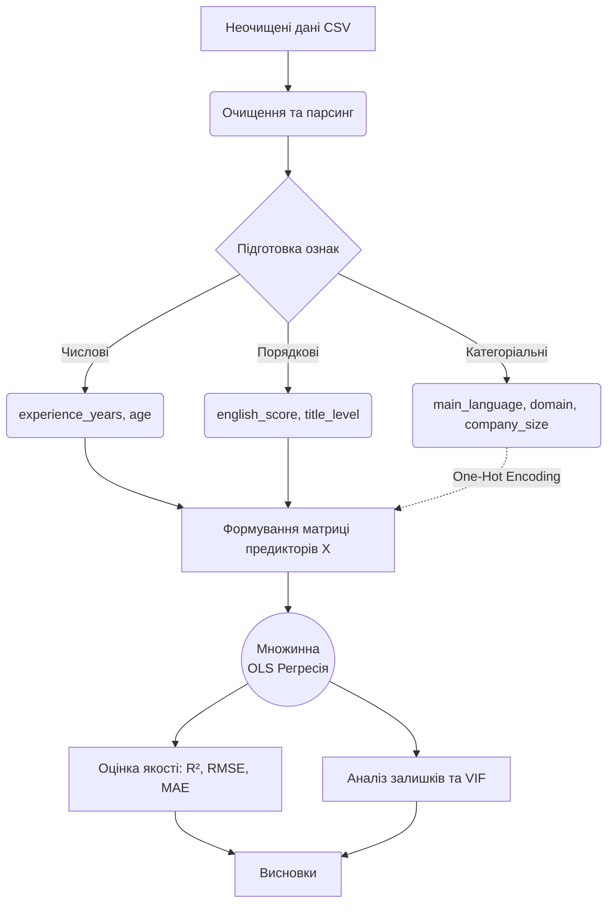

*Рис. 1. Блок-схема логіки побудови та оцінювання множинної лінійної регресії.*

### Крок 1. Вхідні дані та глибока підготовка предикторів

Алгоритми регресії можуть працювати лише з числами. Тому першочерговим завданням є коректне перетворення текстових даних.

Ми проводимо фільтрацію датасету, залишаючи лише спеціалістів із категорією `Software Engineer / Developer`, які перебувають в Україні. Пропуски у ключових колонках видаляються. Текстові колонки очищаються від зайвих пробілів та символів (наприклад, знімаються коми у зарплаті).

```python
import re
import numpy as np
import pandas as pd

raw = pd.read_csv("04_data/2025_dec_raw.csv", encoding="utf-8-sig")

def collapse_whitespace(value):
    text = str(value).replace("\n", " ").replace("\r", " ")
    return re.sub(r"\s+", " ", text).strip()

def parse_money(value):
    text = collapse_whitespace(value).replace(",", "")
    return pd.to_numeric(text, errors="coerce")

def parse_first_int(value):
    match = re.search(r"\d+", collapse_whitespace(value))
    return int(match.group()) if match else pd.NA

category = raw.iloc[:, 5].map(collapse_whitespace)
country = raw.iloc[:, 17].map(collapse_whitespace)

df = pd.DataFrame(
    {
        "salary_usd_net": raw.iloc[:, 2].map(parse_money),
        "bonus_usd": raw.iloc[:, 3].map(parse_money),
        "title": raw.iloc[:, 4].map(collapse_whitespace),
        "domain": raw.iloc[:, 7].map(collapse_whitespace),
        "specialization": raw.iloc[:, 8].map(collapse_whitespace),
        "main_language": raw.iloc[:, 10].map(collapse_whitespace),
        "company_size": raw.iloc[:, 12].map(collapse_whitespace),
        "experience_years": raw.iloc[:, 13].map(parse_first_int),
        "english_level": raw.iloc[:, 14].map(collapse_whitespace),
        "age": pd.to_numeric(raw.iloc[:, 16], errors="coerce"),
        "country": country,
    }
)

mask = category.str.contains("Software Engineer / Developer", regex=False)
mask &= country.eq("В Україні")

df = df.loc[mask].dropna(subset=["salary_usd_net", "experience_years", "age"]).copy()
df["experience_years"] = df["experience_years"].astype(int)
df["age"] = df["age"].astype(int)
```

Особливої уваги заслуговують рівень англійської (`english_level`) та посада (`title`). Ці змінні мають природний порядок (наприклад, Senior об'єктивно вище за Middle). Якщо ми закодуємо їх за допомогою One-Hot Encoding, ми втратимо цю інформацію про впорядкованість. Тому ми перетворюємо їх на числові ранги за допомогою словників `english_map` та `title_map`.
> [!NOTE]
> Такий підхід передбачає припущення, що переходи між рівнями є лінійними, що для навчальних цілей є абсолютно припустимим.

```python
english_map = {
    "Elementary": 1,
    "Pre-Intermediate": 2,
    "Intermediate": 3,
    "Upper-Intermediate": 4,
    "Advanced": 5,
}

title_map = {
    "Intern": 0,
    "Junior": 1,
    "Middle": 2,
    "Senior": 3,
    "Tech Lead": 4,
    "Technical Lead": 4,
    "Team Lead": 4,
    "Lead": 4,
    "Architect": 5,
    "System Architect": 5,
    "Staff": 5,
    "Principal": 5,
}

df["english_score"] = df["english_level"].map(english_map).fillna(3)
df["title_level"] = df["title"].map(title_map).fillna(2)
```

Після очищення залишається **4066** спостережень із середньою зарплатою близько 3816 USD. Загальний огляд взаємозв'язків між числовими та категоріальними змінними наведено на рис. 2, 3 та 4.

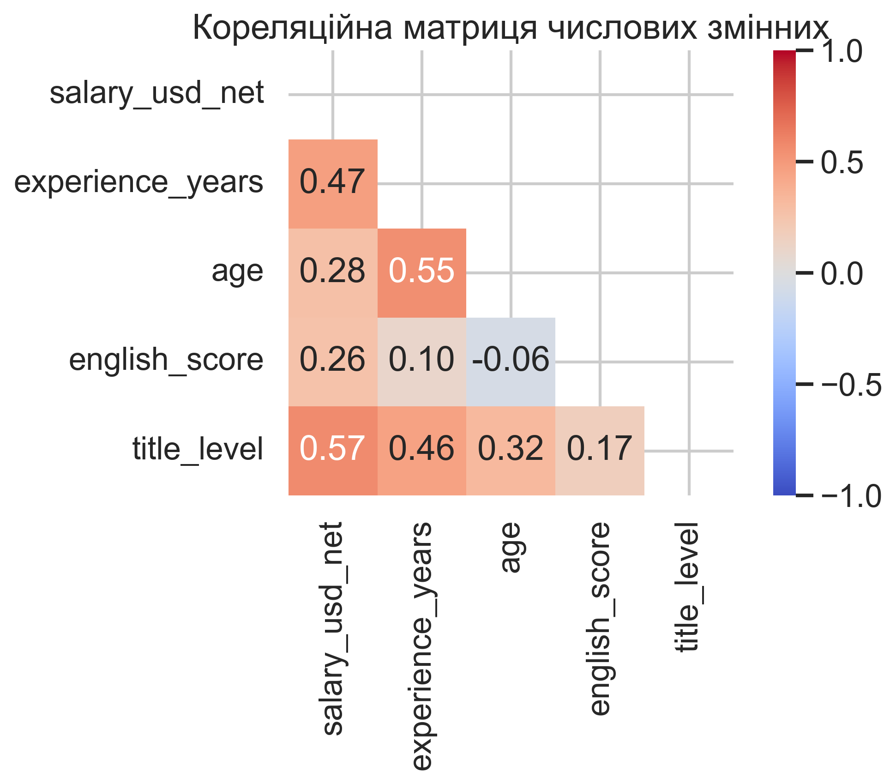
*Рис. 2. Кореляційна матриця допомагає виявити як лінійний зв'язок предикторів із цільовою змінною (наприклад, title_level має потужну кореляцію із зарплатою r=0.74), так і мультиколінеарність (високу кореляцію між самими предикторами).*

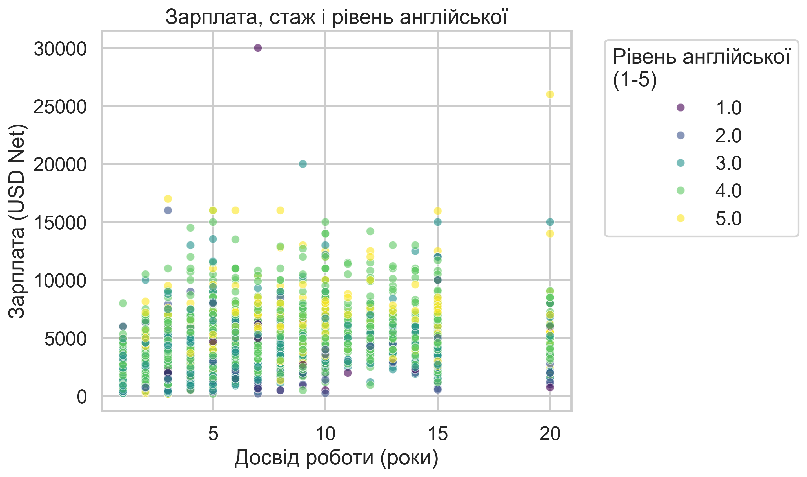
*Рис. 3. Візуалізація показує, що зі збільшенням стажу зростає і зарплата, проте також чітко видно вплив рівня англійської: точки світліших кольорів (краща англійська) здебільшого розташовані вище у відповідних групах стажу.*

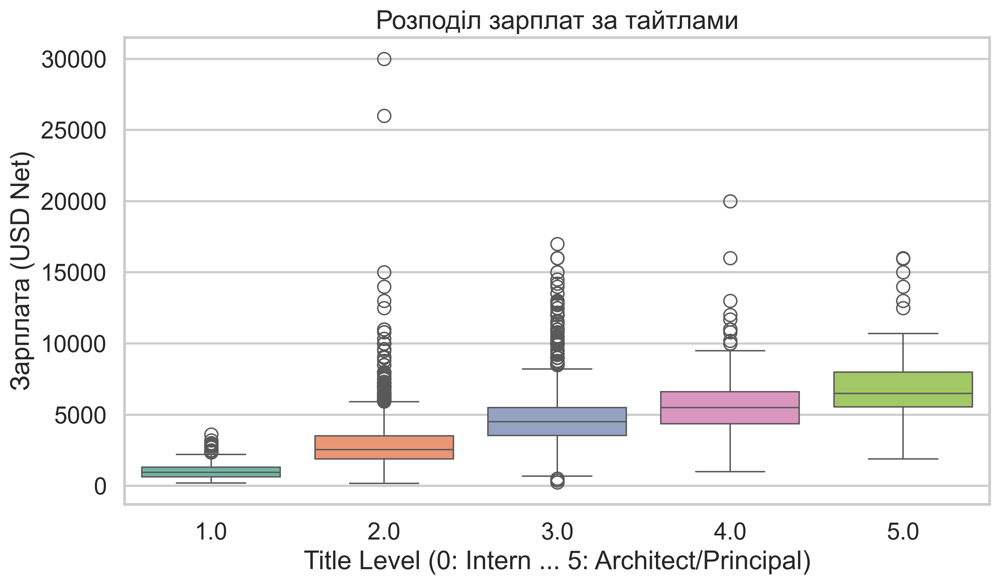
*Рис. 4. Боксплоти яскраво демонструють нелінійне зростання медіанної зарплати при переході до вищого рівня посади (від Junior до Senior і вище).*

### Крок 2. Побудова статистичної OLS-моделі та аналіз параметрів

Для розрахунку моделі використаємо бібліотеку `statsmodels`, яка надає потужну статистичну діагностику (на відміну від `scikit-learn`, який сфокусований виключно на ML-прогнозуванні). Категоріальні змінні без внутрішнього порядку (мова, розмір компанії, домен) передаються через функцію `C(...)`. Бібліотека автоматично застосує Dummy (One-Hot) кодування, відкинувши базову категорію, щоб уникнути ідеальної мультиколінеарності (пастки фіктивних змінних).

```python
import statsmodels.api as sm

formula = (
    "salary_usd_net ~ experience_years + age + english_score + title_level + "
    "C(main_language) + C(company_size) + C(domain)"
)

ols_model = sm.OLS.from_formula(formula, data=df).fit()
print(ols_model.summary())
```

Приклад ключових оцінених параметрів (див. рис. 5):

| параметр | оцінка (estimate) | інтерпретація впливу |
| :--- | :--- | :--- |
| `Intercept` | 121.868 | Базова лінія зарплати для фахівця з нульовими показниками (хоч це і не має прямого фізичного сенсу). |
| `experience_years` | 68.324 | Кожен додатковий рік стажу (за умови фіксованого віку, рівня та англійської) приносить у середньому 68.3 USD надбавки. |
| `title_level` | 1146.54 | Підвищення тайтлу на один рівень збільшує очікувану зарплату приблизно на 1146 USD. |
| `C(main_language)[T.Scala]` | 866.45 | Програмування на Scala додає до зарплати 866 USD порівняно з базовою мовою програмування у моделі. |
| `C(main_language)[T.1C]` | -2442.95 | Програмування на 1С знижує очікувану зарплату на 2442 USD відносно базової мови. |

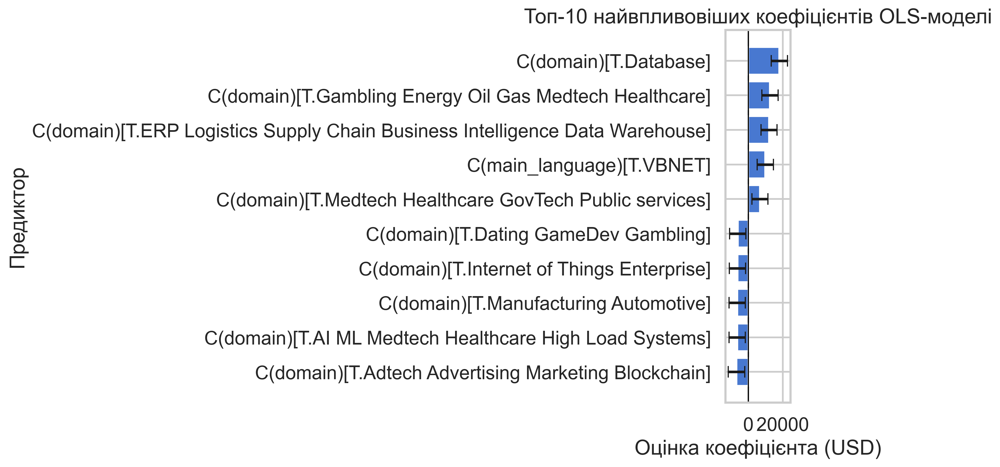
*Рис. 5. Топ найвпливовіших коефіцієнтів показує, що мова програмування та рівень тайтлу є критичними факторами.*

### Крок 3. Оцінювання якості: чому нам потрібні різні метрики?

Просто побудувати рівняння недостатньо. Ми маємо зрозуміти, наскільки добре воно описує реальність.

1. **Коефіцієнт детермінації ($R^2$)**: $R^2 = 1 - \frac{SSE}{SST}$. Він відповідає на запитання: «Яку частку дисперсії (розкиду) зарплат пояснює наша модель?». Якщо $R^2 = 0.64$, це означає, що 64% відмінностей у зарплатах пояснюються тими факторами, які ми включили (стажем, мовою тощо), а 36% припадає на невідомі фактори.
2. **Скоригований $R^2$ (Adjusted $R^2$)**: $R^2_{adj} = 1 - (1 - R^2)\frac{n - 1}{n - p - 1}$. Звичайний $R^2$ завжди зростає, коли ми додаємо нові фактори, навіть якщо вони є "сміттям". Adjusted $R^2$ штрафує модель за використання зайвих (незначущих) предикторів ($p$). Якщо $R^2$ набагато більший за Adjusted $R^2$, у моделі забагато непотрібних змінних.
3. **F-статистика**: $F = \frac{SSR / p}{SSE / (n - p - 1)}$. Перевіряє гіпотезу про те, що *всі* коефіцієнти моделі одночасно дорівнюють нулю (модель не працює взагалі). Дуже мале $p$-value для F-тесту (як у нашому випадку $0.0000$) підтверджує, що модель значуща.
4. **RMSE та MAE**:
   - $RMSE = \sqrt{\frac{1}{n}\sum(y_i - \hat{y}_i)^2}$ – корінь із середньоквадратичної помилки. Вона "сильно б'є" по великих помилках моделі через зведення у квадрат.
   - $MAE = \frac{1}{n}\sum |y_i - \hat{y}_i|$ – середня абсолютна помилка. Показує, на скільки доларів у середньому помиляється наша модель.

У нашому OLS звіті $R^2 \approx 0.64$, а MAE на навчальних даних становить **845 USD**. Це хороші показники, проте їх перевірка на тих самих даних, на яких навчалася модель (Train Set), завжди є надто оптимістичною.

### Крок 4. Реалізація стійкого конвеєра (Scikit-learn Pipeline)

Щоб отримати об'єктивну оцінку, поділимо датасет на тренувальну та тестову частини. Використаємо `Pipeline` для масштабування числових ознак (важливо для стабільності) та One-Hot кодування категоріальних.

```python
from sklearn.compose import ColumnTransformer
from sklearn.linear_model import LinearRegression
from sklearn.metrics import mean_absolute_error, mean_squared_error, r2_score
from sklearn.model_selection import train_test_split
from sklearn.pipeline import Pipeline
from sklearn.preprocessing import OneHotEncoder, StandardScaler

numeric_features = ["experience_years", "age", "english_score", "title_level"]
categorical_features = ["main_language", "company_size", "domain"]

X = df[numeric_features + categorical_features]
y = df["salary_usd_net"]

preprocessor = ColumnTransformer(
    [
        ("num", StandardScaler(), numeric_features),
        ("cat", OneHotEncoder(drop="first", handle_unknown="ignore"), categorical_features),
    ]
)

pipeline = Pipeline([("preprocess", preprocessor), ("model", LinearRegression())])
X_train, X_test, y_train, y_test = train_test_split(X, y, test_size=0.25, random_state=42)
pipeline.fit(X_train, y_train)
y_pred = pipeline.predict(X_test)

print(f"Test R^2: {r2_score(y_test, y_pred):.4f}")
print(f"Test RMSE: {mean_squared_error(y_test, y_pred) ** 0.5:.2f}")
print(f"Test MAE: {mean_absolute_error(y_test, y_pred):.2f}")
```

Результати на test-наборі (див. рис. 6): $R^2 \approx 0.52$, RMSE $\approx 1620$, MAE $\approx 1030$. Падіння $R^2$ порівняно з навчальною вибіркою свідчить про те, що модель трохи "перевчилася" на специфічних комбінаціях категоріальних ознак (особливо малопредставлених доменах або розмірах компаній).

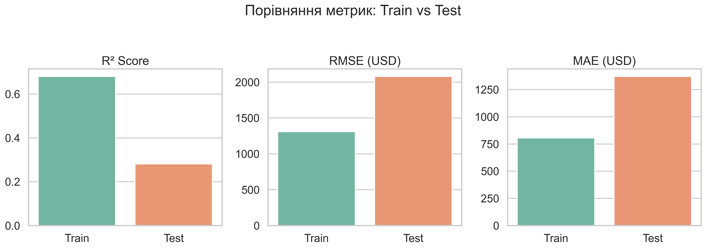
*Рис. 6. Візуальне порівняння Train та Test метрик демонструє феномен перенавчання (Overfitting). Test MAE є більш реалістичною оцінкою помилки прогнозування для нових даних.*

### Крок 5. Аналіз залишків: що не врахувала модель?

Аналіз залишків (residuals), тобто різниці між реальними ($y$) та спрогнозованими ($\hat{y}$) значеннями, є інструментом глибокої діагностики.

- **Діаграма залишків (Scatter Plot)** (рис. 7) допомагає виявити *гетероскедастичність* (несталість дисперсії). Якщо хмара точок розширюється зі зростанням прогнозованої зарплати, це означає, що для високих зарплат модель помиляється значно сильніше, ніж для низьких.
- **Розподіл залишків** (рис. 8) має бути близьким до нормального розподілу з центром у нулі.
- **Q-Q Plot** (рис. 9) наочно перевіряє нормальність залишків. Відхилення точок від червоної лінії на краях свідчать про наявність "важких хвостів" (екстремальних зарплат, які лінійна модель не здатна пояснити).
- **Observed vs predicted** (рис. 10) показує загальну якість відповідності реальних даних до прогнозних.

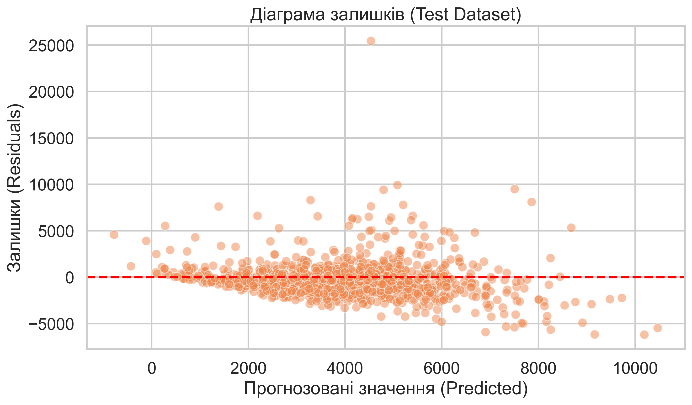
*Рис. 7. Діаграма залишків.*

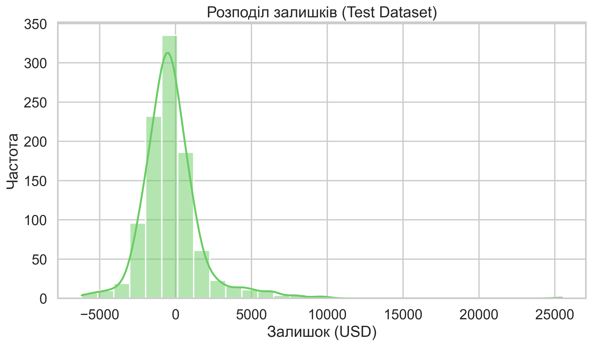
*Рис. 8. Розподіл залишків.*

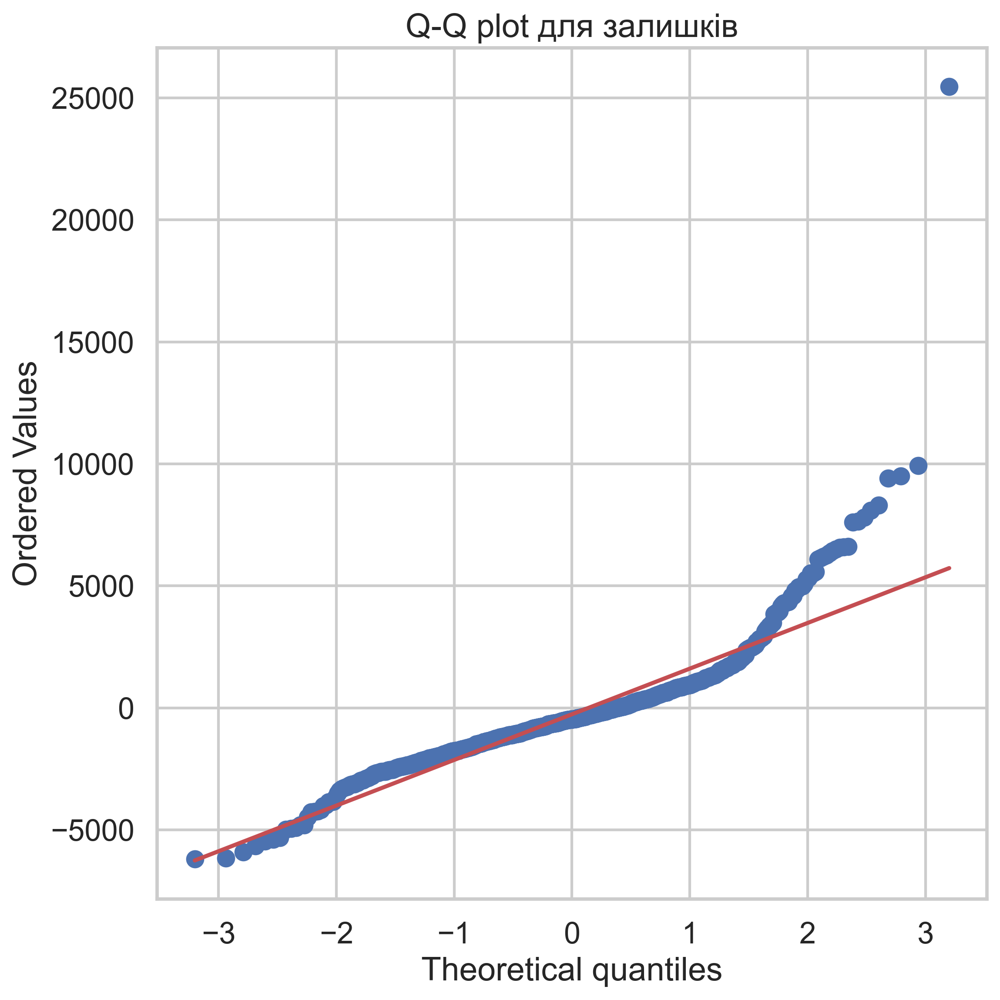
*Рис. 9. Q-Q plot для залишків.*

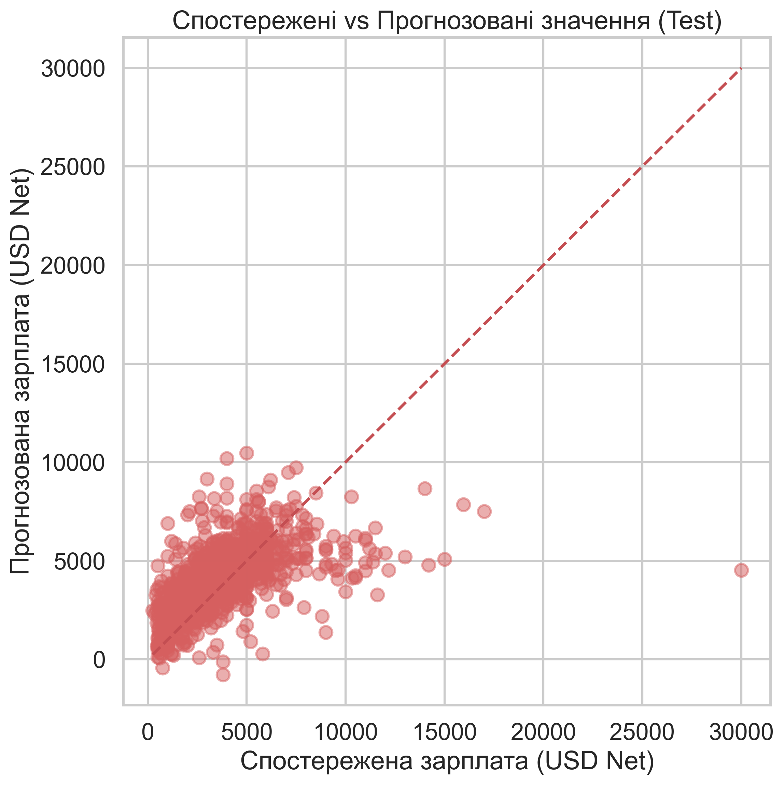
*Рис. 10. Observed vs predicted.*

### Крок 6. Діагностика мультиколінеарності через VIF

Мультиколінеарність виникає, коли предиктори сильно корелюють між собою (наприклад, вік та стаж). Вона не псує загальний прогноз, але робить оцінки індивідуальних коефіцієнтів вкрай нестабільними та хибними. Фактор інфляції дисперсії (VIF) обчислюється для кожного предиктора як:
$$
VIF_j = \frac{1}{1 - R_j^2}
$$
де $R_j^2$ – коефіцієнт детермінації регресії $j$-го предиктора на всі інші предиктори. Зазвичай проблемним вважається $VIF > 5$ (див. рис. 11).

```python
from statsmodels.stats.outliers_influence import variance_inflation_factor

X_num = sm.add_constant(df[["experience_years", "age", "english_score", "title_level"]])
vif_table = pd.DataFrame(
    {
        "feature": X_num.columns,
        "VIF": [variance_inflation_factor(X_num.values, i) for i in range(X_num.shape[1])],
    }
)
print(vif_table[vif_table["feature"] != "const"].sort_values("VIF", ascending=False))
```

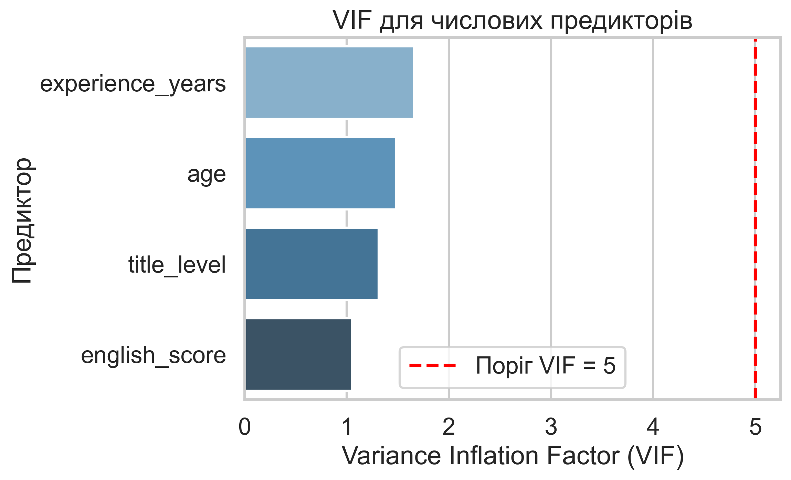
*Рис. 11. Як видно з графіка, найбільший VIF має стаж (близько 1.6), що є абсолютно нормальним значенням, далеким від критичного порогу у 5. Мультиколінеарність серед числових змінних відсутня.*

### Критичний аналіз та висновки до контрольного прикладу

Побудована множинна лінійна модель дає змогу зробити низку важливих науково-практичних висновків щодо ринку праці українських розробників:

1. **Вплив факторів**: Найвпливовішими ознаками очікувано виявилися посада (`title_level`) та мова програмування (`main_language`). Експертність, виражена через посаду, має найбільший ефект, тоді як стаж (`experience_years`) дає більш плавне і стабільне зростання близько 68 USD за рік досвіду.
2. **Якість прогнозування (Test MAE)**: Середня абсолютна помилка моделі на нових даних становить близько 1000 USD. Хоча $R^2 \approx 0.52$ свідчить про те, що модель охоплює головні тенденції, помилка в 1000 доларів вказує на наявність потужних "прихованих" факторів. Значна частина зарплати може пояснюватися навичками перемовин кандидата, терміновістю проєкту компанії, специфічним стеком технологій (а не лише "основною мовою"), а також софт-скілами, які не відображені в анкеті.
3. **Обмеження моделі та гетероскедастичність**: Аналіз діаграми залишків (рис. 7) чітко демонструє лійкоподібне розширення хмари точок. Це означає, що дисперсія зарплат зростає разом із рівнем кваліфікації. Іншими словами, зарплати Junior-спеціалістів є жорстко стандартизованими (розкид малий), тоді як для Architect-рівня індивідуальні контракти можуть відрізнятися на тисячі доларів. Класична лінійна регресія OLS погано справляється з гетероскедастичністю, і для покращення результатів у майбутньому можна застосувати логарифмування залежної змінної $\ln(y)$.
4. **Методологічна надійність**: Завдяки розділенню даних на Train та Test за допомогою Scikit-learn Pipeline та аналізу VIF, ми переконалися у відсутності критичних математичних помилок, таких як мультиколінеарність чи ілюзорне перенавчання. Отримані оцінки коефіцієнтів можна вважати надійними орієнтирами для ринку.

---

## Завдання для самостійного виконання

### <span style="color:red; font-size:1.5em;">Завдання 1. Підготовка даних і формування предикторів для множинної регресії</span>

---

**Для всіх варіантів:**

- **Робочий зріз:** формуйте `df_variant` лише за правилом свого варіанта на очищеній підвибірці українських `Software Engineer / Developer`.
- **Залежна змінна:** використовуйте `salary_usd_net`.
- **Базові предиктори:** використовуйте `experience_years`, `age`, `english_score`, `title_level`, `main_language`, `company_size` і `domain`.
- **Обов’язкові результати:** подайте `n`, описові статистики, таблицю типів змінних, кореляційну матрицю числових предикторів і короткий висновок про придатність зрізу до моделювання.

**Варіант 1 – TypeScript:**

- **Мета:** підготувати робочий зріз розробників з основною мовою TypeScript до побудови множинної лінійної регресії для `salary_usd_net`.
- **Кроки:**

    1. Сформуйте `df_variant` за правилом `df[df["main_language"] == "TypeScript"].copy()` і зафіксуйте кількість спостережень, частку пропусків та діапазон `salary_usd_net`.
    2. Створіть `english_score` через упорядковане кодування рівнів англійської та `title_level` через упорядковане кодування тайтлів; явно наведіть використані словники відповідності.
    3. Сформуйте список `numeric_features = ["experience_years", "age", "english_score", "title_level"]` і `categorical_features = ["main_language", "company_size", "domain"]`, після чого перевірте типи цих колонок.
    4. Побудуйте таблицю описових статистик для числових змінних і кореляційну матрицю, щоб виявити первинні ознаки лінійних зв’язків між предикторами.
    5. Сформулюйте висновок: чи достатній обсяг підвибірки, які предиктори виглядають змістовно важливими, які змінні потребують кодування і які ризики для моделі вже помітні на етапі підготовки.

- **Підказки:** для категоріальних змінних не використовуйте ручне присвоєння випадкових чисел. У множинній регресії текстові категорії потрібно кодувати через `C(...)` у `statsmodels` або через `OneHotEncoder` у `scikit-learn`.

**Варіант 2 – JavaScript:**

- **Мета:** підготувати робочий зріз розробників з основною мовою JavaScript до побудови множинної лінійної регресії для `salary_usd_net`.
- **Кроки:**

    1. Сформуйте `df_variant` за правилом `df[df["main_language"] == "JavaScript"].copy()` і зафіксуйте кількість спостережень, частку пропусків та діапазон `salary_usd_net`.
    2. Створіть `english_score` через упорядковане кодування рівнів англійської та `title_level` через упорядковане кодування тайтлів; явно наведіть використані словники відповідності.
    3. Сформуйте список `numeric_features = ["experience_years", "age", "english_score", "title_level"]` і `categorical_features = ["main_language", "company_size", "domain"]`, після чого перевірте типи цих колонок.
    4. Побудуйте таблицю описових статистик для числових змінних і кореляційну матрицю, щоб виявити первинні ознаки лінійних зв’язків між предикторами.
    5. Сформулюйте висновок: чи достатній обсяг підвибірки, які предиктори виглядають змістовно важливими, які змінні потребують кодування і які ризики для моделі вже помітні на етапі підготовки.

- **Підказки:** для категоріальних змінних не використовуйте ручне присвоєння випадкових чисел. У множинній регресії текстові категорії потрібно кодувати через `C(...)` у `statsmodels` або через `OneHotEncoder` у `scikit-learn`.

**Варіант 3 – C# / .NET:**

- **Мета:** підготувати робочий зріз розробників з основною мовою C# / .NET до побудови множинної лінійної регресії для `salary_usd_net`.
- **Кроки:**

    1. Сформуйте `df_variant` за правилом `df[df["main_language"] == "C# / .NET"].copy()` і зафіксуйте кількість спостережень, частку пропусків та діапазон `salary_usd_net`.
    2. Створіть `english_score` через упорядковане кодування рівнів англійської та `title_level` через упорядковане кодування тайтлів; явно наведіть використані словники відповідності.
    3. Сформуйте список `numeric_features = ["experience_years", "age", "english_score", "title_level"]` і `categorical_features = ["main_language", "company_size", "domain"]`, після чого перевірте типи цих колонок.
    4. Побудуйте таблицю описових статистик для числових змінних і кореляційну матрицю, щоб виявити первинні ознаки лінійних зв’язків між предикторами.
    5. Сформулюйте висновок: чи достатній обсяг підвибірки, які предиктори виглядають змістовно важливими, які змінні потребують кодування і які ризики для моделі вже помітні на етапі підготовки.

- **Підказки:** для категоріальних змінних не використовуйте ручне присвоєння випадкових чисел. У множинній регресії текстові категорії потрібно кодувати через `C(...)` у `statsmodels` або через `OneHotEncoder` у `scikit-learn`.

**Варіант 4 – Java:**

- **Мета:** підготувати робочий зріз розробників з основною мовою Java до побудови множинної лінійної регресії для `salary_usd_net`.
- **Кроки:**

    1. Сформуйте `df_variant` за правилом `df[df["main_language"] == "Java"].copy()` і зафіксуйте кількість спостережень, частку пропусків та діапазон `salary_usd_net`.
    2. Створіть `english_score` через упорядковане кодування рівнів англійської та `title_level` через упорядковане кодування тайтлів; явно наведіть використані словники відповідності.
    3. Сформуйте список `numeric_features = ["experience_years", "age", "english_score", "title_level"]` і `categorical_features = ["main_language", "company_size", "domain"]`, після чого перевірте типи цих колонок.
    4. Побудуйте таблицю описових статистик для числових змінних і кореляційну матрицю, щоб виявити первинні ознаки лінійних зв’язків між предикторами.
    5. Сформулюйте висновок: чи достатній обсяг підвибірки, які предиктори виглядають змістовно важливими, які змінні потребують кодування і які ризики для моделі вже помітні на етапі підготовки.

- **Підказки:** для категоріальних змінних не використовуйте ручне присвоєння випадкових чисел. У множинній регресії текстові категорії потрібно кодувати через `C(...)` у `statsmodels` або через `OneHotEncoder` у `scikit-learn`.

**Варіант 5 – PHP:**

- **Мета:** підготувати робочий зріз розробників з основною мовою PHP до побудови множинної лінійної регресії для `salary_usd_net`.
- **Кроки:**

    1. Сформуйте `df_variant` за правилом `df[df["main_language"] == "PHP"].copy()` і зафіксуйте кількість спостережень, частку пропусків та діапазон `salary_usd_net`.
    2. Створіть `english_score` через упорядковане кодування рівнів англійської та `title_level` через упорядковане кодування тайтлів; явно наведіть використані словники відповідності.
    3. Сформуйте список `numeric_features = ["experience_years", "age", "english_score", "title_level"]` і `categorical_features = ["main_language", "company_size", "domain"]`, після чого перевірте типи цих колонок.
    4. Побудуйте таблицю описових статистик для числових змінних і кореляційну матрицю, щоб виявити первинні ознаки лінійних зв’язків між предикторами.
    5. Сформулюйте висновок: чи достатній обсяг підвибірки, які предиктори виглядають змістовно важливими, які змінні потребують кодування і які ризики для моделі вже помітні на етапі підготовки.

- **Підказки:** для категоріальних змінних не використовуйте ручне присвоєння випадкових чисел. У множинній регресії текстові категорії потрібно кодувати через `C(...)` у `statsmodels` або через `OneHotEncoder` у `scikit-learn`.

**Варіант 6 – Python:**

- **Мета:** підготувати робочий зріз розробників з основною мовою Python до побудови множинної лінійної регресії для `salary_usd_net`.
- **Кроки:**

    1. Сформуйте `df_variant` за правилом `df[df["main_language"] == "Python"].copy()` і зафіксуйте кількість спостережень, частку пропусків та діапазон `salary_usd_net`.
    2. Створіть `english_score` через упорядковане кодування рівнів англійської та `title_level` через упорядковане кодування тайтлів; явно наведіть використані словники відповідності.
    3. Сформуйте список `numeric_features = ["experience_years", "age", "english_score", "title_level"]` і `categorical_features = ["main_language", "company_size", "domain"]`, після чого перевірте типи цих колонок.
    4. Побудуйте таблицю описових статистик для числових змінних і кореляційну матрицю, щоб виявити первинні ознаки лінійних зв’язків між предикторами.
    5. Сформулюйте висновок: чи достатній обсяг підвибірки, які предиктори виглядають змістовно важливими, які змінні потребують кодування і які ризики для моделі вже помітні на етапі підготовки.

- **Підказки:** для категоріальних змінних не використовуйте ручне присвоєння випадкових чисел. У множинній регресії текстові категорії потрібно кодувати через `C(...)` у `statsmodels` або через `OneHotEncoder` у `scikit-learn`.

**Варіант 7 – Back-end:**

- **Мета:** підготувати робочий зріз розробників зі спеціалізацією Back-end розробка до побудови множинної лінійної регресії для `salary_usd_net`.
- **Кроки:**

    1. Сформуйте `df_variant` за правилом `df[df["specialization"] == "Back-end розробка"].copy()` і зафіксуйте кількість спостережень, частку пропусків та діапазон `salary_usd_net`.
    2. Створіть `english_score` через упорядковане кодування рівнів англійської та `title_level` через упорядковане кодування тайтлів; явно наведіть використані словники відповідності.
    3. Сформуйте список `numeric_features = ["experience_years", "age", "english_score", "title_level"]` і `categorical_features = ["main_language", "company_size", "domain"]`, після чого перевірте типи цих колонок.
    4. Побудуйте таблицю описових статистик для числових змінних і кореляційну матрицю, щоб виявити первинні ознаки лінійних зв’язків між предикторами.
    5. Сформулюйте висновок: чи достатній обсяг підвибірки, які предиктори виглядають змістовно важливими, які змінні потребують кодування і які ризики для моделі вже помітні на етапі підготовки.

- **Підказки:** для категоріальних змінних не використовуйте ручне присвоєння випадкових чисел. У множинній регресії текстові категорії потрібно кодувати через `C(...)` у `statsmodels` або через `OneHotEncoder` у `scikit-learn`.

**Варіант 8 – Front-end:**

- **Мета:** підготувати робочий зріз розробників зі спеціалізацією Front-end розробка до побудови множинної лінійної регресії для `salary_usd_net`.
- **Кроки:**

    1. Сформуйте `df_variant` за правилом `df[df["specialization"] == "Front-end розробка"].copy()` і зафіксуйте кількість спостережень, частку пропусків та діапазон `salary_usd_net`.
    2. Створіть `english_score` через упорядковане кодування рівнів англійської та `title_level` через упорядковане кодування тайтлів; явно наведіть використані словники відповідності.
    3. Сформуйте список `numeric_features = ["experience_years", "age", "english_score", "title_level"]` і `categorical_features = ["main_language", "company_size", "domain"]`, після чого перевірте типи цих колонок.
    4. Побудуйте таблицю описових статистик для числових змінних і кореляційну матрицю, щоб виявити первинні ознаки лінійних зв’язків між предикторами.
    5. Сформулюйте висновок: чи достатній обсяг підвибірки, які предиктори виглядають змістовно важливими, які змінні потребують кодування і які ризики для моделі вже помітні на етапі підготовки.

- **Підказки:** для категоріальних змінних не використовуйте ручне присвоєння випадкових чисел. У множинній регресії текстові категорії потрібно кодувати через `C(...)` у `statsmodels` або через `OneHotEncoder` у `scikit-learn`.

**Варіант 9 – Full Stack:**

- **Мета:** підготувати робочий зріз розробників зі спеціалізацією Full Stack розробка до побудови множинної лінійної регресії для `salary_usd_net`.
- **Кроки:**

    1. Сформуйте `df_variant` за правилом `df[df["specialization"] == "Full Stack розробка"].copy()` і зафіксуйте кількість спостережень, частку пропусків та діапазон `salary_usd_net`.
    2. Створіть `english_score` через упорядковане кодування рівнів англійської та `title_level` через упорядковане кодування тайтлів; явно наведіть використані словники відповідності.
    3. Сформуйте список `numeric_features = ["experience_years", "age", "english_score", "title_level"]` і `categorical_features = ["main_language", "company_size", "domain"]`, після чого перевірте типи цих колонок.
    4. Побудуйте таблицю описових статистик для числових змінних і кореляційну матрицю, щоб виявити первинні ознаки лінійних зв’язків між предикторами.
    5. Сформулюйте висновок: чи достатній обсяг підвибірки, які предиктори виглядають змістовно важливими, які змінні потребують кодування і які ризики для моделі вже помітні на етапі підготовки.

- **Підказки:** для категоріальних змінних не використовуйте ручне присвоєння випадкових чисел. У множинній регресії текстові категорії потрібно кодувати через `C(...)` у `statsmodels` або через `OneHotEncoder` у `scikit-learn`.

**Варіант 10 – Mobile:**

- **Мета:** підготувати робочий зріз розробників зі спеціалізацією Mobile розробка до побудови множинної лінійної регресії для `salary_usd_net`.
- **Кроки:**

    1. Сформуйте `df_variant` за правилом `df[df["specialization"] == "Mobile розробка"].copy()` і зафіксуйте кількість спостережень, частку пропусків та діапазон `salary_usd_net`.
    2. Створіть `english_score` через упорядковане кодування рівнів англійської та `title_level` через упорядковане кодування тайтлів; явно наведіть використані словники відповідності.
    3. Сформуйте список `numeric_features = ["experience_years", "age", "english_score", "title_level"]` і `categorical_features = ["main_language", "company_size", "domain"]`, після чого перевірте типи цих колонок.
    4. Побудуйте таблицю описових статистик для числових змінних і кореляційну матрицю, щоб виявити первинні ознаки лінійних зв’язків між предикторами.
    5. Сформулюйте висновок: чи достатній обсяг підвибірки, які предиктори виглядають змістовно важливими, які змінні потребують кодування і які ризики для моделі вже помітні на етапі підготовки.

- **Підказки:** для категоріальних змінних не використовуйте ручне присвоєння випадкових чисел. У множинній регресії текстові категорії потрібно кодувати через `C(...)` у `statsmodels` або через `OneHotEncoder` у `scikit-learn`.

**Варіант 11 – Desktop:**

- **Мета:** підготувати робочий зріз розробників зі спеціалізацією Desktop до побудови множинної лінійної регресії для `salary_usd_net`.
- **Кроки:**

    1. Сформуйте `df_variant` за правилом `df[df["specialization"] == "Desktop"].copy()` і зафіксуйте кількість спостережень, частку пропусків та діапазон `salary_usd_net`.
    2. Створіть `english_score` через упорядковане кодування рівнів англійської та `title_level` через упорядковане кодування тайтлів; явно наведіть використані словники відповідності.
    3. Сформуйте список `numeric_features = ["experience_years", "age", "english_score", "title_level"]` і `categorical_features = ["main_language", "company_size", "domain"]`, після чого перевірте типи цих колонок.
    4. Побудуйте таблицю описових статистик для числових змінних і кореляційну матрицю, щоб виявити первинні ознаки лінійних зв’язків між предикторами.
    5. Сформулюйте висновок: чи достатній обсяг підвибірки, які предиктори виглядають змістовно важливими, які змінні потребують кодування і які ризики для моделі вже помітні на етапі підготовки.

- **Підказки:** для категоріальних змінних не використовуйте ручне присвоєння випадкових чисел. У множинній регресії текстові категорії потрібно кодувати через `C(...)` у `statsmodels` або через `OneHotEncoder` у `scikit-learn`.

**Варіант 12 – Embedded:**

- **Мета:** підготувати робочий зріз розробників зі спеціалізацією Embedded до побудови множинної лінійної регресії для `salary_usd_net`.
- **Кроки:**

    1. Сформуйте `df_variant` за правилом `df[df["specialization"] == "Embedded"].copy()` і зафіксуйте кількість спостережень, частку пропусків та діапазон `salary_usd_net`.
    2. Створіть `english_score` через упорядковане кодування рівнів англійської та `title_level` через упорядковане кодування тайтлів; явно наведіть використані словники відповідності.
    3. Сформуйте список `numeric_features = ["experience_years", "age", "english_score", "title_level"]` і `categorical_features = ["main_language", "company_size", "domain"]`, після чого перевірте типи цих колонок.
    4. Побудуйте таблицю описових статистик для числових змінних і кореляційну матрицю, щоб виявити первинні ознаки лінійних зв’язків між предикторами.
    5. Сформулюйте висновок: чи достатній обсяг підвибірки, які предиктори виглядають змістовно важливими, які змінні потребують кодування і які ризики для моделі вже помітні на етапі підготовки.

- **Підказки:** для категоріальних змінних не використовуйте ручне присвоєння випадкових чисел. У множинній регресії текстові категорії потрібно кодувати через `C(...)` у `statsmodels` або через `OneHotEncoder` у `scikit-learn`.

**Варіант 13 – Fintech / Banking / Capital Management:**

- **Мета:** підготувати робочий зріз розробників домену Fintech / Banking / Capital Management до побудови множинної лінійної регресії для `salary_usd_net`.
- **Кроки:**

    1. Сформуйте `df_variant` за правилом `df[df["domain"] == "Fintech / Banking / Capital Management"].copy()` і зафіксуйте кількість спостережень, частку пропусків та діапазон `salary_usd_net`.
    2. Створіть `english_score` через упорядковане кодування рівнів англійської та `title_level` через упорядковане кодування тайтлів; явно наведіть використані словники відповідності.
    3. Сформуйте список `numeric_features = ["experience_years", "age", "english_score", "title_level"]` і `categorical_features = ["main_language", "company_size", "domain"]`, після чого перевірте типи цих колонок.
    4. Побудуйте таблицю описових статистик для числових змінних і кореляційну матрицю, щоб виявити первинні ознаки лінійних зв’язків між предикторами.
    5. Сформулюйте висновок: чи достатній обсяг підвибірки, які предиктори виглядають змістовно важливими, які змінні потребують кодування і які ризики для моделі вже помітні на етапі підготовки.

- **Підказки:** для категоріальних змінних не використовуйте ручне присвоєння випадкових чисел. У множинній регресії текстові категорії потрібно кодувати через `C(...)` у `statsmodels` або через `OneHotEncoder` у `scikit-learn`.

**Варіант 14 – E-commerce:**

- **Мета:** підготувати робочий зріз розробників домену E-commerce до побудови множинної лінійної регресії для `salary_usd_net`.
- **Кроки:**

    1. Сформуйте `df_variant` за правилом `df[df["domain"] == "E-commerce"].copy()` і зафіксуйте кількість спостережень, частку пропусків та діапазон `salary_usd_net`.
    2. Створіть `english_score` через упорядковане кодування рівнів англійської та `title_level` через упорядковане кодування тайтлів; явно наведіть використані словники відповідності.
    3. Сформуйте список `numeric_features = ["experience_years", "age", "english_score", "title_level"]` і `categorical_features = ["main_language", "company_size", "domain"]`, після чого перевірте типи цих колонок.
    4. Побудуйте таблицю описових статистик для числових змінних і кореляційну матрицю, щоб виявити первинні ознаки лінійних зв’язків між предикторами.
    5. Сформулюйте висновок: чи достатній обсяг підвибірки, які предиктори виглядають змістовно важливими, які змінні потребують кодування і які ризики для моделі вже помітні на етапі підготовки.

- **Підказки:** для категоріальних змінних не використовуйте ручне присвоєння випадкових чисел. У множинній регресії текстові категорії потрібно кодувати через `C(...)` у `statsmodels` або через `OneHotEncoder` у `scikit-learn`.

**Варіант 15 – Gambling:**

- **Мета:** підготувати робочий зріз розробників домену Gambling до побудови множинної лінійної регресії для `salary_usd_net`.
- **Кроки:**

    1. Сформуйте `df_variant` за правилом `df[df["domain"] == "Gambling"].copy()` і зафіксуйте кількість спостережень, частку пропусків та діапазон `salary_usd_net`.
    2. Створіть `english_score` через упорядковане кодування рівнів англійської та `title_level` через упорядковане кодування тайтлів; явно наведіть використані словники відповідності.
    3. Сформуйте список `numeric_features = ["experience_years", "age", "english_score", "title_level"]` і `categorical_features = ["main_language", "company_size", "domain"]`, після чого перевірте типи цих колонок.
    4. Побудуйте таблицю описових статистик для числових змінних і кореляційну матрицю, щоб виявити первинні ознаки лінійних зв’язків між предикторами.
    5. Сформулюйте висновок: чи достатній обсяг підвибірки, які предиктори виглядають змістовно важливими, які змінні потребують кодування і які ризики для моделі вже помітні на етапі підготовки.

- **Підказки:** для категоріальних змінних не використовуйте ручне присвоєння випадкових чисел. У множинній регресії текстові категорії потрібно кодувати через `C(...)` у `statsmodels` або через `OneHotEncoder` у `scikit-learn`.

**Варіант 16 – Medtech / Healthcare:**

- **Мета:** підготувати робочий зріз розробників домену Medtech / Healthcare до побудови множинної лінійної регресії для `salary_usd_net`.
- **Кроки:**

    1. Сформуйте `df_variant` за правилом `df[df["domain"] == "Medtech / Healthcare"].copy()` і зафіксуйте кількість спостережень, частку пропусків та діапазон `salary_usd_net`.
    2. Створіть `english_score` через упорядковане кодування рівнів англійської та `title_level` через упорядковане кодування тайтлів; явно наведіть використані словники відповідності.
    3. Сформуйте список `numeric_features = ["experience_years", "age", "english_score", "title_level"]` і `categorical_features = ["main_language", "company_size", "domain"]`, після чого перевірте типи цих колонок.
    4. Побудуйте таблицю описових статистик для числових змінних і кореляційну матрицю, щоб виявити первинні ознаки лінійних зв’язків між предикторами.
    5. Сформулюйте висновок: чи достатній обсяг підвибірки, які предиктори виглядають змістовно важливими, які змінні потребують кодування і які ризики для моделі вже помітні на етапі підготовки.

- **Підказки:** для категоріальних змінних не використовуйте ручне присвоєння випадкових чисел. У множинній регресії текстові категорії потрібно кодувати через `C(...)` у `statsmodels` або через `OneHotEncoder` у `scikit-learn`.

**Варіант 17 – SaaS:**

- **Мета:** підготувати робочий зріз розробників домену SaaS до побудови множинної лінійної регресії для `salary_usd_net`.
- **Кроки:**

    1. Сформуйте `df_variant` за правилом `df[df["domain"] == "SaaS"].copy()` і зафіксуйте кількість спостережень, частку пропусків та діапазон `salary_usd_net`.
    2. Створіть `english_score` через упорядковане кодування рівнів англійської та `title_level` через упорядковане кодування тайтлів; явно наведіть використані словники відповідності.
    3. Сформуйте список `numeric_features = ["experience_years", "age", "english_score", "title_level"]` і `categorical_features = ["main_language", "company_size", "domain"]`, після чого перевірте типи цих колонок.
    4. Побудуйте таблицю описових статистик для числових змінних і кореляційну матрицю, щоб виявити первинні ознаки лінійних зв’язків між предикторами.
    5. Сформулюйте висновок: чи достатній обсяг підвибірки, які предиктори виглядають змістовно важливими, які змінні потребують кодування і які ризики для моделі вже помітні на етапі підготовки.

- **Підказки:** для категоріальних змінних не використовуйте ручне присвоєння випадкових чисел. У множинній регресії текстові категорії потрібно кодувати через `C(...)` у `statsmodels` або через `OneHotEncoder` у `scikit-learn`.

**Варіант 18 – GameDev:**

- **Мета:** підготувати робочий зріз розробників домену GameDev до побудови множинної лінійної регресії для `salary_usd_net`.
- **Кроки:**

    1. Сформуйте `df_variant` за правилом `df[df["domain"] == "GameDev"].copy()` і зафіксуйте кількість спостережень, частку пропусків та діапазон `salary_usd_net`.
    2. Створіть `english_score` через упорядковане кодування рівнів англійської та `title_level` через упорядковане кодування тайтлів; явно наведіть використані словники відповідності.
    3. Сформуйте список `numeric_features = ["experience_years", "age", "english_score", "title_level"]` і `categorical_features = ["main_language", "company_size", "domain"]`, після чого перевірте типи цих колонок.
    4. Побудуйте таблицю описових статистик для числових змінних і кореляційну матрицю, щоб виявити первинні ознаки лінійних зв’язків між предикторами.
    5. Сформулюйте висновок: чи достатній обсяг підвибірки, які предиктори виглядають змістовно важливими, які змінні потребують кодування і які ризики для моделі вже помітні на етапі підготовки.

- **Підказки:** для категоріальних змінних не використовуйте ручне присвоєння випадкових чисел. У множинній регресії текстові категорії потрібно кодувати через `C(...)` у `statsmodels` або через `OneHotEncoder` у `scikit-learn`.

**Варіант 19 – 1-2 роки стажу:**

- **Мета:** підготувати робочий зріз розробників зі стажем від 1 до 2 років включно до побудови множинної лінійної регресії для `salary_usd_net`.
- **Кроки:**

    1. Сформуйте `df_variant` за правилом `df[df["experience_years"].between(1, 2)].copy()` і зафіксуйте кількість спостережень, частку пропусків та діапазон `salary_usd_net`.
    2. Створіть `english_score` через упорядковане кодування рівнів англійської та `title_level` через упорядковане кодування тайтлів; явно наведіть використані словники відповідності.
    3. Сформуйте список `numeric_features = ["experience_years", "age", "english_score", "title_level"]` і `categorical_features = ["main_language", "company_size", "domain"]`, після чого перевірте типи цих колонок.
    4. Побудуйте таблицю описових статистик для числових змінних і кореляційну матрицю, щоб виявити первинні ознаки лінійних зв’язків між предикторами.
    5. Сформулюйте висновок: чи достатній обсяг підвибірки, які предиктори виглядають змістовно важливими, які змінні потребують кодування і які ризики для моделі вже помітні на етапі підготовки.

- **Підказки:** для категоріальних змінних не використовуйте ручне присвоєння випадкових чисел. У множинній регресії текстові категорії потрібно кодувати через `C(...)` у `statsmodels` або через `OneHotEncoder` у `scikit-learn`.

**Варіант 20 – 3-4 роки стажу:**

- **Мета:** підготувати робочий зріз розробників зі стажем від 3 до 4 років включно до побудови множинної лінійної регресії для `salary_usd_net`.
- **Кроки:**

    1. Сформуйте `df_variant` за правилом `df[df["experience_years"].between(3, 4)].copy()` і зафіксуйте кількість спостережень, частку пропусків та діапазон `salary_usd_net`.
    2. Створіть `english_score` через упорядковане кодування рівнів англійської та `title_level` через упорядковане кодування тайтлів; явно наведіть використані словники відповідності.
    3. Сформуйте список `numeric_features = ["experience_years", "age", "english_score", "title_level"]` і `categorical_features = ["main_language", "company_size", "domain"]`, після чого перевірте типи цих колонок.
    4. Побудуйте таблицю описових статистик для числових змінних і кореляційну матрицю, щоб виявити первинні ознаки лінійних зв’язків між предикторами.
    5. Сформулюйте висновок: чи достатній обсяг підвибірки, які предиктори виглядають змістовно важливими, які змінні потребують кодування і які ризики для моделі вже помітні на етапі підготовки.

- **Підказки:** для категоріальних змінних не використовуйте ручне присвоєння випадкових чисел. У множинній регресії текстові категорії потрібно кодувати через `C(...)` у `statsmodels` або через `OneHotEncoder` у `scikit-learn`.

**Варіант 21 – 5-6 років стажу:**

- **Мета:** підготувати робочий зріз розробників зі стажем від 5 до 6 років включно до побудови множинної лінійної регресії для `salary_usd_net`.
- **Кроки:**

    1. Сформуйте `df_variant` за правилом `df[df["experience_years"].between(5, 6)].copy()` і зафіксуйте кількість спостережень, частку пропусків та діапазон `salary_usd_net`.
    2. Створіть `english_score` через упорядковане кодування рівнів англійської та `title_level` через упорядковане кодування тайтлів; явно наведіть використані словники відповідності.
    3. Сформуйте список `numeric_features = ["experience_years", "age", "english_score", "title_level"]` і `categorical_features = ["main_language", "company_size", "domain"]`, після чого перевірте типи цих колонок.
    4. Побудуйте таблицю описових статистик для числових змінних і кореляційну матрицю, щоб виявити первинні ознаки лінійних зв’язків між предикторами.
    5. Сформулюйте висновок: чи достатній обсяг підвибірки, які предиктори виглядають змістовно важливими, які змінні потребують кодування і які ризики для моделі вже помітні на етапі підготовки.

- **Підказки:** для категоріальних змінних не використовуйте ручне присвоєння випадкових чисел. У множинній регресії текстові категорії потрібно кодувати через `C(...)` у `statsmodels` або через `OneHotEncoder` у `scikit-learn`.

**Варіант 22 – 7-8 років стажу:**

- **Мета:** підготувати робочий зріз розробників зі стажем від 7 до 8 років включно до побудови множинної лінійної регресії для `salary_usd_net`.
- **Кроки:**

    1. Сформуйте `df_variant` за правилом `df[df["experience_years"].between(7, 8)].copy()` і зафіксуйте кількість спостережень, частку пропусків та діапазон `salary_usd_net`.
    2. Створіть `english_score` через упорядковане кодування рівнів англійської та `title_level` через упорядковане кодування тайтлів; явно наведіть використані словники відповідності.
    3. Сформуйте список `numeric_features = ["experience_years", "age", "english_score", "title_level"]` і `categorical_features = ["main_language", "company_size", "domain"]`, після чого перевірте типи цих колонок.
    4. Побудуйте таблицю описових статистик для числових змінних і кореляційну матрицю, щоб виявити первинні ознаки лінійних зв’язків між предикторами.
    5. Сформулюйте висновок: чи достатній обсяг підвибірки, які предиктори виглядають змістовно важливими, які змінні потребують кодування і які ризики для моделі вже помітні на етапі підготовки.

- **Підказки:** для категоріальних змінних не використовуйте ручне присвоєння випадкових чисел. У множинній регресії текстові категорії потрібно кодувати через `C(...)` у `statsmodels` або через `OneHotEncoder` у `scikit-learn`.

**Варіант 23 – 9-10 років стажу:**

- **Мета:** підготувати робочий зріз розробників зі стажем від 9 до 10 років включно до побудови множинної лінійної регресії для `salary_usd_net`.
- **Кроки:**

    1. Сформуйте `df_variant` за правилом `df[df["experience_years"].between(9, 10)].copy()` і зафіксуйте кількість спостережень, частку пропусків та діапазон `salary_usd_net`.
    2. Створіть `english_score` через упорядковане кодування рівнів англійської та `title_level` через упорядковане кодування тайтлів; явно наведіть використані словники відповідності.
    3. Сформуйте список `numeric_features = ["experience_years", "age", "english_score", "title_level"]` і `categorical_features = ["main_language", "company_size", "domain"]`, після чого перевірте типи цих колонок.
    4. Побудуйте таблицю описових статистик для числових змінних і кореляційну матрицю, щоб виявити первинні ознаки лінійних зв’язків між предикторами.
    5. Сформулюйте висновок: чи достатній обсяг підвибірки, які предиктори виглядають змістовно важливими, які змінні потребують кодування і які ризики для моделі вже помітні на етапі підготовки.

- **Підказки:** для категоріальних змінних не використовуйте ручне присвоєння випадкових чисел. У множинній регресії текстові категорії потрібно кодувати через `C(...)` у `statsmodels` або через `OneHotEncoder` у `scikit-learn`.

**Варіант 24 – 11+ років стажу:**

- **Мета:** підготувати робочий зріз розробників зі стажем 11 років і більше до побудови множинної лінійної регресії для `salary_usd_net`.
- **Кроки:**

    1. Сформуйте `df_variant` за правилом `df[df["experience_years"] >= 11].copy()` і зафіксуйте кількість спостережень, частку пропусків та діапазон `salary_usd_net`.
    2. Створіть `english_score` через упорядковане кодування рівнів англійської та `title_level` через упорядковане кодування тайтлів; явно наведіть використані словники відповідності.
    3. Сформуйте список `numeric_features = ["experience_years", "age", "english_score", "title_level"]` і `categorical_features = ["main_language", "company_size", "domain"]`, після чого перевірте типи цих колонок.
    4. Побудуйте таблицю описових статистик для числових змінних і кореляційну матрицю, щоб виявити первинні ознаки лінійних зв’язків між предикторами.
    5. Сформулюйте висновок: чи достатній обсяг підвибірки, які предиктори виглядають змістовно важливими, які змінні потребують кодування і які ризики для моделі вже помітні на етапі підготовки.

- **Підказки:** для категоріальних змінних не використовуйте ручне присвоєння випадкових чисел. У множинній регресії текстові категорії потрібно кодувати через `C(...)` у `statsmodels` або через `OneHotEncoder` у `scikit-learn`.

**Варіант 25 – До 10 спеціалістів:**

- **Мета:** підготувати робочий зріз розробників із компаній розміру До 10 спеціалістів до побудови множинної лінійної регресії для `salary_usd_net`.
- **Кроки:**

    1. Сформуйте `df_variant` за правилом `df[df["company_size"] == "До 10 спеціалістів"].copy()` і зафіксуйте кількість спостережень, частку пропусків та діапазон `salary_usd_net`.
    2. Створіть `english_score` через упорядковане кодування рівнів англійської та `title_level` через упорядковане кодування тайтлів; явно наведіть використані словники відповідності.
    3. Сформуйте список `numeric_features = ["experience_years", "age", "english_score", "title_level"]` і `categorical_features = ["main_language", "company_size", "domain"]`, після чого перевірте типи цих колонок.
    4. Побудуйте таблицю описових статистик для числових змінних і кореляційну матрицю, щоб виявити первинні ознаки лінійних зв’язків між предикторами.
    5. Сформулюйте висновок: чи достатній обсяг підвибірки, які предиктори виглядають змістовно важливими, які змінні потребують кодування і які ризики для моделі вже помітні на етапі підготовки.

- **Підказки:** для категоріальних змінних не використовуйте ручне присвоєння випадкових чисел. У множинній регресії текстові категорії потрібно кодувати через `C(...)` у `statsmodels` або через `OneHotEncoder` у `scikit-learn`.

**Варіант 26 – До 50:**

- **Мета:** підготувати робочий зріз розробників із компаній розміру До 50 до побудови множинної лінійної регресії для `salary_usd_net`.
- **Кроки:**

    1. Сформуйте `df_variant` за правилом `df[df["company_size"] == "До 50"].copy()` і зафіксуйте кількість спостережень, частку пропусків та діапазон `salary_usd_net`.
    2. Створіть `english_score` через упорядковане кодування рівнів англійської та `title_level` через упорядковане кодування тайтлів; явно наведіть використані словники відповідності.
    3. Сформуйте список `numeric_features = ["experience_years", "age", "english_score", "title_level"]` і `categorical_features = ["main_language", "company_size", "domain"]`, після чого перевірте типи цих колонок.
    4. Побудуйте таблицю описових статистик для числових змінних і кореляційну матрицю, щоб виявити первинні ознаки лінійних зв’язків між предикторами.
    5. Сформулюйте висновок: чи достатній обсяг підвибірки, які предиктори виглядають змістовно важливими, які змінні потребують кодування і які ризики для моделі вже помітні на етапі підготовки.

- **Підказки:** для категоріальних змінних не використовуйте ручне присвоєння випадкових чисел. У множинній регресії текстові категорії потрібно кодувати через `C(...)` у `statsmodels` або через `OneHotEncoder` у `scikit-learn`.

**Варіант 27 – До 200:**

- **Мета:** підготувати робочий зріз розробників із компаній розміру До 200 до побудови множинної лінійної регресії для `salary_usd_net`.
- **Кроки:**

    1. Сформуйте `df_variant` за правилом `df[df["company_size"] == "До 200"].copy()` і зафіксуйте кількість спостережень, частку пропусків та діапазон `salary_usd_net`.
    2. Створіть `english_score` через упорядковане кодування рівнів англійської та `title_level` через упорядковане кодування тайтлів; явно наведіть використані словники відповідності.
    3. Сформуйте список `numeric_features = ["experience_years", "age", "english_score", "title_level"]` і `categorical_features = ["main_language", "company_size", "domain"]`, після чого перевірте типи цих колонок.
    4. Побудуйте таблицю описових статистик для числових змінних і кореляційну матрицю, щоб виявити первинні ознаки лінійних зв’язків між предикторами.
    5. Сформулюйте висновок: чи достатній обсяг підвибірки, які предиктори виглядають змістовно важливими, які змінні потребують кодування і які ризики для моделі вже помітні на етапі підготовки.

- **Підказки:** для категоріальних змінних не використовуйте ручне присвоєння випадкових чисел. У множинній регресії текстові категорії потрібно кодувати через `C(...)` у `statsmodels` або через `OneHotEncoder` у `scikit-learn`.

**Варіант 28 – До 1000:**

- **Мета:** підготувати робочий зріз розробників із компаній розміру До 1000 до побудови множинної лінійної регресії для `salary_usd_net`.
- **Кроки:**

    1. Сформуйте `df_variant` за правилом `df[df["company_size"] == "До 1000"].copy()` і зафіксуйте кількість спостережень, частку пропусків та діапазон `salary_usd_net`.
    2. Створіть `english_score` через упорядковане кодування рівнів англійської та `title_level` через упорядковане кодування тайтлів; явно наведіть використані словники відповідності.
    3. Сформуйте список `numeric_features = ["experience_years", "age", "english_score", "title_level"]` і `categorical_features = ["main_language", "company_size", "domain"]`, після чого перевірте типи цих колонок.
    4. Побудуйте таблицю описових статистик для числових змінних і кореляційну матрицю, щоб виявити первинні ознаки лінійних зв’язків між предикторами.
    5. Сформулюйте висновок: чи достатній обсяг підвибірки, які предиктори виглядають змістовно важливими, які змінні потребують кодування і які ризики для моделі вже помітні на етапі підготовки.

- **Підказки:** для категоріальних змінних не використовуйте ручне присвоєння випадкових чисел. У множинній регресії текстові категорії потрібно кодувати через `C(...)` у `statsmodels` або через `OneHotEncoder` у `scikit-learn`.

**Варіант 29 – Понад 1000:**

- **Мета:** підготувати робочий зріз розробників із компаній розміру Понад 1000 до побудови множинної лінійної регресії для `salary_usd_net`.
- **Кроки:**

    1. Сформуйте `df_variant` за правилом `df[df["company_size"] == "Понад 1000"].copy()` і зафіксуйте кількість спостережень, частку пропусків та діапазон `salary_usd_net`.
    2. Створіть `english_score` через упорядковане кодування рівнів англійської та `title_level` через упорядковане кодування тайтлів; явно наведіть використані словники відповідності.
    3. Сформуйте список `numeric_features = ["experience_years", "age", "english_score", "title_level"]` і `categorical_features = ["main_language", "company_size", "domain"]`, після чого перевірте типи цих колонок.
    4. Побудуйте таблицю описових статистик для числових змінних і кореляційну матрицю, щоб виявити первинні ознаки лінійних зв’язків між предикторами.
    5. Сформулюйте висновок: чи достатній обсяг підвибірки, які предиктори виглядають змістовно важливими, які змінні потребують кодування і які ризики для моделі вже помітні на етапі підготовки.

- **Підказки:** для категоріальних змінних не використовуйте ручне присвоєння випадкових чисел. У множинній регресії текстові категорії потрібно кодувати через `C(...)` у `statsmodels` або через `OneHotEncoder` у `scikit-learn`.

**Варіант 30 – Працюю на іноземного роботодавця, в Україні він не має сформованої команди:**

- **Мета:** підготувати робочий зріз розробників, які працюють на іноземного роботодавця без сформованої команди в Україні до побудови множинної лінійної регресії для `salary_usd_net`.
- **Кроки:**

    1. Сформуйте `df_variant` за правилом `df[df["company_size"] == "Працюю на іноземного роботодавця, в Україні він не має сформованої команди"].copy()` і зафіксуйте кількість спостережень, частку пропусків та діапазон `salary_usd_net`.
    2. Створіть `english_score` через упорядковане кодування рівнів англійської та `title_level` через упорядковане кодування тайтлів; явно наведіть використані словники відповідності.
    3. Сформуйте список `numeric_features = ["experience_years", "age", "english_score", "title_level"]` і `categorical_features = ["main_language", "company_size", "domain"]`, після чого перевірте типи цих колонок.
    4. Побудуйте таблицю описових статистик для числових змінних і кореляційну матрицю, щоб виявити первинні ознаки лінійних зв’язків між предикторами.
    5. Сформулюйте висновок: чи достатній обсяг підвибірки, які предиктори виглядають змістовно важливими, які змінні потребують кодування і які ризики для моделі вже помітні на етапі підготовки.

- **Підказки:** для категоріальних змінних не використовуйте ручне присвоєння випадкових чисел. У множинній регресії текстові категорії потрібно кодувати через `C(...)` у `statsmodels` або через `OneHotEncoder` у `scikit-learn`.

### <span style="color:red; font-size:1.5em;">Завдання 2. Побудова та оцінювання множинної лінійної регресійної моделі</span>

---

**Для всіх варіантів:**

- **Модель:** будуйте `salary_usd_net ~ experience_years + age + english_score + title_level + C(main_language) + C(company_size) + C(domain)`.
- **Інструменти:** використайте `statsmodels.OLS` для статистичної таблиці та `scikit-learn Pipeline` для train/test-перевірки.
- **Обов’язкові результати:** подайте рівняння моделі, таблицю ключових коефіцієнтів, `R^2`, adjusted `R^2`, F-statistic, `p-value` F-тесту, test `R^2`, RMSE і MAE.

**Варіант 1 – TypeScript:**

- **Мета:** Побудувати множинну регресійну модель зарплати для зрізу розробників з основною мовою TypeScript і оцінити її статистичну та прогнозну якість.
- **Кроки:**

    1. Сформуйте `df_variant` за правилом `df[df["main_language"] == "TypeScript"].copy()` і використайте підготовлені в Завданні 1 числові та категоріальні предиктори.
    2. Оцініть OLS-модель через `sm.OLS.from_formula(...)`, подайте `R^2`, adjusted `R^2`, F-statistic, `p-value` F-тесту та 5–8 найважливіших коефіцієнтів.
    3. Поясніть інтерпретацію щонайменше трьох коефіцієнтів: одного числового предиктора, одного категоріального рівня та intercept, якщо його змістовне тлумачення припустиме.
    4. Побудуйте `scikit-learn Pipeline` з `StandardScaler`, `OneHotEncoder` і `LinearRegression`, виконайте `train_test_split(test_size=0.25, random_state=42)` та обчисліть test `R^2`, RMSE і MAE.
    5. Сформулюйте висновок: чи є модель статистично значущою загалом, наскільки прийнятною є прогнозна помилка в доларах США і чи збігаються статистична та прогнозна оцінки якості.

- **Підказки:** `R^2` на train-даних і test `R^2` відповідають на різні питання. Якщо test-метрики помітно гірші, потрібно прямо написати про ризик переускладнення або нестабільності моделі на цьому зрізі.

**Варіант 2 – JavaScript:**

- **Мета:** Побудувати множинну регресійну модель зарплати для зрізу розробників з основною мовою JavaScript і оцінити її статистичну та прогнозну якість.
- **Кроки:**

    1. Сформуйте `df_variant` за правилом `df[df["main_language"] == "JavaScript"].copy()` і використайте підготовлені в Завданні 1 числові та категоріальні предиктори.
    2. Оцініть OLS-модель через `sm.OLS.from_formula(...)`, подайте `R^2`, adjusted `R^2`, F-statistic, `p-value` F-тесту та 5–8 найважливіших коефіцієнтів.
    3. Поясніть інтерпретацію щонайменше трьох коефіцієнтів: одного числового предиктора, одного категоріального рівня та intercept, якщо його змістовне тлумачення припустиме.
    4. Побудуйте `scikit-learn Pipeline` з `StandardScaler`, `OneHotEncoder` і `LinearRegression`, виконайте `train_test_split(test_size=0.25, random_state=42)` та обчисліть test `R^2`, RMSE і MAE.
    5. Сформулюйте висновок: чи є модель статистично значущою загалом, наскільки прийнятною є прогнозна помилка в доларах США і чи збігаються статистична та прогнозна оцінки якості.

- **Підказки:** `R^2` на train-даних і test `R^2` відповідають на різні питання. Якщо test-метрики помітно гірші, потрібно прямо написати про ризик переускладнення або нестабільності моделі на цьому зрізі.

**Варіант 3 – C# / .NET:**

- **Мета:** Побудувати множинну регресійну модель зарплати для зрізу розробників з основною мовою C# / .NET і оцінити її статистичну та прогнозну якість.
- **Кроки:**

    1. Сформуйте `df_variant` за правилом `df[df["main_language"] == "C# / .NET"].copy()` і використайте підготовлені в Завданні 1 числові та категоріальні предиктори.
    2. Оцініть OLS-модель через `sm.OLS.from_formula(...)`, подайте `R^2`, adjusted `R^2`, F-statistic, `p-value` F-тесту та 5–8 найважливіших коефіцієнтів.
    3. Поясніть інтерпретацію щонайменше трьох коефіцієнтів: одного числового предиктора, одного категоріального рівня та intercept, якщо його змістовне тлумачення припустиме.
    4. Побудуйте `scikit-learn Pipeline` з `StandardScaler`, `OneHotEncoder` і `LinearRegression`, виконайте `train_test_split(test_size=0.25, random_state=42)` та обчисліть test `R^2`, RMSE і MAE.
    5. Сформулюйте висновок: чи є модель статистично значущою загалом, наскільки прийнятною є прогнозна помилка в доларах США і чи збігаються статистична та прогнозна оцінки якості.

- **Підказки:** `R^2` на train-даних і test `R^2` відповідають на різні питання. Якщо test-метрики помітно гірші, потрібно прямо написати про ризик переускладнення або нестабільності моделі на цьому зрізі.

**Варіант 4 – Java:**

- **Мета:** Побудувати множинну регресійну модель зарплати для зрізу розробників з основною мовою Java і оцінити її статистичну та прогнозну якість.
- **Кроки:**

    1. Сформуйте `df_variant` за правилом `df[df["main_language"] == "Java"].copy()` і використайте підготовлені в Завданні 1 числові та категоріальні предиктори.
    2. Оцініть OLS-модель через `sm.OLS.from_formula(...)`, подайте `R^2`, adjusted `R^2`, F-statistic, `p-value` F-тесту та 5–8 найважливіших коефіцієнтів.
    3. Поясніть інтерпретацію щонайменше трьох коефіцієнтів: одного числового предиктора, одного категоріального рівня та intercept, якщо його змістовне тлумачення припустиме.
    4. Побудуйте `scikit-learn Pipeline` з `StandardScaler`, `OneHotEncoder` і `LinearRegression`, виконайте `train_test_split(test_size=0.25, random_state=42)` та обчисліть test `R^2`, RMSE і MAE.
    5. Сформулюйте висновок: чи є модель статистично значущою загалом, наскільки прийнятною є прогнозна помилка в доларах США і чи збігаються статистична та прогнозна оцінки якості.

- **Підказки:** `R^2` на train-даних і test `R^2` відповідають на різні питання. Якщо test-метрики помітно гірші, потрібно прямо написати про ризик переускладнення або нестабільності моделі на цьому зрізі.

**Варіант 5 – PHP:**

- **Мета:** Побудувати множинну регресійну модель зарплати для зрізу розробників з основною мовою PHP і оцінити її статистичну та прогнозну якість.
- **Кроки:**

    1. Сформуйте `df_variant` за правилом `df[df["main_language"] == "PHP"].copy()` і використайте підготовлені в Завданні 1 числові та категоріальні предиктори.
    2. Оцініть OLS-модель через `sm.OLS.from_formula(...)`, подайте `R^2`, adjusted `R^2`, F-statistic, `p-value` F-тесту та 5–8 найважливіших коефіцієнтів.
    3. Поясніть інтерпретацію щонайменше трьох коефіцієнтів: одного числового предиктора, одного категоріального рівня та intercept, якщо його змістовне тлумачення припустиме.
    4. Побудуйте `scikit-learn Pipeline` з `StandardScaler`, `OneHotEncoder` і `LinearRegression`, виконайте `train_test_split(test_size=0.25, random_state=42)` та обчисліть test `R^2`, RMSE і MAE.
    5. Сформулюйте висновок: чи є модель статистично значущою загалом, наскільки прийнятною є прогнозна помилка в доларах США і чи збігаються статистична та прогнозна оцінки якості.

- **Підказки:** `R^2` на train-даних і test `R^2` відповідають на різні питання. Якщо test-метрики помітно гірші, потрібно прямо написати про ризик переускладнення або нестабільності моделі на цьому зрізі.

**Варіант 6 – Python:**

- **Мета:** Побудувати множинну регресійну модель зарплати для зрізу розробників з основною мовою Python і оцінити її статистичну та прогнозну якість.
- **Кроки:**

    1. Сформуйте `df_variant` за правилом `df[df["main_language"] == "Python"].copy()` і використайте підготовлені в Завданні 1 числові та категоріальні предиктори.
    2. Оцініть OLS-модель через `sm.OLS.from_formula(...)`, подайте `R^2`, adjusted `R^2`, F-statistic, `p-value` F-тесту та 5–8 найважливіших коефіцієнтів.
    3. Поясніть інтерпретацію щонайменше трьох коефіцієнтів: одного числового предиктора, одного категоріального рівня та intercept, якщо його змістовне тлумачення припустиме.
    4. Побудуйте `scikit-learn Pipeline` з `StandardScaler`, `OneHotEncoder` і `LinearRegression`, виконайте `train_test_split(test_size=0.25, random_state=42)` та обчисліть test `R^2`, RMSE і MAE.
    5. Сформулюйте висновок: чи є модель статистично значущою загалом, наскільки прийнятною є прогнозна помилка в доларах США і чи збігаються статистична та прогнозна оцінки якості.

- **Підказки:** `R^2` на train-даних і test `R^2` відповідають на різні питання. Якщо test-метрики помітно гірші, потрібно прямо написати про ризик переускладнення або нестабільності моделі на цьому зрізі.

**Варіант 7 – Back-end:**

- **Мета:** Побудувати множинну регресійну модель зарплати для зрізу розробників зі спеціалізацією Back-end розробка і оцінити її статистичну та прогнозну якість.
- **Кроки:**

    1. Сформуйте `df_variant` за правилом `df[df["specialization"] == "Back-end розробка"].copy()` і використайте підготовлені в Завданні 1 числові та категоріальні предиктори.
    2. Оцініть OLS-модель через `sm.OLS.from_formula(...)`, подайте `R^2`, adjusted `R^2`, F-statistic, `p-value` F-тесту та 5–8 найважливіших коефіцієнтів.
    3. Поясніть інтерпретацію щонайменше трьох коефіцієнтів: одного числового предиктора, одного категоріального рівня та intercept, якщо його змістовне тлумачення припустиме.
    4. Побудуйте `scikit-learn Pipeline` з `StandardScaler`, `OneHotEncoder` і `LinearRegression`, виконайте `train_test_split(test_size=0.25, random_state=42)` та обчисліть test `R^2`, RMSE і MAE.
    5. Сформулюйте висновок: чи є модель статистично значущою загалом, наскільки прийнятною є прогнозна помилка в доларах США і чи збігаються статистична та прогнозна оцінки якості.

- **Підказки:** `R^2` на train-даних і test `R^2` відповідають на різні питання. Якщо test-метрики помітно гірші, потрібно прямо написати про ризик переускладнення або нестабільності моделі на цьому зрізі.

**Варіант 8 – Front-end:**

- **Мета:** Побудувати множинну регресійну модель зарплати для зрізу розробників зі спеціалізацією Front-end розробка і оцінити її статистичну та прогнозну якість.
- **Кроки:**

    1. Сформуйте `df_variant` за правилом `df[df["specialization"] == "Front-end розробка"].copy()` і використайте підготовлені в Завданні 1 числові та категоріальні предиктори.
    2. Оцініть OLS-модель через `sm.OLS.from_formula(...)`, подайте `R^2`, adjusted `R^2`, F-statistic, `p-value` F-тесту та 5–8 найважливіших коефіцієнтів.
    3. Поясніть інтерпретацію щонайменше трьох коефіцієнтів: одного числового предиктора, одного категоріального рівня та intercept, якщо його змістовне тлумачення припустиме.
    4. Побудуйте `scikit-learn Pipeline` з `StandardScaler`, `OneHotEncoder` і `LinearRegression`, виконайте `train_test_split(test_size=0.25, random_state=42)` та обчисліть test `R^2`, RMSE і MAE.
    5. Сформулюйте висновок: чи є модель статистично значущою загалом, наскільки прийнятною є прогнозна помилка в доларах США і чи збігаються статистична та прогнозна оцінки якості.

- **Підказки:** `R^2` на train-даних і test `R^2` відповідають на різні питання. Якщо test-метрики помітно гірші, потрібно прямо написати про ризик переускладнення або нестабільності моделі на цьому зрізі.

**Варіант 9 – Full Stack:**

- **Мета:** Побудувати множинну регресійну модель зарплати для зрізу розробників зі спеціалізацією Full Stack розробка і оцінити її статистичну та прогнозну якість.
- **Кроки:**

    1. Сформуйте `df_variant` за правилом `df[df["specialization"] == "Full Stack розробка"].copy()` і використайте підготовлені в Завданні 1 числові та категоріальні предиктори.
    2. Оцініть OLS-модель через `sm.OLS.from_formula(...)`, подайте `R^2`, adjusted `R^2`, F-statistic, `p-value` F-тесту та 5–8 найважливіших коефіцієнтів.
    3. Поясніть інтерпретацію щонайменше трьох коефіцієнтів: одного числового предиктора, одного категоріального рівня та intercept, якщо його змістовне тлумачення припустиме.
    4. Побудуйте `scikit-learn Pipeline` з `StandardScaler`, `OneHotEncoder` і `LinearRegression`, виконайте `train_test_split(test_size=0.25, random_state=42)` та обчисліть test `R^2`, RMSE і MAE.
    5. Сформулюйте висновок: чи є модель статистично значущою загалом, наскільки прийнятною є прогнозна помилка в доларах США і чи збігаються статистична та прогнозна оцінки якості.

- **Підказки:** `R^2` на train-даних і test `R^2` відповідають на різні питання. Якщо test-метрики помітно гірші, потрібно прямо написати про ризик переускладнення або нестабільності моделі на цьому зрізі.

**Варіант 10 – Mobile:**

- **Мета:** Побудувати множинну регресійну модель зарплати для зрізу розробників зі спеціалізацією Mobile розробка і оцінити її статистичну та прогнозну якість.
- **Кроки:**

    1. Сформуйте `df_variant` за правилом `df[df["specialization"] == "Mobile розробка"].copy()` і використайте підготовлені в Завданні 1 числові та категоріальні предиктори.
    2. Оцініть OLS-модель через `sm.OLS.from_formula(...)`, подайте `R^2`, adjusted `R^2`, F-statistic, `p-value` F-тесту та 5–8 найважливіших коефіцієнтів.
    3. Поясніть інтерпретацію щонайменше трьох коефіцієнтів: одного числового предиктора, одного категоріального рівня та intercept, якщо його змістовне тлумачення припустиме.
    4. Побудуйте `scikit-learn Pipeline` з `StandardScaler`, `OneHotEncoder` і `LinearRegression`, виконайте `train_test_split(test_size=0.25, random_state=42)` та обчисліть test `R^2`, RMSE і MAE.
    5. Сформулюйте висновок: чи є модель статистично значущою загалом, наскільки прийнятною є прогнозна помилка в доларах США і чи збігаються статистична та прогнозна оцінки якості.

- **Підказки:** `R^2` на train-даних і test `R^2` відповідають на різні питання. Якщо test-метрики помітно гірші, потрібно прямо написати про ризик переускладнення або нестабільності моделі на цьому зрізі.

**Варіант 11 – Desktop:**

- **Мета:** Побудувати множинну регресійну модель зарплати для зрізу розробників зі спеціалізацією Desktop і оцінити її статистичну та прогнозну якість.
- **Кроки:**

    1. Сформуйте `df_variant` за правилом `df[df["specialization"] == "Desktop"].copy()` і використайте підготовлені в Завданні 1 числові та категоріальні предиктори.
    2. Оцініть OLS-модель через `sm.OLS.from_formula(...)`, подайте `R^2`, adjusted `R^2`, F-statistic, `p-value` F-тесту та 5–8 найважливіших коефіцієнтів.
    3. Поясніть інтерпретацію щонайменше трьох коефіцієнтів: одного числового предиктора, одного категоріального рівня та intercept, якщо його змістовне тлумачення припустиме.
    4. Побудуйте `scikit-learn Pipeline` з `StandardScaler`, `OneHotEncoder` і `LinearRegression`, виконайте `train_test_split(test_size=0.25, random_state=42)` та обчисліть test `R^2`, RMSE і MAE.
    5. Сформулюйте висновок: чи є модель статистично значущою загалом, наскільки прийнятною є прогнозна помилка в доларах США і чи збігаються статистична та прогнозна оцінки якості.

- **Підказки:** `R^2` на train-даних і test `R^2` відповідають на різні питання. Якщо test-метрики помітно гірші, потрібно прямо написати про ризик переускладнення або нестабільності моделі на цьому зрізі.

**Варіант 12 – Embedded:**

- **Мета:** Побудувати множинну регресійну модель зарплати для зрізу розробників зі спеціалізацією Embedded і оцінити її статистичну та прогнозну якість.
- **Кроки:**

    1. Сформуйте `df_variant` за правилом `df[df["specialization"] == "Embedded"].copy()` і використайте підготовлені в Завданні 1 числові та категоріальні предиктори.
    2. Оцініть OLS-модель через `sm.OLS.from_formula(...)`, подайте `R^2`, adjusted `R^2`, F-statistic, `p-value` F-тесту та 5–8 найважливіших коефіцієнтів.
    3. Поясніть інтерпретацію щонайменше трьох коефіцієнтів: одного числового предиктора, одного категоріального рівня та intercept, якщо його змістовне тлумачення припустиме.
    4. Побудуйте `scikit-learn Pipeline` з `StandardScaler`, `OneHotEncoder` і `LinearRegression`, виконайте `train_test_split(test_size=0.25, random_state=42)` та обчисліть test `R^2`, RMSE і MAE.
    5. Сформулюйте висновок: чи є модель статистично значущою загалом, наскільки прийнятною є прогнозна помилка в доларах США і чи збігаються статистична та прогнозна оцінки якості.

- **Підказки:** `R^2` на train-даних і test `R^2` відповідають на різні питання. Якщо test-метрики помітно гірші, потрібно прямо написати про ризик переускладнення або нестабільності моделі на цьому зрізі.

**Варіант 13 – Fintech / Banking / Capital Management:**

- **Мета:** Побудувати множинну регресійну модель зарплати для зрізу розробників домену Fintech / Banking / Capital Management і оцінити її статистичну та прогнозну якість.
- **Кроки:**

    1. Сформуйте `df_variant` за правилом `df[df["domain"] == "Fintech / Banking / Capital Management"].copy()` і використайте підготовлені в Завданні 1 числові та категоріальні предиктори.
    2. Оцініть OLS-модель через `sm.OLS.from_formula(...)`, подайте `R^2`, adjusted `R^2`, F-statistic, `p-value` F-тесту та 5–8 найважливіших коефіцієнтів.
    3. Поясніть інтерпретацію щонайменше трьох коефіцієнтів: одного числового предиктора, одного категоріального рівня та intercept, якщо його змістовне тлумачення припустиме.
    4. Побудуйте `scikit-learn Pipeline` з `StandardScaler`, `OneHotEncoder` і `LinearRegression`, виконайте `train_test_split(test_size=0.25, random_state=42)` та обчисліть test `R^2`, RMSE і MAE.
    5. Сформулюйте висновок: чи є модель статистично значущою загалом, наскільки прийнятною є прогнозна помилка в доларах США і чи збігаються статистична та прогнозна оцінки якості.

- **Підказки:** `R^2` на train-даних і test `R^2` відповідають на різні питання. Якщо test-метрики помітно гірші, потрібно прямо написати про ризик переускладнення або нестабільності моделі на цьому зрізі.

**Варіант 14 – E-commerce:**

- **Мета:** Побудувати множинну регресійну модель зарплати для зрізу розробників домену E-commerce і оцінити її статистичну та прогнозну якість.
- **Кроки:**

    1. Сформуйте `df_variant` за правилом `df[df["domain"] == "E-commerce"].copy()` і використайте підготовлені в Завданні 1 числові та категоріальні предиктори.
    2. Оцініть OLS-модель через `sm.OLS.from_formula(...)`, подайте `R^2`, adjusted `R^2`, F-statistic, `p-value` F-тесту та 5–8 найважливіших коефіцієнтів.
    3. Поясніть інтерпретацію щонайменше трьох коефіцієнтів: одного числового предиктора, одного категоріального рівня та intercept, якщо його змістовне тлумачення припустиме.
    4. Побудуйте `scikit-learn Pipeline` з `StandardScaler`, `OneHotEncoder` і `LinearRegression`, виконайте `train_test_split(test_size=0.25, random_state=42)` та обчисліть test `R^2`, RMSE і MAE.
    5. Сформулюйте висновок: чи є модель статистично значущою загалом, наскільки прийнятною є прогнозна помилка в доларах США і чи збігаються статистична та прогнозна оцінки якості.

- **Підказки:** `R^2` на train-даних і test `R^2` відповідають на різні питання. Якщо test-метрики помітно гірші, потрібно прямо написати про ризик переускладнення або нестабільності моделі на цьому зрізі.

**Варіант 15 – Gambling:**

- **Мета:** Побудувати множинну регресійну модель зарплати для зрізу розробників домену Gambling і оцінити її статистичну та прогнозну якість.
- **Кроки:**

    1. Сформуйте `df_variant` за правилом `df[df["domain"] == "Gambling"].copy()` і використайте підготовлені в Завданні 1 числові та категоріальні предиктори.
    2. Оцініть OLS-модель через `sm.OLS.from_formula(...)`, подайте `R^2`, adjusted `R^2`, F-statistic, `p-value` F-тесту та 5–8 найважливіших коефіцієнтів.
    3. Поясніть інтерпретацію щонайменше трьох коефіцієнтів: одного числового предиктора, одного категоріального рівня та intercept, якщо його змістовне тлумачення припустиме.
    4. Побудуйте `scikit-learn Pipeline` з `StandardScaler`, `OneHotEncoder` і `LinearRegression`, виконайте `train_test_split(test_size=0.25, random_state=42)` та обчисліть test `R^2`, RMSE і MAE.
    5. Сформулюйте висновок: чи є модель статистично значущою загалом, наскільки прийнятною є прогнозна помилка в доларах США і чи збігаються статистична та прогнозна оцінки якості.

- **Підказки:** `R^2` на train-даних і test `R^2` відповідають на різні питання. Якщо test-метрики помітно гірші, потрібно прямо написати про ризик переускладнення або нестабільності моделі на цьому зрізі.

**Варіант 16 – Medtech / Healthcare:**

- **Мета:** Побудувати множинну регресійну модель зарплати для зрізу розробників домену Medtech / Healthcare і оцінити її статистичну та прогнозну якість.
- **Кроки:**

    1. Сформуйте `df_variant` за правилом `df[df["domain"] == "Medtech / Healthcare"].copy()` і використайте підготовлені в Завданні 1 числові та категоріальні предиктори.
    2. Оцініть OLS-модель через `sm.OLS.from_formula(...)`, подайте `R^2`, adjusted `R^2`, F-statistic, `p-value` F-тесту та 5–8 найважливіших коефіцієнтів.
    3. Поясніть інтерпретацію щонайменше трьох коефіцієнтів: одного числового предиктора, одного категоріального рівня та intercept, якщо його змістовне тлумачення припустиме.
    4. Побудуйте `scikit-learn Pipeline` з `StandardScaler`, `OneHotEncoder` і `LinearRegression`, виконайте `train_test_split(test_size=0.25, random_state=42)` та обчисліть test `R^2`, RMSE і MAE.
    5. Сформулюйте висновок: чи є модель статистично значущою загалом, наскільки прийнятною є прогнозна помилка в доларах США і чи збігаються статистична та прогнозна оцінки якості.

- **Підказки:** `R^2` на train-даних і test `R^2` відповідають на різні питання. Якщо test-метрики помітно гірші, потрібно прямо написати про ризик переускладнення або нестабільності моделі на цьому зрізі.

**Варіант 17 – SaaS:**

- **Мета:** Побудувати множинну регресійну модель зарплати для зрізу розробників домену SaaS і оцінити її статистичну та прогнозну якість.
- **Кроки:**

    1. Сформуйте `df_variant` за правилом `df[df["domain"] == "SaaS"].copy()` і використайте підготовлені в Завданні 1 числові та категоріальні предиктори.
    2. Оцініть OLS-модель через `sm.OLS.from_formula(...)`, подайте `R^2`, adjusted `R^2`, F-statistic, `p-value` F-тесту та 5–8 найважливіших коефіцієнтів.
    3. Поясніть інтерпретацію щонайменше трьох коефіцієнтів: одного числового предиктора, одного категоріального рівня та intercept, якщо його змістовне тлумачення припустиме.
    4. Побудуйте `scikit-learn Pipeline` з `StandardScaler`, `OneHotEncoder` і `LinearRegression`, виконайте `train_test_split(test_size=0.25, random_state=42)` та обчисліть test `R^2`, RMSE і MAE.
    5. Сформулюйте висновок: чи є модель статистично значущою загалом, наскільки прийнятною є прогнозна помилка в доларах США і чи збігаються статистична та прогнозна оцінки якості.

- **Підказки:** `R^2` на train-даних і test `R^2` відповідають на різні питання. Якщо test-метрики помітно гірші, потрібно прямо написати про ризик переускладнення або нестабільності моделі на цьому зрізі.

**Варіант 18 – GameDev:**

- **Мета:** Побудувати множинну регресійну модель зарплати для зрізу розробників домену GameDev і оцінити її статистичну та прогнозну якість.
- **Кроки:**

    1. Сформуйте `df_variant` за правилом `df[df["domain"] == "GameDev"].copy()` і використайте підготовлені в Завданні 1 числові та категоріальні предиктори.
    2. Оцініть OLS-модель через `sm.OLS.from_formula(...)`, подайте `R^2`, adjusted `R^2`, F-statistic, `p-value` F-тесту та 5–8 найважливіших коефіцієнтів.
    3. Поясніть інтерпретацію щонайменше трьох коефіцієнтів: одного числового предиктора, одного категоріального рівня та intercept, якщо його змістовне тлумачення припустиме.
    4. Побудуйте `scikit-learn Pipeline` з `StandardScaler`, `OneHotEncoder` і `LinearRegression`, виконайте `train_test_split(test_size=0.25, random_state=42)` та обчисліть test `R^2`, RMSE і MAE.
    5. Сформулюйте висновок: чи є модель статистично значущою загалом, наскільки прийнятною є прогнозна помилка в доларах США і чи збігаються статистична та прогнозна оцінки якості.

- **Підказки:** `R^2` на train-даних і test `R^2` відповідають на різні питання. Якщо test-метрики помітно гірші, потрібно прямо написати про ризик переускладнення або нестабільності моделі на цьому зрізі.

**Варіант 19 – 1-2 роки стажу:**

- **Мета:** Побудувати множинну регресійну модель зарплати для зрізу розробників зі стажем від 1 до 2 років включно і оцінити її статистичну та прогнозну якість.
- **Кроки:**

    1. Сформуйте `df_variant` за правилом `df[df["experience_years"].between(1, 2)].copy()` і використайте підготовлені в Завданні 1 числові та категоріальні предиктори.
    2. Оцініть OLS-модель через `sm.OLS.from_formula(...)`, подайте `R^2`, adjusted `R^2`, F-statistic, `p-value` F-тесту та 5–8 найважливіших коефіцієнтів.
    3. Поясніть інтерпретацію щонайменше трьох коефіцієнтів: одного числового предиктора, одного категоріального рівня та intercept, якщо його змістовне тлумачення припустиме.
    4. Побудуйте `scikit-learn Pipeline` з `StandardScaler`, `OneHotEncoder` і `LinearRegression`, виконайте `train_test_split(test_size=0.25, random_state=42)` та обчисліть test `R^2`, RMSE і MAE.
    5. Сформулюйте висновок: чи є модель статистично значущою загалом, наскільки прийнятною є прогнозна помилка в доларах США і чи збігаються статистична та прогнозна оцінки якості.

- **Підказки:** `R^2` на train-даних і test `R^2` відповідають на різні питання. Якщо test-метрики помітно гірші, потрібно прямо написати про ризик переускладнення або нестабільності моделі на цьому зрізі.

**Варіант 20 – 3-4 роки стажу:**

- **Мета:** Побудувати множинну регресійну модель зарплати для зрізу розробників зі стажем від 3 до 4 років включно і оцінити її статистичну та прогнозну якість.
- **Кроки:**

    1. Сформуйте `df_variant` за правилом `df[df["experience_years"].between(3, 4)].copy()` і використайте підготовлені в Завданні 1 числові та категоріальні предиктори.
    2. Оцініть OLS-модель через `sm.OLS.from_formula(...)`, подайте `R^2`, adjusted `R^2`, F-statistic, `p-value` F-тесту та 5–8 найважливіших коефіцієнтів.
    3. Поясніть інтерпретацію щонайменше трьох коефіцієнтів: одного числового предиктора, одного категоріального рівня та intercept, якщо його змістовне тлумачення припустиме.
    4. Побудуйте `scikit-learn Pipeline` з `StandardScaler`, `OneHotEncoder` і `LinearRegression`, виконайте `train_test_split(test_size=0.25, random_state=42)` та обчисліть test `R^2`, RMSE і MAE.
    5. Сформулюйте висновок: чи є модель статистично значущою загалом, наскільки прийнятною є прогнозна помилка в доларах США і чи збігаються статистична та прогнозна оцінки якості.

- **Підказки:** `R^2` на train-даних і test `R^2` відповідають на різні питання. Якщо test-метрики помітно гірші, потрібно прямо написати про ризик переускладнення або нестабільності моделі на цьому зрізі.

**Варіант 21 – 5-6 років стажу:**

- **Мета:** Побудувати множинну регресійну модель зарплати для зрізу розробників зі стажем від 5 до 6 років включно і оцінити її статистичну та прогнозну якість.
- **Кроки:**

    1. Сформуйте `df_variant` за правилом `df[df["experience_years"].between(5, 6)].copy()` і використайте підготовлені в Завданні 1 числові та категоріальні предиктори.
    2. Оцініть OLS-модель через `sm.OLS.from_formula(...)`, подайте `R^2`, adjusted `R^2`, F-statistic, `p-value` F-тесту та 5–8 найважливіших коефіцієнтів.
    3. Поясніть інтерпретацію щонайменше трьох коефіцієнтів: одного числового предиктора, одного категоріального рівня та intercept, якщо його змістовне тлумачення припустиме.
    4. Побудуйте `scikit-learn Pipeline` з `StandardScaler`, `OneHotEncoder` і `LinearRegression`, виконайте `train_test_split(test_size=0.25, random_state=42)` та обчисліть test `R^2`, RMSE і MAE.
    5. Сформулюйте висновок: чи є модель статистично значущою загалом, наскільки прийнятною є прогнозна помилка в доларах США і чи збігаються статистична та прогнозна оцінки якості.

- **Підказки:** `R^2` на train-даних і test `R^2` відповідають на різні питання. Якщо test-метрики помітно гірші, потрібно прямо написати про ризик переускладнення або нестабільності моделі на цьому зрізі.

**Варіант 22 – 7-8 років стажу:**

- **Мета:** Побудувати множинну регресійну модель зарплати для зрізу розробників зі стажем від 7 до 8 років включно і оцінити її статистичну та прогнозну якість.
- **Кроки:**

    1. Сформуйте `df_variant` за правилом `df[df["experience_years"].between(7, 8)].copy()` і використайте підготовлені в Завданні 1 числові та категоріальні предиктори.
    2. Оцініть OLS-модель через `sm.OLS.from_formula(...)`, подайте `R^2`, adjusted `R^2`, F-statistic, `p-value` F-тесту та 5–8 найважливіших коефіцієнтів.
    3. Поясніть інтерпретацію щонайменше трьох коефіцієнтів: одного числового предиктора, одного категоріального рівня та intercept, якщо його змістовне тлумачення припустиме.
    4. Побудуйте `scikit-learn Pipeline` з `StandardScaler`, `OneHotEncoder` і `LinearRegression`, виконайте `train_test_split(test_size=0.25, random_state=42)` та обчисліть test `R^2`, RMSE і MAE.
    5. Сформулюйте висновок: чи є модель статистично значущою загалом, наскільки прийнятною є прогнозна помилка в доларах США і чи збігаються статистична та прогнозна оцінки якості.

- **Підказки:** `R^2` на train-даних і test `R^2` відповідають на різні питання. Якщо test-метрики помітно гірші, потрібно прямо написати про ризик переускладнення або нестабільності моделі на цьому зрізі.

**Варіант 23 – 9-10 років стажу:**

- **Мета:** Побудувати множинну регресійну модель зарплати для зрізу розробників зі стажем від 9 до 10 років включно і оцінити її статистичну та прогнозну якість.
- **Кроки:**

    1. Сформуйте `df_variant` за правилом `df[df["experience_years"].between(9, 10)].copy()` і використайте підготовлені в Завданні 1 числові та категоріальні предиктори.
    2. Оцініть OLS-модель через `sm.OLS.from_formula(...)`, подайте `R^2`, adjusted `R^2`, F-statistic, `p-value` F-тесту та 5–8 найважливіших коефіцієнтів.
    3. Поясніть інтерпретацію щонайменше трьох коефіцієнтів: одного числового предиктора, одного категоріального рівня та intercept, якщо його змістовне тлумачення припустиме.
    4. Побудуйте `scikit-learn Pipeline` з `StandardScaler`, `OneHotEncoder` і `LinearRegression`, виконайте `train_test_split(test_size=0.25, random_state=42)` та обчисліть test `R^2`, RMSE і MAE.
    5. Сформулюйте висновок: чи є модель статистично значущою загалом, наскільки прийнятною є прогнозна помилка в доларах США і чи збігаються статистична та прогнозна оцінки якості.

- **Підказки:** `R^2` на train-даних і test `R^2` відповідають на різні питання. Якщо test-метрики помітно гірші, потрібно прямо написати про ризик переускладнення або нестабільності моделі на цьому зрізі.

**Варіант 24 – 11+ років стажу:**

- **Мета:** Побудувати множинну регресійну модель зарплати для зрізу розробників зі стажем 11 років і більше і оцінити її статистичну та прогнозну якість.
- **Кроки:**

    1. Сформуйте `df_variant` за правилом `df[df["experience_years"] >= 11].copy()` і використайте підготовлені в Завданні 1 числові та категоріальні предиктори.
    2. Оцініть OLS-модель через `sm.OLS.from_formula(...)`, подайте `R^2`, adjusted `R^2`, F-statistic, `p-value` F-тесту та 5–8 найважливіших коефіцієнтів.
    3. Поясніть інтерпретацію щонайменше трьох коефіцієнтів: одного числового предиктора, одного категоріального рівня та intercept, якщо його змістовне тлумачення припустиме.
    4. Побудуйте `scikit-learn Pipeline` з `StandardScaler`, `OneHotEncoder` і `LinearRegression`, виконайте `train_test_split(test_size=0.25, random_state=42)` та обчисліть test `R^2`, RMSE і MAE.
    5. Сформулюйте висновок: чи є модель статистично значущою загалом, наскільки прийнятною є прогнозна помилка в доларах США і чи збігаються статистична та прогнозна оцінки якості.

- **Підказки:** `R^2` на train-даних і test `R^2` відповідають на різні питання. Якщо test-метрики помітно гірші, потрібно прямо написати про ризик переускладнення або нестабільності моделі на цьому зрізі.

**Варіант 25 – До 10 спеціалістів:**

- **Мета:** Побудувати множинну регресійну модель зарплати для зрізу розробників із компаній розміру До 10 спеціалістів і оцінити її статистичну та прогнозну якість.
- **Кроки:**

    1. Сформуйте `df_variant` за правилом `df[df["company_size"] == "До 10 спеціалістів"].copy()` і використайте підготовлені в Завданні 1 числові та категоріальні предиктори.
    2. Оцініть OLS-модель через `sm.OLS.from_formula(...)`, подайте `R^2`, adjusted `R^2`, F-statistic, `p-value` F-тесту та 5–8 найважливіших коефіцієнтів.
    3. Поясніть інтерпретацію щонайменше трьох коефіцієнтів: одного числового предиктора, одного категоріального рівня та intercept, якщо його змістовне тлумачення припустиме.
    4. Побудуйте `scikit-learn Pipeline` з `StandardScaler`, `OneHotEncoder` і `LinearRegression`, виконайте `train_test_split(test_size=0.25, random_state=42)` та обчисліть test `R^2`, RMSE і MAE.
    5. Сформулюйте висновок: чи є модель статистично значущою загалом, наскільки прийнятною є прогнозна помилка в доларах США і чи збігаються статистична та прогнозна оцінки якості.

- **Підказки:** `R^2` на train-даних і test `R^2` відповідають на різні питання. Якщо test-метрики помітно гірші, потрібно прямо написати про ризик переускладнення або нестабільності моделі на цьому зрізі.

**Варіант 26 – До 50:**

- **Мета:** Побудувати множинну регресійну модель зарплати для зрізу розробників із компаній розміру До 50 і оцінити її статистичну та прогнозну якість.
- **Кроки:**

    1. Сформуйте `df_variant` за правилом `df[df["company_size"] == "До 50"].copy()` і використайте підготовлені в Завданні 1 числові та категоріальні предиктори.
    2. Оцініть OLS-модель через `sm.OLS.from_formula(...)`, подайте `R^2`, adjusted `R^2`, F-statistic, `p-value` F-тесту та 5–8 найважливіших коефіцієнтів.
    3. Поясніть інтерпретацію щонайменше трьох коефіцієнтів: одного числового предиктора, одного категоріального рівня та intercept, якщо його змістовне тлумачення припустиме.
    4. Побудуйте `scikit-learn Pipeline` з `StandardScaler`, `OneHotEncoder` і `LinearRegression`, виконайте `train_test_split(test_size=0.25, random_state=42)` та обчисліть test `R^2`, RMSE і MAE.
    5. Сформулюйте висновок: чи є модель статистично значущою загалом, наскільки прийнятною є прогнозна помилка в доларах США і чи збігаються статистична та прогнозна оцінки якості.

- **Підказки:** `R^2` на train-даних і test `R^2` відповідають на різні питання. Якщо test-метрики помітно гірші, потрібно прямо написати про ризик переускладнення або нестабільності моделі на цьому зрізі.

**Варіант 27 – До 200:**

- **Мета:** Побудувати множинну регресійну модель зарплати для зрізу розробників із компаній розміру До 200 і оцінити її статистичну та прогнозну якість.
- **Кроки:**

    1. Сформуйте `df_variant` за правилом `df[df["company_size"] == "До 200"].copy()` і використайте підготовлені в Завданні 1 числові та категоріальні предиктори.
    2. Оцініть OLS-модель через `sm.OLS.from_formula(...)`, подайте `R^2`, adjusted `R^2`, F-statistic, `p-value` F-тесту та 5–8 найважливіших коефіцієнтів.
    3. Поясніть інтерпретацію щонайменше трьох коефіцієнтів: одного числового предиктора, одного категоріального рівня та intercept, якщо його змістовне тлумачення припустиме.
    4. Побудуйте `scikit-learn Pipeline` з `StandardScaler`, `OneHotEncoder` і `LinearRegression`, виконайте `train_test_split(test_size=0.25, random_state=42)` та обчисліть test `R^2`, RMSE і MAE.
    5. Сформулюйте висновок: чи є модель статистично значущою загалом, наскільки прийнятною є прогнозна помилка в доларах США і чи збігаються статистична та прогнозна оцінки якості.

- **Підказки:** `R^2` на train-даних і test `R^2` відповідають на різні питання. Якщо test-метрики помітно гірші, потрібно прямо написати про ризик переускладнення або нестабільності моделі на цьому зрізі.

**Варіант 28 – До 1000:**

- **Мета:** Побудувати множинну регресійну модель зарплати для зрізу розробників із компаній розміру До 1000 і оцінити її статистичну та прогнозну якість.
- **Кроки:**

    1. Сформуйте `df_variant` за правилом `df[df["company_size"] == "До 1000"].copy()` і використайте підготовлені в Завданні 1 числові та категоріальні предиктори.
    2. Оцініть OLS-модель через `sm.OLS.from_formula(...)`, подайте `R^2`, adjusted `R^2`, F-statistic, `p-value` F-тесту та 5–8 найважливіших коефіцієнтів.
    3. Поясніть інтерпретацію щонайменше трьох коефіцієнтів: одного числового предиктора, одного категоріального рівня та intercept, якщо його змістовне тлумачення припустиме.
    4. Побудуйте `scikit-learn Pipeline` з `StandardScaler`, `OneHotEncoder` і `LinearRegression`, виконайте `train_test_split(test_size=0.25, random_state=42)` та обчисліть test `R^2`, RMSE і MAE.
    5. Сформулюйте висновок: чи є модель статистично значущою загалом, наскільки прийнятною є прогнозна помилка в доларах США і чи збігаються статистична та прогнозна оцінки якості.

- **Підказки:** `R^2` на train-даних і test `R^2` відповідають на різні питання. Якщо test-метрики помітно гірші, потрібно прямо написати про ризик переускладнення або нестабільності моделі на цьому зрізі.

**Варіант 29 – Понад 1000:**

- **Мета:** Побудувати множинну регресійну модель зарплати для зрізу розробників із компаній розміру Понад 1000 і оцінити її статистичну та прогнозну якість.
- **Кроки:**

    1. Сформуйте `df_variant` за правилом `df[df["company_size"] == "Понад 1000"].copy()` і використайте підготовлені в Завданні 1 числові та категоріальні предиктори.
    2. Оцініть OLS-модель через `sm.OLS.from_formula(...)`, подайте `R^2`, adjusted `R^2`, F-statistic, `p-value` F-тесту та 5–8 найважливіших коефіцієнтів.
    3. Поясніть інтерпретацію щонайменше трьох коефіцієнтів: одного числового предиктора, одного категоріального рівня та intercept, якщо його змістовне тлумачення припустиме.
    4. Побудуйте `scikit-learn Pipeline` з `StandardScaler`, `OneHotEncoder` і `LinearRegression`, виконайте `train_test_split(test_size=0.25, random_state=42)` та обчисліть test `R^2`, RMSE і MAE.
    5. Сформулюйте висновок: чи є модель статистично значущою загалом, наскільки прийнятною є прогнозна помилка в доларах США і чи збігаються статистична та прогнозна оцінки якості.

- **Підказки:** `R^2` на train-даних і test `R^2` відповідають на різні питання. Якщо test-метрики помітно гірші, потрібно прямо написати про ризик переускладнення або нестабільності моделі на цьому зрізі.

**Варіант 30 – Працюю на іноземного роботодавця, в Україні він не має сформованої команди:**

- **Мета:** Побудувати множинну регресійну модель зарплати для зрізу розробників, які працюють на іноземного роботодавця без сформованої команди в Україні і оцінити її статистичну та прогнозну якість.
- **Кроки:**

    1. Сформуйте `df_variant` за правилом `df[df["company_size"] == "Працюю на іноземного роботодавця, в Україні він не має сформованої команди"].copy()` і використайте підготовлені в Завданні 1 числові та категоріальні предиктори.
    2. Оцініть OLS-модель через `sm.OLS.from_formula(...)`, подайте `R^2`, adjusted `R^2`, F-statistic, `p-value` F-тесту та 5–8 найважливіших коефіцієнтів.
    3. Поясніть інтерпретацію щонайменше трьох коефіцієнтів: одного числового предиктора, одного категоріального рівня та intercept, якщо його змістовне тлумачення припустиме.
    4. Побудуйте `scikit-learn Pipeline` з `StandardScaler`, `OneHotEncoder` і `LinearRegression`, виконайте `train_test_split(test_size=0.25, random_state=42)` та обчисліть test `R^2`, RMSE і MAE.
    5. Сформулюйте висновок: чи є модель статистично значущою загалом, наскільки прийнятною є прогнозна помилка в доларах США і чи збігаються статистична та прогнозна оцінки якості.

- **Підказки:** `R^2` на train-даних і test `R^2` відповідають на різні питання. Якщо test-метрики помітно гірші, потрібно прямо написати про ризик переускладнення або нестабільності моделі на цьому зрізі.

### <span style="color:red; font-size:1.5em;">Завдання 3. Аналіз залишків, мультиколінеарності та обмежень моделі</span>

---

**Для всіх варіантів:**

- **Діагностика:** аналізуйте fitted values, residuals, Q-Q plot, observed-vs-predicted plot і VIF для числових предикторів.
- **Обов’язкові результати:** подайте середнє залишків, RMSE, графік залишків, VIF-таблицю, перелік потенційно проблемних предикторів і підсумковий критичний висновок.

**Варіант 1 – TypeScript:**

- **Мета:** перевірити залишки, мультиколінеарність і практичні обмеження множинної регресійної моделі для зрізу розробників з основною мовою TypeScript.
- **Кроки:**

    1. Сформуйте `df_variant` за правилом `df[df["main_language"] == "TypeScript"].copy()`, повторно оцініть OLS-модель і збережіть `fittedvalues` та `resid`.
    2. Побудуйте `residual plot` у координатах `fittedvalues` проти `resid`, додайте горизонтальну лінію нуля і прокоментуйте, чи є систематична структура залишків.
    3. Побудуйте гістограму залишків або Q-Q plot, після чого обережно оцініть, чи виглядає розподіл залишків сумісним із нормальністю для навчальних цілей.
    4. Обчисліть VIF для `experience_years`, `age`, `english_score` і `title_level`; окремо прокоментуйте всі значення, що перевищують практичний поріг `5`.
    5. Сформулюйте критичний висновок: чи можна використовувати модель для пояснення, чи радше лише для грубого прогнозу, які припущення можуть порушуватися і які змінні варто було б додати в реальному дослідженні.

- **Підказки:** високий VIF не означає автоматичне вилучення змінної. Спочатку потрібно пояснити, з якими іншими предикторами вона змістовно пов’язана, і лише потім пропонувати спрощення або альтернативну специфікацію моделі.

**Варіант 2 – JavaScript:**

- **Мета:** перевірити залишки, мультиколінеарність і практичні обмеження множинної регресійної моделі для зрізу розробників з основною мовою JavaScript.
- **Кроки:**

    1. Сформуйте `df_variant` за правилом `df[df["main_language"] == "JavaScript"].copy()`, повторно оцініть OLS-модель і збережіть `fittedvalues` та `resid`.
    2. Побудуйте `residual plot` у координатах `fittedvalues` проти `resid`, додайте горизонтальну лінію нуля і прокоментуйте, чи є систематична структура залишків.
    3. Побудуйте гістограму залишків або Q-Q plot, після чого обережно оцініть, чи виглядає розподіл залишків сумісним із нормальністю для навчальних цілей.
    4. Обчисліть VIF для `experience_years`, `age`, `english_score` і `title_level`; окремо прокоментуйте всі значення, що перевищують практичний поріг `5`.
    5. Сформулюйте критичний висновок: чи можна використовувати модель для пояснення, чи радше лише для грубого прогнозу, які припущення можуть порушуватися і які змінні варто було б додати в реальному дослідженні.

- **Підказки:** високий VIF не означає автоматичне вилучення змінної. Спочатку потрібно пояснити, з якими іншими предикторами вона змістовно пов’язана, і лише потім пропонувати спрощення або альтернативну специфікацію моделі.

**Варіант 3 – C# / .NET:**

- **Мета:** перевірити залишки, мультиколінеарність і практичні обмеження множинної регресійної моделі для зрізу розробників з основною мовою C# / .NET.
- **Кроки:**

    1. Сформуйте `df_variant` за правилом `df[df["main_language"] == "C# / .NET"].copy()`, повторно оцініть OLS-модель і збережіть `fittedvalues` та `resid`.
    2. Побудуйте `residual plot` у координатах `fittedvalues` проти `resid`, додайте горизонтальну лінію нуля і прокоментуйте, чи є систематична структура залишків.
    3. Побудуйте гістограму залишків або Q-Q plot, після чого обережно оцініть, чи виглядає розподіл залишків сумісним із нормальністю для навчальних цілей.
    4. Обчисліть VIF для `experience_years`, `age`, `english_score` і `title_level`; окремо прокоментуйте всі значення, що перевищують практичний поріг `5`.
    5. Сформулюйте критичний висновок: чи можна використовувати модель для пояснення, чи радше лише для грубого прогнозу, які припущення можуть порушуватися і які змінні варто було б додати в реальному дослідженні.

- **Підказки:** високий VIF не означає автоматичне вилучення змінної. Спочатку потрібно пояснити, з якими іншими предикторами вона змістовно пов’язана, і лише потім пропонувати спрощення або альтернативну специфікацію моделі.

**Варіант 4 – Java:**

- **Мета:** перевірити залишки, мультиколінеарність і практичні обмеження множинної регресійної моделі для зрізу розробників з основною мовою Java.
- **Кроки:**

    1. Сформуйте `df_variant` за правилом `df[df["main_language"] == "Java"].copy()`, повторно оцініть OLS-модель і збережіть `fittedvalues` та `resid`.
    2. Побудуйте `residual plot` у координатах `fittedvalues` проти `resid`, додайте горизонтальну лінію нуля і прокоментуйте, чи є систематична структура залишків.
    3. Побудуйте гістограму залишків або Q-Q plot, після чого обережно оцініть, чи виглядає розподіл залишків сумісним із нормальністю для навчальних цілей.
    4. Обчисліть VIF для `experience_years`, `age`, `english_score` і `title_level`; окремо прокоментуйте всі значення, що перевищують практичний поріг `5`.
    5. Сформулюйте критичний висновок: чи можна використовувати модель для пояснення, чи радше лише для грубого прогнозу, які припущення можуть порушуватися і які змінні варто було б додати в реальному дослідженні.

- **Підказки:** високий VIF не означає автоматичне вилучення змінної. Спочатку потрібно пояснити, з якими іншими предикторами вона змістовно пов’язана, і лише потім пропонувати спрощення або альтернативну специфікацію моделі.

**Варіант 5 – PHP:**

- **Мета:** перевірити залишки, мультиколінеарність і практичні обмеження множинної регресійної моделі для зрізу розробників з основною мовою PHP.
- **Кроки:**

    1. Сформуйте `df_variant` за правилом `df[df["main_language"] == "PHP"].copy()`, повторно оцініть OLS-модель і збережіть `fittedvalues` та `resid`.
    2. Побудуйте `residual plot` у координатах `fittedvalues` проти `resid`, додайте горизонтальну лінію нуля і прокоментуйте, чи є систематична структура залишків.
    3. Побудуйте гістограму залишків або Q-Q plot, після чого обережно оцініть, чи виглядає розподіл залишків сумісним із нормальністю для навчальних цілей.
    4. Обчисліть VIF для `experience_years`, `age`, `english_score` і `title_level`; окремо прокоментуйте всі значення, що перевищують практичний поріг `5`.
    5. Сформулюйте критичний висновок: чи можна використовувати модель для пояснення, чи радше лише для грубого прогнозу, які припущення можуть порушуватися і які змінні варто було б додати в реальному дослідженні.

- **Підказки:** високий VIF не означає автоматичне вилучення змінної. Спочатку потрібно пояснити, з якими іншими предикторами вона змістовно пов’язана, і лише потім пропонувати спрощення або альтернативну специфікацію моделі.

**Варіант 6 – Python:**

- **Мета:** перевірити залишки, мультиколінеарність і практичні обмеження множинної регресійної моделі для зрізу розробників з основною мовою Python.
- **Кроки:**

    1. Сформуйте `df_variant` за правилом `df[df["main_language"] == "Python"].copy()`, повторно оцініть OLS-модель і збережіть `fittedvalues` та `resid`.
    2. Побудуйте `residual plot` у координатах `fittedvalues` проти `resid`, додайте горизонтальну лінію нуля і прокоментуйте, чи є систематична структура залишків.
    3. Побудуйте гістограму залишків або Q-Q plot, після чого обережно оцініть, чи виглядає розподіл залишків сумісним із нормальністю для навчальних цілей.
    4. Обчисліть VIF для `experience_years`, `age`, `english_score` і `title_level`; окремо прокоментуйте всі значення, що перевищують практичний поріг `5`.
    5. Сформулюйте критичний висновок: чи можна використовувати модель для пояснення, чи радше лише для грубого прогнозу, які припущення можуть порушуватися і які змінні варто було б додати в реальному дослідженні.

- **Підказки:** високий VIF не означає автоматичне вилучення змінної. Спочатку потрібно пояснити, з якими іншими предикторами вона змістовно пов’язана, і лише потім пропонувати спрощення або альтернативну специфікацію моделі.

**Варіант 7 – Back-end:**

- **Мета:** перевірити залишки, мультиколінеарність і практичні обмеження множинної регресійної моделі для зрізу розробників зі спеціалізацією Back-end розробка.
- **Кроки:**

    1. Сформуйте `df_variant` за правилом `df[df["specialization"] == "Back-end розробка"].copy()`, повторно оцініть OLS-модель і збережіть `fittedvalues` та `resid`.
    2. Побудуйте `residual plot` у координатах `fittedvalues` проти `resid`, додайте горизонтальну лінію нуля і прокоментуйте, чи є систематична структура залишків.
    3. Побудуйте гістограму залишків або Q-Q plot, після чого обережно оцініть, чи виглядає розподіл залишків сумісним із нормальністю для навчальних цілей.
    4. Обчисліть VIF для `experience_years`, `age`, `english_score` і `title_level`; окремо прокоментуйте всі значення, що перевищують практичний поріг `5`.
    5. Сформулюйте критичний висновок: чи можна використовувати модель для пояснення, чи радше лише для грубого прогнозу, які припущення можуть порушуватися і які змінні варто було б додати в реальному дослідженні.

- **Підказки:** високий VIF не означає автоматичне вилучення змінної. Спочатку потрібно пояснити, з якими іншими предикторами вона змістовно пов’язана, і лише потім пропонувати спрощення або альтернативну специфікацію моделі.

**Варіант 8 – Front-end:**

- **Мета:** перевірити залишки, мультиколінеарність і практичні обмеження множинної регресійної моделі для зрізу розробників зі спеціалізацією Front-end розробка.
- **Кроки:**

    1. Сформуйте `df_variant` за правилом `df[df["specialization"] == "Front-end розробка"].copy()`, повторно оцініть OLS-модель і збережіть `fittedvalues` та `resid`.
    2. Побудуйте `residual plot` у координатах `fittedvalues` проти `resid`, додайте горизонтальну лінію нуля і прокоментуйте, чи є систематична структура залишків.
    3. Побудуйте гістограму залишків або Q-Q plot, після чого обережно оцініть, чи виглядає розподіл залишків сумісним із нормальністю для навчальних цілей.
    4. Обчисліть VIF для `experience_years`, `age`, `english_score` і `title_level`; окремо прокоментуйте всі значення, що перевищують практичний поріг `5`.
    5. Сформулюйте критичний висновок: чи можна використовувати модель для пояснення, чи радше лише для грубого прогнозу, які припущення можуть порушуватися і які змінні варто було б додати в реальному дослідженні.

- **Підказки:** високий VIF не означає автоматичне вилучення змінної. Спочатку потрібно пояснити, з якими іншими предикторами вона змістовно пов’язана, і лише потім пропонувати спрощення або альтернативну специфікацію моделі.

**Варіант 9 – Full Stack:**

- **Мета:** перевірити залишки, мультиколінеарність і практичні обмеження множинної регресійної моделі для зрізу розробників зі спеціалізацією Full Stack розробка.
- **Кроки:**

    1. Сформуйте `df_variant` за правилом `df[df["specialization"] == "Full Stack розробка"].copy()`, повторно оцініть OLS-модель і збережіть `fittedvalues` та `resid`.
    2. Побудуйте `residual plot` у координатах `fittedvalues` проти `resid`, додайте горизонтальну лінію нуля і прокоментуйте, чи є систематична структура залишків.
    3. Побудуйте гістограму залишків або Q-Q plot, після чого обережно оцініть, чи виглядає розподіл залишків сумісним із нормальністю для навчальних цілей.
    4. Обчисліть VIF для `experience_years`, `age`, `english_score` і `title_level`; окремо прокоментуйте всі значення, що перевищують практичний поріг `5`.
    5. Сформулюйте критичний висновок: чи можна використовувати модель для пояснення, чи радше лише для грубого прогнозу, які припущення можуть порушуватися і які змінні варто було б додати в реальному дослідженні.

- **Підказки:** високий VIF не означає автоматичне вилучення змінної. Спочатку потрібно пояснити, з якими іншими предикторами вона змістовно пов’язана, і лише потім пропонувати спрощення або альтернативну специфікацію моделі.

**Варіант 10 – Mobile:**

- **Мета:** перевірити залишки, мультиколінеарність і практичні обмеження множинної регресійної моделі для зрізу розробників зі спеціалізацією Mobile розробка.
- **Кроки:**

    1. Сформуйте `df_variant` за правилом `df[df["specialization"] == "Mobile розробка"].copy()`, повторно оцініть OLS-модель і збережіть `fittedvalues` та `resid`.
    2. Побудуйте `residual plot` у координатах `fittedvalues` проти `resid`, додайте горизонтальну лінію нуля і прокоментуйте, чи є систематична структура залишків.
    3. Побудуйте гістограму залишків або Q-Q plot, після чого обережно оцініть, чи виглядає розподіл залишків сумісним із нормальністю для навчальних цілей.
    4. Обчисліть VIF для `experience_years`, `age`, `english_score` і `title_level`; окремо прокоментуйте всі значення, що перевищують практичний поріг `5`.
    5. Сформулюйте критичний висновок: чи можна використовувати модель для пояснення, чи радше лише для грубого прогнозу, які припущення можуть порушуватися і які змінні варто було б додати в реальному дослідженні.

- **Підказки:** високий VIF не означає автоматичне вилучення змінної. Спочатку потрібно пояснити, з якими іншими предикторами вона змістовно пов’язана, і лише потім пропонувати спрощення або альтернативну специфікацію моделі.

**Варіант 11 – Desktop:**

- **Мета:** перевірити залишки, мультиколінеарність і практичні обмеження множинної регресійної моделі для зрізу розробників зі спеціалізацією Desktop.
- **Кроки:**

    1. Сформуйте `df_variant` за правилом `df[df["specialization"] == "Desktop"].copy()`, повторно оцініть OLS-модель і збережіть `fittedvalues` та `resid`.
    2. Побудуйте `residual plot` у координатах `fittedvalues` проти `resid`, додайте горизонтальну лінію нуля і прокоментуйте, чи є систематична структура залишків.
    3. Побудуйте гістограму залишків або Q-Q plot, після чого обережно оцініть, чи виглядає розподіл залишків сумісним із нормальністю для навчальних цілей.
    4. Обчисліть VIF для `experience_years`, `age`, `english_score` і `title_level`; окремо прокоментуйте всі значення, що перевищують практичний поріг `5`.
    5. Сформулюйте критичний висновок: чи можна використовувати модель для пояснення, чи радше лише для грубого прогнозу, які припущення можуть порушуватися і які змінні варто було б додати в реальному дослідженні.

- **Підказки:** високий VIF не означає автоматичне вилучення змінної. Спочатку потрібно пояснити, з якими іншими предикторами вона змістовно пов’язана, і лише потім пропонувати спрощення або альтернативну специфікацію моделі.

**Варіант 12 – Embedded:**

- **Мета:** перевірити залишки, мультиколінеарність і практичні обмеження множинної регресійної моделі для зрізу розробників зі спеціалізацією Embedded.
- **Кроки:**

    1. Сформуйте `df_variant` за правилом `df[df["specialization"] == "Embedded"].copy()`, повторно оцініть OLS-модель і збережіть `fittedvalues` та `resid`.
    2. Побудуйте `residual plot` у координатах `fittedvalues` проти `resid`, додайте горизонтальну лінію нуля і прокоментуйте, чи є систематична структура залишків.
    3. Побудуйте гістограму залишків або Q-Q plot, після чого обережно оцініть, чи виглядає розподіл залишків сумісним із нормальністю для навчальних цілей.
    4. Обчисліть VIF для `experience_years`, `age`, `english_score` і `title_level`; окремо прокоментуйте всі значення, що перевищують практичний поріг `5`.
    5. Сформулюйте критичний висновок: чи можна використовувати модель для пояснення, чи радше лише для грубого прогнозу, які припущення можуть порушуватися і які змінні варто було б додати в реальному дослідженні.

- **Підказки:** високий VIF не означає автоматичне вилучення змінної. Спочатку потрібно пояснити, з якими іншими предикторами вона змістовно пов’язана, і лише потім пропонувати спрощення або альтернативну специфікацію моделі.

**Варіант 13 – Fintech / Banking / Capital Management:**

- **Мета:** перевірити залишки, мультиколінеарність і практичні обмеження множинної регресійної моделі для зрізу розробників домену Fintech / Banking / Capital Management.
- **Кроки:**

    1. Сформуйте `df_variant` за правилом `df[df["domain"] == "Fintech / Banking / Capital Management"].copy()`, повторно оцініть OLS-модель і збережіть `fittedvalues` та `resid`.
    2. Побудуйте `residual plot` у координатах `fittedvalues` проти `resid`, додайте горизонтальну лінію нуля і прокоментуйте, чи є систематична структура залишків.
    3. Побудуйте гістограму залишків або Q-Q plot, після чого обережно оцініть, чи виглядає розподіл залишків сумісним із нормальністю для навчальних цілей.
    4. Обчисліть VIF для `experience_years`, `age`, `english_score` і `title_level`; окремо прокоментуйте всі значення, що перевищують практичний поріг `5`.
    5. Сформулюйте критичний висновок: чи можна використовувати модель для пояснення, чи радше лише для грубого прогнозу, які припущення можуть порушуватися і які змінні варто було б додати в реальному дослідженні.

- **Підказки:** високий VIF не означає автоматичне вилучення змінної. Спочатку потрібно пояснити, з якими іншими предикторами вона змістовно пов’язана, і лише потім пропонувати спрощення або альтернативну специфікацію моделі.

**Варіант 14 – E-commerce:**

- **Мета:** перевірити залишки, мультиколінеарність і практичні обмеження множинної регресійної моделі для зрізу розробників домену E-commerce.
- **Кроки:**

    1. Сформуйте `df_variant` за правилом `df[df["domain"] == "E-commerce"].copy()`, повторно оцініть OLS-модель і збережіть `fittedvalues` та `resid`.
    2. Побудуйте `residual plot` у координатах `fittedvalues` проти `resid`, додайте горизонтальну лінію нуля і прокоментуйте, чи є систематична структура залишків.
    3. Побудуйте гістограму залишків або Q-Q plot, після чого обережно оцініть, чи виглядає розподіл залишків сумісним із нормальністю для навчальних цілей.
    4. Обчисліть VIF для `experience_years`, `age`, `english_score` і `title_level`; окремо прокоментуйте всі значення, що перевищують практичний поріг `5`.
    5. Сформулюйте критичний висновок: чи можна використовувати модель для пояснення, чи радше лише для грубого прогнозу, які припущення можуть порушуватися і які змінні варто було б додати в реальному дослідженні.

- **Підказки:** високий VIF не означає автоматичне вилучення змінної. Спочатку потрібно пояснити, з якими іншими предикторами вона змістовно пов’язана, і лише потім пропонувати спрощення або альтернативну специфікацію моделі.

**Варіант 15 – Gambling:**

- **Мета:** перевірити залишки, мультиколінеарність і практичні обмеження множинної регресійної моделі для зрізу розробників домену Gambling.
- **Кроки:**

    1. Сформуйте `df_variant` за правилом `df[df["domain"] == "Gambling"].copy()`, повторно оцініть OLS-модель і збережіть `fittedvalues` та `resid`.
    2. Побудуйте `residual plot` у координатах `fittedvalues` проти `resid`, додайте горизонтальну лінію нуля і прокоментуйте, чи є систематична структура залишків.
    3. Побудуйте гістограму залишків або Q-Q plot, після чого обережно оцініть, чи виглядає розподіл залишків сумісним із нормальністю для навчальних цілей.
    4. Обчисліть VIF для `experience_years`, `age`, `english_score` і `title_level`; окремо прокоментуйте всі значення, що перевищують практичний поріг `5`.
    5. Сформулюйте критичний висновок: чи можна використовувати модель для пояснення, чи радше лише для грубого прогнозу, які припущення можуть порушуватися і які змінні варто було б додати в реальному дослідженні.

- **Підказки:** високий VIF не означає автоматичне вилучення змінної. Спочатку потрібно пояснити, з якими іншими предикторами вона змістовно пов’язана, і лише потім пропонувати спрощення або альтернативну специфікацію моделі.

**Варіант 16 – Medtech / Healthcare:**

- **Мета:** перевірити залишки, мультиколінеарність і практичні обмеження множинної регресійної моделі для зрізу розробників домену Medtech / Healthcare.
- **Кроки:**

    1. Сформуйте `df_variant` за правилом `df[df["domain"] == "Medtech / Healthcare"].copy()`, повторно оцініть OLS-модель і збережіть `fittedvalues` та `resid`.
    2. Побудуйте `residual plot` у координатах `fittedvalues` проти `resid`, додайте горизонтальну лінію нуля і прокоментуйте, чи є систематична структура залишків.
    3. Побудуйте гістограму залишків або Q-Q plot, після чого обережно оцініть, чи виглядає розподіл залишків сумісним із нормальністю для навчальних цілей.
    4. Обчисліть VIF для `experience_years`, `age`, `english_score` і `title_level`; окремо прокоментуйте всі значення, що перевищують практичний поріг `5`.
    5. Сформулюйте критичний висновок: чи можна використовувати модель для пояснення, чи радше лише для грубого прогнозу, які припущення можуть порушуватися і які змінні варто було б додати в реальному дослідженні.

- **Підказки:** високий VIF не означає автоматичне вилучення змінної. Спочатку потрібно пояснити, з якими іншими предикторами вона змістовно пов’язана, і лише потім пропонувати спрощення або альтернативну специфікацію моделі.

**Варіант 17 – SaaS:**

- **Мета:** перевірити залишки, мультиколінеарність і практичні обмеження множинної регресійної моделі для зрізу розробників домену SaaS.
- **Кроки:**

    1. Сформуйте `df_variant` за правилом `df[df["domain"] == "SaaS"].copy()`, повторно оцініть OLS-модель і збережіть `fittedvalues` та `resid`.
    2. Побудуйте `residual plot` у координатах `fittedvalues` проти `resid`, додайте горизонтальну лінію нуля і прокоментуйте, чи є систематична структура залишків.
    3. Побудуйте гістограму залишків або Q-Q plot, після чого обережно оцініть, чи виглядає розподіл залишків сумісним із нормальністю для навчальних цілей.
    4. Обчисліть VIF для `experience_years`, `age`, `english_score` і `title_level`; окремо прокоментуйте всі значення, що перевищують практичний поріг `5`.
    5. Сформулюйте критичний висновок: чи можна використовувати модель для пояснення, чи радше лише для грубого прогнозу, які припущення можуть порушуватися і які змінні варто було б додати в реальному дослідженні.

- **Підказки:** високий VIF не означає автоматичне вилучення змінної. Спочатку потрібно пояснити, з якими іншими предикторами вона змістовно пов’язана, і лише потім пропонувати спрощення або альтернативну специфікацію моделі.

**Варіант 18 – GameDev:**

- **Мета:** перевірити залишки, мультиколінеарність і практичні обмеження множинної регресійної моделі для зрізу розробників домену GameDev.
- **Кроки:**

    1. Сформуйте `df_variant` за правилом `df[df["domain"] == "GameDev"].copy()`, повторно оцініть OLS-модель і збережіть `fittedvalues` та `resid`.
    2. Побудуйте `residual plot` у координатах `fittedvalues` проти `resid`, додайте горизонтальну лінію нуля і прокоментуйте, чи є систематична структура залишків.
    3. Побудуйте гістограму залишків або Q-Q plot, після чого обережно оцініть, чи виглядає розподіл залишків сумісним із нормальністю для навчальних цілей.
    4. Обчисліть VIF для `experience_years`, `age`, `english_score` і `title_level`; окремо прокоментуйте всі значення, що перевищують практичний поріг `5`.
    5. Сформулюйте критичний висновок: чи можна використовувати модель для пояснення, чи радше лише для грубого прогнозу, які припущення можуть порушуватися і які змінні варто було б додати в реальному дослідженні.

- **Підказки:** високий VIF не означає автоматичне вилучення змінної. Спочатку потрібно пояснити, з якими іншими предикторами вона змістовно пов’язана, і лише потім пропонувати спрощення або альтернативну специфікацію моделі.

**Варіант 19 – 1-2 роки стажу:**

- **Мета:** перевірити залишки, мультиколінеарність і практичні обмеження множинної регресійної моделі для зрізу розробників зі стажем від 1 до 2 років включно.
- **Кроки:**

    1. Сформуйте `df_variant` за правилом `df[df["experience_years"].between(1, 2)].copy()`, повторно оцініть OLS-модель і збережіть `fittedvalues` та `resid`.
    2. Побудуйте `residual plot` у координатах `fittedvalues` проти `resid`, додайте горизонтальну лінію нуля і прокоментуйте, чи є систематична структура залишків.
    3. Побудуйте гістограму залишків або Q-Q plot, після чого обережно оцініть, чи виглядає розподіл залишків сумісним із нормальністю для навчальних цілей.
    4. Обчисліть VIF для `experience_years`, `age`, `english_score` і `title_level`; окремо прокоментуйте всі значення, що перевищують практичний поріг `5`.
    5. Сформулюйте критичний висновок: чи можна використовувати модель для пояснення, чи радше лише для грубого прогнозу, які припущення можуть порушуватися і які змінні варто було б додати в реальному дослідженні.

- **Підказки:** високий VIF не означає автоматичне вилучення змінної. Спочатку потрібно пояснити, з якими іншими предикторами вона змістовно пов’язана, і лише потім пропонувати спрощення або альтернативну специфікацію моделі.

**Варіант 20 – 3-4 роки стажу:**

- **Мета:** перевірити залишки, мультиколінеарність і практичні обмеження множинної регресійної моделі для зрізу розробників зі стажем від 3 до 4 років включно.
- **Кроки:**

    1. Сформуйте `df_variant` за правилом `df[df["experience_years"].between(3, 4)].copy()`, повторно оцініть OLS-модель і збережіть `fittedvalues` та `resid`.
    2. Побудуйте `residual plot` у координатах `fittedvalues` проти `resid`, додайте горизонтальну лінію нуля і прокоментуйте, чи є систематична структура залишків.
    3. Побудуйте гістограму залишків або Q-Q plot, після чого обережно оцініть, чи виглядає розподіл залишків сумісним із нормальністю для навчальних цілей.
    4. Обчисліть VIF для `experience_years`, `age`, `english_score` і `title_level`; окремо прокоментуйте всі значення, що перевищують практичний поріг `5`.
    5. Сформулюйте критичний висновок: чи можна використовувати модель для пояснення, чи радше лише для грубого прогнозу, які припущення можуть порушуватися і які змінні варто було б додати в реальному дослідженні.

- **Підказки:** високий VIF не означає автоматичне вилучення змінної. Спочатку потрібно пояснити, з якими іншими предикторами вона змістовно пов’язана, і лише потім пропонувати спрощення або альтернативну специфікацію моделі.

**Варіант 21 – 5-6 років стажу:**

- **Мета:** перевірити залишки, мультиколінеарність і практичні обмеження множинної регресійної моделі для зрізу розробників зі стажем від 5 до 6 років включно.
- **Кроки:**

    1. Сформуйте `df_variant` за правилом `df[df["experience_years"].between(5, 6)].copy()`, повторно оцініть OLS-модель і збережіть `fittedvalues` та `resid`.
    2. Побудуйте `residual plot` у координатах `fittedvalues` проти `resid`, додайте горизонтальну лінію нуля і прокоментуйте, чи є систематична структура залишків.
    3. Побудуйте гістограму залишків або Q-Q plot, після чого обережно оцініть, чи виглядає розподіл залишків сумісним із нормальністю для навчальних цілей.
    4. Обчисліть VIF для `experience_years`, `age`, `english_score` і `title_level`; окремо прокоментуйте всі значення, що перевищують практичний поріг `5`.
    5. Сформулюйте критичний висновок: чи можна використовувати модель для пояснення, чи радше лише для грубого прогнозу, які припущення можуть порушуватися і які змінні варто було б додати в реальному дослідженні.

- **Підказки:** високий VIF не означає автоматичне вилучення змінної. Спочатку потрібно пояснити, з якими іншими предикторами вона змістовно пов’язана, і лише потім пропонувати спрощення або альтернативну специфікацію моделі.

**Варіант 22 – 7-8 років стажу:**

- **Мета:** перевірити залишки, мультиколінеарність і практичні обмеження множинної регресійної моделі для зрізу розробників зі стажем від 7 до 8 років включно.
- **Кроки:**

    1. Сформуйте `df_variant` за правилом `df[df["experience_years"].between(7, 8)].copy()`, повторно оцініть OLS-модель і збережіть `fittedvalues` та `resid`.
    2. Побудуйте `residual plot` у координатах `fittedvalues` проти `resid`, додайте горизонтальну лінію нуля і прокоментуйте, чи є систематична структура залишків.
    3. Побудуйте гістограму залишків або Q-Q plot, після чого обережно оцініть, чи виглядає розподіл залишків сумісним із нормальністю для навчальних цілей.
    4. Обчисліть VIF для `experience_years`, `age`, `english_score` і `title_level`; окремо прокоментуйте всі значення, що перевищують практичний поріг `5`.
    5. Сформулюйте критичний висновок: чи можна використовувати модель для пояснення, чи радше лише для грубого прогнозу, які припущення можуть порушуватися і які змінні варто було б додати в реальному дослідженні.

- **Підказки:** високий VIF не означає автоматичне вилучення змінної. Спочатку потрібно пояснити, з якими іншими предикторами вона змістовно пов’язана, і лише потім пропонувати спрощення або альтернативну специфікацію моделі.

**Варіант 23 – 9-10 років стажу:**

- **Мета:** перевірити залишки, мультиколінеарність і практичні обмеження множинної регресійної моделі для зрізу розробників зі стажем від 9 до 10 років включно.
- **Кроки:**

    1. Сформуйте `df_variant` за правилом `df[df["experience_years"].between(9, 10)].copy()`, повторно оцініть OLS-модель і збережіть `fittedvalues` та `resid`.
    2. Побудуйте `residual plot` у координатах `fittedvalues` проти `resid`, додайте горизонтальну лінію нуля і прокоментуйте, чи є систематична структура залишків.
    3. Побудуйте гістограму залишків або Q-Q plot, після чого обережно оцініть, чи виглядає розподіл залишків сумісним із нормальністю для навчальних цілей.
    4. Обчисліть VIF для `experience_years`, `age`, `english_score` і `title_level`; окремо прокоментуйте всі значення, що перевищують практичний поріг `5`.
    5. Сформулюйте критичний висновок: чи можна використовувати модель для пояснення, чи радше лише для грубого прогнозу, які припущення можуть порушуватися і які змінні варто було б додати в реальному дослідженні.

- **Підказки:** високий VIF не означає автоматичне вилучення змінної. Спочатку потрібно пояснити, з якими іншими предикторами вона змістовно пов’язана, і лише потім пропонувати спрощення або альтернативну специфікацію моделі.

**Варіант 24 – 11+ років стажу:**

- **Мета:** перевірити залишки, мультиколінеарність і практичні обмеження множинної регресійної моделі для зрізу розробників зі стажем 11 років і більше.
- **Кроки:**

    1. Сформуйте `df_variant` за правилом `df[df["experience_years"] >= 11].copy()`, повторно оцініть OLS-модель і збережіть `fittedvalues` та `resid`.
    2. Побудуйте `residual plot` у координатах `fittedvalues` проти `resid`, додайте горизонтальну лінію нуля і прокоментуйте, чи є систематична структура залишків.
    3. Побудуйте гістограму залишків або Q-Q plot, після чого обережно оцініть, чи виглядає розподіл залишків сумісним із нормальністю для навчальних цілей.
    4. Обчисліть VIF для `experience_years`, `age`, `english_score` і `title_level`; окремо прокоментуйте всі значення, що перевищують практичний поріг `5`.
    5. Сформулюйте критичний висновок: чи можна використовувати модель для пояснення, чи радше лише для грубого прогнозу, які припущення можуть порушуватися і які змінні варто було б додати в реальному дослідженні.

- **Підказки:** високий VIF не означає автоматичне вилучення змінної. Спочатку потрібно пояснити, з якими іншими предикторами вона змістовно пов’язана, і лише потім пропонувати спрощення або альтернативну специфікацію моделі.

**Варіант 25 – До 10 спеціалістів:**

- **Мета:** перевірити залишки, мультиколінеарність і практичні обмеження множинної регресійної моделі для зрізу розробників із компаній розміру До 10 спеціалістів.
- **Кроки:**

    1. Сформуйте `df_variant` за правилом `df[df["company_size"] == "До 10 спеціалістів"].copy()`, повторно оцініть OLS-модель і збережіть `fittedvalues` та `resid`.
    2. Побудуйте `residual plot` у координатах `fittedvalues` проти `resid`, додайте горизонтальну лінію нуля і прокоментуйте, чи є систематична структура залишків.
    3. Побудуйте гістограму залишків або Q-Q plot, після чого обережно оцініть, чи виглядає розподіл залишків сумісним із нормальністю для навчальних цілей.
    4. Обчисліть VIF для `experience_years`, `age`, `english_score` і `title_level`; окремо прокоментуйте всі значення, що перевищують практичний поріг `5`.
    5. Сформулюйте критичний висновок: чи можна використовувати модель для пояснення, чи радше лише для грубого прогнозу, які припущення можуть порушуватися і які змінні варто було б додати в реальному дослідженні.

- **Підказки:** високий VIF не означає автоматичне вилучення змінної. Спочатку потрібно пояснити, з якими іншими предикторами вона змістовно пов’язана, і лише потім пропонувати спрощення або альтернативну специфікацію моделі.

**Варіант 26 – До 50:**

- **Мета:** перевірити залишки, мультиколінеарність і практичні обмеження множинної регресійної моделі для зрізу розробників із компаній розміру До 50.
- **Кроки:**

    1. Сформуйте `df_variant` за правилом `df[df["company_size"] == "До 50"].copy()`, повторно оцініть OLS-модель і збережіть `fittedvalues` та `resid`.
    2. Побудуйте `residual plot` у координатах `fittedvalues` проти `resid`, додайте горизонтальну лінію нуля і прокоментуйте, чи є систематична структура залишків.
    3. Побудуйте гістограму залишків або Q-Q plot, після чого обережно оцініть, чи виглядає розподіл залишків сумісним із нормальністю для навчальних цілей.
    4. Обчисліть VIF для `experience_years`, `age`, `english_score` і `title_level`; окремо прокоментуйте всі значення, що перевищують практичний поріг `5`.
    5. Сформулюйте критичний висновок: чи можна використовувати модель для пояснення, чи радше лише для грубого прогнозу, які припущення можуть порушуватися і які змінні варто було б додати в реальному дослідженні.

- **Підказки:** високий VIF не означає автоматичне вилучення змінної. Спочатку потрібно пояснити, з якими іншими предикторами вона змістовно пов’язана, і лише потім пропонувати спрощення або альтернативну специфікацію моделі.

**Варіант 27 – До 200:**

- **Мета:** перевірити залишки, мультиколінеарність і практичні обмеження множинної регресійної моделі для зрізу розробників із компаній розміру До 200.
- **Кроки:**

    1. Сформуйте `df_variant` за правилом `df[df["company_size"] == "До 200"].copy()`, повторно оцініть OLS-модель і збережіть `fittedvalues` та `resid`.
    2. Побудуйте `residual plot` у координатах `fittedvalues` проти `resid`, додайте горизонтальну лінію нуля і прокоментуйте, чи є систематична структура залишків.
    3. Побудуйте гістограму залишків або Q-Q plot, після чого обережно оцініть, чи виглядає розподіл залишків сумісним із нормальністю для навчальних цілей.
    4. Обчисліть VIF для `experience_years`, `age`, `english_score` і `title_level`; окремо прокоментуйте всі значення, що перевищують практичний поріг `5`.
    5. Сформулюйте критичний висновок: чи можна використовувати модель для пояснення, чи радше лише для грубого прогнозу, які припущення можуть порушуватися і які змінні варто було б додати в реальному дослідженні.

- **Підказки:** високий VIF не означає автоматичне вилучення змінної. Спочатку потрібно пояснити, з якими іншими предикторами вона змістовно пов’язана, і лише потім пропонувати спрощення або альтернативну специфікацію моделі.

**Варіант 28 – До 1000:**

- **Мета:** перевірити залишки, мультиколінеарність і практичні обмеження множинної регресійної моделі для зрізу розробників із компаній розміру До 1000.
- **Кроки:**

    1. Сформуйте `df_variant` за правилом `df[df["company_size"] == "До 1000"].copy()`, повторно оцініть OLS-модель і збережіть `fittedvalues` та `resid`.
    2. Побудуйте `residual plot` у координатах `fittedvalues` проти `resid`, додайте горизонтальну лінію нуля і прокоментуйте, чи є систематична структура залишків.
    3. Побудуйте гістограму залишків або Q-Q plot, після чого обережно оцініть, чи виглядає розподіл залишків сумісним із нормальністю для навчальних цілей.
    4. Обчисліть VIF для `experience_years`, `age`, `english_score` і `title_level`; окремо прокоментуйте всі значення, що перевищують практичний поріг `5`.
    5. Сформулюйте критичний висновок: чи можна використовувати модель для пояснення, чи радше лише для грубого прогнозу, які припущення можуть порушуватися і які змінні варто було б додати в реальному дослідженні.

- **Підказки:** високий VIF не означає автоматичне вилучення змінної. Спочатку потрібно пояснити, з якими іншими предикторами вона змістовно пов’язана, і лише потім пропонувати спрощення або альтернативну специфікацію моделі.

**Варіант 29 – Понад 1000:**

- **Мета:** перевірити залишки, мультиколінеарність і практичні обмеження множинної регресійної моделі для зрізу розробників із компаній розміру Понад 1000.
- **Кроки:**

    1. Сформуйте `df_variant` за правилом `df[df["company_size"] == "Понад 1000"].copy()`, повторно оцініть OLS-модель і збережіть `fittedvalues` та `resid`.
    2. Побудуйте `residual plot` у координатах `fittedvalues` проти `resid`, додайте горизонтальну лінію нуля і прокоментуйте, чи є систематична структура залишків.
    3. Побудуйте гістограму залишків або Q-Q plot, після чого обережно оцініть, чи виглядає розподіл залишків сумісним із нормальністю для навчальних цілей.
    4. Обчисліть VIF для `experience_years`, `age`, `english_score` і `title_level`; окремо прокоментуйте всі значення, що перевищують практичний поріг `5`.
    5. Сформулюйте критичний висновок: чи можна використовувати модель для пояснення, чи радше лише для грубого прогнозу, які припущення можуть порушуватися і які змінні варто було б додати в реальному дослідженні.

- **Підказки:** високий VIF не означає автоматичне вилучення змінної. Спочатку потрібно пояснити, з якими іншими предикторами вона змістовно пов’язана, і лише потім пропонувати спрощення або альтернативну специфікацію моделі.

**Варіант 30 – Працюю на іноземного роботодавця, в Україні він не має сформованої команди:**

- **Мета:** перевірити залишки, мультиколінеарність і практичні обмеження множинної регресійної моделі для зрізу розробників, які працюють на іноземного роботодавця без сформованої команди в Україні.
- **Кроки:**

    1. Сформуйте `df_variant` за правилом `df[df["company_size"] == "Працюю на іноземного роботодавця, в Україні він не має сформованої команди"].copy()`, повторно оцініть OLS-модель і збережіть `fittedvalues` та `resid`.
    2. Побудуйте `residual plot` у координатах `fittedvalues` проти `resid`, додайте горизонтальну лінію нуля і прокоментуйте, чи є систематична структура залишків.
    3. Побудуйте гістограму залишків або Q-Q plot, після чого обережно оцініть, чи виглядає розподіл залишків сумісним із нормальністю для навчальних цілей.
    4. Обчисліть VIF для `experience_years`, `age`, `english_score` і `title_level`; окремо прокоментуйте всі значення, що перевищують практичний поріг `5`.
    5. Сформулюйте критичний висновок: чи можна використовувати модель для пояснення, чи радше лише для грубого прогнозу, які припущення можуть порушуватися і які змінні варто було б додати в реальному дослідженні.

- **Підказки:** високий VIF не означає автоматичне вилучення змінної. Спочатку потрібно пояснити, з якими іншими предикторами вона змістовно пов’язана, і лише потім пропонувати спрощення або альтернативну специфікацію моделі.
