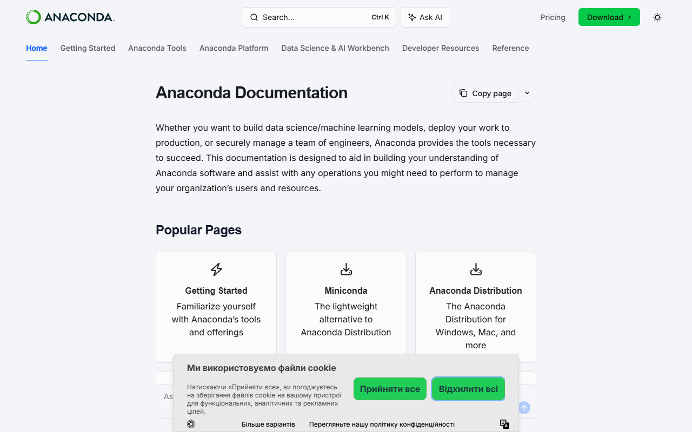
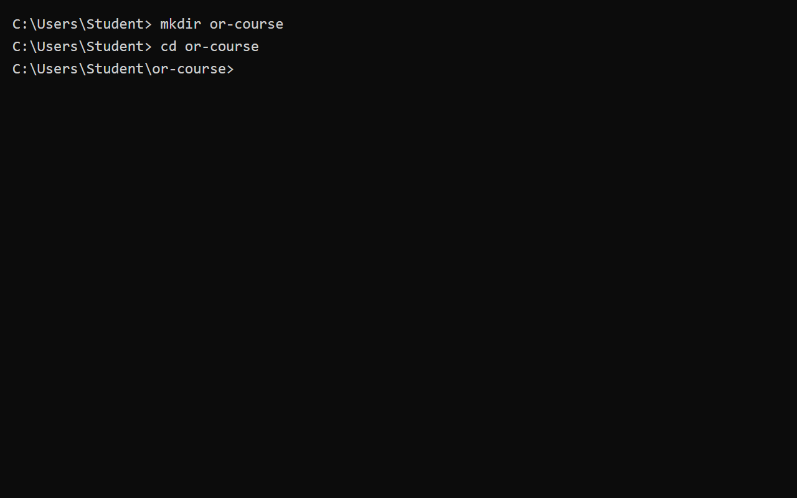
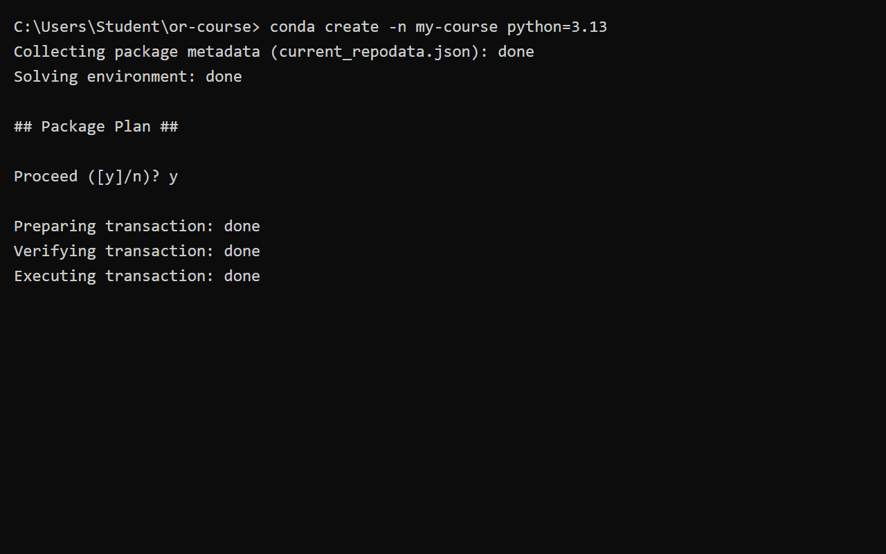
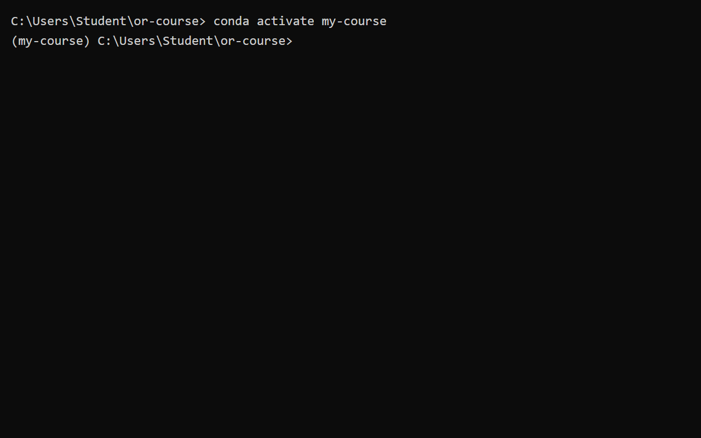
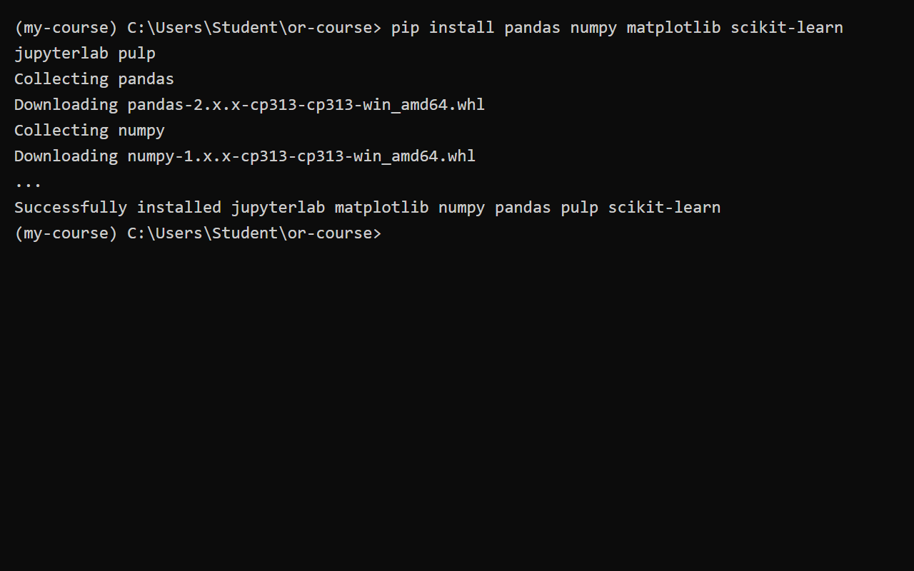
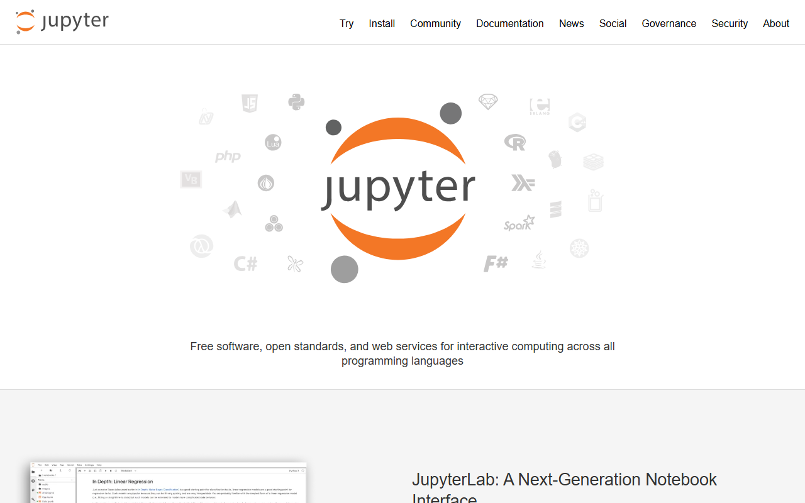
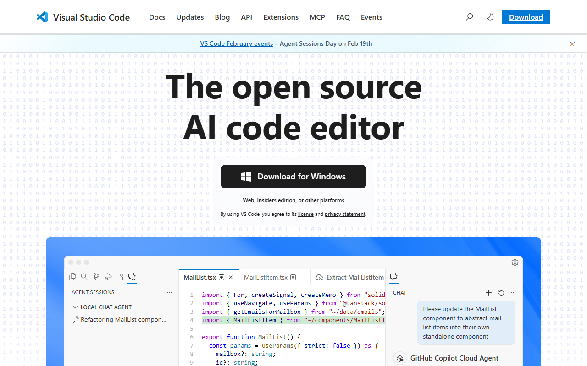
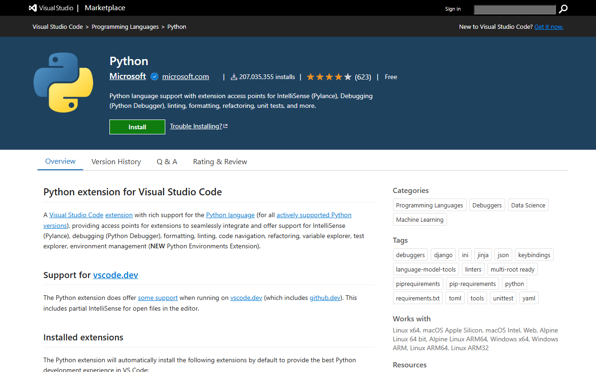
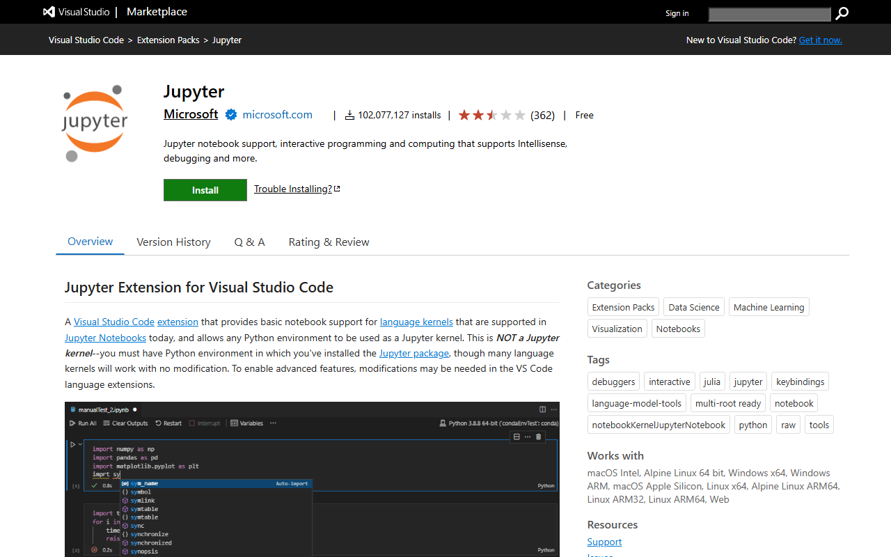

# Налаштування середовища для написання коду з Python

Налаштування власного середовища для програмування методів "Дослідження операцій та основ теорії прийняття рішень" може здатися складним завданням для початківців. Проте, правильно налаштоване середовище — це запорука продуктивної роботи, уникнення конфліктів між бібліотеками та зручного написання коду.

В цьому прикладному посібнику ми крок за кроком розглянемо налаштування середовища на вашому власному локальному або віддаленому ПК. За такого підходу ви матимете повний контроль та гнучкість у розробленні і тестуванні вашого коду.

> **Зауваження:** Це налаштування повністю опирається на операційну систему **Windows**. Якщо ви використовуєте macOS або Linux, концепції залишаються тими ж, але команди терміналу та процеси інсталяції можуть дещо відрізнятися (у такому разі варто звернутися до офіційної документації Python або Anaconda).

---

## Етапи локального налаштування для системи Windows

### Крок 1. Завантаження та інсталяція Anaconda

Anaconda — це один з найпопулярніших дистрибутивів мови Python, який містить у собі менеджер пакетів та середовищ `conda`. Завдяки `conda`, створення ізольованих середовищ для різних проєктів стає надзвичайно простим.

1. Перейдіть на офіційний сайт та [завантажте Anaconda](https://www.anaconda.com/download).
2. Запустіть інсталятор та дотримуйтесь інструкцій. Рекомендується інсталювати Anaconda за шляхом, який пропонується за замовчуванням. Головна мета цього кроку — отримати доступ до інструменту `conda` у вашому командному рядку.


> *Корисна примітка:* Якщо у вас повільний інтернет або недостатньо фізичної пам'яті на диску (зокрема на диску `C:\`), ви можете завантажити та інсталювати значно легший дистрибутив під назвою [Miniconda](https://docs.anaconda.com/free/miniconda/index.html). Він містить лише сам Python та `conda` без зайвих попередньо встановлених бібліотек.
>
> 

---

### Крок 2. Створення робочої теки (директорії) для курсу

Для організаційного порядку створимо окрему теку, де будуть зберігатися всі файли курсу та проєкти. Відкрийте ваш командний рядок (Command Prompt) або термінал Anaconda (Anaconda Prompt) та виконайте наступні команди:

```bash
mkdir or-course
cd or-course
```

Команда `mkdir` створює нову папку, а `cd` — переходить до неї.



---

### Крок 3. Створення віртуального середовища conda

Віртуальне середовище дозволяє ізолювати бібліотеки, потрібні для цього курсу, від інших ваших проєктів. Це гарантує, що оновлення однієї бібліотеки не зламає інший скрипт.

Наступна команда створить середовище з назвою `my-course` та інсталює Python версії 3.13. Середовище фізично буде розташоване в теці `anaconda3\envs` на вашому ПК:

```bash
conda create -n my-course python=3.13
```

Під час виконання команди `conda` збере інформацію про пакети та запитає у вас підтвердження `Proceed ([y]/n)?`. Натисніть `y` (англійську) та `Enter`.



---

### Крок 4. Активація віртуального середовища

Тепер, коли середовище створено, його необхідно активувати. Лише після активації ми зможемо встановлювати бібліотеки саме в це ізольоване середовище.

```bash
conda activate my-course
```

Після виконання цієї команди ви побачите зміну в командному рядку: перед поточним шляхом з'явиться назва середовища в дужках — `(my-course)`. Це свідчить про успішну активацію.



---

### Крок 5. Встановлення необхідних бібліотек

Маючи активоване середовище, ми можемо встановити бібліотеки, які знадобляться для проходження курсу, наприклад популярний математичний пакет [PuLP](https://coin-or.github.io/pulp/), `pandas`, `numpy` та інші.

Ви можете скористатися менеджером пакетів `pip` та інсталювати все однією командою:

```bash
pip install pandas numpy matplotlib scikit-learn jupyterlab pulp
```

Цей процес може зайняти декілька хвилин залежно від швидкості вашого інтернету.



---

### Крок 6. Перевірка роботи Jupyter Lab та пакетів

Переконайтеся, що встановлення Anaconda та супутніх бібліотек пройшло успішно, запустивши сервер **Jupyter Lab**. Ця команда відкриє локальний веб-сервер у вашому браузері:

```bash
jupyter lab
```



Після відкриття Jupyter Lab у браузері, натисніть на іконку **Python 3 (ipykernel)**, щоб створити новий Notebook. У найпершій комірці (cell) виконайте наступний тестовий фрагмент коду:

```python
import pandas as pd
import numpy as np
import pulp as pl
import matplotlib

# Перевірте доступ до пакету лінійного програмування PuLP
# Нижче виведено список усіх доступних солверів
solver_list = pl.listSolvers()
print("Доступні солвери:", solver_list)
```

Щоб виконати комірку, натисніть `Shift + Enter`. Якщо вивід не містить помилок і показує список солверів, ви все налаштували правильно!

---

### Крок 7. Завантаження та налаштування Visual Studio Code

Хоча Jupyter Lab — чудовий інструмент, для написання великих скриптів і модулів справжні професіонали використовують інтегровані середовища розробки (IDE). Найкращим вибором є **Visual Studio Code (VS Code)**.

1. Перейдіть на офіційний сайт та [завантажте VS Code](https://code.visualstudio.com/).
2. Інсталюйте програму як зазвичай (з усіма налаштуваннями за замовчуванням).



---

### Крок 8. Встановлення розширень для VS Code

Щоб VS Code став потужним редактором саме для Python, необхідно встановити спеціальні розширення.

1. Відкрийте VS Code та перейдіть на вкладку **Extensions** (квадратики на лівій панелі інструментів або комбінація клавіш `Ctrl+Shift+X`).
2. Введіть у пошук `Python` та інсталюйте офіційне розширення від Microsoft.

- [Посилання на розширення Python](https://marketplace.visualstudio.com/items?itemName=ms-python.python)



1. Далі введіть у пошук `Jupyter` та інсталюйте його. Воно дозволить вам запускати та редагувати Jupyter Notebooks просто всередині VS Code!

- [Посилання на розширення Jupyter](https://marketplace.visualstudio.com/items?itemName=ms-toolsai.jupyter)



---

### Крок 9. Підключення віртуального середовища у VS Code

Тепер залишається останній крок: розповісти розширенню Python, яке саме оточення використовувати.

1. Відкрийте створену раніше теку `or-course` у VS Code (`File` -> `Open Folder...`).
2. Створіть новий файл, наприклад `test.py`.
3. У правому нижньому куті (на статус-барі) ви побачите версію Python. Натисніть на неї. (Або натисніть `Ctrl+Shift+P` і введіть `Python: Select Interpreter`).
4. У випадаючому списку виберіть створене нами середовище `my-course`.
5. Тепер VS Code підсвічуватиме ваш код, пропонуватиме автодоповнення і запускатиме скрипти використовуючи правильні версії встановлених бібліотек (pandas, numpy, pulp).

*Більш детальну інформацію щодо оточень у VS Code можна знайти в [офіційному туторіалі](https://code.visualstudio.com/docs/python/environments).*

---

### Вітаємо

Ви успішно налаштували професійне середовище для розробки. Тепер ви готові до вивчення дослідження операцій, обробки даних та написання надійного коду мовою Python! 🎉
